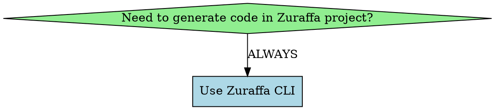

# Zuraffa CLI (zfa) Skill

## Overview

Zuraffa CLI (`zfa`) is the **ONLY** way to generate code in Zuraffa projects. Never manually create entities, never run `build_runner` directly, never write boilerplate by hand.

**Core principle:** One command generates everything - entities, all layers, UI, tests, DI. Use the CLI for ALL code generation.

## When to Use



**Use when:**
- Creating entities, enums, or data models
- Generating CRUD UseCases for entities
- Creating custom UseCases with repositories or services
- Adding data layer (DataRepository, DataSource)
- Setting up caching with dual datasources
- Generating dependency injection files
- Creating mock data for testing
- Generating unit tests for UseCases
- Adding GraphQL queries/mutations
- Orchestrating multiple UseCases
- Creating polymorphic UseCase variants
- **Generating UI layers (Views, Presenters, Controllers, State)**

**NEVER:**
- Manually create entity files → Use `zfa entity create`
- Run `build_runner` directly → Use `zfa build`
- Manually write repository/usecase boilerplate → Use `zfa generate`
- Hand-write View/Presenter/Controller → Use `zfa generate --vpc`

## Quick Reference

### Entity Generation

```bash
# Create entity with fields (NEVER create manually)
zfa entity create -n User --field name:String --field email:String?

# Create enum
zfa entity enum -n Status --value active,inactive,pending

# Create entity from JSON
zfa entity from-json user_data.json

# List entities
zfa entity list

# Build generated code (NEVER run build_runner directly)
zfa build
zfa build --watch
zfa build --clean
```

### Complete Feature Generation (All Layers)

```bash
# Generate EVERYTHING - domain, data, presentation, tests, DI
zfa generate Product \
  --methods=get,getList,create,update,delete,watchList \
  --data \
  --vpc \
  --state \
  --cache \
  --di \
  --test

# That's it - one command, complete feature
```

### Domain Layer Only

```bash
# Generate UseCases for entity (repository auto-created)
zfa generate Product --methods=get,getList,create,update,delete,watchList

# Custom UseCase with repository
zfa generate SearchProduct --domain=search --repo=Product --params=Query --returns=List<Product>

# Custom UseCase with service (for non-entity operations)
zfa generate ProcessPayment --domain=payment --service=Payment --params=PaymentRequest --returns=PaymentResult

# Orchestrator (compose UseCases)
zfa generate ProcessCheckout --domain=checkout --usecases=ValidateCart,ProcessPayment --params=Request --returns=Order

# Background UseCase (CPU-intensive)
zfa generate ProcessImages --type=background --params=ImageBatch --returns=ProcessedImage

# Sync UseCase (validation, calculations)
zfa generate ValidateEmail --type=sync --params=String --returns=bool
```

### Data Layer Only

```bash
# Generate DataRepository + DataSource
zfa generate Product --methods=get,getList,create --data

# With caching
zfa generate Product --methods=get,getList --data --cache --cache-policy=daily

# With GraphQL
zfa generate Product --methods=get,create --data --gql --gql-returns="id,name,price"

# Append method to existing repository
zfa generate WatchProduct --domain=product --repo=Product --params=String --returns=Stream<Product> --type=stream --append
```

### Presentation Layer (UI) Only

```bash
# Generate View + Presenter + Controller
zfa generate Product --methods=get,getList,create --vpc

# Generate with State object
zfa generate Product --methods=get,getList,create --vpcs

# Generate Presenter + Controller only (preserve custom View)
zfa generate Product --methods=get,getList --pc

# Generate Presenter + Controller + State (preserve custom View)
zfa generate Product --methods=get,getList --pcs
```

### Testing & Mock Data

```bash
# Generate unit tests
zfa generate Product --methods=get,create,update --test

# Generate mock data
zfa generate Product --mock

# Mock data only
zfa generate Product --mock-data-only
```

### Dependency Injection

```bash
# Generate DI files
zfa generate Product --methods=get,getList --data --di

# Use mock datasource in DI
zfa generate Product --methods=get,getList --data --mock --di --use-mock

# With cache initialization
zfa generate Config --methods=get --data --cache --di
```

## Entity Location Convention

**CRITICAL:** Entities MUST be placed at:
```
lib/src/domain/entities/{entity_snake}/{entity_snake}.dart
```

Example for `Product`:
```
lib/src/domain/entities/product/product.dart
```

**NEVER create this file manually** - always use:
```bash
zfa entity create -n Product --field name:String --field price:double
```

## Available Methods

| Method | UseCase Type | Description |
|--------|--------------|-------------|
| `get` | `UseCase` | Get single entity by ID |
| `getList` | `UseCase` | Get all entities |
| `create` | `UseCase` | Create new entity |
| `update` | `UseCase` | Update existing entity |
| `delete` | `CompletableUseCase` | Delete entity by ID |
| `watch` | `StreamUseCase` | Watch single entity changes |
| `watchList` | `StreamUseCase` | Watch all entities changes |

## Command Flags Reference

### Entity-Based Generation

| Flag | Short | Description |
|------|-------|-------------|
| `--methods=<list>` | `-m` | Comma-separated methods to generate |
| `--data` | `-d` | Generate DataRepository + DataSource |
| `--datasource` | | Generate DataSource only |
| `--id-field=<name>` | | ID field name (default: `id`) |
| `--id-field-type=<type>` | | ID field type (default: `String`) |
| `--query-field=<name>` | | Query field name for `get`/`watch` (default: `id`) |
| `--query-field-type=<type>` | | Query field type (default: matches id-type) |
| `--zorphy` | | Use Zorphy-style typed patches |
| `--init` | | Add initialize method & isInitialized stream to repos |
| `--append` | | Append method to existing repository/datasource |

### Presentation Layer Generation (UI)

| Flag | Description |
|------|-------------|
| `--vpc` | Generate View + Presenter + Controller |
| `--vpcs` | Generate View + Presenter + Controller + State (shorthand for --vpc --state) |
| `--pc` | Generate Presenter + Controller only (preserve custom View) |
| `--pcs` | Generate Presenter + Controller + State (preserve custom View) |
| `--state` | Generate State object with granular loading states |

### GraphQL Generation

| Flag | Description |
|------|-------------|
| `--gql` | Enable GraphQL generation |
| `--gql-type` | Operation type: query, mutation, subscription (auto-detected) |
| `--gql-returns` | Return fields as comma-separated string |
| `--gql-input-type` | Input type name |
| `--gql-input-name` | Input variable name (default: input) |
| `--gql-name` | Custom operation name |

**Auto-detection for entity methods:**
- `get`, `getList` → query
- `create`, `update`, `delete` → mutation
- `watch`, `watchList` → subscription

### Custom UseCase Options

| Flag | Description |
|------|-------------|
| `--repo=<name>` | Repository to inject (single, enforces SRP) |
| `--service=<name>` | Service to inject (alternative to `--repo`) |
| `--domain=<name>` | Domain folder (required for custom UseCases) |
| `--type=<type>` | UseCase type: `usecase`, `stream`, `background`, `completable`, `sync` |
| `--params=<type>` | Params type (default: `NoParams`) |
| `--returns=<type>` | Return type (default: `void`) |
| `--usecases=<list>` | Orchestrator: compose UseCases |
| `--variants=<list>` | Polymorphic: generate variants |

### Caching

| Flag | Description |
|------|-------------|
| `--cache` | Enable caching with dual datasources (remote + local) |
| `--cache-policy` | Cache expiration: `daily`, `restart`, `ttl` (default: daily) |
| `--cache-storage` | Local storage: `hive`, `sqlite`, `shared_preferences` (default: hive) |
| `--ttl` | TTL duration in minutes (default: 1440 = 24 hours) |

### Testing & Mock Data

| Flag | Description |
|------|-------------|
| `--test` | Generate unit tests for each UseCase |
| `--mock` | Generate mock data files alongside other layers |
| `--mock-data-only` | Generate only mock data files |

### Dependency Injection

| Flag | Description |
|------|-------------|
| `--di` | Generate dependency injection files (get_it) |
| `--use-mock` | Use mock datasource in DI (default: remote datasource) |

### Additional Features

| Flag | Short | Description |
|------|-------|-------------|
| `--force` | | Overwrite existing files |
| `--dry-run` | | Preview without writing files |
| `--format=<type>` | | Output format: `json` or `text` |
| `--verbose` | `-v` | Verbose output |
| `--quiet` | `-q` | Minimal output (errors only) |

## Use Case Types

| Type | Description | Use When |
|------|-------------|----------|
| `usecase` (default) | Single request-response operations | CRUD, API calls |
| `stream` | Real-time data streams | WebSocket, Firebase listeners |
| `background` | CPU-intensive work on isolates | Image processing, crypto |
| `completable` | No return value | Delete, logout, clear cache |
| `sync` | Synchronous operations | Validation, calculations, transformations |

## Repository vs Service

**Use `--repo` for:**
- CRUD operations on entities
- Data persistence/retrieval
- Entity-centric operations
- Cache/database access

**Use `--service` for:**
- External API integrations
- Third-party service calls
- Business logic not involving entities
- Payment gateways, auth providers

## Layer Structure

```
lib/src/
├── domain/                    # Pure Dart business logic
│   ├── entities/              # Business objects (NEVER create manually)
│   ├── repositories/          # Repository interfaces (contracts)
│   ├── services/              # Service interfaces (alternative to repos)
│   └── usecases/              # Business operations
│       ├── {entity}/          # Entity-specific usecases
│       └── {domain}/          # Domain-specific usecases
├── data/                      # External dependencies
│   ├── data_sources/          # Data source implementations
│   │   └── {entity}/
│   │       ├── graphql/       # GraphQL operations
│   │       ├── {entity}_data_source.dart
│   │       └── {entity}_remote_data_source.dart
│   ├── providers/             # Service provider implementations
│   └── repositories/          # Repository implementations
├── presentation/              # UI layer (use --vpc)
│   └── pages/
│       └── {entity}/
│           ├── {entity}_view.dart
│           ├── {entity}_presenter.dart
│           ├── {entity}_controller.dart
│           └── {entity}_state.dart
└── di/                        # Dependency injection
    ├── datasources/
    ├── repositories/
    ├── usecases/
    └── index.dart
```

## Common Workflows

### Workflow 1: Complete Feature (Recommended)

```bash
# One command - generates EVERYTHING
zfa generate Product \
  --methods=get,getList,create,update,delete,watchList \
  --data \
  --vpc \
  --state \
  --cache \
  --di \
  --test

# Build the generated entities
zfa build

# That's it - feature complete
```

### Workflow 2: Domain First, Then UI

```bash
# 1. Create entity
zfa entity create -n Product --field name:String --field price:double
zfa build

# 2. Generate domain + data layer
zfa generate Product --methods=get,getList,create,update,delete --data

# 3. Generate UI layer
zfa generate Product --methods=get,getList,create --vpc --state

# 4. Implement DataSource (manual - only this part)
# 5. Register with DI
zfa generate Product --methods=get,getList --data --di
```

### Workflow 3: Custom UseCase with Orchestrator

```bash
# 1. Create atomic UseCases
zfa generate ValidateCart --repo=Cart --domain=checkout --params=CartId --returns=bool
zfa generate CreateOrder --repo=Order --domain=checkout --params=OrderData --returns=Order
zfa generate ProcessPayment --service=Payment --domain=checkout --params=PaymentData --returns=Receipt

# 2. Orchestrate them
zfa generate ProcessCheckout \
  --usecases=ValidateCart,CreateOrder,ProcessPayment \
  --domain=checkout \
  --params=CheckoutRequest \
  --returns=Order

# 3. Generate UI for orchestrator
zfa generate ProcessCheckout --domain=checkout --vpc --state
```

### Workflow 4: Adding Method to Existing Entity

```bash
# Add watch method to existing entity
zfa generate WatchProduct --domain=product --repo=Product --params=String --returns=Stream<Product> --type=stream --append

# If UI exists, regenerate presenter/controller
zfa generate Product --methods=watch --pc --force
```

## Cache Policies

| Policy | Description | Use Case |
|--------|-------------|----------|
| `DailyCachePolicy` | Cache expires after 24 hours | Data that updates daily |
| `AppRestartCachePolicy` | Cache valid only during app session | Config data, user preferences |
| `TtlCachePolicy` | Custom expiration duration | Fine-grained cache control |

## File Naming Conventions

| Type | Pattern | Example |
|------|---------|---------|
| Entity | `{entity_snake}.dart` | `product.dart` |
| Repository | `{entity_snake}_repository.dart` | `product_repository.dart` |
| Service | `{service}_service.dart` | `payment_service.dart` |
| Provider | `{service}_provider.dart` | `payment_provider.dart` |
| UseCase | `{action}_{entity_snake}_usecase.dart` | `get_product_usecase.dart` |
| DataSource | `{entity_snake}_data_source.dart` | `product_data_source.dart` |
| RemoteDataSource | `{entity_snake}_remote_data_source.dart` | `product_remote_data_source.dart` |
| View | `{entity_snake}_view.dart` | `product_view.dart` |
| Presenter | `{entity_snake}_presenter.dart` | `product_presenter.dart` |
| Controller | `{entity_snake}_controller.dart` | `product_controller.dart` |
| State | `{entity_snake}_state.dart` | `product_state.dart` |

## JSON Configuration

### Entity-Based Configuration
```json
{
  "name": "Product",
  "methods": ["get", "getList", "create", "update", "delete", "watchList"],
  "data": true,
  "vpc": true,
  "state": true,
  "cache": true,
  "cachePolicy": "daily",
  "di": true,
  "test": true
}
```

### Custom UseCase Configuration
```json
{
  "name": "SearchProduct",
  "domain": "search",
  "repo": "Product",
  "params": "Query",
  "returns": "List<Product>",
  "type": "usecase"
}
```

## Common Mistakes

| Mistake | Fix |
|---------|-----|
| Creating entity files manually | Use `zfa entity create -n EntityName` |
| Running `dart run build_runner build` | Use `zfa build` |
| Hand-writing repository boilerplate | Use `zfa generate Entity --methods=...` |
| Manually writing View/Controller | Use `zfa generate Entity --vpc` |
| Entity not found errors | Ensure entity exists at `lib/src/domain/entities/{entity_snake}/{entity_snake}.dart` |
| Files not overwritten | Use `--force` flag to overwrite existing files |
| Missing repository methods | Use `--append` to add methods to existing repository |
| Cache not working | Call `initAllCaches()` before DI setup in `main()` |
| Tests failing | Run `zfa build` to generate entity code first |
| DI not working | Call `setupDependencies(getIt)` after cache initialization |

## Golden Rules

1. **NEVER create entity files manually** → Always use `zfa entity create`
2. **NEVER run build_runner directly** → Always use `zfa build`
3. **NEVER write boilerplate by hand** → Always use `zfa generate`
4. **NEVER manually create View/Presenter/Controller** → Always use `zfa generate --vpc`
5. **ALWAYS use CLI for all code generation** → One command, complete layers

## Troubleshooting

### Entity Not Found
```
Error: Entity 'Product' not found at expected path
```
**Fix:** Create entity first:
```bash
zfa entity create -n Product --field name:String
zfa build
```

### Overwriting Files
Use `--force` flag:
```bash
zfa generate Product --methods=get,getList --force
```

### Preview Generation
```bash
zfa generate Product --methods=get --dry-run --format=json
```

## Advanced Features

### Polymorphic Pattern
Generate abstract base + concrete variants + factory:
```bash
zfa generate SparkSearch \
  --type=stream \
  --variants=Barcode,Url,Text \
  --domain=search \
  --repo=Search \
  --params=Spark \
  --returns=Listing
```

### GraphQL with Custom Fields
```bash
zfa generate Order --methods=get --gql \
  --gql-returns="id,createdAt,customer{id,name},items{id,quantity,price}"
```

### Sync UseCase for Validation
```bash
zfa generate ValidateEmail --type=sync --params=String --returns=bool
```

Generates:
```dart
class ValidateEmailUseCase extends SyncUseCase<bool, String> {
  @override
  bool execute(String email) {
    return RegExp(r'^[\w-\.]+@([\w-]+\.)+[\w-]{2,4}$').hasMatch(email);
  }
}
```

## CLI vs Manual Work

| Task | CLI Command | Manual? |
|------|-------------|---------|
| Create entity | `zfa entity create` | ❌ NEVER |
| Build code | `zfa build` | ❌ NEVER |
| Generate UseCases | `zfa generate Entity --methods=...` | ❌ NEVER |
| Generate UI | `zfa generate Entity --vpc` | ❌ NEVER |
| Generate DI | `zfa generate Entity --di` | ❌ NEVER |
| Generate tests | `zfa generate Entity --test` | ❌ NEVER |
| Implement DataSource logic | N/A | ✅ Only manual part |
| Customize View UI | N/A | ✅ After generation |

**The CLI handles 95% of boilerplate. Only implement business logic and customize UI.**
