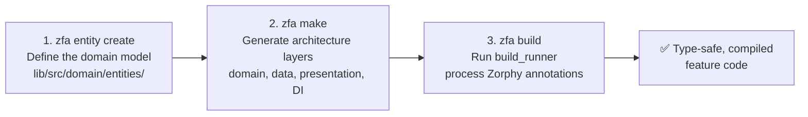
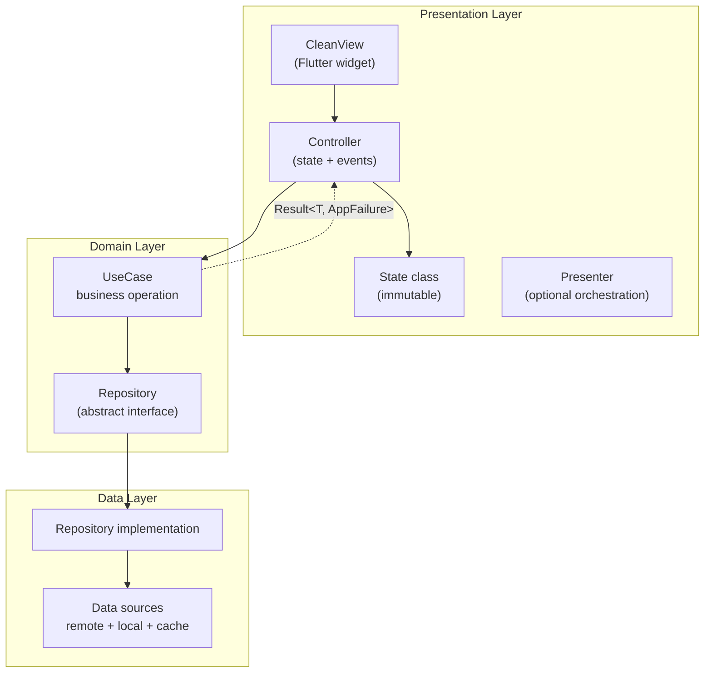
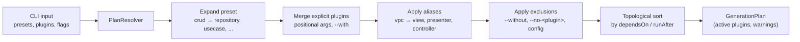

Welcome to Zuraffa — an **AI-first Clean Architecture framework for Flutter** that generates production-ready, type-safe feature layers from simple CLI commands. This page gives you the big picture: what Zuraffa is, the one canonical workflow it teaches, what it generates, and how the pieces fit together. Everything else in this documentation builds on the foundation laid here.

## What is Zuraffa?

Zuraffa is a code generation framework and runtime library published as the `zuraffa` Dart package (v5.7.1). It ships three command-line executables: `zfa` (the main generator CLI), `zuraffa`, and `zuraffa_mcp_server` (a Model Context Protocol server that exposes the CLI to AI agents). The package description summarizes its scope: *"AI first Flutter Clean Architecture Framework and CLI with Result types, UseCase patterns, Dependency Injection and MCP server for building type-safe, scalable apps with AI agents."*

Sources: [pubspec.yaml](pubspec.yaml#L1-L8), [bin/zfa.dart](bin/zfa.dart#L1-L12), [bin/zuraffa_mcp_server.dart](bin/zuraffa_mcp_server.dart#L1-L40)

Zuraffa combines two complementary surfaces:

- **A generation CLI** (`zfa`) that writes Clean Architecture skeletons — entities, use cases, repositories, data sources, controllers, views, DI registrations, routes, tests, mocks, cache, and sync layers — into a fixed `lib/src` layout.
- **A runtime framework** (imported via `package:zuraffa/zuraffa.dart`) that provides the base classes your generated code extends: `UseCase`, `StreamUseCase`, `SyncUseCase`, `BackgroundUseCase`, `Controller`, `CleanView`, `Result<T, AppFailure>`, and the sealed `AppFailure` hierarchy.

Sources: [README.md](README.md#L1-L10), [lib/zuraffa.dart](lib/zuraffa.dart#L1-L50)

The core design principle is **predictability**. Zuraffa is "AI-native" in the sense that its structure is easy for both humans and coding agents to navigate: a deterministic pipeline, fixed folder conventions, and no randomness in output. Given the same inputs, `zfa make` produces identical output every time. This makes generated code reviewable, testable, and safe to regenerate.

Sources: [README.md](README.md#L31-L45), [openwiki/architecture.md](openwiki/architecture.md#L175-L190)

## The Canonical Three-Step Workflow

Zuraffa v5 standardizes code generation around **one canonical workflow** with exactly three commands:

```text
zfa entity create  →  zfa make  →  zfa build
```



Each step has a distinct responsibility:

| Step | Command | What happens | Where output lives |
|---|---|---|---|
| 1. Model | `zfa entity create -n Product --field ...` | Creates a Zorphy-annotated immutable entity definition | `lib/src/domain/entities/{entity_snake}/` |
| 2. Generate | `zfa make Product --preset=crud ...` | Resolves a deterministic plan and writes all architecture layers | `lib/src/domain`, `lib/src/data`, `lib/src/presentation`, `lib/src/di` |
| 3. Build | `zfa build` | Invokes `build_runner` to process annotations and produce serialization/DI code | `.dart_tool/build` (generated `.g.dart`, `.zorphy.dart` files) |

Sources: [README.md](README.md#L55-L95), [CLI_GUIDE.md](CLI_GUIDE.md#L1-L30), [lib/src/commands/build_command.dart](lib/src/commands/build_command.dart#L1-L60)

### Step 1 — Define the entity

Entities are always Zorphy-annotated and live under the fixed domain root `lib/src/domain/entities/{entity_snake}/{entity_snake}.dart`. The command validates your environment first (checking for `zorphy_annotation` and `build_runner` in `pubspec.yaml`) before writing anything.

```bash
zfa entity create -n Product \
  --field id:String \
  --field name:String \
  --field price:double \
  --field description:String?
```

The result is a minimal, hand-readable entity definition. Zuraffa's build step later generates the full immutable class with `copyWith`, equality, JSON serialization, and patch support:

```dart
@Zorphy(generateJson: true, generateFilter: true)
abstract class $Product {
  String get id;
  String get name;
  String get description;
  double get price;
  DateTime get createdAt;
}
```

Sources: [lib/src/commands/entity_command.dart](lib/src/commands/entity_command.dart#L1-L70), [example/lib/src/domain/entities/product/product.dart](example/lib/src/domain/entities/product/product.dart#L1-L14)

### Step 2 — Generate the architecture

`zfa make` is the **primary generation surface**. It parses the entity name, optional flags, presets, and aliases, then resolves them into a normalized execution plan before writing a single file. You can preview that plan with `--plan` or `--explain` without touching the disk.

```bash
zfa make Product \
  --preset=crud \
  --methods=get,getList,create,update,delete \
  --with=vpc \
  --state \
  --di \
  --test
```

This expands into a plan that generates domain (use cases, repository interface), data (data source, repository implementation), presentation (view, presenter, controller, state), DI registration, and test files for `Product`. The generated use case is small and idiomatic — it extends the framework's `UseCase` base class and returns `Result<Product, AppFailure>`:

```dart
class GetProductUseCase extends UseCase<Product, QueryParams<Product>> {
  GetProductUseCase(this._repository);
  final ProductRepository _repository;

  @override
  Future<Product> execute(QueryParams<Product> params, CancelToken? cancelToken) async {
    cancelToken?.throwIfCancelled();
    return _repository.get(params);
  }
}
```

Sources: [lib/src/commands/make_command.dart](lib/src/commands/make_command.dart#L1-L100), [example/lib/src/domain/usecases/product/get_product_usecase.dart](example/lib/src/domain/usecases/product/get_product_usecase.dart#L1-L20)

### Step 3 — Build the generated code

`zfa build` wraps `build_runner` so docs and agent workflows never call `build_runner` directly. It counts entities and Dart files before running, and if the build fails it automatically retries with a cleaned `.dart_tool/build` cache — a common fix for stale-cache errors:

```bash
zfa build
# 🔨 Running build_runner build...
#    Entities: 1, Dart files: 42
# ✅ Build completed successfully
```

Sources: [lib/src/commands/build_command.dart](lib/src/commands/build_command.dart#L1-L103), [AGENTS.md](AGENTS.md#L1-L40)

### The pipeline rule for AI agents

If an AI agent is asked to build a feature, the contract is: generate architecture with `zfa`, not by hand. Agents should ask three questions in order — *Does a new entity exist?* → `zfa entity create`. *Does the architecture skeleton need to exist or change?* → `zfa make`. *Do generated annotations need finalizing?* → `zfa build`. Hand-crafted work narrows to business logic, data source implementations, styling, and manual UI composition **after** the pipeline runs.

Sources: [README.md](README.md#L199-L230), [AGENTS.md](AGENTS.md#L10-L40)

## What Zuraffa Generates: The Plugin System

Behind `zfa make` is a **plugin system**: every generated layer is produced by a self-contained plugin. The CLI loads all built-in plugins through a `PluginLoader`, registers them in a singleton `PluginRegistry`, and then executes only the plugins selected by the resolved plan. Each plugin exposes a standard lifecycle — `validate`, `beforeGenerate`, `generateWithContext`, `afterGenerate`, `onError` — and can declare dependencies on other plugins (`dependsOn`) or soft ordering (`runAfter`).

Sources: [lib/src/cli/plugin_loader.dart](lib/src/cli/plugin_loader.dart#L1-L133), [lib/src/core/plugin_system/plugin_interface.dart](lib/src/core/plugin_system/plugin_interface.dart#L1-L84), [lib/src/core/plugin_system/plugin_registry.dart](lib/src/core/plugin_system/plugin_registry.dart#L1-L80)

| Plugin ID | Generated layer | Belongs in catalog page |
|---|---|---|
| `entity` | Zorphy entity definitions | [Zorphy Entity Creation](4-zorphy-entity-creation) |
| `repository` | Repository interface + data implementation | [Generated Project Layout](5-generated-project-layout) |
| `usecase` | Business operation classes | [UseCase Hierarchy & the Result Pattern](10-usecase-hierarchy-and-the-result-pattern) |
| `datasource` | Remote (HTTP) / local (Hive) data sources | [Cache Policies & Dual DataSource Pattern](15-cache-policies-and-dual-datasource-pattern) |
| `view`, `presenter`, `controller`, `state` | Presentation layer (VPC) | [Presentation Layer: Controller, View & Presenter](12-presentation-layer-controller-view-and-presenter) |
| `di` | `get_it` service-locator registrations | [Dependency Injection Generation](17-dependency-injection-generation) |
| `route` | GoRouter route definitions | [Generated Project Layout](5-generated-project-layout) |
| `test` | Unit tests for generated layers | [Testing Strategy & Result Matchers](26-testing-strategy-and-result-matchers) |
| `mock` | Mock data providers | [Mock Data Generation](18-mock-data-generation) |
| `cache` | Hive cache initialization + policies | [Cache Policies & Dual DataSource Pattern](15-cache-policies-and-dual-datasource-pattern) |
| `sync` | Offline-first sync metadata + strategies | [Offline-First Sync Strategies](16-offline-first-sync-strategies) |
| `graphql` / `gql` | GraphQL schema generation | [GraphQL Schema Generation](19-graphql-schema-generation) |
| `method_append` | AST-based method appending to existing classes | [AST-Based Code Modification](21-ast-based-code-modification) |
| `feature` | Feature scaffolding coordinator (wraps the feature preset) | [Plugin System Architecture](7-plugin-system-architecture) |

Sources: [lib/src/cli/plugin_loader.dart](lib/src/cli/plugin_loader.dart#L60-L133), [openwiki/architecture.md](openwiki/architecture.md#L40-L90)

The plugin system is also the extension point for custom generators — plugins can be built, registered, and driven through the same plan pipeline, which is covered in [Building Custom Plugins](22-building-custom-plugins).

## The Fixed Project Layout

Zuraffa v5 assumes a **fixed architecture root** — there is no configuration for alternate folder structures. This is what makes generated projects predictable for humans and agents alike:

```text
lib/src/
├── domain/                    # Business rules (pure Dart)
│   ├── entities/              # Zorphy-annotated immutable models
│   ├── repositories/          # Abstract repository interfaces
│   └── usecases/              # Business operations
├── data/                      # Data layer implementations
│   ├── datasources/           # Remote (HTTP) + local (Hive) access
│   └── repositories/          # Repository implementations
├── presentation/              # Flutter UI
│   └── pages/                 # Views, controllers, presenters, states
├── di/                        # get_it registrations
├── cache/                     # Hive cache setup (when enabled)
└── routing/                   # GoRouter definitions (when enabled)
```

Sources: [README.md](README.md#L126-L155), [example/lib/src](example/lib/src)

Entities follow a strict per-entity folder convention: `lib/src/domain/entities/{entity_snake}/{entity_snake}.dart` — for example `lib/src/domain/entities/product/product.dart`. The layer separation mirrors classic Clean Architecture: `domain` holds enterprise business rules with no Flutter dependencies, `data` implements repository contracts against remote/local sources, and `presentation` is the UI that talks to the domain only through use cases.

Sources: [README.md](README.md#L126-L155), [example/lib/src/domain/entities/product/product.dart](example/lib/src/domain/entities/product/product.dart#L1-L14)

## The Runtime Framework Inside Generated Code

The generated skeleton is not just boilerplate — it runs on top of a small but powerful runtime framework exported by `package:zuraffa/zuraffa.dart`. The architecture of a running feature looks like this:



Every operation returns **`Result<T, AppFailure>`** — a sealed success/failure wrapper inspired by functional programming's `Either` type. Callers use `fold` or Dart's exhaustive `switch` on the sealed `AppFailure` subtypes (`NetworkFailure`, `NotFoundFailure`, `UnauthorizedFailure`, `ValidationFailure`, and more) to handle errors exhaustively and type-safely.

Sources: [lib/src/core/result.dart](lib/src/core/result.dart#L1-L120), [lib/src/core/failure.dart](lib/src/core/failure.dart#L1-L120), [example/README.md](example/README.md#L1-L60)

The framework provides four use-case base classes covering different execution shapes:

| Base class | Execution shape | Typical use |
|---|---|---|
| `UseCase<T, Params>` | Single-shot async operation returning `Result<T, AppFailure>` | CRUD operations (default) |
| `StreamUseCase<T, Params>` | Emits multiple `Result` values over time | Real-time updates, pagination, progress |
| `SyncUseCase<T, Params>` | Synchronous, immediate return | Simple computed operations |
| `BackgroundUseCase<T, Params>` | Runs on a separate isolate | CPU-intensive work |

Sources: [lib/src/domain/usecase.dart](lib/src/domain/usecase.dart#L1-L120), [lib/src/domain/stream_usecase.dart](lib/src/domain/stream_usecase.dart#L1-L80), [example/README.md](example/README.md#L1-L45)

On the presentation side, `Controller` (a `ChangeNotifier`-based state manager with built-in cancellation and lifecycle callbacks) coordinates with `CleanView` widgets; an optional `Presenter` handles complex orchestration. Views rebuild through `ControlledWidgetBuilder` for fine-grained updates. The framework also re-exports `get_it`, `go_router`, and `hive_ce` so users don't need separate dependencies.

Sources: [lib/src/presentation/controller.dart](lib/src/presentation/controller.dart#L1-L120), [lib/src/presentation/view.dart](lib/src/presentation/view.dart#L1-L80), [lib/zuraffa.dart](lib/zuraffa.dart#L150-L200)

Beyond the basics, the framework includes pluggable cross-cutting behaviors: `CachePolicy` abstractions (`Daily`, `AppRestart`, `TTL`) for the dual DataSource pattern, and `SyncStrategy` implementations (`PushOnlySyncStrategy`, `BidirectionalSyncStrategy`) for offline-first persistence.

Sources: [lib/src/core/cache_policy.dart](lib/src/core/cache_policy.dart#L1-L17), [lib/src/core/sync_strategy.dart](lib/src/core/sync_strategy.dart#L1-L50)

## Deterministic Planning: Presets, Aliases & Flags

`zfa make` never writes files directly. It first runs a **plan resolver** that converts your request into a sorted, explicit list of plugins. The resolution pipeline is:



Sources: [lib/src/core/planning/plan_resolver.dart](lib/src/core/planning/plan_resolver.dart#L1-L150), [lib/src/core/plugin_system/plugin_manager.dart](lib/src/core/plugin_system/plugin_manager.dart#L30-L120)

Built-in presets and aliases let you express a lot with very little:

| Preset | Expands to |
|---|---|
| `crud` | repository, usecase |
| `vpc` | view, presenter, controller |
| `vpc-state` | view, presenter, controller, state |
| `full-stack` | repository, usecase, view, presenter, controller, di, route, test |
| `data-layer` | repository, datasource |
| `feature` | the feature preset wrapper (used by `zfa feature scaffold`) |

Sources: [lib/src/core/plugin_system/presets.dart](lib/src/core/plugin_system/presets.dart#L1-L72), [CLI_GUIDE.md](CLI_GUIDE.md#L60-L120)

The plan can be inspected with `--plan` (print the normalized plan) or `--explain`, and the same planning system powers `zfa feature scaffold`, which is now only a wrapper over the normalized feature preset. **Determinism is a design guarantee**: identical input produces identical output, with no randomness or AI variability. Details of the resolution order live in [Presets, Aliases & Plan Resolution](8-presets-aliases-and-plan-resolution).

Sources: [lib/src/commands/make_command.dart](lib/src/commands/make_command.dart#L280-L330), [openwiki/architecture.md](openwiki/architecture.md#L175-L190)

### Safe generation: transactions and revert

All file writes go through a **transactional file system**. Files are staged in memory during generation, committed atomically at the end of the run, and discarded entirely on failure — a partial generation never leaves corrupted state. Every run persists an `EffectReport` to a `PlanStore`, which enables `zfa make --revert` to undo a generation by deleting created files and restoring previous content. This safety net is covered in depth in [Transactional File System, Revert & Plan Store](9-transactional-file-system-revert-and-plan-store).

Sources: [lib/src/core/transaction/transactional_file_system.dart](lib/src/core/transaction/transactional_file_system.dart#L1-L100), [openwiki/architecture.md](openwiki/architecture.md#L110-L130)

## Project Configuration & Memory

Zuraffa v5 separates **project defaults** from **project memory** — a mental model useful for both humans and agents:

```text
.zfa.json   ->  what this project prefers by default
.zfa/       ->  what has been planned, generated, and decided over time
```

`.zfa.json` holds active configuration: plugin defaults, disabled plugins, custom presets and aliases, UI defaults (adaptive layouts), and entity-first rules. It is created with `zfa config init`. A typical example project config enables route, DI, mock, and test generation by default while disabling the GraphQL plugin:

```json
{
  "plugins": {
    "defaults": { "route": true, "di": true, "mock": true, "test": true },
    "disabled": ["graphql"]
  },
  "planning": { "presets": {}, "aliases": {} },
  "entity": { "entityFirst": true, "jsonByDefault": true }
}
```

Sources: [lib/src/config/zfa_config.dart](lib/src/config/zfa_config.dart#L1-L150), [example/.zfa.json](example/.zfa.json#L1-L33)

The `.zfa/` directory is the canonical v5 project-memory model:

```text
.zfa/
├── plans/        # normalized generation plans
├── runs/         # execution history
├── blueprints/   # reusable generation blueprints
├── decisions/    # recorded architectural decisions
├── manifests/    # capability/plugin manifests
└── context.json  # agent context
```

Sources: [README.md](README.md#L145-L160), [CLI_GUIDE.md](CLI_GUIDE.md#L30-L50)

`zfa doctor` inspects tooling health (Dart/Flutter versions, `.zfa.json` presence, `pubspec.yaml` contents), and `zfa manifest` lists every plugin capability in JSON or MCP-tool format — the introspection surfaces for CI and AI agents. Configuration details are in [Project Memory & Configuration](25-project-memory-and-configuration).

Sources: [lib/src/commands/doctor_command.dart](lib/src/commands/doctor_command.dart#L1-L80), [lib/src/commands/manifest_command.dart](lib/src/commands/manifest_command.dart#L1-L63)

## AI-First by Design

Zuraffa is built for a world where AI agents write code alongside humans. Three design choices make this concrete:

1. **Fixed conventions as contracts.** The pipeline rule (`entity create` → `make` → `build`) and fixed `lib/src` layout give agents an unambiguous procedure with no inventing of folder structures. The AI-agent contract in `AGENTS.md` codifies hard rules: don't use the removed legacy generator, don't hand-create entities, don't call `build_runner` directly.

Sources: [AGENTS.md](AGENTS.md#L1-L40), [README.md](README.md#L199-L230)

2. **Capability system.** Every plugin exposes `ZuraffaCapability` objects with a name, description, and JSON-Schema input/output definitions — a structured interface for AI/CLI interrogation. The `--plan`/`--explain` flags let an agent preview exactly what will change before executing.

Sources: [lib/src/core/plugin_system/capability.dart](lib/src/core/plugin_system/capability.dart#L1-L80), [openwiki/architecture.md](openwiki/architecture.md#L92-L110)

3. **MCP server.** `zuraffa_mcp_server` implements the Model Context Protocol over stdio, exposing `zfa` commands as tools (`zuraffa_entity_create`, `zuraffa_make`, `zuraffa_build`, `zuraffa_doctor`, and more) plus resources like project structure. Tools execute real CLI commands — they don't echo placeholder text — so a coding agent in an MCP-capable editor (such as Zed) can drive the full generation pipeline directly. This is detailed in [MCP Server & AI Agent Workflows](24-mcp-server-and-ai-agent-workflows).

Sources: [bin/zuraffa_mcp_server.dart](bin/zuraffa_mcp_server.dart#L1-L40), [bin/zuraffa_mcp_server.dart](bin/zuraffa_mcp_server.dart#L590-L640)

## The Core CLI Commands at a Glance

| Command | Role in v5 |
|---|---|
| `zfa entity create` | Define or update Zorphy entities |
| `zfa make` | Canonical architecture generator (plan-first) |
| `zfa build` | Run the codegen/build step (wraps `build_runner`) |
| `zfa feature scaffold` | Wrapper over the normalized feature preset |
| `zfa config` | Manage `.zfa.json` project defaults |
| `zfa manifest` | Inspect available plugins and capabilities |
| `zfa doctor` | Inspect local tooling and project health |
| `zfa apply` | Execute a previously generated plan |
| `zfa cache adapter <Entity>` | Register Hive adapters for caching |

Sources: [README.md](README.md#L97-L124), [CLI_GUIDE.md](CLI_GUIDE.md#L25-L50), [AGENTS.md](AGENTS.md#L10-L25)

## Where to Go Next

If you are a beginner, the recommended reading order through this catalog is:

1. **[Quick Start](2-quick-start)** — run the canonical workflow end-to-end in a real project (5 minutes).
2. **[CLI Command Reference](3-cli-command-reference)** — every command, flag, and example in one table.
3. **[Zorphy Entity Creation](4-zorphy-entity-creation)** — how entity definitions become immutable, serializable models.
4. **[Generated Project Layout](5-generated-project-layout)** — a tour of every file the pipeline produces.
5. **[Code Generation Pipeline: From CLI to Files](6-code-generation-pipeline-from-cli-to-files)** — what happens inside `zfa make`, step by step.

From there, branch into the deep dives that match your interest: the **[Plugin System Architecture](7-plugin-system-architecture)** for how generation is extended, **[UseCase Hierarchy & the Result Pattern](10-usecase-hierarchy-and-the-result-pattern)** for the runtime framework, or **[Building Custom Plugins](22-building-custom-plugins)** if you want to add your own generator to the pipeline.