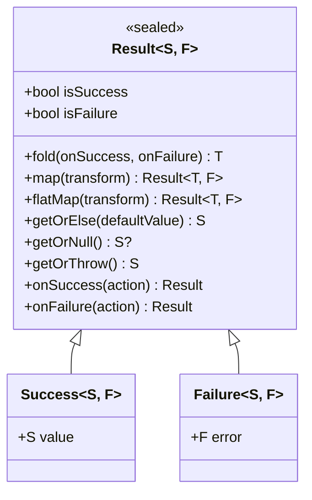
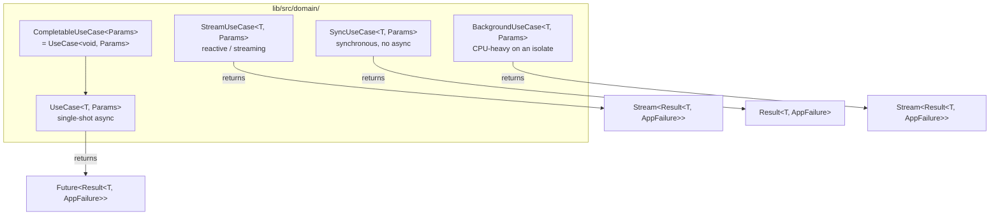
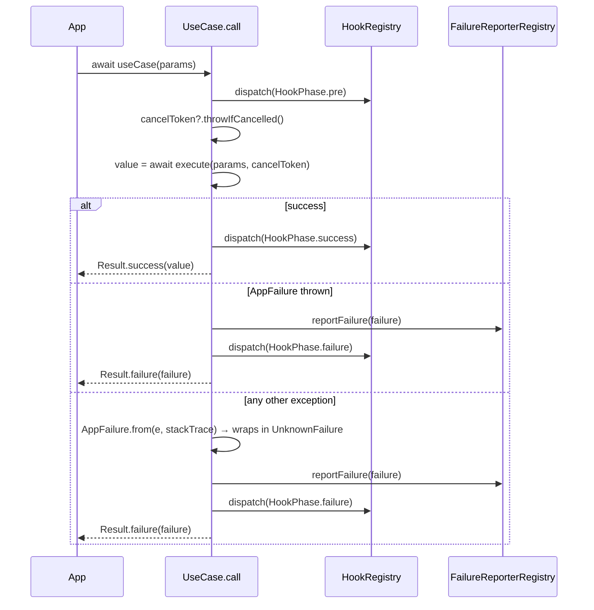
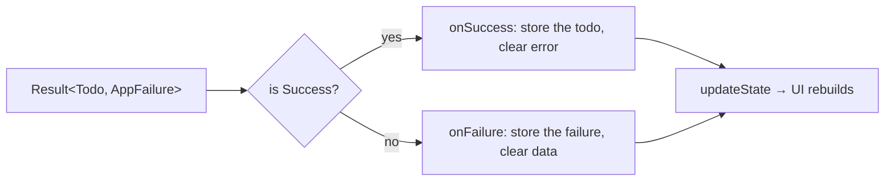

Every business operation in a Zuraffa app — "load the todo list", "create a product", "watch a concert for changes" — lives inside a small, self-contained class called a **UseCase**. And every UseCase speaks the same language when it finishes: it hands back a **Result**, a type-safe envelope that is either a success carrying a value or a failure carrying an error. This page walks through the five UseCase types Zuraffa provides, what each one is for, and how the Result pattern makes error handling predictable instead of accidental.

## Two Ideas, One Foundation

Clean Architecture separates the app into layers, and the **domain layer** is where the business rules live. Zuraffa's domain layer is built on two ideas that always appear together:

1. **A UseCase is one business operation.** It receives typed parameters, does its work (usually by calling a repository), and returns a result. It does *not* know about widgets, routes, or HTTP details.
2. **A Result is the only way a UseCase reports back.** Instead of throwing exceptions and hoping someone catches them, a UseCase always returns a `Result` object that explicitly says "here is your data" or "here is what went wrong."

Both are exported from the package root, so a generated project gets them with a single `import 'package:zuraffa/zuraffa.dart';`. The Result type and the failure hierarchy are exported as core error-handling utilities, and all four UseCase base classes are exported together under the "Domain" section.

Sources: [zuraffa.dart](lib/zuraffa.dart#L137-L141), [zuraffa.dart](lib/zuraffa.dart#L284-L297)

## The Result Pattern: Success or Failure, Nothing in Between

`Result<S, F>` is a **sealed class** with exactly two concrete subclasses: `Success<S, F>`, which wraps a value of type `S`, and `Failure<S, F>`, which wraps an error of type `F`. Because the class is sealed, these are the *only* two possibilities — the Dart compiler knows it, and so does every `switch` or `fold` you write. There is no third "maybe it threw" state to forget about.



You create a result with one of two factory constructors: `Result.success(value)` or `Result.failure(error)`. You inspect it with the `isSuccess` / `isFailure` getters. And you consume it with the methods in the table below — the most important one is `fold`, which takes two callbacks and guarantees exactly one of them runs.

Sources: [result.dart](lib/src/core/result.dart#L27-L40)

| Method | What it does | Typical use |
|---|---|---|
| `fold(onSuccess, onFailure)` | Runs exactly one callback: the first on success, the second on failure | The default way to handle a result in UI code |
| `foldAsync(...)` | Same as `fold`, but with `async` callbacks | Handling results inside async UI flows |
| `map(transform)` | Transforms the value on success; passes the failure through unchanged | Converting a `Todo` to a display string |
| `flatMap(transform)` | Chains a function that itself returns a `Result` | Sequential operations that can each fail |
| `getOrElse(default)` | Returns the value, or a fallback on failure | Supplying a default list or empty state |
| `getOrNull()` | Returns the value, or `null` on failure | Optional reads where null is acceptable |
| `getOrThrow()` | Returns the value, or throws the failure | Bridging to exception-based APIs |
| `onSuccess(action)` / `onFailure(action)` | Runs a side effect only in that branch; returns the same result | Logging, analytics, state updates |
| `toFuture()` | Converts to a future that completes or throws | Interop with `async`/`await` code |

Sources: [result.dart](lib/src/core/result.dart#L45-L104)

For async pipelines, Zuraffa adds extension methods on `Result` (`mapAsync`, `flatMapAsync`) and on `Future<Result>` (`map`, `flatMap`, `fold`, `getOrElse`, `getOrNull`), so you can chain result-producing async calls without unwrapping by hand. A separate `LoadingResult` (with `idle` and `loading` variants) exists for modeling in-progress states in the presentation layer; a UseCase itself never returns it.

Sources: [result.dart](lib/src/core/result.dart#L236-L289), [result.dart](lib/src/core/result.dart#L299-L355)

### Why not just throw exceptions?

Throwing works, but it makes failure *invisible*: nothing in the method signature tells the caller that an error can happen, and forgetting a `try/catch` crashes the app. A `Result` makes failure a **first-class value** — it appears in the return type (`Future<Result<Todo, AppFailure>>`), it must be handled explicitly, and the error type is typed (`AppFailure`), so the compiler can verify you handled it. Zuraffa's UseCases get the best of both worlds: your `execute` method can still throw (see the error-handling contract below), and the framework catches and converts those throws into a `Failure` automatically.

## The UseCase Family Tree

Zuraffa ships five UseCase base classes. They differ in three ways: whether the operation is asynchronous, whether it returns one value or many, and where the code runs (the main isolate or a background isolate).



| Base class | When to use it | Returns | Hooks & tracing | Cancellation |
|---|---|---|---|---|
| `UseCase<T, Params>` | One-shot async work: fetch, create, update | `Future<Result<T, AppFailure>>` | Yes | Yes (`CancelToken`) |
| `CompletableUseCase<Params>` | One-shot async work with no return value: delete, logout | `Future<Result<void, AppFailure>>` | Yes | Yes |
| `StreamUseCase<T, Params>` | Many values over time: real-time updates, watch lists | `Stream<Result<T, AppFailure>>` | Yes (on start, success, failure) | Yes |
| `SyncUseCase<T, Params>` | Pure synchronous work: validation, calculation | `Result<T, AppFailure>` (no `Future`) | No | No |
| `BackgroundUseCase<T, Params>` | CPU-intensive work: image processing, big computations | `Stream<Result<T, AppFailure>>` from an isolate | No (isolate side) | Yes |

Sources: [usecase.dart](lib/src/domain/usecase.dart#L55-L64), [stream_usecase.dart](lib/src/domain/stream_usecase.dart#L54-L66), [sync_usecase.dart](lib/src/domain/sync_usecase.dart#L28-L39), [background_usecase.dart](lib/src/domain/background_usecase.dart#L124-L172)

## UseCase<T, Params>: The Default for Single-Shot Operations

`UseCase<T, Params>` is the type you will use most often. You provide two type arguments: `T` is the value the operation produces, and `Params` is the input it consumes. A `GetTodoUseCase` is `UseCase<Todo, QueryParams<Todo>>`; a `CreateTodoUseCase` is `UseCase<Todo, Todo>` (it takes a `Todo` and returns the created `Todo`). When there is genuinely no input, the sentinel `NoParams` class fills the parameter slot — it exists so you never fall back to `void` or `null`.

Sources: [no_params.dart](lib/src/core/params/no_params.dart#L1-L18)

Writing a UseCase means overriding one protected method, `execute(Params params, CancelToken? cancelToken)`, with your business logic. Everything else — timing, hooks, error wrapping, cancellation — is handled by the inherited `call` method, which you invoke with callable syntax: `await useCase(params)`.



The flow has four guarantees a beginner can rely on:

- **You never see an exception escape.** `call` catches everything and converts it into a `Result.failure`.
- **Expected errors stay typed.** If `execute` throws an `AppFailure` subclass, that exact failure is returned.
- **Unexpected errors are wrapped.** Any other exception becomes an `UnknownFailure` via `AppFailure.from`, so a bug never crashes the caller.
- **Cancellation is a failure, not a crash.** A `CancelledException` from a `CancelToken` becomes `CancellationFailure`.

Sources: [usecase.dart](lib/src/domain/usecase.dart#L64-L111), [usecase.dart](lib/src/domain/usecase.dart#L112-L162), [failure.dart](lib/src/core/failure.dart#L54-L71), [cancel_token.dart](lib/src/core/cancel_token.dart#L74-L81)

Inside `execute`, the rule of thumb is: **return values, throw `AppFailure` subclasses.** For long operations, periodically check `cancelToken?.throwIfCancelled()` so the operation stops promptly when the user navigates away. Here is a real generated example:

```dart
class CreateTodoUseCase extends UseCase<Todo, Todo> {
  CreateTodoUseCase(this._repository);

  final TodoRepository _repository;

  @override
  Future<Todo> execute(Todo params, CancelToken? cancelToken) async {
    cancelToken?.throwIfCancelled();
    return _repository.create(params);
  }
}
```

Sources: [create_todo_usecase.dart](example/lib/src/domain/usecases/todo/create_todo_usecase.dart#L6-L16)

## CompletableUseCase<Params>: Operations That Return Nothing

Some operations succeed without producing a value — deleting a todo, logging out, clearing a cache. For these, Zuraffa provides `CompletableUsecase<Params>`, which is simply `UseCase<void, Params>` with the type parameter fixed. Your `execute` returns `Future<void>`, and the caller still receives a `Result<void, AppFailure>` — so a delete can fail and the caller can know about it. The generated `DeleteTodoUseCase` is a textbook example: it takes a `DeleteParams<int>` (the todo's id) and delegates to the repository.

```dart
class DeleteTodoUseCase extends CompletableUseCase<DeleteParams<int>> {
  DeleteTodoUseCase(this._repository);

  final TodoRepository _repository;

  @override
  Future<void> execute(DeleteParams<int> params, CancelToken? cancelToken) async {
    cancelToken?.throwIfCancelled();
    return _repository.delete(params);
  }
}
```

On the calling side, the success branch of `fold` receives nothing meaningful (`_`), while the failure branch still receives the typed `AppFailure`:

```dart
result.fold(
  (_) => updateState(viewState.copyWith(isDeleting: false)),
  (failure) => updateState(viewState.copyWith(isDeleting: false, error: failure)),
);
```

Sources: [usecase.dart](lib/src/domain/usecase.dart#L200-L204), [delete_todo_usecase.dart](example/lib/src/domain/usecases/todo/delete_todo_usecase.dart#L5-L18), [todo_controller.dart](example/lib/src/presentation/pages/todo/todo_controller.dart#L106-L112)

## StreamUseCase<T, Params>: Reactive Operations

When data changes over time — a watched entity, a live list, a progress stream — a single `Future` is the wrong shape. `StreamUseCase<T, Params>` extends the same idea to streams: `call` returns `Stream<Result<T, AppFailure>>`, where **every emission is its own Result**. A stream of successful values is a stream of `Success` objects; if an error occurs mid-stream, it is emitted as a `Failure` and the stream completes. Cancellation is checked before starting and between emissions.

Sources: [stream_usecase.dart](lib/src/domain/stream_usecase.dart#L63-L118)

You override `execute` to return a `Stream<T>` of raw values; the framework wraps each one in `Result.success`. A generated `watch` UseCase is often just a thin pass-through to the repository's watch method:

```dart
class WatchConcertUseCase extends StreamUseCase<Concert, QueryParams<Concert>> {
  WatchConcertUseCase(this._repository);

  final ConcertRepository _repository;

  @override
  Stream<Concert> execute(QueryParams<Concert> params, CancelToken? cancelToken) {
    cancelToken?.throwIfCancelled();
    return _repository.watch(params);
  }
}
```

Sources: [watch_concert_usecase.dart](example/lib/src/domain/usecases/concert/watch_concert_usecase.dart#L7-L20)

Consumers have three options. The idiomatic one is `await for` over the stream and `fold` on each result. The callback style is available through `listen(params, onData: ..., onError: ..., onDone: ...)`, which internally folds each result for you. And when you only need the first emission, the `first` extension returns a `Future<Result<T, AppFailure>>`; the `toList` extension collects successful values until a failure occurs. Because each emission is individually wrapped, the `Observer<T>` callback interface (`onData` / `onError` / `onDone`) also slots in cleanly for legacy callback-based code. Remember to call `dispose()` on the UseCase (or cancel your subscriptions) when the screen goes away.

Sources: [stream_usecase.dart](lib/src/domain/stream_usecase.dart#L214-L248), [stream_usecase.dart](lib/src/domain/stream_usecase.dart#L251-L285), [observer.dart](lib/src/domain/observer.dart#L61-L76), [observer.dart](lib/src/domain/observer.dart#L123-L141)

## SyncUseCase<T, Params>: No Async Needed

Not every operation needs a `Future`. Validating an email, computing a discount, normalizing a string — these finish in microseconds and can run synchronously. `SyncUseCase<T, Params>` exists for exactly this case. Its `execute` is synchronous, and `call` returns `Result<T, AppFailure>` directly with no `Future` wrapper. The trade-off is honest: it deliberately skips hooks, tracing, and cancellation because a synchronous operation does not need them. Exception handling is still automatic — `ArgumentError` and `StateError` are mapped to `ValidationFailure`, and anything else to `UnknownFailure`.

```dart
class ValidateEmailUseCase extends SyncUseCase<bool, String> {
  @override
  bool execute(String email) {
    return RegExp(r'^[\w-\.]+@([\w-]+\.)+[\w-]{2,4}$').hasMatch(email);
  }
}

final result = validateEmail('user@example.com');  // no await needed
```

Sources: [sync_usecase.dart](lib/src/domain/sync_usecase.dart#L28-L52), [sync_usecase.dart](lib/src/domain/sync_usecase.dart#L54-L82)

## BackgroundUseCase<T, Params>: Heavy Lifting on an Isolate

CPU-intensive work — image processing, encryption, computing the 10,000th prime — will freeze the UI thread if run inline. `BackgroundUseCase<T, Params>` solves this by running the task on a separate Dart **isolate** and streaming results back as `Result<T, AppFailure>` values. It exposes a `state` getter (`idle` → `loading` → `calculating`) so the UI can show progress, and it handles resource cleanup and cancellation for you.

The contract has three constraints worth memorizing:

- `buildTask()` must return a **static or top-level function** — closures and instance methods cannot cross the isolate boundary.
- Parameters must be **serializable** (primitives, lists, maps, simple objects).
- It is **not supported on web** — construction throws an assertion on web platforms.

Sources: [background_usecase.dart](lib/src/domain/background_usecase.dart#L13-L28), [background_usecase.dart](lib/src/domain/background_usecase.dart#L124-L146), [background_usecase.dart](lib/src/domain/background_usecase.dart#L363-L380)

The example project ships a working demonstration, `CalculatePrimesUseCase`. Inside the task, results travel back through a `BackgroundTaskContext`: `sendData` pushes a value, `sendError` pushes a failure, and `sendDone` signals completion. The main isolate receives each message and emits it on the result stream, wrapping data in `Success` and errors in `Failure`.

```dart
class CalculatePrimesUseCase extends BackgroundUseCase<PrimeResult, PrimeParams> {
  @override
  BackgroundTask<PrimeParams> buildTask() => _calculatePrime;

  // MUST be static or top-level — instance methods won't work!
  static void _calculatePrime(BackgroundTaskContext<PrimeParams> context) {
    final n = context.params.n;
    // ... compute ...
    context.sendData(PrimeResult(nthPrime: n, value: candidate, duration: stopwatch.elapsed));
    context.sendDone();
  }
}
```

Sources: [calculate_primes_usecase.dart](example/lib/src/domain/usecases/calculate_primes_usecase.dart#L38-L74), [background_usecase.dart](lib/src/domain/background_usecase.dart#L296-L337)

## What Zuraffa Generates: CRUD UseCases at a Glance

You rarely write these classes by hand — `zfa make` generates them. The generator follows a fixed naming convention, mapping each method to a base class and a params type:

| Method | Generated class | Base class | Params type |
|---|---|---|---|
| `get` | `Get{Entity}UseCase` | `UseCase<Entity, QueryParams<Entity>>` | `QueryParams<Entity>` |
| `getList` | `Get{Entity}ListUseCase` | `UseCase<List<Entity>, ListQueryParams<Entity>>` | `ListQueryParams<Entity>` |
| `create` | `Create{Entity}UseCase` | `UseCase<Entity, Entity>` | the entity itself |
| `update` | `Update{Entity}UseCase` | `UseCase<Entity, UpdateParams<IdType, EntityPatch>>` | `UpdateParams<IdType, EntityPatch>` |
| `toggle` | `Toggle{Entity}UseCase` | `UseCase<Entity, ToggleParams<IdType, EntityFields>>` | `ToggleParams<IdType, EntityFields>` |
| `delete` | `Delete{Entity}UseCase` | `CompletableUseCase<DeleteParams<IdType>>` | `DeleteParams<IdType>` |
| `watch` | `Watch{Entity}UseCase` | `StreamUseCase<Entity, QueryParams<Entity>>` | `QueryParams<Entity>` |
| `watchList` | `Watch{Entity}ListUseCase` | `StreamUseCase<List<Entity>, ListQueryParams<Entity>>` | `ListQueryParams<Entity>` |

Sources: [entity_usecase_generator.dart](lib/src/plugins/usecase/generators/entity_usecase_generator.dart#L109-L267), [entity_usecase_generator.dart](lib/src/plugins/usecase/generators/entity_usecase_generator.dart#L270-L311)

The pattern to notice: **the base class is chosen by the shape of the operation, and the params type is chosen by the kind of input.** Single-shot reads and writes use `UseCase`; void operations use `CompletableUseCase`; anything named `watch` uses `StreamUseCase`. Files land in `domain/usecases/` with snake_case names like `create_todo_usecase.dart` — see [Generated Project Layout](5-generated-project-layout) for the full folder map.

## Consuming Results: fold in the Controller

The most common consumer of a UseCase is a `Controller`, which turns the Result into UI state. The generated `TodoController` shows the canonical pattern: flip a loading flag, await the UseCase, then `fold` the Result into either the data branch or the error branch.

```dart
Future<void> getTodo(int id) async {
  updateState(viewState.copyWith(isGetting: true));
  final result = await _presenter.getTodo(id);

  result.fold(
    (entity) => updateState(viewState.copyWith(isGetting: false, todo: entity)),
    (failure) => updateState(viewState.copyWith(isGetting: false, error: failure)),
  );
}
```



The same `fold` appears for streams, wrapped in a `.listen(...)`, and for void operations where the success branch just clears the loading flag. Because every UseCase returns the *same* Result shape, a developer who has seen one controller can read them all.

Sources: [todo_controller.dart](example/lib/src/presentation/pages/todo/todo_controller.dart#L17-L27), [todo_controller.dart](example/lib/src/presentation/pages/todo/todo_controller.dart#L43-L53)

## Choosing the Right UseCase

When you sit down to add a new business operation, ask two questions: *does it return one value or many?* and *can it run synchronously?*

| Situation | Use |
|---|---|
| Fetch one entity, create, update, any one-shot async call | `UseCase<T, Params>` |
| Delete, logout, any operation with nothing to return | `CompletableUseCase<Params>` |
| Live updates, watched lists, progress events | `StreamUseCase<T, Params>` |
| Pure validation/calculation with no I/O | `SyncUseCase<T, Params>` |
| Heavy computation that must not block the UI | `BackgroundUseCase<T, Params>` |

When in doubt, start with `UseCase<T, Params>` — it is the default for a reason, and its hook support (tracing, telemetry, failure reporting) comes for free. The failure types you pass as the `F` argument — `AppFailure` and its subclasses like `NotFoundFailure` or `NetworkFailure` — are the subject of the next page in this series.

Sources: [usecase.dart](lib/src/domain/usecase.dart#L14-L28), [zuraffa.dart](lib/zuraffa.dart#L13-L31)

## Next Steps

The Result pattern and UseCase hierarchy connect directly to the rest of the Runtime Framework group:

- [Sealed Failures & Error Handling](11-sealed-failures-and-error-handling) — the full `AppFailure` family and exhaustive `switch` handling
- [UseCase Hook System](13-usecase-hook-system) — what happens in the `pre` / `success` / `failure` phases you saw in the sequence diagram
- [Params & Query System](14-params-and-query-system) — `QueryParams`, `ListQueryParams`, `UpdateParams`, and friends
- [Presentation Layer: Controller, View & Presenter](12-presentation-layer-controller-view-and-presenter) — how controllers consume UseCase results
- [Testing Strategy & Result Matchers](26-testing-strategy-and-result-matchers) — asserting on `Success` and `Failure` in unit tests