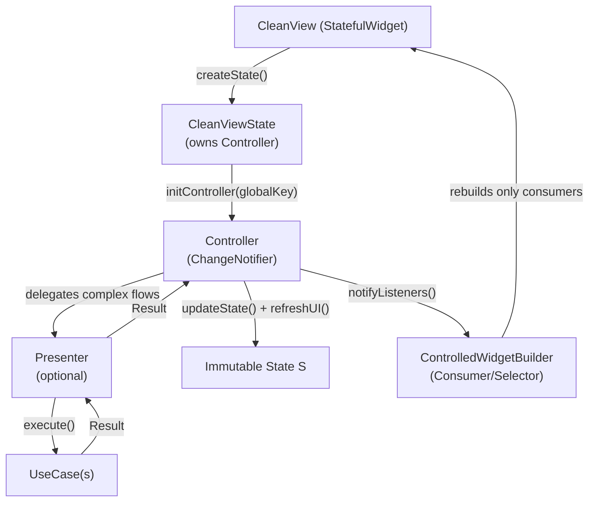
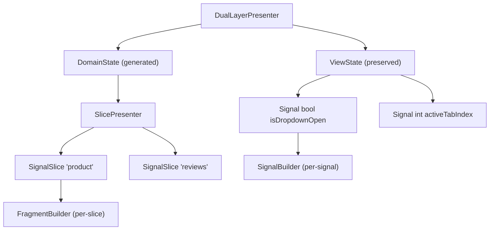
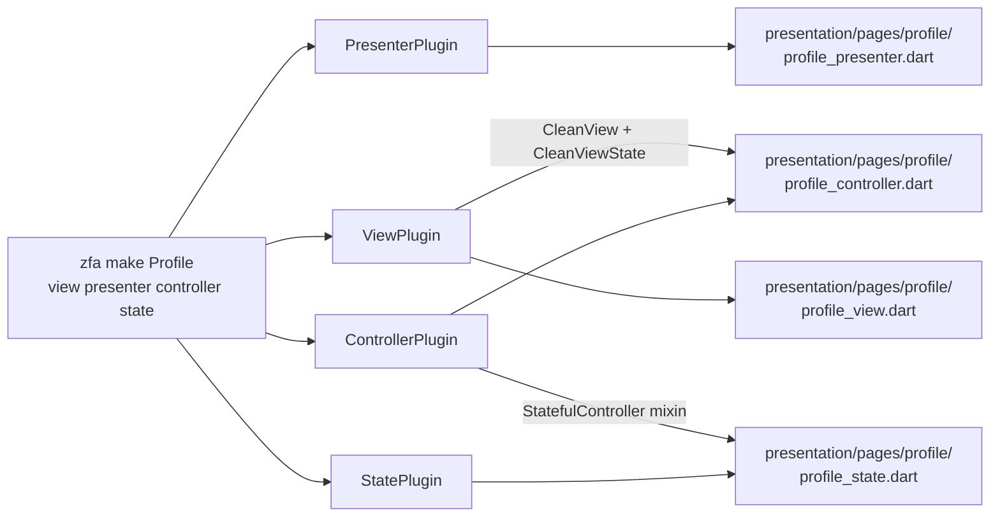

Zuraffa's presentation layer implements a **Controller / View / Presenter (CVP) triad** on top of Flutter's widget framework. The Controller owns business-flow orchestration and state, the View renders passively from that state, and the Presenter acts as an optional orchestration layer for flows too complex for a single controller method. This page explains the runtime classes, how generated code maps onto them, the fine-grained rebuild machinery, and the signal-based state evolution that refines the original v5 model.

## The CVP Triad at a Glance

The three roles form a strict dependency chain: a view instantiates its controller, the controller delegates multi-step orchestration to a presenter, and the presenter executes UseCases. State flows back down the same chain as `Result` values, which the controller folds into an immutable state object before notifying the UI.



Sources: [controller.dart](lib/src/presentation/controller.dart#L147-L160), [view.dart](lib/src/presentation/view.dart#L138-L165), [presenter.dart](lib/src/presentation/presenter.dart#L59-L67)

| Role | Responsibility | Framework Integration | Generated As |
|---|---|---|---|
| **Controller** | Handles UI events, manages state, coordinates with UseCases | `ChangeNotifier` + `WidgetsBindingObserver` + `RouteAware` | `{entity}_controller.dart` |
| **View** | Passive rendering; lifecycle wiring; side-effect callbacks | `StatefulWidget` + Provider | `{entity}_view.dart` |
| **Presenter** | Optional multi-step orchestration, shared logic across controllers | Plain class with `Loggable` | `{entity}_presenter.dart` |
| **State** | Immutable snapshot consumed by the view | Plain immutable class with `copyWith` | `{entity}_state.dart` |

Sources: [controller.dart](lib/src/presentation/controller.dart#L83-L95), [zuraffa.dart](lib/zuraffa.dart#L304-L310)

## Controller: The Orchestrator

`Controller` is an abstract class mixing in `WidgetsBindingObserver`, `RouteAware`, `ChangeNotifier`, and `Loggable`. It exposes two key safety guarantees: **context/state access without runtime assertions** (via a `GlobalKey` injected by the view) and **automatic cancellation of pending operations on dispose** (via tracked `CancelToken`s and `StreamSubscription`s). Its `execute()` helper wraps a UseCase call with a token that is cancelled if the controller is disposed before completion, eliminating the classic "setState after dispose" class of bugs. Sources: [controller.dart](lib/src/presentation/controller.dart#L147-L160), [controller.dart](lib/src/presentation/controller.dart#L200-L238), [controller.dart](lib/src/presentation/controller.dart#L296-L298)

The lifecycle surface mirrors Flutter's widget lifecycle one-to-one: `onInitState`, `onDidChangeDependencies`, `onDeactivated`, `onReassembled`, and `onDisposed` (which must call `super.onDisposed()` to trigger `dispose()`). The controller also receives app-level lifecycle transitions — `onInActive`, `onPaused`, `onResumed`, `onDetached`, `onHidden` — routed through `didChangeAppLifecycleState`, so a paused screen can pause a stream or flush a form without touching the widget. Sources: [controller.dart](lib/src/presentation/controller.dart#L320-L348), [controller.dart](lib/src/presentation/controller.dart#L354-L399)

For typed state management, the optional `StatefulController<S>` mixin adds `viewState`, `createInitialState()`, `updateState()`, and `resetState()`. `updateState()` stores the new state and calls `refreshUI()`, which itself is a safe no-op when the controller is unmounted or disposed. Because `createInitialState()` is invoked from `initListeners()` during construction, controllers are fully initialized by the time the view attaches its listener. Sources: [controller.dart](lib/src/presentation/controller.dart#L31-L81), [controller.dart](lib/src/presentation/controller.dart#L262-L271)

```dart
class ConcertController extends Controller
    with StatefulController<ConcertState> {
  ConcertController(this._presenter, {this.initialConcert});

  @override
  ConcertState createInitialState() => ConcertState(concert: initialConcert);

  Future<void> getConcert(String id, [CancelToken? cancelToken]) async {
    updateState(viewState.copyWith(isGetting: true));
    final result = await _presenter.getConcert(id, cancelToken);
    result.fold(
      (entity) => updateState(viewState.copyWith(isGetting: false, concert: entity)),
      (failure) => updateState(viewState.copyWith(isGetting: false, error: failure)),
    );
  }
}
```

Sources: [concert_controller.dart](example/lib/src/presentation/pages/concert/concert_controller.dart#L7-L31), [stateful_controller_test.dart](test/presentation/stateful_controller_test.dart#L56-L88)

The behavioral contract — initial state set, single notification per `updateState`, and `resetState` returning to the initial value — is pinned by `test/presentation/stateful_controller_test.dart`, so the runtime contract is regression-safe. Sources: [stateful_controller_test.dart](test/presentation/stateful_controller_test.dart#L30-L43)

## View: The Passive Renderer

`CleanView` is a thin `StatefulWidget` carrying an optional `RouteObserver` for navigation callbacks. The real work lives in `CleanViewState<P, Con, S>`, which receives the controller in its constructor and immediately calls `controller.initController(globalKey)`. The `view` getter is the sole build method; `build()` wraps it in a `ChangeNotifierProvider<Con>.value`, which is what makes `ControlledWidgetBuilder` resolution possible anywhere in the subtree. Sources: [view.dart](lib/src/presentation/view.dart#L69-L77), [view.dart](lib/src/presentation/view.dart#L138-L165), [view.dart](lib/src/presentation/view.dart#L288-L293)

The state class wires the full Flutter lifecycle to the controller: `initState` registers the app-lifecycle observer, calls `controller.onInitState()`, and attaches `_handleStateChange`; `didChangeDependencies` subscribes the controller to the route observer; `deactivate` and `reassemble` forward their events; and `dispose` unsubscribes everything before calling `controller.onDisposed()`. The typed `onViewStateChanged(S state)` callback — fired only when the controller uses `StatefulController` — is the recommended place for side effects such as navigation or snackbars, keeping the widget tree declarative. Sources: [view.dart](lib/src/presentation/view.dart#L242-L267), [view.dart](lib/src/presentation/view.dart#L269-L330), [view.dart](lib/src/presentation/view.dart#L208-L236)

Generated views follow a fixed skeleton: a public `CleanView` subclass with optional route fields, and a private `_XViewState` that constructs the controller (wiring the presenter and any initial entity), triggers the initial method in `onInitState`, and builds a `Scaffold` rooted at `globalKey` with `ControlledWidgetBuilder` consumers. Sources: [concert_view.dart](example/lib/src/presentation/pages/concert/concert_view.dart#L11-L47)

## Presenter: The Optional Orchestration Layer

`Presenter` is deliberately optional. For simple CRUD, the Controller can call UseCases directly; the Presenter earns its place when a flow is multi-step (checkout with validation → payment → order creation), requires coordination across several UseCases, or holds logic shared by multiple controllers. It provides `registerUseCase<T>()` for disposal tracking, `createCancelToken()`, and four execution helpers: `execute` (single), `executeStream` (reactive), `executeAll` (parallel), and `executeSequential` (stops on first failure). Its `dispose()` cancels every tracked token, cancels subscriptions, and disposes registered UseCases — and the generated controller's `onDisposed` calls it automatically. Sources: [presenter.dart](lib/src/presentation/presenter.dart#L12-L43), [presenter.dart](lib/src/presentation/presenter.dart#L85-L97), [presenter.dart](lib/src/presentation/presenter.dart#L122-L183), [presenter.dart](lib/src/presentation/presenter.dart#L194-L231)

| Pattern | Controller-only | With Presenter |
|---|---|---|
| Complexity | Single UseCase per method | Multi-step, conditional flows |
| Shared logic across screens | Duplicated or injected | Centralized |
| Cancellation granularity | Per controller | Per orchestration run |
| Boilerplate | Minimal | One extra class |

Sources: [presenter.dart](lib/src/presentation/presenter.dart#L45-L58), [controller_class_builder.dart](lib/src/plugins/controller/builders/controller_class_builder.dart#L96-L111)

A generated presenter resolves its UseCases from the service locator (`getIt`) when DI generation is enabled, registers each one for disposal, and exposes type-safe methods that return `Future<Result<…>>` or `Stream<Result<…>>` with optional `CancelToken` parameters. The record-based `watchConcertRecord` pattern demonstrates the streaming dual: an initial `Future` plus an `updates` stream, which the controller consumes as separate state transitions. Sources: [concert_presenter.dart](example/lib/src/presentation/pages/concert/concert_presenter.dart#L10-L33), [concert_presenter.dart](example/lib/src/presentation/pages/concert/concert_presenter.dart#L43-L66)

## Fine-Grained Rebuilds

The presentation layer ships three consumer widgets, each trading rebuild granularity against simplicity:

| Widget | Mechanism | Rebuilds When |
|---|---|---|
| `ControlledWidgetBuilder<Con>` | Provider `Consumer` | Any `refreshUI()` |
| `ControlledWidgetBuilderWithChild<Con>` | `Consumer` with static `child` | Any `refreshUI()` (child skipped) |
| `ControlledWidgetSelector<Con, T>` | Provider `Selector` | Only when the selected value changes |

Sources: [controlled_widget.dart](lib/src/presentation/controlled_widget.dart#L68-L88), [controlled_widget.dart](lib/src/presentation/controlled_widget.dart#L111-L134), [controlled_widget.dart](lib/src/presentation/controlled_widget.dart#L152-L176)

The selector variant is the escape hatch for performance-sensitive screens: a list item that only cares about a product name rebuilds when that name changes, not when an unrelated `isLoading` flag flips. Combined with `ControlledWidgetBuilderWithChild` for expensive static subtrees, a page can keep the vast majority of its widget tree from rebuilding on every state transition. Sources: [controlled_widget.dart](lib/src/presentation/controlled_widget.dart#L136-L151)

## The Signal-Based State Evolution

The v5 immutable-state model is complemented by a **dual-layer signal architecture** designed for O(1) isolated rebuilds. `ViewState` holds transient UI signals — dropdown visibility, active tabs, scroll offsets — and is **scaffolded once and preserved** by the generator; `DomainState` is a read-only container of `SignalSlice`s that is **regenerated on every build**. Sources: [view_state.dart](lib/src/state/view_state.dart#L3-L20), [domain_state.dart](lib/src/state/domain_state.dart#L3-L19), [state_generator.dart](lib/src/state/generator/state_generator.dart#L121-L145)



Sources: [dual_layer_presenter.dart](lib/src/state/presenter/dual_layer_presenter.dart#L3-L27), [slice_presenter.dart](lib/src/state/presenter/slice_presenter.dart#L4-L13)

`SignalSlice<T>` wraps a `SignalResult<T>` with lazy execution: the underlying UseCase is only invoked on first access, and the slice exposes `data`, `error`, `isLoading`, `isSuccess`, and `isFailure` read APIs plus `listen`/`onSuccess`/`onFailure` subscriptions and `refresh(newParams)` for re-execution. `SlicePresenter` binds one slice per UseCase and keeps a backward-compatible `combinedState` map that is invalidated whenever a new slice is bound — the migration bridge for views not yet migrated to per-slice subscriptions. Sources: [signal_slice.dart](lib/src/state/slices/signal_slice.dart#L17-L49), [signal_slice.dart](lib/src/state/slices/signal_slice.dart#L52-L105), [slice_presenter.dart](lib/src/state/presenter/slice_presenter.dart#L76-L125)

Two state widgets complete the picture. `FragmentBuilder<T>` subscribes to a single slice and renders `onLoading` skeletons, `onError` boundaries, `onEmpty` placeholders, or the success `builder` — it re-subscribes cleanly when the parent swaps the slice instance. `SignalBuilder<T>` does the same for a single `ViewState` signal. The v6 `ControlledWidget<C>` base class then offers a minimal `StatefulWidget` with typed controller access and `onInit`/`onDispose` hooks — the template that `ViewTemplateGenerator` emits. Sources: [fragment_builder.dart](lib/src/state/widgets/fragment_builder.dart#L16-L34), [fragment_builder.dart](lib/src/state/widgets/fragment_builder.dart#L83-L98), [signal_builder.dart](lib/src/state/widgets/signal_builder.dart#L17-L53), [controlled_widget.dart](lib/src/state/widgets/controlled_widget.dart#L24-L43), [view_template_generator.dart](lib/src/state/generator/view_template_generator.dart#L24-L93)

The runtime contract is verified by `dual_layer_presenter_test.dart`: domain slices resolve through the presenter, view signals are independently writable, `combinedState` merges domain data, and `dispose()` cleans up both layers (subsequent slice access throws). Sources: [dual_layer_presenter_test.dart](test/state/dual_layer_presenter_test.dart#L6-L46)

## Adaptive & Responsive Presentation

Beyond the core triad, the presentation layer offers two layout strategies for multi-form-factor apps. `ResponsiveViewState` cascades width-based breakpoints (watch/mobile/tablet/desktop) with `mobileView` as the universal fallback. `AdaptiveViewState` is the platform-aware variant: it builds a `PlatformContext` from the detected `PlatformClass` and `DeviceClass`, then resolves a layout map through the fallback chain **compound → platform → device → generic**. A layout keyed `macos_desktop` wins over `macos` over `desktop` over `default`. Sources: [responsive_view.dart](lib/src/presentation/responsive_view.dart#L99-L141), [adaptive_view.dart](lib/src/presentation/adaptive_view.dart#L9-L19), [adaptive_view.dart](lib/src/presentation/adaptive_view.dart#L37-L93), [platform_layout_resolver.dart](lib/src/presentation/platform/platform_layout_resolver.dart#L38-L60)

The same resolver powers `AppShellResolver`, which selects among `MacosAppShell`, `DesktopAppShell`, `TabletAppShell`, and `MobileAppShell` implementations — all sharing the abstract `AppShell` base that derives an `AppBar` from a title. The `DeviceClass.fromWidth` breakpoints (300/600/950dp) and `PlatformClass.current` detection are the single source of truth for both page layouts and shells. Sources: [app_shell_resolver.dart](lib/src/presentation/shells/app_shell_resolver.dart#L14-L80), [app_shell.dart](lib/src/presentation/shells/app_shell.dart#L4-L30), [device_class.dart](lib/src/presentation/platform/device_class.dart#L4-L25), [platform_class.dart](lib/src/presentation/platform/platform_class.dart#L4-L51)

## How the Generator Produces These Files

Each triad role is produced by a dedicated plugin — `ControllerPlugin`, `ViewPlugin`, `PresenterPlugin`, and `StatePlugin` — all registered in the generation pipeline and driven by the same `GeneratorConfig`. A single `zfa make Product view presenter controller state` invocation orchestrates all four.



Sources: [controller_plugin.dart](lib/src/plugins/controller/controller_plugin.dart#L74-L101), [view_plugin.dart](lib/src/plugins/view/view_plugin.dart#L84-L110), [presenter_plugin.dart](lib/src/plugins/presenter/presenter_plugin.dart#L62-L92), [state_plugin.dart](lib/src/plugins/state/state_plugin.dart#L45-L67)

The plugins emit code through `code_builder`-based class builders: `ControllerClassBuilder` produces the `Controller` subclass with a `_presenter` field, a `StatefulController<S>` mixin (when `--state` is set), per-method state transitions, and an `onDisposed` that disposes the presenter. `PresenterClassBuilder` emits the `Presenter` subclass with registered UseCase fields and orchestration methods. `ViewClassBuilder` emits the two-class view pair and — when `--adaptive-layouts` or `--platform-shells` is set — delegates to `AdaptiveLayoutScaffoldBuilder` for platform-specific layout files. The ViewPlugin also applies master-detail awareness: methods containing both list and detail operations produce a `{entity}_view.dart` and a `{entity}_detail_view.dart`. Sources: [controller_class_builder.dart](lib/src/plugins/controller/builders/controller_class_builder.dart#L37-L131), [presenter_class_builder.dart](lib/src/plugins/presenter/builders/presenter_class_builder.dart#L26-L42), [view_class_builder.dart](lib/src/plugins/view/builders/view_class_builder.dart#L57-L86), [view_plugin.dart](lib/src/plugins/view/view_plugin.dart#L142-L198), [view_plugin.dart](lib/src/plugins/view/view_plugin.dart#L279-L296)

The presentation layer can be generated in isolation: the integration test `presentation_only_workflow_test.dart` proves that requesting only view/presenter/controller/state produces exactly those files under `presentation/pages/` and nothing in `domain/`, `data/`, or the data-layer DI registries. Sources: [presentation_only_workflow_test.dart](test/integration/presentation_only_workflow_test.dart#L24-L55), [presentation_only_workflow_test.dart](test/integration/presentation_only_workflow_test.dart#L87-L147)

## Next Steps

- Understand the `Result` and sealed-failure machinery the controller folds into state: [UseCase Hierarchy & the Result Pattern](10-usecase-hierarchy-and-the-result-pattern) and [Sealed Failures & Error Handling](11-sealed-failures-and-error-handling)
- See how the presenter resolves its UseCases at runtime: [Dependency Injection Generation](17-dependency-injection-generation)
- Dive into the layout keys and shell scaffolding referenced by adaptive views: [Adaptive Layouts & Platform Shells](20-adaptive-layouts-and-platform-shells)
- Extend the presentation layer with your own generation logic: [Building Custom Plugins](22-building-custom-plugins)