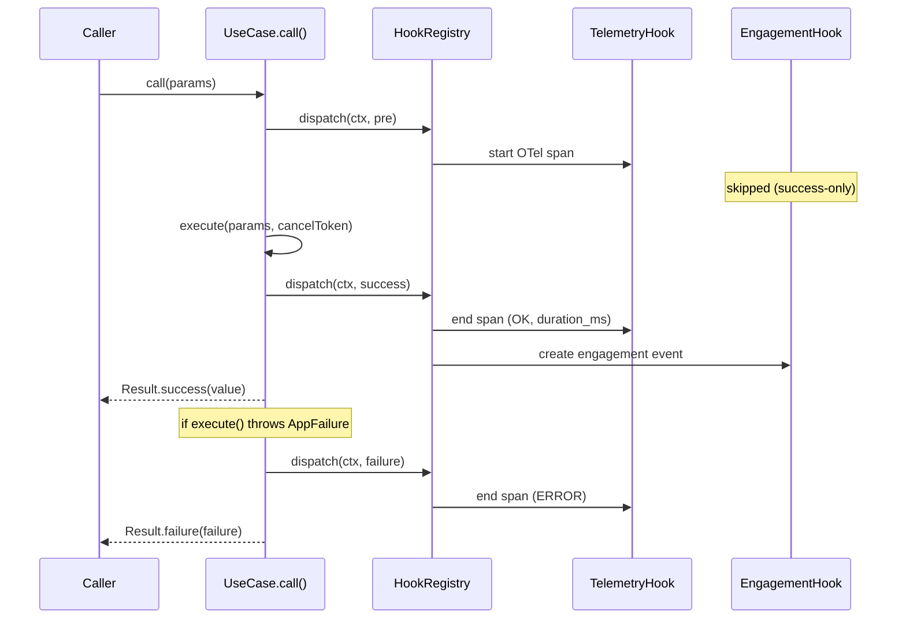
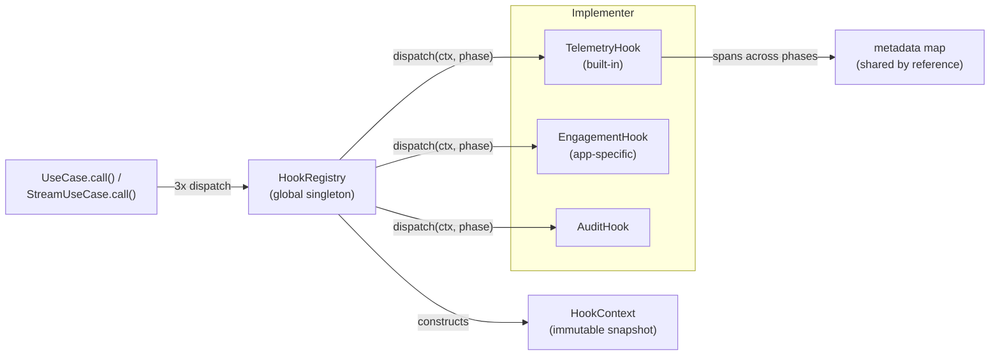

Zuraffa's hook system is a framework-level interception mechanism that wraps every `UseCase.call()` and `StreamUseCase.call()` at three phases — before execution, on success, and on failure — so cross-cutting concerns like telemetry, engagement tracking, audit logging, and performance monitoring can be registered once in `main()` and fire automatically for every business operation. It exists because the alternative — manually invoking a tracking UseCase from each controller — duplicates logic at every entry point: the motivating production case (ZikZak's engagement tracking) required eight manual `CreateTelemetryEventUseCase` calls that the hook system replaces with a single `EngagementHook` registration. Sources: [ADR 006](doc/adr/006-usecase-hook-system.md#L1-L30), [spec](specs/011-usecase-hook-system/spec.md#L1-L20)

The system follows the same architectural pattern Zuraffa already established with `FailureReporterRegistry` and `ArtifactHook`: register globally, dispatch automatically, filter per-instance. What those earlier mechanisms lacked was coverage of the **success path** and the **pre-execution path** — the hook system fills that gap by making `UseCase.call()` itself the single interception point. Sources: [ADR 006](doc/adr/006-usecase-hook-system.md#L15-L26)

## The Three Phases

Every UseCase invocation is observed at exactly three points, defined by the `HookPhase` enum: `pre` fires before business logic runs, `success` fires after `execute()` completes without throwing, and `failure` fires after an error is caught and converted to an `AppFailure`. Sources: [hook.dart](lib/src/core/hook.dart#L12-L17)



Sources: [usecase.dart](lib/src/domain/usecase.dart#L68-L110), [telemetry_hook.dart](lib/src/core/telemetry_hook.dart#L110-L120)

What a hook can observe differs per phase. The `pre` phase carries the params and a timestamp but no result, failure, or duration; `success` carries the result and duration; `failure` carries the `AppFailure` and duration. This asymmetry is pinned by the integration tests — a `pre`-phase hook must expect `result == null` and `duration == null`. Sources: [usecase_hook_test.dart](test/domain/usecase_hook_test.dart#L53-L75), [hook.dart](lib/src/core/hook.dart#L49-L79)

| Phase | `params` | `result` | `failure` | `duration` | Fires when |
|---|---|---|---|---|---|
| `pre` | ✅ | ❌ null | ❌ null | ❌ null | Before `execute()` |
| `success` | ✅ | ✅ | ❌ null | ✅ | `execute()` returned normally |
| `failure` | ✅ | ❌ null | ✅ | ✅ | `AppFailure` thrown or unexpected exception wrapped |

Sources: [usecase.dart](lib/src/domain/usecase.dart#L77-L158), [stream_usecase.dart](lib/src/domain/stream_usecase.dart#L85-L180)

## Core Types

The system is built from four cooperating types. `Hook` is the abstract contract developers implement; `HookContext` is the immutable snapshot of an invocation; `HookPhase` selects the interception point; `HookRegistry` is the global singleton that owns registration and dispatch. Sources: [hook.dart](lib/src/core/hook.dart#L145-L184), [hook_registry.dart](lib/src/core/hook_registry.dart#L28-L33)



Sources: [hook_registry.dart](lib/src/core/hook_registry.dart#L5-L20), [hook.dart](lib/src/core/hook.dart#L19-L48)

`HookContext` carries everything a hook needs to decide whether to act and how: the UseCase's runtime type name, the input params, the successful result or failure, execution duration, a timestamp, the active OTel trace/span IDs (when tracing is configured), and a mutable metadata map. Two convenience accessors — `paramsAs<P>()` and `resultAs<R>()` — provide typed casts without manual `as` casts. Sources: [hook.dart](lib/src/core/hook.dart#L49-L101)

The `Hook` base class gives implementers five extension points. Only `id` and `execute()` are mandatory; `priority`, `phases`, and `shouldTrigger()` have safe defaults (priority `0`, all three phases, always trigger). Sources: [hook.dart](lib/src/core/hook.dart#L145-L184)

| Member | Type | Default | Purpose |
|---|---|---|---|
| `id` | `String` | — (required) | Unique identity; duplicate registration throws `StateError` |
| `priority` | `int` | `0` | Execution order, ascending (negative runs first) |
| `phases` | `Set<HookPhase>` | all three | Which phases the hook fires on |
| `shouldTrigger(context, phase)` | `bool` | `true` | Per-invocation filter (UseCase name, params, duration…) |
| `execute(context, phase)` | `Future<void>` | — (required) | The side-effect logic; must be resilient |

Sources: [hook.dart](lib/src/core/hook.dart#L145-L184), [hook_registry_test.dart](test/core/hook_registry_test.dart#L85-L106)

## HookRegistry: Lifecycle & Dispatch Semantics

`HookRegistry.instance` is a process-wide singleton following the exact pattern of `FailureReporterRegistry`. Hooks are registered once at startup and typically live for the app's lifetime; `register()`, `unregister(id)`, and `clear()` provide full lifecycle control. Registering a second hook with the same `id` throws a `StateError` — matching the `FailureReporterRegistry` precedent — which forces explicit unregistration before replacement. Sources: [hook_registry.dart](lib/src/core/hook_registry.dart#L35-L77), [hook_registry_test.dart](test/core/hook_registry_test.dart#L57-L83)

The `hooks` getter returns all registered hooks sorted by priority ascending, so a tracing hook that must establish context (negative priority) reliably runs before a dependent hook (positive priority). The sort happens on every read, guaranteeing ordering is always derived from current registrations rather than insertion order. Sources: [hook_registry.dart](lib/src/core/hook_registry.dart#L43-L51), [hook_registry_test.dart](test/core/hook_registry_test.dart#L85-L95)

Dispatch is deliberately **fire-and-forget**. `dispatch()` never throws and never blocks the calling UseCase: it snapshots the matching hooks (guarding against concurrent modification), invokes each `execute()` without awaiting, and attaches a `catchError` that logs any hook failure. A throwing hook cannot stop other hooks from firing, and the UseCase result is completely unaffected — the integration test proves a hook that throws `Exception('Hook error')` still leaves the UseCase succeeding and a second hook firing normally. Sources: [hook_registry.dart](lib/src/core/hook_registry.dart#L80-L109), [usecase_hook_test.dart](test/domain/usecase_hook_test.dart#L129-L147)

Two fast paths keep overhead negligible when hooks aren't in use. `isEnabled` is the global kill switch (useful for GDPR opt-out, debug mode, or profiling): when `false`, `dispatch()` returns immediately without iterating hooks. When no hooks are registered, the same early return happens after a single `isEmpty` check. Both paths are exercised by tests that verify zero dispatches in the disabled state and normal UseCase behavior with an empty registry. Sources: [hook_registry.dart](lib/src/core/hook_registry.dart#L37-L41), [hook_registry_test.dart](test/core/hook_registry_test.dart#L200-L217), [usecase_hook_test.dart](test/domain/usecase_hook_test.dart#L149-L165)

## Cross-Phase Metadata: The Shared Bag

`HookContext.metadata` is the one mutable field in an otherwise immutable context — a `Map<String, dynamic>` **shared by reference** across all three phases of a single UseCase invocation. A hook can write a value in `pre` and read it back in `success` or `failure`, which is exactly how the built-in `TelemetryHook` carries an OTel span from creation to completion. The registry test verifies the same map object reaches both the `pre` and `success` dispatches of one invocation. Sources: [hook.dart](lib/src/core/hook.dart#L19-L31), [hook_registry_test.dart](test/core/hook_registry_test.dart#L219-L244)

Because every hook on a UseCase shares the same map, the convention is **namespaced keys** — `TelemetryHook` uses `'_telemetry_span'`, and the doc comments suggest prefixes like `_otel_span` or `_zikzak_payload` — to prevent collisions between independently developed hooks. Sources: [hook.dart](lib/src/core/hook.dart#L74-L80), [telemetry_hook.dart](lib/src/core/telemetry_hook.dart#L81-L82)

## Built-in TelemetryHook

`TelemetryHook` is the shipped, opinionated consumer of the hook system — the proof that a real, multi-phase concern (span lifecycle management) can be expressed as a hook. It replaces manual `OtelTracer.instance.trace()` calls: once registered, every UseCase execution is automatically wrapped in an OpenTelemetry span named `usecase.{UseCaseName}` (configurable via `spanNamePrefix`). Sources: [telemetry_hook.dart](lib/src/core/telemetry_hook.dart#L25-L48), [spec](specs/011-usecase-hook-system/spec.md#L59-L77)

Its span lifecycle maps one-to-one onto the three phases. In `pre`, it starts a span with `usecase.name` and `usecase.phase=started` attributes and stashes the span in `context.metadata['_telemetry_span']`. On `success`, it retrieves the span, records `usecase.duration_ms`, sets `usecase.phase=success`, and ends it with OK status. On `failure`, it ends the span with ERROR status, recording the failure type, message, and stack trace via `endSpanWithError`. The span is removed from metadata after each terminal phase, keeping the bag clean. Sources: [telemetry_hook.dart](lib/src/core/telemetry_hook.dart#L110-L169)

| Constructor param | Default | Behavior |
|---|---|---|
| `onlyUseCases` | `{}` (empty) | Whitelist — when non-empty, only these UseCase names are traced |
| `excludeUseCases` | `{}` (empty) | Blacklist — these UseCases are never traced |
| `spanNamePrefix` | `'usecase'` | Prefix for span names, producing `usecase.GetDealListUseCase` |

Sources: [telemetry_hook.dart](lib/src/core/telemetry_hook.dart#L49-L60)

Filtering lives in `shouldTrigger`, and precedence is explicit: `excludeUseCases` **always wins** — a UseCase present in both sets is excluded. This precedence, the whitelist behavior, and the three-phase default are all pinned by `test/core/telemetry_hook_test.dart`. The hook is also resilient when OTel is not configured: `OtelTracer.startSpan` degrades gracefully and the test suite confirms `execute()` never throws without a configured tracer provider. Sources: [telemetry_hook.dart](lib/src/core/telemetry_hook.dart#L98-L108), [telemetry_hook_test.dart](test/core/telemetry_hook_test.dart#L105-L147)

## Integration Points: What Gets Hooked

The interception is hard-wired into the two reactive base classes of the domain layer — `UseCase` (single-shot, including `CompletableUseCase` which extends it) and `StreamUseCase` (streaming). No per-UseCase opt-in is needed: any class extending either base automatically dispatches to all registered hooks. Sources: [usecase.dart](lib/src/domain/usecase.dart#L55-L66), [stream_usecase.dart](lib/src/domain/stream_usecase.dart#L54-L65)

In `UseCase.call()`, the three dispatch sites are placed around the existing try-catch structure without altering its behavior: `pre` after capturing start time and trace context but before the cancellation check and `execute()`; `success` after `execute()` returns and before `Result.success` is returned; `failure` in both the `on AppFailure` branch and the generic catch (where unexpected exceptions are wrapped in `AppFailure.from`). The `FailureReporterRegistry` calls remain untouched — error reporting and hook dispatch are parallel, independent concerns. Sources: [usecase.dart](lib/src/domain/usecase.dart#L68-L158)

`StreamUseCase.call()` follows the same three-point rhythm adapted to stream lifecycle semantics: `pre` fires once before the source stream is created; `success` fires once when the stream completes normally; `failure` fires once when the stream terminates in error. The crucial guarantee — pinned by test — is that a stream emitting five values still triggers exactly **one** `pre` and one `success`, not one per emission. Cancellation-before-start short-circuits with a `CancellationFailure` without dispatching any phase. Sources: [stream_usecase.dart](lib/src/domain/stream_usecase.dart#L67-L132), [stream_usecase_hook_test.dart](test/domain/stream_usecase_hook_test.dart#L100-L113)

One boundary worth knowing: the hook system does **not** cover every UseCase variant. `SyncUseCase` and `BackgroundUseCase` are separate base classes that do not import or dispatch to `HookRegistry`, so hooks never fire for synchronous or isolate-based operations. The v6 `ZuraffaUseCase` signal-based contract is likewise outside this system — the hook interception is scoped to the v5 `UseCase`/`StreamUseCase` runtime framework documented here. Sources: [sync_usecase.dart](lib/src/domain/sync_usecase.dart#L1-L40), [zuraffa_usecase.dart](lib/src/core/usecase/zuraffa_usecase.dart#L24-L39)

## Public API: The Zuraffa Facade

While `HookRegistry.instance` is directly accessible, the idiomatic entry point is the `Zuraffa` static facade, which mirrors the registration surface used by `FailureReporterRegistry` and `ArtifactPublisher`. All three hook-related APIs are exported from `package:zuraffa/zuraffa.dart` alongside the core types. Sources: [zuraffa.dart](lib/zuraffa.dart#L1018-L1046), [zuraffa.dart](lib/zuraffa.dart#L219-L222)

```dart
// In main(), before the app runs:
Zuraffa.registerHook(TelemetryHook());                    // built-in tracing
Zuraffa.registerHook(EngagementHook(repository));         // app-specific
Zuraffa.hooksEnabled = false;                             // global kill switch
Zuraffa.unregisterHook('zuraffa-telemetry');              // remove by id
```

Sources: [zuraffa.dart](lib/zuraffa.dart#L1021-L1046), [hook_registry.dart](lib/src/core/hook_registry.dart#L12-L26)

## Design Decisions & Rejected Alternatives

The ADR records three alternatives that were considered and rejected in favor of the registry-plus-hook pattern. Understanding these rejections clarifies why the system looks the way it does — particularly why hooks are fire-and-forget rather than awaited, and why the `pre` phase exists synchronously inside `call()`. Sources: [ADR 006](doc/adr/006-usecase-hook-system.md#L43-L71)

| Approach | Why rejected |
|---|---|
| **AOP / code generation** (build_runner injection) | Build-time complexity, regeneration required when hooks change, no runtime AOP in Dart's analyzer |
| **Middleware / decorator wrapping** | Changes DI registration pattern, adds wrapper objects, obscures stack traces |
| **Event bus** (publish/subscribe streams) | Loses the synchronous `pre` phase needed for span creation, adds stream lifecycle management |

Sources: [ADR 006](doc/adr/006-usecase-hook-system.md#L43-L71)

## Writing a Custom Hook

A custom hook implements `id` and `execute()`, then overrides `phases` and `shouldTrigger()` to scope itself. The engagement-tracking pattern from the spec is representative: fire only on `success`, filter by UseCase name, and delegate to a repository directly — never to another UseCase. Sources: [hook.dart](lib/src/core/hook.dart#L152-L184), [spec](specs/011-usecase-hook-system/spec.md#L76-L92)

```dart
class EngagementHook extends Hook {
  EngagementHook(this._repository);

  final EngagementEventRepository _repository;

  @override
  String get id => 'engagement';

  @override
  Set<HookPhase> get phases => {HookPhase.success};

  @override
  bool shouldTrigger(HookContext context, HookPhase phase) =>
      _trackedUseCases.contains(context.useCaseName);

  @override
  Future<void> execute(HookContext context, HookPhase phase) async {
    await _repository.create(EngagementEvent(
      type: _eventTypeFor(context.useCaseName),
      payload: context.params,
    ));
  }
}
```

Sources: [hook.dart](lib/src/core/hook.dart#L20-L31), [spec](specs/011-usecase-hook-system/spec.md#L108-L121)

Two documented pitfalls deserve emphasis. First, **recursion**: a hook that calls a UseCase via `.call()` triggers the hook system again — if that hook then calls the same UseCase, you get infinite recursion. The spec explicitly treats this as a developer error with no runtime guard; the recommended pattern is repository-direct calls inside hooks. Second, **metadata hygiene**: since the metadata bag is shared across all hooks on an invocation, always namespace your keys and remove them in terminal phases, as `TelemetryHook` does with `_telemetry_span`. Sources: [spec](specs/011-usecase-hook-system/spec.md#L100-L104), [telemetry_hook.dart](lib/src/core/telemetry_hook.dart#L135-L169)

## Verification & Test Coverage

The runtime contract is pinned by four test files. `test/core/hook_registry_test.dart` covers registry lifecycle (duplicate IDs, unregister, clear, priority sorting) and dispatch semantics (phase filtering, `shouldTrigger` filtering, error isolation, disabled state, metadata sharing). `test/domain/usecase_hook_test.dart` and `test/domain/stream_usecase_hook_test.dart` verify the end-to-end integration: phase ordering, per-phase context fields, hook-failure resilience, and the single-dispatch-per-stream-lifecycle guarantee. `test/core/telemetry_hook_test.dart` pins the built-in hook's identity, filter precedence, and no-throw behavior without OTel. Sources: [hook_registry_test.dart](test/core/hook_registry_test.dart#L1-L55), [usecase_hook_test.dart](test/domain/usecase_hook_test.dart#L1-L50), [stream_usecase_hook_test.dart](test/domain/stream_usecase_hook_test.dart#L1-L48), [telemetry_hook_test.dart](test/core/telemetry_hook_test.dart#L1-L20)

## Where to Go Next

The hook system sits at the intersection of several already-documented areas. [UseCase Hierarchy & the Result Pattern](10-usecase-hierarchy-and-the-result-pattern) explains the base classes being intercepted and the `Result<T, AppFailure>` contract hooks observe; [Sealed Failures & Error Handling](11-sealed-failures-and-error-handling) covers the `AppFailure` type that reaches `failure`-phase hooks and the parallel `FailureReporterRegistry` path; [Telemetry, Failure Reporting & Artifacts](29-telemetry-failure-reporting-and-artifacts) details the `OtelTracer` span lifecycle that `TelemetryHook` automates. If you came from [Presentation Layer: Controller, View & Presenter](12-presentation-layer-controller-view-and-presenter), the practical takeaway is that controllers no longer need manual tracking calls — register a hook in `main()` and the framework handles the rest. For the broader picture of how hooks relate to the artifact and failure hook mechanisms, see [Plugin System Architecture](7-plugin-system-architecture) and the sealed-failure page's discussion of the registry pattern.