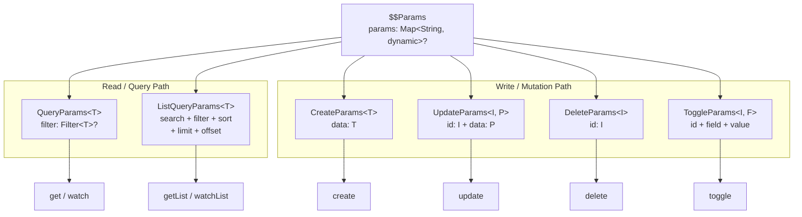
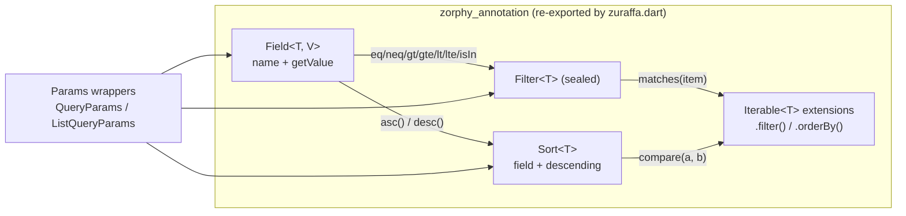

Every UseCase in Zuraffa receives typed input through a small family of parameter wrappers. This page explains what those wrappers are, how the type-safe query engine behind them works, and how generated code — from controller to datasource — consumes them. It covers the `QueryParams` / `ListQueryParams` filtering model, the ID-based mutation params, the JSON converters, and the `--id-field` / `--query-field` configuration flags that shape generated queries.

## Design Principle: Filter for Finding, ID for Mutating

The entire params system rests on one architectural decision documented in `PARAMS_DESIGN.md`: **queries use filters to find entities; mutations target a specific entity by ID.** Reading operations may need arbitrary conditions (`And`, `Or`, `Gt`, `Lt`, string matching, inclusion lists), so `QueryParams` and `ListQueryParams` accept a `Filter<T>`. Writing operations — update, delete, toggle — are unambiguous by nature: exactly one entity is addressed, so they accept an `id` (plus patch data where needed) rather than a filter. This mirrors REST conventions (`PUT /products/:id`, `DELETE /products/:id`) and eliminates the risk of accidental bulk operations on a single-entity mutation.



Sources: [PARAMS_DESIGN.md](doc/PARAMS_DESIGN.md#L1-L166), [params.dart](lib/src/core/params/params.dart#L1-L11)

## The Params Family

All params live in `lib/src/core/params/` and are re-exported through the single public entry point `package:zuraffa/zuraffa.dart`. Each wrapper is declared as an abstract `$XxxParams` class annotated with `@Zorphy(generateJson: true, generateFilter: true)`; the code generator materializes the concrete class, `copyWith`, equality, `fromJson`, `toJson`, patch helpers, and field descriptors.

| Params Type | Generic Signature | Carries | Used By (generated) |
|---|---|---|---|
| `QueryParams<T>` | `QueryParams<T>` | `Filter<T>?` | `get`, `watch` |
| `ListQueryParams<T>` | `ListQueryParams<T>` | `search`, `Filter<T>?`, `Sort<T>?`, `limit`, `offset` | `getList`, `watchList` |
| `CreateParams<T>` | `CreateParams<T>` | `data: T` | `create` |
| `UpdateParams<I, P>` | `UpdateParams<I, P>` | `id: I`, `data: P` (Patch or Map) | `update` |
| `DeleteParams<I>` | `DeleteParams<I>` | `id: I` | `delete` |
| `ToggleParams<I, F>` | `ToggleParams<I, F>` | `id: I`, `field: F`, `value: bool` | `toggle` |
| `InitializationParams` | non-generic | `timeout`, `forceRefresh`, `credentials`, `settings` | `initialize` |
| `NoParams` | non-generic | — | parameterless UseCases |

Every wrapper implements `$$Params`, the shared base that contributes an optional `Map<String, dynamic>? params` bucket. That bucket is deliberately untyped — it carries transport-level extras such as `{'includeDeleted': true}` or `{'soft': true}` without polluting the typed contract. Generated property helpers expose `hasParams` / `noParams` and a throwing `paramsRequired` accessor.

Sources: [index.dart](lib/src/core/params/index.dart#L1-L26), [query_params.dart](lib/src/core/params/query_params.dart#L7-L31), [list_query_params.dart](lib/src/core/params/list_query_params.dart#L6-L48), [create_params.dart](lib/src/core/params/create_params.dart#L1-L17), [update_params.dart](lib/src/core/params/update_params.dart#L1-L27), [delete_params.dart](lib/src/core/params/delete_params.dart#L1-L17), [toggle_params.dart](lib/src/core/params/toggle_params.dart#L1-L28), [no_params.dart](lib/src/core/params/no_params.dart#L1-L37)

`UpdateParams` is the only wrapper with two generic parameters: `I` (the ID type, e.g. `String` or `int`) and `P` (the patch type — a Zorphy-generated `XxxPatch` or a `Map<String, dynamic>` partial). `ToggleParams` similarly pairs an ID type with a field-enum type, so `ToggleParams<int, TodoFields>(id: 123, field: TodoFields.isCompleted, value: true)` is checked at compile time rather than by string. The integration test suite asserts these signatures end-to-end in generated datasources and UseCases.

Sources: [update_params.dart](lib/src/core/params/update_params.dart#L1-L27), [toggle_params.dart](lib/src/core/params/toggle_params.dart#L1-L28), [toggle_method_test.dart](test/integration/toggle_method_test.dart#L54-L126)

## The Query Engine: Filters, Fields and Sorts

The query primitives themselves are not re-implemented in Zuraffa — they come from the **Zorphy** annotation package and are re-exported at `lib/zuraffa.dart` so consumers never import Zorphy directly. The re-export includes the `Field`, `Filter`, and `Sort` types, all filter operator classes, and the `Iterable` extensions `filter()` / `orderBy()`.



A `Field<TEntity, TValue>` pairs a field name with a getter that extracts the value from an entity instance. It is the typed anchor for both filtering and sorting. A `Filter<TEntity>` is a sealed class evaluated in memory via `matches(item)`; the concrete operators available are:

| Operator | JSON Shape | Semantics |
|---|---|---|
| `Eq` / `Neq` | `{field: value}` / `{field: {neq: value}}` | equality / inequality |
| `Gt` / `Gte` / `Lt` / `Lte` | `{field: {gt: value}}` etc. | comparable comparisons |
| `Contains` | `{field: {contains: value}}` | substring or collection membership |
| `InList` | `{field: {in: [...]}}` | field value contained in a list |
| `And` / `Or` | `{and: [...]}` / `{or: [...]}` | logical combination |
| `Not` | `{not: ...}` | negation |
| `Nested` | `{field: {...}}` | filters an object or any element of a collection |
| `Has` | `{field: {has: value}}` | list field contains element |
| `AlwaysMatch` | `{}` | matches everything |

A `Sort<T>` wraps a field plus a `descending` flag and exposes `Sort.asc(...)` / `Sort.desc(...)` constructors and a `compare(a, b)` that null-safe-orders two entities. Zuraffa's generated local datasources consume these directly through the `Iterable` extensions — `.filter(Filter<T>?)` keeps only matching items and `.orderBy(Sort<T>?)` returns a sorted copy. Because both extensions accept null and degrade to pass-through, an empty `ListQueryParams()` still yields a correct full-list result.

Sources: [zuraffa.dart](lib/zuraffa.dart#L269-L277), [query_params_test.dart](test/core/query_params_test.dart#L1-L122), [query_extension_test.dart](test/core/query_extension_test.dart#L1-L78), [nested_filter_test.dart](test/core/nested_filter_test.dart#L1-L102)

## From Filter to Params: Conversion Extensions

Raw `Filter<T>` objects can be lifted into params wrappers with one- or zero-argument extensions, which keeps call sites terse and encourages composing filters before handing them to a UseCase:

- `Filter<T>.toQuery()` → `QueryParams<T>` carrying the filter and optional extras.
- `Iterable<Filter<T>>.toFilter()` → combines the list into a single `And<T>`.
- `Iterable<Filter<T>>.toQuery()` / `.toListQuery()` → combined `And` filter wrapped in `QueryParams` / `ListQueryParams` (with optional search, sort, limit, offset).
- `Filter<T>.toListQuery()` → `ListQueryParams<T>` with optional search/sort/pagination.

For single-entity reads, `Iterable<T>.query(QueryParams<T>?)` performs the in-memory lookup: with a filter it returns the first matching item, throwing if none match; with a null filter it returns the first element. This is the extension the generated mock and Hive datasources rely on for `get`.

The nested-filter extensions deserve special attention because they enable querying **relations** with full type safety. `Field<TEntity, TValue>.query(QueryParams<TValue>)` and `.list(ListQueryParams<TValue>)` delegate to the Zorphy `Nested` filter: given `UrlTemplateFields.endpoints.query(UrlEndpointFields.name.eq('search').toQuery())`, the resulting filter matches any template whose endpoint list contains an endpoint named `search`. Dedicated overloads cover plain, `List<TElement>`, and nullable `List<TElement>?` field types, and the serialized form is a nested JSON object `{'endpoints': {'name': 'search'}}` — verified in `nested_filter_test.dart`.

Sources: [query_params.dart](lib/src/core/params/query_params.dart#L30-L38), [query_params.dart](lib/src/core/params/query_params.dart#L42-L59), [query_params.dart](lib/src/core/params/query_params.dart#L63-L109), [list_query_params.dart](lib/src/core/params/list_query_params.dart#L52-L82), [nested_filter_test.dart](test/core/nested_filter_test.dart#L35-L102)

## Serialization: Converters and JSON Round-Trips

Filters and sorts are complex objects (they embed `Field` getters) that `json_serializable` cannot handle generically, so both are excluded from the standard generated JSON via `@JsonKey(includeFromJson: false, includeToJson: false)` and wired to dedicated converters instead. The generated `fromJson` factories for `QueryParams` and `ListQueryParams` manually invoke `FilterConverter.fromJson` / `SortConverter.fromJson` on the raw map.

`FilterConverter` serializes by delegating to the filter's built-in `toJson()` — which is why every operator has the stable JSON shapes shown above. Deserialization is deliberately **limited and opt-in**: it can reconstruct the full operator set (`neq`, `gt`, `gte`, `lt`, `lte`, `contains`, `in`, `and`, `or`, plus bare values as `Eq` and `{}` as `AlwaysMatch`), but it needs a registry of `Field` objects or a `FieldResolver` callback to bind field names back to typed getters. Without a registry, the converter creates a fallback field that reads from `Map<String, dynamic>` entities by key and throws a `StateError` for any other entity type — keeping type safety explicit rather than silently matching against nothing. `SortConverter` follows the same pattern with `{'field': name, 'descending': bool}`.

`ListQueryParams` additionally exposes `toCacheKey()`, which builds a stable string from limit, offset, search, filter, and sort — a deterministic alternative to `hashCode` (which is not stable across app restarts). This key is the foundation for cache-policy lookups; the generated cached repository appends `params.hashCode` to a base key when marking list caches, which is the weaker fallback the dedicated method replaces.

Sources: [filter_converter.dart](lib/src/core/params/converters/filter_converter.dart#L1-L251), [sort_converter.dart](lib/src/core/params/converters/sort_converter.dart#L1-L85), [locale_converter.dart](lib/src/core/params/converters/locale_converter.dart#L1-L50), [query_params.zorphy.dart](lib/src/core/params/query_params.zorphy.dart#L93-L126), [list_query_params.dart](lib/src/core/params/list_query_params.dart#L84-L122), [implementation_generator_cached.dart](lib/src/plugins/repository/generators/implementation_generator_cached.dart#L275-L290)

## The Params Lifecycle in Generated Code

The params types are not library-only abstractions — they are baked into every generated layer. The generator maps CRUD methods to param types at UseCase level, the controller/presenter constructs them, the repository forwards them untouched, and each datasource implementation interprets them differently:

```mermaid
sequenceDiagram
    participant P as Presenter / Controller
    participant U as UseCase
    participant R as Repository
    participant L as Local (Hive) DS
    participant M as Mock DS

    P->>U: QueryParams&lt;T&gt;(filter: Eq(TFields.queryField, value))
    U->>R: execute(params)
    R->>L: get(params)
    L->>L: _box.values.query(params) → first match
    R->>M: get(params)
    M->>M: MockData.items.query(params)

    P->>U: ListQueryParams&lt;T&gt;(filter, sort, limit, offset)
    U->>R: execute(params)
    R->>L: getList(params)
    L->>L: _box.values.filter(params.filter).orderBy(params.sort)
    R->>M: getList(params)
    M->>M: items.skip(offset).take(limit)
```

**Presenter construction.** The generated presenter turns a plain scalar argument into a typed query: `QueryParams<T>(filter: Eq(EntityFields.queryField, value))`. If `--query-field-type=NoParams`, it instead passes `const NoParams()` and omits the argument entirely. The presenter layer is where `--query-field` visibly takes effect — the field used in the `Eq` is whatever name was configured.

**UseCase typing.** `entity_usecase_generator.dart` derives each UseCase's generic signature from the method: `get` becomes `UseCase<T, QueryParams<T>>`, `getList` becomes `UseCase<List<T>, ListQueryParams<T>>`, and `toggle` becomes `UseCase<T, ToggleParams<I, F>>`. The UseCase then simply forwards `params` to the repository — it never inspects filter internals.

**Local (Hive) datasource.** `get` executes `_box.values.query(params)` — the iterable extension that finds the single matching entity and throws if absent. `getList` composes the two Zorphy iterable extensions: `.filter(params.filter).orderBy(params.sort)`. The streaming twins `watch` / `watchList` replay the same expressions against `_box.watch()` events, so the filter and sort stay in force on every cache mutation.

**Mock datasource.** `get` runs the same `.query(params)` over the in-memory `MockData` list (after an artificial `_delay`), while `getList` applies `skip(offset)` and `take(limit)` when those are present. The mock layer is where `search` remains a stored-but-uninterpreted field today — it serializes and forwards, but no generated datasource applies it yet.

**API bridge (VM-service).** When UseCases are exposed through the Zuraffa API bridge, `QueryParams<T>` handlers reconstruct a filter from an incoming `id` argument (`EntityFields.id.eq(id)`) and invoke the UseCase; `ListQueryParams<T>` handlers invoke the UseCase with a fresh empty params instance. This gives a uniform remote surface over typed local parameters.

Sources: [presenter_plugin.dart](lib/src/plugins/presenter/presenter_plugin.dart#L505-L545), [entity_usecase_generator.dart](lib/src/plugins/usecase/generators/entity_usecase_generator.dart#L95-L175), [local_generator_impl.dart](lib/src/plugins/datasource/builders/local_generator_impl.dart#L96-L130), [local_stream_methods.dart](lib/src/plugins/datasource/builders/local_stream_methods.dart#L1-L113), [mock_datasource_builder.dart](lib/src/plugins/mock/builders/mock_datasource_builder.dart#L357-L460), [implementation_generator_simple.dart](lib/src/plugins/repository/generators/implementation_generator_simple.dart#L12-L52), [api_bridge_builder.dart](lib/src/plugins/api/builders/api_bridge_builder.dart#L465-L545)

## Configuring the Query Fields: `--id-field` and `--query-field`

Two flag pairs in `zfa make` control which entity fields participate in the params system:

| Flag | Default | Effect |
|---|---|---|
| `--id-field` | `id` | The field used to identify entities in `UpdateParams`, `DeleteParams`, `ToggleParams`, and as the Hive box key |
| `--id-field-type` | `String` | The Dart type of the ID (becomes `I` in `UpdateParams<I, P>`, `DeleteParams<I>`) |
| `--query-field` | `id` | The field used to build the `Eq` filter for `get` / `watch` |
| `--query-field-type` | falls back to `--id-field-type` | The scalar type of the query argument in the generated controller/presenter |

When you generate `zfa make Todo --methods=get,update,delete --id-field=title --id-field-type=String`, the generated Hive datasource locates records with `item.title == params.id` and uses `title` as the box key; when a dedicated query field is chosen (`--query-field=sku`), the presenter wraps `Eq(TodoFields.sku, sku)` in `QueryParams`, so lookups and mutations can target different fields. Setting `--query-field-type=NoParams` produces a parameterless `get` that skips filtering entirely. These settings are carried through `GeneratorConfig`, which defaults `queryField` to `'id'` and `queryFieldType` to the ID field type when not supplied.

Sources: [make_command.dart](lib/src/commands/make_command.dart#L130-L141), [generator_config.dart](lib/src/models/generator_config.dart#L34-L48), [generator_config.dart](lib/src/models/generator_config.dart#L113-L127), [generator_config.dart](lib/src/models/generator_config.dart#L169), [PARAMS_DESIGN.md](doc/PARAMS_DESIGN.md#L96-L140)

## Summary

The Params & Query System separates *how you find things* from *what you change*: reads go through `Filter<T>` + `Sort<T>` wrapped in `QueryParams` / `ListQueryParams`, writes go through strongly typed `id`-based wrappers. The Zorphy integration supplies the sealed filter algebra and iterable primitives, Zuraffa supplies the wrappers, converters, and extension ergonomics, and the generator distributes the typed contracts across every layer — so a filter composed once in the presenter stays type-checked all the way to the Hive box or mock list.

For the surrounding runtime architecture, see [UseCase Hierarchy & the Result Pattern](10-usecase-hierarchy-and-the-result-pattern) for how these params enter `execute()`, [Presentation Layer: Controller, View & Presenter](12-presentation-layer-controller-view-and-presenter) for how params are constructed in the UI, and [Cache Policies & Dual DataSource Pattern](15-cache-policies-and-dual-datasource-pattern) for how `ListQueryParams` drives cache keys.