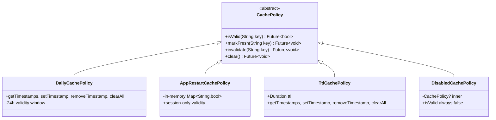
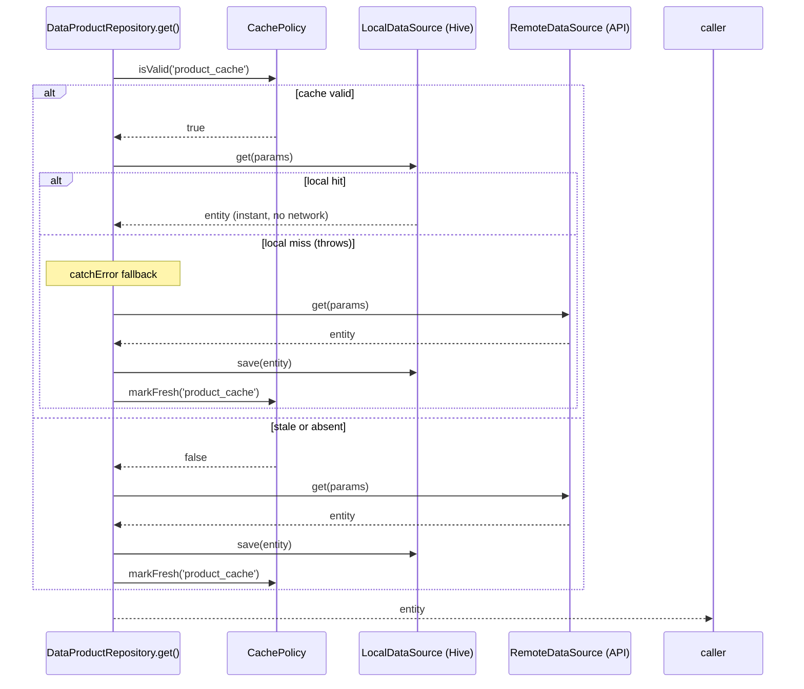

This page explains Zuraffa's caching architecture: how generated repositories orchestrate **two datasources** (remote and local) under a pluggable **`CachePolicy`**, what artifacts the `cache` plugin generates, and how a type-level **`CacheObserver`** keeps views synchronized after mutations. It covers the runtime framework only — offline-first sync (the architectural inverse) lives on its own page.

## The Dual DataSource Pattern

Zuraffa's caching strategy is a **dual datasource pattern**: a single repository implementation coordinates two datasources behind one domain interface. The remote datasource (`{Entity}RemoteDataSource`) is the source of truth for fresh data; the local datasource (`{Entity}LocalDataSource`) is a persistent, Hive-backed replica. The `CachePolicy` decides _when_ the replica is trustworthy.

```
┌──────────────────────────────────────────────────────────────────┐
│                      DataProductRepository                       │
│                                                                  │
│   get(id) / getList(params) / create / update / toggle / delete  │
│                                                                  │
│        ┌──────────┐  policy check  ┌──────────────────┐          │
│        │ CachePolicy │────────────▶│  isValid(key)?    │          │
│        └──────────┘                 └──────────────────┘          │
│              │ valid                        │ stale/miss         │
│              ▼                              ▼                    │
│   ┌───────────────────┐         ┌─────────────────────┐          │
│   │ ProductLocalDS    │         │ ProductRemoteDS     │          │
│   │ (Hive Box)        │         │ (API/GraphQL)       │          │
│   └───────────────────┘         └─────────────────────┘          │
│              │                        │ save + markFresh         │
│              └────────────────────────┘                          │
└──────────────────────────────────────────────────────────────────┘
```

Sources: [implementation_generator.dart](lib/src/plugins/repository/generators/implementation_generator.dart#L199-L249)

The pattern is selected by a single flag on `GeneratorConfig.enableCache`, and it is **mutually exclusive with sync** — the generator throws `ArgumentError` if both are enabled because "cache is remote-first; sync is local-first" and they are "architecturally incompatible":

```dart
if (config.enableCache && config.enableSync) {
  throw ArgumentError(
    'Cannot enable both --cache and --sync on the same entity. '
    'Cache is remote-first; sync is local-first. They are architecturally incompatible.',
  );
}
```

Sources: [implementation_generator.dart](lib/src/plugins/repository/generators/implementation_generator.dart#L75-L81)

The generated constructor reflects the trio of collaborators — two datasources plus the policy — injected as final fields:

```dart
final OrderDataSource _remoteDataSource;
final OrderLocalDataSource _localDataSource;
final CachePolicy _cachePolicy;

DataOrderRepository(this._remoteDataSource, this._localDataSource, this._cachePolicy);
```

Sources: [implementation_generator.dart](lib/src/plugins/repository/generators/implementation_generator.dart#L199-L249), verified by [cache_compilation_test.dart](test/integration/cache_compilation_test.dart#L62-L72)

### Three Repository Modes Compared

| Mode       | Source of truth              | Read path                              | Write path                                 | Selected by |
| ---------- | ---------------------------- | -------------------------------------- | ------------------------------------------ | ----------- |
| **Simple** | Remote (`_dataSource`)       | Remote only                            | Remote only                                | default     |
| **Cached** | Remote (`_remoteDataSource`) | Policy-gated local, fallback to remote | Remote-first + local replica + `markFresh` | `--cache`   |
| **Synced** | Local (`_localDataSource`)   | Local only (instant)                   | Local + pending metadata                   | `--sync`    |

Sources: [implementation_generator.dart](lib/src/plugins/repository/generators/implementation_generator.dart#L83-L104), [implementation_generator_synced.dart](lib/src/plugins/repository/generators/implementation_generator_synced.dart#L159-L184)

## The CachePolicy Abstraction

All cache decisions flow through one small interface in the core library. It is deliberately storage-agnostic — implementations receive timestamp persistence as injected callbacks:

```dart
abstract class CachePolicy {
  Future<bool> isValid(String key);
  Future<void> markFresh(String key);
  Future<void> invalidate(String key);
  Future<void> clear();
}
```

Sources: [cache_policy.dart](lib/src/core/cache_policy.dart#L1-L17)

Zuraffa ships four implementations in `cache_policies.dart`, exported from the package root so they are usable without extra imports:



Sources: [cache_policies.dart](lib/src/core/cache_policies.dart#L17-L199)

| Policy                  | Validity                    | Persistence                   | Storage of timestamps                            | Best for                              |
| ----------------------- | --------------------------- | ----------------------------- | ------------------------------------------------ | ------------------------------------- |
| `DailyCachePolicy`      | 24 hours from `markFresh`   | Persistent                    | Injected callbacks (SharedPreferences, Hive box) | Daily-refresh catalogs                |
| `AppRestartCachePolicy` | Current app session         | In-memory `Map<String, bool>` | None (volatile)                                  | Session config, rarely-changed data   |
| `TtlCachePolicy`        | Configurable `Duration`     | Persistent                    | Injected callbacks                               | Fine-grained control (e.g. 6h)        |
| `DisabledCachePolicy`   | Never (`isValid` ⇒ `false`) | Decorator over another policy | Delegates `clear`/`invalidate` to inner          | Debug mode, remote config kill-switch |

All persistent policies prefix stored keys with `cache_` (e.g. `cache_products`) and compare `DateTime.now().difference(cached)` against their window — `< 1 day` for daily, `< ttl` for TTL. The in-memory restart policy simply stores a boolean per key and loses everything on process restart. Sources: [cache_policies.dart](lib/src/core/cache_policies.dart#L33-L57), [cache_policies.dart](lib/src/core/cache_policies.dart#L79-L96), [cache_policies.dart](lib/src/core/cache_policies.dart#L132-L156), [cache_policies.dart](lib/src/core/cache_policies.dart#L182-L199)

## Read Path: Cache-First Orchestration

Reads are where the dual datasource pattern earns its keep. The generated `get` body follows a strict cache-first sequence:



Sources: [implementation_generator_cached.dart](lib/src/plugins/repository/generators/implementation_generator_cached.dart#L151-L232)

Three behaviors worth noting:

1. **Graceful degradation on cache miss** — when the policy says the cache is valid but the local read throws, the generated `catchError` closure logs `'Cache miss, fetching from remote'`, fetches, saves, marks fresh, and returns — the caller never sees the local failure.
2. **Conditional write-through** — the local `save` and `markFresh` calls are emitted as conditionals on `cacheValid`, so they execute only on the miss/stale branch, never on a hot read.
3. **`getList` keys are query-scoped** — the list cache key is composed as `{baseCacheKey}_{params.hashCode}`, meaning different `ListQueryParams` produce different cache entries. This prevents one filtered query from serving another's results.

Sources: [implementation_generator_cached.dart](lib/src/plugins/repository/generators/implementation_generator_cached.dart#L234-L335)

The generated `getList` uses the same structure with `saveAll`, and the Hive local datasource honors query semantics — `get` queries box values, `getList` applies `filter` then `orderBy` from the params. Sources: [local_generator_impl.dart](lib/src/plugins/datasource/builders/local_generator_impl.dart#L94-L128)

## Write Path: Write-Through Replica Updates

Mutations take a **remote-first, write-through** shape: the remote call is authoritative, and its result is mirrored into the local datasource so the next read is already warm:

| Method           | Generated sequence                                      |
| ---------------- | ------------------------------------------------------- |
| `create(entity)` | remote `create` → local `save` → `markFresh(baseKey)`   |
| `update(params)` | remote `update` → local `save` → `markFresh(baseKey)`   |
| `toggle(params)` | remote `toggle` → local `save` → `markFresh(baseKey)`   |
| `delete(params)` | remote `delete` → local `delete` → policy stale-marking |

Sources: [implementation_generator_cached.dart](lib/src/plugins/repository/generators/implementation_generator_cached.dart#L337-L363), [implementation_generator_cached.dart](lib/src/plugins/repository/generators/implementation_generator_cached.dart#L365-L391), [implementation_generator_cached.dart](lib/src/plugins/repository/generators/implementation_generator_cached.dart#L393-L419), [implementation_generator_cached.dart](lib/src/plugins/repository/generators/implementation_generator_cached.dart#L421-L442)

One caveat worth knowing: the delete body emits a call to `_cachePolicy.markStale(...)` — a method that does **not** exist on the `CachePolicy` interface (which defines `isValid`, `markFresh`, `invalidate`, `clear`). The interface's own invalidation primitive is `invalidate(key)`, and no extension method supplies `markStale` anywhere in `lib/`. This means a generated `delete` on a cached repository targets a method your custom `CachePolicy` must provide, or the method will not resolve. The stock generated policies (`DailyCachePolicy`, `TtlCachePolicy`, `AppRestartCachePolicy`) do not implement it.

Sources: [implementation_generator_cached.dart](lib/src/plugins/repository/generators/implementation_generator_cached.dart#L421-L442), [cache_policy.dart](lib/src/core/cache_policy.dart#L4-L16)

## Streaming Path: Dual Subscription Merge

Cached repositories with `watch`/`watchList` subscribe to **both** datasources simultaneously rather than gating on the policy:

- The **local subscription** feeds the `StreamController` directly — instant replay of persisted state.
- The **remote subscription** uses a data handler that both adds to the controller **and** saves into the local datasource (`save`/`saveAll`), keeping the replica fresh as the stream emits.

On cancel, both `remoteSub` and `localSub` are cancelled. This yields a "replay-then-live" stream: listeners immediately see local state, then receive live remote updates as they arrive.

Sources: [implementation_generator_cached.dart](lib/src/plugins/repository/generators/implementation_generator_cached.dart#L444-L474), [implementation_generator_cached.dart](lib/src/plugins/repository/generators/implementation_generator_cached.dart#L527-L582), verified by [repository_cached_stream_test.dart](test/plugins/repository/repository_cached_stream_test.dart#L35-L66)

## Generated Cache Infrastructure

The `cache` plugin (`lib/src/plugins/cache/`) generates the operational scaffolding around the pattern. With `--cache --di`, each run produces or regenerates:

```
lib/src/cache/
├── {entity}_cache.dart              # init{Entity}Cache() → Hive.openBox<Entity>('{entities}')
├── timestamp_cache.dart             # initTimestampCache() → Hive.openBox<int>('cache_timestamps')
├── daily_cache_policy.dart          # createDailyCachePolicy() → DailyCachePolicy (Hive-backed)
├── app_restart_cache_policy.dart    # createAppRestartCachePolicy()
├── ttl_{N}_minutes_cache_policy.dart# createTtl{N}MinutesCachePolicy()
├── hive_registrar.dart              # @GenerateAdapters + registerAdapters() extensions
├── hive_manual_additions.txt        # template for nested entities/enums
└── index.dart                       # exports + initAllCaches()
```

Sources: [cache_builder.dart](lib/src/plugins/cache/builders/cache_builder.dart#L43-L55), [doc/CACHE_INIT.md](doc/CACHE_INIT.md#L7-L20), [doc/CACHE_AUTOMATION_SUMMARY.md](doc/CACHE_AUTOMATION_SUMMARY.md#L8-L22)

Three generated pieces deserve close attention:

**Policy factory files.** Each policy type gets its own file with a factory function that wires Hive's `cache_timestamps` box into the policy's injected callbacks — `getTimestamps` reads `timestampBox.toMap()`, `setTimestamp`/`removeTimestamp`/`clearAll` delegate to box operations. The factory also guards on the global kill switch:

```dart
if (Zuraffa.disableCache) { return DisabledCachePolicy(); }
```

Sources: [cache_policy_builder.dart](lib/src/plugins/cache/builders/cache_policy_builder.dart#L4-L96)

**The Hive registrar.** `hive_registrar.dart` is regenerated from every `*_cache.dart` file in the cache directory, plus entries from `hive_manual_additions.txt` (for nested entities and enums that aren't cached themselves). It emits a `@GenerateAdapters` annotation with `AdapterSpec` entries, and two extensions — `HiveRegistrar on HiveInterface` and `IsolatedHiveRegistrar on IsolatedHiveInterface` — each providing `registerAdapters()`. A `part 'hive_registrar.g.dart'` directive connects it to the build_runner output. Sources: [cache_builder_registrar.dart](lib/src/plugins/cache/builders/cache_builder_registrar.dart#L4-L164), [cache_adapter_test.dart](test/integration/cache_adapter_test.dart#L162-L193)

**The cache index.** `index.dart` exports all `*_cache.dart` files and the timestamp cache, then provides `initAllCaches()` — the single call you make in `main()` before DI setup, alongside `Hive.initFlutter()`. Sources: [cache_builder.dart](lib/src/plugins/cache/builders/cache_builder.dart#L150-L200), [doc/CACHE_INIT.md](doc/CACHE_INIT.md#L84-L101)

## The Global Kill Switch

Beyond per-key policies, Zuraffa exposes a process-wide switch: `Zuraffa.disableCache`. When set to `true`, generated policy factories short-circuit to `DisabledCachePolicy`, whose `isValid` always returns `false` and whose `markFresh` is a no-op — so every repository read bypasses the local replica and hits the network. The decorator still delegates `invalidate` and `clear` to the wrapped policy, preserving cleanup of previously cached data. This is intended for debug mode or a remote-config flag.

```dart
static set disableCache(bool value) {
  _disableCache = value;
  Logger.root.info('Zuraffa cache disabled: $value');
}
```

Sources: [zuraffa.dart](lib/zuraffa.dart#L562-L597), [cache_policies.dart](lib/src/core/cache_policies.dart#L158-L199)

## DI Wiring

The `di` plugin assembles the triple-dependency constructor automatically. For a cached entity it resolves the remote and local datasources from `getIt` and constructs the policy through the generated factory — policy choice is baked in at registration time:

```dart
getIt.registerLazySingleton<OrderRepository>(
  () => DataOrderRepository(
    getIt<OrderRemoteDataSource>(),
    getIt<OrderLocalDataSource>(),
    createDailyCachePolicy(),   // or createTtl30MinutesCachePolicy()
  ),
);
```

The factory import is selected from `config.cachePolicy` (`daily_cache_policy.dart`, `app_restart_cache_policy.dart`, or `ttl_{N}_minutes_cache_policy.dart`). The local datasource registration resolves the Hive box — `Hive.box<Entity>('{entities}')` synchronously, or `registerSingletonAsync` with `openBox` — with the box name pluralized (`products`) only when the entity has list methods. Sources: [di_plugin.dart](lib/src/plugins/di/di_plugin.dart#L472-L505), [di_plugin.dart](lib/src/plugins/di/di_plugin.dart#L318-L331), verified by [cache_compilation_test.dart](test/integration/cache_compilation_test.dart#L77-L112)

## Reactive Cache Layer: Cross-View Synchronization

The dual datasource pattern persists data; a companion layer propagates it to the UI. `CacheObserver` is a type-keyed singleton stream registry — `notify<T>(entity)`, `notifyDelete<T>(id)`, `listen<T>(callback)`, `dispose<T>()`, `reset()` — where each entity type gets an isolated internal `Signal` stream. Sources: [cache_observer.dart](lib/src/state/cache/cache_observer.dart#L18-L64)

Two extension points bind this observer to the generated state layer:

- **`CacheBinding<T>.bindCache()`** on `SignalSlice<T>`: subscribes the slice to cache events for type `T`. An update calls `result.emitSuccess(entity)`; a delete calls `result.emitFailure(UnknownFailure(...))` (the type-safe representation of "gone" for non-nullable data). The subscription is tracked via `trackCacheSubscription` and cancelled on slice disposal, so disposed slices never leak listeners. Sources: [cache_binding.dart](lib/src/state/cache/cache_binding.dart#L14-L41), [signal_slice.dart](lib/src/state/slices/signal_slice.dart#L113), verified by [cache_observer_test.dart](test/state/cache_observer_test.dart#L70-L147)

- **`CacheMutator<T>` mixin**: for mutation use cases, `notifyCache(entity)` and `notifyCacheDelete(id)` push updates into the observer after a mutation — "View B receives update automatically" without a network re-fetch. Sources: [cache_binding.dart](lib/src/state/cache/cache_binding.dart#L43-L67), verified by [cache_observer_test.dart](test/state/cache_observer_test.dart#L149-L162)

The `@Cacheable` decorator (DDA) marks which entity types should get the binding; the generated `DomainState` emits `..bindCache()` on the corresponding slice, and the runtime `CacheBinding` extension executes it. Sources: [cache_binding_generator.dart](lib/src/state/generator/cache_binding_generator.dart#L13-L41)

## CLI Surface & Configuration

Caching is enabled through `zfa make` flags; policy options are contributed by the cache plugin's schema (`cache-policy`, `cache-storage`, `ttl`) and merged into the command dynamically:

```bash
zfa make Product --methods=get,getList --repository --data --cache \
  --cache-policy=daily --cache-storage=hive        # default policy
zfa make Product --cache --cache-policy=ttl --ttl=30
zfa cache Product --policy=daily --storage=hive --ttl=30   # standalone plugin command
```

Sources: [make_command.dart](lib/src/commands/make_command.dart#L152-L157), [make_command.dart](lib/src/commands/make_command.dart#L225-L240), [cache_plugin.dart](lib/src/plugins/cache/cache_plugin.dart#L57-L69), [cache_command.dart](lib/src/commands/cache_command.dart#L10-L18)

| Option            | Values                        | Default | Effect                                        |
| ----------------- | ----------------------------- | ------- | --------------------------------------------- |
| `--cache`         | flag                          | off     | Enables dual datasource repository generation |
| `--cache-policy`  | `daily` \| `restart` \| `ttl` | `daily` | Selects the generated policy factory          |
| `--cache-storage` | `hive`                        | `hive`  | Storage backend for the local datasource      |
| `--ttl`           | minutes                       | `1440`  | TTL duration when policy is `ttl`             |

Config fields persist in `.zfa.json` / `GeneratorConfig` as `cache`, `cache_policy`, `cache_storage`, `ttl_minutes`. Sources: [generator_config.dart](lib/src/models/generator_config.dart#L210-L212), [generator_config.dart](lib/src/models/generator_config.dart#L638-L640)

## Boundary: Cache vs Offline-First Sync

Because both features reuse the same two-datasource shape, it is easy to confuse them — but they are inverse architectures. Cache is **remote-first**: the network is authoritative, local is a disposable replica that can be wiped without data loss. Sync is **local-first**: local writes are authoritative and queued for background propagation, surviving offline use. The generator enforces this distinction by refusing `--cache` and `--sync` together on one entity. If your requirement is offline capability rather than read-path latency, see [Offline-First Sync Strategies](16-offline-first-sync-strategies).

Sources: [implementation_generator.dart](lib/src/plugins/repository/generators/implementation_generator.dart#L75-L81), [docs/architecture/offline-first-sync.md](docs/architecture/offline-first-sync.md#L1-L3)

## Next Steps

- Continue the runtime framework trail with [Offline-First Sync Strategies](16-offline-first-sync-strategies) to see the inverse local-first architecture.
- See how policies plug into generated DI in [Dependency Injection Generation](17-dependency-injection-generation).
- For the reactive side (slices, signals, and the observer's host layer), see [Presentation Layer: Controller, View & Presenter](12-presentation-layer-controller-view-and-presenter).
- To test cached repositories, the [Testing Strategy & Result Matchers](26-testing-strategy-and-result-matchers) page covers mocking `CachePolicy` and datasources.
