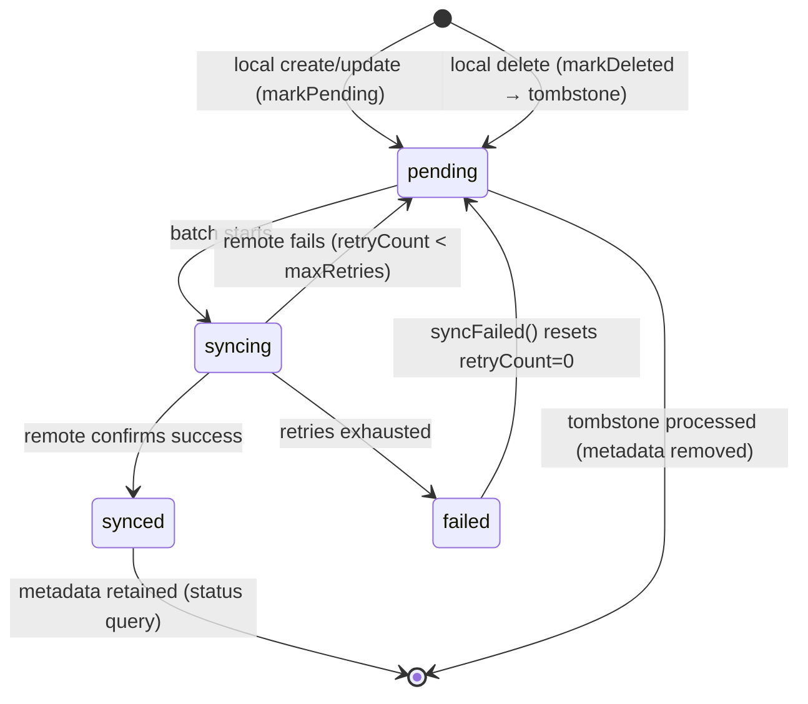
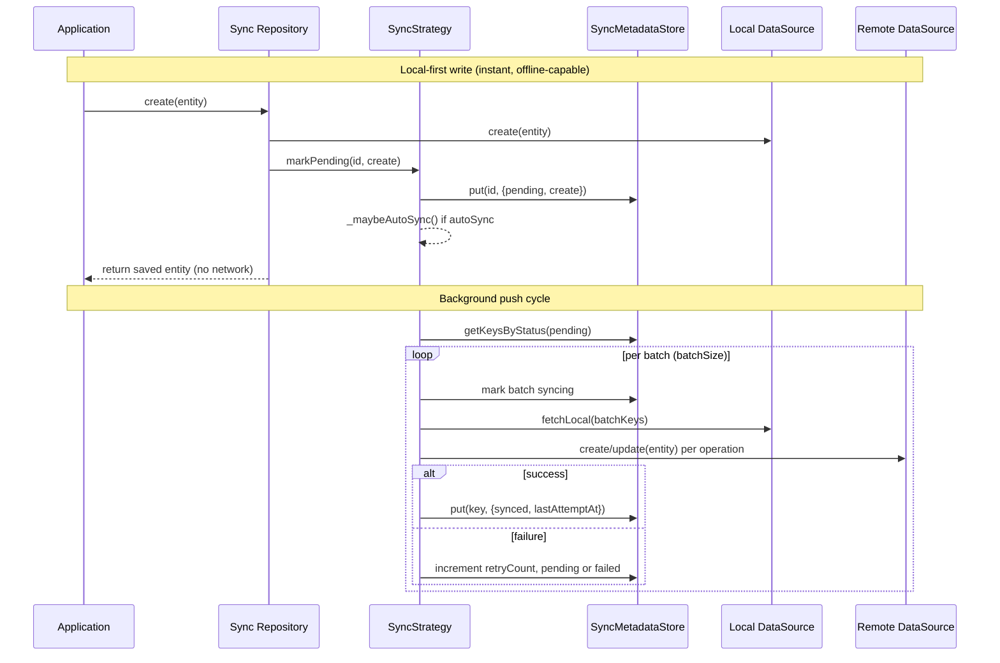

Zuraffa's sync subsystem implements **local-first persistence**: the local data source is the source of truth, and the remote data source is a synchronization target. Where the cache plugin treats remote as authoritative and local as a disposable mirror, sync inverts the dependency — every write lands in local storage instantly and returns to the caller without network I/O, while a swappable `SyncStrategy<T>` reconciles those local changes with the remote in the background. This page examines the strategy abstraction itself: the status lifecycle, the push and bidirectional pipelines, retry/backoff semantics, conflict resolution, and how generated code wires strategies into repositories.

## The Strategy Abstraction

The sync contract is defined by `SyncStrategy<T>`, an abstract class in the core library that mirrors the role of `CachePolicy` for cached repositories — it is the swappable piece that controls all non-CRUD behavior injected into a sync-enabled repository. The repository owns four dependencies: the local data source, the remote data source, a `SyncMetadataStore`, and the strategy itself, as generated by the repository implementation generator. Every sync-specific method on the repository (`syncPending`, `pullRemote`) is a thin delegate to the injected strategy.

```mermaid
classDiagram
    class SyncStrategy~T~ {
        <<abstract>>
        +syncPending({CancelToken?})
        +syncFailed({CancelToken?})
        +pullRemote({CancelToken?})
        +getPendingCount()
        +getSyncStatus(String key)
        +markPending(String key, {SyncOperation})
        +markDeleted(String key)
    }
    class PushOnlySyncStrategy~T~ {
        -fetchLocal(List~String~ keys)
        -createRemote(T entity)
        -updateRemote(T entity)
        -deleteRemote(String key)
        -keyResolver(T entity)
        -metadataStore
        -config
        +syncPending({CancelToken?})
        +syncFailed({CancelToken?})
        +pullRemote() UnimplementedError
    }
    class BidirectionalSyncStrategy~T~ {
        -fetchRemoteList()
        -saveLocal(T entity)
        -conflictResolver(T? local, T remote)
        +pullRemote({CancelToken?})
    }
    class SyncMetadataStore {
        -Box~SyncMetadata~ box
        +get(String key)
        +put(String key, SyncMetadata)
        +remove(String key)
        +getKeysByStatus(SyncStatus)
        +countByStatus(SyncStatus)
        +clear()
    }
    class SyncConfig {
        +batchSize
        +maxRetries
        +backoffBaseMs
        +backoffMaxMs
        +direction
        +autoSync
        +backoffDelayFor(int retryCount)
    }
    SyncStrategy~T~ <|-- PushOnlySyncStrategy~T~
    PushOnlySyncStrategy~T~ <|-- BidirectionalSyncStrategy~T~
    PushOnlySyncStrategy~T~ --> SyncMetadataStore
    PushOnlySyncStrategy~T~ --> SyncConfig
```

The interface contract is deliberately narrow — five mutation/query verbs plus two sync drivers. `markPending` and `markDeleted` are called *by the repository* after a local write; `syncPending`, `syncFailed`, and `pullRemote` are called *by the application* when it decides to reconcile. The two query methods (`getPendingCount`, `getSyncStatus`) give the app observability into the queue without exposing the underlying box.

Sources: [sync_strategy.dart](lib/src/core/sync_strategy.dart#L42-L83), [implementation_generator.dart](lib/src/plugins/repository/generators/implementation_generator.dart#L250-L315), [implementation_generator_synced.dart](lib/src/plugins/repository/generators/implementation_generator_synced.dart#L287-L341)

The crucial design constraint is that `PushOnlySyncStrategy<T>` lives in the framework and can never know about concrete entity types or datasource interfaces. It therefore accepts **callback functions** that generated (or hand-written) code wires up at construction time. The strategy factory generated by `SyncBuilder` binds these callbacks to the entity's local and remote datasources: `fetchLocal` maps to `localDataSource.getByIds`, `createRemote`/`updateRemote`/`deleteRemote` map to the remote CRUD verbs, and `keyResolver` extracts the sync key from `entity.id`. This keeps the framework generic while the generated factory provides the type-safe glue — a contract documented directly in the strategy source.

Sources: [push_only_sync_strategy.dart](lib/src/plugins/sync/builders/push_only_sync_strategy.dart#L39-L75), [sync_builder.dart](lib/src/plugins/sync/builders/sync_builder.dart#L255-L297)

## The Sync Status Lifecycle

Every locally-written record is tracked by a `SyncMetadata` entry in a dedicated Hive box, keyed by the entity identifier. The metadata deliberately excludes the entity itself — no sync infrastructure fields pollute the domain entity. Each entry carries the current `SyncStatus`, the operation that needs replaying (`create`/`update`/`delete`), a retry counter, timestamps, and the last error message. A non-null `deletedAt` marks a **tombstone**: the record was hard-deleted locally and the metadata entry now signals a pending remote delete.



Four states, each with a precise meaning. `pending` is the queue: fresh, never-failed records awaiting transmission (including tombstones). `syncing` is a transient in-flight marker written at the start of batch processing. `synced` is the terminal success state — the record exists on both ends and requires no further action. `failed` is the terminal exhaustion state, reached only after `maxRetries` attempts, and can only leave that state through an explicit `syncFailed()` reset. Note that `getSyncStatus` returns `synced` for untracked keys, making "not in the queue" and "successfully synced" indistinguishable by design — both mean "nothing to do."

Sources: [sync_status.dart](lib/src/core/sync_status.dart#L14-L26), [sync_metadata.dart](lib/src/core/sync_metadata.dart#L17-L35), [push_only_sync_strategy.dart](lib/src/plugins/sync/builders/push_only_sync_strategy.dart#L321-L325)

## The Push Processing Pipeline

`syncPending` and `syncFailed` converge on a single `_processKeys` pipeline, which partitions the incoming keys into tombstones and live records, then executes a deterministic order: **remote deletes first, then live record pushes in batches of `batchSize`**. Tombstones-first ordering matters because a remote delete must not race against a subsequent create of a record with the same key; processing deletes first guarantees the remote state is clean before any upserts.



Within `_syncBatch`, the strategy first marks every record in the batch as `syncing`, then fetches the corresponding entities from local storage in a single call, then pushes each entity to remote. Dispatch is driven by the recorded `SyncOperation`: `create` routes to `createRemote`, anything else routes to `updateRemote` — tombstones never reach this path because they were partitioned out earlier. Two edge cases are handled explicitly. A record marked pending whose entity is missing from local storage (e.g., a write that was never persisted) is silently dropped: its metadata entry is removed rather than pushed, since there is nothing to transmit. And because `_syncEntity` writes a **fresh** `SyncMetadata` on success (not a `copyWith`), the retry count and error history are atomically reset the moment the remote confirms.

Sources: [push_only_sync_strategy.dart](lib/src/plugins/sync/builders/push_only_sync_strategy.dart#L120-L202), [push_only_sync_strategy.dart](lib/src/plugins/sync/builders/push_only_sync_strategy.dart#L204-L235)

## Failure, Retry & Backoff

Failures are handled by `_handleFailure`, which increments `retryCount` and decides the record's fate. If the new count is still below `maxRetries`, the record returns to `pending` — it stays in the queue for the next cycle with its error recorded. If the count reaches `maxRetries`, the record transitions to `failed` and leaves the queue permanently until explicitly reset. The delay between attempts is governed by `SyncConfig.backoffDelayFor`, an exponential formula with a hard cap: `min(backoffBaseMs * 2^retryCount, backoffMaxMs)`, implemented with a left shift for efficiency. Defaults are base 1000 ms, cap 60 s, and `maxRetries` of 5 — meaning the delay sequence is 1 s, 2 s, 4 s, 8 s, 16 s, then the 60 s cap for any further counts (though the cap is never reached at the default retry limit).

Sources: [sync_config.dart](lib/src/core/sync_config.dart#L44-L51), [push_only_sync_strategy.dart](lib/src/plugins/sync/builders/push_only_sync_strategy.dart#L241-L277)

The framework makes a deliberate distinction between two retry audiences, and this separation is the core of the infinite-loop safety argument:

| Trigger | Method | Records processed | Semantics |
|---------|--------|-------------------|-----------|
| After each local write (autoSync) | `syncPending()` | Only `pending` — fresh, never-failed | Fire-and-forget, returns quickly when queue is empty |
| On app start / explicit retry | `syncFailed()` | Resets `failed` → `pending` with `retryCount=0`, then processes | Bounded: each cycle is capped by `maxRetries` |

`syncPending` never touches failed records, so an unhealthy record cannot hammer the server on every write. `syncFailed` is the only path out of the `failed` state, and it gives exhausted records a clean slate before reprocessing them through the identical pipeline. The call graph is acyclic by construction: writes call `markPending`/`markDeleted`, which may fire `_maybeAutoSync` → `unawaited(syncPending())`; neither `syncPending` nor `syncFailed` ever calls `markPending`, `markDeleted`, or itself; `_handleFailure` only mutates metadata. Each cycle therefore terminates, and new cycles start only from external triggers (a write or an explicit application call). This invariant is exercised directly by the strategy test suite, which verifies the retry-count progression and the eventual `failed` transition with `lastError` captured.

Sources: [push_only_sync_strategy.dart](lib/src/plugins/sync/builders/push_only_sync_strategy.dart#L77-L118), [push_only_sync_strategy.dart](lib/src/plugins/sync/builders/push_only_sync_strategy.dart#L279-L312), [push_only_sync_strategy_test.dart](test/plugins/sync/push_only_sync_strategy_test.dart#L145-L183)

## Bidirectional Pull & Conflict Resolution

`BidirectionalSyncStrategy<T>` extends `PushOnlySyncStrategy<T>` — inheriting the entire push pipeline and its protected accessors — and adds the pull half: `fetchRemoteList` (remote `getAll`), `saveLocal` (local upsert), and a `conflictResolver`. The pull algorithm is single-pass over the remote snapshot. For each remote record, the strategy reads its local metadata: if the record is untracked or already `synced`, the remote version is accepted unconditionally and saved locally with fresh `synced` metadata. If the record is `pending` or `failed` locally, a conflict exists — the local version has unsent changes but the remote also has a version — and the conflict resolver is invoked.

```mermaid
flowchart TD
    A[pullRemote: fetch remote list] --> B{For each remote record}
    B --> C{metadata == null or synced?}
    C -->|Yes| D[saveLocal(remote) → mark synced]
    C -->|No (pending/failed)| E[fetchLocal for key]
    E --> F[conflictResolver(local, remote)]
    F --> G{resolver returned remote?}
    G -->|Yes| H[saveLocal(resolved) → mark synced]
    G -->|No| I[saveLocal(resolved) → keep pending]
    D --> J[next record]
    H --> J
    I --> J
```

The resolver's return value carries semantic weight beyond which value wins. If it returns the remote version, the local pending change is considered **discarded in favor of remote**, and the record is marked `synced` — the queued local change never pushes. If it returns the local version (or a merged hybrid), the record **remains pending**, so the local change still pushes on the next `syncPending` cycle. The default resolver is `(local, remote) => remote` — remote-wins for server-authoritative data. Applications that need last-write-wins or field-level merging supply a custom resolver at wiring time, as the strategy's own documentation demonstrates with an `updatedAt` comparison. Note that tombstones are invisible to the pull path: a locally-deleted record has no entity to pass to `saveLocal`, so its metadata entry is untouched and its remote delete still fires through the inherited push pipeline.

Sources: [bidirectional_sync_strategy.dart](lib/src/plugins/sync/builders/bidirectional_sync_strategy.dart#L41-L100), [bidirectional_sync_strategy.dart](lib/src/plugins/sync/builders/bidirectional_sync_strategy.dart#L102-L133)

## Triggering the Sync Engine

The framework does not impose a single sync schedule; it provides the infrastructure and leaves trigger timing to the application. There are exactly three entry points:

1. **`autoSync` (write-driven)**. When `SyncConfig.autoSync` is `true`, every `markPending` and `markDeleted` call fires `unawaited(syncPending())` — a fire-and-forget background cycle. The caller (a repository write method) returns immediately; if the device is online the record pushes in milliseconds, if offline it stays `pending` for the next trigger. Default is `false`, meaning sync happens only when explicitly invoked.

2. **Explicit repository delegation**. The generated repository exposes `syncPending({cancelToken})` and `pullRemote({cancelToken})`, which delegate straight to the injected strategy. The app can call these on connectivity restoration, on a timer, on app resume, or from a manual "Sync now" button.

3. **`syncFailed` (recovery)**. Not surfaced on the repository — it lives on the strategy interface and is the app-start recovery hook that resets exhausted records. This is the documented retry path for records that hit `maxRetries` while the device was offline for an extended period.

Every cycle in the pipeline checks the `CancelToken` at batch boundaries and between individual entity pushes (`cancelToken?.throwIfCancelled()`), enabling cooperative cancellation of long sync runs — for example, when the user backgrounds the app. Cancellation is checked before tombstone processing, before each batch, and before each entity push, so a cancelled run aborts cleanly between units of work rather than mid-transmission.

Sources: [sync_strategy.dart](lib/src/core/sync_strategy.dart#L42-L82), [push_only_sync_strategy.dart](lib/src/plugins/sync/builders/push_only_sync_strategy.dart#L135-L149), [push_only_sync_strategy.dart](lib/src/plugins/sync/builders/push_only_sync_strategy.dart#L304-L312), [implementation_generator_synced.dart](lib/src/plugins/repository/generators/implementation_generator_synced.dart#L287-L341), [cancel_token.dart](lib/src/core/cancel_token.dart#L74-L81)

## Generated Runtime Wiring

`SyncBuilder` produces four categories of output for each sync-enabled entity, all driven by a single `GeneratorConfig` carrying the sync parameters:

| Generated artifact | Path | Responsibility |
|--------------------|------|----------------|
| Sync box init | `sync/{entity_snake}_sync.dart` | `init{Entity}Sync()` opens `Hive.openBox<SyncMetadata>('sync_metadata_{entity_snake}')` |
| Metadata store factory | `data/datasources/{entity_snake}/{entity_snake}_sync_metadata_store.dart` | `create{Entity}SyncMetadataStore()` wraps the box in a `SyncMetadataStore` |
| Strategy factory | `data/datasources/{entity_snake}/{entity_snake}_sync_strategy.dart` | `create{Entity}SyncStrategy(...)` builds `PushOnlySyncStrategy` or `BidirectionalSyncStrategy` wired to the entity's datasources |
| Sync barrel | `sync/index.dart` | Aggregates every `init{Entity}Sync()` into a single `initAllSyncs()` — parallel to `cache/index.dart` |

The strategy factory is the wiring hub. It binds the five push callbacks (`fetchLocal` → `localDataSource.getByIds`, `createRemote`/`updateRemote`/`deleteRemote` → remote CRUD, `keyResolver` → `entity.id`) and, in bidirectional mode, adds `fetchRemoteList` → `remoteDataSource.getAll` and `saveLocal` → `localDataSource.put`. It also bakes the configured `SyncConfig` — batch size, retry limit, backoff bounds, and direction — into the strategy instance. The barrel file is regenerated on every sync generation by scanning the `sync/` directory, and is deleted if no sync files remain, keeping the app bootstrap in lockstep with the entity set.

Sources: [sync_builder.dart](lib/src/plugins/sync/builders/sync_builder.dart#L41-L52), [sync_builder.dart](lib/src/plugins/sync/builders/sync_builder.dart#L62-L108), [sync_builder.dart](lib/src/plugins/sync/builders/sync_builder.dart#L119-L173), [sync_builder.dart](lib/src/plugins/sync/builders/sync_builder.dart#L195-L357), [sync_builder.dart](lib/src/plugins/sync/builders/sync_builder.dart#L359-L432)

On the repository side, the sync-enabled implementation carries four final fields — `_localDataSource`, `_remoteDataSource`, `_syncMetadataStore`, `_syncStrategy` — and rewrites every CRUD verb to a local-first flow: reads (`get`, `getList`) and streams (`watch`, `watchList`) hit local storage only; `create` and `update` save locally then call `markPending` with the correct `SyncOperation`; `delete` hard-deletes locally then calls `markDeleted`, producing the tombstone. The DI plugin resolves all four dependencies when registering the repository — `getIt<SyncMetadataStore>()` and `getIt<SyncStrategy<{Entity}>>()` alongside the two datasources — and, because sync implies both endpoints, the datasource plugin generates the local and remote datasource pair whenever `enableSync` is set.

Sources: [implementation_generator_synced.dart](lib/src/plugins/repository/generators/implementation_generator_synced.dart#L159-L285), [di_plugin.dart](lib/src/plugins/di/di_plugin.dart#L506-L527), [datasource_plugin.dart](lib/src/plugins/datasource/datasource_plugin.dart#L260-L268)

## Configuration Reference

Sync parameters flow through three surfaces: the `zfa make` flags, the standalone `zfa sync` command, and the plugin's capability schema (which is what the MCP/AI-agent surface uses). All three converge on the same `GeneratorConfig` fields with identical defaults.

| Parameter | `zfa make` flag | `zfa sync` option | Default | Meaning |
|-----------|----------------|-------------------|---------|---------|
| Direction | `--sync` / `--bidirectional` | `--direction=push\|bidirectional` | `push` | Push-only, or push + pull with conflict resolution |
| Batch size | `--sync-batch-size` | `--batch-size` | `50` | Records processed per batch against remote |
| Max retries | `--sync-max-retries` | `--max-retries` | `5` | Attempts before a record is marked `failed` |
| Backoff base | (plugin schema only) | — | `1000` ms | `backoffBaseMs` for exponential backoff |
| Backoff cap | (plugin schema only) | — | `60000` ms | `backoffMaxMs` ceiling |
| autoSync | (runtime `SyncConfig`) | — | `false` | Fire-and-forget push after every local write |

The plugin declares `runAfter: ['datasource', 'repository']`, guaranteeing that the datasources and repository implementation exist before sync support files are generated, and it is registered in the plugin loader immediately after `CachePlugin`. The capability schema additionally exposes `dryRun`, `force`, and `verbose` so sync generation can be previewed and planned through the capability/plan system.

Sources: [make_command.dart](lib/src/commands/make_command.dart#L152-L172), [sync_command.dart](lib/src/commands/sync_command.dart#L10-L27), [create_sync_capability.dart](lib/src/plugins/sync/capabilities/create_sync_capability.dart#L18-L57), [sync_plugin.dart](lib/src/plugins/sync/sync_plugin.dart#L55-L70), [plugin_loader.dart](lib/src/cli/plugin_loader.dart#L107-L130)

## Design Boundaries

Three architectural invariants define what sync is *not*, and they are enforced at generation time rather than at runtime:

- **Sync and cache are mutually exclusive.** The repository generator throws an `ArgumentError` if both `enableCache` and `enableSync` are set on the same entity: "Cache is remote-first; sync is local-first. They are architecturally incompatible." The two plugins solve opposite problems and cannot coexist on one entity — though different entities in the same app may use either model independently.

- **The domain entity stays pure.** Sync state lives exclusively in `SyncMetadata` inside a dedicated Hive box, keyed by entity id. No `isDirty`, `pendingSync`, or timestamp fields ever appear on the entity. The tradeoff is that `SyncMetadataStore.getKeysByStatus` must scan the entire box and filter by status — an O(n) query with no index — which is acceptable because the queue is keyed for point lookups, not range scans.

- **Framework code never knows entity types.** The strategy is generic over `T` and receives behavior as callbacks; all entity-specific knowledge is confined to the generated factory. This is what makes the strategy swappable — a custom `SyncStrategy` can replace the generated one at DI registration time without touching the repository.

The strategy abstraction slots into the wider Zuraffa runtime: it pairs with the [Cache Policies & Dual DataSource Pattern](15-cache-policies-and-dual-datasource-pattern) as its architectural inverse, consumes `CancelToken` from the same cancellation model used across [UseCase Hierarchy & the Result Pattern](10-usecase-hierarchy-and-the-result-pattern), and its generated factories are registered through [Dependency Injection Generation](17-dependency-injection-generation). For the generation mechanics behind the wiring — how the capability system plans sync files and how the transactional writer persists them — see [Plugin System Architecture](7-plugin-system-architecture) and [Transactional File System, Revert & Plan Store](9-transactional-file-system-revert-and-plan-store).

Sources: [implementation_generator.dart](lib/src/plugins/repository/generators/implementation_generator.dart#L75-L104), [sync_metadata_store.dart](lib/src/plugins/sync/builders/sync_metadata_store.dart#L51-L63), [zuraffa.dart](lib/zuraffa.dart#L188-L199)

---

*Page 16 of 30 — Deep Dive / Runtime Framework. Next: [Dependency Injection Generation](17-dependency-injection-generation).*