Zuraffa treats dependency injection as a **generated artifact**, not a runtime convention. When you pass `--di` (or enable the `di` plugin), the generator writes a complete `lib/src/di/` tree: one registration file per class, category-level index files, a root `setupDependencies` entry point, and a shared service locator — all targeting the `get_it` package, which Zuraffa re-exports from its root library. This page explains how those files are produced, how the generator decides *what* to register, and how a second, decorator-driven path (`zfa build`) generates a `ZuraffaContainer`-based injection file instead.

## Two Paths to Wiring

DI generation lives almost entirely inside a single plugin, `DiPlugin`, which exposes two capabilities — `create` (generate registrations for a named entity/use case) and `register` (wire an already-existing class). The plugin is a `FileGeneratorPlugin` that also implements `CliAwarePlugin`, giving it a dedicated `zfa di` command, and it declares `configKey: 'diByDefault'` so projects can turn it on globally in `.zfa.json` rather than per-command.

Sources: [di_plugin.dart](lib/src/plugins/di/di_plugin.dart#L24-L64)

Because the plugin must reference files that other plugins generate (usecases, repositories, services, datasources, providers, and presentation classes), it declares `runAfter` for all of them — the plugin registry's topological sort guarantees the DI plugin executes last in a multi-plugin `zfa make` run, so every class it registers already exists.

Sources: [di_plugin.dart](lib/src/plugins/di/di_plugin.dart#L67-L93)

The plugin's `configSchema` accepts exactly two knobs — `use-mock` (bind mock implementations instead of remote ones) and `framework` (currently a single allowed value, `get_it`) — and the plugin reads them plus the shared `normalizedOptions` map to resolve caching flags from other plugins.

Sources: [di_plugin.dart](lib/src/plugins/di/di_plugin.dart#L78-L147)

The second path is entirely separate: the DDA (decorator-driven architecture) pipeline activated by `zfa build`. An `ASTScanner` finds `@Datasource` and `@Repository` annotations on user classes, a `DIPlugin` (registered under the `dda` package) collects their metadata, and a `DIGenerator` emits `zuraffa_injection.g.dart` — a `configureZuraffaInjections()` function that populates the lightweight runtime `ZuraffaContainer` instead of `GetIt`.

```mermaid
flowchart TB
    subgraph PathA["Path A — get_it (zfa make / zfa di)"]
        CLI1["zfa make Product --di"] --> Gen1["PluginManager → DiPlugin.generate"]
        Gen1 --> RB["RegistrationBuilder (code_builder)"]
        RB --> F1["lib/src/di/{usecases,datasources,repositories,services,providers}/*_di.dart"]
        F1 --> Det["RegistrationDetector + AppendExecutor"]
        Det --> F2["category index.dart files"]
        F2 --> F3["di/index.dart → setupDependencies(GetIt)"]
        F3 --> SL["di/service_locator.dart → final getIt"]
    end
    subgraph PathB["Path B — ZuraffaContainer (zfa build)"]
        CLI2["zfa build"] --> Scan["ASTScanner"]
        Scan --> Ann["@Datasource / @Repository annotations"]
        Ann --> DDA["DDA DIPlugin.onApply"]
        DDA --> DG["DIGenerator"]
        DG --> F4["zuraffa_injection.g.dart → configureZuraffaInjections()"]
        F4 --> ZC["ZuraffaContainer.instance"]
    end
```



Sources: [di_plugin.dart](lib/src/plugins/di/di_plugin.dart#L95-L133), [build_pipeline.dart](lib/src/dda/compiler/build_pipeline.dart#L32-L100), [dda/di_plugin.dart](lib/src/dda/plugins/di/di_plugin.dart#L31-L76)

## The Generated DI Tree

Both paths produce the same physical shape under `lib/src/di/`, as seen in the bundled example project. The `get_it` path writes one small file per class into a category subfolder, then synthesizes `index.dart` files that aggregate them:

```
lib/src/di/
├── index.dart                  # setupDependencies(GetIt) — the single entry point
├── service_locator.dart        # final GetIt getIt = GetIt.instance
├── datasources/
│   ├── index.dart              # registerAllDataSources(GetIt)
│   ├── product_remote_datasource_di.dart
│   ├── product_local_datasource_di.dart
│   ├── product_mock_datasource_di.dart
│   └── todo_remote_datasource_di.dart
├── repositories/
│   ├── index.dart              # registerAllRepositories(GetIt)
│   └── product_repository_di.dart
└── usecases/
    ├── index.dart              # registerAllUseCases(GetIt)
    └── get_concert_usecase_di.dart
```

Sources: [example/lib/src/di/index.dart](example/lib/src/di/index.dart#L1-L16), [example/lib/src/di/datasources/index.dart](example/lib/src/di/datasources/index.dart#L1-L20), [example/lib/src/di/service_locator.dart](example/lib/src/di/service_locator.dart#L1-L7)

A registration file is deliberately small and mechanical: a single `registerX(GetIt getIt)` function whose body is one `getIt.registerLazySingleton<Type>(() => ...)` call. The `RegistrationBuilder` assembles these files with `package:code_builder`, emitting a formatted library with the given imports, the `void` function, and the `GetIt` parameter — so the per-class files never duplicate the locator import or call site.

Sources: [registration_builder.dart](lib/src/plugins/di/builders/registration_builder.dart#L10-L35)

```dart
// di/datasources/product_remote_datasource_di.dart
import 'package:zuraffa/zuraffa.dart';

import '../../data/datasources/product/product_remote_datasource.dart';

void registerProductRemoteDataSource(GetIt getIt) {
  getIt.registerLazySingleton<ProductRemoteDataSource>(
    () => ProductRemoteDataSource(),
  );
}
```

Sources: [product_remote_datasource_di.dart](example/lib/src/di/datasources/product_remote_datasource_di.dart#L1-L10)

The `service_locator.dart` is generated only once (it is skipped if it already exists and `--force` is not set) and exposes the global `getIt` plus re-exports of `GetIt` and `setupDependencies`, so widgets can resolve dependencies with a single import.

Sources: [service_locator_builder.dart](lib/src/plugins/di/builders/service_locator_builder.dart#L10-L31), [di_plugin.dart](lib/src/plugins/di/di_plugin.dart#L1453-L1486)

## Registration Units and the Decision Matrix

The `generate` method is a large branch tree that maps `GeneratorConfig` flags onto concrete registration files. The first fork is the use-case family: orchestrator use cases (multiple composed use cases), entity-based use cases (one per CRUD method), and custom use cases (explicit `repo`/`service` dependencies). The method-name → class-name mapping is centralized in `_getUseCaseInfo`, which translates `get`, `list`, `create`, `update`, `delete`, `toggle`, `watch`, and `watchList` into `Get{Entity}UseCase`, `Get{Entity}ListUseCase`, and so on — and the generated registration resolves the matching repository or service through `getIt<...>()`.

Sources: [di_plugin.dart](lib/src/plugins/di/di_plugin.dart#L183-L212), [di_plugin.dart](lib/src/plugins/di/di_plugin.dart#L797-L812), [di_plugin.dart](lib/src/plugins/di/di_plugin.dart#L1099-L1139)

```dart
// di/usecases/get_concert_usecase_di.dart
void registerGetConcertUseCase(GetIt getIt) {
  getIt.registerLazySingleton<GetConcertUseCase>(
    () => GetConcertUseCase(getIt<ConcertRepository>()),
  );
}
```

Sources: [get_concert_usecase_di.dart](example/lib/src/di/usecases/get_concert_usecase_di.dart#L1-L11)

For data-layer classes, the plugin branches on the flags that other generation features set. The remote datasource is the default; mock, local, cache, and sync each redirect the constructor wiring — and sometimes the registration API itself. The decision surface is summarized below.

| Mode | Selected by | DataSource registered | Repository constructor wiring |
|---|---|---|---|
| **Remote (default)** | no extra flags | `{Entity}RemoteDataSource` (lazy singleton) | `Data{Entity}Repository(getIt<RemoteDS>())` |
| **Mock** | `--use-mock` | `{Entity}MockDataSource` | `Data{Entity}Repository(getIt<MockDS>())` |
| **Local only** | `--local` | `{Entity}LocalDataSource` | `Data{Entity}Repository(getIt<LocalDS>())` |
| **Cached** | `--cache` | both Remote + Local | `Data{Entity}Repository(remote, local, create{Ttl/Daily/Restart}CachePolicy())` |
| **Synced** | `--sync` | both Local + Remote | `Data{Entity}Repository(local, remote, SyncMetadataStore, SyncStrategy<Entity>())` |

Sources: [di_plugin.dart](lib/src/plugins/di/di_plugin.dart#L254-L298), [di_plugin.dart](lib/src/plugins/di/di_plugin.dart#L406-L450), [di_plugin.dart](lib/src/plugins/di/di_plugin.dart#L452-L579)

Two details make this matrix interesting. First, the cached path resolves datasources **by type through `getIt`** rather than constructing them inline, and it selects a cache-policy factory function based on `cachePolicy` and `ttlMinutes` — so the DI file and the cache policy file stay in lockstep. Second, the local datasource path introspects the entity's methods: if the entity supports `getList` or `watchList`, the Hive box is named with a plural `s` suffix (`products`), and the registration switches from `registerLazySingleton` to `registerSingletonAsync` with an `await Hive.openBox<Entity>(...)` body.

Sources: [di_plugin.dart](lib/src/plugins/di/di_plugin.dart#L300-L404)

The service/provider family follows the same pattern but respects the boundary that a service-based feature is *not* a repository-based one: when `config.hasService` is true, the plugin generates `di/services/{service}_service_di.dart` plus either `di/providers/{provider}_provider_di.dart` or its mock counterpart — and it deliberately skips datasource and repository DI so the two architectural styles never overlap. The mock provider file registers `{X}MockProvider` as its own lazy singleton (not as the service interface), leaving the service file to bind the interface.

Sources: [di_plugin.dart](lib/src/plugins/di/di_plugin.dart#L215-L234), [di_plugin.dart](lib/src/plugins/di/di_plugin.dart#L581-L680), [di_plugin.dart](lib/src/plugins/di/di_plugin.dart#L682-L795)

## Index Files and Deterministic Updates

Every generation run re-derives the category `index.dart` files and the root `index.dart` — the "write a tiny file per class, then aggregate" design makes the whole tree rebuildable at any moment. The aggregation is not naive concatenation: `RegistrationDetector.detectRegistrations` scans the target folder for existing `*_di.dart` files, merges the pending files from the current run (honoring `deleted` actions), and extracts each `registerX(GetIt getIt)` function name with a regex, sorting results by filename for deterministic output.

Sources: [registration_detector.dart](lib/src/plugins/di/detectors/registration_detector.dart#L12-L72), [di_plugin.dart](lib/src/plugins/di/di_plugin.dart#L1210-L1284)

When an index file already exists and `--force` is not set, the plugin does not overwrite it wholesale. Instead it applies AST-based append operations through `AppendExecutor`: importing the new registration file, exporting the category, and inserting the `registerX(getIt);` call into the existing `registerAll{Category}` function — the same append machinery used elsewhere for method appending, so user hand-edits in index files survive regeneration.

Sources: [di_plugin.dart](lib/src/plugins/di/di_plugin.dart#L1406-L1451), [di_plugin.dart](lib/src/plugins/di/di_plugin.dart#L1141-L1208)

The root index, `setupDependencies`, is assembled from the five category folders that actually have an index (usecases, datasources, repositories, services, providers). It imports and **exports** each category index, then emits one call per category in a fixed order. If a category disappears (for example, every use case is reverted), the corresponding import/export/call is removed; if nothing remains, the root index itself is deleted.

Sources: [di_plugin.dart](lib/src/plugins/di/di_plugin.dart#L1286-L1404), [example/lib/src/di/index.dart](example/lib/src/di/index.dart#L1-L16)

## Capabilities: create and register

The `create` capability is the interactive/agent-facing surface for the same generation logic. It accepts `name`, `domain`, `service`, `repo`, and `useMock`, requires `name`, and offers `dryRun`, `force`, `verbose`, and `revert`. Its `plan()` runs generation in dry-run mode and returns an `EffectReport` with one `Effect` per file, which is what powers `zfa --plan` previews and the MCP server's capability interrogation; `execute()` then runs with the real flags.

Sources: [create_di_capability.dart](lib/src/plugins/di/capabilities/create_di_capability.dart#L18-L102), [create_di_capability.dart](lib/src/plugins/di/capabilities/create_di_capability.dart#L104-L138)

The `register` capability solves the "I already wrote this class" case. It takes a `target` class name and infers its kind from the name suffix — `UseCase`, `Service`, `Provider`, `MockProvider`, `Repository`, `DataSource`, `MockDataSource` — strips the suffix to get a base name, then reconstructs the correct `GeneratorConfig` so the plugin generates only the matching registration file. If no `domain` is given, it searches `domain/usecases/*/` and `domain/services/*/` for the snake-cased file and uses the containing folder as the domain, falling back to the snake-cased base name.

Sources: [register_capability.dart](lib/src/plugins/di/capabilities/register_capability.dart#L21-L146), [register_capability.dart](lib/src/plugins/di/capabilities/register_capability.dart#L148-L177)

Both capabilities are routed through the `ModularDiCommand`, which adds `--domain`, `--service`, `--repo`, and `--use-mock` flags and delegates to the capabilities — the live grammar is the subcommand form `zfa di create <Name>` / `zfa di register <ClassName>` (the positional `zfa di <Name>` form was removed in #856). Spec 0974 adds the `verify` capability as `zfa di verify`, the dangling-binding gate, and both standalone capabilities now ship a `proof.v1` receipt under `.zfa/receipts/` with real success verdicts.

Sources: [modular_di_command.dart](lib/src/commands/modular_di_command.dart#L5-L74), [cli_runner.dart](lib/src/cli/cli_runner.dart#L224)

## Configuration Surface

DI is off by default — the built-in plugin defaults table lists `'di': false` — and can be activated per-command with `--di`, by listing `di` as an explicit plugin, or globally with `zfa config set diByDefault true`, which flips the `'di'` entry in `pluginDefaults`. The `GeneratorConfig` carries three DI-specific fields that the plugin reads when building files.

Sources: [zfa_config.dart](lib/src/config/zfa_config.dart#L19-L40), [zfa_config.dart](lib/src/config/zfa_config.dart#L97), [generator_config.dart](lib/src/models/generator_config.dart#L72-L74), [generator_config.dart](lib/src/models/generator_config.dart#L224-L225)

| Config key | Flag | Default | Effect |
|---|---|---|---|
| `generateDi` | `--di` / JSON `di` | `false` | Master switch for the whole plugin (`generate()` returns early if false and not reverting) |
| `useMockInDi` | `--use-mock` / JSON `use_mock` | `false` | Binds mock datasources/providers in every registration |
| `diFramework` | JSON `di_framework` | `get_it` | Reserved selector; only `get_it` is emitted today |

Sources: [di_plugin.dart](lib/src/plugins/di/di_plugin.dart#L150-L156), [generator_config.dart](lib/src/models/generator_config.dart#L147-L149), [generator_config.dart](lib/src/models/generator_config.dart#L223-L225)

The canonical end-to-end usage, documented in both the legacy CLI guide and the website feature page, is:

```bash
zfa make Product --preset=crud --methods=get,getList,create --di
zfa build
# main.dart:
#   import 'src/di/index.dart';
#   await setupDependencies(getIt);
```

Sources: [dependency-injection.md](website/docs/features/dependency-injection.md#L13-L36), [CLI_GUIDE.md](CLI_GUIDE.md#L44-L52)

## The Decorator Path: @Datasource and @Repository

Alongside the get_it pipeline, the DDA build pipeline generates registrations for the runtime `ZuraffaContainer`. The `Datasource` and `Repository` annotations are plain marker classes exported from the package root: `@Datasource(name, scope, env)` carries a lifecycle scope (`singleton`, `transient`, or `lazy` from `DependencyScope`) and an environment allowlist, while `@Repository(name)` is scope-free (always singleton).

Sources: [datasource.dart](lib/src/core/di/datasource.dart#L9-L26), [repository.dart](lib/src/core/di/repository.dart#L7-L13), [dependency_scope.dart](lib/src/core/di/dependency_scope.dart#L1-L12), [zuraffa.dart](lib/zuraffa.dart#L401-L417)

The DDA `DIPlugin` implements `ZorphyDecoratorPlugin` with `targetDecorators: ['Datasource', 'Repository']`. Its `onApply` hook runs for every annotated class, extracts the class name, the `package:` import URI (rewriting `.../lib/...` to `package:{name}/...`), the first implemented interface or superclass (used as the registration type), and all constructor parameters — positional and named — with their static types.

Sources: [dda/di_plugin.dart](lib/src/dda/plugins/di/di_plugin.dart#L12-L69), [dda/di_plugin.dart](lib/src/dda/plugins/di/di_plugin.dart#L77-L114)

`DIGenerator` then emits `configureZuraffaInjections()`. Each constructor argument becomes a `ZuraffaContainer.instance.resolve<Type>()` call, the registration method is chosen from the scope (`registerSingleton`, `registerLazySingleton`, or `registerFactory`), and the interface type — not the implementation class — is the registration key, so callers resolve through the abstraction. Datasources are filtered by environment: only registrations whose `env` contains `*` or the configured `targetEnv` are emitted.

Sources: [dda/di_generator.dart](lib/src/dda/plugins/di/di_generator.dart#L62-L99), [dda/di_generator.dart](lib/src/dda/plugins/di/di_generator.dart#L101-L144)

At runtime, `ZuraffaContainer` is a hash-map-backed container with three scope buckets (transient instances, eager singletons, lazy singletons) plus `registerInstance` for test overrides and `reset()` for test isolation. Unregistered lookups throw a `StateError` that explicitly tells the developer to run `zfa build` and import the generated injection file.

Sources: [zuraffa_container.dart](lib/src/core/di/zuraffa_container.dart#L12-L39), [zuraffa_container.dart](lib/src/core/di/zuraffa_container.dart#L53-L80)

## The GraphQL Path

A third, narrower generator exists for GraphQL codegen. `lib/src/graphql/codegen/di_generator.dart` emits a `configureGraphqlDi()` function that first registers the `GraphQLClient` as a singleton resolved from `GraphQLClientProvider.instance.client`, then, for each schema object type surfaced by a query, registers `$TypeDatasource` and the `$TypeRepositoryImpl` behind the `$TypeRepository` interface. Scope is selectable per registration via `DiScope.singleton` / `DiScope.transient`. The `SliceOrchestrator` collects registrations from the schema's query fields and writes the result to `graphql_di.dart`.

Sources: [di_generator.dart](lib/src/graphql/codegen/di_generator.dart#L17-L125), [slice_orchestrator.dart](lib/src/graphql/codegen/slice_orchestrator.dart#L86-L110), [graphql_client_provider.dart](lib/src/graphql/client/graphql_client_provider.dart#L6-L15)

## Verification and Tests

The DI output is pinned by three layers of tests. Unit tests on `DiPlugin` assert file existence and content patterns for the basic remote path, the mock path, service-plus-mock-provider wiring, and the guard that prevents datasource/repository DI from being generated for service-based features. Integration tests run through the `CapabilityCommand` with real CLI args to prove `zfa di create Feedback --repo Feedback --use-mock` produces `feedback_mock_datasource_di.dart` and *not* the remote variant, and that sync-enabled entities register all five collaborators (`DataProductRepository`, local/remote datasources, `SyncMetadataStore`, `SyncStrategy<Product>`). The regression suite independently confirms the `get_it` pattern (`registerLazySingleton` + `GetIt` parameter) is what ships.

Sources: [di_plugin_test.dart](test/plugins/di/di_plugin_test.dart#L25-L62), [di_plugin_test.dart](test/plugins/di/di_plugin_test.dart#L64-L91), [di_plugin_test.dart](test/plugins/di/di_plugin_test.dart#L135-L175), [di_plugin_test.dart](test/plugins/di/di_plugin_test.dart#L224-L304), [di_flag_parsing_test.dart](test/integration/di_flag_parsing_test.dart#L27-L77), [sync_with_di_test.dart](test/integration/sync_with_di_test.dart#L26-L70), [di_registration_test.dart](test/regression/di_registration_test.dart#L9-L46)

## Next Steps

DI registration is the connective tissue between the other generation features: the mock bindings it emits are produced by the [Mock Data Generation](18-mock-data-generation) plugin, the cached repository wiring it resolves pairs with the [Cache Policies & Dual DataSource Pattern](15-cache-policies-and-dual-datasource-pattern), and the sync collaborator set is described in [Offline-First Sync Strategies](16-offline-first-sync-strategies). To understand where the DI plugin sits in the broader pipeline, see [Code Generation Pipeline: From CLI to Files](6-code-generation-pipeline-from-cli-to-files) and [Plugin System Architecture](7-plugin-system-architecture); to expose the `create`/`register` capabilities to AI agents, see [MCP Server & AI Agent Workflows](24-mcp-server-and-ai-agent-workflows).