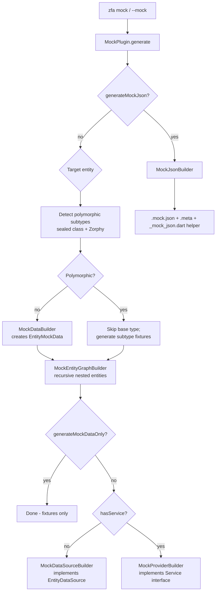
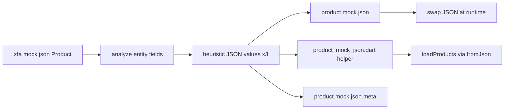

Mock data generation is Zuraffa's mechanism for producing realistic, compilable test fixtures and fake data-layer implementations for your entities. It covers three distinct outputs: static **mock data files** (Dart objects), **mock datasources/providers** (in-memory implementations of your data interfaces), and **JSON mock files** (data-driven fixtures loaded through `fromJson`). This page explains how generation is triggered, how the builder pipeline works, how values are chosen for each field type, and how polymorphic entities are handled — plus the JSON workflow that lets you swap data without touching Dart code.

## How Mock Generation Is Triggered

The Mock Plugin registers four capabilities — `create`, `json`, method append, and DI injection — and exposes a dedicated CLI command (`zfa mock`), so you can invoke mock generation standalone or as part of a larger `make`/`feature` workflow. The plugin is registered in the central code generator alongside all other core plugins, and its `configKey` (`mockByDefault`) lets project configuration enable mocks automatically.

Sources: [mock_plugin.dart](lib/src/plugins/mock/mock_plugin.dart#L50-L75), [code_generator.dart](lib/src/generator/code_generator.dart#L84-L97)

| Command | What it generates |
|---|---|
| `zfa make Product --preset=crud --methods=get,getList --mock` | Mock data + mock datasource/providers as part of the full feature generation |
| `zfa mock Product` | Mock data + mock datasource for a single entity (via `CreateMockCapability`) |
| `zfa mock data Product` | **Only** the mock data fixture file (no datasource) |
| `zfa mock json Product` | JSON files + a `fromJson`-based Dart helper (via `JsonMockCapability`) |
| `zfa mock Product --json` | Same as `zfa mock json`, using a flag on the parent command |

The `MockCommand` prints usage hints and dispatches to the appropriate capability: `--data-only` routes to data-fixture generation, while `--json` routes to the JSON capability. The `data` and `json` subcommands carry their own `--output`, `--force`, `--verbose`, and `--dry-run` flags, with `json` additionally accepting `--domain` to group files. Sources: [mock_command.dart](lib/src/commands/mock_command.dart#L12-L34), [mock_command.dart](lib/src/commands/mock_command.dart#L43-L114), [mock_command.dart](lib/src/commands/mock_command.dart#L117-L189)

Configuration in `.zfa.json` controls default behavior. Setting `"mock": true` under `plugins.defaults` enables mock generation by default, and the plugin's schema exposes two per-invocation flags: `mock-data-only` (generate fixtures without providers) and `mock-json` (route to the JSON pipeline). The `make` command adds the `--mock` flag that feeds `mock: true` into the generation plan. Sources: [mock_plugin.dart](lib/src/plugins/mock/mock_plugin.dart#L78-L92), [make_command.dart](lib/src/commands/make_command.dart#L174), [example/.zfa.json](example/.zfa.json#L1-L10)

## Architecture: The Builder Pipeline

At the heart of generation is `MockBuilder.generate(config)`, an orchestrator that composes five specialized builders. The flow is deterministic: detect the target entity and its polymorphic shape, generate the fixture file, walk the entity graph for nested types, then decide whether a datasource or a provider is needed.



The orchestrator resolves the effective target entity (for custom use cases it derives the entity from the `returns` type), checks whether the entity file exists, and refuses to instantiate abstract or sealed base types directly. If no concrete subtypes exist for a sealed base, it emits a warning and skips that type rather than producing invalid code. Sources: [mock_builder.dart](lib/src/plugins/mock/builders/mock_builder.dart#L79-L156), [mock_builder.dart](lib/src/plugins/mock/builders/mock_builder.dart#L86-L101)

The plugin applies guard conditions before delegating: mock generation proceeds when explicitly requested (`generateMock` / `generateMockDataOnly`), when paired with data-layer generation, or in append mode against existing mock files. When only data is requested, `MockBuilder` skips the datasource/provider builders entirely. Sources: [mock_plugin.dart](lib/src/plugins/mock/mock_plugin.dart#L163-L177), [mock_builder.dart](lib/src/plugins/mock/builders/mock_builder.dart#L146-L153)

## The Generated Mock Data File

`MockDataBuilder` produces a static Dart class named `{Entity}MockData` that acts as your in-memory fixture store. It analyzes the entity's fields, builds three constructor-call instances, and exposes convenience getters for samples, lists, and seeded bulk generation. The generated file for a simple `Todo` entity demonstrates the shape:

```dart
// Generated by zfa
// Mock data for Todo
import '../../domain/entities/todo/todo.dart';

class TodoMockData {
  static final List<Todo> todos = [
    Todo(id: 10, title: 'title 1', isCompleted: true,
         createdAt: DateTime.now().subtract(const Duration(days: 30))),
    Todo(id: 20, title: 'title 2', isCompleted: false,
         createdAt: DateTime.now().subtract(const Duration(days: 60))),
    Todo(id: 30, title: 'title 3', isCompleted: true,
         createdAt: DateTime.now().subtract(const Duration(days: 90))),
  ];

  static Todo get sampleTodo => todos.first;
  static List<Todo> get sampleList => todos;
  static List<Todo> get emptyList => [];

  static List<Todo> get largeTodoList =>
      List.generate(100, (index) => _createTodo(index + 1000));

  static Todo _createTodo(int seed) { /* seed-based factory */ }
}
```

Sources: [mock_data_builder.dart](lib/src/plugins/mock/builders/mock_data_builder.dart#L109-L220), [todo_mock_data.dart](example/lib/src/data/mock/todo_mock_data.dart#L6-L43)

The class is written to `data/mock/{entity_snake}_mock_data.dart`. The builder collects imports for nested entities, keeps the `leadingComment` `// Generated by zfa for: <name>`, and skips generation entirely when the return type of a custom use case is primitive (e.g., `String`, `int`, `bool`, `void`) — there is nothing meaningful to fixture. Enum entities get a distinct branch that indexes `Enum.values` instead of calling constructors. Sources: [mock_data_builder.dart](lib/src/plugins/mock/builders/mock_data_builder.dart#L38-L76), [mock_data_builder.dart](lib/src/plugins/mock/builders/mock_data_builder.dart#L184-L217), [mock_data_builder.dart](lib/src/plugins/mock/builders/mock_data_builder.dart#L222-L247)

| Accessor | Purpose |
|---|---|
| `{camelEntities}` (`todos`) | The three canonical instances |
| `sample{Entity}` | First item of the list (single-object fixture) |
| `sampleList` | The full list |
| `emptyList` | Empty list for empty-state UI tests |
| `large{Entity}List` | 100 items generated via `List.generate` |
| `_create{Entity}(int seed)` | Deterministic factory used by the large list |

## Value Generation Heuristics

Every field value is chosen by `MockValueBuilder` using a type-driven heuristic. The same builder powers the Dart fixtures and the JSON variant, with a parallel JSON mode that emits raw JSON-compatible values (ISO-8601 strings for `DateTime`, string values for enums). Seeded generation (used by `_create{Entity}`) derives values from an `int seed` so lists stay deterministic and unique per index. Sources: [mock_value_builder.dart](lib/src/plugins/mock/builders/mock_value_builder.dart#L232-L265), [mock_value_builder.dart](lib/src/plugins/mock/builders/mock_value_builder.dart#L378-L412), [mock_value_builder.dart](lib/src/plugins/mock/builders/mock_value_builder.dart#L14-L40)

| Field type | Generated value (seed = N) |
|---|---|
| `String` | `'<fieldName> N'` |
| `int` | `N` (seeded: `seed * 10`) |
| `double` | `N * 10.5` |
| `bool` | `N % 2 == 1` |
| `DateTime` | `DateTime.now().subtract(Duration(days: N * 30))` |
| `Object` / `dynamic` | `{'keyN': 'valueN'}` |
| `List<T>` | 3 items (entity lists reference `{T}MockData` instances) |
| `Map<K,V>` | 3 entries with heuristic keys/values |
| `T?` (nullable) | `null` when `N % 3 == 0`, otherwise the base heuristic |
| Nested entity `T` | `{T}MockData.sample{T}` (or subtype sample) |
| Enum `T` | `T.values[N % T.values.length]` |

Collections always produce three items for consistency, and nested entity lists reference the corresponding `{T}MockData` class rather than inlining construction — which is why the entity-graph builder must generate those nested fixtures first. Sources: [mock_value_builder.dart](lib/src/plugins/mock/builders/mock_value_builder.dart#L267-L336), [mock_value_builder.dart](lib/src/plugins/mock/builders/mock_value_builder.dart#L501-L524), [mock_value_builder.dart](lib/src/plugins/mock/builders/mock_value_builder.dart#L537-L571)

## Nested Entities and Polymorphism

`MockEntityGraphBuilder` walks every field of the target entity, extracts embedded entity types (including types inside `List<...>` and `Map<...>`), and recursively generates a `{Nested}MockData` file for each discovered entity. A `processedEntities` set prevents infinite recursion on self-referential or cyclic graphs. Sources: [mock_entity_graph_builder.dart](lib/src/plugins/mock/builders/mock_entity_graph_builder.dart#L22-L84), [mock_entity_graph_builder.dart](lib/src/plugins/mock/builders/mock_entity_graph_builder.dart#L181-L207)

Polymorphic entities are detected through two complementary paths, combined and deduplicated by `EntityAnalyzer.getPolymorphicSubtypes`:

- **Sealed classes** — a regex pass reads the entity file, builds a declaration map of all classes, and walks the inheritance chain from the sealed root to collect concrete (non-`abstract`, non-`sealed`) leaf subtypes. `test/fixtures/sealed_category_config.dart` shows the canonical shape: a `sealed class CategoryConfig` with `final class PrimaryCategory` and `final class SecondaryCategory` leaves.
- **`@Zorphy(explicitSubTypes: [...])`** — the annotation is parsed directly and each listed subtype name is extracted.

Sources: [entity_analyzer.dart](lib/src/utils/entity_analyzer.dart#L399-L424), [entity_analyzer.dart](lib/src/utils/entity_analyzer.dart#L426-L444), [entity_analyzer.dart](lib/src/utils/entity_analyzer.dart#L446-L508), [sealed_category_config.dart](test/fixtures/sealed_category_config.dart#L1-L15)

When subtypes are detected, the builder generates a mock data file **per concrete subtype** and skips the sealed base — the base is never instantiated. Fields whose type is polymorphic reference subtype fixtures via `{Subtype}MockData.sample{Subtype}` or index into the subtype's collection. If a sealed class has no concrete subtypes, generation prints a warning and skips rather than hanging or emitting invalid code. Sources: [mock_builder.dart](lib/src/plugins/mock/builders/mock_builder.dart#L103-L135), [mock_value_builder.dart](lib/src/plugins/mock/builders/mock_value_builder.dart#L546-L553), [mock_builder.dart](lib/src/plugins/mock/builders/mock_builder.dart#L123-L134)

## Mock Data Sources and Providers

Beyond fixtures, the plugin generates **in-memory implementations** of your data interfaces so your app runs end-to-end without a backend. When the target is entity-based, `MockDataSourceBuilder` produces `{Entity}MockDataSource` implementing `{Entity}DataSource`; when generation targets a service (`--service`), `MockProviderBuilder` produces `{Service}MockProvider` implementing the service interface. Both mix in `Loggable` and `FailureHandler` and simulate latency through a configurable `_delay` (default 100 ms). Sources: [mock_datasource_builder.dart](lib/src/plugins/mock/builders/mock_datasource_builder.dart#L35-L89), [mock_provider_builder.dart](lib/src/plugins/mock/builders/mock_provider_builder.dart#L39-L69), [mock_datasource_builder.dart](lib/src/plugins/mock/builders/mock_datasource_builder.dart#L225-L234)

For entity datasources, the builder emits one method per requested CRUD operation. `get` and `watch` query the fixture list through `query(params)`; `getList` and `watchList` apply `limit`/`offset` slicing; `create` echoes the item back after a delay; `update` and `delete` locate items by the configured id field and throw `notFoundFailure` when missing. The generated `TodoMockDataSource` in the example project shows the full pattern: log → delay → query fixtures → return. Sources: [mock_datasource_builder.dart](lib/src/plugins/mock/builders/mock_datasource_builder.dart#L355-L465), [mock_datasource_builder.dart](lib/src/plugins/mock/builders/mock_datasource_builder.dart#L467-L615), [todo_mock_datasource.dart](example/lib/src/data/datasources/todo/todo_mock_datasource.dart#L10-L91)

Service-based providers go one step further: they extract the service interface's existing methods with `MethodExtractor`, then generate an overriding implementation for each. Return values are chosen by type — primitive returns get literal values, entity returns get `{Entity}MockData.sample{Entity}` (or `sampleList` for lists), and `stream` use cases wrap the result in `Stream.fromFuture`. This makes the provider a faithful stand-in that honors the service contract. Sources: [mock_provider_builder.dart](lib/src/plugins/mock/builders/mock_provider_builder.dart#L178-L200), [mock_provider_builder.dart](lib/src/plugins/mock/builders/mock_provider_builder.dart#L392-L533), [mock_provider_builder.dart](lib/src/plugins/mock/builders/mock_provider_builder.dart#L535-L649)

## JSON Mock Data (v5.1.0)

The `zfa mock json` workflow swaps Dart literals for **data-driven fixtures**: JSON files on disk, a generated Dart helper that loads and deserializes them through each entity's `fromJson`, and a metadata file that guards against schema drift. Because data lives outside the code, you can edit or replace JSON content and see results on the next run with zero code changes. Sources: [mock_json_builder.dart](lib/src/plugins/mock/builders/mock_json_builder.dart#L52-L115)



The folder convention groups files by domain to prevent name collisions between entities in different domains:

```
lib/src/data/mock_json/{domain}/
├── {entity_snake}.mock.json       # 3 pretty-printed mock instances
├── {entity_snake}.mock.json.meta  # generatedHash, generatedAt, fieldSignature
└── {entity_snake}_mock_json.dart  # typed fromJson-based helper
```

The domain is auto-detected from the entity's location under `domain/entities/` (first folder level), and an explicit `--domain` overrides it. Sources: [mock_json_builder.dart](lib/src/plugins/mock/builders/mock_json_builder.dart#L75-L94), [mock_json_builder.dart](lib/src/plugins/mock/builders/mock_json_builder.dart#L265-L301), [mock_json_builder.dart](lib/src/plugins/mock/builders/mock_json_builder.dart#L303-L334)

The generated helper, `{Entity}MockJson`, provides typed async accessors that read the file, decode the JSON array, and map each entry through `_deserialize`. For polymorphic entities the deserializer becomes a switch on the `_type` discriminator field (written into every JSON object during generation), dispatching to the correct subtype's `fromJson`. Missing or unreadable files surface as `StateError` with the offending path. Sources: [mock_json_helper_builder.dart](lib/src/plugins/mock/builders/mock_json_helper_builder.dart#L17-L65), [mock_json_helper_builder.dart](lib/src/plugins/mock/builders/mock_json_helper_builder.dart#L106-L119), [mock_value_builder.dart](lib/src/plugins/mock/builders/mock_value_builder.dart#L18-L40)

```dart
final products = await ProductMockJson.loadProducts();       // List<Product>
final sample   = await ProductMockJson.loadSampleProduct();  // Product
final empty    = await ProductMockJson.loadEmptyList();      // List<Product>
```

Sources: [mock_json_helper_builder.dart](lib/src/plugins/mock/builders/mock_json_helper_builder.dart#L67-L103)

The meta file stores a hash of the JSON content plus a sorted `fieldSignature` (`field:type,field:type,...`). On regeneration, the builder compares the current entity fields against the stored signature; if fields were added or removed, it prints a warning listing the differences and reminds you to pass `--force`. Existing JSON files are **not overwritten by default** — protecting hand-edited data — and regeneration requires the explicit opt-in. Sources: [mock_json_builder.dart](lib/src/plugins/mock/builders/mock_json_builder.dart#L213-L263), [mock_json_builder.dart](lib/src/plugins/mock/builders/mock_json_builder.dart#L138-L161)

## Safety Behaviors

Several safeguards make regeneration predictable in real projects:

| Behavior | Mechanism |
|---|---|
| Primitive/`void` returns | Mock data file skipped — nothing to fixture ([mock_data_builder.dart](lib/src/plugins/mock/builders/mock_data_builder.dart#L43-L76)) |
| Missing entity file | `StateError` with an actionable message when a concrete entity is required ([mock_builder.dart](lib/src/plugins/mock/builders/mock_builder.dart#L113-L121)) |
| Sealed base, no concrete subtypes | Warning + skip instead of invalid code ([mock_builder.dart](lib/src/plugins/mock/builders/mock_builder.dart#L123-L134)) |
| Existing JSON files | Skipped unless `--force` is passed ([mock_json_builder.dart](lib/src/plugins/mock/builders/mock_json_builder.dart#L138-L161)) |
| Revert | Mock data and datasource files are skipped (shared fixtures) rather than deleted ([mock_data_builder.dart](lib/src/plugins/mock/builders/mock_data_builder.dart#L228-L236)) |
| Append mode | New methods/imports are merged into existing mock datasources and providers via AST-based append ([mock_datasource_builder.dart](lib/src/plugins/mock/builders/mock_datasource_builder.dart#L166-L223)) |

The mock datasources and providers generated here plug directly into the dependency injection layer via the plugin's `InjectCapability` and the `--use-mock` flag, which is covered in [Dependency Injection Generation](17-dependency-injection-generation). For testing patterns built on top of these fixtures, see [Testing Strategy & Result Matchers](26-testing-strategy-and-result-matchers), and for the pipeline that coordinates all plugins during a `make` run, see [Code Generation Pipeline: From CLI to Files](6-code-generation-pipeline-from-cli-to-files). If you want to extend mock generation with your own outputs, [Building Custom Plugins](22-building-custom-plugins) explains the capability system that `MockPlugin` itself is built on.