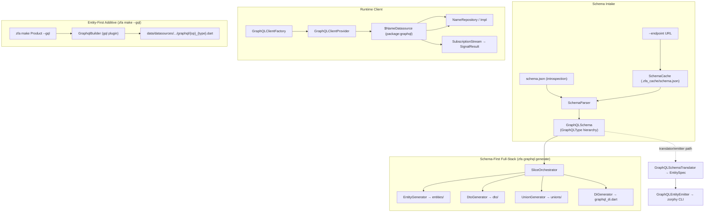
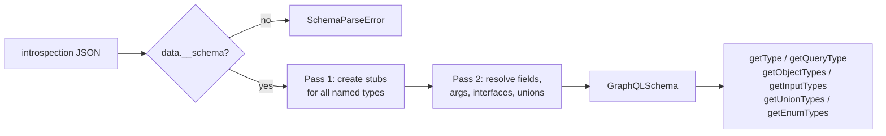
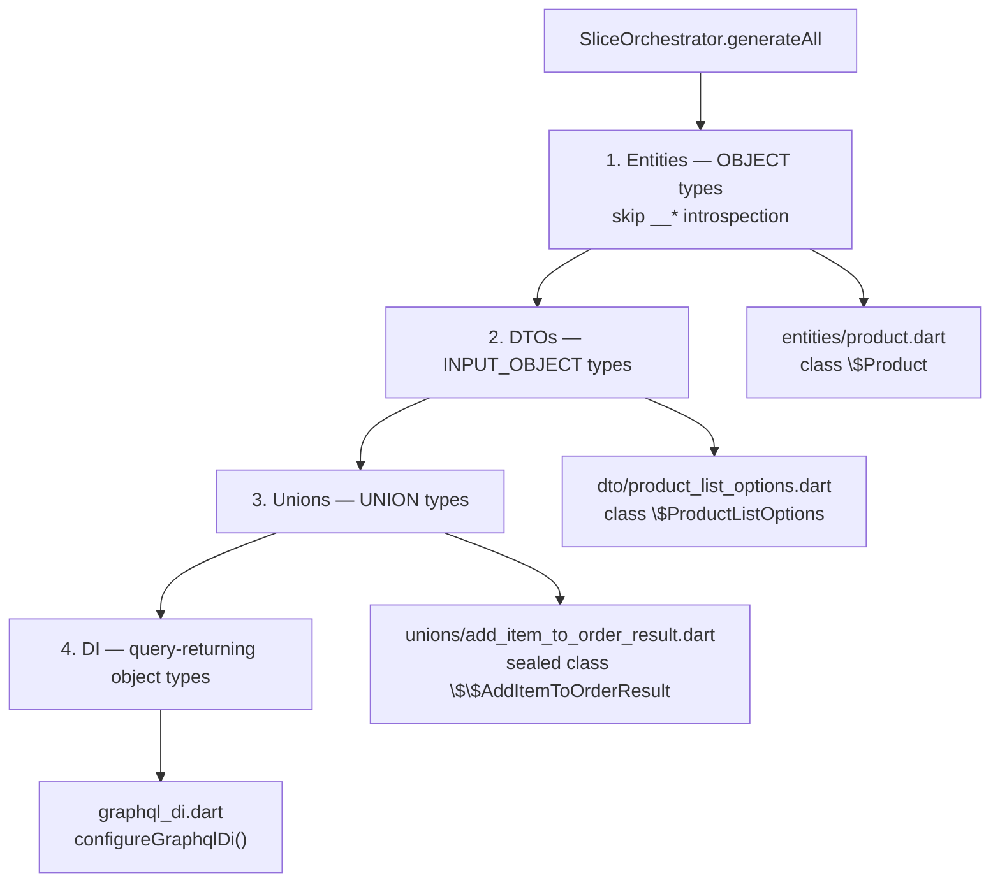
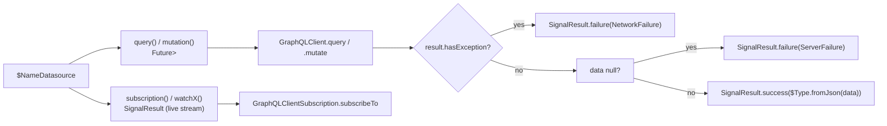

GraphQL Schema Generation is Zuraffa's schema-first path for turning a GraphQL introspection result into a working Dart data layer. Where the standard `zfa make` workflow is entity-first (you define a Dart entity and *add* GraphQL outputs), this pipeline inverts the direction: you feed it a schema — from a local introspection JSON file or a cached endpoint — and it derives entities, DTOs, unions, datasources, repositories, and DI wiring directly from the GraphQL type graph. The pipeline lives under `lib/src/graphql/` and is exposed through the `zfa graphql generate` command class, with a secondary additive path (`zfa make ... --gql`) that emits GraphQL operation strings for already-defined entities and use cases.

## Two Directions, One Schema Model

Understanding the feature starts with separating the two generation directions, because they consume the schema differently and produce different artifacts. The schema-first direction is orchestrated by `GraphqlGenerateCommand`, which accepts `--schema` (a local introspection JSON) or `--endpoint` (fetched through a cache), parses the document into a `GraphQLSchema`, and hands it to `SliceOrchestrator` for full-stack generation. The additive direction flows through `GraphqlBuilder` in the `gql` plugin, triggered by `--gql` on a `make`/`feature` command; here the schema is implicit — the operation type is inferred from the requested method (`get` → query, `create` → mutation, `watch` → subscription) and the builder emits Dart files containing raw GraphQL strings. A third, older path (`GraphQLSchemaTranslator` + `GraphQLEntityEmitter`) translates schema types into entity/enum *specifications* and delegates actual file creation to the external `zorphy` CLI.



Sources: [graphql_generate_command.dart](lib/src/graphql/codegen/graphql_generate_command.dart#L13-L126), [slice_orchestrator.dart](lib/src/graphql/codegen/slice_orchestrator.dart#L24-L137), [gql_builder.dart](lib/src/plugins/gql/builders/gql_builder.dart#L24-L125)

## Schema Intake: Parsing Introspection JSON

Every schema-first generation run starts with an introspection document. The standard query — `query IntrospectionQuery { __schema { queryType ... types { kind name fields ... inputFields ... enumValues ... } } }` — is embedded in `GraphQLIntrospectionService`, which POSTs it to an endpoint and parses the response into the *lightweight* `GqlSchema` model. For local files, `SchemaParser.parse` is the entry point: it expects the `data.__schema` envelope and performs a deliberate **two-pass parse**. Pass one creates type stubs for every entry in `types` (scalars, objects, input objects, unions, enums, interfaces, plus `LIST`/`NON_NULL` wrappers), so forward references between types are resolvable. Pass two walks the same list and fills in fields, interfaces, possible types, and enum values, resolving each `type` reference through the now-complete type map. A `SchemaParseError` is thrown for unknown kinds, unnamed named types, or references to types missing from the schema.



Sources: [schema_parser.dart](lib/src/graphql/schema/schema_parser.dart#L19-L52), [schema_parser.dart](lib/src/graphql/schema/schema_parser.dart#L53-L110), [schema_parser.dart](lib/src/graphql/schema/schema_parser.dart#L111-L179), [graphql_introspection_service.dart](lib/src/graphql/graphql_introspection_service.dart#L10-L126)

Because the pipeline is used with two different models, the repository intentionally contains **two schema representations**. `SchemaParser` produces a `GraphQLSchema` built from the `GraphQLType` class hierarchy — `GraphQLScalarType`, `GraphQLObjectType`, `GraphQLInputObjectType`, `GraphQLUnionType`, `GraphQLEnumType`, `GraphQLInterfaceType`, plus `GraphQLListType` and `GraphQLNonNullType` wrappers, each carrying a `dartType` getter that encodes nullability (`String?` for a nullable scalar, `List<Product>` for a non-null list, bare `Product` for a non-null object). The introspection service and translator path instead use `GqlSchema`/`GqlTypeDef`/`GqlTypeRef`, a flatter JSON-first model with helpers like `namedType` (unwraps `NON_NULL`/`LIST` chains to the innermost name), `isList`, and `listElementType`. The codegen pipeline (`SliceOrchestrator` and its generators) consumes the first model; the translator/emitter path consumes the second.

| Model | Producer | Consumer | Key helpers |
|---|---|---|---|
| `GraphQLType` hierarchy | `SchemaParser` | `SliceOrchestrator`, generators, `TypeMapper` | `isNonNull`, `isList`, `innerType`, `dartType` |
| `GqlSchema`/`GqlTypeRef` | `GraphQLIntrospectionService` | `GraphQLSchemaTranslator`, `GraphQLEntityEmitter` | `namedType`, `isList`, `listElementType`, `entityTypes`, `enumTypes` |

Sources: [graphql_type.dart](lib/src/graphql/types/graphql_type.dart#L1-L205), [graphql_schema.dart](lib/src/graphql/graphql_schema.dart#L17-L69), [graphql_schema.dart](lib/src/graphql/graphql_schema.dart#L200-L251), [schema_parser.dart](lib/src/graphql/schema/schema_parser.dart#L229-L275)

Caching sits between the endpoint and the parser. `SchemaCache` stores the raw introspection JSON at `{cacheDir}/schema.json` (default `.zfa_cache`) via `save()`, and `load()` prefers the cached copy unless `forceRefresh` is set. A corrupted cache file raises `SchemaCacheError` rather than silently regenerating. The `--force` flag on `zfa graphql generate` propagates into this cache bypass, and also controls overwrite behavior in `SliceOrchestrator._writeFile`, which skips existing files when `force` is false — making regeneration additive by default. Sources: [schema_cache.dart](lib/src/graphql/cache/schema_cache.dart#L16-L101), [slice_orchestrator.dart](lib/src/graphql/codegen/slice_orchestrator.dart#L118-L137)

## Type Mapping: GraphQL → Dart

Every generator funnels type conversion through `TypeMapper`, which encodes the nullability rules of GraphQL wrappers. A `NON_NULL` wrapper strips the nullable marker from its inner type; a bare list maps to `List<T>` (list nullability is carried by the wrapper, not the list itself); named types are nullable by default, expressed with `?`. Built-in scalars map `String`/`ID` → `String`, `Int` → `int`, `Float` → `double`, `Boolean` → `bool`; unknown custom scalars fall back to `String` unless listed in `customScalars` (from `.zfa.json`) or `typeOverrides`. Enums map to their own name, objects/inputs to their class name, unions to the union name. `TypeMapper` also normalizes identifiers: enum values in `SCREAMING_SNAKE_CASE` become `camelCase` (`SOME_VALUE` → `someValue`) via `enumValue`.

| GraphQL source | Dart target (nullable) | Dart target (non-null) |
|---|---|---|
| `String`, `ID` | `String?` | `String` |
| `Int` | `int?` | `int` |
| `Float` | `double?` | `double` |
| `Boolean` | `bool?` | `bool` |
| Custom scalar (unmapped) | `String?` | `String` |
| Enum `CurrencyCode` | `CurrencyCode?` | `CurrencyCode` |
| Object `Product` | `Product?` | `Product` |
| `[Product]` | `List<Product?>` | `List<Product?>` (wrapper-dependent) |

Sources: [type_mapper.dart](lib/src/graphql/mapping/type_mapper.dart#L24-L98)

The translator path maintains a parallel but richer default mapping (`DateTime`, `Date` → `DateTime`, `JSON` → `Map<String, dynamic>`), which is where date handling enters the system. Sources: [graphql_schema_translator.dart](lib/src/graphql/graphql_schema_translator.dart#L106-L130)

The codegen generators then apply one critical adjustment through `zorphyType` in `codegen_types.dart`: the mapper returns bare names like `Product`, but generated classes are named `$Product` (zorphy convention), so object/input references are upgraded to `$Product`, and union bases to `$$Union` (the sealed base). The same file provides `isListType` and `listElementType`, which unwrap a top-level `NON_NULL` wrapper — needed because `GraphQLNonNullType.isList` is false even when it wraps a list, a shape that introspection JSON produces routinely (`NON_NULL(LIST(...))`). Sources: [codegen_types.dart](lib/src/graphql/codegen/codegen_types.dart#L10-L42)

## The Full-Stack Generation Pipeline

`SliceOrchestrator` is the conductor of schema-first generation. `generateAll()` runs four deterministic phases: entities from `OBJECT` types, DTOs from `INPUT_OBJECT` types, sealed unions from `UNION` types, and finally a DI registration file. Each phase writes into a fixed directory layout under the output root (`--output`, default `lib/graphql`), and the orchestrator records every written path in `generatedFiles` for the CLI summary.



```
lib/graphql/
├── entities/            # $ClassName entities (fromJson / toJson / copyWith)
│   ├── product.dart
│   └── order.dart
├── dto/                 # $InputName DTOs for INPUT_OBJECT types (toJson / copyWith)
│   └── product_list_options.dart
├── unions/              # sealed $$UnionName with __typename factory
│   └── add_item_to_order_result.dart
├── datasources/         # $NameDatasource — package:graphql remote data layer
│   └── product_datasource.dart
├── repositories/        # NameRepository interface + NameRepositoryImpl
│   └── product_repository.dart
└── graphql_di.dart      # configureGraphqlDi() — client, datasources, repositories
```

Sources: [slice_orchestrator.dart](lib/src/graphql/codegen/slice_orchestrator.dart#L24-L137)

**Entities.** `EntityGenerator` emits a `$`-prefixed class per object type using `package:code_builder` plus the Dart formatter. Every non-deprecated field becomes a `final` property; non-null fields are required constructor parameters, nullable fields are optional. `fromJson` parses each field with nullability-aware casts (`as String` for required, `as String?` for optional), recursively invokes `$Nested.fromJson` for object references, and uses `.values.byName` for enums. `toJson` reverses the process — nested entities call `toJson()`, enums serialize via `.name`, lists map element-wise. A `copyWith` method completes the triad. `includeFromJson`/`includeToJson` flags allow trimming for scenarios where only one direction is needed. Sources: [entity_generator.dart](lib/src/graphql/codegen/entity_generator.dart#L29-L90), [entity_generator.dart](lib/src/graphql/codegen/entity_generator.dart#L91-L133), [entity_generator.dart](lib/src/graphql/codegen/entity_generator.dart#L134-L199), [entity_generator.dart](lib/src/graphql/codegen/entity_generator.dart#L215-L301)

**DTOs.** `DtoGenerator` mirrors the entity shape for `INPUT_OBJECT` types but omits `fromJson` — DTOs are write-only payloads for mutations, so they carry `toJson` (with the same enum/nested/list serialization rules) and `copyWith`. This asymmetry is deliberate: DTOs are constructed in Dart and sent to the server; they are never the result of parsing a response. Sources: [dto_generator.dart](lib/src/graphql/codegen/dto_generator.dart#L20-L195)

**Unions.** `UnionGenerator` converts GraphQL `UNION` types into **sealed class hierarchies**. Because `package:code_builder` 4.11.1's `ClassModifier` has no `sealed`, the generator declares an abstract base and upgrades the raw output string to `sealed class $$Name` before formatting. The base exposes a `fromJson` factory that reads the `__typename` discriminator and dispatches via a `switch`: each possible type maps to `$TypeName.fromJson(json)`, and unknown or missing discriminators throw `ArgumentError`. Variants that are object types are *reused* — the generated union file imports the already-generated entity files rather than duplicating their classes. This is what lets an `AddItemToOrderResult` union compose `$Order`, `$OrderModificationError`, and `$InsufficientStockError` from the same schema. Sources: [union_generator.dart](lib/src/graphql/codegen/union_generator.dart#L20-L152)

**DI.** `DiGenerator` writes `graphql_di.dart` containing a single `configureGraphqlDi()` function. It registers the `GraphQLClient` singleton through `GraphQLClientProvider.instance.client`, then — for every object type returned by a query field (deduplicated, introspection fields skipped) — registers the `$NameDatasource` (resolving `GraphQLClient` from the container) and the `NameRepository` interface bound to `NameRepositoryImpl`. Registrations default to `DiScope.singleton`; the enum supports `transient` for future per-request scoping. Sources: [di_generator.dart](lib/src/graphql/codegen/di_generator.dart#L16-L152)

## Datasources, Repositories & the Runtime Client

The datasource generator produces the only generated code that talks to a live network. `DatasourceGenerator` emits `$NameDatasource` with a private `GraphQLClient` field, a `client` constructor parameter, and one method per operation config. Query and mutation methods build `QueryOptions`/`MutationOptions` documents, send them through the client, and convert every outcome into Zuraffa's `SignalResult<T>`: `NetworkFailure` on `result.hasException`, `ServerFailure('No data returned')` on a missing payload, otherwise `$Type.fromJson` on the parsed field. List-returning operations map `List<dynamic>` entries element-wise.



Sources: [datasource_generator.dart](lib/src/graphql/codegen/datasource_generator.dart#L43-L120), [datasource_generator.dart](lib/src/graphql/codegen/datasource_generator.dart#L121-L200), [datasource_generator.dart](lib/src/graphql/codegen/datasource_generator.dart#L200-L399)

Subscriptions and watches are gated by `enableSubscriptions`, which maps to `graphql.subscriptions` + `graphql.wsEndpoint` in `.zfa.json`. When enabled, the generator emits `subscription` methods and `watchX()` methods backed by `GraphQLClientSubscription.subscribeTo`, which returns a live `SignalResult<T>`; when disabled, `watchX()` degrades to a stub that prints a notice and returns `NetworkFailure('Subscriptions disabled')`. The runtime behind this is `SubscriptionStream`, which wraps `client.subscribe`, maps `QueryResult`s to `Result<T, AppFailure>`, and wraps the stream in a **resilient controller** that re-subscribes automatically after transient errors and on completion — keeping the signal alive for long-lived watch usage. Sources: [datasource_generator.dart](lib/src/graphql/codegen/datasource_generator.dart#L400-L580), [subscription_stream.dart](lib/src/graphql/client/subscription_stream.dart#L10-L135)

On top of each datasource, `RepositoryGenerator` emits a two-part contract: an abstract `NameRepository` interface (one method per operation, with `Stream<SignalResult<T>>` for subscriptions and `Future<SignalResult<T>>` otherwise) and `NameRepositoryImpl`, which holds the datasource and delegates every call. The interface keeps domain code independent of the transport, while the impl is deliberately a thin pass-through — business logic stays in use cases, which the [UseCase Hierarchy & the Result Pattern](10-usecase-hierarchy-and-the-result-pattern) page covers. Sources: [repository_generator.dart](lib/src/graphql/codegen/repository_generator.dart#L20-L156)

The client itself is assembled by `GraphQLClientFactory`: an `HttpLink` carries queries and mutations (with `defaultHeaders` from config), and — when subscriptions are configured — a `WebSocketLink` is chained through `Link.split`, routing subscription operations to WebSocket and everything else to HTTP. Default policies disable caching (`FetchPolicy.noCache`) so generated code always reads fresh data. `GraphQLClientProvider` holds the assembled client as a lazy singleton: `initialize(config)` disposes the previous client and resets, `client` builds on first access, and `dispose()` tears down the WebSocket link. The DI output registers this provider so every datasource resolves the same instance. Sources: [graphql_client_factory.dart](lib/src/graphql/client/graphql_client_factory.dart#L9-L108), [graphql_client_provider.dart](lib/src/graphql/client/graphql_client_provider.dart#L12-L63)

## Union Results and Error Mapping

Union-returning operations deserve special handling because a union can contain both success variants (`Order`) and error variants (`InsufficientStockError`). Without configuration, the generated datasource simply unwraps the sealed union via `$$Union.fromJson(data)` — the caller sees a sealed object and switches on it. With an `errorConfig`, the generated code dispatches at runtime: it reads `data['__typename']`, consults `_errorConfig.isError(typename, operationName: ...)`, and returns `SignalResult.failure(_mapError(...))` for error variants or `SignalResult.success($$Union.fromJson(data))` for success variants.

`ErrorMappingConfig` is populated from `.zfa.json` under `graphql.errorMapping`, with a `global` table and `perOperation` overrides. Category resolution is strictly ordered: per-operation mapping → global mapping → `*Error` wildcard (any variant whose name ends in `Error`) → `unknown` for error-suffixed names, `success` otherwise. The `toFailure` conversion then maps categories onto Zuraffa's failure taxonomy, preserving the GraphQL type name as `AppFailure.code` so callers can distinguish `InsufficientStockError` from `NegativeQuantityError`.

| `.zfa.json` category | Resulting failure |
|---|---|
| `business`, `validation` | `ValidationFailure` |
| `session` | `UnauthorizedFailure` |
| `network` | `NetworkFailure` |
| `unknown` (or `*Error` default) | `UnknownFailure` |
| `success` (or unmapped non-`Error`) | Success variant — unwraps the union |

Sources: [error_mapping_config.dart](lib/src/graphql/codegen/error_mapping_config.dart#L28-L128), [union_result_handler.dart](lib/src/graphql/codegen/union_result_handler.dart#L24-L143)

```json
{
  "graphql": {
    "endpoint": "https://api.example.com/graphql",
    "subscriptions": true,
    "wsEndpoint": "wss://api.example.com/graphql",
    "errorMapping": {
      "global": {
        "InsufficientStockError": "business",
        "*Error": "unknown"
      },
      "perOperation": {
        "addItemToOrder": { "NegativeQuantityError": "validation" }
      }
    }
  }
}
```

Sources: [error_mapping_config.dart](lib/src/graphql/codegen/error_mapping_config.dart#L28-L60), [graphql_client_factory.dart](lib/src/graphql/client/graphql_client_factory.dart#L9-L38)

## The Additive Path: `--gql` Operation Files

The schema-first pipeline is not the only GraphQL feature in the toolbox. When you generate an entity or use case through `zfa make`, the `--gql` flag routes to `GraphqlBuilder` (in the `gql` plugin), which emits Dart files whose only content is a `const String` holding a raw GraphQL document. Operation type inference follows a fixed mapping, overridable per invocation with `--gql-type`:

| Method / context | GraphQL operation |
|---|---|
| `get`, `getList` | query |
| `create`, `update`, `delete` | mutation |
| `watch`, `watchList` | subscription |
| Custom use case | required `--gql-type` |

Sources: [gql_builder.dart](lib/src/plugins/gql/builders/gql_builder.dart#L126-L200)

Files land at `data/datasources/{entitySnake}/graphql/{operationName}_{type}.dart` (e.g., `get_product_query.dart`) for entities, and `data/datasources/{domain}/graphql/` for custom use cases. Each file declares a `String` constant built with a raw triple-quoted literal (`r"""..."""`), with `$` escaped so the document survives Dart string interpolation. `DocumentBuilder` provides the complementary programmatic API for assembling query/mutation/subscription/fragment strings from schema metadata when you need the document at runtime rather than as a generated constant. Sources: [gql_builder.dart](lib/src/plugins/gql/builders/gql_builder.dart#L380-L417), [document_builder.dart](lib/src/graphql/document/document_builder.dart#L13-L122)

A parallel translator path serves the older entity-emitter workflow: `GraphQLSchemaTranslator.extractEntitySpecs` / `extractEnumSpecs` / `extractOperationSpecs` convert schema types into `EntitySpec`, `EnumSpec`, and `OperationSpec` value objects, with ID-field inference falling back through `id` → `{entityName}Id` → any `*Id` field → first field. `GraphQLEntityEmitter` then delegates file creation to the external `zorphy` CLI (`zorphy create -n Name --field ...`), generating entities under `domain/entities/` and enums under `domain/entities/enums/` — the integration with zorphy generation is covered in [Zorphy Entity Creation](4-zorphy-entity-creation). Sources: [graphql_schema_translator.dart](lib/src/graphql/graphql_schema_translator.dart#L139-L200), [graphql_schema_translator.dart](lib/src/graphql/graphql_schema_translator.dart#L270-L381), [graphql_entity_emitter.dart](lib/src/graphql/graphql_entity_emitter.dart#L27-L130)

One caveat worth knowing: the `GraphqlPlugin` registered under `plugins.graphql` in the plugin system is currently a placeholder — its `generate()` returns an empty list and the `CreateGraphqlCapability` funnels arguments into it, so the functional generation paths are the standalone `graphql generate` command class and the `gql` builder described above. Sources: [graphql_plugin.dart](lib/src/plugins/graphql/graphql_plugin.dart#L13-L57), [create_graphql_capability.dart](lib/src/plugins/graphql/capabilities/create_graphql_capability.dart#L64-L122)

## Where This Fits in the Generation Stack

Schema-first generation complements the entity-first flows documented elsewhere. The generated datasources and repositories plug into the DI layer described in [Dependency Injection Generation](17-dependency-injection-generation), and their `SignalResult` returns are consumed by the use-case and presentation patterns in [UseCase Hierarchy & the Result Pattern](10-usecase-hierarchy-and-the-result-pattern) and [Presentation Layer: Controller, View & Presenter](12-presentation-layer-controller-view-and-presenter). For testing, the [Testing Strategy & Result Matchers](26-testing-strategy-and-result-matchers) and [Regression & Integration Test Suites](27-regression-and-integration-test-suites) pages cover the golden tests that lock in entity nullability, sealed-union dispatch, subscription behavior, and error mapping. The runtime client and cache behaviors also interact with the caching patterns in [Cache Policies & Dual DataSource Pattern](15-cache-policies-and-dual-datasource-pattern), since generated GraphQL datasources default to no-cache policies to guarantee fresh reads.