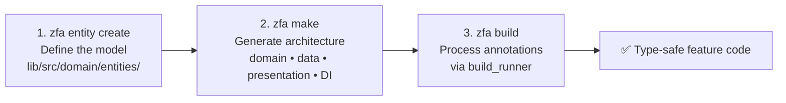

This page is a hands-on tutorial: it takes you from a fresh machine to a Flutter project with a generated, type-safe Clean Architecture feature in about ten minutes. You will install Zuraffa, run its three canonical commands — `zfa entity create`, `zfa make`, and `zfa build` — and verify the generated code. For the conceptual background behind these steps, start with [Overview](1-overview); for the complete command list, see [CLI Command Reference](3-cli-command-reference).

## Prerequisites

Zuraffa generates Dart and Flutter code, so you need the standard toolchain before anything else. The package declares its minimum SDK requirements directly in `pubspec.yaml`.

| Requirement | Version | Why you need it |
|---|---|---|
| Dart SDK | ^3.11.0 | The CLI and all generated code run on Dart; Zorphy annotation processing requires this minimum |
| Flutter | >=3.41.0 | Generated presentation layers (views, controllers) are Flutter widgets |
| Git | any recent | Recommended for the `flutter create` step and version control |
| An IDE | VS Code or Android Studio | For running the Flutter app and reading generated code |

Sources: [pubspec.yaml](pubspec.yaml#L1-L24)

Verify what you have with:

```bash
dart --version
flutter --version
```

If either command fails, install the Flutter SDK first (it bundles Dart). Zuraffa itself ships as the `zuraffa` package on pub.dev, and it provides three executables: `zfa` (the main generator), `zuraffa` (an alias), and `zuraffa_mcp_server` (for AI-agent tooling). Sources: [pubspec.yaml](pubspec.yaml#L26-L33), [bin/zfa.dart](bin/zfa.dart#L1-L12)

## Installation

Installation has two parts: add the package to your project, and activate the CLI globally so `zfa` is on your PATH.

**1. Create a Flutter project** (or open an existing one):

```bash
flutter create my_app
cd my_app
```

**2. Add Zuraffa as a dependency.** The minimal `pubspec.yaml` block is:

```yaml
dependencies:
  zuraffa: ^5.0.0

dev_dependencies:
  zuraffa: ^5.0.0
  zorphy_annotation: ^1.7.0
  build_runner: ^2.4.0
```

`zorphy_annotation` is required for entity generation, and `build_runner` is what `zfa build` invokes under the hood. Install them with:

```bash
flutter pub get
```

**3. Activate the CLI globally:**

```bash
dart pub global activate zuraffa
```

Sources: [README.md](README.md#L42-L62), [CLI_GUIDE.md](CLI_GUIDE.md#L13-L19)

After activation, confirm the CLI responds:

```bash
zfa --version
# zfa v5.x
# Zuraffa Code Generator
```

Sources: [lib/src/cli/cli_runner.dart](lib/src/cli/cli_runner.dart#L108-L120)

## Check Your Environment: `zfa doctor`

Before generating anything, run the built-in health check. `zfa doctor` inspects the installed tooling and the current project in one shot — it reports the CLI version, Dart and Flutter versions, whether `.zfa.json` exists, whether `zuraffa` and `zorphy_annotation` are in `pubspec.yaml`, and even runs a dead-code analysis on your project. It is the fastest way to diagnose a broken setup.

```bash
zfa doctor
# 🩺 Zuraffa Doctor
# Zuraffa CLI: v5.x
# Dart: Dart SDK version: 3.x
# Flutter: Flutter 3.x
# Configuration: ⚠️ No .zfa.json found (run "zfa config init" to create one)
# Dependencies: ✅ Zuraffa package found
#               ✅ zorphy_annotation found
```

If a required dependency is missing, `zfa entity create` itself refuses to run and prints the exact `dart pub add` command to fix it — but `doctor` catches the problem earlier, with a clearer summary. Sources: [lib/src/commands/doctor_command.dart](lib/src/commands/doctor_command.dart#L1-L70), [lib/src/commands/entity_command.dart](lib/src/commands/entity_command.dart#L84-L130)

## Step 0: Initialize Project Configuration

Zuraffa separates **project defaults** (`.zfa.json`) from **project memory** (`.zfa/`). For a first run, create the defaults file once:

```bash
zfa config init
```

This writes `.zfa.json` to your project root with the canonical v5 defaults: fixed paths under `lib/src/domain`, entity-first rules enabled, and plugin defaults under `plugins.defaults`. You can inspect or tweak it anytime with `zfa config show` and `zfa config set <key> <value>` (for example, `zfa config set diByDefault true` makes DI generation automatic for every `zfa make`). This step is optional but recommended — it is what makes later commands deterministic for both humans and AI agents. Sources: [lib/src/commands/config_command.dart](lib/src/commands/config_command.dart#L30-L55), [lib/src/config/zfa_config.dart](lib/src/config/zfa_config.dart#L289-L310), [example/.zfa.json](example/.zfa.json#L1-L33)

A freshly initialized config looks like the one checked into the `example` project — note the `plugins.defaults`, `planning.presets`, and `entity` sections:

```json
{
  "plugins": { "defaults": { "route": true, "di": true, "mock": true, "test": true } },
  "planning": { "presets": {}, "aliases": {} },
  "entity": { "entityFirst": true, "jsonByDefault": true }
}
```

Sources: [example/.zfa.json](example/.zfa.json#L1-L33), [lib/src/config/zfa_config.dart](lib/src/config/zfa_config.dart#L262-L288)

## The Three-Step Workflow

Zuraffa v5 standardizes generation around exactly three commands. Everything else in the CLI is a refinement of this loop:



| Step | Command | Responsibility | Output lands in |
|---|---|---|---|
| 1. Model | `zfa entity create` | Writes a Zorphy-annotated entity definition | `lib/src/domain/entities/{name}/` |
| 2. Generate | `zfa make` | Resolves a plan and writes all architecture layers | `lib/src/domain`, `lib/src/data`, `lib/src/presentation`, `lib/src/di` |
| 3. Build | `zfa build` | Runs `build_runner` to produce serialization and generated code | `.g.dart`, `.zorphy.dart` next to sources |

Sources: [README.md](README.md#L64-L103), [CLI_GUIDE.md](CLI_GUIDE.md#L31-L57)

We will walk through all three with a running example: a `Product` entity with CRUD operations.

### Step 1 — Create the Entity

Entities always live under the fixed path `lib/src/domain/entities/{entity_snake}/{entity_snake}.dart` — there is no configuration for alternate locations in v5. Create one with:

```bash
zfa entity create -n Product \
  --field id:String \
  --field name:String \
  --field price:double \
  --field description:String?
```

Notes on the field syntax: each `--field` takes `name:Type`; a trailing `?` marks the field nullable (`description:String?`); and the `-n` flag sets the entity name. Before writing anything, the command validates that `zorphy_annotation` and `build_runner` exist in `pubspec.yaml` — if not, it prints the exact fix and stops. Sources: [lib/src/commands/entity_command.dart](lib/src/commands/entity_command.dart#L84-L130), [lib/src/commands/entity_command.dart](lib/src/commands/entity_command.dart#L131-L190)

The command writes a minimal, hand-readable entity definition. The immutable class, `copyWith`, equality, JSON serialization, and filter support are all generated later by the build step:

```dart
@Zorphy(generateJson: true, generateFilter: true)
abstract class $Product {
  String get id;
  String get name;
  String get description;
  double get price;
  DateTime get createdAt;
}
```

Sources: [example/lib/src/domain/entities/product/product.dart](example/lib/src/domain/entities/product/product.dart#L1-L14)

The `entity` command supports more operations as your model grows: `zfa entity enum`, `zfa entity add-field`, `zfa entity list`, and `zfa entity from-json`. See [Zorphy Entity Creation](4-zorphy-entity-creation) for the full walkthrough. Sources: [lib/src/commands/entity_command.dart](lib/src/commands/entity_command.dart#L652-L699)

### Step 2 — Generate the Architecture with `zfa make`

`zfa make` is the **primary generation surface** in v5. It takes the entity name plus a description of what you want, resolves a normalized execution plan, and then writes every selected layer. The canonical full-feature command is:

```bash
zfa make Product \
  --preset=crud \
  --methods=get,getList,create,update,delete \
  --with=vpc \
  --state \
  --di \
  --test
```

Breaking down the options:

| Option | Effect |
|---|---|
| `--preset=crud` | Expands to the usecase, repository, and datasource plugins |
| `--methods=...` | Which operations to generate: `get`, `getList`, `create`, `update`, `delete`, `toggle`, `watch`, `watchList` |
| `--with=vpc` | Alias that expands to view + presenter + controller (the presentation triad) |
| `--state` | Adds an immutable state class for the controller |
| `--di` | Generates `get_it` service-locator registrations |
| `--test` | Generates unit tests for the produced layers |

Sources: [lib/src/commands/make_command.dart](lib/src/commands/make_command.dart#L84-L190), [lib/src/core/planning/preset_registry.dart](lib/src/core/planning/preset_registry.dart#L1-L85), [lib/src/core/planning/plugin_alias_resolver.dart](lib/src/core/planning/plugin_alias_resolver.dart#L1-L55)

**Preview before you write.** Because `make` resolves everything through a plan first, you can inspect exactly what would run — without touching disk — using `--plan` (or `--explain` for the reasoning):

```bash
zfa make Product --preset=crud --with=vpc --plan
# 🧭 Normalized plan for Product:
#   Preset: crud
#   Requested: usecase, repository, datasource, view, presenter, controller
#   Resolved: usecase, repository, datasource, view, presenter, controller
```

Add `--format=json` for machine-readable output, or `--dry-run` to preview the actual files that would be created. Sources: [lib/src/commands/make_command.dart](lib/src/commands/make_command.dart#L280-L335), [lib/src/commands/make_command.dart](lib/src/commands/make_command.dart#L368-L397)

The generated code is idiomatic and small. A single-shot read operation becomes a `UseCase` subclass that delegates to the repository and checks cooperative cancellation:

```dart
class GetProductUseCase extends UseCase<Product, QueryParams<Product>> {
  GetProductUseCase(this._repository);
  final ProductRepository _repository;

  @override
  Future<Product> execute(QueryParams<Product> params, CancelToken? cancelToken) async {
    cancelToken?.throwIfCancelled();
    return _repository.get(params);
  }
}
```

Sources: [example/lib/src/domain/usecases/product/get_product_usecase.dart](example/lib/src/domain/usecases/product/get_product_usecase.dart#L1-L20)

### Step 3 — Build the Generated Code

Generated files reference classes and annotations that do not exist yet as Dart source — they are produced by `build_runner`. Zuraffa wraps that step so docs and agent workflows never call `build_runner` directly:

```bash
zfa build
# 🔨 Running build_runner build...
#    Entities: 1, Dart files: 42
# ✅ Build completed successfully
```

`zfa build` counts your entities and Dart files first, then runs `build_runner build --delete-conflicting-outputs`. If the build fails, it automatically retries with a cleaned `.dart_tool/build` cache — the standard fix for stale-cache errors. You can force that behavior with `zfa build --clean`. Sources: [lib/src/commands/build_command.dart](lib/src/commands/build_command.dart#L1-L103)

After this step, the generated `.g.dart` and `.zorphy.dart` files sit next to your sources, and the feature compiles.

## What You Just Generated

After the three steps, a single `Product` feature produces this structure (all under `lib/src/`):

```text
lib/src/
├── domain/
│   ├── entities/product/
│   │   ├── product.dart            # Your hand-written definition
│   │   ├── product.zorphy.dart     # generated: immutable class, copyWith, equality
│   │   └── product.g.dart          # generated: JSON serialization
│   ├── repositories/
│   │   └── product_repository.dart # abstract repository interface
│   └── usecases/product/
│       ├── get_product_usecase.dart
│       ├── get_product_list_usecase.dart
│       ├── create_product_usecase.dart
│       └── ...
├── data/
│   ├── datasources/product/        # remote + local data access
│   ├── mock/                       # mock data providers (with --mock)
│   └── repositories/
│       └── data_product_repository.dart  # repository implementation
├── presentation/pages/product/
│   ├── product_view.dart           # CleanView widget
│   ├── product_presenter.dart
│   ├── product_controller.dart
│   └── product_state.dart
└── di/
    ├── repositories/               # get_it registrations
    └── usecases/
```

Sources: [example/lib/src](example/lib/src), [README.md](README.md#L126-L155)

The full file tree of a mature generated project — including routing, caching, and sync layers — is documented in [Generated Project Layout](5-generated-project-layout).

## Verify Your First Run

The fastest way to confirm everything works is to run the generated test suite:

```bash
flutter test
```

Every generated use case comes with a unit test that asserts the happy path and failure handling through Zuraffa's `Result<T, AppFailure>` matchers — for example, `example/test/domain/usecases/product/create_product_usecase_test.dart` in the bundled example app. You can also run the example app itself to see generated views and controllers in action:

```bash
cd example
flutter run
```

Sources: [example/README.md](example/README.md#L148-L165), [example/test/domain/usecases/product](example/test/domain/usecases/product)

## Troubleshooting

| Symptom | Cause | Fix |
|---|---|---|
| `zfa entity create` refuses to run | `zorphy_annotation` or `build_runner` missing from `pubspec.yaml` | Run `dart pub add zorphy_annotation` and `dart pub add dev:build_runner`, or follow the exact command printed by the error |
| `zfa` not found in your terminal | Global activation missing or PATH not updated | `dart pub global activate zuraffa`, then add the pub global bin directory to PATH |
| `zfa build` fails | Stale `.dart_tool/build` cache | Run `zfa build --clean`, which deletes the cache and retries automatically |
| `zfa make` reports "No active plugins" | No preset, alias, or plugin was selected | Add `--preset=crud` (or `--with=vpc`) — or run `zfa make Name --plan` first to see what resolves |
| Configuration behaves unexpectedly | Old or hand-edited `.zfa.json` | `zfa config init` recreates defaults; `zfa config show` prints the current state |

Sources: [lib/src/commands/entity_command.dart](lib/src/commands/entity_command.dart#L84-L130), [lib/src/commands/build_command.dart](lib/src/commands/build_command.dart#L20-L60), [lib/src/commands/make_command.dart](lib/src/commands/make_command.dart#L280-L335), [lib/src/commands/doctor_command.dart](lib/src/commands/doctor_command.dart#L72-L110)

When in doubt, `zfa doctor` is the single diagnostic command that checks the whole environment and project at once.

## Command Cheat Sheet

| Command | What it does |
|---|---|
| `zfa doctor` | Environment and project health check |
| `zfa config init` / `show` / `set` | Create, inspect, and update `.zfa.json` defaults |
| `zfa entity create -n Product --field name:String` | Create a Zorphy entity |
| `zfa make Product --preset=crud --with=vpc --di --test` | Generate the full architecture for an entity |
| `zfa make Product --preset=crud --plan` | Preview the normalized plan without writing files |
| `zfa build` | Run the codegen build step (`build_runner`) |
| `zfa manifest` | List every available plugin and capability |

Sources: [CLI_GUIDE.md](CLI_GUIDE.md#L60-L75), [README.md](README.md#L104-L125), [lib/src/cli/cli_runner.dart](lib/src/cli/cli_runner.dart#L223-L262)

## Where to Go Next

You now have a generated feature. Suggested reading order through the rest of the catalog:

1. [CLI Command Reference](3-cli-command-reference) — every command, flag, and output format in detail
2. [Zorphy Entity Creation](4-zorphy-entity-creation) — field types, enums, sealed entities, JSON round-tripping
3. [Generated Project Layout](5-generated-project-layout) — the complete file tree `zfa make` produces
4. [Code Generation Pipeline: From CLI to Files](6-code-generation-pipeline-from-cli-to-files) — what happens inside `zfa make` between your command and the written files
5. [UseCase Hierarchy & the Result Pattern](10-usecase-hierarchy-and-the-result-pattern) — how to read and extend the generated domain code