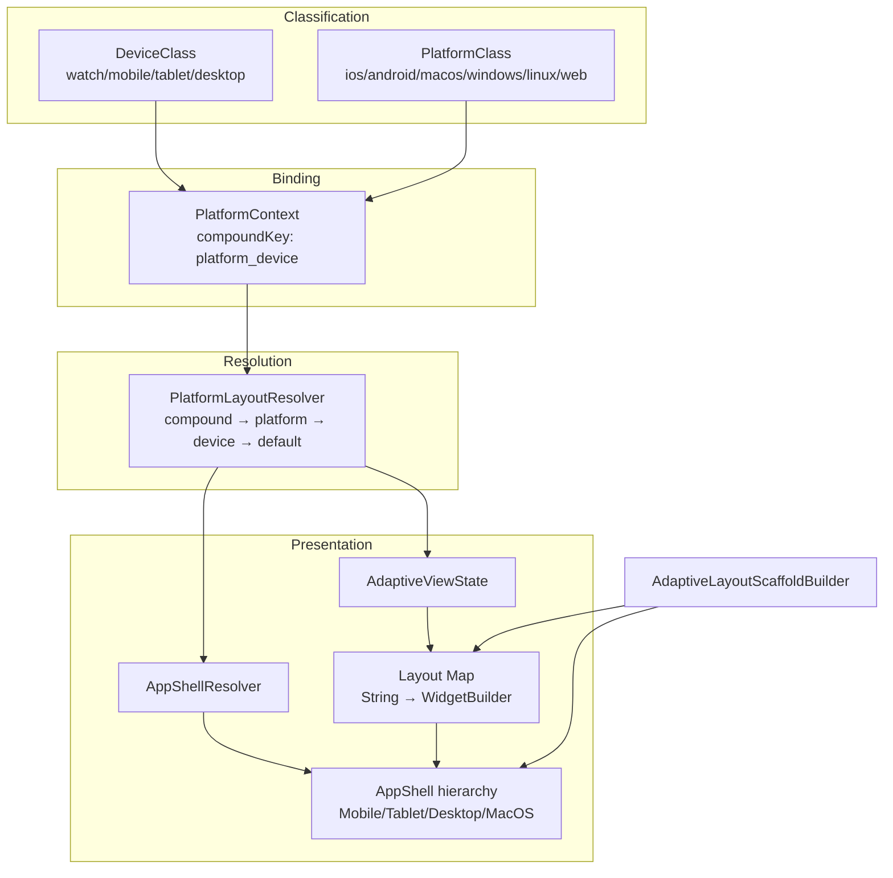
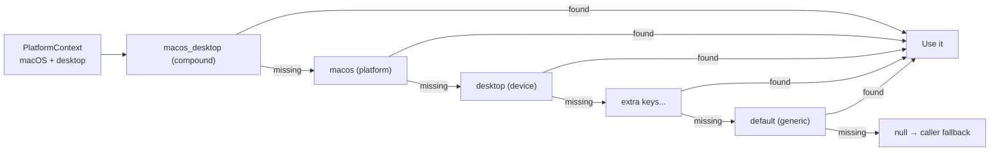
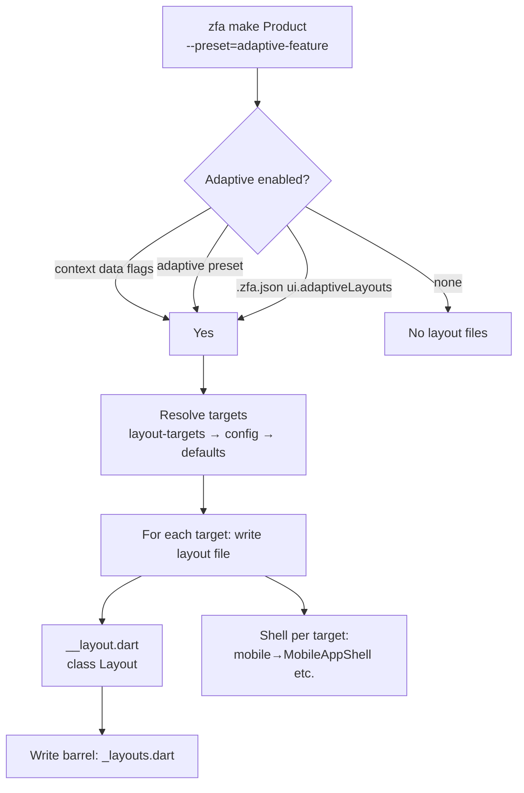

Zuraffa v5 treats presentation adaptation as a first-class generation concern: instead of hand-splitting views per platform (as v4 required), it provides a **classification → resolution → shell** pipeline that maps any runtime platform/device combination to a concrete layout, and scaffolds per-target layout files at generation time. This page documents the four layers that make this work — the classification primitives, the fallback resolver, the runtime view integration, and the shell widgets — plus how `zfa make` generates adaptive scaffolds and how to configure the system in `.zfa.json`.

## The Adaptive Layout Stack

The adaptive system is deliberately layered so that each component has a single responsibility. Classification enums describe *what device/platform is present*; `PlatformContext` binds those into an immutable, hashable key; `PlatformLayoutResolver` turns that key into a concrete choice from a map; and the shell widgets provide the chrome around whatever body the chosen layout builds.



| Layer | File(s) | Responsibility |
|---|---|---|
| Classification | `platform/device_class.dart`, `platform/platform_class.dart` | Canonical keys for device width and runtime platform |
| Binding | `platform/platform_context.dart` | Immutable `platform + device` pair with compound key |
| Resolution | `platform/platform_layout_resolver.dart` | Deterministic fallback chain over a key → value map |
| View integration | `adaptive_view.dart`, `responsive_view.dart` | Runtime widget selection inside `CleanViewState` |
| Shells | `shells/*.dart` | Platform-appropriate navigation chrome (bottom nav, rail, sidebar) |
| Generation | `plugins/view/builders/adaptive_layout_scaffold_builder.dart` | Scaffolds per-target layout files and a barrel export |

Sources: [lib/zuraffa.dart](lib/zuraffa.dart#L300-L333), [adaptive_view.dart](lib/src/presentation/adaptive_view.dart#L1-L95)

## Classification: DeviceClass and PlatformClass

`DeviceClass` buckets screen width into four categories, with breakpoints at 300, 600, and 950 logical pixels. `watch` maps to the layout key `watch`, while `phone` maps to `mobile` — the canonical target names used throughout generation. The `isHandheld` flag covers phones and watches; `isDesktopLike` is true only for the desktop class.

```dart
static DeviceClass fromWidth(double width) {
  if (width < 300) return DeviceClass.watch;
  if (width < 600) return DeviceClass.phone;
  if (width < 950) return DeviceClass.tablet;
  return DeviceClass.desktop;
}
```

Sources: [device_class.dart](lib/src/presentation/platform/device_class.dart#L6-L33)

`PlatformClass` covers the runtime platform — `ios`, `android`, `macos`, `windows`, `linux`, `web`, and `unknown`. Its `current()` factory reads `kIsWeb` and `defaultTargetPlatform`, so it needs no BuildContext and is trivially testable via injected `TargetPlatform`. Desktop-like platforms (macOS, Windows, Linux, web) are grouped for shell selection.

| DeviceClass | Layout key | Width | `isHandheld` |
|---|---|---|---|
| `watch` | `watch` | < 300 dp | ✅ |
| `phone` | `mobile` | 300–599 dp | ✅ |
| `tablet` | `tablet` | 600–949 dp | ❌ |
| `desktop` | `desktop` | ≥ 950 dp | ❌ |

Sources: [device_class.dart](lib/src/presentation/platform/device_class.dart#L24-L32), [platform_class.dart](lib/src/presentation/platform/platform_class.dart#L19-L51)

## PlatformContext and the Fallback Chain

`PlatformContext` is an `@immutable` value object pairing one `PlatformClass` with one `DeviceClass`. Its `compoundKey` (`'{platform}_{device}'`) is what makes the resolver expressive: `macos_desktop` can select a macOS-specific desktop layout, while `ios_mobile` selects a phone layout tuned for iOS. The `PlatformContext.current(...)` factory combines `PlatformClass.current(...)` with an externally supplied `DeviceClass`, which is how `AdaptiveViewState` injects the measured screen width.

Sources: [platform_context.dart](lib/src/presentation/platform/platform_context.dart#L1-L52)

`PlatformLayoutResolver<T>` is generic over the value type so it can resolve widgets, builders, or plain data. Resolution walks a candidate key list built in this order:

1. **compound** — e.g. `macos_desktop`
2. **platform** — e.g. `macos`
3. **device** — e.g. `desktop`
4. **extra fallback keys** — caller-injected, before the generic key
5. **generic** — `default` (configurable via `genericKey`)

Empty keys are skipped and duplicates are de-duplicated, which matters because a platform key and a device key can theoretically collide after string normalization. The static `resolveLayout` helper exists for one-off resolution without instantiating a resolver.



For a macOS desktop session, the candidate chain is `['macos_desktop', 'macos', 'desktop', 'default']`; for an Android tablet it is `['android_tablet', 'android', 'tablet', 'default']`. The test suite pins these chains explicitly, along with custom generic keys and injected extra fallback keys.

Sources: [platform_layout_resolver.dart](lib/src/presentation/platform/platform_layout_resolver.dart#L7-L73), [platform_layout_resolver_test.dart](test/presentation/platform_layout_resolver_test.dart#L92-L244)

## Runtime Integration: AdaptiveViewState vs ResponsiveViewState

Two `CleanViewState` subclasses expose this machinery to page code. `ResponsiveViewState` is width-only: it delegates to the `responsive_builder` package's `ScreenTypeLayout.builder`, cascading `desktopView → tabletView → mobileView` and `watchView → mobileView` so a mobile-only implementation works at every size. It also exposes `screenType` for conditional logic and supports custom `ScreenBreakpoints`.

`AdaptiveViewState` is the platform-aware sibling. You provide a `Map<String, WidgetBuilder> get layouts` keyed by canonical names (`mobile`, `tablet`, `desktop`, `macos`, `macos_desktop`, …), and the resolver picks the best match via the fallback chain. Two escape hatches matter in practice:

- `overridePlatformContext` — inject a fixed context for tests or for forcing a layout at runtime
- `extraFallbackKeys` + `genericKey` — extend the chain before the `default` terminal

The view getter wraps everything in a `LayoutBuilder`, measures `MediaQuery.sizeOf(context).width`, derives the `DeviceClass`, and resolves. If nothing matches and the map is empty it renders `SizedBox.shrink()`; if the map is non-empty but unmatched, it falls back to the first entry.

| Concern | `ResponsiveViewState` | `AdaptiveViewState` |
|---|---|---|
| Signals | Screen width only | Platform + device width |
| API | Four overridable getters | One `layouts` map + keys |
| Cascade | `desktop → tablet → mobile` | `compound → platform → device → default` |
| Platform-specific layouts | ❌ | ✅ (e.g. `macos`, `ios_mobile`) |
| Test override | Via breakpoints | Via `overridePlatformContext` |

Sources: [responsive_view.dart](lib/src/presentation/responsive_view.dart#L24-L42), [adaptive_view.dart](lib/src/presentation/adaptive_view.dart#L8-L95)

## Platform Shells

Shells are the chrome layer: they decide where navigation goes and how the body is framed. The abstract `AppShell` owns the shared contract — `title`, `body`, `navigation`, `floatingActionButton`, and `appBar` — and derives a default `AppBar` from the title if none is supplied. Concrete shells then express their platform idiom:

| Shell | Navigation placement | Notes |
|---|---|---|
| `MobileAppShell` | `bottomNavigationBar` | Watch/phone-first, keeps FAB |
| `TabletAppShell` | 280 dp left rail in a `Row` | Rail + expanded body |
| `DesktopAppShell` | 320 dp left sidebar in a `Row` | Wider rail for mouse-first UX |
| `MacosAppShell` | Inherits desktop sidebar | Extends `DesktopAppShell`, wraps in `SafeArea` |

Sources: [app_shell.dart](lib/src/presentation/shells/app_shell.dart#L1-L31), [mobile_app_shell.dart](lib/src/presentation/shells/mobile_app_shell.dart#L1-L26), [tablet_app_shell.dart](lib/src/presentation/shells/tablet_app_shell.dart#L1-L31), [desktop_app_shell.dart](lib/src/presentation/shells/desktop_app_shell.dart#L1-L31), [macos_app_shell.dart](lib/src/presentation/shells/macos_app_shell.dart#L1-L21)

`AppShellResolver` closes the loop: given a `PlatformContext` it runs the same `PlatformLayoutResolver` policy over a shell-builder map. Note the keying — `macos` and `desktop` resolve distinct shells, `tablet` gets the rail, and `watch`, `mobile`, and `default` all collapse to `MobileAppShell`. If no builder matches (an unusual case, since `default` is always registered), the raw body is returned as a safety net.

Sources: [app_shell_resolver.dart](lib/src/presentation/shells/app_shell_resolver.dart#L13-L81)

## Scaffolding Adaptive Layouts

Generation is the point where adaptive layouts become concrete files rather than just runtime infrastructure. `AdaptiveLayoutScaffoldBuilder` runs inside the view plugin's `_generateViewFile` flow and produces a per-target layout file set whenever adaptive mode is active.

Activation is tri-state — any of the following enables scaffolding:

1. Plugin context data: `adaptive-layouts`, `adaptive_layouts`, `platform-layouts`, or `platform_layouts` set to `true`
2. Preset membership: the preset is `adaptive-feature` or `platform-feature` (both registered in `PresetRegistry` with the full feature plugin list plus `route`)
3. Project config: `.zfa.json` sets `ui.adaptiveLayouts: true`

Target selection follows the same precedence: an explicit `layout-targets` / `layout_targets` / `layouts` list from context data wins; otherwise `ZfaConfig.adaptiveLayoutTargets`; otherwise the built-in default of `['mobile', 'tablet', 'desktop', 'macos']`.



Each generated layout file:

- imports the shared controller (`../<controller>_controller.dart`) and the framework package
- declares a `StatelessWidget` named `<Prefix><Target>Layout` (e.g. `ProductMobileLayout`)
- wraps its body in the matching shell (`_shellClassForTarget` maps `mobile → MobileAppShell`, `tablet → TabletAppShell`, `desktop → DesktopAppShell`, `macos → MacosAppShell`)
- renders a TODO placeholder inside a `ControlledWidgetBuilder`, keyed by a `ValueKey`

The barrel file (`<base>_layouts.dart`) emits one `export` per target, so a consuming page can import a single entry point. For a master-detail feature the builder runs once per view, yielding the eight layout files plus two barrels observed in the v4→v5 comparison report.

Sources: [adaptive_layout_scaffold_builder.dart](lib/src/plugins/view/builders/adaptive_layout_scaffold_builder.dart#L1-L91), [preset_registry.dart](lib/src/core/planning/preset_registry.dart#L25-L74), [docs/v4_vs_v5_comparison.md](docs/v4_vs_v5_comparison.md#L70-L95)

### CLI surface

The view plugin declares three schema properties that the make command's `_addPluginOptions` machinery converts into CLI flags (`--adaptive-layouts`, `--platform-shells`, `--layout-targets`), with parsed values flowing into `PluginContext.data` — which is exactly the data the builder reads for activation and target selection.

```bash
zfa make Product --preset=adaptive-feature --methods=get,getList
zfa make Product --preset=crud --with=vpc,state --adaptive-layouts --layout-targets=mobile,tablet,desktop,macos
```

Sources: [view_plugin.dart](lib/src/plugins/view/view_plugin.dart#L63-L84), [plugin_manager.dart](lib/src/core/plugin_system/plugin_manager.dart#L95-L149)

## Configuration

The `.zfa.json` `ui` section centralizes adaptive defaults. `ZfaConfig` exposes them through four accessors — `adaptiveLayoutsByDefault`, `platformShellsByDefault`, `adaptiveLayoutTargets`, and `adaptivePreset` (default `adaptive-feature`) — and `toJson()` always materializes all four so the file stays canonical.

```json
{
  "ui": {
    "adaptiveLayouts": true,
    "platformShells": true,
    "layoutTargets": ["mobile", "tablet", "desktop", "macos"],
    "adaptivePreset": "adaptive-feature"
  }
}
```

The migration plan for the downstream `zik_zak` app uses exactly this shape, and `zfa init` prints a hint that adaptive scaffolding is controlled by `ui.adaptiveLayouts` with targets from `ui.layoutTargets`.

Sources: [zfa_config.dart](lib/src/config/zfa_config.dart#L12-L17), [zfa_config.dart](lib/src/config/zfa_config.dart#L106-L133), [zfa_config.dart](lib/src/config/zfa_config.dart#L264-L310), [doc/ZIK_ZAK_V5_MIGRATION_PLAN.md](doc/ZIK_ZAK_V5_MIGRATION_PLAN.md#L95-L105)

## Known Caveats

The scaffold template currently embeds the `ValueKey` string across two lines of the triple-quoted template (`ValueKey('${target}_layout_\n$controllerName')`), which emits a newline inside the generated string literal. The v4→v5 comparison report documents exactly this symptom — `key: ValueKey('mobile_layout_\nFeedbackController')` — and flags it as a template fix still pending. If you generate layouts, verify the `KeyedSubtree` keys after formatting.

Sources: [adaptive_layout_scaffold_builder.dart](lib/src/plugins/view/builders/adaptive_layout_scaffold_builder.dart#L210-L218), [docs/v4_vs_v5_comparison.md](docs/v4_vs_v5_comparison.md#L335-L351)

## Testing the Adaptive Contract

Three test suites pin the system's behavior:

- `test/presentation/platform_layout_resolver_test.dart` — width thresholds, canonical keys, fallback chains per platform/device combo, deduplication, custom generic keys, extra fallback keys
- `test/integration/platform_layout_generation_test.dart` — asserts the builder exists, the platform classes exist, all shells exist, `defaultAdaptiveLayoutTargets` is referenced in config, and both adaptive presets are registered
- `test/regression/platform_layout_structure_test.dart` — structural invariants: shells must extend `AppShell`, `MacosAppShell` must extend `DesktopAppShell`, `AppShellResolver` must use `PlatformLayoutResolver`, and layout keys must match the canonical target set

Sources: [platform_layout_resolver_test.dart](test/presentation/platform_layout_resolver_test.dart#L1-L244), [platform_layout_generation_test.dart](test/integration/platform_layout_generation_test.dart#L1-L106), [platform_layout_structure_test.dart](test/regression/platform_layout_structure_test.dart#L1-L134)

## Next Steps

- See how adaptive layouts fit into the broader presentation contract in [Presentation Layer: Controller, View & Presenter](12-presentation-layer-controller-view-and-presenter)
- Understand where generated layout files land in the [Generated Project Layout](5-generated-project-layout) structure
- Combine adaptive scaffolds with [Dependency Injection Generation](17-dependency-injection-generation) for DI-wired layout controllers
- Review the generation-time behavior of [Presets, Aliases & Plan Resolution](8-presets-aliases-and-plan-resolution) to see how `adaptive-feature` expands