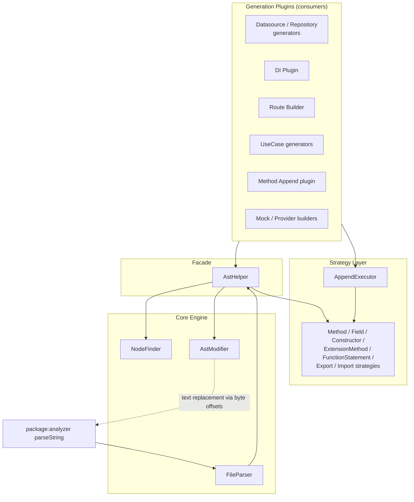

Zuraffa's code generator must extend existing files without destroying user edits. The AST-based code modification subsystem — also called *append mode* — replaces brittle string concatenation with syntax-aware surgery performed on the `package:analyzer` abstract syntax tree. This page explains the subsystem's layered architecture, the strategy-based append engine, and how every generation plugin relies on it to add, replace, and remove Dart members, directives, and statements safely.

## Why Syntax-Aware Modification

When Zuraffa regenerates a project, most files can be written from scratch. But user-authored files — service interfaces, datasources, repositories, route tables, and the DI service locator — must be *extended in place*. The earliest approach used string concatenation with regex detection, which risked malformed Dart and duplicated members. Full-file regeneration with user-code markers was rejected because it cannot survive arbitrary user edits. The accepted design (ADR 003) is AST parsing plus targeted append strategies, giving safer append behavior with duplicate detection while preserving user edits — at the cost of analyzer-based parsing and more complex logic. Sources: [ADR 003 — AST-based Append Mode](doc/adr/003-ast-integration.md#L1-L30)

The subsystem is organized into five cooperating layers, each with a single responsibility:



Every layer is exported from the public library, so plugin authors can reuse the same primitives: `AstHelper`, `FileParser`, `AstModifier`, `NodeFinder`, `AppendExecutor`, and the strategy base types are all re-exported from `lib/zuraffa.dart`. Sources: [zuraffa.dart](lib/zuraffa.dart#L240-L247)

## The Parsing Layer: FileParser

`FileParser` is the thin wrapper around `package:analyzer`'s `parseString`. It exposes two entry points: `parseSource(String source)` for in-memory text and `parseFile(String path)` for disk reads via the injectable `FileSystem` abstraction. Both return an `AstParseResult` carrying the parsed `CompilationUnit` plus a list of `Diagnostic` errors. Parsing is deliberately non-throwing: `throwIfDiagnostics: false` means malformed source still yields a unit with diagnostics attached, and a hard failure (exception) collapses to a null unit with empty errors. Consumers check `hasErrors` before trusting the tree. Sources: [file_parser.dart](lib/src/core/ast/file_parser.dart#L1-L43)

## Node Discovery: NodeFinder

`NodeFinder` is a stateless collection of static traversal helpers that answer "where is X in this tree?" It locates classes, extensions, and top-level functions by name at the compilation-unit level, and methods and fields within a class or extension body. All lookups are name-based and exact: `findClass` compares the class's name token lexeme, `findMethods` filters `MethodDeclaration` members, and `findFields` flattens `FieldDeclaration` members into their individual `VariableDeclaration` nodes. The finder never mutates anything — it exists so strategies and the facade can obtain precise `offset`/`end` anchors for later surgery. Sources: [node_finder.dart](lib/src/core/ast/node_finder.dart#L1-L87)

## The Text Surgery Engine: AstModifier

`AstModifier` is the low-level engine that performs actual source transformation. Its core insight is that the analyzer AST records exact byte offsets, so *insertion* and *replacement* are pure string operations anchored to tree positions — never regex. Two private primitives power everything:

- `_replaceRange(source, offset, end, newSource)` — deletes the node's byte range and splices in new source, used for method/constructor/field replacement and removal.
- `_insertInBlock(source, rightBracketOffset, content, suffix)` — injects content immediately before a closing bracket, used to append members at the end of a class body, statements at the end of a function body, or elements inside a return list literal.

| Operation | Mechanism | Deduplication behavior |
|---|---|---|
| `addMethodToClass` / `addFieldToClass` | `_insertInBlock` before class `}` | Caller decides; modifier is unconditional |
| `replaceMethodInClass` / `replaceFieldInClass` / `replaceConstructorInClass` | `_replaceRange` over node span | Caller decides; modifier is positional |
| `removeMethodFromClass` / `removeField` / `removeConstructorFromClass` | `_replaceRange` with empty string | Caller decides |
| `addImport` / `removeImport` | Insert after last import, or before first directive | `addImport` is idempotent — scans existing `ImportDirective`s by URI string |
| `addExport` / `removeExport` | Insert after last export, else after last import, else at top | `addExport` is idempotent — scans existing `ExportDirective`s |
| `addStatementToFunction` | `_insertInBlock` before function `}` | Caller decides |
| `addElementToReturnListInFunction` | `_insertInBlock` before list `}` with `,` suffix | Caller decides (route builder normalizes whitespace first) |
| `removeElementFromReturnListInFunction` / `removeStatement` | `_replaceRange` over matched element | Matches by exact `toSource()` |

After every mutation, the result is passed through `_formatSafe`, which runs `DartFormatter` at the latest language version and silently returns the unformatted source if formatting fails — guaranteeing the surgery never corrupts a file that the formatter cannot handle. Sources: [ast_modifier.dart](lib/src/core/ast/ast_modifier.dart#L8-L20), [ast_modifier.dart](lib/src/core/ast/ast_modifier.dart#L111-L184), [ast_modifier.dart](lib/src/core/ast/ast_modifier.dart#L380-L416)

## The Facade: AstHelper

`AstHelper` is the ergonomic facade most plugin code interacts with. It composes the pipeline — parse, find, modify — into one-line operations: `addMethodToClass`, `replaceMethodInClass`, `addFieldToClass`, `addMethodToExtension`, `addStatementToFunction`, `addElementToReturnListInFunction`, and their removal counterparts. Each returns the original source unchanged when the target class, extension, or function cannot be found, which makes the facade safe to call speculatively. Sources: [ast_helper.dart](lib/src/core/ast/ast_helper.dart#L28-L95), [ast_helper.dart](lib/src/core/ast/ast_helper.dart#L200-L399)

The facade also owns two classification capabilities used throughout the pipeline. First, `isClassEmpty(source, className)` answers "should this file be deleted on revert?" — a class whose body has no members left after removing generated code is dead weight. Second, a family of **structural equality predicates** that are formatting-insensitive: `areMethodsEqual` compares name, return type, parameter list, and body via `toSource()`, so `Future < void > test ( String a )` and `Future<void> test(String a)` are equal even though their text differs. `areSignaturesEqual` drops the body comparison, and equivalent constructor and field predicates exist. These predicates are the backbone of idempotent regeneration: they let Zuraffa recognize "this method already exists, byte-for-byte, semantically" and skip the write. Sources: [ast_helper.dart](lib/src/core/ast/ast_helper.dart#L470-L567)

## The Strategy Engine: AppendExecutor

The append engine wraps the primitive operations in a classic strategy pattern. An `AppendRequest` is an immutable, typed description of the desired mutation — target kind plus the source text and the parameters that kind needs (e.g., `className` + `memberSource` for methods, `importPath` for imports). An `AppendResult` reports the new source, whether anything changed, and a human-readable message such as `Method replaced` or `Import already exists`. Sources: [append_strategy.dart](lib/src/core/ast/strategies/append_strategy.dart#L1-L105)

`AppendExecutor` holds an ordered list of strategies and dispatches on `canHandle(request)` — the first strategy that recognizes the target wins. The default registry covers all seven target kinds:

| Strategy | Handles `AppendTarget` | Duplicate policy (without `force`) | With `force` |
|---|---|---|---|
| `MethodAppendStrategy` | `method` | Identical method → no-op; same name, different signature → conflict error | Replace |
| `FieldAppendStrategy` | `field` | Equal field → replace; same name, different signature → conflict error | Replace |
| `ConstructorAppendStrategy` | `constructor` | Equal constructor → no-op; same name, different signature → conflict error | Replace |
| `ExtensionMethodAppendStrategy` | `extensionMethod` | Identical method → no-op; same name, different signature → conflict error | Remove + re-add |
| `FunctionStatementAppendStrategy` | `functionStatement` | Exact `toSource()` duplicate → no-op | n/a |
| `ExportAppendStrategy` | `exportDirective` | Existing URI → no-op | n/a |
| `ImportAppendStrategy` | `importDirective` | Existing URI → no-op | n/a |

Sources: [append_executor.dart](lib/src/core/ast/append_executor.dart#L1-L52)

The method strategy illustrates the full decision logic, which is representative of all member strategies:

```mermaid
flowchart TD
    A["AppendRequest.method(source, className, memberSource)"] --> B{canHandle?}
    B -- no --> Z["AppendResult: not supported"]
    B -- yes --> C["parseSource(request.source)"]
    C --> D{unit parsed?}
    D -- no --> Z2["no change: unable to parse"]
    D -- yes --> E{findClass(className)?}
    E -- null --> Z3["no change: class not found"]
    E -- found --> F["_parseMethod(memberSource) in temp class wrapper"]
    F --> G{valid method?}
    G -- null --> Z4["no change: invalid method source"]
    G -- valid --> H["scan existing methods by name"]
    H -- no match --> I["addMethodToClass via _insertInBlock"] --> Y["changed = true"]
    H -- match --> J{force?}
    J -- yes --> K["replaceMethodInClass via _replaceRange"] --> Y
    J -- no --> L{areMethodsEqual?}
    L -- yes --> M["no change: method already exists"]
    L -- no --> N{areSignaturesEqual?}
    N -- yes --> O["replace: method replaced (same signature)"]
    N -- no --> P["no change: same name, different signature"]
```

Sources: [method_append_strategy.dart](lib/src/core/ast/strategies/method_append_strategy.dart#L1-L179)

Two details make the strategies robust. First, **every injected snippet is validated before insertion**: the strategy wraps `memberSource` in a temporary class (`class _Temp { ... }`), extension (`extension _Temp on Object { ... }`), or function (`void _temp() { ... }`), re-parses it, and extracts the AST node. If the snippet is not valid Dart, the append is rejected with `Invalid method source` — malformed code can never enter the target file. Second, each strategy implements **`undo`**, which reverses the operation by removing the member it would have added. This is what powers Zuraffa's `--revert` flows: the same request object drives both apply and undo. Sources: [method_append_strategy.dart](lib/src/core/ast/strategies/method_append_strategy.dart#L100-L179), [function_statement_append_strategy.dart](lib/src/core/ast/strategies/function_statement_append_strategy.dart#L24-L127)

## Integration Across the Generation Pipeline

The append engine is the shared mutation primitive for every plugin that touches pre-existing Dart files. The consumers and their request mix:

| Consumer | File / target | Requests used |
|---|---|---|
| Datasource interface generator | existing datasource interface | `method`, `import` + `AstHelper.isClassEmpty` on revert |
| Datasource local generator | local datasource class | `method`, `constructor`, `field`, `import` |
| Datasource remote generator | remote datasource class | `method`, `import` |
| Repository interface / implementation generators | repository interface + impl | `method`, `constructor`, `field`, `import` |
| DI plugin | `service_locator.dart` index | `export`, `import`, `functionStatement` (registration calls) |
| Route builder | `app_routes.dart` + entity routes | `field` (AppRoutes), `extensionMethod` (RouterExtension), `addElementToReturnListInFunction` for the route getter |
| Method append plugin | service interface, provider, mock provider | `method`, `constructor`, `field`, `import` |
| Mock plugin | mock datasource / provider | `method`, `import` |
| Provider builder | provider class | `addMethodToClass` / `replaceMethodInClass` / `removeMethodFromClass` via facade |
| UseCase generators | existing use case class (`--append`) | `method` |

Sources: [interface_generator.dart](lib/src/plugins/datasource/builders/interface_generator.dart#L285-L365), [local_generator.dart](lib/src/plugins/datasource/builders/local_generator.dart#L210-L365), [implementation_generator.dart](lib/src/plugins/repository/generators/implementation_generator.dart#L400-L470)

A representative append flow — used by both datasource and repository generators — shows the disciplined ordering of operations:

1. Read the existing file through the transactional filesystem.
2. **Add imports first** — each generated member references entity types that must resolve; `AstHelper.addImport` is idempotent so repeated runs do not duplicate directives.
3. **Append members in dependency order** — fields, then constructors, then methods (local generator), or just methods (interface/remote generators).
4. On revert, **remove in reverse** — methods, then constructors, then fields — and check `isClassEmpty`; an emptied class triggers file deletion instead of writing an empty skeleton.

Sources: [remote_generator.dart](lib/src/plugins/datasource/builders/remote_generator.dart#L370-L450), [local_generator.dart](lib/src/plugins/datasource/builders/local_generator.dart#L285-L365)

Three consumers exploit the more specialized operations. The **DI plugin** keeps its `service_locator.dart` index synchronized by applying three request types in sequence — `export` for barrel exports, `import` for feature modules, and `functionStatement` to inject `getIt.registerLazy(...)` calls into the `setupDependencies` function body; the same three requests run through `undo` when reverting, cleanly stripping registrations. The **route builder** appends route constants as fields on `AppRoutes` and route getters as extension methods on `RouterExtension`, and uses `addElementToReturnListInFunction` to grow the `List<GoRoute>` returned by the route getter — with whitespace-normalized duplicate detection so re-runs do not stack identical route entries. The **method append plugin** (`zfa make method`) composes AST appends with `code_builder` emission: it renders a new method with `DartEmitter`, then appends it to the service interface, provider, and mock provider via `AppendRequest.method`, followed by `_addMissingImports` which derives relative entity import paths from the file's directory and inserts them idempotently. Sources: [di_plugin.dart](lib/src/plugins/di/di_plugin.dart#L1406-L1448), [route_builder.dart](lib/src/plugins/route/builders/route_builder.dart#L281-L345), [route_builder.dart](lib/src/plugins/route/builders/route_builder.dart#L240-L280), [method_append_builder_append.dart](lib/src/plugins/method_append/builders/method_append_builder_append.dart#L1-L200), [method_append_builder_imports.dart](lib/src/plugins/method_append/builders/method_append_builder_imports.dart#L1-L60)

The subsystem also has a read-side consumer: `MethodExtractor` parses an existing service interface and extracts each method's name, return type, and first parameter type to classify the corresponding use case (`usecase` / `stream` / `completable` / `sync`). This is how Zuraffa regenerates use cases that match what is already on the interface — the AST provides the contract, and the append strategies keep implementations in sync. Sources: [method_extractor.dart](lib/src/utils/method_extractor.dart#L1-L90)

All of this operates inside Zuraffa's transaction system: reads and writes go through `TransactionalFileSystem`, which overlays pending operations from the current `GenerationTransaction` so that a generator appending to a file it created earlier in the same run sees its own intermediate content. The AST layer is agnostic to this — it transforms whatever source string it is given — which is precisely what makes the composition clean. Sources: [transactional_file_system.dart](lib/src/core/transaction/transactional_file_system.dart#L1-L60)

## Safety Properties and Guarantees

The design's value can be summarized as a set of invariants verified across the test suite:

| Guarantee | Mechanism | Evidence |
|---|---|---|
| Injected code is always valid Dart | snippet re-parsed inside temp wrapper before insertion | `method_append_strategy.dart#L148-L179`, `function_statement_append_strategy.dart#L76-L103` |
| No duplicates on re-run | structural equality + `toSource()` comparison + directive URI scan | `append_strategy_test.dart#L19-L38`, `ast_helper.dart#L492-L567` |
| No silent signature collisions | same-name/different-signature rejected unless `force` | `method_append_strategy.dart#L66-L91` |
| Formatting never corrupts output | `_formatSafe` falls back to raw source on formatter failure | `ast_modifier.dart#L404-L416` |
| Equality is formatting-insensitive | predicates compare parsed node `toSource()` | `structural_equality_test.dart#L10-L38` |
| Revert is symmetric | every strategy implements `undo` driven by the same request | `append_executor.dart#L36-L50` |
| Large files stay within budget | benchmark asserts append under 10s for a 400-method class | `large_file_generation_test.dart#L1-L30` |

Sources: [append_strategy_test.dart](test/core/ast/append_strategy_test.dart#L1-L154), [structural_equality_test.dart](test/core/ast/structural_equality_test.dart#L1-L67), [ast_helper_test.dart](test/core/ast/ast_helper_test.dart#L1-L123)

## Where This Fits

AST-based modification is the enabling mechanism behind the append-mode behaviors described elsewhere in the catalog: the plugin system's builders ([Building Custom Plugins](22-building-custom-plugins)) receive the `AppendExecutor` as an injectable dependency, while append/revert semantics ride on the transactional filesystem ([Transactional File System, Revert & Plan Store](9-transactional-file-system-revert-and-plan-store)). The method-append workflow built on this engine is exercised end-to-end in the integration suites covering custom use case detection and toggle-method generation ([Regression & Integration Test Suites](27-regression-and-integration-test-suites)). For the generation pipeline that feeds these builders, see [Code Generation Pipeline: From CLI to Files](6-code-generation-pipeline-from-cli-to-files).