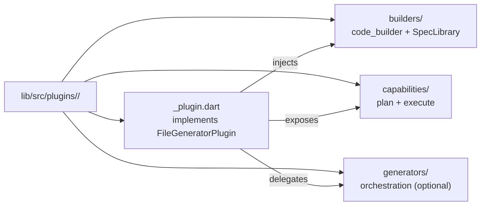
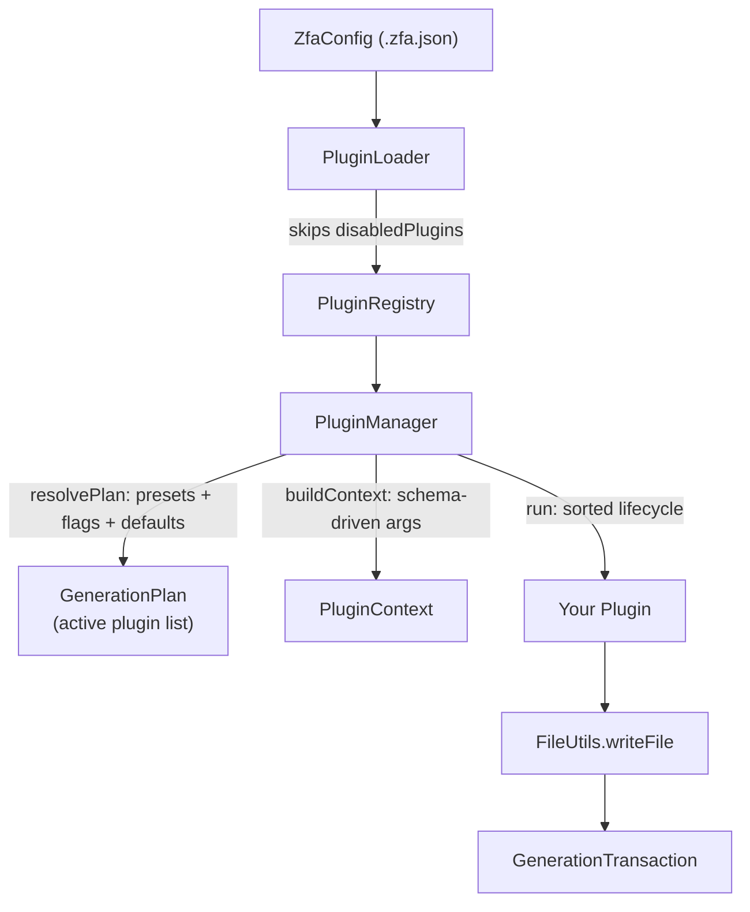
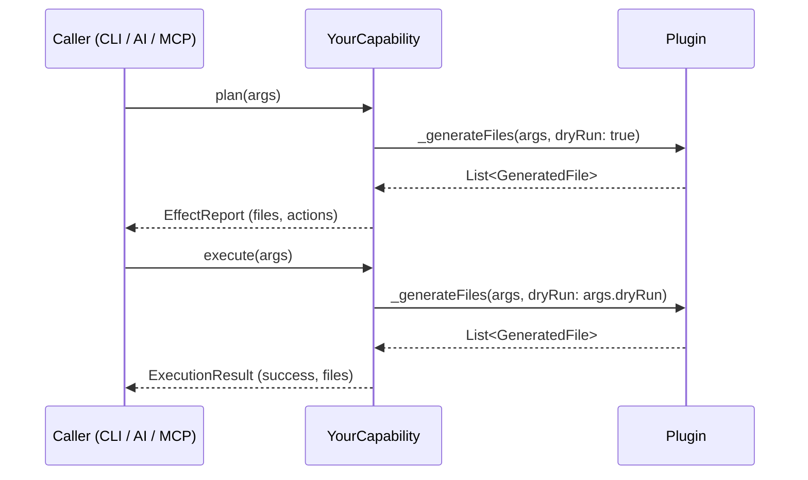
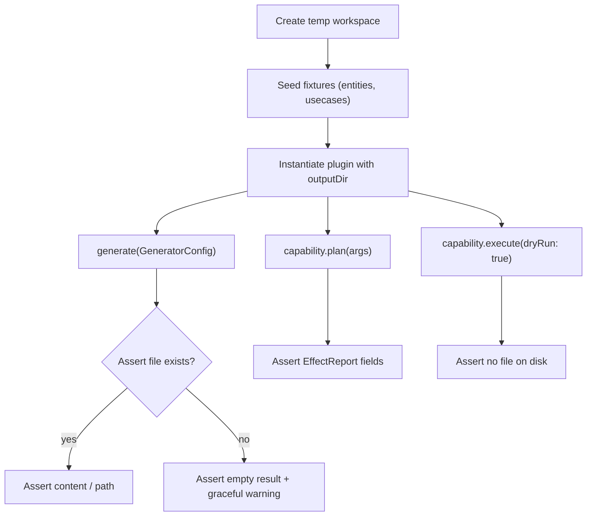

This page is a hands-on guide to authoring third-party generation plugins for Zuraffa. Where [Plugin System Architecture](7-plugin-system-architecture) explains *how the kernel works*, this page tells you *how to build against it*: the exact contracts to implement, the code-emission pipeline, configuration and CLI wiring, capability exposure, and the testing discipline that keeps custom generators on par with the 22 built-ins. It assumes you have read the architecture page and are comfortable with Dart, `code_builder`, and Zuraffa's `GeneratorConfig` model.

## The Extension Points You Build Against

Every custom plugin implements one of two interfaces. The base `ZuraffaPlugin` covers plugins that validate, observe, or coordinate but do not write files; `FileGeneratorPlugin` extends it with `generateWithContext(PluginContext)` — the canonical entry point — plus a legacy `generate(GeneratorConfig)` bridge. The default `generateWithContext` implementation maps the context back into a `GeneratorConfig` via `fromJson`, overlays the universal flags from `context.core` (`dryRun`, `force`, `verbose`, `revert`, `outputDir`), and delegates to `generate`, so a plugin can override either method without breaking the other path. Sources: [plugin_interface.dart](lib/src/core/plugin_system/plugin_interface.dart#L9-L62), [plugin_interface.dart](lib/src/core/plugin_system/plugin_interface.dart#L65-L84)

A plugin is identified by three required strings and an optional set of ordering and configuration hooks. The `id` is the single source of truth for dependency resolution, CLI activation, and `.zfa.json` keys — registering two plugins with the same `id` throws `StateError` at registration time. The optional `dependsOn` (hard prerequisites that force other plugins active) and `runAfter` (soft ordering that only applies when the dependency is present) feed the registry's topological sort, which detects cycles with a DFS and throws `StateError('Circular dependency detected: ...')`. Sources: [plugin_interface.dart](lib/src/core/plugin_system/plugin_interface.dart#L20-L36), [plugin_registry.dart](lib/src/core/plugin_system/plugin_registry.dart#L54-L59), [plugin_registry.dart](lib/src/core/plugin_system/plugin_registry.dart#L19-L51)

The full surface area of a plugin:

| Member | Type | Contract |
|---|---|---|
| `id` | `String` | Unique identifier (`'usecase'`, `'my_generator'`) — must never change |
| `name` / `version` | `String` | Human-readable reporting values |
| `dependsOn` | `List<String>` | Plugin ids that must be active before this one |
| `runAfter` | `List<String>` | Soft ordering hint, applied only if the target is present |
| `configSchema` | `JsonSchema` | JSON Schema driving CLI flag generation and validation |
| `configKey` | `String?` | `.zfa.json` default-activation key (defaults to `<id>ByDefault`) |
| `capabilities` | `List<ZuraffaCapability>` | Interrogable operations (plan/execute) |
| `validate` / `beforeGenerate` / `afterGenerate` / `onError` | lifecycle hooks | See the lifecycle section below |

Sources: [plugin_interface.dart](lib/src/core/plugin_system/plugin_interface.dart#L9-L62), [zfa_config.dart](lib/src/config/zfa_config.dart#L173-L180)

## Step 1: Scaffold the Plugin

Create a folder under `lib/src/plugins/<your_plugin_id>/` mirroring the layout of the built-ins. The established structure separates concerns into `builders/` (code emission), `capabilities/` (interrogable operations), and `generators/` (higher-level orchestration) — the `usecase` plugin, for example, holds three generators plus a capability, while `api` holds one builder and one capability. You do not need all three folders; a minimal plugin can live in a single file. Sources: [usecase_plugin.dart](lib/src/plugins/usecase/usecase_plugin.dart#L15-L40), [api_plugin.dart](lib/src/plugins/api/api_plugin.dart#L42-L60)



Sources: [plugin_loader.dart](lib/src/cli/plugin_loader.dart#L100-L131)

The two reference implementations shipped in `example/custom_plugin/` are the fastest way to bootstrap: `minimal_plugin_example.dart` shows the identity contract and a single-file write, while `advanced_plugin_example.dart` demonstrates `code_builder` emission. Both take `outputDir`, `dryRun`, `force`, and `verbose` through their constructors — the same four flags every built-in plugin accepts via `GeneratorOptions`. Sources: [minimal_plugin_example.dart](example/custom_plugin/minimal_plugin_example.dart#L7-L27), [advanced_plugin_example.dart](example/custom_plugin/advanced_plugin_example.dart#L12-L27)

## Step 2: Generate Files Through FileUtils

File output must go through `FileUtils.writeFile`, never direct `dart:io` writes. The utility is transaction-aware: when a `GenerationTransaction` is active (as during `PluginManager.run`), it stages a `FileOperation` into the transaction instead of touching disk, so all plugin writes are conflict-checked and committed atomically — or rolled back on failure. It also formats `.dart` content with `DartFormatter` before staging, and honors the `force` flag (skip existing files unless forced) and `dryRun` (stage but never commit). Sources: [file_utils.dart](lib/src/utils/file_utils.dart#L8-L79), [generation_transaction.dart](lib/src/core/transaction/generation_transaction.dart#L45-L91)

The minimal plugin is eleven lines of generation logic: it joins the output path, calls `writeFile` with a content string, a type tag, and the universal flags, and returns the resulting `GeneratedFile`. The `type` string ('custom_plugin' here) is a free-form label that appears in revert plans and artifact reports — pick something namespaced to your plugin. Sources: [minimal_plugin_example.dart](example/custom_plugin/minimal_plugin_example.dart#L29-L45), [generated_file.dart](lib/src/models/generated_file.dart#L5-L15)

```dart
@override
Future<List<GeneratedFile>> generate(GeneratorConfig config) async {
  final filePath = path.join(outputDir, 'custom_plugin', 'minimal_output.txt');
  final file = await FileUtils.writeFile(
    filePath,
    'Minimal plugin output for ${config.name}',
    'custom_plugin',
    force: force,
    dryRun: dryRun,
    verbose: verbose,
  );
  return [file];
}
```

Sources: [minimal_plugin_example.dart](example/custom_plugin/minimal_plugin_example.dart#L29-L45)

`writeFile` returns a `GeneratedFile` whose `action` reflects what actually happened — `'created'`, `'overwritten'`, or `'skipped'` (when the file exists and `force` is false). The `PluginManager` aggregates these results into the run artifact, so your plugin's returned list directly shapes what the user sees in output and what gets persisted for revert. For deletion, use the sibling `deleteFile`, which follows the same transaction/dry-run path. Sources: [file_utils.dart](lib/src/utils/file_utils.dart#L81-L114), [plugin_manager.dart](lib/src/core/plugin_system/plugin_manager.dart#L411-L463)

## Step 3: Emit Dart Code with SpecLibrary

For generated Dart, build the source programmatically with `code_builder` and emit it through `SpecLibrary`. This is the pattern every layer plugin uses — `SpecLibrary.library` assembles `Directive`s and `Spec`s (classes, methods, fields), and `emitLibrary` runs the `DartEmitter` with null-safety syntax and then formats the result with `DartFormatter`, falling back to the raw emission if formatting fails. The result is consistently formatted, import-ordered output that survives `dart format` CI checks. Sources: [spec_library.dart](lib/src/core/builder/shared/spec_library.dart#L10-L36), [spec_library.dart](lib/src/core/builder/shared/spec_library.dart#L38-L67)

The advanced example demonstrates the full flow: build a `Class` spec with a final field, a constructor with `toThis` parameter, and a method whose body is raw `Code`; assemble a library with an import directive; emit the formatted string; then hand it to `FileUtils.writeFile` with the `'custom_plugin'` type tag. Because the output is a complete, importable library, this pattern composes cleanly with the rest of the generated project. Sources: [advanced_plugin_example.dart](example/custom_plugin/advanced_plugin_example.dart#L30-L75), [advanced_plugin_example.dart](example/custom_plugin/advanced_plugin_example.dart#L77-L89)

| Concern | Raw string interpolation | `code_builder` + `SpecLibrary` |
|---|---|---|
| Formatting | Manual, drifts | `DartFormatter` applied centrally |
| Import ordering | Manual | `DartEmitter(orderDirectives: true)` |
| Null safety syntax | Manual | Enforced by emitter |
| AST append compatibility | Not reusable | Specs can be re-emitted as method members |
| Error surface | Runtime only | Compile-time builder API |

Sources: [spec_library.dart](lib/src/core/builder/shared/spec_library.dart#L20-L36)

A production example of this pipeline is `ApiBridgeBuilder.generate`, which scans the entity's usecase folder, builds a bridge file containing one handler function per discovered UseCase, emits the content through `SpecLibrary`, and writes it via `FileUtils.writeFile` with the `'api_bridge'` type. Note the guard: when no UseCases are found it prints a warning and returns an empty list rather than throwing — a plugin should degrade gracefully when its inputs are absent. Sources: [api_bridge_builder.dart](lib/src/plugins/api/builders/api_bridge_builder.dart#L70-L101)

## Step 4: Declare a Config Schema and Wire CLI Flags

The `configSchema` JSON Schema is not documentation — it is executable. `PluginManager.buildContext` reads every property in the schema, generates CLI options for it (`boolean` → flag, `array` → multi-option, everything else → option with `enum`/`default`/`description`), parses parsed values into `context.data`, and coerces types (integers, doubles, comma-separated arrays) before any plugin runs. A schema-less plugin simply receives no plugin-specific args. Sources: [plugin_manager.dart](lib/src/core/plugin_system/plugin_manager.dart#L83-L155), [plugin_manager.dart](lib/src/core/plugin_system/plugin_manager.dart#L156-L215)

The `usecase` plugin's schema is the canonical template: `methods` as an array of strings, `type` as an enum with a default, and scalar options for `domain`, `repo`, `service`, `params`, and `returns`. Each property carries a `description` that surfaces in CLI help output. When the user passes `--methods get,create`, the parser splits and flattens the value into a list before it lands in `context.data['methods']`. Sources: [usecase_plugin.dart](lib/src/plugins/usecase/usecase_plugin.dart#L51-L100)

| Schema `type` | CLI representation | `context.data` value |
|---|---|---|
| `boolean` | `--flag` / `--no-flag` | `bool` |
| `array` | `--multi-option a,b` (repeatable) | `List<String>` |
| `integer` | `--option 42` | `int` (throws `FormatException` on bad parse) |
| `number` | `--option 3.14` | `double` |
| `string` with `enum` | `--option <allowed>` | validated `String` |

Sources: [plugin_manager.dart](lib/src/core/plugin_system/plugin_manager.dart#L83-L155)

To expose a dedicated subcommand (`zfa <your-id> ...`), implement the `CliAwarePlugin` mixin and return a `Command` from `createCommand()`. The CLI runner iterates all `CliAwarePlugin` instances during initialization and registers each returned command on the root runner. The `shadcn` plugin is the reference: its command constructs a `PluginManager`, resolves its own plugin as active, builds a context with overridden data (the layout argument is written into `context.data['layout']` after `buildContext`), and runs the lifecycle directly. Sources: [cli_aware_plugin.dart](lib/src/core/plugin_system/cli_aware_plugin.dart#L7-L13), [shadcn_plugin.dart](lib/src/plugins/shadcn/shadcn_plugin.dart#L54-L55), [shadcn_command.dart](lib/src/plugins/shadcn/commands/shadcn_command.dart#L28-L76)

## Step 5: Register and Activate the Plugin

Plugins live in a `PluginRegistry` — either the shared singleton `PluginRegistry.instance` (used by MCP and capability commands) or a private instance you construct and drive yourself. `register` rejects duplicate ids; `registerAll` and `discover` (factory-based) batch registration. The built-in `PluginLoader` builds a fresh registry and skips any plugin whose id appears in `PluginConfig.disabled` — replicate that pattern for third-party integration so `.zfa.json`'s `disabledPlugins` set keeps working. Sources: [plugin_registry.dart](lib/src/core/plugin_system/plugin_registry.dart#L54-L70), [plugin_loader.dart](lib/src/cli/plugin_loader.dart#L55-L63), [plugin_loader.dart](lib/src/cli/plugin_loader.dart#L30-L46)



Sources: [plugin_loader.dart](lib/src/cli/plugin_loader.dart#L77-L85), [plugin_manager.dart](lib/src/core/plugin_system/plugin_manager.dart#L311-L327)

Activation defaults flow from `ZfaConfig.pluginDefaults` (all built-ins default to `false`). The `configKey` getter maps your plugin id to a `.zfa.json` key — the default derivation is `<id>ByDefault`, with explicit overrides for `method_append` → `appendByDefault` and `gql`/`graphql` → `gqlByDefault`/`graphqlByDefault`. The `method_append` plugin overrides `configKey` to `'appendByDefault'` and declares `runAfter` for the layer plugins it extends — the two mechanisms working together: users opt in via config, and ordering is guaranteed when active. Sources: [zfa_config.dart](lib/src/config/zfa_config.dart#L19-L40), [method_append_plugin.dart](lib/src/plugins/method_append/method_append_plugin.dart#L41-L49), [zfa_config.dart](lib/src/config/zfa_config.dart#L138-L139)

## Step 6: Expose Capabilities for AI and CLI Interrogation

Beyond bulk generation, a plugin can expose `ZuraffaCapability` objects — a strict interview interface that lets the CLI (`zfa <plugin> <capability> --dry-run`), an AI agent, or the MCP server ask "what will this do?" before executing. Each capability declares a `name`, a natural-language `description`, `inputSchema`/`outputSchema` JSON Schemas, a `plan(args)` method returning an `EffectReport` (a dry-run list of file effects), and `execute(args)` returning an `ExecutionResult` with the produced files. Sources: [capability.dart](lib/src/core/plugin_system/capability.dart#L109-L127), [capability.dart](lib/src/core/plugin_system/capability.dart#L36-L77), [capability.dart](lib/src/core/plugin_system/capability.dart#L81-L107)

The canonical implementation pattern — visible in both `CreateUseCaseCapability` and `CreateApiBridgeCapability` — is to share a private `_generateFiles(args, {required bool dryRun})` helper. `plan` invokes it with `dryRun: true` and maps the resulting `GeneratedFile` list into `Effect` objects; `execute` invokes it with the user's `dryRun` argument and packages the file paths into an `ExecutionResult` with a `{'generatedFiles': files}` payload. This guarantees that the preview and the execution are the same code path — the preview can never lie about what execution will do. Sources: [create_api_bridge_capability.dart](lib/src/plugins/api/capabilities/create_api_bridge_capability.dart#L55-L80), [create_usecase_capability.dart](lib/src/plugins/usecase/capabilities/create_usecase_capability.dart#L91-L120)



Sources: [create_api_bridge_capability.dart](lib/src/plugins/api/capabilities/create_api_bridge_capability.dart#L55-L80)

Capabilities are how your plugin becomes visible to AI tooling at zero extra cost: the MCP server iterates `PluginRegistry.instance.plugins`, namespaces each capability as a tool (`zuraffa_<plugin>_<capability>`), and converts `inputSchema` directly into the tool's schema. The `CapabilityCommand` does the equivalent on the CLI, generating argument options dynamically from the same schema. If you build capabilities, [Capability System & Plan Preview](23-capability-system-and-plan-preview) and [MCP Server & AI Agent Workflows](24-mcp-server-and-ai-agent-workflows) become immediately relevant to your plugin. Sources: [zuraffa_mcp_server.dart](bin/zuraffa_mcp_server.dart#L262-L280), [capability_command.dart](lib/src/commands/capability_command.dart#L15-L52)

## Step 7: Implement the Lifecycle Hooks

`PluginManager.run` executes five stages inside a single `GenerationTransaction`: `validate`, `beforeGenerate`, `generate` (only for `FileGeneratorPlugin`s), commit, then `afterGenerate`. A generation exception triggers `onError` on every plugin before propagating. Plugins are sorted topologically by `dependsOn`/`runAfter` before any stage runs, so hook ordering is deterministic. Sources: [plugin_manager.dart](lib/src/core/plugin_system/plugin_manager.dart#L340-L390), [generation_transaction.dart](lib/src/core/transaction/generation_transaction.dart#L102-L107)

| Hook | Signature | Failure semantics | Typical use |
|---|---|---|---|
| `validate` | `Future<ValidationResult>(PluginContext)` | Failure reasons abort the run (`StateError`) | Config/schema checks |
| `beforeGenerate` | `Future<void>(PluginContext)` | Exception aborts the run | Pre-generation setup |
| `generateWithContext` | `Future<List<GeneratedFile>>(PluginContext)` | Exception → `onError` on all plugins | File creation |
| `afterGenerate` | `Future<void>(PluginContext)` | Runs post-commit | Formatting, cleanup |
| `onError` | `Future<void>(ctx, error, stack)` | Called on every plugin | Error recovery, cleanup |

Sources: [plugin_interface.dart](lib/src/core/plugin_system/plugin_interface.dart#L47-L62), [plugin_manager.dart](lib/src/core/plugin_system/plugin_manager.dart#L339-L390)

`ValidationResult` is a mergeable value object: `failure(List<String> reasons)` collects every problem, and `merge` concatenates reasons so users see all validation errors across all plugins, not just the first. The registry exposes batch variants (`validateAll`, `beforeGenerateAll`, `afterGenerateAll`, `onErrorAll`) for callers that drive the lifecycle directly without the manager — the pattern used by third-party tooling that wants the same hooks but a custom orchestration layer. Sources: [plugin_lifecycle.dart](lib/src/core/plugin_system/plugin_lifecycle.dart#L3-L26), [plugin_registry.dart](lib/src/core/plugin_system/plugin_registry.dart#L82-L114)

## Reading Runtime State: PluginContext and Discovery

Plugins never reach for global state. `PluginContext` carries everything: `core` (a `CoreConfig` with the target name, project root, output dir, and universal flags), `data` (your schema-validated args), `sharedData` (a mutable cross-plugin map — publish file paths here for downstream plugins), `discovery` (a transaction-aware `DiscoveryEngine`), and `fileSystem` (a `TransactionalFileSystem`). The modern plugin pattern — `generateWithContext` — reads `context.data` for options and `context.get<T>(key)` for typed access, then builds a `GeneratorConfig` to hand to the legacy `generate` path. Sources: [plugin_context.dart](lib/src/core/plugin_system/plugin_context.dart#L6-L50), [plugin_context.dart](lib/src/core/plugin_system/plugin_context.dart#L53-L88), [plugin_context.dart](lib/src/core/plugin_system/plugin_context.dart#L78-L87)

`DiscoveryEngine` finds existing files without hardcoded paths: `findFile` (and its sync variant) matches both PascalCase and snake_case naming conventions under `lib/src`, searches the active transaction's pending operations *before* hitting disk, and overlays transaction state onto glob results — so a file created by an earlier plugin in the same run is visible to yours, and a file deleted in the transaction is invisible. `findInLayer` lists all `.dart` files in a layer with the same transaction overlay. This is how `method_append` locates repository interfaces and implementations to extend. Sources: [discovery_engine.dart](lib/src/core/plugin_system/discovery_engine.dart#L21-L65), [discovery_engine.dart](lib/src/core/plugin_system/discovery_engine.dart#L69-L96), [method_append_builder.dart](lib/src/plugins/method_append/builders/method_append_builder.dart#L87-L119)

## Append Mode: Extending Existing Files Without Destroying User Edits

When your plugin targets existing classes (adding methods, fields, or imports to already-generated or user-edited files), route through `AppendExecutor` rather than rewriting the file. It dispatches an `AppendRequest` to a strategy chain — method, field, constructor, extension method, function statement, export, and import strategies — and returns an `AppendResult` with the modified source plus a `changed` flag. The `undo` path reverses the same request, which is what powers revert for appended content. Sources: [append_executor.dart](lib/src/core/ast/append_executor.dart#L7-L19), [append_executor.dart](lib/src/core/ast/append_executor.dart#L20-L42)

The `method_append` plugin demonstrates the full integration: its builder uses `DiscoveryEngine` to locate the target repository interface and implementation, creates the file if missing, and otherwise dispatches `AppendRequest.method` through the executor — never a wholesale rewrite. It declares `runAfter` for `usecase`, `repository`, `service`, `datasource`, and `provider` so the files it extends always exist first. For the deep mechanics of the AST strategies, see [AST-Based Code Modification](21-ast-based-code-modification). Sources: [method_append_plugin.dart](lib/src/plugins/method_append/method_append_plugin.dart#L43-L49), [method_append_builder.dart](lib/src/plugins/method_append/builders/method_append_builder.dart#L36-L59)

## Testing Custom Plugins

The plugin system is tested at three levels, and your plugin should mirror all three. First, contract-level tests in `test/core/plugin_system/` — registering plugins, asserting `validate` defaults to success, verifying lifecycle hook forwarding order, and testing `ValidationResult.merge` semantics. Second, registry tests — duplicate registration throws, factory discovery works, `validateAll` aggregates failure reasons. Third, plugin-level tests in `test/plugins/<id>/` that exercise real generation against a temp workspace. Sources: [plugin_interface_test.dart](test/core/plugin_system/plugin_interface_test.dart#L21-L59), [plugin_registry_test.dart](test/core/plugin_system/plugin_registry_test.dart#L15-L67), [plugin_registry_lifecycle_test.dart](test/core/plugin_system/plugin_registry_lifecycle_test.dart#L33-L57)

The `api_plugin_test.dart` file is the reference test suite for a plugin with capabilities. Its structure is reusable verbatim: a temp `outputDir` under `lib/src`, helper functions that seed fixture files (entities and UseCases), then four groups of assertions — identity (`id`, capability count), CLI wiring (`createCommand` returns the right command), generation (file exists with expected path), and capability semantics (`plan` returns an `EffectReport` with the right `pluginId`/`capabilityName`, `execute` returns `generatedFiles`, and `dryRun: true` never touches disk). The dry-run assertion is the most important: it proves your capability's preview path and execution path are separated by exactly one boolean. Sources: [api_plugin_test.dart](test/plugins/api/api_plugin_test.dart#L63-L100), [api_plugin_test.dart](test/plugins/api/api_plugin_test.dart#L103-L182)



Sources: [api_plugin_test.dart](test/plugins/api/api_plugin_test.dart#L1-L60)

## Integration Checklist for Third-Party Plugins

The requirements distilled from the built-ins and their tests, in the order the kernel will exercise them:

| # | Requirement | Verified in |
|---|---|---|
| 1 | Implement `id`, `name`, `version` — never mutate `id` | [plugin_interface.dart](lib/src/core/plugin_system/plugin_interface.dart#L9-L36) |
| 2 | Return `GeneratedFile` objects with meaningful `type` values | [generated_file.dart](lib/src/models/generated_file.dart#L5-L15) |
| 3 | Respect `dryRun`, `force`, `verbose` (and `revert` if supported) | [file_utils.dart](lib/src/utils/file_utils.dart#L8-L79) |
| 4 | Write all files through `FileUtils` so transactions and formatting apply | [file_utils.dart](lib/src/utils/file_utils.dart#L8-L20) |
| 5 | Declare `configSchema` if you consume CLI args | [usecase_plugin.dart](lib/src/plugins/usecase/usecase_plugin.dart#L51-L100) |
| 6 | Use `DiscoveryEngine` instead of hardcoded paths | [discovery_engine.dart](lib/src/core/plugin_system/discovery_engine.dart#L21-L65) |
| 7 | Share one code path between `plan` and `execute` via a dry-run flag | [create_api_bridge_capability.dart](lib/src/plugins/api/capabilities/create_api_bridge_capability.dart#L55-L80) |
| 8 | Degrade gracefully (warn + empty list) when inputs are absent | [api_bridge_builder.dart](lib/src/plugins/api/builders/api_bridge_builder.dart#L86-L95) |
| 9 | Declare `dependsOn` / `runAfter` for ordering guarantees | [method_append_plugin.dart](lib/src/plugins/method_append/method_append_plugin.dart#L43-L49) |
| 10 | Test generation, dry-run, and capability semantics in a temp workspace | [api_plugin_test.dart](test/plugins/api/api_plugin_test.dart#L63-L182) |

Sources: [plugin_loader.dart](lib/src/cli/plugin_loader.dart#L100-L131), [plugin_manager.dart](lib/src/core/plugin_system/plugin_manager.dart#L340-L390)

Two final architectural notes. First, the `FeaturePlugin` is a pure capability provider: its `generate` returns an empty list and all work happens through its nine `scaffold`/`route`/`di`/`mock`/`test`/`view`/`presenter`/`controller`/`state` capabilities — if your plugin is a coordinator rather than a layer generator, this is the model to copy. Second, remember that a plugin's `runAfter`/`dependsOn` constraints and its capability surface are read by different consumers — the first by the manager's topological sort, the second by the MCP server and capability command — so both must be declared deliberately. Sources: [feature_plugin.dart](lib/src/plugins/feature/feature_plugin.dart#L30-L84), [zuraffa_mcp_server.dart](bin/zuraffa_mcp_server.dart#L262-L280)

## Where to Go Next

With a working plugin, the adjacent pages extend your reach: [Capability System & Plan Preview](23-capability-system-and-plan-preview) covers how your capabilities surface in `--plan` previews and the `apply` workflow; [MCP Server & AI Agent Workflows](24-mcp-server-and-ai-agent-workflows) explains how your capabilities become AI tools automatically; [AST-Based Code Modification](21-ast-based-code-modification) goes deeper into the append strategies your plugin can leverage; and [Testing Strategy & Result Matchers](26-testing-strategy-and-result-matchers) gives the matchers and assertion patterns used across the plugin test suites.