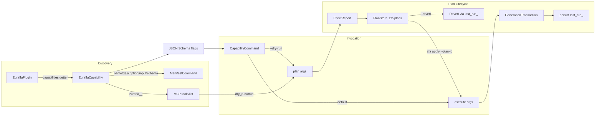

The Capability System is Zuraffa's contract layer that lets plugins expose discrete, introspectable actions — "create a UseCase", "register a class in DI", "scaffold a feature" — to both the CLI and AI agents via MCP. Plan Preview is the complementary safety mechanism: every capability can answer *"what will this do?"* before doing it, producing a machine-readable `EffectReport` that can be saved, inspected, applied later, or reverted. This page covers the capability contract, how capabilities surface as CLI subcommands and MCP tools, the two distinct preview levels (`--dry-run` vs `--plan`), and the plan store lifecycle that connects them. It is the natural continuation of [Building Custom Plugins](22-building-custom-plugins) and the prerequisite for understanding [MCP Server & AI Agent Workflows](24-mcp-server-and-ai-agent-workflows).

## Architecture: the capability lifecycle

A capability is a strict interface (`ZuraffaCapability`) implemented by a plugin and exposed through three channels simultaneously: the CLI command tree, the `zfa manifest` endpoint, and MCP tool discovery. Regardless of the entry channel, every invocation funnels through the same two-phase contract — `plan(args)` for preview, `execute(args)` for mutation — with `EffectReport`s persisted by the `PlanStore` and consumable by `zfa apply` and `--revert`.



The pipeline-level preview (`zfa make --plan`) is architecturally separate: `PlanResolver` resolves the plugin selection *before* any capability runs, producing a `GenerationPlan` that shows which plugins will execute, in what order, with what warnings. Capability-level preview answers "which files will change"; pipeline-level preview answers "which generators will run and why". [lib/src/core/plugin_system/capability.dart](lib/src/core/plugin_system/capability.dart#L108-L127), [lib/src/core/planning/generation_plan.dart](lib/src/core/planning/generation_plan.dart#L3-L35)

## The capability contract

The core abstraction is deliberately minimal — five members define everything the Kernel needs to "interview" a plugin before committing to work. `inputSchema` and `outputSchema` are JSON Schema documents that drive CLI flag generation, MCP tool definitions, argument validation, and AI-agent tool descriptions simultaneously.

| Member | Purpose | Evidence |
|---|---|---|
| `name` | Unique action name; becomes the CLI subcommand verb | [capability.dart](lib/src/core/plugin_system/capability.dart#L110-L111) |
| `description` | Precise prompt/description for AI agents and CLI help | [capability.dart](lib/src/core/plugin_system/capability.dart#L113-L114) |
| `inputSchema` | JSON Schema for arguments; drives flag generation & MCP tool schema | [capability.dart](lib/src/core/plugin_system/capability.dart#L116-L117) |
| `plan(args)` | Returns an `EffectReport` — the preview, without side effects | [capability.dart](lib/src/core/plugin_system/capability.dart#L122-L123) |
| `execute(args)` | Performs the action and returns an `ExecutionResult` | [capability.dart](lib/src/core/plugin_system/capability.dart#L125-L126) |

Three supporting value types round out the contract. `Effect` models a single file change with `file`, `action` (`create`, `modify`, `delete`, `skip`), an optional `diff`, and `previousContent` for updates/deletes — the latter is what makes revert possible. `EffectReport` bundles a unique `planId`, the originating `pluginId`/`capabilityName`, the frozen `args`, the ordered `changes` list, and an `isValid`/`message` validity pair. `ExecutionResult` carries `success`, the touched `files`, and an optional `data` map (capabilities attach `generatedFiles` here, which the command layer renders as ✨/📝/🗑 output). All three serialize to JSON, making the entire contract wire-friendly for CLI piping and MCP. [capability.dart](lib/src/core/plugin_system/capability.dart#L6-L106)

Plugins expose capabilities through a simple getter defaulting to an empty list — declaring `capabilities` is optional and additive. The registry then treats capabilities as first-class citizens: every `CliAwarePlugin` command created via `PluginCommand` auto-registers each capability as a subcommand in its constructor. [plugin_interface.dart](lib/src/core/plugin_system/plugin_interface.dart#L34-L35), [base_plugin_command.dart](lib/src/commands/base_plugin_command.dart#L46-L50)

## Schema-driven CLI exposure

`CapabilityCommand` is the bridge between the JSON Schema contract and the `args` command-line framework. Its constructor walks `inputSchema['properties']` and synthesizes arg-parser options by type: booleans become negatable flags, arrays become multi-options, strings become options, and `enum` lists become `allowed` value constraints. Key names are converted from camelCase to kebab-case (`useMock` → `--use-mock`), and the same schema is re-walked in `run()` to map parsed CLI values back into camelCase args — with CLI flags taking precedence over a `--json` payload, and positional rest arguments binding in order to the schema's `required` fields. [capability_command.dart](lib/src/commands/capability_command.dart#L26-L70), [capability_command.dart](lib/src/commands/capability_command.dart#L96-L180)

```bash
# Schema: { "name": {"type":"string"}, "type": {"enum":[...], "default":"future"}, "methods": {"type":"array"} }
zfa usecase create Login --type=stream --methods=get,watch --json '{"repo":"AuthRepository"}'
```

The naming rule is "the verb": `CreateUseCaseCapability` declares `name => 'create'` so it nests under the `usecase` plugin command as `zfa usecase create`. This verb-first convention is what produces the `zfa feature scaffold`, `zfa di register`, and `zfa mock json` family of commands. Subcommand names containing underscores take the first segment; otherwise the full name is used. [capability_command.dart](lib/src/commands/capability_command.dart#L73-L90), [create_usecase_capability.dart](lib/src/plugins/usecase/capabilities/create_usecase_capability.dart#L11-L17)

Every capability also carries `dryRun`, `force`, and `verbose` in its own input schema — a convention, not a framework requirement, that keeps preview behavior uniform across plugins. The `--dry-run` flag on `CapabilityCommand` is the framework-level trigger that selects `plan()` over `execute()`; the per-schema `dryRun` property additionally lets the same capability be invoked in preview mode through JSON or MCP without the CLI flag. [create_usecase_capability.dart](lib/src/plugins/usecase/capabilities/create_usecase_capability.dart#L50-L64), [create_datasource_capability.dart](lib/src/plugins/datasource/capabilities/create_datasource_capability.dart#L33-L37)

## Manifest and the MCP bridge

`zfa manifest` is the capability discovery endpoint. In its default `--format=json` it dumps every plugin's capabilities with full input/output schemas; in `--format=mcp` it emits the same data as an MCP `tools` array, namespaced as `zfa_<plugin>_<capability>`. Because the MCP server and the manifest share the same `PluginRegistry` singleton, the tool surface is always in sync with the CLI command surface. [manifest_command.dart](lib/src/commands/manifest_command.dart#L28-L61)

The MCP server builds its tool list by iterating `PluginRegistry.instance.plugins` and adding one tool per capability, converting `inputSchema` directly into MCP's `inputSchema` — no translation layer. At call time, `_runPluginTool` matches `zuraffa_<plugin>_<capability>` and invokes `capability.execute(args)` in-process, formatting the returned files and data as a text result. For the make-level workflow the server instead spawns the CLI with `dry_run=true` mapped to `--dry-run` and always appends `--format=json` for parseable output. [zuraffa_mcp_server.dart](bin/zuraffa_mcp_server.dart#L261-L280), [zuraffa_mcp_server.dart](bin/zuraffa_mcp_server.dart#L1784-L1811), [zuraffa_mcp_server.dart](bin/zuraffa_mcp_server.dart#L1151-L1174)

## Plan preview: two levels

Zuraffa offers two deliberately different preview mechanisms. Confusing them is the most common integration mistake, so the distinction matters:

| Dimension | Capability-level preview | Pipeline-level preview |
|---|---|---|
| Trigger | `zfa <plugin> <cap> --dry-run` / `dryRun: true` | `zfa make <Name> ... --plan` / `--explain` |
| Produces | `EffectReport` (concrete file effects) | `GenerationPlan` (plugin selection & order) |
| Answers | "Which files will change?" | "Which generators run, in what order, why?" |
| Side effects | None (generation runs with `dryRun: true`) | None (resolution is pure computation) |
| Persisted | Yes — saved to `PlanStore`, applicable via `zfa apply` | No — printed and discarded |
| JSON output | `jsonEncode(report.toJson())` | `--format=json` wraps `plan.toJson()` |
| Serialization | [capability_command.dart](lib/src/commands/capability_command.dart#L186-L192) | [make_command.dart](lib/src/commands/make_command.dart#L407-L425) |

**Capability-level.** The implementation pattern is uniform across all plugins: `plan(args)` calls the same private `_generateFiles(args, dryRun: true)` used by `execute()`, but with the write path suppressed. Because preview and execution share one code path, the preview is authoritative — it cannot drift from what execution will do. The resulting `EffectReport` is JSON-printed and persisted under a timestamped `plan_<epoch>` id. [create_usecase_capability.dart](lib/src/plugins/usecase/capabilities/create_usecase_capability.dart#L81-L93), [json_mock_capability.dart](lib/src/plugins/mock/capabilities/json_mock_capability.dart#L61-L73)

**Pipeline-level.** `zfa make --plan` short-circuits after `PlanResolver.resolve()`, printing the preset, requested plugin ids, resolved plugin ids (dependency-sorted execution order), and any warnings about unknown presets or plugins. `--explain` shares the same code path; the two flags exist so agents can distinguish "show me the plan" from "explain the plan". With `--format=json` the output becomes `{"success": true, "plan": {...}}` — the canonical machine-readable contract used by the MCP server. [make_command.dart](lib/src/commands/make_command.dart#L107-L116), [make_command.dart](lib/src/commands/make_command.dart#L316-L326)

`PlanResolver` assembles the plan from five ordered sources: the `--preset` expansion (via `PresetRegistry`), explicit positional plugin ids, `--with` aliases (via `PluginAliasResolver`, e.g. `data` → repository+datasource, `vpc` → view+presenter+controller), implicit selection from semantic flags (e.g. `--vpc` selects four plugins, `--data` selects repository+datasource), and config-driven defaults from `.zfa.json`. Exclusions (`--without`, `--no-<plugin>`, disabled plugins) are filtered after expansion; unknown ids degrade to warnings rather than hard errors, keeping the plan resilient. Final ordering is delegated to `PluginRegistry.sortPlugins`, which topologically sorts by `dependsOn`/`runAfter` and throws on circular dependencies. [plan_resolver.dart](lib/src/core/planning/plan_resolver.dart#L18-L102), [preset_registry.dart](lib/src/core/planning/preset_registry.dart#L1-L51), [plugin_alias_resolver.dart](lib/src/core/planning/plugin_alias_resolver.dart#L1-L44), [plugin_registry.dart](lib/src/core/plugin_system/plugin_registry.dart#L18-L51)

## Plan store: persistence, apply, and revert

The `PlanStore` is a singleton managing `.zfa/plans/<planId>.json` (with read-fallback to the legacy `.zuraffa/plans/` location for migration). `savePlan` persists the full `EffectReport` JSON; `loadPlan` hydrates it back into value types including `previousContent`; `deletePlan` cleans up both current and legacy locations. [plan_store.dart](lib/src/core/plugin_system/plan_store.dart#L27-L73), [project_paths.dart](lib/src/core/project/project_paths.dart#L21-L25)

```json
{
  "plan_id": "plan_1773207137676",
  "plugin_id": "usecase",
  "capability_name": "create",
  "args": {"name": "Login", "type": "stream"},
  "valid": true,
  "changes": [
    {"file": "lib/src/domain/usecases/login/login_usecase.dart", "action": "create"}
  ]
}
```

`zfa apply --plan-id <id>` is the deferred-execution path: it loads the plan, validates it, resolves the originating plugin from the registry and the capability by name, re-executes with the frozen args, and deletes the plan on success. This enables the "preview in an agent, approve, execute later" loop that the MCP server's `dry_run=true` tip advertises. [apply_command.dart](lib/src/commands/apply_command.dart#L23-L66)

Beyond ad-hoc capability plans, `PluginManager` persists a canonical `last_run_<Name>` plan after every successful `make` execution — with `pluginId: "manager"`, `capabilityName: "make"`, and `changes` derived from the actual `GenerationTransaction` operations, including `previousContent` for every overwrite. This record is what makes `--revert` trustworthy: `_handleRevert` loads `last_run_<Name>`, walks the changes in reverse, deletes created files, and restores `previousContent` for overwritten ones — all through the transactional file system so dry-run reverts preview correctly too. A real-world example is `example/.zuraffa/plans/last_run_Concert.json`, which captured a 20-file CRUD generation with full previous contents for revert fidelity. [plugin_manager.dart](lib/src/core/plugin_system/plugin_manager.dart#L411-L463), [plugin_manager.dart](lib/src/core/plugin_system/plugin_manager.dart#L241-L308), [example/.zuraffa/plans/last_run_Concert.json](example/.zuraffa/plans/last_run_Concert.json)

## Writing capabilities that preview well

The contract makes preview correctness a structural guarantee, but three practices separate production-grade capabilities from toy ones. First, **share the generation path**: implement one private `_generateFiles(args, {required bool dryRun})` and have both `plan()` (always `dryRun: true`) and `execute()` (delegating to the schema's `dryRun`) call it — the `ScaffoldFeatureCapability` goes further and routes through `PluginManager` itself, so its preview reflects the full plan resolution. Second, **declare `dryRun`, `force`, `verbose` in `inputSchema`** so every entry channel (CLI flags, `--json`, MCP) can preview uniformly. Third, **capture `previousContent` for modifies** — `RegisterCapability` uses the same `_runRegistration(args, dryRun: true)` path for planning and records the content snapshot, which is the difference between a reversible plan and a destructive one. [scaffold_feature_capability.dart](lib/src/plugins/feature/capabilities/scaffold_feature_capability.dart#L141-L199), [register_capability.dart](lib/src/plugins/di/capabilities/register_capability.dart#L64-L88)

The capability command test suite pins the schema-to-args contract: hyphenated flags must round-trip into camelCase args (`--use-mock` → `useMock: true`), and positional values must bind to required schema fields — regressions here break every CLI-driven capability at once. [capability_command_test.dart](test/commands/capability_command_test.dart#L44-L56)

## Next steps

The capability surface you expose is exactly what AI agents see. Continue with [MCP Server & AI Agent Workflows](24-mcp-server-and-ai-agent-workflows) to see how `zfa manifest --format=mcp` and the `zuraffa_<plugin>_<capability>` tools become agent-callable actions, then [Project Memory & Configuration](25-project-memory-and-configuration) to understand how `.zfa.json` defaults feed `PlanResolver`. If you are authoring plugins, [Building Custom Plugins](22-building-custom-plugins) documents the `ZuraffaPlugin` base you will extend, and [Transactional File System, Revert & Plan Store](9-transactional-file-system-revert-and-plan-store) covers the write path your `execute()` lands in.