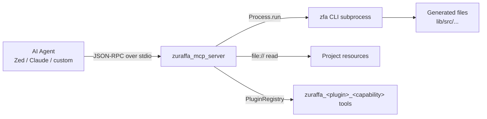
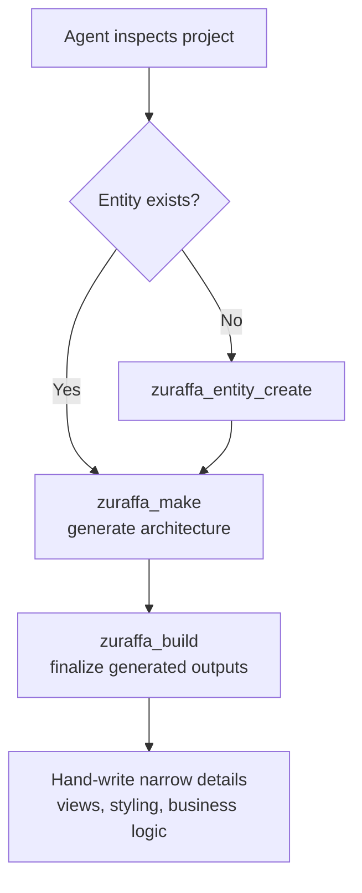

Zuraffa's MCP server exists for one reason: to let AI agents drive the exact same canonical v5 pipeline that humans drive from the terminal, but with structured tool inputs instead of free-form shell commands. The server implements the Model Context Protocol (JSON-RPC 2.0 over stdio) in `bin/zuraffa_mcp_server.dart`, exposing generation, entity, configuration, GraphQL, and diagnostics capabilities as discoverable MCP tools. It never imports the zfa CLI code directly — it spawns CLI subprocesses, which keeps the server lightweight and avoids slow JIT warmup on every agent call. The complementary layer is the agent-side contract: `AGENTS.md`, `doc/MCP_SERVER.md`, and the spec-kit skills in `.agents/skills/` that tell an agent *when* to call which tool and *how* to reason about project state. Sources: [zuraffa_mcp_server.dart](bin/zuraffa_mcp_server.dart#L55-L67), [integrations.md](openwiki/integrations.md#L5-L11)

## Architecture: the stdio JSON-RPC bridge

The MCP server is a long-lived process that reads newline-delimited JSON-RPC messages from stdin and writes responses to stdout. The transport is deliberately minimal: no sockets, no HTTP — just a line protocol that any MCP client (Zed, Claude, custom agent harnesses) can speak. The `run()` method disables echo, builds a `LineSplitter` stream over the UTF-8 decoded stdin, and starts processing messages *immediately* before any delays, a design choice made specifically so early messages from fast-starting editors like Zed are never missed. A never-completing `Completer` keeps the process alive even if stdin closes.



Each incoming line is decoded and dispatched through `handleRequest`, which routes `initialize`, `tools/list`, `tools/call`, `resources/list`, `resources/read`, `shutdown`, and `ping` to dedicated handlers. Messages are processed sequentially with `await for` — a deliberate concurrency choice that prevents interleaved writes to stdout, since every tool call ultimately blocks on a CLI subprocess. Notifications (requests with `id == null`) receive no response, per the JSON-RPC spec. The server also maintains a lazy singleton (`SharedResources`) and initializes the plugin registry only on first contact, so a bare `ping` never pays the cost of loading all 20+ generator plugins. Sources: [zuraffa_mcp_server.dart](bin/zuraffa_mcp_server.dart#L109-L142), [zuraffa_mcp_server.dart](bin/zuraffa_mcp_server.dart#L144-L182), [zuraffa_mcp_server.dart](bin/zuraffa_mcp_server.dart#L184-L223)

## The JSON-RPC surface: methods and lifecycle

The server advertises itself through the standard MCP `initialize` handshake, declaring protocol version `2024-11-05`, tool-change notifications, and resource subscription/change support. This handshake is what lets an MCP client populate its tool palette automatically — the agent never needs a hard-coded list of zfa commands.

| Method | Purpose | Response shape |
|---|---|---|
| `initialize` | Protocol handshake; reports server name `zfa-mcp-server` and version | `protocolVersion`, `capabilities`, `serverInfo` |
| `tools/list` | Enumerate all built-in + plugin tools with JSON Schema inputs | `tools[]` |
| `tools/call` | Execute a named tool with `arguments` | `content[]` text result, or `isError` |
| `resources/list` | Scan project layers for readable Dart files | `resources[]` (cached 10 min, max 100) |
| `resources/read` | Read a file by `file://` URI | `contents[]` with `text/dart` MIME |
| `ping` | Liveness check | `{"pong": true}` |
| `shutdown` | Graceful termination | empty result |

Unknown methods return a `-32601` error; runtime failures inside tool execution are wrapped as `isError: true` results carrying the stack trace, so the agent sees a structured failure rather than a crashed transport. Sources: [zuraffa_mcp_server.dart](bin/zuraffa_mcp_server.dart#L226-L240), [zuraffa_mcp_server.dart](bin/zuraffa_mcp_server.dart#L647-L671)

## The tool catalog: 14 built-ins plus one tool per capability

`tools/list` returns 14 hand-written tool definitions, then appends a dynamic tool for every capability of every registered plugin using the namespaced convention `zuraffa_<plugin_id>_<capability_name>`. The capability's `inputSchema` (a JSON Schema document) is passed through *unchanged* as the MCP tool's `inputSchema` — there is no translation layer, which means a capability author who writes a good schema automatically gets a well-typed MCP tool. This same schema drives the CLI flag generation via `CapabilityCommand` and the `zfa manifest` discovery endpoint, so one schema serves all three channels. Sources: [zuraffa_mcp_server.dart](bin/zuraffa_mcp_server.dart#L242-L287), [manifest_command.dart](lib/src/commands/manifest_command.dart#L28-L61)

### Built-in tools

| MCP Tool | Underlying CLI | Purpose |
|---|---|---|
| `zuraffa_make` | `zfa make` | Canonical v5 architecture generation (the primary agent tool) |
| `zuraffa_entity_create` | `zfa entity create` | Create a Zorphy entity under `lib/src/domain/entities` |
| `zuraffa_entity_enum` | `zfa entity enum` | Create an enum in the entities directory |
| `zuraffa_entity_add_field` | `zfa entity add-field` | Add field(s) to an existing entity |
| `zuraffa_entity_from_json` | `zfa entity create --from-json` | Generate entity/ies from a JSON file |
| `zuraffa_entity_list` | `zfa entity list` | List existing entities and enums |
| `zuraffa_build` | `zfa build` | Run build_runner with `--delete-conflicting-outputs` |
| `zuraffa_config_init` | `zfa config init` | Create `.zfa.json` with defaults |
| `zuraffa_config_show` | `zfa config show` | Show active `.zfa.json` settings |
| `zuraffa_config_set` | `zfa config set` | Toggle a supported config key (schema-enumerated) |
| `zuraffa_schema` | `zfa schema` | Fetch the ZFA config validation schema |
| `zuraffa_validate` | `zfa validate` | Validate a config object against the schema |
| `zuraffa_graphql` | `zfa graphql` | Introspect a GraphQL endpoint and generate entities/usecases |
| `zuraffa_doctor` | `zfa doctor` | Toolchain diagnostics (`quick` or `full` mode) |

Note the prefix asymmetry between the two discovery surfaces: `zfa manifest --format=mcp` emits `zfa_<plugin>_<capability>` while the MCP server emits `zuraffa_<plugin>_<capability>` — only the latter is directly callable by agents. Sources: [integrations.md](openwiki/integrations.md#L27-L44), [manifest_command.dart](lib/src/commands/manifest_command.dart#L32-L44)

### `zuraffa_make` — the canonical agent tool

`zuraffa_make` carries the most elaborate tool description in the server, and for good reason: it encodes the v5 contract directly into the prompt. The description warns agents that `name` is the **entity name, not a UseCase name**, enumerates the five auto-generated UseCases for a typical entity (`GetCategory`, `GetCategoryList`, `CreateCategory`, `UpdateCategory`, `DeleteCategory`), and lists common invocation patterns such as full-feature (`methods=["get","getList","create","update","delete"], vpc=true, state=true, data=true`), domain-only, and caching variants. Its input schema is a mirror of `zfa make`'s flag surface — methods, preset, vpc/state/data flags, id/query field configuration, custom UseCase composition (`repo`, `service`, `usecases`, `variants`), cache policy (`daily`/`restart`/`ttl`) and storage, mock/DI toggles, and the universal `dry_run`/`force`/`verbose` trio. Every argument is validated by the JSON Schema before the server ever spawns a process, so malformed agent calls fail fast with a schema error instead of a cryptic CLI trace. Sources: [zuraffa_mcp_server.dart](bin/zuraffa_mcp_server.dart#L289-L318), [zuraffa_mcp_server.dart](bin/zuraffa_mcp_server.dart#L319-L545)

At call time, `_callTool` translates the JSON arguments into CLI flags — arrays become comma-joined `--methods=...` options, booleans become presence flags or their `--no-` negations, and custom UseCase fields map to their positional/flag equivalents. The make path always appends `--format=json` so downstream parsing is deterministic. Plugin-backed tools funnel through `_runPluginTool`, which matches the `zuraffa_<plugin>_<capability>` name against the live registry and invokes `capability.execute(args)` directly in-process — the one path that does *not* spawn a subprocess, because the plugin is already loaded in the server's own registry. Sources: [zuraffa_mcp_server.dart](bin/zuraffa_mcp_server.dart#L1093-L1175), [zuraffa_mcp_server.dart](bin/zuraffa_mcp_server.dart#L1784-L1811)

## CLI resolution: the six-rung preference ladder

Because the server spawns the CLI rather than importing it, it must decide *how* to invoke `zfa` on every tool call. `_resolveCli` implements a six-rung preference ladder, and caches the resolved invocation in `_cachedCli` so the probe cost is paid once per server lifetime:

| Priority | Resolution strategy | Scenario |
|---|---|---|
| 1 | Compiled binary next to the MCP server (`zfa`, `zuraffa`, or `zfa-*` platform names) | Zed extension bundling |
| 2 | Compiled binary in the current directory (must not be a `#!` shell script) | Local dev checkout |
| 3 | Compiled `zfa` in PATH | Global native install |
| 4 | `zfa` activation script in PATH (JIT; needs `dart` reachable) | `dart pub global activate zuraffa` |
| 5 | `dart run zuraffa:zfa` | Current project depends on zuraffa |
| 6 | `dart pub global run zuraffa:zfa` | Global activation without PATH entry |

The ladder is more than convenience: it is a correctness guarantee. The server deliberately *never* echoes the would-be command when no CLI can be found — it throws a `StateError` with an actionable install message, because "a tool that silently pretends to succeed" would corrupt the agent's mental model of what was generated. Supporting machinery includes `_findDartExecutable` (probes PATH, the Flutter SDK's bundled dart, and common SDK locations) and `_pathWithDart`, which injects dart's directory into the child's PATH so pub-global activation scripts work even when the server itself was launched without dart on PATH. Sources: [zuraffa_mcp_server.dart](bin/zuraffa_mcp_server.dart#L1361-L1414), [zuraffa_mcp_server.dart](bin/zuraffa_mcp_server.dart#L1416-L1548), [zuraffa_mcp_server.dart](bin/zuraffa_mcp_server.dart#L1550-L1617)

## MCP resources: project file access

Beyond tools, the server exposes MCP **resources** so agents can inspect the very files generation produces. `resources/list` scans five canonical v5 directories — `lib/src/domain/repositories`, `lib/src/domain/usecases`, `lib/src/data/datasources`, `lib/src/data/repositories`, `lib/src/presentation` — plus `lib/src/domain/entities` (prefixed `entity/`), collecting single-level Dart files as `file://` URIs. Two hard limits protect the transport: a 10-minute result cache (`_resourcesCache`) and a 100-file cap (`_maxFiles`). Directory scans carry 300 ms per-directory timeouts and a 30-second overall budget that returns partial results rather than failing, so a slow or huge project degrades gracefully instead of stalling the agent. `resources/read` strips the `file://` scheme and returns file contents with `text/dart` MIME, giving the agent a read path that mirrors what it would see in an editor. Sources: [zuraffa_mcp_server.dart](bin/zuraffa_mcp_server.dart#L75-L81), [zuraffa_mcp_server.dart](bin/zuraffa_mcp_server.dart#L1633-L1674), [zuraffa_mcp_server.dart](bin/zuraffa_mcp_server.dart#L1709-L1782)

## The agent contract: driving the canonical v5 workflow

The MCP tool surface is only half the story; the other half is the *contract* that tells agents when to use which tool. `doc/MCP_SERVER.md` defines the canonical sequence — the same one a human follows: inspect the project, create missing entities with `zuraffa_entity_create`, generate architecture with `zuraffa_make`, finalize with `zuraffa_build`, and only then hand-write narrow implementation details. The division of responsibility is explicit: Zuraffa owns the architecture skeleton (entities, repositories, datasources, usecases, presenters, controllers, state, DI, tests), while humans and agents own view composition, styling, and business logic inside generated extension points. `AGENTS.md` hardens this into non-negotiable rules: never hand-create entities, never call `build_runner` directly (use `zuraffa_build`), prefer `zuraffa_make` over the legacy one-shot generator and over the `zfa feature` wrapper, and never invent alternate folder structures beyond the fixed `lib/src/domain` root. Sources: [MCP_SERVER.md](doc/MCP_SERVER.md#L46-L56), [MCP_SERVER.md](doc/MCP_SERVER.md#L79-L84), [AGENTS.md](AGENTS.md#L35-L41), [AGENTS.md](AGENTS.md#L114-L131)



The workflow's health signals are equally encoded: `zuraffa_doctor` (quick mode) checks Dart/Flutter versions, pubspec dependencies, global CLI availability, and `.zfa.json` presence without spawning a subprocess — a fast pre-flight for an agent deciding whether the environment is sound before committing to a generation run. Sources: [zuraffa_mcp_server.dart](bin/zuraffa_mcp_server.dart#L1246-L1359), [zuraffa_mcp_server.dart](bin/zuraffa_mcp_server.dart#L1210-L1233)

## AI agent workflows: spec-kit and the SDD lifecycle

The MCP server is the *execution* channel; the spec-kit skills in `.agents/skills/` are the *orchestration* layer. The `speckit-workflow` skill runs the full Specification-Driven Development lifecycle in Zed with no review gates: pre-flight → `/speckit-specify` → `/speckit-plan` → `/speckit-tasks` → `/speckit-implement`. Its core rule — "Never Ask, Always Search" — instructs the agent to resolve ambiguity from the codebase, OpenWiki docs, existing specs in `specs/`, and `.zfa/` memory before making a default decision, and it hard-codes the Zuraffa v5 generation contract as the implementation pathway: `zfa entity create` → `zfa make --preset=crud ... --with=vpc --state --di --test` → optional `zfa cache adapter` → `zfa build`. The skill's health baseline discipline (record pre-existing `dart analyze` errors before touching anything, retry failed steps once, then continue) mirrors the MCP server's own fail-safe philosophy: partial progress beats a stalled agent. Sources: [speckit-workflow SKILL.md](.agents/skills/speckit-workflow/SKILL.md#L10-L20), [speckit-workflow SKILL.md](.agents/skills/speckit-workflow/SKILL.md#L41-L54), [speckit-workflow SKILL.md](.agents/skills/speckit-workflow/SKILL.md#L56-L73), [speckit-workflow SKILL.md](.agents/skills/speckit-workflow/SKILL.md#L278-L306)

The remaining skills slot into the lifecycle as specialized steps: `speckit-analyze` performs non-destructive cross-artifact consistency checks across `spec.md`, `plan.md`, and `tasks.md`; `speckit-checklist`, `speckit-clarify`, and `speckit-converge` handle requirement refinement; `speckit-taskstoissues` bridges plans to issue trackers; and `speckit-agent-context-update` keeps the agent's context fresh between steps. Every skill follows the same hook protocol — reading `.specify/extensions.yml` for `before_*` hooks and invoking them as slash commands — which gives the workflow its extensibility without coupling the skills to each other. Post-implementation, the workflow runs `zfa build`, `dart analyze`, focused tests, and `/insights` + `/docs` capture, closing the loop between generated code and the knowledge base. Sources: [speckit-analyze SKILL.md](.agents/skills/speckit-analyze/SKILL.md#L1-L8), [speckit-analyze SKILL.md](.agents/skills/speckit-analyze/SKILL.md#L55-L57), [speckit-workflow SKILL.md](.agents/skills/speckit-workflow/SKILL.md#L307-L344)

## Project memory: `.zfa.json` and `.zfa/`

Agents reason about project state through two complementary surfaces, both documented as the forward v5 contract. **`.zfa.json`** holds active project defaults — plugin defaults, entity-first settings, disabled plugins — and is loaded by the server at startup via `PluginConfig.load()` when building its plugin registry, so agent-visible tools automatically respect project configuration. **`.zfa/`** is the canonical project-memory directory: `plans/` for generation plans (including `last_run_<Name>` artifacts that make revert possible), `runs/` for execution logs, `blueprints/` for architectural patterns, `decisions/` for ADRs, `manifests/` for feature manifests, and `context.json` for project state. The `context.json` format is the agent's map: project identity, the v5 contract (`entity_create_make_build`), the fixed domain and entity roots, and feature migration status. The memory guide's workflow advice is explicit — read `context.json` to understand state, update it when state changes — and the server's `zuraffa_config_show`/`zuraffa_config_set` tools give agents the read/write path to the config half of this surface. Sources: [plugin_loader.dart](lib/src/cli/plugin_loader.dart#L30-L46), [ZFA_MEMORY_GUIDE.md](doc/ZFA_MEMORY_GUIDE.md#L14-L24), [ZFA_MEMORY_GUIDE.md](doc/ZFA_MEMORY_GUIDE.md#L28-L53), [AGENTS.md](AGENTS.md#L132-L151)

```text
.zfa/
├── plans/          # Generation plans & last_run_<Name> revert points
├── runs/           # Execution logs and results
├── blueprints/     # Architectural blueprints and patterns
├── decisions/      # Architectural decision records (ADRs)
├── manifests/      # Feature manifests
└── context.json    # Project context and state
```

## Running and building the server

The server ships as a first-class executable alongside the CLI. `pubspec.yaml` declares three executables — `zuraffa`, `zfa`, and `zuraffa_mcp_server` — so `dart pub global activate zuraffa` installs the server alongside the CLI, and the server's own resolution ladder finds that global activation. The build script `scripts/build_mcp_binaries.sh` compiles the server with `dart build cli` into `build/mcp_binaries/current/bundle`; it deliberately documents that cross-compilation is unsupported with native assets, so each platform must be built on its native OS. The compiled-binary placement is what makes the Zed-extension scenario work: a binary named `zfa` (or `zfa-<platform>`) sitting next to the server is discovered first in the resolution ladder, giving in-editor agents a fast native path with no JIT startup. Sources: [pubspec.yaml](pubspec.yaml#L57-L60), [build_mcp_binaries.sh](scripts/build_mcp_binaries.sh#L1-L23)

## Next steps

The MCP tool surface is generated from the same capability schemas that drive the CLI, so a full understanding of capability semantics flows from [Capability System & Plan Preview](23-capability-system-and-plan-preview) — including how `zfa manifest --format=mcp` and the `zuraffa_<plugin>_<capability>` tools become agent-callable actions. To see the memory surfaces agents depend on, continue with [Project Memory & Configuration](25-project-memory-and-configuration). For the operational side of what agents observe, [Telemetry, Failure Reporting & Artifacts](29-telemetry-failure-reporting-and-artifacts) covers the observability hooks that make agent-driven generation auditable.