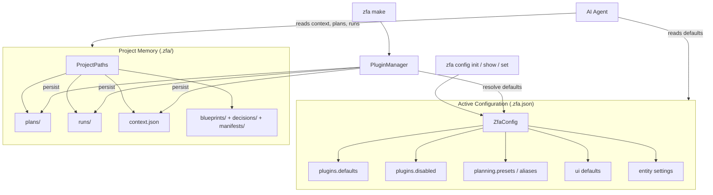

Zuraffa v5 separates *what a project should do* from *what a project has already done*. The first lives in a single JSON file at the project root — `.zfa.json` — which holds active defaults that shape every future generation run. The second lives in a directory tree — `.zfa/` — which accumulates plans, run logs, architectural decisions, and project state that let agents and humans resume work without re-deriving context from source code. This page covers both surfaces: their schemas, the code that reads and writes them, and the workflow contract they encode. The transactional mechanics of the plan store itself are covered separately in [Transactional File System, Revert & Plan Store](9-transactional-file-system-revert-and-plan-store); here the focus is the memory model and configuration surface as a whole.

## Two Surfaces, One Contract

The guiding rule, stated plainly in the CLI guide and repeated in the agent instructions, is that the two surfaces answer different questions: **`.zfa.json` tells agents the defaults; `.zfa/` tells them what has already been planned, generated, or decided.** Sources: [CLI_GUIDE.md](CLI_GUIDE.md#L259-L293), [AGENTS.md](AGENTS.md#L132-L151)

| Surface | Role | Read at | Written at | Content |
|---|---|---|---|---|
| `.zfa.json` | Active configuration | Every `zfa make`, `zfa build`, MCP server startup | `zfa config init`, `zfa config set`, `zfa plugin enable/disable` | Plugin defaults, disabled plugins, custom presets/aliases, UI defaults, entity-first flags |
| `.zfa/plans/` | Generation plans (incl. `last_run_<Name>`) | Plan application (`zfa apply`), revert (`zfa make --revert`) | After each generation run | `EffectReport` JSON: changes, actions, previous content |
| `.zfa/runs/` | Execution logs | Human/agent review of generation history | After each generation run | `RunArtifact` JSON: files, duration, options, errors |
| `.zfa/context.json` | Project state & v5 agent contract | Agent onboarding, pre-generation checks | After each generation run (auto) and manually | Domain roots, workflow, generated vs manual zones |
| `.zfa/blueprints/`, `decisions/`, `manifests/` | Human-curated knowledge | Onboarding, architectural review | Manually | ADRs, architecture patterns, feature manifests |



The two surfaces are deliberately asymmetric. Configuration is *small, typed, and machine-validated* — a handful of booleans and lists that the CLI can mutate safely. Memory is *open-ended and accumulating* — JSON artifacts that grow with every run plus Markdown files that only humans (or agents following a convention) curate. The integration test `zfa_memory_integration_test.dart` enforces the coupling: a successful `CodeGenerator.generate()` must produce a plan file under `.zfa/plans/`, at least one run artifact, and a `context.json` containing the v5 contract. Sources: [zfa_memory_integration_test.dart](test/integration/zfa_memory_integration_test.dart#L38-L70)

## The `.zfa.json` Configuration File

The single source of truth for configuration is the `ZfaConfig` class in `lib/src/config/zfa_config.dart`. It hard-codes the v5 non-negotiables — the domain root `lib/src/domain`, the entity output `lib/src/domain/entities`, and a Zorphy-only entity policy — while leaving every plugin and generation flag configurable. Sources: [zfa_config.dart](lib/src/config/zfa_config.dart#L5-L13)

A default file, as produced by `zfa config init` and shown here from the example project, has this shape:

```json
{
  "plugins": {
    "defaults": { "route": true, "di": true, "mock": true, "test": true,
                  "gql": false, "cache": false, "method_append": false },
    "disabled": ["graphql"]
  },
  "planning": { "presets": {}, "aliases": {} },
  "ui": {
    "adaptiveLayouts": false,
    "platformShells": false,
    "layoutTargets": ["mobile", "tablet", "desktop", "macos"],
    "adaptivePreset": "adaptive-feature"
  },
  "entity": { "entityFirst": true, "jsonByDefault": true,
              "compareByDefault": true, "filterByDefault": true },
  "buildByDefault": false,
  "formatByDefault": false
}
```
Sources: [example/.zfa.json](example/.zfa.json#L1-L33)

The JSON schema maps onto four sections, each parsed by `ZfaConfig.fromJson` and re-emitted by `toJson`:

| JSON section | Config fields | Purpose |
|---|---|---|
| `plugins.defaults` | `pluginDefaults` (Map of 20+ plugin IDs → bool) | Canonical generation defaults; every plugin defaults to `false` |
| `plugins.disabled` | `disabledPlugins` (Set) | Plugins excluded from the registry entirely |
| `planning.presets` / `planning.aliases` | `customPresets`, `customAliases` | Named plugin bundles resolved by `PlanResolver` |
| `ui` | `uiDefaults` | Adaptive layout flags, layout targets, adaptive preset |
| `entity` + top-level flags | `entityFirst`, `jsonByDefault`, `compareByDefault`, `filterByDefault`, `buildByDefault`, `formatByDefault` | Behavioral defaults for generation and post-processing |

Sources: [zfa_config.dart](lib/src/config/zfa_config.dart#L202-L256)

The `_builtinPluginDefaults` map anchors the schema: twenty plugin IDs (repository, provider, usecase, presenter, controller, view, feature, state, observer, test, mock, di, datasource, service, route, cache, gql, graphql, shadcn, method_append) all default to `false`, so a project only generates what it explicitly opts into — either via CLI flags, presets, or these defaults. Sources: [zfa_config.dart](lib/src/config/zfa_config.dart#L15-L35)

### Managing configuration from the CLI

The `zfa config` command family provides the read/write path to `.zfa.json` without hand-editing JSON:

| Command | Behavior |
|---|---|
| `zfa config init [root]` | Creates `.zfa.json` with defaults; refuses to overwrite an existing file |
| `zfa config show` / `get` | Prints the full config as indented JSON; hints at `zfa config init` if missing |
| `zfa config set <key> <value>` | Updates one typed key; rejects unknown keys with the valid key list |
| `zfa config help` | Prints usage, supported keys, and v5 notes |

Sources: [config_command.dart](lib/src/commands/config_command.dart#L8-L96)

`config set` accepts the four scalar keys (`buildByDefault`, `formatByDefault`, `filterByDefault`, `entityFirst`) plus a derived set of plugin keys — one per plugin, generated by `configKeyForPlugin`. Note the naming asymmetry handled explicitly by the code: the plugin key for `method_append` is `appendByDefault`, and for the two GraphQL plugins it is `gqlByDefault` / `graphqlByDefault`, not the naive `<plugin>ByDefault`. Sources: [config_command.dart](lib/src/commands/config_command.dart#L98-L150), [zfa_config.dart](lib/src/config/zfa_config.dart#L157-L177)

### Legacy key migration

Pre-v5 configs stored plugin defaults at the top level as `diByDefault`, `routeByDefault`, and so on. `fromJson` runs `_legacyPluginDefaults`, which scans every top-level JSON entry, maps it through `pluginIdForConfigKey`, and folds any boolean match into `plugins.defaults`. This means an old `.zfa.json` keeps working after upgrade — its defaults are silently normalized into the canonical location, and the next `zfa config show` reflects the migrated form. Sources: [zfa_config.dart](lib/src/config/zfa_config.dart#L296-L309)

### How configuration reaches plan resolution

`.zfa.json` is loaded once per command invocation and threaded through two independent paths. First, `MakeCommand` resolves the project root by walking upward to `pubspec.yaml`, then constructs `PluginManager` with `ZfaConfig.load(...)` and `PluginConfig.load(...)`. Second, `PlanResolver` consults the config at three distinct points during resolution: custom presets (via `PresetRegistry.hasPreset`), plugin defaults (every registered plugin whose `isPluginEnabledByDefault` is true is added to the request), and custom aliases (via `PluginAliasResolver.expandAll`). Meanwhile `PluginConfig` extracts `disabledPlugins` and hands it to `PluginLoader.buildRegistry`, which refuses to register disabled plugins at all — so a disabled plugin never even reaches plan resolution. Sources: [make_command.dart](lib/src/commands/make_command.dart#L33-L42), [plan_resolver.dart](lib/src/core/planning/plan_resolver.dart#L28-L61), [plugin_loader.dart](lib/src/cli/plugin_loader.dart#L30-L60)

## The `.zfa/` Memory Directory

The canonical v5 memory layout is defined in two places that must stay in sync: the documentation (`ZFA_MEMORY_GUIDE.md`) and the code that creates the directories (`ProjectPaths`, `ProjectContextStore.save`). The layout:

```text
.zfa/
├── plans/          # Generation plans — written by PlanStore
├── runs/           # Execution logs — written by RunStore
├── blueprints/     # Architectural blueprints and patterns (manual)
├── decisions/      # Architectural Decision Records (manual)
├── manifests/      # Feature manifests (manual)
├── context.json    # Project state & v5 agent contract
└── AGENT_CONTRACT.md  # Resolved by ProjectPaths, used by agent workflows
```
Sources: [ZFA_MEMORY_GUIDE.md](doc/ZFA_MEMORY_GUIDE.md#L5-L26), [project_paths.dart](lib/src/core/project/project_paths.dart#L6-L35), [project_context_store.dart](lib/src/core/project/project_context_store.dart#L13-L37)

Each store is a small, single-purpose class with a clear writer and reader:

| Store | Class | Writes | Reads | File naming |
|---|---|---|---|---|
| Plans | `PlanStore` (singleton) | `savePlan(EffectReport)` | `loadPlan(planId)` for `zfa apply` and `--revert` | `{planId}.json` |
| Runs | `RunStore` (per project) | `save(RunArtifact)` | `list()`, `loadLatest(name)` | `{ISO timestamp}_{name}.json` |
| Context | `ProjectContextStore` (per project) | `save(Map)` | `load()` | `context.json` |

Sources: [plan_store.dart](lib/src/core/plugin_system/plan_store.dart#L8-L75), [run_store.dart](lib/src/core/project/run_store.dart#L7-L59), [project_context_store.dart](lib/src/core/project/project_context_store.dart#L13-L57)

### Plans: the durable record for apply and revert

`PlanStore` persists an `EffectReport` — the same value object that backs the transaction layer — so a plan outlives the process that created it. Two details matter for day-to-day use. First, the plan ID used by `zfa make` is `last_run_<EntityName>`, which is what makes `zfa make <Name> --revert` work: `PluginManager._handleRevert` loads `last_run_<Name>`, walks the recorded changes in reverse (deleting created files, restoring `previousContent` for overwritten ones), then deletes the plan. Second, `PlanStore` reads from the canonical `.zfa/plans/` location but falls back to the legacy `.zuraffa/plans/` path when loading — a compatibility bridge for projects that generated under the older layout. Sources: [plan_store.dart](lib/src/core/plugin_system/plan_store.dart#L19-L33), [plugin_manager.dart](lib/src/core/plugin_system/plugin_manager.dart#L243-L306), [project_paths.dart](lib/src/core/project/project_paths.dart#L24-L26)

### Runs: execution history

`RunStore` records every completed generation as a `RunArtifact` — entity name, timestamp, duration, success flag, the full list of generated files, plus any errors, warnings, and the normalized options that drove the run. The timestamp-based filename keeps history append-only and sorted, so `loadLatest(name)` can answer "what happened the last time we generated this entity?" without scanning the whole tree. Sources: [run_store.dart](lib/src/core/project/run_store.dart#L61-L120)

### Context: the project state snapshot

`ProjectContextStore` is the bridge between machine-generated history and human/agent orientation. Its `save` method is deliberately defensive: it creates `.zfa/` and all five subdirectories if they are missing, then writes `context.json` with two-space indentation. Its `load` returns `null` when the file is absent and swallows corrupt JSON rather than crashing a generation run. Sources: [project_context_store.dart](lib/src/core/project/project_context_store.dart#L13-L57)

## How a Generation Run Writes Memory

Memory persistence is not a separate step — it is the final phase of every successful plugin-managed run, executed by `PluginManager._persistProjectMemory` after the transaction commits:

```mermaid
sequenceDiagram
    participant CLI as zfa make
    participant PM as PluginManager
    participant TX as GenerationTransaction
    participant PS as PlanStore
    participant RS as RunStore
    participant CS as ProjectContextStore

    CLI->>PM: run(context)
    PM->>TX: execute plugins
    TX-->>PM: allFiles + operations
    PM->>PS: savePlan(last_run_<Name>, EffectReport)
    PM->>RS: save(RunArtifact)
    PM->>CS: save(defaultContext())
    Note over PM,CS: planId = last_run_<Name>; args normalized<br/>to project-relative paths
```

The method builds the `EffectReport` from the transaction's operations, normalizes every absolute path to project-relative form (so plans are portable across machines and checkouts), attaches the sorted plugin list and execution order as `args`, then writes all three artifact types: the plan, the run log, and the default context. Sources: [plugin_manager.dart](lib/src/core/plugin_system/plugin_manager.dart#L423-L475)

This three-write transaction explains the memory model's resilience: even if the context file is later hand-edited or the runs directory archived, the plan alone carries enough information (files, actions, previous content) to revert the entire generation. The integration test locks this behavior in — it asserts the plan file exists, the run list is non-empty with files, and the context carries the v5 contract fields. Sources: [zfa_memory_integration_test.dart](test/integration/zfa_memory_integration_test.dart#L38-L70)

## The v5 Agent Contract in `context.json`

`ProjectContextStore.defaultContext()` defines what a fresh project context looks like — and that shape *is* the agent contract. It records the contract version (`5.1`), the fixed domain and entity roots, the `zorphy_only: true` invariant, and the canonical three-step workflow: `zfa entity create` → `zfa make` → `zfa build`. Sources: [project_context_store.dart](lib/src/core/project/project_context_store.dart#L59-L97)

The most operationally valuable part is the explicit zoning of generated versus manual territory:

| Zone | Paths | Owner |
|---|---|---|
| Generated | `lib/src/domain/entities`, `usecases`, `data/repositories`, `data/datasources`, `data/providers`, `data/services`, `presentation/controllers`, `presentation/presenters`, `presentation/state`, `lib/src/di` | Zuraffa (regenerable) |
| Manual | `lib/src/presentation/pages/**/layouts`, `**/widgets`, `lib/src/presentation/shells`, `lib/src/app` | Developer (handcrafted) |

Sources: [project_context_store.dart](lib/src/core/project/project_context_store.dart#L70-L90)

This zoning is echoed in the agent instructions: `AGENTS.md` tells agents to treat `.zfa.json` as the defaults surface and `.zfa/` as the memory surface, and to handcraft only view composition, page layouts, styling, and feature-specific business logic inside generated extension points. The `speckit-agent-context-update` skill operationalizes the same idea at the tooling level: it maintains a managed block inside `CLAUDE.md` or `AGENTS.md` (delimited by `<!-- SPECKIT START -->` / `<!-- SPECKIT END -->`) that points the agent at the most recent `specs/<feature>/plan.md`, keeping the agent's instruction file as fresh as the project's own memory. Sources: [AGENTS.md](AGENTS.md#L100-L151), [speckit-agent-context-update SKILL.md](.agents/skills/speckit-agent-context-update/SKILL.md#L1-L31)

## Memory Lifecycle: Before, During, After

The memory guide prescribes a discipline that maps cleanly onto the code paths above:

- **Before working**: read `context.json` for state, `decisions/` for constraints, `blueprints/` for patterns, and `runs/` for recent history.
- **During generation**: preview with `zfa make --plan` (writes a plan for review), then execute — after which `_persistProjectMemory` automatically records plan, run, and context.
- **After working**: update `context.json` if state changed, write ADRs to `decisions/` for significant choices, and evolve `blueprints/` when patterns change.

Sources: [ZFA_MEMORY_GUIDE.md](doc/ZFA_MEMORY_GUIDE.md#L166-L250)

The automation boundary is honest about what is and is not automatic today: plan writing, run logging, and context refresh happen automatically on every run; blueprints, decisions, and manifests remain intentionally manual because they encode judgment, not facts. The guide's best-practice section reinforces this — keep ADRs focused on *why*, archive old plans and runs periodically, and mark superseded decisions rather than deleting them. Sources: [ZFA_MEMORY_GUIDE.md](doc/ZFA_MEMORY_GUIDE.md#L206-L250)

For the MCP server, configuration is loaded once at startup via `PluginConfig.load()` (which itself reads `.zfa.json`), and the `zuraffa_config_show` / `zuraffa_config_set` tools give agents a schema-enumerated read/write path to the same file the CLI mutates — the agent-facing surface is covered in detail in [MCP Server & AI Agent Workflows](24-mcp-server-and-ai-agent-workflows). One related operational note: the MCP server also applies a singleton resource pattern (`SharedResources`) so that multiple IDE connections share plugin registry, caching, and initialization state instead of duplicating ~30MB per connection — documented in `MEMORY_OPTIMIZATION.md` and benchmarked in [Performance & Memory Benchmarks](28-performance-and-memory-benchmarks). Sources: [plugin_loader.dart](lib/src/cli/plugin_loader.dart#L30-L46), [MEMORY_OPTIMIZATION.md](doc/MEMORY_OPTIMIZATION.md#L1-L111)

## Migration from Legacy Paths and Keys

Two compatibility mechanisms smooth the transition from pre-v5 layouts. On the **storage side**, `ProjectPaths.legacyPlanFile` maps plan IDs into `.zuraffa/plans/`, and `PlanStore.loadPlan` checks the canonical path first and the legacy path second — so `zfa apply` and `--revert` keep working against plans written by older versions. The public documentation contract, however, is unambiguous: `.zfa/` is the forward surface, and `.zuraffa/` is transitional. On the **config side**, `_legacyPluginDefaults` normalizes top-level `*ByDefault` keys into `plugins.defaults` during load, so no manual key migration is required. The migration checklist in the memory guide completes the picture: create the `.zfa/` tree, write an initial `context.json`, document existing architecture in blueprints, record key decisions as ADRs, then generate forward with `zfa make`. Sources: [project_paths.dart](lib/src/core/project/project_paths.dart#L24-L26), [plan_store.dart](lib/src/core/plugin_system/plan_store.dart#L24-L33), [zfa_config.dart](lib/src/config/zfa_config.dart#L296-L309), [ZFA_MEMORY_GUIDE.md](doc/ZFA_MEMORY_GUIDE.md#L251-L271)

## Where to Go Next

Configuration resolution is the mechanism behind [Presets, Aliases & Plan Resolution](8-presets-aliases-and-plan-resolution), and the plan artifacts described here are the input to [Transactional File System, Revert & Plan Store](9-transactional-file-system-revert-and-plan-store). The MCP server's `config_*` tools and resource surface extend this model for agents in [MCP Server & AI Agent Workflows](24-mcp-server-and-ai-agent-workflows). For the operational side of a project — CI, debugging, and migration — see [Migrating from v4 to v5](30-migrating-from-v4-to-v5) and the operations documentation in [Operations](operations).