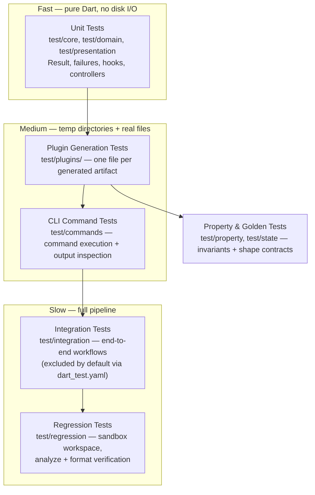
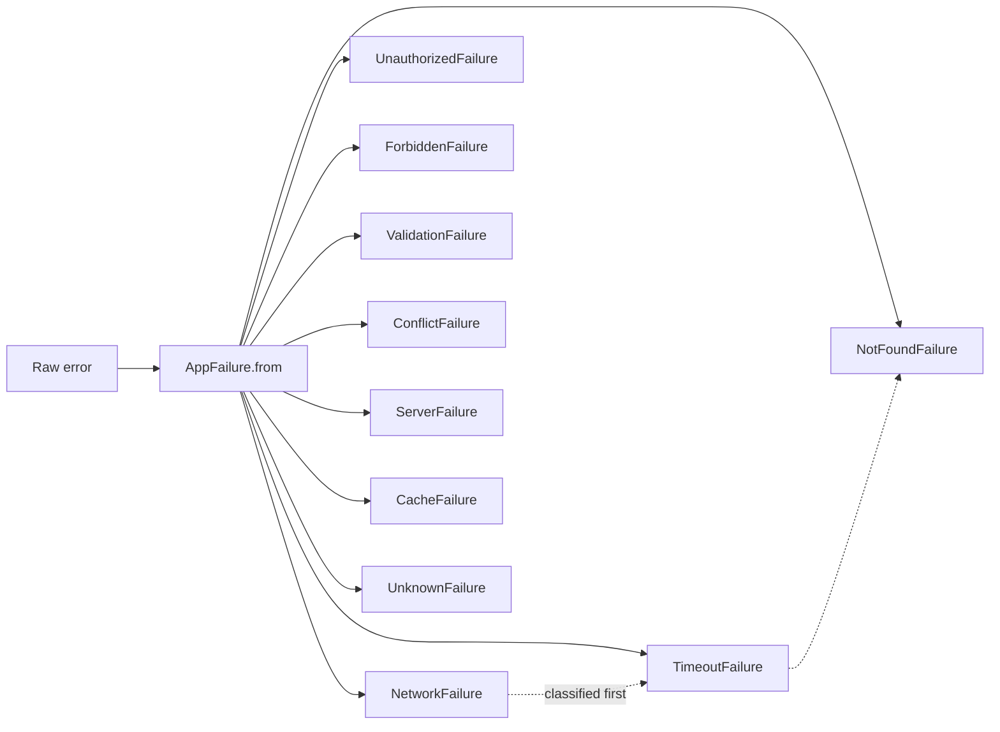

Zuraffa ships a layered testing strategy built around its functional `Result<S, F>` core. This page explains how the framework's own test suite is organized, how the custom Result matchers in `test/test_matchers.dart` help you assert success/failure outcomes with readable failures, and how the `test` plugin generates ready-to-run use case tests for your own projects. If you are testing generated code in your application, this is the page that ties the `Result` pattern from [UseCase Hierarchy & the Result Pattern](10-usecase-hierarchy-and-the-result-pattern) to concrete assertion techniques.

## The Testing Pyramid: Five Layers of Defense

Zuraffa's own suite (141 test files at the time of writing) follows a pyramid that maps directly to the repository layout under `test/`. Each layer answers a different question, and each has its own sandboxing rules.



The layers are distinguished by their interaction with the file system. Pure unit tests never touch disk; every generation test creates a real sandbox under `Directory.systemTemp.createTemp()` and cleans it up in `tearDown`; regression tests go one step further and run `dart analyze` and `dart format` against the generated output. The `dart_test.yaml` configuration excludes the `integration` tag so the default `flutter test` run stays fast, while CI explicitly runs the full suite with coverage.

Sources: [openwiki/testing.md](openwiki/testing.md#L3-L64), [dart_test.yaml](dart_test.yaml#L1), [regression_test_utils.dart](test/regression/regression_test_utils.dart#L15-L25), [output_quality_test.dart](test/regression/output_quality_test.dart#L5-L44)

## The Result Type Under Test

Every functional operation in the framework funnels through the sealed `Result<S, F>` type. Its contract — and therefore its test surface — splits into four groups.

| API group | Members | Behavior verified in `result_test.dart` |
|---|---|---|
| State predicates | `isSuccess`, `isFailure` | Mutual exclusivity for both `Success` and `Failure` |
| Transformation | `map`, `mapFailure`, `flatMap` | Success applies transform; Failure short-circuits unchanged |
| Unwrapping | `getOrElse`, `getOrNull`, `getOrThrow`, `getFailureOrNull` | Defaults, nullability, throw semantics (Exception vs Error vs wrapped) |
| Side effects & async | `onSuccess`, `onFailure`, `fold`, `foldAsync`, `toFuture` | Action invocation, branch selection, future completion |

The suite in `test/core/result_test.dart` groups tests per variant (`Success`, `Failure`, factory constructors, extensions) and covers every member, including equality/hashCode consistency and `toString()` output. Notably, `LoadingResult` — the third, non-terminal state used by `SignalResult` for loading/idle modeling — is deliberately not exercised here; it is validated through the signal pipeline and state golden tests where loading semantics actually matter, since folding or unwrapping a `LoadingResult` throws `StateError` by design.

Sources: [result.dart](lib/src/core/result.dart#L27-L105), [result_test.dart](test/core/result_test.dart#L4-L252), [result.dart](lib/src/core/result.dart#L291-L355), [signal_pipeline_test.dart](test/core/signal_pipeline_test.dart#L259-L279)

## Custom Result Matchers: Readable Assertions, Actionable Mismatches

The centerpiece of this page is `test/test_matchers.dart`, a small library of four matchers built on `Matcher` from `flutter_test`. They are framework-agnostic helpers you can copy into your own project's `test/` directory to assert on `Result<S, F>` values.

| Matcher | Signature | Passes when | Mismatch message |
|---|---|---|---|
| `isSuccess` | `isSuccess<T>()` | item is a `Result` with `isSuccess == true` | Reports the wrapped failure via `getFailureOrNull()` |
| `isFailure` | `isFailure()` | item is a `Result` with `isFailure == true` | Reports the wrapped success value via `getOrNull()` |
| `isFailureOfType` | `isFailureOfType<T extends AppFailure>()` | failure is an instance of `T` | Reports the actual `runtimeType` of the failure |
| `failureMessageContains` | `failureMessageContains(String)` | failure message contains the substring | Prints the actual message that failed to match |

Two implementation details make these matchers more than thin wrappers. First, every `describeMismatch` builds a diagnostic string from the *opposite* state — a failed `isSuccess` assertion shows you the failure object, and a failed `isFailure` assertion shows you the value — so the test output tells you what actually happened, not just what didn't match. Second, they are generic over the success type (`isSuccess<User>()`) and constrain the failure type to the `AppFailure` hierarchy, which keeps the typed matcher aligned with the sealed failure model.

```dart
// Recommended usage in your own test suite
import 'test_matchers.dart';

test('getUser returns a typed success', () async {
  final result = await getUser('42');
  expect(result, isSuccess<User>());
});

test('getUser maps unknown IDs to typed failures', () async {
  final result = await getUser('missing');
  expect(result, isFailureOfType<NotFoundFailure>());
  expect(result, failureMessageContains('not found'));
});
```

Sources: [test_matchers.dart](test/test_matchers.dart#L4-L159)

### Matchers vs. Direct Property Assertions

A deliberate nuance: the framework's internal tests overwhelmingly use direct predicate assertions (`expect(result.isSuccess, true)`) rather than the custom matchers. The matchers exist as a consumer-facing utility — the shared vocabulary for code generated into your project — while the in-repo suite favors the terser style. Both are valid; the matchers pay off when you want descriptive failure output or type-narrowed checks across many tests.

| Approach | Example | Strengths | Trade-offs |
|---|---|---|---|
| Direct predicates | `expect(result.isFailure, true)` | Terse, zero imports, common in generated code | Generic mismatch messages; no type narrowing |
| Custom matchers | `expect(result, isFailureOfType<NotFoundFailure>())` | Self-describing failures, typed matching, intent-revealing | Requires importing/copying `test_matchers.dart` |

Sources: [usecase_hook_test.dart](test/domain/usecase_hook_test.dart#L154-L166), [signal_pipeline_test.dart](test/core/signal_pipeline_test.dart#L129-L147), [get_product_usecase_test.dart](example/test/domain/usecases/product/get_product_usecase_test.dart#L37-L56)

## Testing the Sealed Failure Hierarchy

Because `Result<S, F>` carries `AppFailure` on the failure branch, the failure classifier itself gets first-class test coverage. `AppFailure.from(Object, [StackTrace])` is the single entry point that converts arbitrary exceptions into typed failures, and `test/core/failure_test.dart` verifies the classification contract by feeding in representative error messages and asserting the produced subtype.

The classification order matters: `NetworkFailure` is tried before `TimeoutFailure`, which is tried before `NotFoundFailure`, and so on down to `UnknownFailure` as the catch-all. The test suite pins this ordering by message pattern — `SocketException: Connection refused` → `NetworkFailure`, `Deadline exceeded` → `TimeoutFailure`, `HTTP 404 Not Found` → `NotFoundFailure`, `HTTP 500` → `ServerFailure`, and unrecognized input → `UnknownFailure`. It also verifies that an already-typed `AppFailure` passes through unchanged (identity preservation) and that `cause` and `stackTrace` metadata survive the conversion.



Sources: [failure.dart](lib/src/core/failure.dart#L36-L76), [failure_test.dart](test/core/failure_test.dart#L6-L110)

## Generated Use Case Tests: The `test` Plugin

The testing strategy extends beyond the framework's own suite: the `test` plugin generates unit tests for your domain layer. Invoke it via `zfa make Product --preset=crud --test`, or retroactively for existing use cases with `zfa test <Name>`. The plugin declares a `runAfter` dependency on all generation plugins (`usecase`, `repository`, `service`, `datasource`, `di`, …) so it always observes the final code shape.

For each entity method (`get`, `getList`, `create`, `update`, `delete`, `watch`, `watchList`), the `TestBuilder` emits a file under `test/domain/usecases/<entity>/` containing the same Arrange–Act–Assert pattern:

1. **Mock the dependency** — a `MockProductRepository extends Mock implements ProductRepository` class plus `registerFallbackValue` for params types.
2. **Arrange** — `when(() => mockRepository.get(any())).thenAnswer((_) async => tProduct)` for the success path, or `thenThrow(exception)` for the failure path.
3. **Act** — `final result = await useCase(const QueryParams<Product>(...))`.
4. **Assert** — `verify(...).called(1)` for interaction counts, then `expect(result.isSuccess, true)` / `expect(result.getOrElse(...), equals(tProduct))` on the success path and `expect(result.isFailure, true)` on the failure path.

Stream-based use cases (`watch`/`watchList`) are handled with `expectLater(result, emits(isA<Success>().having((s) => s.value, 'value', equals(...))))`, asserting on the emitted `Success` envelope rather than the raw stream value. The builder also has dedicated branches for orchestrator use cases (multiple composed dependencies, each mocked) and polymorphic/custom use cases, all verified in `test/commands/test_command_test.dart` by running the command in a temp workspace and inspecting the generated source.

Sources: [test_plugin.dart](lib/src/plugins/test/test_plugin.dart#L17-L178), [test_builder_helpers.dart](lib/src/plugins/test/builders/test_builder_helpers.dart#L199-L296), [test_command_test.dart](test/commands/test_command_test.dart#L40-L169), [get_product_usecase_test.dart](example/test/domain/usecases/product/get_product_usecase_test.dart#L1-L59)

## Running the Suite: Local Commands and CI

The test pipeline is driven by standard `flutter test` commands; the only local configuration is the integration-tag exclusion in `dart_test.yaml`. In CI (`.github/workflows/ci.yaml`), the `test` job runs the full suite with coverage against both the framework and the `example/` project, then uploads `lcov.info` to Codecov. Separate jobs gate `flutter analyze` and `dart format --set-exit-if-changed`, and the regression layer adds analyze/format verification on freshly generated output inside sandboxes.

```bash
# Fast inner loop (excludes tagged integration tests)
flutter test

# A single result/failure unit suite
flutter test test/core/result_test.dart

# Plugin generation tests for one plugin
flutter test test/plugins/di/

# Full pipeline, including integration workflows
flutter test --tags integration

# Coverage for CI-style reporting
flutter test --coverage
```

Sources: [ci.yaml](.github/workflows/ci.yaml#L99-L124), [dart_test.yaml](dart_test.yaml#L1), [openwiki/testing.md](openwiki/testing.md#L157-L174)

## Change Guidance

| Change you make | Test surface to touch |
|---|---|
| Modify `Result` or its extensions | `test/core/result_test.dart` plus `test/test_matchers.dart` if predicates change |
| Add a failure subtype or reorder classification | `test/core/failure_test.dart` — pin the `from()` contract |
| Add a generation plugin | New `test/plugins/<plugin>/` directory with per-artifact generation tests |
| Change generated test templates | `lib/src/plugins/test/builders/*` and `test/commands/test_command_test.dart` |
| Alter core generation behavior | Run `test/integration/` and `test/regression/` to catch regressions |

From here, the natural next steps in the catalog are [Regression & Integration Test Suites](27-regression-and-integration-test-suites) for the sandboxed full-pipeline layer, [Performance & Memory Benchmarks](28-performance-and-memory-benchmarks) for the benchmark harness, and [Telemetry, Failure Reporting & Artifacts](29-telemetry-failure-reporting-and-artifacts) for failure observability.