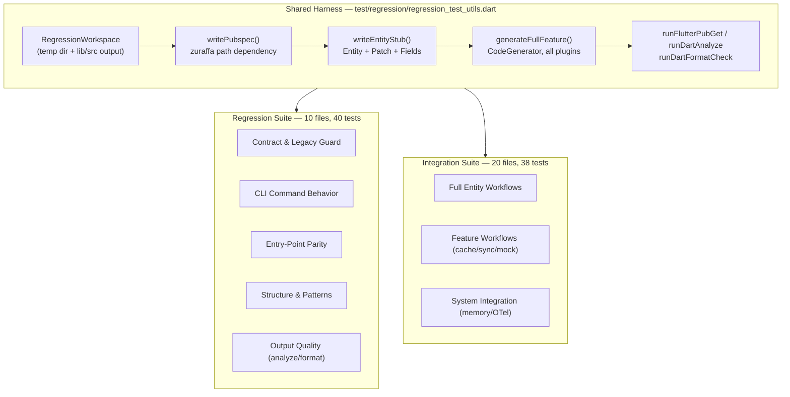
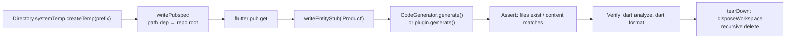
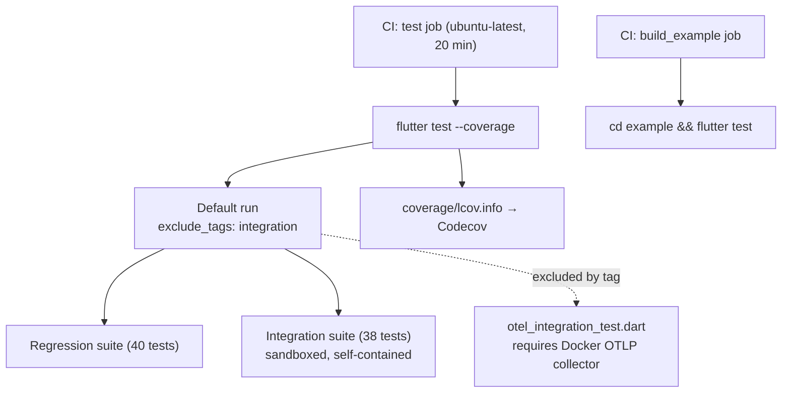

Zuraffa protects the stability of its code generation pipeline with two complementary test suites living under `test/regression/` and `test/integration/`. Both suites exercise the **real generator** — not mocks of it — by creating sandboxed Flutter projects in temporary directories, running generation against them, and asserting on the produced file structure, content, and even compiler output. The distinction between the two is one of *intent*: the regression suite verifies that the pipeline's **contracts and invariants** remain stable (canonical commands, clean architecture layout, code patterns, docs consistency), while the integration suite verifies that **cross-plugin workflows** produce coherent, multi-layer results end-to-end. Together they form the quality gate that CI runs on every pull request.

## The Two-Layer Test Architecture

Both suites share a single foundation — `test/regression/regression_test_utils.dart` — which supplies the `RegressionWorkspace` sandbox abstraction. Integration tests import this utility directly (`import '../regression/regression_test_utils.dart';`), making the regression directory not only a test suite but the *harness* for end-to-end verification. This is a deliberate inversion of the usual layout: the "lower-level" regression utilities are reused by the "higher-level" integration tests because both need identical sandboxing guarantees.



Sources: [regression_test_utils.dart](test/regression/regression_test_utils.dart#L1-L185), [full_entity_workflow_test.dart](test/integration/full_entity_workflow_test.dart#L1-L12)

## The Shared Sandbox Harness

Every test in both suites follows the same lifecycle: **create → stub → generate → verify → dispose**. `createWorkspace(prefix)` allocates a unique temporary directory under `Directory.systemTemp` and computes the conventional `lib/src` output path ([regression_test_utils.dart](test/regression/regression_test_utils.dart#L20-L26)). `writePubspec` then writes a `pubspec.yaml` whose `zuraffa` dependency is a **path dependency pointing at the repository root**, alongside `get_it`, `shadcn_ui`, and `mocktail` — this makes the sandbox a real, resolvable Flutter package ([regression_test_utils.dart](test/regression/regression_test_utils.dart#L28-L48)). `writeEntityStub` scaffolds a minimal domain entity (the `Product` class plus its `Patch` and `Fields` companions) that generation can target ([regression_test_utils.dart](test/regression/regression_test_utils.dart#L50-L88)).



The most important harness function is `generateFullFeature`, which constructs a `CodeGenerator` with the maximal configuration — all seven CRUD methods (`get`, `getList`, `create`, `update`, `delete`, `watch`, `watchList`), plus data, VPCs, state, DI, and route generation ([regression_test_utils.dart](test/regression/regression_test_utils.dart#L137-L162)). It drives the same `CodeGenerator` that production code uses, whose `generate()` method resolves a plan through the `PluginManager` — the identical resolution path the CLI uses — then runs the active plugins inside a transactional file system and returns a `GeneratorResult` with the emitted files ([code_generator.dart](lib/src/generator/code_generator.dart#L125-L184), [generator_result.dart](lib/src/models/generator_result.dart#L3-L25)).

One notable detail: the utility's API has **evolved**. The current implementation uses top-level functions (`createWorkspace`, `writePubspec`, `generateFullFeature`), while the older wiki documentation at `openwiki/testing.md` describes static methods on a `RegressionWorkspace` class. If you encounter legacy test code, the top-level function signatures are the canonical API today ([openwiki/testing.md](openwiki/testing.md#L56-L70)).

Sources: [regression_test_utils.dart](test/regression/regression_test_utils.dart#L90-L135), [code_generator.dart](lib/src/generator/code_generator.dart#L125-L184)

## Regression Suite: Protecting the Contract

The regression suite answers one question: **"Did anything about the generation contract break?"** Its 40 tests across 10 files are deliberately cheap — most generate in dry-run mode or read repository files directly — so they run in seconds and can be part of every CI cycle.

### Pipeline Contract & Legacy Guard

`v5_pipeline_contract_test.dart` is the v5 migration's sentinel. It asserts that the canonical workflow `zfa entity create → zfa make → zfa build` is encoded in `ProjectContextStore.defaultContext()` ([v5_pipeline_contract_test.dart](test/regression/v5_pipeline_contract_test.dart#L24-L31)), that core documentation (README, AGENTS.md, SKILL.md, website docs) teaches that same pipeline ([v5_pipeline_contract_test.dart](test/regression/v5_pipeline_contract_test.dart#L33-L48)), that the MCP server advertises and invokes `zuraffa_make` ([v5_pipeline_contract_test.dart](test/regression/v5_pipeline_contract_test.dart#L50-L58)), and that the example project's `.zfa.json` uses the v5 config shape ([v5_pipeline_contract_test.dart](test/regression/v5_pipeline_contract_test.dart#L60-L76)).

The most aggressive test in this file is the **legacy residue guard**: it scans README, CLI_GUIDE, SKILL, HTML landing pages, all `website/docs` markdown, and all `example/lib` and `example/test` Dart files, asserting none contain forbidden v4 tokens — `zfa generate`, `zuraffa_generate`, `--vpcs`, `generate <Name>` ([v5_pipeline_contract_test.dart](test/regression/v5_pipeline_contract_test.dart#L78-L113)). Any accidental resurrection of the removed command surfaces immediately. This dovetails with `docs_command_consistency_test.dart`, which checks the same for the docs corpus specifically ([docs_command_consistency_test.dart](test/regression/docs_command_consistency_test.dart#L20-L116)).

### CLI Behavior & Entry-Point Parity

`cli_command_test.dart` runs the actual `CliRunner` (with `exitOnCompletion: false`) inside a sandbox and asserts behavioral contracts: `zfa make Product --preset=crud` creates the repository file; `zfa make --from-json` honors a config file; `zfa plugin list` prints `repository` and `usecase`; and — critically — the removed `generate` command must print migration guidance pointing to `zfa make <Name>` rather than failing silently ([cli_command_test.dart](test/regression/cli_command_test.dart#L29-L98)). A separate group verifies `ProjectRoot.find` resolution from nested directories and from CWD ([cli_command_test.dart](test/regression/cli_command_test.dart#L100-L235)).

`compare_outputs_test.dart` then proves the **two entry points agree**: given identical config, the `CodeGenerator.resolvePlan()` path and the CLI `PluginManager` path must resolve the *same plugin set* — including honoring config defaults (`di: true`) and disabled plugins (`route`) identically ([compare_outputs_test.dart](test/regression/compare_outputs_test.dart#L12-L57)). This parity check matters because the CLI and library API are separate surfaces; drift between them would silently change behavior depending on how a user invokes Zuraffa. The same file verifies content-level output contracts (e.g., repositories contain `abstract class ProductRepository`, datasources contain `UpdateParams<String, WalkthroughPatch>` instead of the legacy `Partial<Walkthrough>`) and that legacy JSON keys like `repo_method`, `id_field_type`, and `cache_policy` still deserialize correctly ([compare_outputs_test.dart](test/regression/compare_outputs_test.dart#L59-L151)).

### Structure, Patterns & Output Quality

The remaining regression files assert structural invariants of generated code:

| Test File | Invariant Protected | Verification Method |
|---|---|---|
| `file_structure_test.dart` | Clean-architecture layout: `domain/`, `data/`, `presentation/`, `di/` trees | Generates full feature, asserts 11 canonical paths exist |
| `pattern_compliance_test.dart` | UseCases extend `UseCase<S, P>` and handle `CancelToken`; Views use `ControlledWidgetBuilder` + `viewState` | Generates, reads file content |
| `di_registration_test.dart` | DI files use `getIt.registerLazySingleton` with correct type names | Instantiates `DiPlugin` directly, reads output |
| `route_generation_test.dart` | go_router configs expose `/product`, `/product/:id`, `/product/create`, `/product/:id/edit` | Instantiates `RouteBuilder`, joins file content |
| `platform_layout_structure_test.dart` | Shells extend `AppShell`; layouts live under `pages/<feature>/layouts/`; resolver fallback order `compoundKey → platformKey → deviceKey → genericKey` | Reads production source files directly |
| `output_quality_test.dart` | Generated output passes `dart analyze` **and** `dart format --set-exit-if-changed` | Generates in sandbox, runs both toolchains on emitted paths |

Sources: [file_structure_test.dart](test/regression/file_structure_test.dart#L7-L33), [pattern_compliance_test.dart](test/regression/pattern_compliance_test.dart#L6-L35), [di_registration_test.dart](test/regression/di_registration_test.dart#L10-L47), [route_generation_test.dart](test/regression/route_generation_test.dart#L8-L41), [platform_layout_structure_test.dart](test/regression/platform_layout_structure_test.dart#L6-L134), [output_quality_test.dart](test/regression/output_quality_test.dart#L6-L45)

Note the two distinct verification strategies: `platform_layout_structure_test.dart` reads the **production source** (`lib/src/presentation/shells/*`, plugin builders) rather than generating output — it guards the platform abstraction layer itself. `output_quality_test.dart` is the strongest gate: it runs the real Dart analyzer and formatter on generated files, catching not just wrong content but uncompilable or unformatted output, with a 2-minute timeout per check ([output_quality_test.dart](test/regression/output_quality_test.dart#L22-L45)).

Sources: [platform_layout_structure_test.dart](test/regression/platform_layout_structure_test.dart#L14-L34)

## Integration Suite: Validating Workflows End-to-End

The integration suite answers: **"Does the whole pipeline cooperate to produce a working multi-layer result?"** Its 38 tests across 20 files are heavier — each `setUp` runs `flutter pub get` in the sandbox (and some carry 5-minute timeouts) — but they validate behavior no unit test can: cross-plugin orchestration, feature flag combinations, and persistence of generation artifacts.

### Full-Entity & Orchestration Workflows

`full_entity_workflow_test.dart` is the archetype: it creates a workspace, runs `flutter pub get`, writes a `Product` entity stub, then generates with data + VPCs + state + DI + mock, and asserts the entire expected file tree — repository, data repository, three datasources, view, controller, presenter, state ([full_entity_workflow_test.dart](test/integration/full_entity_workflow_test.dart#L14-L113)). The final assertion runs `dart analyze` on the workspace, closing the loop between "files exist" and "files compile."

The orchestration variants cover the decision space of the generator:

| Test File | Scenario Validated |
|---|---|
| `multi_entity_test.dart` | Two entities generated into one project without conflicts |
| `presentation_only_workflow_test.dart` | Presentation-layer-only generation |
| `orchestrator_no_usecase_test.dart` | Generation when no usecase plugin applies |
| `custom_usecase_detection_test.dart` | Heuristic distinguishing custom usecases from entity defaults |
| `custom_usecase_workflow_test.dart` | Custom usecase with service and provider |
| `toggle_method_test.dart` | `toggle` method generated across all layers |
| `append_mode_test.dart` | Append mode updates existing repositories/datasources |
| `method_append_revert_test.dart` | **Revert** deletes files created by a prior append run |

`method_append_revert_test.dart` is the transactional integrity proof: it generates a service via the method-append plugin, verifies `permission_service.dart` exists, then reruns the generator with `revert: true` and asserts the file is removed — validating the [Transactional File System, Revert & Plan Store](9-transactional-file-system-revert-and-plan-store) end-to-end rather than in isolation ([method_append_revert_test.dart](test/integration/method_append_revert_test.dart#L20-L70)).

### Feature-Specific Workflows

These tests generate with a single feature flag enabled and assert the resulting cross-layer behavior:

- **Caching**: `caching_workflow_test.dart` generates an `Order` with `enableCache: true, cacheStorage: 'hive'` and asserts the remote + local datasource pair and the data repository ([caching_workflow_test.dart](test/integration/caching_workflow_test.dart#L21-L68)); `cache_adapter_test.dart` drives the `CreateCacheAdapterCapability` (sub-entity discovery, Hive registrar updates, duplicate-run idempotency); `cache_compilation_test.dart` proves generated cached repository and DI **compile**.
- **Offline-First Sync**: `sync_workflow_test.dart` asserts the sync-enabled repository carries four constructor dependencies (`_localDataSource`, `_remoteDataSource`, `_syncMetadataStore`, `_syncStrategy`), performs local-first writes with `markPending`, tombstones deletes, and delegates `syncPending`/`pullRemote` to the strategy ([sync_workflow_test.dart](test/integration/sync_workflow_test.dart#L28-L100)); `sync_with_di_test.dart` asserts DI registers all sync components; a negative case confirms cache + sync together **throw**.
- **Mock Polymorphism**: `polymorphic_mock_integration_test.dart` validates polymorphic mock data generation.
- **DI Flags**: `di_flag_parsing_test.dart` verifies `zfa di create --use-mock` configures mock injection.
- **Adaptive Layouts**: `platform_layout_generation_test.dart` asserts platform presentation classes, shell abstractions for all platforms, adaptive targets in `ZfaConfig`, and the `adaptive-feature` preset registration — the generation-side counterpart to the regression suite's source-side layout checks.

Sources: [sync_workflow_test.dart](test/integration/sync_workflow_test.dart#L28-L100), [caching_workflow_test.dart](test/integration/caching_workflow_test.dart#L21-L68)

### System-Level Integration

Three tests reach beyond generation into system behavior:

- **Project Memory**: `zfa_memory_integration_test.dart` asserts a successful generation writes `.zfa/plans/last_run_Product.json`, populates the `RunStore`, and persists project context (`version`, `domain_root`) — the full [Project Memory & Configuration](25-project-memory-and-configuration) write path ([zfa_memory_integration_test.dart](test/integration/zfa_memory_integration_test.dart#L20-L70)).
- **Performance Envelope**: `performance_benchmark_test.dart` generates a full entity and asserts completion under 10 seconds ([performance_benchmark_test.dart](test/integration/performance_benchmark_test.dart#L18-L51)) — a coarse guard; detailed profiling lives in the [Performance & Memory Benchmarks](28-performance-and-memory-benchmarks) page.
- **OTLP Telemetry**: `otel_integration_test.dart` is the *only* file tagged `@Tags(['integration'])` ([otel_integration_test.dart](test/integration/otel_integration_test.dart#L2)). It sends real `ServerFailure` spans to an OTLP collector at `http://localhost:4318` (typically a Docker container) and asserts export succeeds ([otel_integration_test.dart](test/integration/otel_integration_test.dart#L5-L60)). Because it requires external infrastructure, it is excluded from default runs (see below).

Sources: [zfa_memory_integration_test.dart](test/integration/zfa_memory_integration_test.dart#L20-L70), [performance_benchmark_test.dart](test/integration/performance_benchmark_test.dart#L18-L51), [otel_integration_test.dart](test/integration/otel_integration_test.dart#L2-L60)

## Execution Model & CI

The test runner configuration in `dart_test.yaml` is a single line: `exclude_tags: integration`. This means the default `flutter test` run excludes any test tagged `integration` — currently only the OTLP telemetry test, which requires a live collector. All other integration tests run in the default suite because they are self-contained: they create their own sandbox, resolve the zuraffa path dependency, and clean up afterward.



Sources: [dart_test.yaml](dart_test.yaml#L1), [ci.yaml](.github/workflows/ci.yaml#L99-L123)

In CI, the `test` job runs `flutter test --coverage` from the repository root with a 20-minute timeout, then separately runs the example project's tests (`cd example && flutter test`), and uploads coverage to Codecov ([ci.yaml](.github/workflows/ci.yaml#L99-L123)). Because integration tests run `flutter pub get` inside their sandboxes, they dominate wall-clock time — the 20-minute budget accommodates them. Locally, you can run the suites independently:

```bash
# Full default suite (regression + all sandboxed integration tests)
flutter test

# Regression suite only
flutter test test/regression/

# Integration suite only
flutter test test/integration/

# The externally-dependent OTLP test (needs a collector on :4318)
flutter test --tags integration
```

## Putting the Suites Together

The two suites form a dependency pyramid with the sandbox harness at its base: regression tests protect *contract stability* (cheap, fast, run everywhere), integration tests protect *workflow coherence* (heavier, run in CI and on demand), and the shared `RegressionWorkspace` guarantees both operate against real, compilable Flutter projects rather than in-memory fakes. When a v5-era regression occurs — say, someone reintroduces `zfa generate` in a doc, breaks the CodeGenerator/CLI parity, or generates a layout that duplicates shared controllers — the appropriate suite catches it at the right layer: contract tests fail instantly on token presence, output-quality tests fail on analyzer output, and workflow tests fail on missing cross-layer artifacts.

For the broader testing picture, see [Testing Strategy & Result Matchers](26-testing-strategy-and-result-matchers) for unit-level patterns and custom matchers, and [Performance & Memory Benchmarks](28-performance-and-memory-benchmarks) for the dedicated benchmark harness. The feature behaviors these suites exercise are documented in [Cache Policies & Dual DataSource Pattern](15-cache-policies-and-dual-datasource-pattern), [Offline-First Sync Strategies](16-offline-first-sync-strategies), and [Transactional File System, Revert & Plan Store](9-transactional-file-system-revert-and-plan-store).