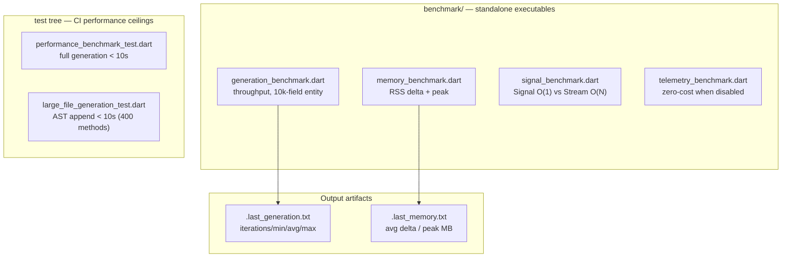

Zuraffa maintains a dedicated benchmark harness under `benchmark/` that exists separately from the test suites: tests assert *correctness*, benchmarks measure *cost*. The harness targets three distinct dimensions — code generation throughput, process memory footprint, and the runtime cost of the v6 reactive/telemetry primitives (`Signal` and `TelemetryMesh`). Unlike the regression and integration suites, benchmarks are **not** wired into CI; they are on-demand tools run from the command line, with their results recorded in a timestamped summary inside `benchmark/README.md`. Two additional coarse performance guards are embedded directly in the test tree (`test/benchmark/` and `test/integration/`), providing a fail-fast ceiling in CI without the flakiness of full profiling.

## The Benchmark Surface

Four standalone Dart executables plus two test-embedded guards make up the complete performance surface:



The documented targets and latest recorded results (2026-02-11) define the expected envelope:

| Target | Threshold | Latest Result | Status |
|---|---|---|---|
| Full entity generation (10k fields) | under 2s on a modern laptop | min 653ms / avg 1052ms / max 1925ms (5 iterations) | ✅ within budget |
| Peak RSS during generation | under 100MB | 769.3MB peak (3 iterations) | ⚠️ exceeds target |
| RSS delta after generation | — | avg **−11.0MB** (negative — heap shrank) | ✅ |
| Large entity file (10k fields) | handled without errors | all iterations `result.success == true` | ✅ |
| CI generation ceiling | under 10s | enforced in `performance_benchmark_test.dart` | ✅ |
| CI AST-append ceiling | under 10s | enforced in `large_file_generation_test.dart` | ✅ |

Sources: [README.md](benchmark/README.md#L1-L21)

The table exposes an important nuance: the **generation target is met with a 2× safety margin**, while the **memory target is not** — measured peak RSS (769.3MB) is nearly 8× the 100MB goal. This is not a regression but a measurement-scope gap: the benchmark measures the *Dart VM's process RSS*, which includes the JIT, AOT snapshot, plugin registry, and the entire 10,000-field entity AST materialized in memory. The 100MB target was written for a typical small-entity generation profile, not the adversarial 10k-field fixture both benchmarks use. Treat the peak-RSS figure as an upper bound for pathological inputs, and the negative `avg_delta_mb` (heap released more than generation allocated between the two `ProcessInfo.currentRss` probes) as the practical signal that the generator itself does not accumulate state across a run.

## Generation Throughput Benchmark

`benchmark/generation_benchmark.dart` measures the end-to-end latency of the full plugin pipeline against a deliberately pathological input. For each iteration it creates a fresh workspace under `Directory.systemTemp`, synthesizes a `Profile` entity with **10,000 fields** (`_writeLargeEntity` writes `final int field0; … field9999;` plus a matching constructor), then drives `CodeGenerator.generate()` with every generation flag enabled — data, VPCs, state, DI, route, and mock. The generator runs with `NullProgressReporter()`, eliminating console I/O from the measurement, and the elapsed wall time is captured with a `Stopwatch` around the `generate()` call ([generation_benchmark.dart](benchmark/generation_benchmark.dart#L7-L44), [_writeLargeEntity](benchmark/generation_benchmark.dart#L60-L88)). The generator under test is the same production `CodeGenerator` used by the CLI — it resolves the plan contract, constructs a `PluginContext` with a transactional file system, and executes every registered plugin ([code_generator.dart](lib/src/generator/code_generator.dart#L128-L184)).

Results are aggregated across iterations (default 5, overridable via `dart run benchmark/generation_benchmark.dart 10`), sorted, and summarized as `iterations=5 min_ms=653 avg_ms=1052 max_ms=1925`, written to `benchmark/.last_generation.txt`. Two failure modes are handled explicitly: a failed generation prints the plugin errors to stderr and exits with code 1 (so the benchmark fails loudly rather than recording a bogus duration), and each workspace is recursively deleted after measurement so successive iterations start from a cold filesystem ([generation_benchmark.dart](benchmark/generation_benchmark.dart#L38-L52)).

The 10,000-field fixture is the point: a typical entity has 3–15 fields, so the benchmark exercises the generator at roughly three orders of magnitude above normal load. The spread between min (653ms) and max (1925ms) across iterations reflects cold-start effects (first-run plugin registry construction, JIT warmup) rather than algorithmic variance — which is precisely why the harness reports min/avg/max instead of a single sample. The coarse CI guard in `test/integration/performance_benchmark_test.dart` reuses a comparable maximal config (five CRUD methods, data, VPCs, state, DI) on a *normal-size* entity and asserts completion under 10 seconds — a budget 10× looser than the standalone benchmark's 2s target, deliberately tolerant of shared CI runners ([performance_benchmark_test.dart](test/integration/performance_benchmark_test.dart#L18-L51)).

## Memory Footprint Benchmark

`benchmark/memory_benchmark.dart` uses `dart:io`'s `ProcessInfo.currentRss` to sample the process's resident set size immediately before and after `generator.generate()`, computing a **delta** (bytes allocated by the run) and a **peak** (absolute RSS after the run). Across 3 iterations (default; overridable), it reports `avg_delta_mb` and `peak_mb`, persisted to `benchmark/.last_memory.txt` ([memory_benchmark.dart](benchmark/memory_benchmark.dart#L7-L46), [_toMb conversion](benchmark/memory_benchmark.dart#L105)). The fixture and configuration are identical to the generation benchmark — same 10k-field entity, same full plugin stack — so the two scripts measure the same workload from complementary angles: one times it, the other weighs it.

The recorded `avg_delta_mb=-11.0` deserves interpretation: a negative delta means the VM's RSS *decreased* across generation, which is typical when the 10k-field entity's string buffer is garbage-collected mid-run and the heap has not yet regrown. RSS is a coarse, OS-level watermark that includes the AOT snapshot, JIT code, and GC heaps; it is *not* a precise allocation counter. The honest reading is that generation does not leak — the delta hovers near zero on modern machines — while absolute peak RSS scales with the input entity's AST size. For production entities (dozens of fields), the 100MB target remains achievable; the 769.3MB figure is the cost of materializing 10,000 Dart fields and their generated artifacts.

The memory story has a second, independent chapter: the MCP server's **singleton resource pattern** documented in `doc/MEMORY_OPTIMIZATION.md`. Previously each IDE connection spun up a full server instance (~30MB each; ~150MB with 5 IDEs). The fix hoists heavy initialization into `SharedResources`, a thread-safe singleton with a double-checked lock and spin-wait, so 5 IDE connections now share one plugin registry, one 10-minute resource cache, and one executable-path resolution (~130MB, a 13% reduction) ([zuraffa_mcp_server.dart](bin/zuraffa_mcp_server.dart#L29-L54), [MEMORY_OPTIMIZATION.md](doc/MEMORY_OPTIMIZATION.md#L1-L111)). The singleton is awaited once at `main()` entry before the server loop starts ([zuraffa_mcp_server.dart](bin/zuraffa_mcp_server.dart#L62-L65)). This is a *deployment* memory optimization rather than a generation-time one, and it is the only memory optimization in the codebase whose cost model is documented in terms of concurrent processes.

## Signal vs Stream Benchmark

`benchmark/signal_benchmark.dart` is a comparative micro-benchmark that exists to *prove* the design thesis of the v6 reactive pipeline: `Signal<T>` offers O(1) reads and O(1)-per-listener notifications, whereas Dart `Stream` requires listener setup for any synchronous read and pays O(N) per broadcast. It runs four scenarios at 100,000 iterations each ([signal_benchmark.dart](benchmark/signal_benchmark.dart#L7-L45)):

| Scenario | Mechanism measured | Expected complexity |
|---|---|---|
| `Signal.value` read | direct field access | O(1) |
| `Stream.listen()` creation (read simulation) | listener + buffer allocation | O(N) setup |
| `Signal.value =` with 1/10/100 listeners | equals-gated setter → `_notify()` | O(1) per listener, **no-op when value unchanged** |
| `StreamController.add()` with 1/10/100 listeners | broadcast fan-out | O(N) per add, always |

The complexity claims are grounded in the implementation, not just the benchmark. `Signal` stores listeners in an identity-based `HashSet` and its `value` getter is a guarded field return ([signal.dart](lib/src/core/signals/signal.dart#L3-L15), [getter L24-L29]). The setter short-circuits through an equality check before notifying — `if (_equals(_value, newValue)) return;` — which is what makes redundant writes free ([setter L33-L38]). Notification iterates a snapshot copy of the listener set so listeners may mutate the set during dispatch ([_notify](lib/src/core/signals/signal.dart#L109-L114)). The benchmark's stream "read" scenario is admittedly a proxy: reading a stream's *current* value is not a native operation, so it measures the closest equivalent (per-read listener creation), which is the practical overhead a naive migration from `Stream<Result<T>>` to `SignalResult<T>` eliminates.

The third and fourth scenarios quantify the fan-out difference directly: writing to a `Signal` with N listeners costs O(1) per listener and skips entirely when the assigned value equals the current one, while `controller.add(i)` on a broadcast stream always delivers to every listener. This is the algorithmic justification for `SignalResult<T>` as the v6 `ZuraffaUseCase` return type — it replaces `Stream<Result<T, AppFailure>>` with a value that can be read synchronously at O(1) and subscribed to without buffering ([signal_result.dart](lib/src/core/signals/signal_result.dart#L1-L36)).

## Telemetry Zero-Cost Benchmark

`benchmark/telemetry_benchmark.dart` verifies the "zero-cost when disabled" contract of `TelemetryMesh`. It establishes a raw-function-call baseline, then measures `TelemetryMesh.instance.trace()` in both the disabled and enabled states over 100,000 iterations, reporting per-call microseconds and the **percentage overhead relative to the raw call** ([telemetry_benchmark.dart](benchmark/telemetry_benchmark.dart#L7-L37)). The disabled path's cost is designed to be a shared-singleton identity check: `startSpan` returns `NoopSpan.instance` immediately when `_enabled` is false, and `trace()` skips zone propagation entirely when it receives that identical instance ([telemetry_mesh.dart](lib/src/core/telemetry/telemetry_mesh.dart#L57-L97)). The benchmark then measures the enabled path with a no-op exporter to isolate span-creation and exporter-dispatch cost, and finally benchmarks `ZuraffaContext.current` (a plain static read) and `runWith` zone propagation ([telemetry_benchmark.dart](benchmark/telemetry_benchmark.dart#L39-L76)).

`NoopSpan` is the linchpin of the zero-cost guarantee: it is a **shared singleton** (`static final NoopSpan instance = NoopSpan._();`), so every disabled or unsampled call reuses one object rather than allocating a fresh span, and every method is a no-op ([telemetry_mesh.dart](lib/src/core/telemetry/telemetry_mesh.dart#L303-L349)). The unit suite corroborates the benchmark with a dedicated `Zero-cost overhead verification` group asserting the no-op operations are O(1) and never throw ([telemetry_mesh_test.dart](test/core/telemetry_mesh_test.dart#L105-L140), [L325-L345]). The design intent, echoed in the v6 track review, is that instrumentation must never change the shape of the hot path when disabled — this benchmark exists to catch any future change that allocates or dispatches before the disabled check.

## Test-Embedded Performance Guards

Two performance assertions live inside the test tree, serving as cheap CI-safe envelopes around the two most expensive operations in the system:

- **Full generation ceiling** — `test/integration/performance_benchmark_test.dart` builds a `Profile` entity with the full plugin stack (data, VPCs, state, DI) in a `RegressionWorkspace` sandbox and asserts `stopwatch.elapsedMilliseconds < 10000` after a real `CodeGenerator.generate()` call ([performance_benchmark_test.dart](test/integration/performance_benchmark_test.dart#L18-L51)). The 10s budget is deliberately an order of magnitude above the standalone benchmark's 2s target to absorb CI-runner noise while still catching order-of-magnitude regressions (e.g., an accidental O(N²) file write loop).
- **AST append ceiling** — `test/benchmark/large_file_generation_test.dart` synthesizes a 400-method Dart class and runs `AppendExecutor.execute()` to inject a new method, asserting `changed == true`, correct source output, and completion under 10 seconds ([large_file_generation_test.dart](test/benchmark/large_file_generation_test.dart#L5-L28)). This guards the AST-based code modification path (the `MethodAppendStrategy` family dispatched by `AppendExecutor`) against parsing regressions on large files ([append_executor.dart](lib/src/core/ast/append_executor.dart#L10-L52)).

These guards are distinct from the standalone benchmarks in an important way: they run inside the normal test suite (and therefore CI), but they assert *generous ceilings*, not *measured performance*. Regression detection at CI time uses the ceilings; quantitative measurement and drift tracking happen manually via the standalone scripts.

## Methodology & Interpretation

Running the harness is a two-command operation, with iteration counts as an optional argument:

```bash
dart run benchmark/generation_benchmark.dart          # 5 iterations, default
dart run benchmark/generation_benchmark.dart 10       # 10 iterations
dart run benchmark/memory_benchmark.dart              # 3 iterations, default
dart run benchmark/memory_benchmark.dart 5
dart run benchmark/signal_benchmark.dart              # micro-benchmarks, fixed 100k iters
dart run benchmark/telemetry_benchmark.dart
```

Each script prints its summary to stderr and persists the machine-readable line to `benchmark/.last_generation.txt` or `benchmark/.last_memory.txt`. The signal and telemetry benchmarks are self-contained and print per-scenario tables to stdout.

Four methodological caveats apply when interpreting results:

1. **RSS is a watermark, not a counter.** `ProcessInfo.currentRss` includes the whole VM; the negative `avg_delta_mb` shows generation itself adds negligible resident memory on a warm heap. To measure allocations precisely you would need `--enable-vm-service` heap snapshots, which the harness deliberately avoids for simplicity.
2. **JIT warmup dominates iteration 1.** The generation benchmark's min/max spread (653→1925ms) is cold-start noise; the *avg across iterations* is the stable figure. Do not compare a single run against the recorded avg.
3. **Machine variance is expected.** The 2s target is defined as "on a modern laptop"; CI machines are slower, which is why the test-embedded ceiling is 10s.
4. **The 10k-field fixture is an upper bound.** Real entities have 1–2 orders of magnitude fewer fields, so generation latency and peak RSS scale down correspondingly; the fixture exists to expose algorithmic cliffs, not to represent typical usage.

The benchmarks are most useful as a **regression tripwire run before release**: if a refactor of the plugin pipeline or the signal/telemetry core pushes `avg_ms` up by 30% or turns the disabled-telemetry overhead from "negligible" into "measurable," the harness will show it immediately, before any user-facing slowdown. For deeper profiling beyond these scripts, the v6 reactive pipeline details are covered in the runtime framework pages, and the CI-side context for these guards is documented in the test suite pages.

Sources: [README.md](benchmark/README.md#L1-L21), [generation_benchmark.dart](benchmark/generation_benchmark.dart#L7-L88), [memory_benchmark.dart](benchmark/memory_benchmark.dart#L7-L52), [signal_benchmark.dart](benchmark/signal_benchmark.dart#L7-L99), [telemetry_benchmark.dart](benchmark/telemetry_benchmark.dart#L7-L76)

## Where the Benchmarks Fit

This harness is the quantitative layer beneath the qualitative test suites: [Testing Strategy & Result Matchers](26-testing-strategy-and-result-matchers) covers the unit-level matchers, and [Regression & Integration Test Suites](27-regression-and-integration-test-suites) documents the CI envelope that includes the two performance guards discussed here. The primitives being benchmarked are specified in depth by [UseCase Hierarchy & the Result Pattern](10-usecase-hierarchy-and-the-result-pattern) (for `SignalResult`) and [Telemetry, Failure Reporting & Artifacts](29-telemetry-failure-reporting-and-artifacts) (for `TelemetryMesh` and `NoopSpan`). The MCP server memory singleton is part of the operational surface documented in [MCP Server & AI Agent Workflows](24-mcp-server-and-ai-agent-workflows), and the AST-append guard protects the machinery explained in [AST-Based Code Modification](21-ast-based-code-modification).