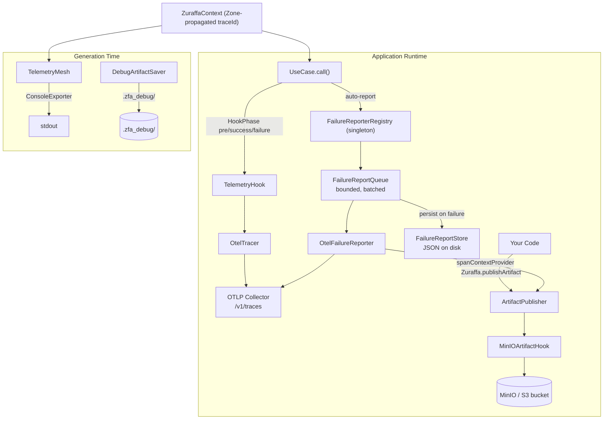
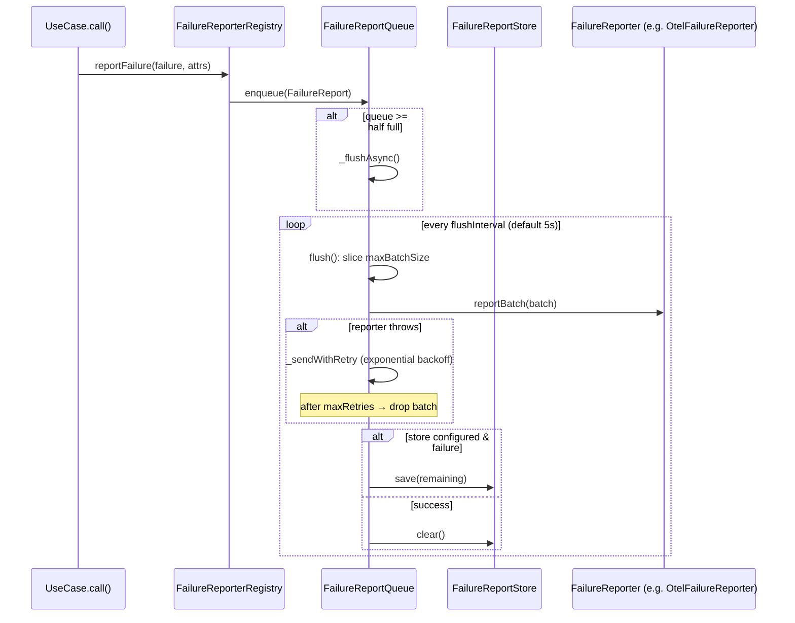

Zuraffa ships a three-layer observability stack that spans both **code generation time** and **application runtime**: an in-process telemetry mesh with zero-cost no-op semantics, a batching failure-reporting pipeline with persistence and retry, and an artifact-publishing system that stores debuggable payloads (HTML, JSON, images) in S3-compatible storage — all cross-linked through W3C trace context. This page explains the architecture of each layer, how they compose, and the exact delivery guarantees each provides.

## Architecture Overview

The stack is deliberately decomposed into three planes that share one correlation currency — the trace ID. `TelemetryMesh` is the lightweight, allocation-free tracing core used by generated code and the CLI. The OpenTelemetry plane (`OtelTracer`, `TelemetryHook`, `OtelFailureReporter`, `OtelLogExporter`) speaks OTLP/HTTP to any collector. The artifact plane (`ArtifactPublisher` + hooks) persists payloads and stamps them with the active trace/span IDs so you can navigate bidirectionally between traces and stored artifacts.

Two distinct tracing implementations coexist: `TelemetryMesh` is Zuraffa's own in-process span/trace model with pluggable `TelemetryExporter`s; the OpenTelemetry integration wraps the standard `opentelemetry` package. Both honor the same `ZuraffaContext`-carried `traceId`, so a trace started in the mesh can be continued by the OTel plane or vice versa. Sources: [telemetry_mesh.dart](lib/src/core/telemetry/telemetry_mesh.dart#L9-L26), [zuraffa_context.dart](lib/src/core/context/zuraffa_context.dart#L37-L55), [otel_tracer.dart](lib/src/core/otel_tracer.dart#L68-L94), [artifact_publisher.dart](lib/src/core/artifact_publisher.dart#L278-L299)

## TelemetryMesh: In-Process Zero-Cost Tracing

`TelemetryMesh` is a singleton that manages trace collection, span creation, and exporter dispatch. Its defining property is **zero-allocation when disabled** (the default): every public API — `startSpan`, `trace`, `traceAsync` — short-circuits to the shared `NoopSpan.instance` and the body runs in the caller's zone with no instrumentation overhead. The benchmark `benchmark/telemetry_benchmark.dart` quantifies this contract, measuring disabled-path overhead against a raw function call across 100,000 iterations. Sources: [telemetry_mesh.dart](lib/src/core/telemetry/telemetry_mesh.dart#L9-L26), [telemetry_mesh.dart](lib/src/core/telemetry/telemetry_mesh.dart#L304-L348), [telemetry_benchmark.dart](benchmark/telemetry_benchmark.dart#L1-L70)

When enabled via `enable(exporters: ..., sampleRate: ...)`, the mesh resets prior session state, registers exporters, and clamps the sample rate to `[0.0, 1.0]`. Sampling is trace-level and deterministic: `_shouldSample` hashes the trace ID and compares against `sampleRate * 1000`, so the same trace ID always samples consistently across processes. A trace is completed — and exported — only when its last active span ends (`activeSpanCount` reaches zero), which prevents premature flushing of nested spans. Exporter failures are swallowed by `_safeExport` so a broken exporter can never crash the caller. Sources: [telemetry_mesh.dart](lib/src/core/telemetry/telemetry_mesh.dart#L27-L45), [telemetry_mesh.dart](lib/src/core/telemetry/telemetry_mesh.dart#L201-L214), [telemetry_mesh.dart](lib/src/core/telemetry/telemetry_mesh.dart#L176-L199)

`ZuraffaSpan` records name, operation, parent ID, start/end timestamps, status, attributes, and recorded exceptions; `ZuraffaTrace` is the span tree sharing one `traceId` plus its originating `ZuraffaContext`. The built-in `ConsoleExporter` prints per-span durations and statuses for development. Convenience helpers — `traceUseCase`, `traceRepository`, `traceNetwork` — encode the naming convention `usecase.*`, `repo.*`, `network.*` directly, which the `TelemetryHook` later mirrors on the OTel side. Sources: [telemetry_mesh.dart](lib/src/core/telemetry/telemetry_mesh.dart#L230-L283), [telemetry_mesh.dart](lib/src/core/telemetry/telemetry_mesh.dart#L354-L398), [telemetry_mesh.dart](lib/src/core/telemetry/telemetry_mesh.dart#L148-L173)

Trace propagation relies on Dart Zones: `ZuraffaContext.runWith` / `runWithAsync` install the context in a zone, and `trace` re-enters a context zone when the current zone's `traceId` differs from the span's, guaranteeing child spans inherit the parent trace ID across async gaps. The test suite verifies the full Controller → UseCase → Repository flow shares one `traceId` and that disabled-path calls return the const no-op singleton. Sources: [zuraffa_context.dart](lib/src/core/context/zuraffa_context.dart#L117-L146), [telemetry_mesh.dart](lib/src/core/telemetry/telemetry_mesh.dart#L215-L226), [telemetry_mesh_test.dart](test/core/telemetry_mesh_test.dart#L1-L110)

## OpenTelemetry Runtime Integration

The OTel plane is activated with a single facade call: `Zuraffa.enableOtelReporting(collectorEndpoint: ..., serviceName: ..., apiKey: ...)`. It performs three coordinated actions: registers an `OtelFailureReporter` (which builds a `TracerProviderBase` with a `BatchSpanProcessor` + `CollectorExporter` and registers it as the global provider), optionally starts an `OtelLogExporter` for `/v1/logs`, and — critically — wires `OtelTracer`'s active span context into `ArtifactPublisher.spanContextProvider` so every published artifact is automatically stamped with `trace_id`/`span_id`. Sources: [zuraffa.dart](lib/src/zuraffa.dart#L772-L813), [otel_failure_reporter.dart](lib/src/core/otel_failure_reporter.dart#L73-L104)

### OtelTracer: Manual Business Tracing

`OtelTracer` is the thin singleton for application-level spans. It exposes `startSpan`, `endSpan`, `endSpanWithError`, and the lifecycle-managed `trace`/`traceAsync` helpers. Its two read-only getters, `currentTraceId` and `currentSpanId`, extract the W3C-formatted IDs from `Context.current`, guarding against the all-zeros invalid context; these are what `ArtifactPublisher` consumes at publish time. The tracer becomes active automatically once `OtelFailureReporter.initialize` registers the global provider — no separate setup is required. Sources: [otel_tracer.dart](lib/src/core/otel_tracer.dart#L96-L127), [otel_tracer.dart](lib/src/core/otel_tracer.dart#L139-L180), [otel_tracer.dart](lib/src/core/otel_tracer.dart#L183-L260)

### TelemetryHook: Automatic UseCase Instrumentation

`TelemetryHook` extends the generic `Hook` system and eliminates manual tracing entirely: it subscribes to all three hook phases (`pre`, `success`, `failure`) and opens a span named `usecase.{UseCaseName}` on `pre`, closing it with OK plus a `usecase.duration_ms` attribute on success, or with ERROR, failure type, message, and stack trace on failure. The span is stashed in the shared `HookContext.metadata` bag so the three phases cooperate without leaking state. Sources: [telemetry_hook.dart](lib/src/core/telemetry_hook.dart#L49-L96), [telemetry_hook.dart](lib/src/core/telemetry_hook.dart#L98-L133), [telemetry_hook.dart](lib/src/core/telemetry_hook.dart#L135-L168)

Filtering is whitelist/blacklist based on runtime type names: `onlyUseCases` limits tracing to a set, `excludeUseCases` removes noisy cases, and exclusion always wins when a UseCase appears in both. Because the hook catches failures from the underlying OTel API (logging warnings rather than rethrowing), registering it before any reporter is initialized is safe. Sources: [telemetry_hook.dart](lib/src/core/telemetry_hook.dart#L67-L78), [telemetry_hook_test.dart](test/core/telemetry_hook_test.dart#L13-L97)

### OtelLogExporter: Structured Log Export

`OtelLogExporter` bridges Dart's `package:logging` into OTLP JSON for the collector's `/v1/logs` endpoint. It derives the logs endpoint from the base collector URL (rewriting a trailing `/v1/traces` to `/v1/logs`), subscribes to `Logger.root.onRecord`, filters by a configurable remote level, and batches records (default batch 100, flush every 5 seconds) with a `Bearer` API key header when configured. Each record is mapped to `timeUnixNano`, a `severityNumber` per the OTLP severity ladder, logger name, message body, and — when present — exception message, type, and stack trace attributes. Its own logs are filtered out to prevent self-recursion, and flush failures are logged without requeueing to bound memory. Sources: [otel_log_exporter.dart](lib/src/core/otel_log_exporter.dart#L11-L55), [otel_log_exporter.dart](lib/src/core/otel_log_exporter.dart#L57-L127), [otel_log_exporter.dart](lib/src/core/otel_log_exporter.dart#L129-L198)

## The Failure Reporting Pipeline

Failure reporting is a **fire-and-forget, batched, retried, and optionally persistent** pipeline. `FailureReporterRegistry` (singleton) owns reporter registration and queue configuration; all five UseCase base classes (`UseCase`, `StreamUseCase`, `SyncUseCase`, `BackgroundUseCase`) and the `FailureHandler.logAndHandleError` mixin call `FailureReporterRegistry.instance.reportFailure(...)` automatically with `{'usecase': '$runtimeType'}` attributes — no per-UseCase setup exists by design. Sources: [failure_reporter_registry.dart](lib/src/core/failure_reporter_registry.dart#L31-L56), [usecase.dart](lib/src/domain/usecase.dart#L117-L148), [sync_usecase.dart](lib/src/domain/sync_usecase.dart#L45-L51), [stream_usecase.dart](lib/src/domain/stream_usecase.dart#L139-L169), [failure_handler.dart](lib/src/core/failure_handler.dart#L323-L332)

### Queue Semantics

`FailureReportQueue` models the OpenTelemetry `BatchSpanProcessor` conventions. It is bounded (`maxQueueSize`, default 256) and drops the **oldest** report when full; it enqueues only if at least one reporter's `shouldReport` accepts the failure (`CancellationFailure` is excluded by default); it flushes immediately when the queue reaches half capacity; and it never throws into the caller. Delivery slices batches of `maxBatchSize` (default 32) and requires **all** reporters to succeed before removing the batch, otherwise flushing halts and retries on the next cycle. Sources: [failure_report_queue.dart](lib/src/core/failure_report_queue.dart#L29-L78), [failure_report_queue.dart](lib/src/core/failure_report_queue.dart#L102-L127), [failure_report_queue.dart](lib/src/core/failure_report_queue.dart#L129-L187)

Retries follow a pluggable `ReportRetryPolicy`. The default `ExponentialBackoffRetryPolicy` matches the OTLP exporter spec: multiplier 1.5, max interval 30 s, max retries 5, max elapsed 5 min, initial delay 1 s. `FixedIntervalRetryPolicy` and `NoRetryPolicy` are also provided. A throwing `reportBatch` is the retry signal; a batch is dropped after exhausting attempts. Sources: [retry_policy.dart](lib/src/core/retry_policy.dart#L22-L32), [retry_policies.dart](lib/src/core/retry_policies.dart#L23-L73), [retry_policies.dart](lib/src/core/retry_policies.dart#L74-L101), [failure_report_queue.dart](lib/src/core/failure_report_queue.dart#L190-L229)

### Persistence Across Restarts

When persistence is enabled (`persistFailures: true`), `FailureReportStore` serializes reports as a JSON array on disk. On flush failure or on `dispose` with unflushed reports, the queue saves its remaining contents; on the next process start, `_loadPersisted` prepends the older reports (so they flush first) and triggers an immediate flush. Each failure is serialized with its runtime type, message, timestamp, stack trace, attributes, cause, and a `failureData` map preserving failure-specific fields (e.g. `statusCode`, `fieldErrors`, `timeoutMs`) so OTel spans can be reconstructed with full context. Deserialization stamps `failure.persisted=true` and `failure.original_type` into the attributes. Corrupted files are cleared rather than fatal. Sources: [failure_report_store.dart](lib/src/core/failure_report_store.dart#L33-L62), [failure_report_store.dart](lib/src/core/failure_report_store.dart#L65-L122), [failure_report_store.dart](lib/src/core/failure_report_store.dart#L125-L200), [failure_report_queue.dart](lib/src/core/failure_report_queue.dart#L81-L98), [failure_report_queue.dart](lib/src/core/failure_report_queue.dart#L247-L266)

### The Reporter Contract

`FailureReporter` is the extension point for any backend: Sentry, custom HTTP endpoints, or Zuraffa's opinionated `OtelFailureReporter`. Implementations provide an `id`, an optional `shouldReport` filter, `reportBatch` (throwing signals retryability), and lifecycle hooks `initialize`/`dispose`. Registration is idempotent-guarded — a duplicate `id` throws `StateError` — and the first registration constructs the queue with the current configuration. Sources: [failure_reporter.dart](lib/src/core/failure_reporter.dart#L61-L88), [failure_reporter_registry.dart](lib/src/core/failure_reporter_registry.dart#L88-L110), [failure_reporter_registry.dart](lib/src/core/failure_reporter_registry.dart#L196-L218)

## Failure → OTel Span Enrichment

`OtelFailureReporter.reportBatch` maps each `AppFailure` to a span named `failure.{RuntimeType}` with ERROR status, core attributes (`failure.type`, `failure.message`, `failure.timestamp`, optional `failure.cause`, custom report attributes), and a switch-based `_addFailureAttributes` that emits type-specific dimensions:

| Failure type | Emitted attributes |
|---|---|
| `ServerFailure` | `http.status_code` |
| `NetworkFailure` | `failure.category=network` |
| `ValidationFailure` | `failure.category=validation`, `failure.fields` |
| `NotFoundFailure` | `failure.category=not_found`, `failure.resource_type`, `failure.resource_id` |
| `UnauthorizedFailure` / `ForbiddenFailure` | `failure.category=auth`, `failure.auth_type`, `failure.required_permission` |
| `TimeoutFailure` | `failure.category=timeout`, `failure.timeout_ms` |
| `ConflictFailure` | `failure.category=conflict`, `failure.conflict_type` |
| `PlatformFailure` | `failure.category=platform`, `failure.platform_code` |
| Remaining types | `failure.category={type}` (cache, cancellation, state, type, unimplemented, unsupported, unknown) |

If the report carries an `artifactId` attribute, the span records an `artifact.published` event linking forward to artifact storage — while the artifact itself carries the span's `trace_id`/`span_id` in S3 metadata, enabling backward navigation. The sealed `AppFailure` hierarchy (`failure.dart`) makes this switch exhaustive at compile time, so adding a new failure subtype forces a mapping decision here. Sources: [otel_failure_reporter.dart](lib/src/core/otel_failure_reporter.dart#L106-L174), [otel_failure_reporter.dart](lib/src/core/otel_failure_reporter.dart#L176-L267), [failure.dart](lib/src/core/failure.dart#L36-L75), [failure.dart](lib/src/core/failure.dart#L203-L665)

On the classification side, `FailureHandler` (mixed into data sources and repositories) translates raw Dart errors into typed `AppFailure`s — `ArgumentError`→validation, `TimeoutException`→timeout, `PlatformException`→platform, `StateError`/`OutOfMemoryError`→state, and so on — while `AppFailure.from` runs a specificity-ordered factory chain (network before timeout before not-found before … unknown) for anything unclassified. This is the same hierarchy the OTel reporter consumes, so classification and reporting stay consistent. Sources: [failure_handler.dart](lib/src/core/failure_handler.dart#L23-L109), [failure.dart](lib/src/core/failure.dart#L59-L73)

## Artifact Publishing

`ArtifactPublisher` is the global dispatcher for artifact hooks. An `ArtifactContext` carries the payload (`String`, `Uint8List`, or `Map`), MIME type, `reason` (e.g. `'failure'`, `'scan'`, `'debug'`), `source` component, arbitrary metadata, optional `pathSegments`, label, stack trace, and the auto-captured W3C `traceId`/`spanId` from `spanContextProvider`. Publishing is resilient by construction: hooks run in ascending `priority` order, each guarded by `shouldPublish`, and one hook's exception is logged but never blocks the remaining hooks or the caller. Both awaited (`publish`) and fire-and-forget (`publishFireAndForget`) variants exist, surfaced through `Zuraffa.publishArtifact` / `publishArtifactAwaited`. Sources: [artifact_publisher.dart](lib/src/core/artifact_publisher.dart#L25-L140), [artifact_publisher.dart](lib/src/core/artifact_publisher.dart#L202-L240), [artifact_publisher.dart](lib/src/core/artifact_publisher.dart#L339-L426), [zuraffa.dart](lib/src/zuraffa.dart#L964-L1025)

### MinIOArtifactHook and Storage Key Hierarchy

The shipped hook, `MinIOArtifactHook` (priority 100), uploads to MinIO/S3 through a thin `MinioClient` wrapper. The S3 object key follows a **reason-first** hierarchy that makes bucket browsing intuitive — `{pathPrefix}{reason}/{source}/{label}/{pathSegments}/{id}.{ext}` — with PascalCase/camelCase names converted to snake_case folders and content-type-derived extensions. Example: `prod/failure/network_client/request_failed/eu/premium/01923456-7890-abcd.html`. Sources: [artifact_publisher.dart](lib/src/core/artifact_publisher.dart#L511-L604), [artifact_publisher.dart](lib/src/core/artifact_publisher.dart#L776-L826), [artifact_publisher.dart](lib/src/core/artifact_publisher.dart#L829-L858)

S3 metadata headers encode the correlation data: `artifact-reason`, `artifact-source`, `artifact-label`, and — when OTel is active — `trace-id` and `span-id`, plus any context metadata under `ctx-{key}`. Values are sanitized to safe header characters with a bounded preview (`[sanitized len=N] …`), so arbitrary domain metadata can never corrupt the upload. `ensureBucketExists` optionally auto-creates the bucket on first publish. Sources: [artifact_publisher.dart](lib/src/core/artifact_publisher.dart#L606-L658), [artifact_publisher.dart](lib/src/core/artifact_publisher.dart#L663-L774)

### Backward-Compatibility Layer

The older failure-only API — `FailureContext`, `FailureHook`, `FailureHookManager` — is retained as a deprecated delegation layer. `FailureHookManager.trigger` converts failure data into an `ArtifactContext` with `reason: 'failure'`, and registered `FailureHook`s are adapted into `ArtifactHook`s. New code should use `ArtifactPublisher`/`ArtifactHook` directly; a `Result` extension also triggers hooks on failure results for non-UseCase call sites. Sources: [failure_hooks.dart](lib/src/core/failure_hooks.dart#L20-L87), [failure_hooks.dart](lib/src/core/failure_hooks.dart#L114-L175), [failure_hooks.dart](lib/src/core/failure_hooks.dart#L205-L350)

## Delivery Semantics Compared

| Concern | TelemetryMesh | OTel failure pipeline | Artifact publisher |
|---|---|---|---|
| Default state | Disabled (zero-cost no-op) | Disabled until a reporter registers | No hooks registered |
| Delivery | Synchronous export on trace completion | Batched, periodic flush (5 s) | Awaited or fire-and-forget |
| Failure handling | `_safeExport` swallows exporter errors | Exponential backoff retry, then drop | Hook errors logged, others continue |
| Durability | None | Optional JSON disk persistence | Object storage (S3/ MinIO) |
| Bounding | None (spans bounded by trace lifecycle) | `maxQueueSize` 256, drops oldest | None (caller controls) |
| Correlation | `ZuraffaContext.traceId` zones | Report attributes + trace IDs | S3 metadata `trace-id`/`span-id` |

Sources: [telemetry_mesh.dart](lib/src/core/telemetry/telemetry_mesh.dart#L201-L207), [failure_report_queue.dart](lib/src/core/failure_report_queue.dart#L129-L187), [artifact_publisher.dart](lib/src/core/artifact_publisher.dart#L339-L393)

## Configuration Summary

All runtime entry points live on the `Zuraffa` static facade:

| Entry point | Purpose | Key parameters |
|---|---|---|
| `Zuraffa.enableOtelReporting` | One-call OTel setup (traces + optional logs) | `collectorEndpoint`, `serviceName`, `apiKey`, `exportLogs`, `remoteLogLevel`, `persistFailures`, queue tuning |
| `Zuraffa.addFailureReporter` | Register any custom `FailureReporter` | `retryPolicy`, `maxQueueSize`, `maxBatchSize`, `flushInterval`, `persistFailures` |
| `Zuraffa.flushFailureReports` / `disposeFailureReporters` | Manual flush / shutdown | — |
| `Zuraffa.enableMinIOArtifacts` | Register `MinIOArtifactHook` from params | `endpoint`, `accessKey`, `secretKey`, `bucket`, `pathPrefix` |
| `Zuraffa.registerArtifactHook` | Register a custom `ArtifactHook` | any `ArtifactHook` |
| `Zuraffa.publishArtifact` / `publishArtifactAwaited` | Publish payloads | `id`, `contentType`, `reason`, `metadata`, `pathSegments` |
| `Zuraffa.registerHook` | Register `TelemetryHook` for auto-instrumentation | any `Hook` |
| `TelemetryMesh.instance.enable/disable` | Direct in-process tracing control | `exporters`, `sampleRate` |

Sources: [zuraffa.dart](lib/src/zuraffa.dart#L738-L767), [zuraffa.dart](lib/src/zuraffa.dart#L780-L830), [zuraffa.dart](lib/src/zuraffa.dart#L886-L926), [zuraffa.dart](lib/src/zuraffa.dart#L1037-L1043)

For CLI-side observability, `DebugArtifactSaver` writes generation results, configs, args, errors, and stack traces to timestamped `.zfa_debug/` directories — useful when reproducing generator failures — while `ProjectArtifactStore` persists structured `.zfa` JSON artifacts (blueprints, decisions, manifests) with the `ProjectPaths` layout. These operate at generation time, complementing the runtime stack documented here. Sources: [artifact_saver.dart](lib/src/core/debug/artifact_saver.dart#L9-L51), [artifact_saver.dart](lib/src/core/debug/artifact_saver.dart#L53-L109), [project_artifact_store.dart](lib/src/core/project/project_artifact_store.dart#L15-L68)

## Next Steps

The failure and telemetry layers sit directly on the pattern documented in [Sealed Failures & Error Handling](11-sealed-failures-and-error-handling) — the `AppFailure` hierarchy driving both enrichment and artifact reasons. The `TelemetryHook` builds on the [UseCase Hook System](13-usecase-hook-system), and automatic UseCase reporting is the runtime counterpart of the [UseCase Hierarchy & the Result Pattern](10-usecase-hierarchy-and-the-result-pattern). For validating delivery behavior, the [Testing Strategy & Result Matchers](26-testing-strategy-and-result-matchers) page covers the matchers used by the `otel_integration_test.dart` and `artifact_publisher_integration_test.dart` suites; the integration tests exercise real collector round-trips, collector-down resilience, and retry behavior against MinIO. Sources: [otel_integration_test.dart](test/integration/otel_integration_test.dart#L12-L104), [artifact_publisher_integration_test.dart](test/core/artifact_publisher_integration_test.dart#L97-L197)