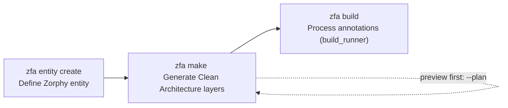

This page is your map of the `zfa` command-line interface — every command, flag, preset, and exit code that Zuraffa v5.1.0 exposes. You don't need to read source code to use the CLI; this reference is built directly from it, so what you see here is exactly what the tool does. If you haven't run your first command yet, start with [Quick Start](2-quick-start) and come back here when you want the full command surface.

## The Three Executables

Zuraffa ships three executables in the `bin/` directory, and each serves a different audience. The `zfa` and `zuraffa` binaries share the exact same entry point — `zfa` is simply the shorter name you will type every day. The MCP server is a separate JSON-RPC process that exposes the same generation capabilities to AI coding agents.

| Executable | Source | Purpose |
|---|---|---|
| `zfa` | [bin/zfa.dart](bin/zfa.dart#L1-L12) | Shorthand CLI — the command you use in daily work |
| `zuraffa` | [bin/zuraffa.dart](bin/zuraffa.dart#L1-L11) | Full-name alias; identical behavior to `zfa` |
| `zuraffa_mcp_server` | [bin/zuraffa_mcp_server.dart](bin/zuraffa_mcp_server.dart#L1-L40) | MCP server for AI agents (stdin/stdout JSON-RPC) |

Both `zfa` and `zuraffa` delegate to the same `run()` function, so everything documented below applies to either name. Sources: [bin/zfa.dart](bin/zfa.dart#L1-L12), [bin/zuraffa.dart](bin/zuraffa.dart#L1-L11), [lib/src/zfa_cli.dart](lib/src/zfa_cli.dart#L1-L15)

## Command Landscape

```mermaid
flowchart TB
    ZFA["zfa — Zuraffa CLI v5.1.0"]
    ZFA --> CORE["Core Commands<br/>(registered by the CLI runner)"]
    ZFA --> PLUGIN["Plugin Commands<br/>(registered by installed plugins)"]

    CORE --> MAKE["make — canonical generator"]
    CORE --> ENT["entity — Zorphy entities"]
    CORE --> FEAT["feature — preset wrapper"]
    CORE --> BUILD["build — build_runner wrapper"]
    CORE --> CONF["config — .zfa.json management"]
    CORE --> DOC["doctor — environment health"]
    CORE --> MAN["manifest — capability listing"]
    CORE --> APL["apply — replay saved plans"]
    CORE --> SCH["schema / validate — config tooling"]
    CORE --> INIT["initialize — sample entity"]
    CORE --> CREATE["create — legacy folders/pages"]
    CORE --> PLG["plugin — enable/disable plugins"]

    PLUGIN --> P1["usecase, repository, datasource"]
    PLUGIN --> P2["view, presenter, controller, state, observer"]
    PLUGIN --> P3["di, route, test, mock, cache, sync"]
    PLUGIN --> P4["service, provider, api, gql, graphql"]
    PLUGIN --> P5["shadcn, strategy, method_append, feature"]
```

Commands fall into two groups. **Core commands** are registered directly by the CLI runner and cover the whole-project workflow (entities, generation, build, config, health). **Plugin commands** are created dynamically from installed generator plugins — each plugin registers itself as a top-level command (for example, the `usecase` plugin registers `zfa usecase`). Because of this split, the top-level `zfa --help` output is deliberately concise; plugin commands advertise their own help via `zfa <command> --help`.



The core commands are registered in [lib/src/cli/cli_runner.dart](lib/src/cli/cli_runner.dart#L48-L75), and the plugin set comes from the loader in [lib/src/cli/plugin_loader.dart](lib/src/cli/plugin_loader.dart#L74-L132).

### Core commands at a glance

| Command | Description | Key detail |
|---|---|---|
| `make <Name>` | Canonical architecture/code generation | `--preset`, `--with`, `--plan` |
| `feature <Name>` | Wrapper over `make --preset=feature` | modes: scaffold, route, di, ... |
| `entity` | Create and manage Zorphy entities | alias: `zfa z` |
| `build` | Run `build_runner build` with auto-clean retry | `--clean` |
| `config` | Manage `.zfa.json` defaults | `init`, `show`, `set` |
| `doctor` | Inspect tooling and environment health | runs `dart analyze` |
| `manifest` | List all available capabilities | `--format json\|mcp` |
| `apply` | Execute a previously generated plan | `--plan-id` (required) |
| `schema` | Output JSON Schema for config files | machine-readable |
| `validate <file>` | Validate a JSON configuration file | JSON result output |
| `initialize` | Create a sample `Product` entity | `--entity`, `--dry-run` |
| `create` | Legacy: architecture folders or a page | `zfa create create ...` |
| `plugin` | List, enable, or disable plugins | `list`, `enable <id>`, `disable <id>` |

Sources: [lib/src/cli/cli_runner.dart](lib/src/cli/cli_runner.dart#L230-L268), [lib/src/commands/initialize_command.dart](lib/src/commands/initialize_command.dart#L1-L30)

## Global Behavior: Help, Version, and Exit Codes

Before diving into individual commands, three global behaviors are worth knowing because they shape every interaction.

**Help and version.** Running `zfa` with no arguments prints the top-level help. `zfa --help` (or `-h`) does the same, and every subcommand accepts `--help` for its own usage text. The version flag prints the current release: `zfa --version`, `zfa -v`, or `zfa version` all output `zfa v5.1.0` followed by `Zuraffa Code Generator`. Note that `-v` means *version* at the top level, but *verbose logging* inside subcommands such as `make`. Sources: [lib/src/cli/cli_runner.dart](lib/src/cli/cli_runner.dart#L22-L34), [lib/src/cli/cli_runner.dart](lib/src/cli/cli_runner.dart#L93-L99), [lib/src/version.dart](lib/src/version.dart#L1)

**Exit codes.** The CLI uses conventional exit codes so scripts and CI pipelines can react predictably:

| Exit code | Meaning | Trigger |
|---|---|---|
| `0` | Success | Command completed, or help/version printed |
| `1` | Runtime error | Generation failed, missing arguments, config errors |
| `2` | Argument format error | Legacy `create` command parsing failures |
| `64` | Usage error | `UsageException` (bad flag, unknown command) or the removed `generate` command |

The dispatch logic is in [lib/src/cli/cli_runner.dart](lib/src/cli/cli_runner.dart#L82-L117).

**The removed `generate` command.** If you type `zfa generate ...`, the CLI prints a message explaining that `generate` was removed in v5 and directs you to `zfa make <Name> ...` or `zfa feature <Name>`; it exits with code `64`. This is a deliberate migration guard. Sources: [lib/src/cli/cli_runner.dart](lib/src/cli/cli_runner.dart#L101-L104), [lib/src/cli/cli_runner.dart](lib/src/cli/cli_runner.dart#L271-L276)

**Suggestions on error.** When a command fails, the CLI consults a suggestion engine and prints `💡 Suggestions:` with actionable fixes. Adding `--verbose` (or `-v` inside a subcommand) prints a full stack trace. Sources: [lib/src/cli/cli_runner.dart](lib/src/cli/cli_runner.dart#L108-L117), [lib/src/cli/cli_runner.dart](lib/src/cli/cli_runner.dart#L135-L150)

## The Canonical Workflow: entity → make → build

Zuraffa v5 has one canonical three-step flow, and every other command exists to support it. Learning these three commands covers 90% of daily work.



| Step | Command | What it does |
|---|---|---|
| 1 | `zfa entity create` | Creates a Zorphy-annotated entity under `lib/src/domain/entities/` |
| 2 | `zfa make` | Resolves a normalized plan and generates use cases, repositories, views, DI, tests, and more |
| 3 | `zfa build` | Runs `build_runner` to generate the `.zorphy.dart` and JSON-serialization code |

Sources: [CLI_GUIDE.md](CLI_GUIDE.md#L5-L13)

## `zfa entity` — Step 1: Define Your Entity

The `entity` command manages Zorphy entities. It is a passthrough to the bundled Zorphy tooling, and in v5 the output location is fixed: `lib/src/domain/entities/{entity_snake}/{entity_snake}.dart`. The command also has the alias `z`, so `zfa z create ...` works identically. Sources: [lib/src/commands/entity_command.dart](lib/src/commands/entity_command.dart#L652-L699), [lib/src/cli/cli_runner.dart](lib/src/cli/cli_runner.dart#L126-L145)

| Subcommand | Description |
|---|---|
| `create` / `new` | Create a new entity with fields |
| `enum` | Create a Zorphy enum (`--value pending,paid,shipped`) |
| `add-field` | Add field(s) to an existing entity |
| `list` | List all Zorphy entities |
| `from-json` | Create an entity from a JSON file, inferring field types |

Sources: [lib/src/commands/entity_command.dart](lib/src/commands/entity_command.dart#L44-L61)

### `zfa entity create` options

| Option | Description | Default |
|---|---|---|
| `-n, --name` | Entity name (required) | — |
| `--field <name:type>` | Add one field; repeatable (`id:String`) | — |
| `-F, --fields` | Add multiple fields comma-separated | — |
| `--json` | Enable JSON serialization | `true` |
| `--filter` | Enable type-safe filters | `false` |
| `--copywith-fn` | Function-based `copyWith` | `false` |
| `--compare` | Enable `compareTo` | `true` |
| `--sealed` / `--non-sealed` | Create sealed / non-sealed class (polymorphism) | `false` |
| `--extends <iface>` | Interface to extend | — |
| `--subtypes <list>` | Explicit subtypes for sealed classes | — |
| `--generate-subs` | Generate subtype files | `false` |
| `--dry-run` | Preview without writing | `false` |
| `--build` / `--dart-format` | Auto-run `build_runner` / `dart format` after creation | config-driven |

The `--output` option is accepted for compatibility but ignored — entity paths are non-negotiable in v5. Sources: [lib/src/commands/entity_command.dart](lib/src/commands/entity_command.dart#L652-L699), [lib/src/commands/entity_command.dart](lib/src/commands/entity_command.dart#L100-L175)

```bash
# A classic CRUD entity
zfa entity create -n Product \
  --field id:String \
  --field name:String \
  --field price:double \
  --field description:String?

# A sealed entity for polymorphic variants
zfa entity create -n PaymentMethod --sealed --generate-subs

# An enum
zfa entity enum -n OrderStatus --value pending,paid,shipped

# Add a field later
zfa entity add-field -n Product --field category:String
```

For a deeper look at entity authoring, see [Zorphy Entity Creation](4-zorphy-entity-creation).

## `zfa make` — Step 2: The Canonical Generator

`zfa make` is the heart of Zuraffa v5. It takes an entity name, resolves a **normalized plan** (presets + explicit plugin IDs + aliases + flags), and then runs the selected generator plugins in dependency order. Its signature is:

```bash
zfa make <Name> <plugin1> <plugin2> ... [options]
```

Sources: [lib/src/commands/make_command.dart](lib/src/commands/make_command.dart#L40-L43), [lib/src/commands/make_command.dart](lib/src/commands/make_command.dart#L221-L240)

### How plugin selection works

You can drive the plan three ways, and they compose:

1. **Preset-first**: `--preset=crud` expands to a curated plugin set.
2. **Explicit plugins**: pass plugin IDs as positional arguments — `zfa make Product usecase repository`.
3. **Flag selection**: `--vpc`, `--state`, `--di`, `--test`, `--cache`, `--route`, `--mock`, `--gql` each add their plugin.
4. **Refinement**: `--with <alias>` adds groups, `--without <plugin>` removes them, and `--no-<plugin>` mutes a single plugin.

Every installed plugin also contributes a negatable flag, so `--no-route` works even when a preset requested routes. Sources: [lib/src/commands/make_command.dart](lib/src/commands/make_command.dart#L165-L220), [lib/src/core/planning/plan_resolver.dart](lib/src/core/planning/plan_resolver.dart#L23-L76)

### Presets

`--preset` expands to a fixed plugin list, defined in the preset registry:

| Preset | Plugins activated |
|---|---|
| `crud` | usecase, repository, datasource |
| `read-only` | usecase, repository, datasource |
| `feature` | usecase, repository, datasource, view, presenter, controller, state, di, test |
| `service-feature` | service, provider, usecase, view, presenter, controller, state, di, test |
| `adaptive-feature` / `platform-feature` | usecase, repository, datasource, view, presenter, controller, state, di, test, route |

Sources: [lib/src/core/planning/preset_registry.dart](lib/src/core/planning/preset_registry.dart#L7-L28)

### Aliases

`--with` accepts aliases that expand to plugin groups:

| Alias | Expands to |
|---|---|
| `data` | repository, datasource |
| `vpc` | view, presenter, controller |
| `full-ui` | view, presenter, controller, state, route |
| `quality` | test, mock, di |

Sources: [lib/src/core/planning/plugin_alias_resolver.dart](lib/src/core/planning/plugin_alias_resolver.dart#L3-L10)

### Core options

| Option | Description | Default |
|---|---|---|
| `--preset <name>` | Preset to expand | — |
| `--methods <list>` | Methods: `get,getList,create,update,delete,watch,watchList,toggle` | — |
| `--with <alias>` / `--without <plugin>` | Add / exclude plugin groups (repeatable) | — |
| `--plan` / `--explain` | Print the normalized plan and exit (no generation) | `false` |
| `--dry-run` | Simulate generation without writing files | `false` |
| `-f, --force` | Overwrite existing files | `false` |
| `--revert` | Delete files from a previous generation | `false` |
| `--format <text\|json>` | Output format | `text` |
| `-j, --from-json <file>` | Read a JSON config file | — |
| `--from-stdin` | Read a JSON config from stdin | — |
| `-v, --verbose` | Detailed logging (+ stack traces on error) | `false` |
| `-o, --output` | Ignored in v5 (fixed to `lib/src`) | `lib/src` |
| `--no-entity` | Skip entity prerequisites | `false` |
| `--append` | Append to existing repo/service | `false` |
| `--domain <folder>` | Domain subfolder for custom use cases | — |
| `--repo`, `--service` | Inject a specific repository / service | — |
| `--id-field`, `--id-field-type` | ID field name/type | `id`, `String` |
| `--query-field`, `--query-field-type` | Query field for get/watch methods | `id` |
| `--sync-batch-size` / `--sync-max-retries` | Sync tuning | `50` / `5` |

Sources: [lib/src/commands/make_command.dart](lib/src/commands/make_command.dart#L60-L160)

Plugin config schemas also add flags automatically — for example, the cache plugin contributes `--cache-policy` (`daily`, `restart`, `ttl`), `--cache-storage` (default `hive`), and `--ttl` (default `1440`). Sources: [lib/src/commands/make_command.dart](lib/src/commands/make_command.dart#L165-L220), [lib/src/plugins/cache/cache_plugin.dart](lib/src/plugins/cache/cache_plugin.dart#L58-L69)

### Plan inspection before generation

The most valuable v5 habit: preview the plan before generating.

```bash
# See what will run, without touching disk
zfa make Product --preset=crud --with=vpc --plan

# Same output in JSON for scripting / AI agents
zfa make Product --preset=crud --with=vpc --plan --format=json
```

`--plan` prints the preset (if any), the requested plugin IDs, the resolved plugin IDs (in dependency order), and any warnings about unknown presets or plugins. `--explain` currently produces the same normalized-plan output. Sources: [lib/src/commands/make_command.dart](lib/src/commands/make_command.dart#L221-L240), [lib/src/commands/make_command.dart](lib/src/commands/make_command.dart#L404-L425)

### Machine-readable input and output

Generation can be driven entirely from JSON — useful for scripts, CI, and AI agents:

```bash
# From a file
zfa make --from-json make_config.json --plan --format=json

# From stdin
cat make_config.json | zfa make --from-stdin --plan --format=json
```

A minimal config file looks like:

```json
{
  "name": "Product",
  "preset": "crud",
  "with": ["vpc"],
  "methods": ["get", "getList", "create", "update", "delete"]
}
```

With `--format=json`, the success output is structured as `{"success": true, "plan": {...}, "files": [...], "warnings": [...]}` — files carry their action (`created`, `overwritten`, `skipped`, `deleted`) so automation can verify results. Sources: [lib/src/commands/make_command.dart](lib/src/commands/make_command.dart#L301-L330), [lib/src/commands/make_command.dart](lib/src/commands/make_command.dart#L427-L470)

### Common `make` examples

```bash
# Domain + data layer only
zfa make Product --preset=crud --methods=get,getList,create,update,delete

# Full feature: presentation, state, DI, tests
zfa make Product --preset=crud --with=vpc --state --di --test

# Explicit plugin list (equivalent to preset + flags)
zfa make Product usecase repository datasource view presenter controller state di test

# Caching with a TTL policy
zfa make Product --methods=get,getList --cache --cache-policy=ttl --ttl=60

# Custom use case with no entity
zfa make SearchProducts usecase --domain=search --params=SearchQuery --returns=List<Product>
```

The deeper mechanics of plan resolution are covered in [Presets, Aliases & Plan Resolution](8-presets-aliases-and-plan-resolution), and the file-level pipeline in [Code Generation Pipeline: From CLI to Files](6-code-generation-pipeline-from-cli-to-files).

## `zfa build` — Step 3: Process Annotations

`zfa build` wraps `dart run build_runner build --delete-conflicting-outputs`. It counts entities and Dart files before building, and if the build fails it automatically cleans the `.dart_tool/build` cache and retries once — a common fix for stale-cache errors.

| Option | Description |
|---|---|
| `-c, --clean` | Delete the build cache *before* building |

Sources: [lib/src/commands/build_command.dart](lib/src/commands/build_command.dart#L15-L30), [lib/src/commands/build_command.dart](lib/src/commands/build_command.dart#L75-L103)

```bash
zfa build        # standard build with auto-retry
zfa build --clean  # force a cache clean first
```

## `zfa feature` — The Preset Wrapper

`zfa feature` is a convenience wrapper that translates to `zfa make --preset=feature`. The first positional argument selects a mode; the default is `scaffold`, which generates the complete feature.

```bash
zfa feature scaffold Product            # same as: zfa make Product --preset=feature
zfa feature route Product               # same as: zfa make Product --with=route
zfa feature di Product                  # same as: zfa make Product --with=di
```

| Mode | What it generates |
|---|---|
| `scaffold` (default) | Full feature preset (domain → data → presentation → DI → tests) |
| `route`, `di`, `mock`, `test` | Single add-on layer |
| `view`, `presenter`, `controller`, `state` | Single presentation layer |

The wrapper's flags mirror `make` (`--vpcs`, `--repository`, `--datasource`, `--di`, `--cache`, `--mock`, `--local`, `--use-service`, `--route`, `--test`, `-m/--methods`, `-u/--usecases`, plus the standard `--dry-run`, `--force`, `--revert`, `--plan`, `--explain`, `--format`). The `feature` command is primarily a convenience for humans; documentation, scripts, and AI agents should prefer `zfa make` for explicit, teachable workflows. Sources: [lib/src/commands/feature_command.dart](lib/src/commands/feature_command.dart#L1-L100), [lib/src/commands/feature_command.dart](lib/src/commands/feature_command.dart#L200-L273)

## Configuration & Environment Commands

These commands manage the project environment around generation.

### `zfa config` — project defaults

`config` manages `.zfa.json` at the project root. Subcommands: `init`, `show` (alias `get`), and `set <key> <value>`.

| Key | Type | Purpose |
|---|---|---|
| `buildByDefault` | bool | Auto-run `build_runner` after entity/cache operations |
| `formatByDefault` | bool | Auto-run `dart format` after generation |
| `filterByDefault` | bool | Type-safe filters on entities by default |
| `entityFirst` | bool | Require entities before entity-aware generation |
| `<plugin>ByDefault` | bool | Enable a plugin by default during plan resolution (e.g. `diByDefault`) |

```bash
zfa config init
zfa config show
zfa config set diByDefault true
zfa config set entityFirst true
```

Unknown keys are rejected with the list of valid keys. Sources: [lib/src/commands/config_command.dart](lib/src/commands/config_command.dart#L15-L60), [lib/src/commands/config_command.dart](lib/src/commands/config_command.dart#L100-L190)

### `zfa doctor` — environment health

`doctor` prints a health report: Zuraffa CLI version, Dart and Flutter versions, presence of `.zfa.json` and `pubspec.yaml`, Zuraffa and `zorphy_annotation` dependencies, whether the `zorphy` CLI is globally installed (optional — `zfa entity` is bundled), and a dead-code analysis via `dart analyze`. Sources: [lib/src/commands/doctor_command.dart](lib/src/commands/doctor_command.dart#L17-L110)

```bash
zfa doctor
```

### `zfa plugin` — plugin management

| Subcommand | Description |
|---|---|
| `list` | List all plugins with `[✓]`/`[ ]` enabled status and versions |
| `enable <id>` | Enable a plugin (removes from disabled set) |
| `disable <id>` | Disable a plugin (persists to config) |

Sources: [lib/src/commands/plugin_command.dart](lib/src/commands/plugin_command.dart#L10-L63)

### `zfa manifest` — capability discovery

`manifest` lists every plugin capability as JSON. With `--format=mcp` it emits the MCP `tools` shape (`name`, `description`, `inputSchema`) that MCP clients use for tool discovery. Sources: [lib/src/commands/manifest_command.dart](lib/src/commands/manifest_command.dart#L15-L63)

```bash
zfa manifest                 # full JSON capability list
zfa manifest --format=mcp    # MCP tools definition
```

### `zfa apply` — replay a saved plan

`apply` executes a plan previously saved to the plan store (e.g. by a `--dry-run` capability call). It requires `--plan-id`, validates the plan, runs its capability, lists created/modified files, and deletes the plan on success. Sources: [lib/src/commands/apply_command.dart](lib/src/commands/apply_command.dart#L12-L68)

```bash
zfa apply --plan-id <planId>
```

### `zfa schema` and `zfa validate` — config tooling

`schema` prints the JSON Schema (draft-07) describing valid `make` JSON configs — including the allowed method enum (`get`, `getList`, `create`, `update`, `delete`, `watch`, `watchList`) and cache policy enum. `validate <file>` parses a JSON config file and returns a machine-readable verdict: `{"valid": true, "name": ..., "methods": ...}` on success, or `{"valid": false, "error": ...}` on failure. Sources: [lib/src/commands/schema_command.dart](lib/src/commands/schema_command.dart#L6-L113), [lib/src/commands/validate_command.dart](lib/src/commands/validate_command.dart#L9-L49)

```bash
zfa schema > zfa.schema.json
zfa validate make_config.json
```

## Plugin Commands Quick Reference

Every generator plugin registers a top-level command (`zfa <plugin-id> <Name> [options]`) with standard flags: `-o/--output` (ignored in v5), `--dry-run`, `-f/--force`, `-v/--verbose`, `--revert`. Capabilities within a plugin appear as subcommands (for example, `zfa usecase create`).

| Command | Plugin | Generates |
|---|---|---|
| `usecase` | UseCasePlugin | Use case classes |
| `repository` | RepositoryPlugin | Repository interface + implementation |
| `datasource` | DataSourcePlugin | Remote/local data sources |
| `service` / `provider` | ServicePlugin, ProviderPlugin | Service and provider classes |
| `view`, `presenter`, `controller`, `state`, `observer` | corresponding plugins | Presentation layer files |
| `di` | DiPlugin | `get_it` DI registrations |
| `route` | RoutePlugin | Route definitions |
| `test` | TestPlugin | Unit tests |
| `mock` | MockPlugin | Mock data and providers |
| `cache` | CachePlugin | Caching layer (dual data sources) |
| `sync` | SyncPlugin | Offline-first sync layer |
| `gql` / `graphql` | GqlPlugin, GraphqlPlugin | GraphQL operations |
| `api` | ApiPlugin | API bridge integrations |
| `shadcn`, `strategy`, `method_append`, `feature` | respective plugins | UI components, strategies, method appending, feature bundles |

Sources: [lib/src/commands/base_plugin_command.dart](lib/src/commands/base_plugin_command.dart#L17-L50), [lib/src/cli/plugin_loader.dart](lib/src/cli/plugin_loader.dart#L74-L132)

Individual plugin details live in their own pages — for example [Plugin System Architecture](7-plugin-system-architecture) and [Building Custom Plugins](22-building-custom-plugins).

## Where to Go Next

You now know the full command surface. Suggested reading order:

1. [Quick Start](2-quick-start) — run your first generation end-to-end if you haven't yet
2. [Generated Project Layout](5-generated-project-layout) — see where each generated file lands
3. [Code Generation Pipeline: From CLI to Files](6-code-generation-pipeline-from-cli-to-files) — what happens inside `zfa make`
4. [Presets, Aliases & Plan Resolution](8-presets-aliases-and-plan-resolution) — how `--plan` output is decided
5. [Project Memory & Configuration](25-project-memory-and-configuration) — `.zfa.json` and the `.zfa/` directory
6. [MCP Server & AI Agent Workflows](24-mcp-server-and-ai-agent-workflows) — if you want agents to drive these commands