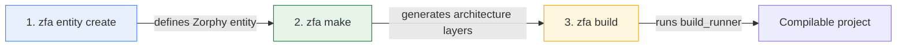
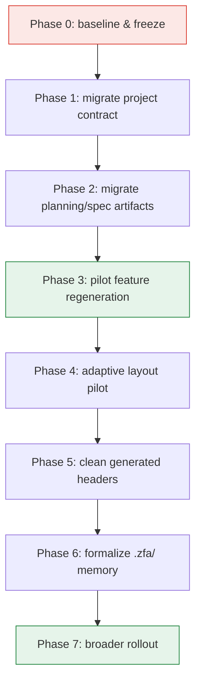

This page explains what changes when you move a project from Zuraffa v4 to v5, why the v5 contract exists, and how to migrate an existing codebase incrementally without a big-bang rewrite. It covers the removed legacy generator, the new three-step canonical workflow, the `.zfa.json` config shape change, the new `.zfa/` project memory surface, and a phased playbook validated against a real downstream app migration.

## Why v5 exists: retiring the one-shot generator

Zuraffa v4 exposed multiple competing generation paths — `zfa generate`, `zfa feature`, `zfa make`, and direct plugin commands — each with its own flag combinations and implicit modes. For human developers this meant ambiguity; for AI agents it caused orchestration drift, because no single documented path was authoritative. The v5 foundation spec identifies this directly: "Multiple competing generation paths (`generate`, `feature`, `make`, direct plugin commands) are the primary source of agent hesitation and orchestration drift."

Sources: [specs/007-zuraffa-v5-foundation/spec.md](specs/007-zuraffa-v5-foundation/spec.md#L17-L19)

V5 responds by removing `zfa generate` entirely and establishing one canonical, AI-first generation contract. The release defines success not by feature count but by consistency: every AI-facing surface teaches the same pipeline, active/public repo surfaces no longer teach legacy workflows, `.zfa/` is intentionally useful, and the MCP server drives the same flow as the CLI.

Sources: [doc/V5_ACTION_PLAN.md](doc/V5_ACTION_PLAN.md#L12-L20)

## The v5 canonical pipeline

The heart of the migration is a mental model shift: v4's single "generate everything" command becomes a deterministic three-step workflow. Each step has a distinct responsibility — define the entity, generate the architecture, then compile the annotated code.



Step 1 creates the entity under the fixed location `lib/src/domain/entities/{entity_snake}/{entity_snake}.dart`. Step 2 resolves a normalized generation plan from presets, aliases, `.zfa.json` defaults, and explicit flags, then runs only the plugins selected by that plan. Step 3 invokes `build_runner` (with automatic cache-clean retry on failure) to materialize Zorphy-generated code.

Sources: [CHANGELOG.md](CHANGELOG.md#L208-L235), [lib/src/commands/build_command.dart](lib/src/commands/build_command.dart#L21-L46)

The canonical contract is enforced as a hard invariant: `ProjectContextStore.defaultContext()` encodes the workflow `['zfa entity create', 'zfa make', 'zfa build']`, and a regression test asserts that the README, AGENTS.md, SKILL.md, and website docs all teach the same three steps.

Sources: [test/regression/v5_pipeline_contract_test.dart](test/regression/v5_pipeline_contract_test.dart#L31-L52)

## Breaking changes

Three categories of breaking change affect migrating projects. Each is enforced in code, not just documented.

| Removed in v5 | v4 behavior | v5 replacement |
|---|---|---|
| `zfa generate` command | One-shot generation of a partial feature | `zfa make <Name> --preset=...` or `zfa feature <Name>` |
| Custom path overrides (`--domain-root`, `--entity-output`, `--output`) | Configurable domain/output directories | Fixed contract: domain at `lib/src/domain`, entities at `lib/src/domain/entities/{snake}/{snake}.dart`, output at `lib/src` |
| Legacy flag combinations and implicit generation modes | Flags implied layers without explicit selection | Explicit `--preset`, `--with`, `--without` resolution |
| `zuraffa_generate` MCP tool | MCP advertised and invoked the legacy generator | `zuraffa_make` tool translating to `zfa make` |

Sources: [CHANGELOG.md](CHANGELOG.md#L195-L206), [bin/zuraffa_mcp_server.dart](bin/zuraffa_mcp_server.dart#L292-L294)

The removal of `zfa generate` is a **fast-fail**, not a silent no-op. `CliRunner` intercepts any invocation whose first argument is `generate` before command dispatch and prints an explicit migration message: "The 'generate' command was removed in Zuraffa v5. Use `zfa make <Name> ...` for canonical generation." This guarantees migrating users receive actionable guidance at the exact moment they hit the breaking change.

Sources: [lib/src/cli/cli_runner.dart](lib/src/cli/cli_runner.dart#L175-L177), [lib/src/cli/cli_runner.dart](lib/src/cli/cli_runner.dart#L238-L246)

On the config side, the fixed-path contract is enforced twice: `MakeCommand` hardcodes `fixedOutputDir = 'lib/src'` and silently ignores legacy JSON keys like `domainRoot`, `domainOutput`, `entityOutput`, and `output`, while `ZfaConfig` declares `fixedDomainRoot` and `fixedEntityOutput` as constants that cannot be overridden.

Sources: [lib/src/commands/make_command.dart](lib/src/commands/make_command.dart#L14-L26), [lib/src/config/zfa_config.dart](lib/src/config/zfa_config.dart#L10-L11)

## Command and flag translation

The table below maps the most common v4 invocations to their v5 equivalents. The semantic change is that v4's `--with-view` implied a single presentation scaffold, while v5's `--with=vpc` expands through an alias resolver into three explicit plugins (view, presenter, controller) and composes with `--state`, `--di`, and `--test` as independent flags.

| Concern | v4 (legacy) | v5 (canonical) |
|---|---|---|
| Generate a feature | `zfa generate Feedback --with-view --with-state --with-di --with-tests` | `zfa make Feedback --preset=crud --with=vpc --state --di --test` |
| Define the entity first | implicit inside generate | `zfa entity create -n Product --field id:String --field name:String` |
| Select the architecture pattern | implicit | `--preset=crud` |
| Presentation layer | `--with-view` | `--with=vpc` (alias → view + presenter + controller) |
| State class | `--with-state` | `--state` |
| Dependency injection | `--with-di` | `--di` |
| Tests | `--with-tests` | `--test` |
| Specify operations | `--methods=create,get,getList` | `--methods=create,get,getList` (now fully honored) |
| Compile generated code | not required | `zfa build` |

Sources: [docs/v4_vs_v5_comparison.md](docs/v4_vs_v5_comparison.md#L1-L24), [lib/src/core/planning/plugin_alias_resolver.dart](lib/src/core/planning/plugin_alias_resolver.dart#L3-L6)

The alias system (`data`, `vpc`, `full-ui`, `quality`) plus built-in presets in `PresetRegistry` (`crud`, `feature`, `read-only`, `service-feature`, `adaptive-feature`, `platform-feature`) give you composable generation patterns. Custom presets and aliases can be declared in `.zfa.json` under `planning.presets` and `planning.aliases`, and the resolver merges them over the built-ins.

Sources: [lib/src/core/planning/preset_registry.dart](lib/src/core/planning/preset_registry.dart#L5-L27), [lib/src/config/zfa_config.dart](lib/src/config/zfa_config.dart#L219-L255)

## Migrating `.zfa.json`: from flat to nested

V4 stored configuration as flat top-level keys such as `diByDefault`, `routeByDefault`, and `mockByDefault`. V5 reorganizes the same decisions into a nested shape with four sections — `plugins`, `planning`, `ui`, and `entity` — plus two top-level booleans for build/format behavior.

```json
{
  "plugins": {
    "defaults": {
      "di": true,
      "test": true,
      "method_append": true,
      "route": false,
      "mock": false,
      "gql": false,
      "cache": false
    },
    "disabled": ["graphql"]
  },
  "planning": {
    "presets": {},
    "aliases": {}
  },
  "ui": {
    "adaptiveLayouts": true,
    "platformShells": true,
    "layoutTargets": ["mobile", "tablet", "desktop", "macos"],
    "adaptivePreset": "adaptive-feature"
  },
  "entity": {
    "entityFirst": true,
    "jsonByDefault": true,
    "compareByDefault": true,
    "filterByDefault": true
  },
  "buildByDefault": false,
  "formatByDefault": false
}
```

Sources: [CHANGELOG.md](CHANGELOG.md#L236-L276), [doc/ZIK_ZAK_V5_MIGRATION_PLAN.md](doc/ZIK_ZAK_V5_MIGRATION_PLAN.md#L75-L124)

| Config decision | v4 flat key | v5 nested key |
|---|---|---|
| DI generation default | `diByDefault` | `plugins.defaults.di` |
| Route generation default | `routeByDefault` | `plugins.defaults.route` |
| Mock generation default | `mockByDefault` | `plugins.defaults.mock` |
| Test generation default | `testByDefault` | `plugins.defaults.test` |
| Disabled plugins | `disabledPlugins` | `plugins.disabled` |
| Custom presets | `presets` | `planning.presets` |
| Adaptive layouts | — (new in v5) | `ui.adaptiveLayouts` / `ui.layoutTargets` |
| Entity JSON methods | `jsonByDefault` | `entity.jsonByDefault` |

There is a deliberate backward-compatibility bridge: `ZfaConfig.fromJson` still reads legacy flat keys via `_legacyPluginDefaults` and `pluginIdForConfigKey`, mapping `diByDefault` → `di`, `appendByDefault` → `method_append`, and so on. This means a v4 config does not crash v5 — but it is deprecated, and migrating to the nested shape is a required step in the upgrade path.

Sources: [lib/src/config/zfa_config.dart](lib/src/config/zfa_config.dart#L219-L255), [lib/src/config/zfa_config.dart](lib/src/config/zfa_config.dart#L333-L347)

The reference v5 shape is exercised by the example project's `.zfa.json`, and a regression test asserts it contains the `plugins`, `planning`, `ui`, and `entity` sections with `plugins.defaults` present — guarding the contract against future drift.

Sources: [example/.zfa.json](example/.zfa.json#L1-L33), [test/regression/v5_pipeline_contract_test.dart](test/regression/v5_pipeline_contract_test.dart#L66-L78)

## Seeding `.zfa/`: the new project memory surface

V5 introduces `.zfa/` as a first-class project memory directory that lets a second agent session (or a returning developer) resume work without re-reading all generated source. It stores generation plans, execution logs, blueprints, decision records, feature manifests, and a machine-readable project context.

```
.zfa/
├── plans/          # Generation plans from `zfa make --plan`
├── runs/           # Execution logs and results
├── blueprints/     # Architectural blueprints and patterns
├── decisions/      # Architectural decision records (ADRs)
├── manifests/      # Feature manifests
└── context.json    # Project context and state
```

Sources: [CHANGELOG.md](CHANGELOG.md#L277-L292), [doc/ZFA_MEMORY_GUIDE.md](doc/ZFA_MEMORY_GUIDE.md#L10-L26)

`context.json` is the entry point for agents: it records the project name, the architecture contract (`"contract": "entity_create_make_build"`), the fixed domain roots, and a feature ledger (`existing`, `migrated`, `pending`) so a migration's progress is inspectable at a glance.

Sources: [doc/ZFA_MEMORY_GUIDE.md](doc/ZFA_MEMORY_GUIDE.md#L32-L47)

For migration, seeding `.zfa/` is Phase 1 of the downstream playbook: run at least one representative `zfa make` flow so the project gains `plans/`, `runs/`, and `context.json` before any large-scale source migration begins.

Sources: [doc/ZIK_ZAK_V5_MIGRATION_PLAN.md](doc/ZIK_ZAK_V5_MIGRATION_PLAN.md#L60-L124)

## What changes in generated output

Beyond commands and config, v5 changes what lands on disk. A side-by-side regeneration of the same Feedback entity in the `zik_zak` app showed that v5 produces a more complete, production-ready architecture:

| Generated artifact | v4 output | v5 output |
|---|---|---|
| UseCases | Only `create_feedback_usecase.dart` | All requested methods: `create`, `get`, `get_list` usecases |
| Adaptive layouts | None | 8 platform layouts (mobile/tablet/desktop/macOS × list/detail) + 2 barrel files |
| DI registration | Single usecase wired | Per-usecase DI files + updated index files |
| Tests | Not generated for the feature | `get`/`get_list` usecase tests, all passing |
| File statistics | — | 17 created, 8 overwritten, 6 skipped |

Sources: [docs/v4_vs_v5_comparison.md](docs/v4_vs_v5_comparison.md#L400-L460)

Two structural observations matter for migration planning. First, v5 groups usecases under `usecases/{entity_snake}/` rather than scattering them flat, and it generates DI registration per usecase. Second, with `ui.adaptiveLayouts` enabled, the presentation layer gains a `layouts/` subfolder containing platform-specific variants while presenter, controller, and state remain shared — this is the "shared logic, divergent layout" model that replaces v4's manual platform splitting (e.g., hand-maintained `macos_views/*` folders).

Sources: [docs/v4_vs_v5_comparison.md](docs/v4_vs_v5_comparison.md#L30-L60), [doc/ZIK_ZAK_V5_MIGRATION_PLAN.md](doc/ZIK_ZAK_V5_MIGRATION_PLAN.md#L172-L196)

The v5 comparison also documented three template-level issues found during downstream validation — broken `ValueKey` string literals in layout files, an entity name conflicting with Flutter's `Feedback` widget (requiring an import alias), and initially incomplete method generation in presenters/controllers. These were fixed in the downstream project and are flagged as template improvement candidates, so plan a small manual-review pass on your first regenerated feature.

Sources: [docs/v4_vs_v5_comparison.md](docs/v4_vs_v5_comparison.md#L244-L285)

## The migration playbook

The migration strategy is deliberately incremental. The `zik_zak` downstream migration plan states the principles explicitly: do not big-bang rewrite, migrate the project contract before regenerating large slices, use one small pilot feature first, and preserve hand-authored UI until the v5 adaptive path is proven.

Sources: [doc/ZIK_ZAK_V5_MIGRATION_PLAN.md](doc/ZIK_ZAK_V5_MIGRATION_PLAN.md#L28-L36)



| Phase | What you do | Exit criterion |
|---|---|---|
| 0 — Baseline & freeze | Create a migration branch; record `flutter analyze`/`flutter test` baselines; inventory `zfa generate`, `--vpcs`, `zuraffa_generate` references | Migration baseline report + high-risk feature list |
| 1 — Project contract | Rewrite `AGENTS.md` to the v5 pipeline; convert `.zfa.json` to the nested shape; seed `.zfa/` with one representative run | v5 contract in place before source migration |
| 2 — Planning artifacts | Replace `zfa generate` with `zfa make` in `specs/*/quickstart.md`, `tasks.md`, `plan.md`, `research.md` | Future agents stop learning the old workflow |
| 3 — Pilot feature | Regenerate one contained feature (e.g., `feedback`, `locale`, `customer`) with `zfa make`; compare old vs new; keep hand-authored details | One real feature slice proven under v5 |
| 4 — Adaptive layout pilot | Move one small slice (profile/feedback/login) to shared logic + `layouts/` + `AdaptiveViewState` + fallback resolution | v5 platform/layout story proven downstream |
| 5 — Header cleanup | Update generated comments still mentioning `zfa generate`; remove stale planning references | Source tree matches the actual toolchain |
| 6 — Memory formalization | Write `.zfa/blueprints/` and `.zfa/decisions/` (manual UI zones, platform shell strategy) | Agents can resume without rediscovering intent |
| 7 — Broader rollout | Migrate remaining features and complex domains (`listing`, `chat_session`, `grocery_*`, `barcode_*`) | App-wide v5 contract |

Sources: [doc/ZIK_ZAK_V5_MIGRATION_PLAN.md](doc/ZIK_ZAK_V5_MIGRATION_PLAN.md#L38-L58), [doc/ZIK_ZAK_V5_MIGRATION_PLAN.md](doc/ZIK_ZAK_V5_MIGRATION_PLAN.md#L126-L171), [doc/ZIK_ZAK_V5_MIGRATION_PLAN.md](doc/ZIK_ZAK_V5_MIGRATION_PLAN.md#L197-L249)

Success is defined concretely: the project teaches the v5 pipeline in guidance, uses the v5 `.zfa.json` shape, has a seeded `.zfa/` memory surface, has at least one feature regenerated with `zfa make`, validates one platform-divergent screen against the adaptive layout model, and no longer teaches removed generator commands.

Sources: [doc/ZIK_ZAK_V5_MIGRATION_PLAN.md](doc/ZIK_ZAK_V5_MIGRATION_PLAN.md#L250-L259)

## Migration support and estimated effort

The official upgrade path from v4.x is a six-step sequence: update `pubspec.yaml` to `zuraffa: ^5.0.0`, run `flutter pub get`, update `.zfa.json` to the v5 shape, update project docs to remove legacy commands, seed the `.zfa/` directory structure, then regenerate features incrementally with `zfa make`.

Sources: [CHANGELOG.md](CHANGELOG.md#L480-L495)

Effort scales with project size rather than code volume: small projects (1–5 features) take 1–2 hours, medium projects (5–15 features) 4–8 hours, and large projects (15+ features) are expected to migrate incrementally over multiple sessions. The key insight is that most of the work is contract and guidance migration — the regeneration itself is fast and incremental.

Sources: [doc/V5_COMPLETION_SUMMARY.md](doc/V5_COMPLETION_SUMMARY.md#L110-L130)

## Backward compatibility and known limitations

Two compatibility facts reduce migration risk. First, legacy flat `.zfa.json` keys are still parsed (though deprecated), so a v4 config degrades gracefully. Second, the `--output` flag still exists on `zfa make` but is documented as "fixed to lib/src in v5; custom values are ignored" — the option is retained for interface stability while the value is forced.

Sources: [lib/src/config/zfa_config.dart](lib/src/config/zfa_config.dart#L333-L347), [lib/src/commands/make_command.dart](lib/src/commands/make_command.dart#L58-L66)

Three known limitations define the boundary of what v5 automates today. `.zfa/` artifact writing is manual (auto-write of plans, run logs, and `context.json` updates is deferred to v5.1.x). GraphQL support is disabled by default with full support planned for v5.1.x. And the automated migration tool itself — `zfa migrate` (rewriting legacy `.zfa.json`, detecting old command references, seeding `.zfa/`, and emitting a migration report) — is a v5.1.x SHOULD, meaning v4→v5 migration is currently a guided manual process rather than a one-command conversion.

Sources: [CHANGELOG.md](CHANGELOG.md#L466-L479), [doc/V5_ACTION_PLAN.md](doc/V5_ACTION_PLAN.md#L118-L130)

## Validation and guard rails

The v5 contract is protected by regression tests that run in CI, so a future regression to v4-style behavior fails loudly. `v5_pipeline_contract_test.dart` verifies the canonical workflow in project context and core docs, asserts the MCP server advertises `zuraffa_make` and translates it to `['make', name]`, checks the example config uses the v5 shape, and scans active/public surfaces (README, AGENTS.md, CLI_GUIDE.md, website docs, example code) for forbidden legacy tokens including `zfa generate`, `zuraffa_generate`, and `--vpcs`.

Sources: [test/regression/v5_pipeline_contract_test.dart](test/regression/v5_pipeline_contract_test.dart#L80-L113), [bin/zuraffa_mcp_server.dart](bin/zuraffa_mcp_server.dart#L1094-L1095)

These tests are part of the documented validation commands for the release: `flutter test test/regression/v5_pipeline_contract_test.dart test/regression/docs_command_consistency_test.dart` plus `dart analyze` on the core command files. After migrating your project, running the same suite locally confirms your workspace matches the v5 contract.

Sources: [doc/V5_COMPLETION_SUMMARY.md](doc/V5_COMPLETION_SUMMARY.md#L96-L108)

## Next steps

- If you are still evaluating what v5 changes in the architecture itself, review [Code Generation Pipeline: From CLI to Files](6-code-generation-pipeline-from-cli-to-files) and [Presets, Aliases & Plan Resolution](8-presets-aliases-and-plan-resolution), which explain the plan-resolution mechanics your migration depends on.
- To understand the generated runtime your regenerated features will use, see [UseCase Hierarchy & the Result Pattern](10-usecase-hierarchy-and-the-result-pattern) and [Presentation Layer: Controller, View & Presenter](12-presentation-layer-controller-view-and-presenter).
- For the adaptive layout model that replaces manual platform splitting, see [Adaptive Layouts & Platform Shells](20-adaptive-layouts-and-platform-shells).
- To leverage the `.zfa/` memory surface for agent continuity, see [Project Memory & Configuration](25-project-memory-and-configuration).