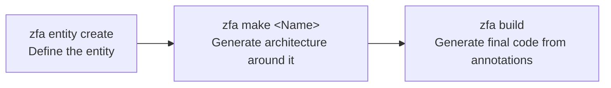

Entities are the starting point of every Zuraffa v5 project. This page is your complete, beginner-friendly guide to defining domain models with **Zorphy** — the entity system Zuraffa uses to create immutable, type-safe, AI-friendly data classes. By the end, you will know how to create an entity, which field types you can use, what code Zorphy generates for you, and how the entity feeds the rest of the generation pipeline. The command surface is documented fully in [CLI Command Reference](3-cli-command-reference); here we focus on *authoring entities* — the syntax, the output, and the mental model.

## Why Zorphy?

Zuraffa did not invent its own entity format — it adopted an existing one. Architecture Decision Record 005 records the decision to make **Zorphy the default entity and patch system**, chosen over alternatives like Freezed or hand-written classes. The rationale was threefold: Zuraffa needed a consistent entity model with typed fields, a typed patch-update mechanism (instead of loose partial maps), and typed filters for querying. Zorphy provides all three out of the box. Sources: [005-zorphy-choice.md](doc/adr/005-zorphy-choice.md#L7-L17)

The decision is baked into Zuraffa's defaults. The configuration system sets `entityFirst: true` and `zorphyOnly: true` by default, meaning Zuraffa assumes you will define entities first and that Zorphy is the only entity format in play. This is why the workflow you will see everywhere is *entity first, architecture second*: a single entity file drives use cases, repositories, views, DI, and tests. Sources: [zfa_config.dart](lib/src/config/zfa_config.dart#L52-L53), [zfa_config.dart](lib/src/config/zfa_config.dart#L248-L249)

**Why this matters to you as a beginner:** you never hand-write immutable classes, `copyWith` methods, or JSON serialization. You declare *what* your domain object looks like with a few CLI flags, and Zorphy writes the repetitive Dart. This predictability also matters for AI agents — a Zorphy entity has a fixed, recognizable structure that tools can parse reliably. Sources: [005-zorphy-choice.md](doc/adr/005-zorphy-choice.md#L19-L23)

## The Canonical Three-Step Flow

Entity creation is step one of the canonical Zuraffa v5 flow. The full pipeline (entity → make → build) is covered in the [CLI Command Reference](3-cli-command-reference), but here is the shape of it:



| Step | Command | What happens |
|---|---|---|
| 1 | `zfa entity create` | Writes a Zorphy-annotated abstract class under `lib/src/domain/entities/` |
| 2 | `zfa make <Name>` | Reads that entity and generates use cases, repositories, views, DI, tests |
| 3 | `zfa build` | Runs `build_runner` to produce the final immutable class and JSON code |

The entity you create in step 1 is deliberately minimal — it is a *definition*, not the finished class. The finished class appears only after step 3. This two-stage design (definition file + generated files) is the key mental model for this page. Sources: [005-zorphy-choice.md](doc/adr/005-zorphy-choice.md#L11-L14)

## The Entity Command Suite

Zuraffa exposes Zorphy through the `zfa entity` command, which also has the short alias `z` — `zfa z create` works identically. The command is registered by the CLI runner as a passthrough to Zuraffa's own `EntityCommand`, which in turn delegates the actual file writing to the Zorphy package. Sources: [cli_runner.dart](lib/src/cli/cli_runner.dart#L306-L328)

| Subcommand | Purpose | Quick example |
|---|---|---|
| `create` / `new` | Create a new entity with fields | `zfa entity create -n Product --field name:String` |
| `enum` | Create a type-safe enum | `zfa entity enum -n OrderStatus --value pending,shipped` |
| `add-field` | Add fields to an existing entity | `zfa entity add-field -n Product --field sku:String` |
| `list` | List all entities in your project | `zfa entity list` |
| `from-json` | Infer an entity from a JSON file | `zfa entity from-json api_response.json --name Product` |

The subcommand dispatch lives in the `switch` at the top of `EntityCommand.execute`. Sources: [entity_command.dart](lib/src/commands/entity_command.dart#L44-L65), [entity_command.dart](lib/src/commands/entity_command.dart#L652-L697)

### The location contract

In v5 the output location is **fixed and non-negotiable**:

```text
lib/src/domain/entities/{entity_snake}/{entity_snake}.dart
```

For example, an entity named `Product` lands at `lib/src/domain/entities/product/product.dart`. The `--output` flag is still accepted by the CLI for compatibility but silently ignored — the constant `fixedEntityOutput` (`lib/src/domain/entities`) is always used. This matters because every downstream tool (the `make` command, the mock builder, the entity analyzer) expects entities at exactly this path. Sources: [entity_command.dart](lib/src/commands/entity_command.dart#L9-L10), [entity_command.dart](lib/src/commands/entity_command.dart#L144), [zfa_config.dart](lib/src/config/zfa_config.dart#L12-L14)

## Creating Your First Entity

### Step 0: The pre-flight check

Before writing anything, `zfa entity` checks your `pubspec.yaml` for two required dependencies: `zorphy_annotation` (the annotation package) and `build_runner` (the code generator driver). If either is missing, it prints the exact `dart pub add` commands to run — or points you to `zfa doctor`. This guard runs before *every* entity subcommand, so you cannot silently create a broken project. Sources: [entity_command.dart](lib/src/commands/entity_command.dart#L84-L129)

```bash
dart pub add zorphy_annotation
dart pub add dev:build_runner
```

### Step 1: The create command

```bash
zfa entity create -n Product \
  --field id:String \
  --field name:String \
  --field price:double \
  --field stock:int \
  --field description:String?
```

The `-n`/`--name` flag is the only required option. Each `--field` flag adds one field in `name:type` format; you can repeat it, or pass several at once with `-F`/`--fields` as a comma-separated list. Field definitions are parsed by `FieldDefinition.parse`, with a "smart split" that respects angle brackets — so `List<String>` and `Map<String,dynamic>` are handled correctly even though they contain commas. Sources: [entity_command.dart](lib/src/commands/entity_command.dart#L131-L148), [entity_command.dart](lib/src/commands/entity_command.dart#L514-L538), [entity_command.dart](lib/src/commands/entity_command.dart#L554-L575)

### Step 2: What appears on disk

The create command builds an `EntityConfig` (name, fields, toggles) and hands it to Zorphy's `EntityCreator`, which normalizes the field types, resolves imports, renders the template, and writes the file. On success the CLI prints the file path, the parsed fields, and your next two steps. Sources: [entity_command.dart](lib/src/commands/entity_command.dart#L152-L187)

A single create produces one *definition* file plus two placeholders that `zfa build` fills in later:

```text
lib/src/domain/entities/product/
├── product.dart          # definition (written by zfa entity create)
├── product.zorphy.dart   # generated immutable class (written by zfa build)
└── product.g.dart        # JSON serialization (written by zfa build)
```

The definition file itself is surprisingly small. Here is the entire `product.dart` from the example project:

```dart
import 'package:zorphy_annotation/zorphy.dart';

part 'product.zorphy.dart';
part 'product.g.dart';

@Zorphy(generateJson: true, generateFilter: true)
abstract class $Product {
  String get id;
  String get name;
  String get description;
  double get price;
  DateTime get createdAt;
}
```

Sources: [product.dart](example/lib/src/domain/entities/product/product.dart#L1-L13)

Notice three things. First, the class is named `$Product` — the `$` prefix marks it as the *abstract definition*. Zorphy reads this definition and generates the concrete class `Product` (no prefix) in `product.zorphy.dart`. Second, fields are declared as getters, not constructor parameters — the abstract class only declares the shape. Third, the `part` directives declare where the generated code will live. The `@Zorphy(...)` annotation carries the generation options. Sources: [ENTITY_GUIDE.md](doc/ENTITY_GUIDE.md#L5-L9)

## Field Types

Zorphy fields use standard Dart type syntax, so most of what you know transfers directly.

### Basic types

| Type | CLI example | Notes |
|---|---|---|
| `String` | `--field name:String` | Text |
| `int` | `--field age:int` | Whole numbers |
| `double` | `--field price:double` | Decimal numbers |
| `bool` | `--field isActive:bool` | True/false |
| `DateTime` | `--field createdAt:DateTime` | Serialized to ISO 8601 strings |

### Nullable fields

Append `?` to any type. Nullability flows through the generated code: `copyWith` and patch logic handle `null` safely, and `fromJson` accepts missing keys. Sources: [entity-commands.md](website/docs/cli/entity-commands.md#L21-L25)

```bash
zfa entity create -n Profile \
  --field nickname:String \
  --field bio:String? \
  --field age:int?
```

### Collections

`List`, `Set`, and `Map` are all supported, including deeply nested combinations. The smart-split parser keeps generics intact. Sources: [entity_command.dart](lib/src/commands/entity_command.dart#L554-L575)

```bash
# Lists of primitives and of nested entities
--field tags:List<String>
--field items:List<$OrderItem>

# Maps
--field metadata:Map<String,dynamic>
--field settings:Map<String,bool>
```

### Nested entities (the `$` prefix)

To reference another Zorphy entity as a field type, prefix its name with `$`:

```bash
# 1. Create the child entity first
zfa entity create -n Address --field street:String --field city:String

# 2. Reference it in the parent
zfa entity create -n User --field name:String --field address:$Address
```

The `$` tells Zorphy *and* Zuraffa "this is another Zorphy entity". During creation, the import resolver detects that `Address` exists under `lib/src/domain/entities/address/` and adds the relative import automatically — you never manage cross-entity imports by hand. Sources: [entity_command.dart](lib/src/commands/entity_command.dart#L279-L291), [ENTITY_GUIDE.md](doc/ENTITY_GUIDE.md#L156-L165)

### Enums, generics, and self-referencing

The same field syntax covers advanced shapes:

| Pattern | CLI example | Use case |
|---|---|---|
| Enum field | `--field status:OrderStatus` | Fixed states (create the enum first) |
| Generic | `--field data:T?` | Reusable wrappers like `ApiResponse<T>` |
| Self-reference | `--field children:List<$Category>?` | Trees and category hierarchies |

Enums deserve their own section below. For generics, note that the concrete class becomes generic too — `ApiResponse<String>` — which is a natural consequence of declaring `T` in the definition. Sources: [ENTITY_GUIDE.md](doc/ENTITY_GUIDE.md#L280-L300)

## What Zorphy Generates For You

After `zfa build` runs, the `product.zorphy.dart` file contains the real, usable `Product` class. The build command simply wraps `dart run build_runner build --delete-conflicting-outputs`, and both the root `build.yaml` and the example project's `build.yaml` wire the `zorphy:zorphy` builder alongside `json_serializable`. Sources: [build_command.dart](lib/src/commands/build_command.dart#L54-L64), [build.yaml](build.yaml#L1-L15)

Here is the generated surface, mapped to the example product:

| Generated member | What it does | Example location |
|---|---|---|
| `class Product` | The concrete immutable class with `final` fields and a constructor | [product.zorphy.dart](example/lib/src/domain/entities/product/product.zorphy.dart#L12-L25) |
| `copyWith(...)` | Returns a copy with selected fields replaced | [product.zorphy.dart](example/lib/src/domain/entities/product/product.zorphy.dart#L27-L41) |
| `patchWithProduct(...)` | Applies a typed `ProductPatch` to an instance | [product.zorphy.dart](example/lib/src/domain/entities/product/product.zorphy.dart#L59-L61) |
| `factory Product.fromJson(...)` | Deserializes from a JSON map | [product.zorphy.dart](example/lib/src/domain/entities/product/product.zorphy.dart#L138-L141) |
| `toJson()` / `toJsonLean()` | Serializes to JSON (lean strips `__typename`) | [product.zorphy.dart](example/lib/src/domain/entities/product/product.zorphy.dart#L162-L163) |
| `enum Product$` | Field-name constants used by patches and filters | [product.zorphy.dart](example/lib/src/domain/entities/product/product.zorphy.dart#L183-L183) |
| `class ProductPatch` | Fluent typed patch builder (`withId`, `withName`, ...) | [product.zorphy.dart](example/lib/src/domain/entities/product/product.zorphy.dart#L183-L213) |
| `ProductFields` | Static `Field` descriptors for query construction | [product.zorphy.dart](example/lib/src/domain/entities/product/product.zorphy.dart#L215-L233) |
| `compareToProduct(...)` | Field-by-field diff for update operations | [product.zorphy.dart](example/lib/src/domain/entities/product/product.zorphy.dart#L235-L255) |

The `product.g.dart` file holds only the JSON plumbing — a hand-written `fromJson` would look almost identical, which is the point: you get battle-tested serialization without writing it. DateTimes become ISO 8601 strings, enums become their string names, and nested entities recursively call their own `toJson`/`fromJson`. Sources: [product.g.dart](example/lib/src/domain/entities/product/product.g.dart#L10-L23), [field-types.md](website/docs/entities/field-types.md#L52-L59)

**The two-line mental model:** `zfa entity create` writes the *abstract definition*; `zfa build` turns it into the *concrete class* plus JSON, patches, and query descriptors. You edit the definition, never the generated files — rerun `zfa build` to regenerate.

## Enums

Fixed-value states belong in enums, created with the `enum` subcommand:

```bash
zfa entity enum -n OrderStatus --value pending,processing,shipped,delivered
```

This writes a plain Dart enum to `lib/src/domain/entities/enums/order_status.dart` and automatically updates the barrel file `enums/index.dart` with an `export` — so every entity can import enums through one line. Sources: [entity_command.dart](lib/src/commands/entity_command.dart#L190-L223), [ENTITY_GUIDE.md](doc/ENTITY_GUIDE.md#L196-L222)

```text
lib/src/domain/entities/enums/
├── index.dart               # auto-updated barrel: export 'order_status.dart';
└── order_status.dart        # enum OrderStatus { pending, processing, ... }
```

Once the enum exists, reference it in an entity by plain name:

```bash
zfa entity create -n Account --field username:String --field status:OrderStatus
```

Zuraffa recognizes that `OrderStatus` is an enum (not an entity) and adds `import '../enums/index.dart';` to the entity file automatically. Sources: [entity_command.dart](lib/src/commands/entity_command.dart#L349-L351)

## Sealed Classes & Polymorphism

When a domain concept has distinct variants — a payment method that is either credit card, PayPal, or bank transfer — use a **sealed class**:

```bash
zfa entity create -n PaymentMethod --sealed
```

The `--sealed` flag changes the definition class prefix from `$` to `$$`, which signals "this abstract class has implementations". For a sealed root, `product.g.dart` is not generated (you cannot deserialize an abstract type directly). You can also declare the variants up front with `--subtypes`, or create them separately with `--extends`:

```bash
zfa entity create -n CreditCard --field cardNumber:String --extends:$$PaymentMethod
zfa entity create -n PayPal --field email:String --extends:$$PaymentMethod
```

The result is a type-safe hierarchy you can exhaustively `switch` over in Dart — the compiler will warn you if a variant is missing. The `--non-sealed` variant of the same idea (abstract but open to outside implementations) is used for shared interfaces like `Timestamped` or `Identifiable`. Sources: [ENTITY_GUIDE.md](doc/ENTITY_GUIDE.md#L224-L258), [entity_command.dart](lib/src/commands/entity_command.dart#L159-L160)

## Evolving Entities After Creation

Entities are not static. Three subcommands cover the lifecycle:

**`add-field`** grows an existing entity without manual editing:

```bash
zfa entity add-field -n Product --field stock:int --field sku:String
```

The command locates the entity file, normalizes the new fields, inserts the getters, and re-runs the same auto-import resolution as `create`. Afterward, run `zfa build` to regenerate the concrete class with the new members. Sources: [entity_command.dart](lib/src/commands/entity_command.dart#L225-L264)

**`list`** inventories your project's entities and annotates their capabilities — it checks each definition for `generateJson: true` (✓ JSON support) and `abstract class $$` (🔒 Sealed class). Sources: [entity_command.dart](lib/src/commands/entity_command.dart#L379-L406)

**`from-json`** is the fastest onboarding path when you have an API response: it reads a JSON file, infers Dart types per field (`int`, `double`, `bool`, `String`, `DateTime` when the string parses as one), and even creates `$`-prefixed nested entities for nested objects and `List<$X>` for arrays of maps. Field names ending in `?` become nullable. Sources: [entity_command.dart](lib/src/commands/entity_command.dart#L408-L449), [entity_command.dart](lib/src/commands/entity_command.dart#L583-L623)

```bash
zfa entity from-json product_api_response.json --name Product
```

## Entity Creation Options Reference

The full option set for `zfa entity create`:

| Option | Description | Default |
|---|---|---|
| `-n, --name` | Entity name (required) | — |
| `--field <name:type>` | Add one field; repeatable | — |
| `-F, --fields` | Multiple fields, comma-separated | — |
| `--json` | Enable JSON serialization (generates `.g.dart`) | `true` |
| `--filter` | Generate type-safe filter classes | `false` |
| `--copywith-fn` | Function-based `copyWith` style | `false` |
| `--compare` | Generate `compareTo` diff methods | `true` |
| `--sealed` | Sealed abstract class (`$$` prefix) | `false` |
| `--non-sealed` | Non-sealed abstract class | `false` |
| `--extends <iface>` | Interface/class the entity implements | — |
| `--subtypes <list>` | Explicit subtype declarations | — |
| `--generate-subs` | Generate subtype files | `false` |
| `--dry-run` | Preview without writing | `false` |
| `--build` | Run `build_runner` immediately after creation | config-driven |
| `--dart-format` | Run `dart format` after creation | config-driven |

Sources: [entity_command.dart](lib/src/commands/entity_command.dart#L652-L697)

Several defaults are configurable through `.zfa.json` rather than flags: `filterByDefault` turns on `--filter` for every entity, and `buildByDefault`/`formatByDefault` make `--build`/`--dart-format` automatic. So a team that always wants filters can set it once instead of typing `--filter` forever. Sources: [entity_command.dart](lib/src/commands/entity_command.dart#L149-L150), [zfa_config.dart](lib/src/config/zfa_config.dart#L78-L85)

## Next Steps

You now know how to define an entity and what Zorphy does with it. The recommended reading order continues with the rest of the Get Started section, then branches into the deep dives that build on this foundation:

1. [Generated Project Layout](5-generated-project-layout) — where every generated layer lives and how the entity directory fits the whole tree.
2. [Code Generation Pipeline: From CLI to Files](6-code-generation-pipeline-from-cli-to-files) — how `zfa make` consumes your entity and drives the plugin system.
3. [Dependency Injection Generation](17-dependency-injection-generation) — how entities become `get_it` registrations.
4. [Mock Data Generation](18-mock-data-generation) — how the entity's fields are turned into realistic test data.

If you are using an AI agent, the correct instruction to hand off after entity creation is: *"Use `zfa make` to generate the CRUD architecture for this entity, then run `zfa build`."* That one sentence keeps the agent aligned with the v5 public contract. Sources: [intro.md](website/docs/entities/intro.md#L78-L85)