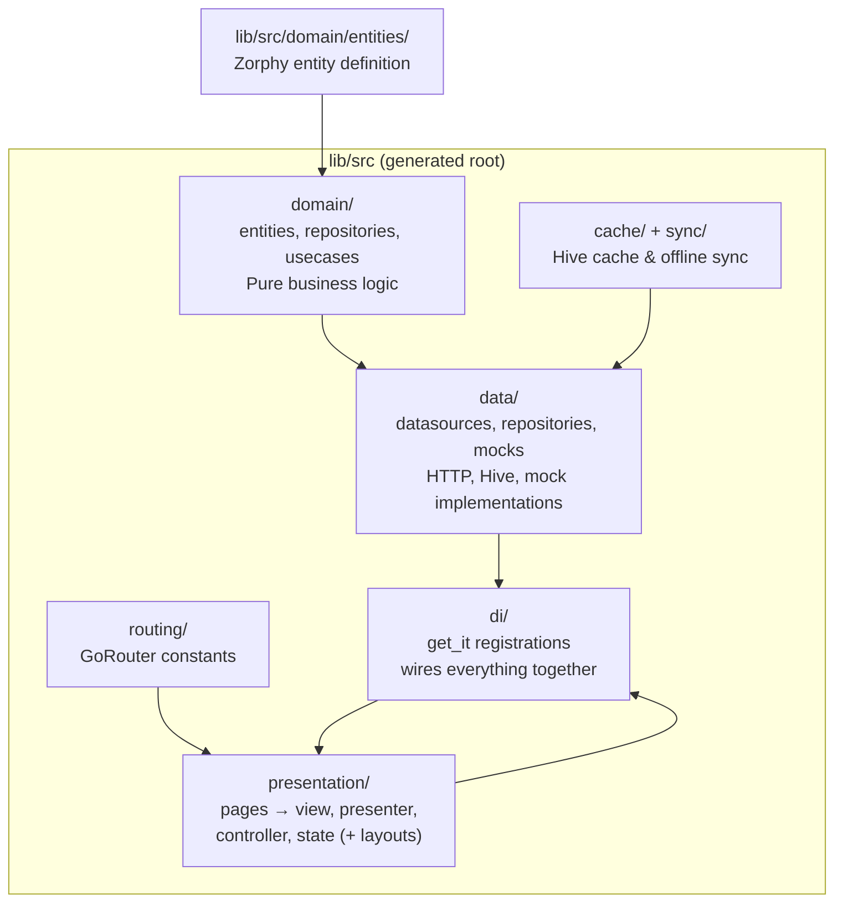

This page is your **map of what Zuraffa produces**. After you run `zfa entity create` and `zfa make`, files appear in a fixed, predictable structure under `lib/src`. Understanding this layout matters because Zuraffa's core design principle is predictability — the same input always produces the same output, and every file has a well-defined home. By the end of this page you'll be able to open any Zuraffa-generated project and know exactly what each folder contains, which layers depend on which, and how the pieces connect into a working Flutter app.

Sources: [README.md](README.md#L31-L45), [openwiki/architecture.md](openwiki/architecture.md#L1-L27)

## The Big Picture: One Project, Six Concern Areas

Zuraffa generates a **Clean Architecture** Flutter app. Clean Architecture separates code by responsibility so that your business rules (domain) never depend on UI widgets or database details. Zuraffa's generated layout mirrors this with six top-level concern areas inside `lib/src`, plus supporting files outside it. Here is the conceptual map:



The direction of the arrows matters: **domain knows nothing about data or presentation**. The domain layer declares abstract contracts (repositories, use cases); the data layer implements them; the presentation layer consumes them through the DI layer, which wires concrete implementations together at app startup. The `di/` folder is the glue — it is generated last and its `index.dart` barrel is called from `main()` to register every dependency.

Sources: [openwiki/architecture.md](openwiki/architecture.md#L8-L27), [example/lib/src/di/index.dart](example/lib/src/di/index.dart#L1-L16), [example/lib/main.dart](example/lib/main.dart#L15-L31)

## The Fixed Root: Everything Lives Under `lib/src`

Every generated file lands under the fixed output root `lib/src` — this constant is hard-coded in the generator (`fixedOutputDir = 'lib/src'`), so you never configure where feature code goes. Here is the annotated tree of a real generated project (the bundled `example` app), with the Todo entity shown as the running example:

```text
lib/
└── src/
    ├── domain/                          # Pure business logic (no Flutter imports)
    │   ├── entities/
    │   │   └── todo/
    │   │       ├── todo.dart            # Zorphy-annotated entity definition
    │   │       ├── todo.zorphy.dart     # GENERATED: full class (copyWith, JSON…)
    │   │       └── todo.g.dart          # GENERATED: JSON serialization
    │   ├── repositories/
    │   │   └── todo_repository.dart     # Abstract interface (contract)
    │   ├── usecases/
    │   │   └── todo/
    │   │       ├── get_todo_usecase.dart
    │   │       ├── create_todo_usecase.dart
    │   │       └── …                    # one file per method
    │   └── domain.dart                  # Barrel export of the layer
    ├── data/                            # Implementations of domain contracts
    │   ├── datasources/
    │   │   └── todo/
    │   │       ├── todo_datasource.dart        # Abstract datasource contract
    │   │       ├── todo_remote_datasource.dart # HTTP calls
    │   │       ├── todo_local_datasource.dart  # Hive local storage
    │   │       └── todo_mock_datasource.dart   # Simulated latency/data
    │   ├── repositories/
    │   │   └── data_todo_repository.dart       # Implements TodoRepository
    │   └── mock/
    │       └── todo_mock_data.dart     # Sample data for the mock datasource
    ├── presentation/                    # Flutter UI layer
    │   └── pages/
    │       └── todo/
    │           ├── todo_view.dart        # CleanView widget
    │           ├── todo_presenter.dart   # Orchestrates use cases
    │           ├── todo_controller.dart  # State + actions (ChangeNotifier)
    │           ├── todo_state.dart       # Immutable UI state
    │           └── layouts/              # ONLY with adaptive presets
    │               ├── todo_mobile_layout.dart
    │               ├── todo_tablet_layout.dart
    │               ├── todo_desktop_layout.dart
    │               ├── todo_macos_layout.dart
    │               └── todo_layouts.dart # Barrel of all layouts
    ├── di/                              # get_it dependency injection
    │   ├── service_locator.dart         # Global GetIt instance
    │   ├── datasources/  ── index.dart  # Per-layer registration files
    │   ├── repositories/ ── index.dart
    │   └── usecases/     ── index.dart
    ├── routing/                         # GoRouter constants
    │   ├── app_routes.dart
    │   ├── todo_routes.dart
    │   └── index.dart
    ├── cache/                           # ONLY with --cache (Hive)
    │   ├── todo_cache.dart
    │   ├── hive_registrar.dart
    │   ├── daily_cache_policy.dart
    │   └── index.dart                   # initAllCaches() entry point
    └── sync/                            # ONLY with --sync (offline-first)
        └── todo_sync.dart               # Hive box init for sync metadata
```

This exact structure is enforced by the regression suite: a test generates a `Product` feature and asserts that files like `domain/repositories/product_repository.dart`, `data/datasources/product/product_remote_datasource.dart`, `presentation/pages/product/product_view.dart`, and `di/repositories/product_repository_di.dart` all exist in precisely these locations.

Sources: [lib/src/models/generator_config.dart](lib/src/models/generator_config.dart#L7-L14), [example/lib/src](example/lib/src#L1-L25), [test/regression/file_structure_test.dart](test/regression/file_structure_test.dart#L7-L33)

## Layer by Layer: What Lives Where

### Domain — the pure business core

The domain layer is where generation always starts. Each entity gets a folder under `lib/src/domain/entities/{entity_snake}/` containing three files with the same base name:

| File | Who writes it | Purpose |
|---|---|---|
| `todo.dart` | `zfa entity create` | Hand-readable definition: `@Zorphy(...) abstract class $Todo { … }` |
| `todo.zorphy.dart` | `zfa build` (build_runner) | The concrete `Todo` class with `copyWith`, `patchWith`, equality, filters |
| `todo.g.dart` | `zfa build` (build_runner) | `json_serializable` output for JSON encode/decode |

Your source of truth is always the tiny `todo.dart` — you write only the abstract getters, and the Zorphy generator expands them into the full immutable class. Beside entities, the domain layer holds the **repository interface** (e.g., `TodoRepository` with `get`, `getList`, `create`, `update`, `delete`, `watch`, `watchList`) and one **use case class per method** under `domain/usecases/{entity_snake}/`. The barrel file `domain.dart` re-exports the layer so other layers import a single entry point.

Sources: [example/lib/src/domain/entities/todo/todo.dart](example/lib/src/domain/entities/todo/todo.dart#L1-L13), [example/lib/src/domain/entities/todo/todo.zorphy.dart](example/lib/src/domain/entities/todo/todo.zorphy.dart#L1-L17), [example/lib/src/domain/repositories/todo_repository.dart](example/lib/src/domain/repositories/todo_repository.dart#L1-L14), [example/lib/src/domain/domain.dart](example/lib/src/domain/domain.dart#L1-L15)

### Data — implementing the contracts

The data layer provides concrete implementations of the domain contracts. Each entity gets a `data/datasources/{entity_snake}/` folder with up to four datasource files, distinguished by suffix:

| File suffix | Role | Typical backing |
|---|---|---|
| `_datasource.dart` | Abstract contract (base) | Throws `UnimplementedError` per method |
| `_remote_datasource.dart` | Network access | HTTP / REST / GraphQL |
| `_local_datasource.dart` | Device persistence | Hive boxes |
| `_mock_datasource.dart` | Simulated behavior | In-memory `TodoMockData` lists + artificial delay |

The concrete repository `data/repositories/data_todo_repository.dart` implements the domain interface and **coordinates remote and local sources** — a pattern Zuraffa calls the *Dual DataSource Pattern*: check the cache policy, try local, fall back to remote, then refresh local and mark the cache fresh. Mock sample data lives separately under `data/mock/{entity_snake}_mock_data.dart`, providing ready-made lists, a single sample, and large generated lists for performance testing.

Sources: [example/lib/src/data/datasources/todo/todo_datasource.dart](example/lib/src/data/datasources/todo/todo_datasource.dart#L1-L34), [example/lib/src/data/repositories/data_todo_repository.dart](example/lib/src/data/repositories/data_todo_repository.dart#L1-L35), [example/lib/src/data/mock/todo_mock_data.dart](example/lib/src/data/mock/todo_mock_data.dart#L1-L44), [openwiki/data-layer.md](openwiki/data-layer.md#L8-L37)

### Presentation — view, presenter, controller, state

Every UI feature lives in `presentation/pages/{entity_snake}/`. Zuraffa's `vpc` alias (View + Presenter + Controller) produces four coordinated files:

| File | Base class | Responsibility |
|---|---|---|
| `todo_view.dart` | `CleanView` | Widget that builds the UI and creates the controller |
| `todo_controller.dart` | `Controller` + `StatefulController<TodoState>` | Executes presenter methods, updates state, notifies the view |
| `todo_presenter.dart` | `Presenter` | Registers use cases and maps them to typed methods |
| `todo_state.dart` | plain immutable class | Holds `error`, lists, and per-operation `isXxx` flags with `copyWith` |

The dependency flow is one-directional: `View → Controller → Presenter → UseCase → Repository`. The controller never touches use cases directly — the presenter exposes friendly methods like `getTodoList()` that wrap use-case calls and return `Result<T, AppFailure>`. The state class is immutable; every UI change creates a new state via `copyWith`, and `updateState()` notifies the view to rebuild.

Sources: [example/lib/src/presentation/pages/todo/todo_view.dart](example/lib/src/presentation/pages/todo/todo_view.dart#L1-L45), [example/lib/src/presentation/pages/todo/todo_controller.dart](example/lib/src/presentation/pages/todo/todo_controller.dart#L1-L30), [example/lib/src/presentation/pages/todo/todo_presenter.dart](example/lib/src/presentation/pages/todo/todo_presenter.dart#L1-L32), [example/lib/src/presentation/pages/todo/todo_state.dart](example/lib/src/presentation/pages/todo/todo_state.dart#L1-L45)

### DI, routing, cache, and sync — the supporting layers

Four generated folders complete the picture, each with its own entry point:

| Folder | Entry point | What it wires |
|---|---|---|
| `di/` | `service_locator.dart` (GetIt) + `index.dart` (`setupDependencies()`) | Registers datasources, repositories, and use cases as lazy singletons |
| `routing/` | `app_routes.dart` + `index.dart` | GoRouter path constants and `goToXxx()` context extensions per entity |
| `cache/` | `index.dart` (`initAllCaches()`) | Opens Hive boxes per entity; `hive_registrar.dart` registers adapters |
| `sync/` | `sync/index.dart` | Opens sync-metadata boxes; strategy + metadata-store files live under `data/datasources/{entity}/` |

The DI folder is organized exactly like the rest of the app — `di/datasources/`, `di/repositories/`, `di/usecases/` — each containing per-entity registration files plus an `index.dart` barrel. The routing folder generates `app_routes.dart` (app-level constants), a per-entity `{entity}_routes.dart`, and a barrel. Cache and sync folders only appear when you enable those features (`--cache`, `--sync`), keeping the default layout lean.

Sources: [example/lib/src/di/service_locator.dart](example/lib/src/di/service_locator.dart#L1-L7), [example/lib/src/di/index.dart](example/lib/src/di/index.dart#L1-L16), [example/lib/src/routing/app_routes.dart](example/lib/src/routing/app_routes.dart#L1-L22), [example/lib/src/cache/index.dart](example/lib/src/cache/index.dart#L1-L25), [lib/src/plugins/sync/builders/sync_builder.dart](lib/src/plugins/sync/builders/sync_builder.dart#L1-L45)

### Outside `lib/src`: tests and project memory

Two important outputs live outside the feature root. Generated **unit tests** go to `test/domain/usecases/{entity_snake}/` — one `*_test.dart` per use case, using `mocktail` to stub the repository and asserting success/failure branches. Project **memory** lives in `.zuraffa/plans/` (e.g., `last_run_Concert.json`): every generation run persists its resolved plan, which is what makes `--revert` and plan preview possible. And `.zfa.json` at the project root stores your generation preferences — which plugins are on by default, custom presets/aliases, adaptive-layout settings, and entity defaults.

Sources: [lib/src/plugins/test/builders/test_builder_custom.dart](lib/src/plugins/test/builders/test_builder_custom.dart#L13-L27), [example/test/domain/usecases/todo/get_todo_usecase_test.dart](example/test/domain/usecases/todo/get_todo_usecase_test.dart#L1-L20), [lib/src/core/project/project_paths.dart](lib/src/core/project/project_paths.dart#L9-L35), [example/.zfa.json](example/.zfa.json#L1-L33)

## What Shapes the Layout: Presets, Aliases, and Flags

The layout you get depends on which generation **presets** and **aliases** you pass to `zfa make`. Presets bundle plugins into ready-made feature sets:

| Preset | Plugins included | Typical use |
|---|---|---|
| `crud` | usecase, repository, datasource | Backend-only skeleton |
| `feature` | crud + view, presenter, controller, state, di, test | Full stack UI feature |
| `adaptive-feature` | feature + route (enables layouts) | Multi-platform app |
| `platform-feature` | same as adaptive-feature | Alias-style variant |
| `service-feature` | service, provider + feature set | Service-driven features |
| `read-only` | usecase, repository, datasource | Get/watch only |

Aliases let you expand common combinations with one word — `vpc` means view + presenter + controller; `data` means repository + datasource; `full-ui` adds state and route; `quality` bundles test, mock, and di. Individual flags like `--state`, `--di`, `--test`, `--cache`, `--sync`, and `--graphql` toggle single plugins on top of a preset.

Sources: [lib/src/core/planning/preset_registry.dart](lib/src/core/planning/preset_registry.dart#L1-L85), [lib/src/core/planning/plugin_alias_resolver.dart](lib/src/core/planning/plugin_alias_resolver.dart#L1-L55)

## Adaptive Layouts: When `presentation/pages/` Grows a `layouts/` Folder

With the `adaptive-feature` or `platform-feature` preset (or the `--adaptive-layouts` flag), each entity's page folder gains a `layouts/` subfolder containing one layout file per target platform plus a barrel:

```text
presentation/pages/todo/
├── todo_view.dart / todo_presenter.dart / todo_controller.dart / todo_state.dart
└── layouts/
    ├── todo_mobile_layout.dart
    ├── todo_tablet_layout.dart
    ├── todo_desktop_layout.dart
    ├── todo_macos_layout.dart
    └── todo_layouts.dart          # exports all four
```

The insight behind this layout: **business logic stays shared** in the presenter/controller/state, while each platform layout only handles presentation. At runtime, `PlatformLayoutResolver` picks the right layout by walking a fallback chain: compound (`macos_desktop`) → platform (`macos`) → device (`desktop`) → generic (`default`). Targets default to `mobile, tablet, desktop, macos` and can be overridden with `--layout-targets` or `.zfa.json`.

Sources: [lib/src/plugins/view/builders/adaptive_layout_scaffold_builder.dart](lib/src/plugins/view/builders/adaptive_layout_scaffold_builder.dart#L20-L70), [lib/src/presentation/platform/platform_layout_resolver.dart](lib/src/presentation/platform/platform_layout_resolver.dart#L1-L73), [lib/src/config/zfa_config.dart](lib/src/config/zfa_config.dart#L9-L16), [website/docs/features/adaptive-layouts.md](website/docs/features/adaptive-layouts.md#L1-L60)

## Generated Code vs. Build Output: Two Writing Stages

A subtle but important distinction: `zfa` and `zfa build` write different files. `zfa entity create` and `zfa make` write **source files** — the entity definition, use cases, repositories, datasources, presentation, DI, and tests. `zfa build` then runs `build_runner` to produce the **generated parts** that complete each entity: `todo.zorphy.dart` (the concrete class with `copyWith`, patch support, and filters) and `todo.g.dart` (JSON serialization). Both are marked with `// GENERATED CODE` headers and must never be edited by hand — regenerate them with `zfa build` whenever you change the entity definition. Files generated by `zfa` carry the `// Generated by zfa` banner and record the exact command that produced them, which is a handy breadcrumb when you revisit a project later.

Sources: [example/lib/src/domain/entities/todo/todo.zorphy.dart](example/lib/src/domain/entities/todo/todo.zorphy.dart#L1-L17), [example/lib/src/domain/entities/todo/todo.dart](example/lib/src/domain/entities/todo/todo.dart#L1-L13), [example/lib/src/presentation/pages/todo/todo_controller.dart](example/lib/src/presentation/pages/todo/todo_controller.dart#L1-L5), [.zread/wiki/drafts/1-overview.md](.zread/wiki/drafts/1-overview.md#L35-L46)

## Next Steps

You now know *where* generated code lives. The natural next questions are *how it got there* and *how the pieces behave at runtime*:

- **[Code Generation Pipeline: From CLI to Files](6-code-generation-pipeline-from-cli-to-files)** — trace how `zfa make` turns flags into the file tree you just explored.
- **[Plugin System Architecture](7-plugin-system-architecture)** — each folder in the layout is produced by a dedicated plugin; learn how they cooperate.
- **[Presets, Aliases & Plan Resolution](8-presets-aliases-and-plan-resolution)** — dive deeper into the preset/alias mechanics that shape the layout.
- **[UseCase Hierarchy & the Result Pattern](10-usecase-hierarchy-and-the-result-pattern)** — understand the types you saw in `domain/usecases/` and `presentation/`.
- **[Presentation Layer: Controller, View & Presenter](12-presentation-layer-controller-view-and-presenter)** — the runtime behavior behind the `pages/` folder.