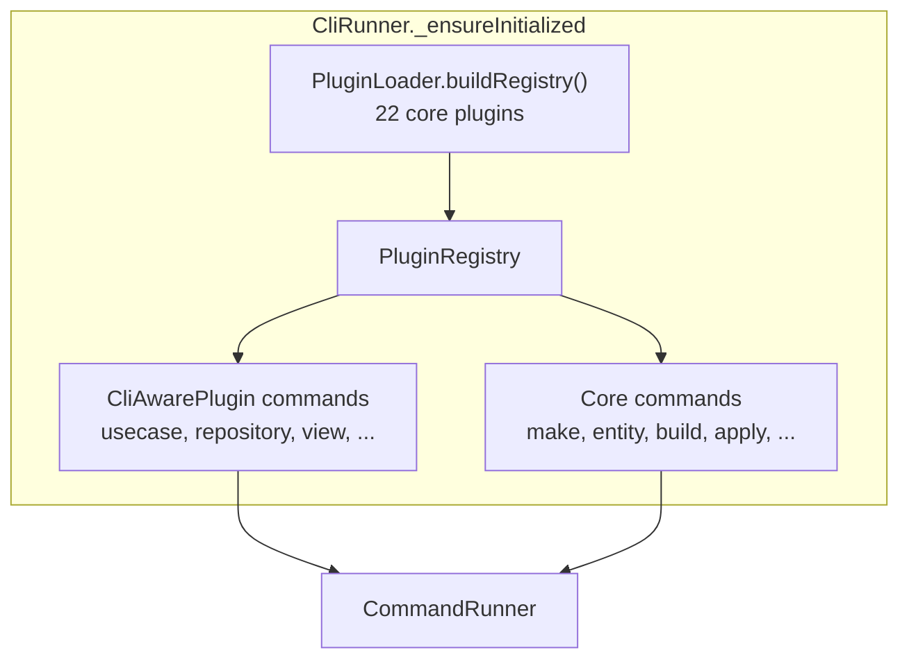
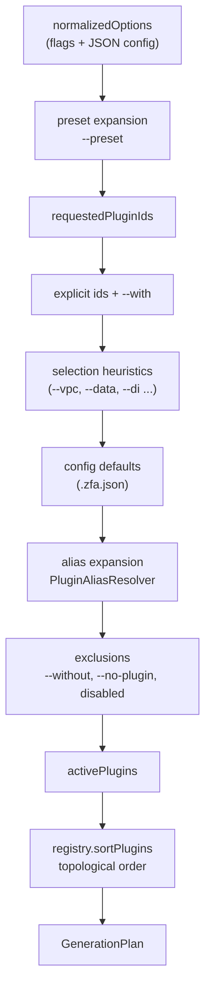
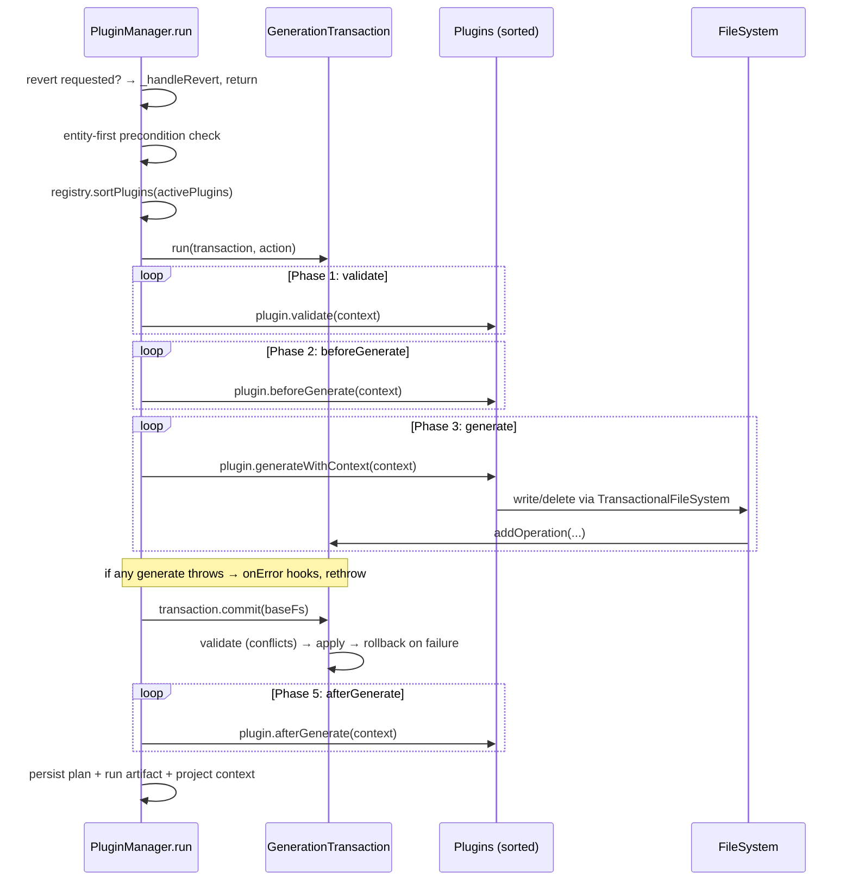
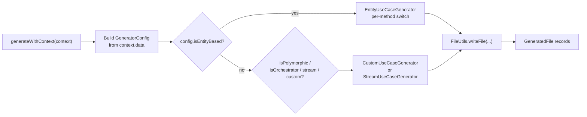

Every Zuraffa generation — whether triggered by `zfa make User di`, `zfa feature Hotel`, or `zfa apply --plan-id ...` — travels the same architectural journey: a terminal command is parsed, a plugin execution plan is resolved, plugins generate in-memory file operations, and a transactional layer atomically writes them to disk. This page traces that journey stage by stage: from the `zfa` binary down to the `GeneratedFile` records that land in your `lib/` tree. It focuses on the *mechanics of the pipeline itself*; the plugin contracts and the transactional store are covered in depth on their own pages.

## Pipeline at a Glance

The pipeline is a linear chain of five stages, each with a clear responsibility and a narrow interface to the next:

```mermaid
flowchart LR
    A["bin/zfa.dart<br/>main()"] --> B["zfa_cli.dart<br/>run()"]
    B --> C["CliRunner<br/>dispatch to command"]
    C --> D["Command e.g. MakeCommand<br/>parses flags + JSON"]
    D --> E["PlanResolver<br/>normalize → select → sort"]
    E --> F["GenerationPlan<br/>active plugins + order"]
    F --> G["PluginManager.buildContext<br/>CoreConfig + data + FileSystem"]
    G --> H["PluginManager.run<br/>validate → before → generate → commit → after"]
    H --> I["GenerationTransaction<br/>validate conflicts → apply → rollback"]
    I --> J["DefaultFileSystem<br/>writes to disk"]
    J --> K["PlanStore / RunStore<br/>memory + artifacts"]
```

The entry point is deliberately thin: `bin/zfa.dart` contains only a three-line `main()` that forwards to `cli.run(arguments)`. All real behavior lives in the `lib/src` tree, which keeps the binary a stable, testable seam.

Sources: [bin/zfa.dart](bin/zfa.dart#L1-L12), [zfa_cli.dart](lib/src/zfa_cli.dart#L4-L15)

## Entry Points: How a Command Reaches the Pipeline

`CliRunner` is the command hub. On first use it lazily builds the plugin registry and registers every command (see `_ensureInitialized`). The critical detail is that **the CLI and the generation engine share the same registry**: plugins are loaded once, then contribute both their CLI commands (via `CliAwarePlugin`) and their file-generation logic (via `FileGeneratorPlugin`).

The plugin loader instantiates all 22 built-in plugins (Repository, Provider, UseCase, Presenter, Controller, View, Feature, State, Observer, Test, Mock, Api, Di, DataSource, Service, Route, Cache, Sync, Gql, Shadcn, Strategy, MethodAppend) and registers each unless it is disabled in configuration. This single list is the source of truth for both the CLI surface and the generator.

| Entry command | Path into the pipeline | Notes |
|---|---|---|
| `zfa make <Name> <plugins...>` | Direct: parses args → `resolvePlan` → `buildContext` → `manager.run` | The primary pipeline entry; most other commands delegate here |
| `zfa feature <Name>` | Wrapper: translates flags into a `make` invocation | Adds a preset-like layer over `make` |
| `zfa entity create -n <Name>` | Separate path: Zorphy entity creation, then optional `build_runner` | Entity-first flow; downstream `zfa make` reads the created entity |
| `zfa apply --plan-id ...` | Replay: loads a saved plan → resolves capability → executes | Post-pipeline consumer, not a generator itself |
| `zfa generate` | **Removed** | Prints a migration message and exits with code 64 |

The `make` command is the canonical pipeline driver: it resolves a plan, optionally prints it (`--plan`/`--explain`), builds a context, and executes. If no entity name or JSON config is supplied, it aborts with usage guidance.

Sources: [cli_runner.dart](lib/src/cli/cli_runner.dart#L43-L80), [plugin_loader.dart](lib/src/cli/plugin_loader.dart#L77-L126), [make_command.dart](lib/src/commands/make_command.dart#L296-L347), [feature_command.dart](lib/src/commands/feature_command.dart#L124-L158), [apply_command.dart](lib/src/commands/apply_command.dart#L24-L67)

## Plan Resolution: Deciding What Gets Generated

Before any file is touched, `PlanResolver.resolve()` produces a `GenerationPlan` — a normalized execution contract describing *which* plugins will run and *in what order*. This is a pure decision stage: nothing is written yet, which is why `zfa make --plan` can safely preview it.

The resolution algorithm is an ordered composition of seven inputs:

Two mechanisms deserve emphasis because they explain why a simple command produces a specific file set:

1. **Selection heuristics** — bare flags map to plugin groups. `--vpc` expands to `view + presenter + controller + state`; `--data` expands to `repository + datasource`; `--use-service` implies both `service` and `provider`. These are coded directly in `_selectionFromOptions`.
2. **Exclusion wins** — `--without`, explicit `--no-<plugin>` flags, and plugins disabled in `.zfa.json` all filter the expanded set *after* defaults are added. A plugin enabled by default can still be muted per-invocation.

Finally, `PluginRegistry.sortPlugins` performs a depth-first topological sort honoring each plugin's `dependsOn` and `runAfter` declarations, throwing `StateError` on circular dependencies. The resulting `GenerationPlan` exposes `requestedPluginIds`, `pluginIds`, `activePlugins`, `warnings`, and `normalizedOptions` — the last of which is re-serialized into the plan preview and later into the persisted plan report.

Sources: [plan_resolver.dart](lib/src/core/planning/plan_resolver.dart#L18-L102), [plan_resolver.dart](lib/src/core/planning/plan_resolver.dart#L123-L245), [generation_plan.dart](lib/src/core/planning/generation_plan.dart#L11-L36), [plugin_registry.dart](lib/src/core/plugin_system/plugin_registry.dart#L20-L52)

## Context Construction: The Shared State Handed to Plugins

With an active plugin list in hand, `PluginManager.buildContext()` assembles the `PluginContext` that every plugin reads and writes during generation. It contains three coordinated pieces:

| Piece | Purpose | Construction |
|---|---|---|
| `CoreConfig` | Cross-cutting flags: `name`, `outputDir`, `dryRun`, `force`, `verbose`, `revert` | Merged from `overrideOutputDir` or `argResults`; output defaults to `lib/src` |
| `data` map | Plugin-visible parameters: `methods`, `domain`, `repo`, `variants`, custom schema properties | Merged from each plugin's `configSchema` properties + a hard-coded core param list |
| `fileSystem` | All disk access during generation | A `TransactionalFileSystem` wrapping `DefaultFileSystem(root: projectRoot)` |

Two details here shape everything downstream. First, the `data` map is the *only* channel through which plugins observe each other: after core params are merged, every active plugin id is written into `data` as `true`, so a plugin can check "is `di` also running?" by reading `context.data['di']`. Second, the file system handed to plugins is **not** the raw disk — it is a transactional wrapper, so plugin reads during generation see pending operations that have not yet been committed (details in the write-path section below).

The `data` merging also performs type coercion: comma-separated strings are split into lists, `integer` and `number` schema types are parsed, and `FormatException` is thrown for invalid values — so a typo like `--id-field-type=123` for a string field fails fast at context construction rather than mid-generation.

Sources: [plugin_manager.dart](lib/src/core/plugin_system/plugin_manager.dart#L71-L242), [plugin_interface.dart](lib/src/core/plugin_system/plugin_interface.dart#L27-L41)

## The Execution Lifecycle

`PluginManager.run()` orchestrates the actual generation as a **zone-scoped transaction** with five lifecycle phases. The transaction is installed via `GenerationTransaction.run(transaction, action)` using `runZoned`, which means every file operation performed anywhere inside the callback — including deep inside plugin generators — automatically registers against the current transaction.

Notable ordering decisions in the lifecycle:

- **Revert short-circuits everything**: if `--revert` is set, `run()` never enters the transaction — it loads the saved plan and reverses it (see the revert section below).
- **Entity-first preconditions run before the transaction**: when `entityFirst` is enabled in config, methods are present, and entity-aware plugins are active, the pipeline verifies the entity file exists at `lib/src/domain/entities/<snake>/<snake>.dart`; otherwise it throws a guidance error telling you to run `zfa entity create` first.
- **Commit uses the *base* file system, not the transactional one**: the commit phase deliberately unwraps the `TransactionalFileSystem` to avoid the final writes being re-captured as new operations (which would recurse).
- **Validation is fail-fast**: the first plugin whose `validate()` returns invalid aborts the entire run with a `StateError` listing the reasons.

Progress reporting hooks (`progress.started`, `progress.update`, `progress.completed`) fire around the phases; a null reporter (or the CLI's quiet mode) simply disables them.

Sources: [plugin_manager.dart](lib/src/core/plugin_system/plugin_manager.dart#L311-L409), [generation_transaction.dart](lib/src/core/transaction/generation_transaction.dart#L100-L109), [plugin_manager.dart](lib/src/core/plugin_system/plugin_manager.dart#L459-L539), [plugin_interface.dart](lib/src/core/plugin_system/plugin_interface.dart#L43-L67), [progress_reporter.dart](lib/src/cli/progress_reporter.dart#L1-L12)

## Inside a Plugin: From Context to Dart Code

Each active plugin is a `FileGeneratorPlugin`, whose single contract is `generateWithContext(context) → List<GeneratedFile>`. The `GeneratedFile` record is the pipeline's universal currency — `{path, type, action, content}` — and every phase of the pipeline either produces, aggregates, or persists these records.

The `usecase` plugin is a representative example of the internal dispatch pattern:

Within the entity generator, each method (`get`, `create`, `update`, `toggle`, `delete`, `watch`, `watchList`) is a case in a large switch that selects the `UseCase`/`StreamUseCase`/`CompletableUseCase` base class, the parameter type, and the repository/service call expression — all built with the `code_builder` package. This is a deliberate architectural decision (ADR-002): structured spec construction rather than string interpolation, giving stable formatting and composable templates. Output paths follow a fixed convention: `lib/src/domain/usecases/<domain>/<snake>_usecase.dart`.

The final write goes through `FileUtils.writeFile`, which performs three duties before touching the transaction: it formats Dart source with `DartFormatter` (non-Dart content passes through), applies force/skip semantics (`skip existing unless --force`), and converts the outcome into a `GeneratedFile` with `action` of `created`, `overwritten`, `skipped`, or `deleted`. In revert mode it flips to deletion — deleting the file only if its first line matches what was generated, guarding against clobbering user edits.

Sources: [plugin_interface.dart](lib/src/core/plugin_system/plugin_interface.dart#L70-L84), [generated_file.dart](lib/src/models/generated_file.dart#L1-L21), [usecase_plugin.dart](lib/src/plugins/usecase/usecase_plugin.dart#L103-L197), [entity_usecase_generator.dart](lib/src/plugins/usecase/generators/entity_usecase_generator.dart#L26-L122), [file_utils.dart](lib/src/utils/file_utils.dart#L27-L93), [002-code-builder.md](doc/adr/002-code-builder.md#L1-L30)

## The Transactional Write Path

The pipeline's safety guarantee comes from `GenerationTransaction`. Rather than writing directly to disk, every plugin operation becomes a `FileOperation` — one of three types, each carrying the data needed for conflict detection and rollback:

| Operation | Records | Rollback behavior |
|---|---|---|
| `create` | content, `force` | deletes the created file |
| `update` | content, `previousContent`, `expectedHash` | rewrites `previousContent` |
| `delete` | `previousContent`, `expectedHash` | rewrites `previousContent` |

The `expectedHash` is a simple hash of the file content captured at operation-planning time. At commit, `ConflictDetector` re-hashes the current disk content and aborts the transaction if it changed since planning ("File modified since planning") — unless `--force` overrides. It also flags duplicate operations on the same path and create-on-existing / update-on-missing contradictions.

The `TransactionalFileSystem` wrapper makes these pending operations *visible* to plugins mid-run: `exists()`, `read()`, and `list()` all consult the current zone's transaction first, so a later plugin can see files created by an earlier plugin before anything hits disk. This is how plugin composition stays consistent — for example, a `di` plugin can read the repository file just staged by the `repository` plugin.

Commit is all-or-nothing: validate every operation, apply them in order, and on any failure roll back the already-applied operations in reverse. In `dryRun` mode, commit validates but never applies, returning a success result so plugins still complete their lifecycle with accurate accounting.

Sources: [file_operation.dart](lib/src/core/transaction/file_operation.dart#L7-L119), [conflict_detector.dart](lib/src/core/transaction/conflict_detector.dart#L7-L41), [transactional_file_system.dart](lib/src/core/transaction/transactional_file_system.dart#L1-L200), [generation_transaction.dart](lib/src/core/transaction/generation_transaction.dart#L20-L97)

## Post-Generation: Memory, Artifacts, and What Makes Revert Possible

After a successful (non-dry-run, non-revert) run, `_persistProjectMemory` writes three durable records — this is the "plan store" that later enables both `zfa --revert` and `zfa apply`:

1. **EffectReport → PlanStore** (`.zfa/plans/`): the full change ledger under plan id `last_run_<Name>`, capturing each operation's file path, action (`create`/`update`/`delete`), and `previousContent`. This is the source of truth for revert.
2. **RunArtifact → RunStore** (`.zfa/runs/`): a timestamped JSON artifact with the generated file list, duration, success flag, and the normalized options — useful for auditing and comparing runs.
3. **ProjectContextStore**: refreshes project context metadata for downstream tooling.

The same normalized options that drove the run (`plugin_ids`, `execution_order`, `output_dir`) are embedded in the report, so a replayed plan is reproducible.

**Revert** then becomes a mechanical reversal: load the saved `EffectReport`, iterate `changes` in reverse, delete files whose action was `create`, and rewrite `previousContent` for `update`/`delete` — skipping files that no longer exist and honoring `dryRun`. The plan is deleted after successful revert to prevent double-application.

**Apply** is the mirror image: `zfa apply --plan-id` loads the stored report, resolves the owning plugin's capability by name, and re-executes it with the saved args — then deletes the plan on success.

Sources: [plugin_manager.dart](lib/src/core/plugin_system/plugin_manager.dart#L406-L454), [plan_store.dart](lib/src/core/plugin_system/plan_store.dart#L1-L75), [run_store.dart](lib/src/core/project/run_store.dart#L1-L120), [plugin_manager.dart](lib/src/core/plugin_system/plugin_manager.dart#L241-L308)

## Where to Go Next

You now understand the full journey from `zfa` invocation to files on disk: thin CLI entry, registry-driven command dispatch, pure plan resolution, shared context construction, a zone-scoped transactional lifecycle, and durable post-run memory. To go deeper, the natural next stops are:

- **[Plugin System Architecture](7-plugin-system-architecture)** — the plugin contracts, capabilities, and lifecycle hooks that the pipeline orchestrates.
- **[Presets, Aliases & Plan Resolution](8-presets-aliases-and-plan-resolution)** — the full grammar of how `--preset`, `--with`/`--without`, and aliases combine into a plan.
- **[Transactional File System, Revert & Plan Store](9-transactional-file-system-revert-and-plan-store)** — the conflict detection, rollback, and replay mechanics this page only summarized.
- **[Generated Project Layout](5-generated-project-layout)** — what the produced file tree looks like once the pipeline finishes.