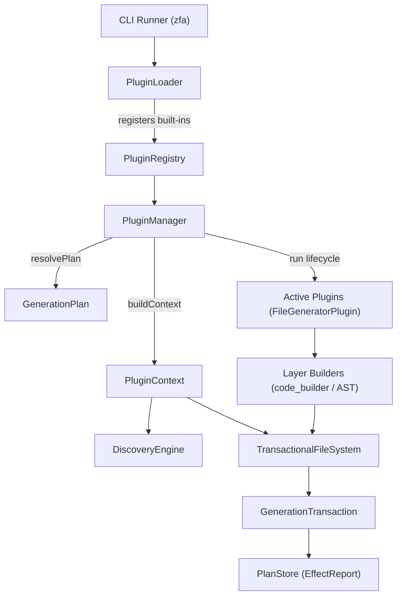
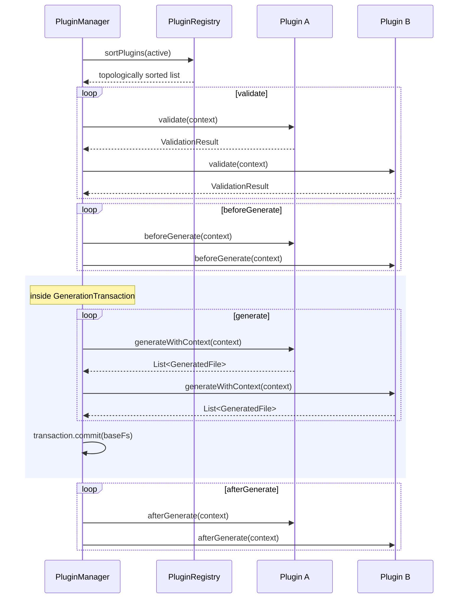
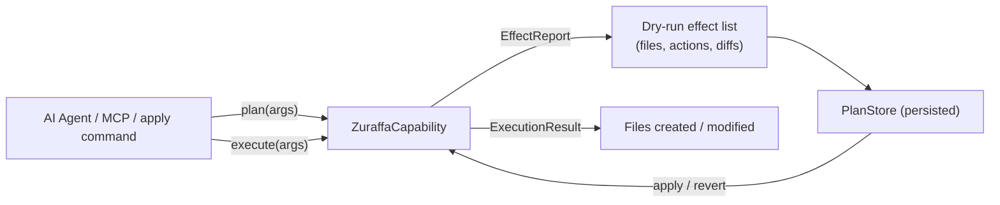

Zuraffa's code generator is decomposed into a small set of core contracts and a family of composable plugins, each owning one slice of the generated Clean Architecture stack. This page explains how the plugin system is structured — the contracts plugins implement, how the kernel orchestrates them through a defined lifecycle, how runtime context and file discovery flow into generation, and how capabilities make plugins interrogable by CLI tooling and AI agents. It is the architectural companion to [Building Custom Plugins](22-building-custom-plugins), which walks through implementing a plugin from scratch.

## Design Motivation: From Monolith to Plugin Kernel

The plugin architecture was adopted to solve a concrete scaling problem: Zuraffa generates domain, data, presentation, DI, and routing layers, and a monolithic generator made it difficult to extend, test, and evolve each layer independently. The accepted ADR records the decision to use a small core contract — `ZuraffaPlugin` defines lifecycle hooks and identification, `FileGeneratorPlugin` returns `GeneratedFile` results, and `PluginRegistry` coordinates ordering and execution — with the consequence that individual generators stay isolated and testable, and new features arrive as plugins without touching the core. The rejected alternatives were a monolithic generator with conditional branches and DI-based feature flags without explicit plugin boundaries.

Sources: [001-plugin-architecture.md](doc/adr/001-plugin-architecture.md#L9-L23)

## Architecture Overview

The system is organized into four layers: the CLI entry points, the loading and orchestration layer, the plugin implementations, and the shared infrastructure they write through. The `PluginLoader` instantiates all built-in plugins and registers them (minus those disabled in config) into a `PluginRegistry`; the `PluginManager` then selects, validates, and executes the active subset against a `PluginContext`; each plugin delegates to layer-specific builders; and every file write funnels through a transactional file system so the whole run can be committed or rolled back as one unit.

Sources: [plugin_loader.dart](lib/src/cli/plugin_loader.dart#L77-L85), [plugin_manager.dart](lib/src/core/plugin_system/plugin_manager.dart#L311-L327), [plugin_context.dart](lib/src/core/plugin_system/plugin_context.dart#L227-L238)

## The Core Contracts

Every plugin ultimately implements the `ZuraffaPlugin` interface, which is deliberately narrow: identity, ordering hints, an optional JSON Schema for CLI argument generation, and lifecycle hooks. Identity is enforced by a unique `id` (e.g. `'usecase'`, `'di'`) — registering two plugins with the same id throws a `StateError`. Ordering is expressed with two lists: `dependsOn` declares hard prerequisites that must be active, while `runAfter` is a soft ordering hint that only applies when the referenced plugin is also present. The `configKey` maps the plugin to a `.zfa.json` default flag (e.g. `di` → `diByDefault`), and `configSchema` describes the plugin's own flags so the CLI can generate and validate them uniformly.

Sources: [plugin_interface.dart](lib/src/core/plugin_system/plugin_interface.dart#L9-L62), [plugin_registry.dart](lib/src/core/plugin_system/plugin_registry.dart#L54-L59), [zfa_config.dart](lib/src/config/zfa_config.dart#L173-L180)

The key members of the base contract:

| Member | Type | Purpose |
|---|---|---|
| `id` / `name` / `version` | `String` | Unique identity and reporting |
| `dependsOn` | `List<String>` | Hard prerequisites (must be active) |
| `runAfter` | `List<String>` | Soft ordering (only if present) |
| `configSchema` | `JsonSchema` | Drives CLI flag generation & validation |
| `configKey` | `String?` | `.zfa.json` key for default activation |
| `capabilities` | `List<ZuraffaCapability>` | Interrogable operations (plan/execute) |
| `validate` / `beforeGenerate` / `afterGenerate` / `onError` | lifecycle hooks | See lifecycle section |

The most important specialization is `FileGeneratorPlugin`, which adds `generateWithContext(PluginContext)` — the canonical entry point — plus a legacy `generate(GeneratorConfig)` bridge. The default `generateWithContext` implementation maps the `PluginContext` back into a legacy `GeneratorConfig`, copying core flags (dryRun, force, verbose, revert, outputDir) so that older plugins keep working without changes. A separate `CliAwarePlugin` mixin lets a plugin contribute a full `Command` to the CLI runner, which is how plugins like `api` (`zfa api Product`) and `shadcn` expose dedicated subcommands.

Sources: [plugin_interface.dart](lib/src/core/plugin_system/plugin_interface.dart#L65-L83), [cli_aware_plugin.dart](lib/src/core/plugin_system/cli_aware_plugin.dart#L7-L13)

## Plugin Lifecycle and Orchestration

The `PluginManager.run` method executes the complete generation lifecycle inside a single `GenerationTransaction`. Before anything else, a requested revert short-circuits to `_handleRevert`, which loads the saved `EffectReport` from the `PlanStore` and replays its changes in reverse — deleting created files and restoring `previousContent` for overwritten ones. Otherwise the manager first checks entity-first preconditions (when `entityFirst` is configured and methods are requested, the entity file must already exist), then sorts the active plugins topologically.

Sources: [plugin_manager.dart](lib/src/core/plugin_system/plugin_manager.dart#L311-L321), [plugin_manager.dart](lib/src/core/plugin_system/plugin_manager.dart#L241-L308), [plugin_manager.dart](lib/src/core/plugin_system/plugin_manager.dart#L474-L537)

Topological sorting lives in `PluginRegistry.sortPlugins`, which visits each target's `dependsOn` and `runAfter` references with a DFS and detects cycles, throwing `StateError('Circular dependency detected: ...')` when a plugin is encountered while still being visited. The sorted order is deterministic and is also recorded in the persisted plan for reproducibility.

Sources: [plugin_registry.dart](lib/src/core/plugin_system/plugin_registry.dart#L19-L51)

Once sorted, the run proceeds through the five stages below, all wrapped by `GenerationTransaction.run` so file operations are staged, conflict-checked, and committed atomically (rollback on failure). Generation errors trigger `onError` on every plugin before the exception propagates.

Sources: [plugin_manager.dart](lib/src/core/plugin_system/plugin_manager.dart#L339-L390)

Sources: [plugin_manager.dart](lib/src/core/plugin_system/plugin_manager.dart#L340-L390), [generation_transaction.dart](lib/src/core/transaction/generation_transaction.dart#L102-L107)

The lifecycle hooks in detail:

| Hook | Contract | Typical use |
|---|---|---|
| `validate(context)` | returns `ValidationResult` | Config/schema checks; failures abort the run |
| `beforeGenerate(context)` | `Future<void>` | Pre-generation setup |
| `generateWithContext(context)` | `Future<List<GeneratedFile>>` | File creation (only on `FileGeneratorPlugin`) |
| `afterGenerate(context)` | `Future<void>` | Post-generation work after commit |
| `onError(context, error, stack)` | `Future<void>` | Error recovery for every plugin |

`ValidationResult` is a mergeable value object — `validateAll` combines each plugin's result via `merge`, collecting every failure reason so the user sees all problems, not just the first one. The registry also exposes `beforeGenerateAll`, `afterGenerateAll`, and `onErrorAll` for callers that drive the lifecycle directly rather than through the manager.

Sources: [plugin_lifecycle.dart](lib/src/core/plugin_system/plugin_lifecycle.dart#L1-L26), [plugin_registry.dart](lib/src/core/plugin_system/plugin_registry.dart#L82-L114)

## PluginContext: Runtime Data Flow

Plugins never reach for global state; everything they need arrives through a single `PluginContext`. Its `core` field is a `CoreConfig` holding the target name, project root, output directory, and the universal flags (`dryRun`, `force`, `verbose`, `revert`). The `data` map carries plugin-specific arguments assembled from CLI flags by `PluginManager.buildContext` — each active plugin's `configSchema` properties are scanned, parsed flags are typed (arrays are split on commas, integers and numbers converted), and defaults from the schema are applied. The manager also injects activation flags (`data['di'] = true` when the di plugin is active) so plugins can inspect each other's presence, plus shared core parameters like `methods`, `usecases`, and `variants`.

Sources: [plugin_context.dart](lib/src/core/plugin_system/plugin_context.dart#L6-L50), [plugin_manager.dart](lib/src/core/plugin_system/plugin_manager.dart#L93-L155), [plugin_manager.dart](lib/src/core/plugin_system/plugin_manager.dart#L216-L225)

Two further mechanisms make context genuinely useful across a multi-plugin run. `sharedData` is a mutable map where plugins can publish results — the `scaffold_feature_capability` sets shared state for downstream feature capabilities, and the datasource/DI plugins read normalized options from it. And `discovery` is a `DiscoveryEngine` that finds existing project files by name (accepting PascalCase or snake_case, searching `lib/src` with glob patterns) *and* is transaction-aware: it checks pending operations in the current `GenerationTransaction` before falling back to disk, so a file created by an earlier plugin in the same run is visible to later plugins without the write having been committed.

Sources: [plugin_context.dart](lib/src/core/plugin_system/plugin_context.dart#L78-L87), [discovery_engine.dart](lib/src/core/plugin_system/discovery_engine.dart#L22-L96), [discovery_engine.dart](lib/src/core/plugin_system/discovery_engine.dart#L43-L63)

| Context component | Type | Role |
|---|---|---|
| `core` | `CoreConfig` | Name, root, output dir, universal flags |
| `data` | `Map<String, dynamic>` | Plugin args from CLI flags (schema-validated) |
| `sharedData` | `Map<String, dynamic>` | Cross-plugin results |
| `discovery` | `DiscoveryEngine` | Transaction-aware file lookup |
| `fileSystem` | `FileSystem` | Abstracted I/O backed by a `TransactionalFileSystem` |

Sources: [plugin_context.dart](lib/src/core/plugin_system/plugin_context.dart#L53-L88), [plugin_manager.dart](lib/src/core/plugin_system/plugin_manager.dart#L227-L238)

## Capabilities: Making Plugins Interrogable

Beyond file generation, a plugin can expose `ZuraffaCapability` objects — a strict interface that lets an external caller (CLI `--plan`, an AI agent, or the MCP server) "interview" the plugin before committing to work. Each capability declares its `name`, a natural-language `description`, and JSON Schemas for `inputSchema` and `outputSchema`, plus two operations: `plan(args)` returns an `EffectReport` listing every `Effect` (file path, action, diff, previous content) that would occur — the mechanism behind dry-run plan previews — and `execute(args)` performs the work and returns an `ExecutionResult` with the modified files. The `UseCasePlugin` exposes a `create` capability; the API plugin exposes `create_api_bridge`; the method-append plugin exposes four (`method`, `append_method`, `private_method`, `inject`).

Sources: [capability.dart](lib/src/core/plugin_system/capability.dart#L109-L127), [capability.dart](lib/src/core/plugin_system/capability.dart#L7-L106), [usecase_plugin.dart](lib/src/plugins/usecase/usecase_plugin.dart#L42-L43), [api_plugin.dart](lib/src/plugins/api/api_plugin.dart#L49-L50)

The capability contract's design shows in the MCP server: it iterates `PluginRegistry.instance.plugins`, namespaces each capability as a tool (`zuraffa_<plugin>_<capability>`), and converts `inputSchema` directly into the tool's schema — giving AI agents the same operations the CLI exposes, with the same validation. The `apply` command completes the loop by loading a saved plan and invoking the matching capability's `execute` with the plan's stored arguments. The full capability system and plan preview mechanics are covered in [Capability System & Plan Preview](23-capability-system-and-plan-preview); here the important architectural point is that capabilities and file generation share the same plugin as their home, so a plugin is both a batch generator and a set of granular, describable operations.

Sources: [zuraffa_mcp_server.dart](bin/zuraffa_mcp_server.dart#L262-L280), [apply_command.dart](lib/src/commands/apply_command.dart#L46-L54)

Sources: [capability.dart](lib/src/core/plugin_system/capability.dart#L36-L77), [plan_store.dart](lib/src/core/plugin_system/plan_store.dart#L27-L33)

## The Built-in Plugin Catalog

The `PluginLoader` registers 22 built-in plugins in a fixed order, each a `FileGeneratorPlugin` (some also `CliAwarePlugin`). They map almost one-to-one onto the Clean Architecture layers Zuraffa generates:

| Layer | Plugin ids |
|---|---|
| Domain | `usecase`, `service`, `strategy` |
| Data | `repository`, `datasource`, `provider`, `cache`, `sync`, `api`, `mock` |
| Presentation | `view`, `presenter`, `controller`, `state`, `observer`, `shadcn` |
| Cross-cutting | `di`, `route`, `test`, `feature`, `gql`, `method_append` |

Sources: [plugin_loader.dart](lib/src/cli/plugin_loader.dart#L100-L131)

A built-in plugin typically composes three kinds of collaborators, visible in any `lib/src/plugins/<id>/` folder: **capabilities** (the interrogable operations), **builders** (the actual code emission, usually built on `code_builder` and `SpecLibrary`), and **generators** (higher-level orchestration across entity/custom/stream variants — see the `usecase` plugin, which owns `EntityUseCaseGenerator`, `CustomUseCaseGenerator`, and `StreamUseCaseGenerator` and routes among them based on the resolved config). This decomposition is the same one third-party plugins are expected to follow.

Sources: [usecase_plugin.dart](lib/src/plugins/usecase/usecase_plugin.dart#L15-L40), [usecase_plugin.dart](lib/src/plugins/usecase/usecase_plugin.dart#L180-L195)

## Plugin Selection and Configuration

Not every registered plugin runs on every invocation. `PluginManager.resolvePlan` delegates to the `PlanResolver`, which assembles the active set from four sources: an explicit `--preset` (expanded via `PresetRegistry`), explicit plugin ids and `--with` flags, implicit selection derived from parsed options (e.g. `--vpc` adds `view`, `presenter`, `controller`, `state`; `--data` adds both `repository` and `datasource`), and per-plugin defaults from `.zfa.json`. The result is then filtered by `--without` flags, explicit `--no-<plugin>` booleans, and the config's `disabledPlugins` set, aliases are expanded via `PluginAliasResolver`, and unknown ids produce warnings rather than hard failures.

Sources: [plan_resolver.dart](lib/src/core/planning/plan_resolver.dart#L18-L102), [plan_resolver.dart](lib/src/core/planning/plan_resolver.dart#L135-L200), [zfa_config.dart](lib/src/config/zfa_config.dart#L138-L139)

Configuration flows through `ZfaConfig`: `pluginDefaults` determines which plugins activate by default (all built-ins default to `false`), `disabledPlugins` hard-blocks plugins at load time (the `PluginLoader` skips them entirely), and `customPresets` / `customAliases` let projects define their own combinations. The `plugin` CLI command (`zfa plugin list`, `enable <id>`, `disable <id>`) manipulates the disabled set directly. Because presets and aliases have their own resolution mechanics, the full selection algorithm is detailed in [Presets, Aliases & Plan Resolution](8-presets-aliases-and-plan-resolution); here the architectural point is that selection is a pure function of registry + config + CLI args, yielding a `GenerationPlan` that can be previewed (`--plan` / `--explain`) before any file is touched.

Sources: [zfa_config.dart](lib/src/config/zfa_config.dart#L19-L40), [plugin_loader.dart](lib/src/cli/plugin_loader.dart#L30-L46), [plugin_command.dart](lib/src/commands/plugin_command.dart#L21-L53), [make_command.dart](lib/src/commands/make_command.dart#L314-L326)

## CLI Integration Points

The CLI runner bootstraps the whole system in one place: `_ensureInitialized` builds a fresh `PluginLoader` registry and merges it into the global `PluginRegistry.instance` (skipping already-registered ids), then iterates `CliAwarePlugin` instances and adds each one's `createCommand()` to the root `CommandRunner`. This is why `zfa api Product`, `zfa shadcn`, and the usecase subcommands work without any per-command wiring — a plugin that implements `CliAwarePlugin` is automatically a CLI citizen. Core commands like `make`, `manifest`, and `apply` then consume the registry directly: `make` resolves the plan, builds the context, and calls `PluginManager.run`, while `manifest` reports the registered plugin inventory.

Sources: [cli_runner.dart](lib/src/cli/cli_runner.dart#L43-L80), [make_command.dart](lib/src/commands/make_command.dart#L334-L350)

## Persistence for Revert and Reproducibility

After a successful run, the manager persists three artifacts: an `EffectReport` (plan) saved to the `PlanStore` under `last_run_<name>`, recording every file operation with its previous content — this is what powers `zfa make ... --revert` and the `apply` command; a `RunArtifact` in the `RunStore` capturing timing, files, and normalized options; and a project context snapshot. Because the persisted plan is the single source of truth for revert, it is normalized to project-relative paths so it survives project moves. The transaction and revert machinery are explored in depth on [Transactional File System, Revert & Plan Store](9-transactional-file-system-revert-and-plan-store).

Sources: [plugin_manager.dart](lib/src/core/plugin_system/plugin_manager.dart#L411-L463), [plan_store.dart](lib/src/core/plugin_system/plan_store.dart#L35-L61)

## Where to Go Next

The plugin architecture is the foundation several other catalog pages build on. To implement your own plugin, continue to [Building Custom Plugins](22-building-custom-plugins); to understand how capabilities power plan previews and AI workflows, see [Capability System & Plan Preview](23-capability-system-and-plan-preview) and [MCP Server & AI Agent Workflows](24-mcp-server-and-ai-agent-workflows); and for how the resolved plan drives file I/O, see [Transactional File System, Revert & Plan Store](9-transactional-file-system-revert-and-plan-store). The end-to-end path from a CLI invocation to emitted files is covered in [Code Generation Pipeline: From CLI to Files](6-code-generation-pipeline-from-cli-to-files).