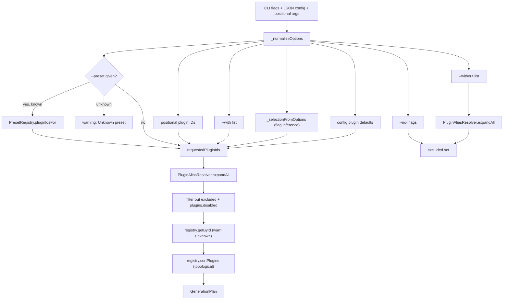
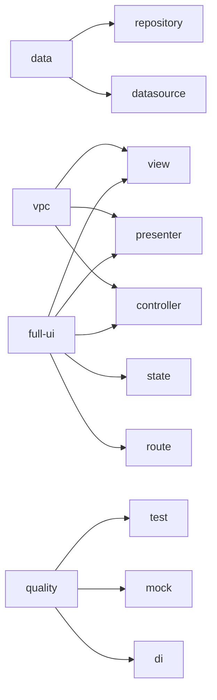

Zuraffa gives you many ways to describe the same generation: a preset such as `crud`, positional plugin IDs like `usecase repository datasource`, aliases like `vpc`, shorthand flags like `--data`, config defaults, and subtractive controls. The **plan resolver** is the single normalization layer that converges all of these into one ordered, deduplicated execution set — a `GenerationPlan` — before any file is written. This page explains the three ingredients of that layer: the preset registry, the alias resolver, and the resolution pipeline that combines them with CLI flags, configuration, and plugin dependencies.

## From CLI Intent to a Normalized Execution Contract

Every path into generation eventually funnels through `PlanResolver.resolve`, which produces a `GenerationPlan` — documented in code as the "normalized execution contract resolved before generation runs." The plan carries the resolved plugin IDs, the active plugin instances, the preset name that was used (if any), any warnings raised during resolution, and the normalized option map. `PluginManager` then executes exactly that plan, so the resolution step is the authoritative place where intent becomes an executable set.

Sources: [generation_plan.dart](lib/src/core/planning/generation_plan.dart#L3-L21), [plugin_manager.dart](lib/src/core/plugin_system/plugin_manager.dart#L37-L53)

The `make` command is the only public command that drives the resolver directly. Its `run` method gathers the entity name, positional plugin IDs, and merged JSON/CLI options, then calls `manager.resolvePlan(...)` and hands the resulting plan to the manager for execution. The `feature` command is a wrapper that translates itself into `make` arguments — more on that below.

Sources: [make_command.dart](lib/src/commands/make_command.dart#L314-L321), [feature_command.dart](lib/src/commands/feature_command.dart#L182-L188)

## The Resolution Pipeline

Resolution is a strict sequence of additive then subtractive stages. The diagram below shows the full flow from raw input to the final `GenerationPlan`:



Sources: [plan_resolver.dart](lib/src/core/planning/plan_resolver.dart#L18-L102), [plan_resolver.dart](lib/src/core/planning/plan_resolver.dart#L104-L133)

The pipeline is deliberately additive-first: preset, positional IDs, `--with`, flag inference, and config defaults all accumulate into one `requestedPluginIds` list. Only after accumulation does the resolver apply exclusions (`--without`, `--no-<plugin>` flags, disabled plugins), then validates every remaining ID against the registry, and finally topologically sorts the survivors so dependencies run before dependents.

## Built-in Presets

A preset is a named bundle of plugin IDs. The built-in registry in `PresetRegistry` defines seven presets covering the common generation shapes:

| Preset | Plugin IDs | Typical use |
|---|---|---|
| `feature` | `usecase`, `repository`, `datasource`, `view`, `presenter`, `controller`, `state`, `di`, `test` | Full feature stack |
| `crud` | `usecase`, `repository`, `datasource` | Domain + data layer for CRUD |
| `read-only` | `usecase`, `repository`, `datasource` | Same core as `crud` (read-only naming) |
| `service-feature` | `service`, `provider`, `usecase`, `view`, `presenter`, `controller`, `state`, `di`, `test` | Feature stack built on a service instead of repository/datasource |
| `adaptive-feature` | `feature` plugins + `route` | Feature stack with adaptive layout scaffolding |
| `platform-feature` | `feature` plugins + `route` | Feature stack with platform shell scaffolding |

Sources: [preset_registry.dart](lib/src/core/planning/preset_registry.dart#L2-L51)

Note that `crud` and `read-only` expand to identical plugin sets — the distinction is semantic naming for the developer, not behavior. The `adaptive-feature` and `platform-feature` presets are special-cased: `PresetRegistry.isAdaptivePreset` flags them, and the view plugin's layout builder checks that flag to decide whether to scaffold adaptive layouts. The details of that behavior belong to the adaptive layouts page; here it matters only that a preset name can carry behavioral meaning beyond plugin selection.

Sources: [preset_registry.dart](lib/src/core/planning/preset_registry.dart#L68-L74), [adaptive_layout_scaffold_builder.dart](lib/src/plugins/view/builders/adaptive_layout_scaffold_builder.dart#L119-L122)

There is also a separate, legacy `GenerationPreset` class in `lib/src/core/plugin_system/presets.dart` (`entity-crud`, `vpc`, `vpc-state`, `full-stack`, `data-layer`). It is not consulted by `PlanResolver` — the resolver uses `PresetRegistry` exclusively — so treat it as an earlier API surface that predates the current planning pipeline.

Sources: [presets.dart](lib/src/core/plugin_system/presets.dart#L1-L71)

## Aliases: Composable Plugin Shorthands

Aliases map a short name to a list of plugin IDs and are handled by `PluginAliasResolver`. The built-in aliases cover the most common multi-plugin combinations:

| Alias | Expands to |
|---|---|
| `data` | `repository`, `datasource` |
| `vpc` | `view`, `presenter`, `controller` |
| `full-ui` | `view`, `presenter`, `controller`, `state`, `route` |
| `quality` | `test`, `mock`, `di` |

Sources: [plugin_alias_resolver.dart](lib/src/core/planning/plugin_alias_resolver.dart#L2-L7)

Expansion is **recursive and deduplicating**: `expandAll` walks each ID, and if it names an alias it expands the targets in place (which may themselves be aliases); otherwise it adds the ID to the result only if not already seen. This makes aliases composable — an alias whose targets include another alias resolves transitively — and guarantees a plugin never appears twice regardless of how many aliases or explicit IDs reference it.

Sources: [plugin_alias_resolver.dart](lib/src/core/planning/plugin_alias_resolver.dart#L14-L44)



A critical detail: exclusions pass through the same expansion. `--without=vpc` is expanded to `view, presenter, controller` before being subtracted, so you can exclude by alias just as you include by alias.

Sources: [plan_resolver.dart](lib/src/core/planning/plan_resolver.dart#L55-L62)

## How Plugin Selection Is Assembled

The accumulation order in `PlanResolver.resolve` defines the precedence when multiple input channels overlap:

1. **Preset expansion** — `--preset=<name>` looks up `PresetRegistry`; an unknown preset produces a warning (`Unknown preset "<name>" ignored.`) and contributes nothing.
2. **Positional plugin IDs** — everything after the entity name in `zfa make Product usecase repository ...`.
3. **`--with` list** — additional plugins or aliases (comma-separated values are split and trimmed).
4. **Option-flag inference** — `_selectionFromOptions` converts shorthand flags like `--data` or `--vpcs` into plugin IDs.
5. **Config defaults** — every plugin with `isPluginEnabledByDefault(plugin.id) == true` in `.zfa.json` is added, so a project can declare always-on layers.
6. **Alias expansion** — the accumulated list is expanded and deduplicated.
7. **Exclusion** — `--without` (alias-expanded), explicit `--no-<plugin>` flags, and `plugins.disabled` config are removed.
8. **Registry validation** — unknown IDs after expansion generate warnings (`Unknown plugin "<id>" ignored.`) and are dropped.
9. **Topological sort** — `registry.sortPlugins` orders survivors by `dependsOn` and `runAfter` constraints, throwing on circular dependencies.

Sources: [plan_resolver.dart](lib/src/core/planning/plan_resolver.dart#L28-L53), [plan_resolver.dart](lib/src/core/planning/plan_resolver.dart#L74-L101), [plugin_registry.dart](lib/src/core/plugin_system/plugin_registry.dart#L19-L51)

Because deduplication happens during alias expansion, a plugin requested through multiple channels (e.g. `crud` preset plus explicit `usecase` plus `--with=data`) appears exactly once in the final plan — but note that `requestedPluginIds` in the plan keeps the *pre-expansion* request list, which is why plan output distinguishes "Requested" from "Resolved."

Sources: [generation_plan.dart](lib/src/core/planning/generation_plan.dart#L23-L34)

## Option-Flag Inference

Not every selection needs a plugin ID or alias. The resolver infers plugin selection from generator-style boolean flags through `_selectionFromOptions`:

| Flag(s) | Adds plugin(s) |
|---|---|
| `--usecase`, `--methods=<...>` (with entity), `--service=<name>` | `usecase` |
| `--repository`, `--data` | `repository` |
| `--datasource`, `--data` | `datasource` |
| `--service`, `--use-service` (or a service name present) | `service` |
| `--provider`, `--use-service`, or a service name present | `provider` |
| `--view` | `view` |
| `--presenter` | `presenter` |
| `--controller` | `controller` |
| `--observer` | `observer` |
| `--vpc` / `--vpcs` | `view`, `presenter`, `controller` (+`state` for `vpcs`) |
| `--pc` | `presenter`, `controller` |
| `--pcs` | `presenter`, `controller`, `state` |
| `--state` | `state` |
| `--test` | `test` |
| `--di` | `di` |
| `--route` | `route` |
| `--mock` | `mock` |
| `--gql` / `--graphql` | `gql` / `graphql` |
| `--cache` | `cache` |
| `--append`, or `--no-entity` with `--repo` | `method_append` |
| `--shadcn` | `shadcn` |

Sources: [plan_resolver.dart](lib/src/core/planning/plan_resolver.dart#L135-L213)

Two nuances are worth calling out. First, `--service` is dual-purpose: a bare boolean `--service` selects the `service` plugin, while `--service=AuthService` (a non-empty string) also triggers it — unless combined with `--append`, which signals the service already exists and only usecase/DI wiring is wanted. Second, `--methods` alone does **not** imply `usecase` unless an entity is being generated (`no-entity` is false), so method-only appends to an existing repository stay targeted.

Sources: [plan_resolver.dart](lib/src/core/planning/plan_resolver.dart#L149-L158), [plan_resolver.dart](lib/src/core/planning/plan_resolver.dart#L204-L218)

## Exclusions: `--without`, `--no-<plugin>`, and `plugins.disabled`

Subtraction happens after accumulation, in three independent channels. `--without` accepts plugin IDs or aliases and is alias-expanded like inclusions. The `make` command also registers a negatable flag for **every registered plugin**, defaulting to `true`; if the user passes `--no-datasource`, the resolver detects the parsed `false` value and adds that plugin to the excluded set. Finally, the `PluginConfig.disabled` set (loaded from `.zfa.json` `plugins.disabled`) filters the resolved list at the end — and disabled plugins are also never registered by the `PluginLoader` in the first place.

Sources: [plan_resolver.dart](lib/src/core/planning/plan_resolver.dart#L64-L77), [make_command.dart](lib/src/commands/make_command.dart#L225-L235), [plugin_loader.dart](lib/src/cli/plugin_loader.dart#L77-L85)

The result: exclusion is idempotent and safe. Whether a plugin arrived via preset, alias, flag inference, or config default, any of the three exclusion channels removes it from the final execution set.

## The `GenerationPlan` Contract

The resolved plan is a plain value object, serializable for machine consumption:

| Field | Meaning |
|---|---|
| `name` | Target entity/feature name |
| `preset` | The preset used, if any (absent in JSON when `null`) |
| `requestedPluginIds` | Pre-expansion request list (may contain aliases, duplicates) |
| `pluginIds` | Final resolved, deduplicated, dependency-sorted IDs |
| `activePlugins` | Instantiated plugin objects in execution order |
| `warnings` | Non-fatal notices (unknown preset/plugin) |
| `normalizedOptions` | Flag/option map after cleaning ignored keys |
| `executionOrder` | Convenience getter: active plugin IDs in order |

Sources: [generation_plan.dart](lib/src/core/planning/generation_plan.dart#L4-L35)

The plan is observable at runtime through `--plan` and `--explain` on `make`, which print the requested vs. resolved lists plus any warnings, and through `--format=json` for automation. The same plan JSON can be fed back in via `--from-json` or `--from-stdin`, making the resolution round-trip inspectable and scriptable. The normalized options also flow into `context.data` during execution, so downstream plugins (e.g. datasource checking `cache`, the view builder checking `preset`) can react to the flags that shaped the plan.

Sources: [make_command.dart](lib/src/commands/make_command.dart#L104-L116), [make_command.dart](lib/src/commands/make_command.dart#L407-L425), [make_command.dart](lib/src/commands/make_command.dart#L340), [datasource_plugin.dart](lib/src/plugins/datasource/datasource_plugin.dart#L150-L160)

## Custom Presets & Aliases in `.zfa.json`

Both registries are open for extension through project configuration. `ZfaConfig` exposes `customPresets` and `customAliases`, loaded from the `planning.presets` and `planning.aliases` keys of `.zfa.json` (with legacy top-level `presets`/`aliases` accepted as fallbacks):

```json
{
  "planning": {
    "presets": {
      "admin-feature": ["usecase", "repository", "datasource", "di", "test"]
    },
    "aliases": {
      "admin-ui": ["view", "presenter", "controller", "state"]
    }
  }
}
```

Sources: [zfa_config.dart](lib/src/config/zfa_config.dart#L42-L45), [zfa_config.dart](lib/src/config/zfa_config.dart#L219-L252), [zfa_config.dart](lib/src/config/zfa_config.dart#L268-L271)

Merging semantics matter: custom entries are merged **over** the built-ins (`{..._presets, ...customPresets}`), so a custom preset or alias with the same name as a built-in replaces it entirely rather than appending. Custom presets and aliases flow through the exact same expansion and validation paths — an unknown custom-reference still produces a warning, and custom aliases can even reference built-in aliases transitively thanks to the recursive expansion.

Sources: [preset_registry.dart](lib/src/core/planning/preset_registry.dart#L76-L83), [plugin_alias_resolver.dart](lib/src/core/planning/plugin_alias_resolver.dart#L46-L53)

## The `feature` Command as a Preset Wrapper

`zfa feature` does not implement its own resolver — it is a thin translation layer over `make`. The `scaffold` mode builds `make` arguments that start with `--preset=feature`, then computes a `--without` list from its own flags: turning off `--repository`, `--datasource`, `--vpcs`, or `--di` adds the corresponding plugin IDs to the exclusion list, while `--test` and `--route` flip inclusion. Other modes (`route`, `di`, `mock`, `test`, `view`, ...) simply append `--with=<mode>` to the generated arguments.

Sources: [feature_command.dart](lib/src/commands/feature_command.dart#L142-L143), [feature_command.dart](lib/src/commands/feature_command.dart#L232-L267)

This design keeps a single resolution implementation authoritative: `feature scaffold` and an equivalent `make --preset=feature ...` invocation produce identical plans, as the CLI guide documents.

Sources: [CLI_GUIDE.md](CLI_GUIDE.md#L229-L240)

## Adaptive Presets

`adaptive-feature` and `platform-feature` deserve a final note because they show that a preset can be more than a bundle of IDs. Both expand to the full feature set plus `route`, but `PresetRegistry.isAdaptivePreset` also tags them so the view plugin's layout builder can enable adaptive layout scaffolding and platform shells automatically. If you want the full mechanics of how those presets drive layout generation, see [Adaptive Layouts & Platform Shells](20-adaptive-layouts-and-platform-shells); the plan resolver's role is only to carry the preset name through to the plugins.

Sources: [preset_registry.dart](lib/src/core/planning/preset_registry.dart#L68-L74), [zfa_config.dart](lib/src/config/zfa_config.dart#L129-L132)

## What's Next

Plan resolution is the *selection* half of the pipeline; the *execution* half — staged file writes, conflict detection, commit/rollback, and the persisted effect reports that enable `--revert` — is covered in [Transactional File System, Revert & Plan Store](9-transactional-file-system-revert-and-plan-store). To understand how the plan's plugin instances were loaded and registered in the first place, revisit [Plugin System Architecture](7-plugin-system-architecture). For the capability-level plan preview (a separate planning surface used by the MCP server and AI workflows), see [Capability System & Plan Preview](23-capability-system-and-plan-preview), and for the full `.zfa.json` surface that feeds custom presets and aliases, see [Project Memory & Configuration](25-project-memory-and-configuration). A complete list of every `make` flag is in the [CLI Command Reference](3-cli-command-reference).