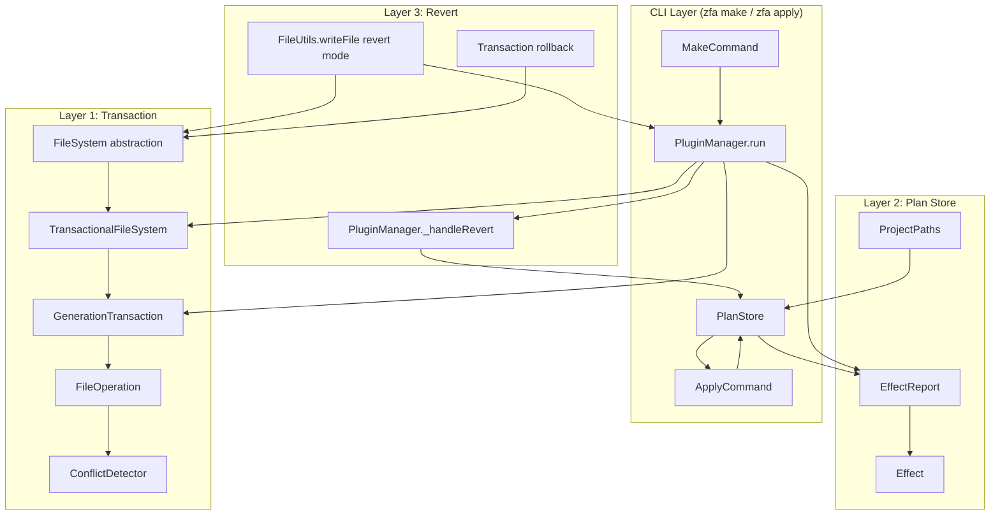
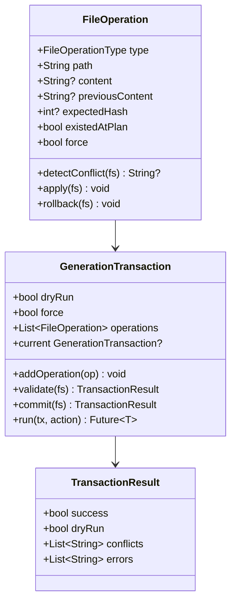
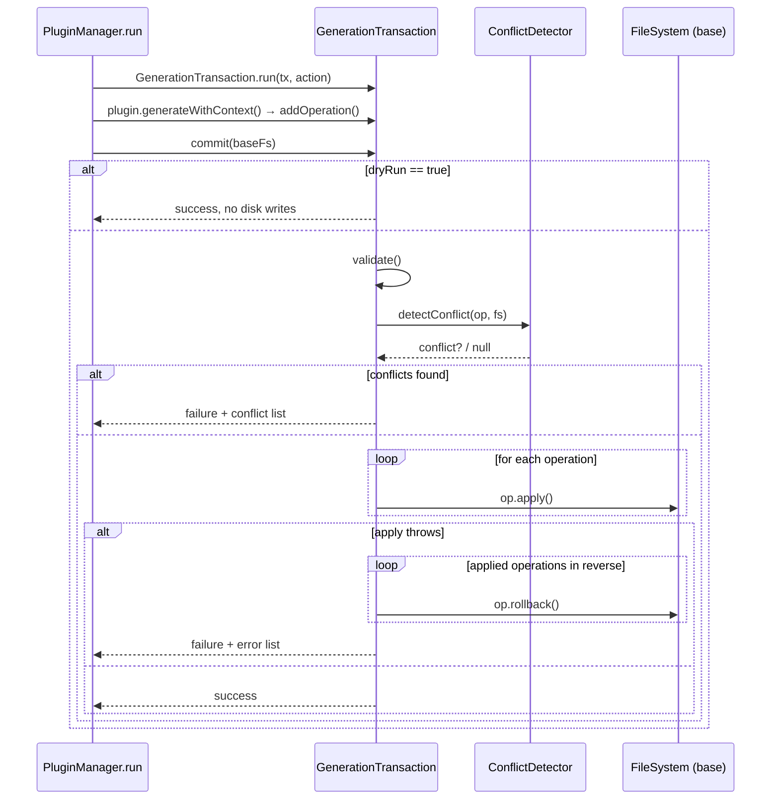
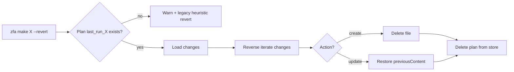
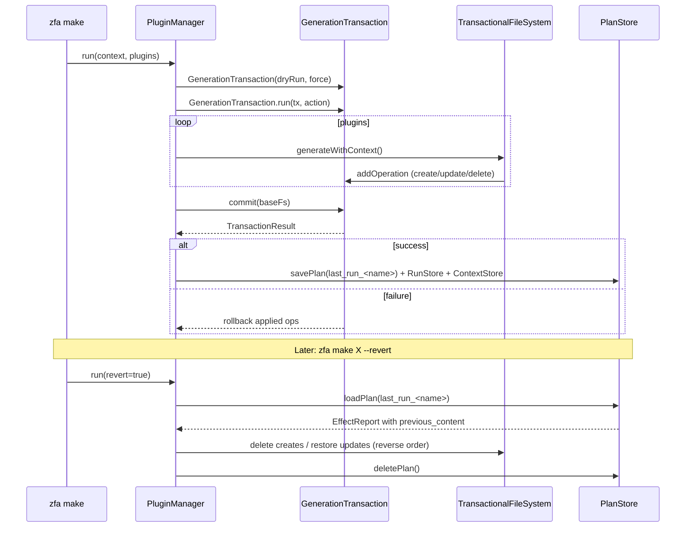

Generation writes to multiple files at once — and a partial failure leaves the project in a broken, half-generated state. Zuraffa solves this with a three-part safety architecture: a **transaction layer** that aggregates and validates file operations before touching disk, a **plan store** that persists a machine-readable record of every change for later inspection or undo, and **revert strategies** that restore the filesystem to its pre-generation state. This page explains how those three layers work together, how conflict detection prevents clobbering files you've edited by hand, and how `--revert` knows exactly what to undo.

## Why Generation Needs a Transaction Layer

A single `zfa make User` invocation can trigger a dozen plugins, each writing several files across `domain/`, `data/`, and `presentation/`. Without coordination, three failure modes emerge. First, **partial failure**: plugin five throws after plugins one through four have already written files, leaving an inconsistent project. Second, **no preview**: dry-run mode cannot report what *would* happen because writes bypass any aggregation point. Third, **silent clobbering**: a plugin overwrites a file the user modified after planning — or two plugins both claim the same path.

The decision record for the transaction system states the intent plainly: "Generation can update multiple files. Partial failures risk inconsistent output. The system needs a way to aggregate file operations for dry-run support and conflict detection." The accepted design introduces "a generation transaction layer that records file operations and validates conflicts before applying," with `FileUtils.writeFile` routing writes into the transaction when one is active, and writing to disk directly otherwise. Direct writes without conflict detection, and external transactional-filesystem dependencies, were both considered and rejected — the former offers no safety, the latter adds heavyweight infrastructure for a batch-write problem.
Sources: [doc/adr/004-transaction-system.md](doc/adr/004-transaction-system.md#L6-L19)

That design yields three guarantees:

| Guarantee | Mechanism |
|---|---|
| **Atomicity** | All operations commit together; on failure, already-applied operations roll back in reverse order |
| **Predictability** | Dry-run returns the full operation list without touching disk; previews match the real run |
| **Safety** | Conflict detection compares current disk state against the state observed at planning time |

## The Three-Layer Safety Model



The three layers are not redundant — each covers a different time horizon. The **transaction** protects a single run (seconds to minutes). The **plan store** preserves a durable record across runs (hours to days), enabling both later application via `zfa apply` and plan-based revert. The **legacy heuristic revert** in `FileUtils` covers append-mode and plugin-level undo where no plan exists. Each is examined in turn below.

## Layer 1: The Transaction Layer

### File Operations as First-Class Objects

At the heart of the transaction is `FileOperation`, a value object describing one intended change. It records the operation `type`, the target `path`, the `content` to write, and — critically for both rollback and conflict detection — the `previousContent` and an `expectedHash` snapshot of the file as it existed when the operation was planned.



The three factories construct operations with different safety postures. `FileOperation.create` assumes the file does **not** exist and records no previous content — its rollback is simply a delete. `FileOperation.update` and `FileOperation.delete` are *async factories* because they must read the current file from disk at planning time to capture `previousContent` and compute `expectedHash`. This snapshot-then-apply pattern is what makes later conflict detection possible.
Sources: [file_operation.dart](lib/src/core/transaction/file_operation.dart#L6-L71)

Apply and rollback are mirror images. `apply` writes content for create/update and deletes for delete (throwing if the file vanished between planning and commit). `rollback` reverses: create is undone by deleting the file, update and delete are undone by restoring `previousContent`. Rollback is deliberately best-effort — the caller swallows individual rollback failures so one bad restore cannot mask the original error.
Sources: [file_operation.dart](lib/src/core/transaction/file_operation.dart#L82-L118)

### The GenerationTransaction: Validate, Commit, Rollback

`GenerationTransaction` is a zone-scoped accumulator. The static `current` getter reads the active transaction from the current Dart `Zone`, and `GenerationTransaction.run(transaction, action)` executes an async closure inside a zone bound to that transaction. Any code running within that zone — plugins, discovery lookups, builders — can access the pending operations without threading the object through every call signature.
Sources: [generation_transaction.dart](lib/src/core/transaction/generation_transaction.dart#L99-L107)

The commit lifecycle has four phases:



`validate` first rejects *duplicate paths* within the transaction itself — two operations claiming the same file is always a programming error, reported as `Multiple operations for <path>` — then asks the conflict detector to compare each operation against live disk state. If any conflict exists, commit prints each as `[conflict] <detail>` and returns a failed result without touching a single file. If validation passes, operations apply **in registration order**, and on the first exception every already-applied operation rolls back **in reverse order**, restoring the filesystem to its pre-transaction state. The `TransactionResult` carries the full picture: success flag, dry-run marker, the operation list, conflicts, and errors.
Sources: [generation_transaction.dart](lib/src/core/transaction/generation_transaction.dart#L26-L97)

### Conflict Detection via Content Hashing

`ConflictDetector` implements a simple but effective staleness check. At planning time, each update/delete operation captures `expectedHash`, computed by a 31-bit polynomial hash over the file's code units (`hash = (hash * 31 + unit) & 0x7fffffff`). At commit time, the detector re-reads the file, recomputes the hash, and compares:

| Operation | Conflict condition | Meaning |
|---|---|---|
| `create` | File exists (and `force` is false) | Someone/something created the file since planning |
| `update` / `delete` | File missing | The file was deleted between planning and commit |
| `update` / `delete` | Content hash ≠ `expectedHash` (and `force` is false) | **File modified since planning** — you edited it by hand |

The hash comparison is the crucial guardrail: it distinguishes "the file I planned to overwrite" from "the file that changed while I was working." Setting `--force` bypasses both the existence check and the hash check, signaling deliberate overwrite intent.
Sources: [conflict_detector.dart](lib/src/core/transaction/conflict_detector.dart#L5-L40)

### TransactionalFileSystem: Read-Your-Writes Overlay

The transaction would be useless if plugins could not *see* their own pending writes. `TransactionalFileSystem` is a decorator over the `FileSystem` abstraction that overlays transaction state onto every read operation. Its semantics:

| Method | Transaction-aware behavior |
|---|---|
| `exists` | Pending op for path → `true` unless it's a delete; also `true` if any pending file lives under the queried directory |
| `read` | Pending op → returns the *pending* content (throws if the pending op is a delete) |
| `write` | Pending tx → records a `create`/`update` operation instead of touching disk |
| `delete` | Pending tx → records a delete operation instead of touching disk |
| `isDirectory` | Pending op at exact path → file; any pending file beneath → directory |
| `list` | Disk results merged with pending ops: deletes removed, creates added |

This gives plugins **read-your-writes** visibility: a plugin that generates a repository can immediately discover it via the `DiscoveryEngine` even though nothing has hit disk yet. `DiscoveryEngine` goes further, checking pending transaction operations *before* falling back to glob over the physical filesystem, and skipping matches that are pending deletes.
Sources: [transactional_file_system.dart](lib/src/core/transaction/transactional_file_system.dart#L11-L187), [discovery_engine.dart](lib/src/core/plugin_system/discovery_engine.dart#L45-L80)

The wiring happens in `PluginManager`: `_createPluginContext` wraps `FileSystem.create(root: projectRoot)` in a `TransactionalFileSystem` and hands it to every plugin through the shared `PluginContext`. The commit step is careful to pass the **base** filesystem (unwrapping the decorator) so the final write phase does not re-enter the transaction.
Sources: [plugin_manager.dart](lib/src/core/plugin_system/plugin_manager.dart#L228-L232), [plugin_manager.dart](lib/src/core/plugin_system/plugin_manager.dart#L362-L374)

The legacy `CodeGenerator` path joins the same pipeline: it delegates through `PluginManager`, which guarantees the transactional filesystem is installed regardless of entry point.
Sources: [code_generator.dart](lib/src/generator/code_generator.dart#L135-L151)

## Layer 2: The Plan Store

### The Effect Model

While `FileOperation` is the runtime currency of a transaction, the plan store works in a different vocabulary: `Effect` and `EffectReport`. An `Effect` records one change as `file`, `action` (create/modify/delete/skip), an optional `diff` description, and — mirroring `FileOperation.previousContent` — the file's `previousContent`. An `EffectReport` bundles effects under a `planId` with the originating `pluginId`, `capabilityName`, the `args` that produced it, and a validity flag.
Sources: [capability.dart](lib/src/core/plugin_system/capability.dart#L7-L88)

The capability contract connects the two worlds. Every `ZuraffaCapability` exposes `plan(args)` returning an `EffectReport` ("what will this do?") and `execute(args)` returning an `ExecutionResult` ("do it"). This plan-then-execute split is what makes dry-run previews, plan persistence, and later re-application all possible.
Sources: [capability.dart](lib/src/core/plugin_system/capability.dart#L106-L128)

### PlanStore: Persistence, Location & Migration

`PlanStore` is a singleton managing JSON persistence of `EffectReport`s. Plans live under the project's memory directory, resolved by `ProjectPaths`:

| Directory | Purpose |
|---|---|
| `.zfa/plans/` | Current plan store: `{planId}.json` |
| `.zuraffa/plans/` | **Legacy** plan location, read as a fallback for backward compatibility |
| `.zfa/runs/` | Run artifacts: `{timestamp}_{name}.json` with generated file lists |
| `.zfa/blueprints/`, `.zfa/decisions/`, `.zfa/manifests/` | Other project-memory stores (context, contracts, manifests) |
| `.zfa/context.json` | Persisted project context |

Sources: [project_paths.dart](lib/src/core/project/project_paths.dart#L10-L33)

`loadPlan` checks the current location first and falls back to the legacy `.zuraffa/plans` path — so plans written by pre-v5 tooling remain reverted and re-appliable. `deletePlan` removes both files. The store is a singleton with a test-overridable `rootDirectory`, keeping the persistence layer decoupled from CLI parsing.
Sources: [plan_store.dart](lib/src/core/plugin_system/plan_store.dart#L8-L74)

A real plan from the example project shows the format in the wild. `last_run_Concert.json` records `plugin_id: "manager"`, `capability_name: "make"`, the full normalized argument set, and a `changes` array where every updated usecase carries its complete `previous_content` — a full snapshot of the pre-generation source, ready for restoration:

```json
{
  "plan_id": "last_run_Concert",
  "plugin_id": "manager",
  "capability_name": "make",
  "args": { "name": "Concert", "methods": ["get", "getList", "watch", "update"], "force": true, ... },
  "valid": true,
  "changes": [
    { "file": "lib/src/domain/usecases/concert/get_concert_usecase.dart",
      "action": "update",
      "previous_content": "// Generated by zfa for: Concert\nimport ..." }
  ]
}
```

Sources: [example/.zuraffa/plans/last_run_Concert.json](example/.zuraffa/plans/last_run_Concert.json)

### Consuming Plans: Preview, Apply & Memory

Plans are written from three places, each serving a different workflow:

1. **Capability dry-run preview.** `zfa <plugin> <capability> --dry-run` calls `capability.plan(args)`, saves the resulting `EffectReport` to the store, and prints the JSON — a contract an AI agent or CI pipeline can consume before committing to execution.
Sources: [capability_command.dart](lib/src/commands/capability_command.dart#L186-L192)

2. **Generation memory.** After a successful `PluginManager.run`, `_persistProjectMemory` builds an `EffectReport` from the *actual* committed transaction operations (mapping each `FileOperation` to an `Effect` with its `previousContent`), saving it under the fixed plan id `last_run_{core.name}`. The same hook writes a `RunArtifact` to `RunStore` (`.zfa/runs/`) and refreshes the project context store. This is the record that makes `--revert` possible.
Sources: [plugin_manager.dart](lib/src/core/plugin_system/plugin_manager.dart#L411-L455), [run_store.dart](lib/src/core/project/run_store.dart#L10-L51)

3. **Explicit application.** `zfa apply --plan-id <id>` loads a plan from the store, resolves the originating plugin and capability, re-executes it with the *saved* arguments, and deletes the plan on success. This decouples "decide what to do" from "when to do it" — a plan generated today can be applied tomorrow, or by a different operator.
Sources: [apply_command.dart](lib/src/commands/apply_command.dart#L22-L66)

## Layer 3: Revert Strategies

Revert exists at three distinct levels. The `--revert` CLI flag (registered alongside `--dry-run`, `--force`, and `--verbose` on every plugin command) selects the **plan-based revert** as the primary path; transaction rollback handles **failure-time** undo; and the legacy `FileUtils` marker check covers **append-mode** and plugin-level reverts where no plan exists.
Sources: [base_plugin_command.dart](lib/src/commands/base_plugin_command.dart#L27-L47)

### Plan-Based Revert (the primary path)

When `context.core.revert` is set, `PluginManager.run` short-circuits to `_handleRevert` before any generation begins. The algorithm is a precise inverse of the recorded transaction:

1. Load `last_run_{core.name}` from the plan store.
2. If no plan exists, warn and fall back to the legacy heuristic path.
3. Walk the plan's `changes` **in reverse order**.
4. For each change: if the file no longer exists, skip; if the action was `create`/`created`, delete the file; if it was `update`/`overwritten`, write back `previousContent`.
5. Delete the plan from the store — reverting twice is not idempotent by design, and the plan's job is done.



Sources: [plugin_manager.dart](lib/src/core/plugin_system/plugin_manager.dart#L241-L283), [plugin_manager.dart](lib/src/core/plugin_system/plugin_manager.dart#L318-L320)

### Transaction Rollback (failure-time revert)

The second strategy needs no plan and no flag: it is the commit path's safety net. If any operation's `apply` throws mid-commit, every previously applied operation rolls back in reverse — created files are deleted, updated files regain their snapshot content. The failure is reported as `Transaction failed: <error>` in the `TransactionResult`, and the generation run surfaces it as a `StateError`.
Sources: [generation_transaction.dart](lib/src/core/transaction/generation_transaction.dart#L58-L97)

### Legacy Heuristic Revert (append-mode marker)

The third strategy operates per-file with a **first-line marker** instead of a plan. Generated Dart files begin with `// Generated by zfa for: <Name>`. When `FileUtils.writeFile` is called with `revert: true`, it checks this marker: if `skipRevertIfExisted` is set and the existing file's first line differs from the generated first line, the file is judged "not ours" (hand-written or modified) and is skipped; otherwise it is deleted. This is what the method-append and custom-usecase generators use — they append methods to files that predate the run, so plan-based revert cannot know which parts are theirs, but the marker tells them the file was zuraffa-originated.
Sources: [file_utils.dart](lib/src/utils/file_utils.dart#L25-L48), [entity_usecase_generator.dart](lib/src/plugins/usecase/generators/entity_usecase_generator.dart#L460-L492)

| Strategy | Trigger | Scope | Safety signal | Idempotent |
|---|---|---|---|---|
| Plan-based revert | `--revert` flag | Whole last run | Full `previousContent` snapshots | No — deletes plan after use |
| Transaction rollback | Apply failure | Current commit | In-memory `previousContent` | Yes — reverts to pre-run state |
| Heuristic marker revert | Plugin `revert: true` | Single file | First-line `// Generated by zfa` marker | Yes — skips non-marker files |

## End-to-End Lifecycle



## Testing & Verification

The transaction layer's guarantees are pinned by dedicated unit tests. `transaction_test.dart` verifies that commits of create, update, and delete operations land on disk correctly; that a file modified *after* planning is rejected with a conflict (leaving the user's edit intact); and — the most important test — that when a commit fails midway, the previously applied operation is rolled back and the created file disappears.
Sources: [transaction_test.dart](test/core/transaction/transaction_test.dart#L18-L116)

At the integration level, `method_append_revert_test.dart` exercises the full generate-then-revert cycle against a real Flutter workspace: it generates a permission service via method-append, runs `revert: true`, and asserts the service file is gone; the same pattern is verified for custom usecases. These tests are the contract that `--revert` undoes exactly what generation created.
Sources: [method_append_revert_test.dart](test/integration/method_append_revert_test.dart#L30-L77)

## Summary & Next Steps

The safety architecture forms a coherent whole: `FileOperation` snapshots make every change reversible, `GenerationTransaction` makes a run atomic and dry-run faithful, `ConflictDetector` protects hand-edited files, `TransactionalFileSystem` gives plugins read-your-writes visibility, `PlanStore` makes the record durable, and the three revert strategies cover failure-time, whole-run, and per-file undo. Together they answer the two questions every generation tool must: *what will change?* and *how do I undo it?*

To build on this foundation:

- See how plans are resolved and presets/aliases influence which plugins run: [Presets, Aliases & Plan Resolution](8-presets-aliases-and-plan-resolution)
- Understand the capability contract that produces `EffectReport`s and the dry-run preview UX: [Capability System & Plan Preview](23-capability-system-and-plan-preview)
- Trace how the CLI commands (`make`, `apply`, `--dry-run`) wire these flags end to end: [CLI Command Reference](3-cli-command-reference)
- Learn how project memory (context, plans, runs) persists across sessions: [Project Memory & Configuration](25-project-memory-and-configuration)
- See how transaction and revert behavior is covered in the broader test suites: [Testing Strategy & Result Matchers](26-testing-strategy-and-result-matchers)