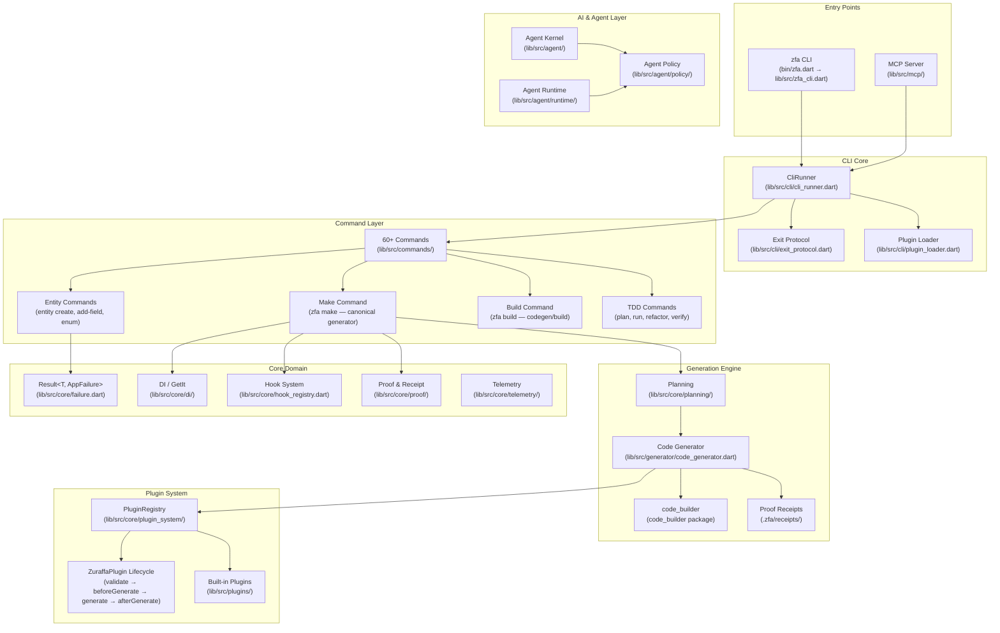
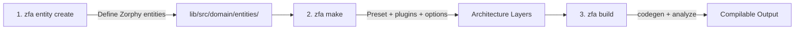

**Zuraffa** is an AI-first Clean Architecture framework for Flutter and Dart. It standardizes code generation around a canonical workflow — `zfa entity create` → `zfa make` → `zfa build` — so that AI agents and developers produce consistent, type-safe architecture from intent rather than boilerplate. The framework owns the architecture skeleton; humans and agents fill in the narrow implementation details afterward. [README.md](README.md) [VISION.md](VISION.md)

Zuraffa is currently at version **6.3.0**, requiring Dart SDK `^3.11.0`. It depends on `zorphy` and `zorphy_annotation` for immutable, typed entity generation, and provides a rich plugin ecosystem covering domain, data, presentation, DI, routing, testing, and more layers. [pubspec.yaml](pubspec.yaml)

---

## What Zuraffa Does

Zuraffa solves a core problem in AI-assisted development: **trust**. Every generated artifact ships with a **generation receipt** (schema `proof.v1`) binding it to the command that produced it, the generator version, the input context, and the SHA-256 digest of the exact bytes written to disk. This proof-carrying generation ensures that code is traceable, verifiable, and reproducible — making it physically impossible for generated code to silently drift from its source intent. [README.md](README.md) [doc/ZFA_MEMORY_GUIDE.md](doc/ZFA_MEMORY_GUIDE.md)

The framework provides:

| Capability | Description |
|---|---|
| **Entity Generation** | Zorphy-first immutable entities with JSON serialization, sealed classes, inheritance, generics, and enums under a fixed domain root. [doc/ENTITY_GUIDE.md](doc/ENTITY_GUIDE.md) |
| **Architecture Generation (`make`)** | Canonical generator producing domain, data, presentation, DI, and test layers from presets (CRUD, feature, module). [CLI_GUIDE.md](CLI_GUIDE.md#the-v5-command-model) |
| **Plugin System** | Extensible generation via `ZuraffaPlugin` lifecycle hooks and `PluginRegistry` orchestration. [doc/PLUGIN_DEVELOPMENT.md](doc/PLUGIN_DEVELOPMENT.md) [doc/ADR/001-plugin-architecture.md](doc/ADR/001-plugin-architecture.md) |
| **MCP Server** | Structured AI-agent interface exposing the same canonical workflow via tools like `zuraffa_make`, `zuraffa_entity_create`, `zuraffa_build`. [doc/MCP_SERVER.md](doc/MCP_SERVER.md) |
| **TDD Cycle** | Spec-driven test-driven development with `zfa tdd plan`, `run`, `refactor`, and `verify` commands driving each behavior through gen → RED → implement → GREEN. [docs/zfa-tdd-guide.md](docs/zfa-tdd-guide.md) |
| **Simulation Worlds** | Certified test environments with fake APIs, latency, and failure storms for testing against simulated reality. [README.md](README.md) |
| **State Management & Sync** | Offline-first sync with Hive caching, background synchronization, and dual-layer state architecture. [docs/architecture/offline-first-sync.md](docs/architecture/offline-first-sync.md) |
| **Skin Contracts** | UI layer generation with contract-driven layout, route contracts, and adaptive layouts for mobile, tablet, desktop, and macOS. [docs/skin_plugin.md](docs/skin_plugin.md) |
| **GraphQL Integration** | Full GraphQL layer with schema introspection, diff, code generation, and caching. [doc/PLUGIN_API_REFERENCE.md](doc/PLUGIN_API_REFERENCE.md) |

---

## Architecture & Project Layout

Zuraffa assumes a **fixed architecture root** inside consuming applications. This consistency is what enables deterministic generation and agent predictability. [README.md](README.md)

```text
lib/src/
├── data/              # Data layer (datasources, repositories)
├── di/                # Dependency injection wiring
├── domain/
│   ├── entities/      # Zorphy entities (generated)
│   ├── repositories/  # Repository interfaces/implementations
│   └── usecases/      # Business logic (UseCase, StreamUseCase)
└── presentation/      # UI layer (views, presenters, controllers)
```

Entity files must live at: `lib/src/domain/entities/{entity_snake}/{entity_snake}.dart` [README.md](README.md)

### Core Systems Architecture

The following diagram illustrates how Zuraffa's major subsystems interact within the `lib/src` codebase. Each system operates through well-defined contracts, enabling independent evolution and testability. [lib/src](lib/src) [doc/ADR/001-plugin-architecture.md](doc/ADR/001-plugin-architecture.md)



### Plugin Architecture (ADR-001)

Zuraffa adopted a plugin architecture to make generation layers independently testable and extensible. The core contract consists of three interfaces: [doc/ADR/001-plugin-architecture.md](doc/ADR/001-plugin-architecture.md)

| Interface | Role |
|---|---|
| `ZuraffaPlugin` | Defines lifecycle hooks (`validate`, `beforeGenerate`, `generate`, `afterGenerate`, `onError`) and plugin identification |
| `FileGeneratorPlugin` | Returns `GeneratedFile` results from the `generate` call |
| `PluginRegistry` | Coordinates lifecycle ordering and execution across all registered plugins |

The built-in plugins in `lib/src/plugins/` cover every generation surface: entity, repository, datasource, usecase, controller, presenter, view, route, service, provider, module, mock, skin, slice, SQLite, state, sync, GraphQL, TDD, CLI, and more. [lib/src/plugins/](lib/src/plugins/)

---

## The Canonical v5 Workflow

Zuraffa v5 standardizes all code generation around **one workflow**. `zfa feature` still exists but is only a wrapper over the normalized feature preset. [README.md](README.md) [CLI_GUIDE.md](CLI_GUIDE.md)



### Step 1: Create an Entity

Entities are always generated under `lib/src/domain/entities` in v5. [README.md](README.md) [CLI_GUIDE.md](CLI_GUIDE.md#zfa-entity-create)

```bash
zfa entity create -n Product \
  --field id:String \
  --field name:String \
  --field price:double \
  --field description:String?
```

### Step 2: Generate Architecture with `make`

`zfa make` is the primary generation surface. It expands a normalized plan that generates the domain, data, presentation, and test layers. [README.md](README.md) [CLI_GUIDE.md](CLI_GUIDE.md#zfa-make)

```bash
zfa make Product \
  --preset=crud \
  --methods=get,getList,create,update,delete \
  --with=vpc \
  --state \
  --di \
  --test
```

### Step 3: Build Generated Code

Use `zfa build` instead of calling `build_runner` directly. [README.md](README.md) [CLI_GUIDE.md](CLI_GUIDE.md#zfa-build)

```bash
zfa build
```

### v5 Command Summary

| Command | Role in v5 |
|---|---|
| `zfa entity create` | Define or evolve Zorphy entities |
| `zfa make` | Canonical architecture generator |
| `zfa build` | Run the codegen/build step |
| `zfa feature scaffold` | Wrapper over `zfa make --preset=feature` |
| `zfa package create` | Scaffold a Zuraffa-native reusable package |
| `zfa package plugin` | Scaffold a federated plugin monorepo |
| `zfa config` | Manage `.zfa.json` project defaults |
| `zfa manifest` | Inspect available plugins and capabilities |
| `zfa doctor` | Inspect tooling and project health |
| `zfa tdd plan/run/refactor/verify` | TDD cycle commands |
| `zfa simulate` | Run simulation worlds |

[README.md](README.md)

---

## Configuration & Project Memory

Zuraffa v5 separates **project defaults** from **project memory**: [README.md](README.md) [doc/ZFA_MEMORY_GUIDE.md](doc/ZFA_MEMORY_GUIDE.md)

| File | Purpose |
|---|---|
| `.zfa.json` | Active project configuration (plugin defaults, entity-first rules) |
| `.zfa/` | Project memory for plans, runs, decisions, blueprints, manifests, context |

**Mental model**: `.zfa.json` → *what this project prefers by default*; `.zfa/` → *what has been planned, generated, and decided over time*.

### Canonical `.zfa/` Layout

```text
.zfa/
├── plans/         # Generation plans from zfa make --plan
├── runs/          # Execution logs and results
├── blueprints/    # Architectural blueprints and patterns
├── decisions/     # Architectural decision records (ADRs)
├── manifests/     # Feature manifests
├── receipts/      # Generation receipts (proof.v1 schema)
└── context.json   # Project context and state
```

---

## Core Design Principles

These principles, articulated in [VISION.md](VISION.md), shape every architectural decision in the framework:

| Principle | In Practice |
|---|---|
| **Intent is the source code** | Agents write specs; `zfa` compiles intent into architecture. Code becomes a build artifact. [VISION.md](VISION.md) |
| **The framework is the referee** | TDD cycle generates failing tests first, refuses implementation until RED is verified, greenlights only on proof. [VISION.md](VISION.md) |
| **Errors are an API** | Exit codes form a protocol: `0` success, `1` test RED, `2` invalid grammar, `3` manifest drift, `4` state conflict. Every error includes a machine-actionable fix line. [VISION.md](VISION.md) |
| **The manifest is a treaty** | `zfa manifest --verify` runs in CI and fails the build if help-text, flags, or behavior drift from the contract. [VISION.md](VISION.md) |
| **The repo is long-term memory** | Baselines, golden files, spec history, and decision records are committed. Agents read intent, not code. [VISION.md](VISION.md) |
| **Proof over generation** | "Zuraffa's superpower isn't generating code. It's generating proof." — deterministic verdicts replace stochastic guessing. [VISION.md](VISION.md) |

---

## Project Structure (Zuraffa Framework Itself)

The following table maps the key directories in the Zuraffa repository to their roles: [lib/src](lib/src) [test](test)

| Directory | Role |
|---|---|
| `bin/` | CLI entry points: `zfa.dart`, `zuraffa.dart`, `zuraffa_mcp_server.dart` |
| `lib/src/` | All framework source code organized by domain area |
| `lib/src/commands/` | 60+ CLI command implementations |
| `lib/src/core/` | Core infrastructure: DI, failure handling, planning, plugin system, proof, telemetry |
| `lib/src/plugins/` | Built-in generation plugins (entity, make, route, skin, mock, etc.) |
| `lib/src/agent/` | AI agent kernel, policy, and runtime |
| `lib/src/mcp/` | MCP server implementation with SSE transport |
| `lib/src/simulation/` | Simulation worlds and certified test environments |
| `lib/src/skin/` | Skin contract system for UI layer generation |
| `lib/src/graphql/` | GraphQL integration layer |
| `lib/src/tdd/` | TDD cycle services |
| `test/` | Comprehensive test suite organized by layer |
| `test/integration/` | End-to-end integration tests |
| `test/plugins/` | Plugin unit and integration tests |
| `test/regression/` | Regression tests for specific issues |
| `doc/` | Architecture docs, ADRs, guides (Plugin API, Hook System, Entity Guide, etc.) |
| `docs/` | User-facing documentation (TDD guide, migration guides, package guides) |
| `.specify/` | Spec-driven development specifications and memory |
| `.zread/wiki/` | Wiki documentation (current, drafts, versions) |
| `examples/` | Example packages (todo_tdd, notes_package, pure_dart_server, etc.) |
| `corpus/` | ZikZak feature corpus for testing and benchmarking |

---

## Key Dependencies

[pubspec.yaml](pubspec.yaml)

| Dependency | Purpose |
|---|---|
| `zorphy` / `zorphy_annotation` | Immutable, typed entity generation |
| `analyzer` | AST analysis for code generation and linting |
| `code_builder` | Programmatic Dart code construction |
| `graphql` / `gql` | GraphQL client and schema tooling |
| `json_serializable` | JSON serialization code generation |
| `hive_ce` | Offline-first local storage |
| `get_it` | Dependency injection container |
| `vm_service` | VM service for skin drive (Flutter debug tap anchor) |
| `nocterm` | Pure-Dart terminal UI engine (TUI plugin) |
| `minio` | Object storage client |
| `opentelemetry` | OpenTelemetry telemetry |

---

## Next Steps

Now that you understand the overview, follow this reading progression to go deeper:

- **[Quick Start](2-quick-start)** — Get your first entity generated and built end-to-end
- **[Project Architecture & Layout](3-project-architecture-and-layout)** — Deep dive into the framework's internal architecture
- **[Configuration & Project Memory](4-configuration-and-project-memory-zfa-json-zfa)** — Understand `.zfa.json` and `.zfa/` in detail
- **[Canonical v5 Workflow](5-canonical-v5-workflow-entity-make-build)** — Complete walkthrough of the entity → make → build pipeline
- **[CLI Commands & Subcommands](6-cli-commands-and-subcommands)** — Reference for every available command

For understanding the AI agent contract and how agents should interact with Zuraffa, see [AGENTS.md](AGENTS.md). For the long-term vision driving feature priorities, see [VISION.md](VISION.md).

---

## Version History

| Version | Date | Key Changes |
|---|---|---|
| 6.3.0 | 2026-09-14 | Updated zorphy dependencies to 2.4.0 |
| 6.2.3 | 2026-09-11 | Agent runtime behind `package:zuraffa/agent.dart`; proof receipt improvements; analyze-gate warning handling |
| 6.2.2 | 2026-09-08 | Refresh stale lane plans; vacuous-green remedy; contract-row names in plan traces |

[CHANGELOG.md](CHANGELOG.md)