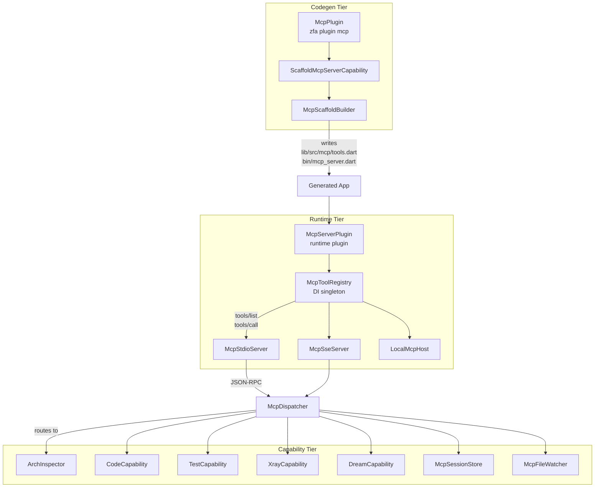

The Zuraffa MCP Server exposes the canonical v5 workflow — `entity create` → `make` → `build` — as Model Context Protocol tools callable by AI agents. It supports two transports (stdio and SSE), a shared JSON-RPC dispatcher, and a layered architecture that separates codegen scaffolding from runtime tool execution.

## Architecture Overview

The MCP server operates across three tiers: the **codegen tier** (scaffolds server files into apps), the **runtime tier** (serves tools over stdio or SSE), and the **capability tier** (implements domain-specific tool logic). These tiers communicate through a shared `McpToolRegistry` that is the single source of truth for the tool surface.



Sources: [mcp_plugin.dart](lib/src/plugins/mcp/mcp_plugin.dart#L1-L96), [mcp_server_plugin.dart](lib/src/core/module/mcp_server_plugin.dart#L1-L228), [mcp_dispatcher.dart](lib/src/core/module/mcp_dispatcher.dart#L1-L117)

## Transports

The runtime MCP server offers two transports that share the same `McpToolRegistry` and JSON-RPC dispatcher. Only the framing differs.

### stdio Transport

`McpStdioServer` reads JSON-RPC requests line-by-line from stdin and writes one response per line to stdout. It is the default transport for agent integrations and is suitable for both local and CI environments.

| Property | Value |
|----------|-------|
| Input | stdin (UTF-8, line-delimited JSON-RPC) |
| Output | stdout (one JSON-RPC response per line) |
| Diagnostic sink | stderr |
| Protocol version | `2024-11-05` |
| Supported methods | `initialize`, `tools/list`, `tools/call`, `ping`, `shutdown` |
| Injectability | Tests inject `inputStream`, `outputSink`, `errorSink` |

The stdio loop never returns in production — stdin is held open until the process is killed. Notifications (requests with `id == null`) receive no response, per JSON-RPC 2.0.

Sources: [mcp_stdio_server.dart](lib/src/core/module/mcp_stdio_server.dart#L1-L163)

### SSE Transport

`McpSseServer` exposes the MCP protocol over HTTP with Server-Sent Events, enabling remote agents to connect over a network. It listens on `127.0.0.1` by default and binds to `0.0.0.0` when authentication is enabled.

**Endpoint contract:**

| Method | Path | Purpose |
|--------|------|---------|
| `GET` | `/sse` | Opens the SSE stream; first event is `endpoint` with the POST URL |
| `POST` | `/message?sessionId=<id>` | Accepts JSON-RPC request body, dispatches to registry |
| `GET` | `/health` | Returns `{"status": "ok", "transport": "sse"}` |

**Security model:**

- **Unauthenticated mode**: Loopback-only enforcement via `Origin` and `Host` header validation to prevent DNS rebinding attacks
- **Authenticated mode**: Bearer token in `Authorization` header required for non-loopback clients; loopback connections bypass auth
- **Connection limit**: Optional `maxConnections` cap; new connections rejected with HTTP 503
- **Per-token tool allowlists**: Restrict which tools a bearer token may invoke; unlisted tokens denied tool calls

The SSE implementation is deliberately minimal — no retries, no keep-alive heartbeats, no SSE-Event-ID bookkeeping. Responses are streamed back over the SSE channel after the POST is acknowledged with HTTP 202.

Sources: [sse_server.dart](lib/src/mcp/sse_server.dart#L1-L496)

## JSON-RPC Dispatcher

`McpDispatcher` is the shared method-routing layer for both transports. It handles the MCP protocol subset and converts tool handler failures into tool-level error results (never transport errors).

| Method | Behavior |
|--------|----------|
| `initialize` | Returns `protocolVersion`, `serverInfo`, and `capabilities` |
| `tools/list` | Returns `registry.toolDefinitions()` — name, description, inputSchema per tool |
| `tools/call` | Resolves tool by name, validates args, invokes handler, returns `McpToolResult.toJson()` |
| `ping` | Returns `{"pong": true}` |
| `shutdown` | Returns `{}` |
| Unknown method | JSON-RPC error `-32601 Method not found` |
| Invalid params | JSON-RPC error `-32602 Invalid params` |

Error code mapping follows JSON-RPC 2.0 conventions. Tool-level exceptions are caught and surfaced as `isError: true` results so the MCP client sees them as tool problems rather than transport failures. The full stack trace is logged to the diagnostic sink; the wire response carries only the exception message.

Sources: [mcp_dispatcher.dart](lib/src/core/module/mcp_dispatcher.dart#L1-L117)

## Tool Registry & Contract

### McpTool abstract class

Every app feature exposed as an MCP tool implements the `McpTool` contract:

```dart
abstract class McpTool {
  String get name;               // stable snake_case identifier
  String get description;        // AI-facing description
  Map<String, dynamic> get inputSchema;  // JSON Schema draft-07 subset
  Future<McpToolResult> call(Map<String, dynamic> arguments);
}
```

The `inputSchema` is forwarded verbatim to the MCP client in the `tools/list` response. Implementations should validate inputs defensively — the MCP client is untrusted — and return an `McpToolResult`, never throw across the JSON-RPC boundary.

### McpToolResult

The result contract mirrors the MCP `tools/call` response shape with an `isError` flag and a `content` array. The current contract emits a single text content block.

| Constructor | Purpose |
|-------------|---------|
| `McpToolResult.ok(text)` | Success result with text payload |
| `McpToolResult.error(message)` | Error result surfaced to the model |
| `McpToolResult.artifact(ref)` | Ref-only result for large bodies stored out-of-band |

The `artifactRef` pattern implements the "ref-only" contract: when set, the wire response carries only a pointer (file path, content-addressed URI, or object-store key), never the body itself. This prevents multi-MB results from crossing the JSON-RPC boundary. The `data` field exists for in-process runtime and test use only and is deliberately not serialized.

Sources: [mcp_tool.dart](lib/src/core/module/mcp_tool.dart#L1-L179)

### McpToolRegistry

The registry is the single source of truth for the tool surface. It is registered as a singleton in the DI container during the engine's `registerDependencies` phase.

| Method | Purpose |
|--------|---------|
| `register(tool, override: false)` | Registers a tool; throws on duplicate name unless `override: true` |
| `unregister(name)` | Removes a tool; returns the removed instance or null |
| `find(name)` | Looks up a tool by name |
| `call(name, args)` | Transport-free invocation; converts throws to error results |
| `toolDefinitions()` | Builds the MCP `tools/list` result list |
| `allTools` / `toolNames` | Immutable views of registered tools in insertion order |

Dart's `LinkedHashMap` preserves insertion order by default, so `toolDefinitions()` returns tools in registration order.

Sources: [mcp_tool_registry.dart](lib/src/core/module/mcp_tool_registry.dart#L1-L103)

## Runtime Plugin

`McpServerPlugin` is the runtime-tier Zuraffa plugin that wires app tools into the DI tree. It is generated by `zfa plugin mcp` into the host app's `lib/src/plugin/mcp_server_plugin.dart`.

**Constructor parameters:**

| Parameter | Type | Default | Purpose |
|-----------|------|---------|---------|
| `pluginId` | `String` | `'mcp'` | Plugin identifier in the engine |
| `tools` | `List<McpTool>` | `[]` | Tools to expose |
| `autoStartStdio` | `bool` | `false` | Auto-start stdio server in `onInit` |
| `autoStartSsePort` | `int?` | `null` | Auto-start SSE server on this port |
| `sseAuthToken` | `String?` | `null` | Bearer token for auto-started SSE server |
| `maxSseConnections` | `int?` | `null` | Max concurrent SSE sessions |
| `sseToolAllowlist` | `Map<String, Set<String>>?` | `null` | Per-token tool restrictions |

**Lifecycle:**

1. `registerDependencies(di)` — Creates `McpToolRegistry`, registers all tools, stores as DI singleton
2. `onInit(di)` — Captures DI container; optionally auto-starts stdio or SSE server
3. `serveStdio()` / `serveSse()` — Starts the respective transport; throws if called before bootstrap

The plugin does not auto-start any server by default — the host app decides when to start the loop, typically at the end of `main()` after `engine.bootstrap()` completes.

Sources: [mcp_server_plugin.dart](lib/src/core/module/mcp_server_plugin.dart#L1-L228)

## Codegen Scaffolding

The `McpPlugin` (codegen tier) scaffolds a runtime MCP server into a Zuraffa app via `zfa plugin mcp` (or `zfa mcp scaffold`). It writes two files:

| File | Purpose |
|------|---------|
| `lib/src/mcp/tools.dart` | App's declared `McpTool` list (initially a placeholder `EchoTool`) |
| `bin/mcp_server.dart` | Standalone entrypoint that boots the engine + `McpServerPlugin` and serves stdio (or SSE with `--sse`) |

Both files are stamped `// Generated by zfa` so subsequent runs can identify them. `--force` overwrites; without it, existing files are skipped so user customizations survive re-runs. The `--revert` flag deletes the scaffolded files.

Sources: [mcp_plugin.dart](lib/src/plugins/mcp/mcp_plugin.dart#L1-L96), [scaffold_mcp_server_capability.dart](lib/src/plugins/mcp/capabilities/scaffold_mcp_server_capability.dart#L1-L199)

## v2 Capability Tools

The MCP server exposes v2.0 capability tools that extend beyond the basic codegen operations. These are defined in `v2_tools.dart` and handled by `handleV2ToolCall`.

| Tool | Capability | Description |
|------|-----------|-------------|
| `arch_inspect` | `ArchInspector` | Returns full architectural model: entities, use cases, repositories, data sources, presentation layers, DI registrations, routes |
| `arch_refactor` | `ArchInspector.refactor()` | Micro-refactoring: `rename-entity-field`, `add-entity-method` |
| `test_runUseCase` | `TestCapability` | Runs a UseCase in isolation with provided params and optional mocks |
| `code_generateView` | `CodeCapability` | Generates a view/controller/state trio for an entity via the canonical v5 pipeline |
| `graphql_pullSchema` | GraphQL client | Introspects a GraphQL endpoint and returns the schema as JSON |
| `graphql_generateFromSchema` | GraphQL codegen | Introspects a schema and generates entities, enums, and UseCases |
| `xray_inspect` | `XrayCapability` | Inspects the live X-Ray widget tree from a running Flutter app |
| `xray_triggerAction` | `XrayCapability` | Triggers a bound action on an X-Ray node |
| `xray_triggerMock` | `XrayCapability` | Triggers a mock injection via the X-Ray Control Deck |
| `session_save` | `McpSessionStore` | Persists MCP session state to `.zfa/mcp_sessions/` |
| `session_restore` | `McpSessionStore` | Restores a previously saved MCP session |
| `dream_draftSpec` | `DreamCapability` | Drafts spec.md + plan.md pair from a plain-English feature description |

Sources: [v2_tools.dart](lib/src/mcp/v2_tools.dart#L1-L965), [arch_capability.dart](lib/src/mcp/capabilities/arch_capability.dart#L1-L706), [code_capability.dart](lib/src/mcp/capabilities/code_capability.dart#L1-L76), [test_capability.dart](lib/src/mcp/capabilities/test_capability.dart#L1-L204), [xray_capability.dart](lib/src/mcp/capabilities/xray_capability.dart#L1-L174), [dream_capability.dart](lib/src/mcp/capabilities/dream_capability.dart#L1-L409)

## Authentication

The MCP server implements a two-tier authentication model:

**McpAuth** (SSE transport):

- Loopback connections (`127.0.0.1`, `::1`) bypass auth entirely
- Remote connections require a Bearer token in the `Authorization` header
- Per-token tool allowlists restrict which tools a token may invoke
- Constant-time string comparison prevents timing attacks on token validation

**XRayBridgeAuth** (X-Ray bridge endpoints):

- Same loopback-bypass model for the X-Ray bridge HTTP endpoints
- Validates `Authorization: Bearer <token>` header with constant-time comparison
- In release mode, all X-Ray endpoints return 404 (FR-006 / SC-004)

Sources: [auth.dart](lib/src/mcp/auth.dart#L1-L143), [xray_bridge_auth.dart](lib/src/mcp/xray_bridge/xray_bridge_auth.dart#L1-L79)

## Session Persistence

`McpSessionStore` persists agent session state to JSON files under `.zfa/mcp_sessions/`. Each session tracks:

- `id` — unique session identifier
- `createdAt` / `lastActiveAt` — timestamps
- `state` — arbitrary JSON state (subscribed paths, last inspect results, pending operations)

Session IDs are validated to prevent path traversal attacks — IDs containing `..`, `/`, or `\\` are rejected, and the resolved path is verified to remain within the sessions directory.

Sources: [session_store.dart](lib/src/mcp/session_store.dart#L1-L136)

## File Watcher

`McpFileWatcher` watches `lib/src/` recursively for `.dart` file changes and emits `McpFileEvent` notifications to connected SSE clients. Events carry `type` (`created` | `modified` | `deleted`), `path` (relative to project root), and `timestamp`. The watcher also supports synthetic regeneration notifications via `notifyRegeneration()`.

Sources: [file_watcher.dart](lib/src/mcp/file_watcher.dart#L1-L118)

## In-Process Bridge

`LocalMcpHost` provides a transport-free surface for in-process tool invocation. It wraps an `McpToolRegistry` and exposes the same `listTools()` and `callTool()` operations the stdio and SSE transports perform — but with no socket, no JSON-RPC framing, and no serialization. This is the server-side half of the in-process bridge used by the agent runtime.

Sources: [mcp_local_host.dart](lib/src/core/module/mcp_local_host.dart#L1-L36)

## CLI Command

The `zfa mcp` command is auto-registered by `McpPlugin` via `CliAwarePlugin.createCommand()`. It inherits standard plugin flags and adds three subcommands:

| Subcommand | Purpose |
|------------|---------|
| `zfa mcp serve [--sse] [--port <n>] [--token <t>]` | Runs the scaffolded `bin/mcp_server.dart` (stdio by default, or SSE with `--sse`) |
| `zfa mcp list-tools [--pretty]` | Subprocesses `bin/mcp_server.dart --list-tools` and prints tool definitions as JSON |
| `zfa mcp replay <session-file>` | Re-executes a committed JSON scenario of MCP tool calls against the real server; writes a verdict receipt |

The `replay` subcommand supports a scenario file format:

```json
{
  "session": "<name>",
  "calls": [
    {
      "tool": "<tool-name>",
      "arguments": { ... },
      "expect_contains": "<substring>"
    }
  ]
}
```

Each call produces a verdict (`ok` / `missing-tool` / `mismatch` / `error`), and a proof-carrying receipt is written to `.zfa/receipts/mcp-replay-<session>.json`. Exit code is 0 iff every call is `ok`.

Sources: [mcp_command.dart](lib/src/commands/mcp_command.dart#L1-L521)

## Standalone Server Binary

`bin/zuraffa_mcp_server.dart` is the standalone MCP server binary that the CLI subcommands subprocess. It implements the full JSON-RPC server loop with:

- Plugin registry initialization via `PluginLoader`
- Dynamic tool enumeration from registered plugin capabilities
- v2 capability tool definitions and dispatch
- WebSocket server support via `--ws` flag (port 8371 default)
- Session store and file watcher integration
- Verdict envelope structured content passthrough (spec 1105)

The server advertises `protocolVersion: 2024-11-05` and supports the `resources/list` and `resources/read` methods in addition to the standard MCP methods.

Sources: [zuraffa_mcp_server.dart](bin/zuraffa_mcp_server.dart#L1-L1881)

## Tool Provider SPI

The agent runtime tier provides an SPI for device packages to declare their available MCP tools under a namespace. `McpToolProvider` implementations are discovered via DI/engine registration by `AgentRuntimePlugin`. Each provider contributes zero or more tools to the assembled `McpToolRegistry` using `McpToolContext` as a DI accessor.

Sources: [mcp_tool_provider.dart](lib/src/agent/runtime/mcp_tool_provider.dart#L1-L57)

## X-Ray Bridge Handlers

The X-Ray bridge provides pure-Dart HTTP handlers for the running app's X-Ray overlay:

| Endpoint | Method | Purpose |
|----------|--------|---------|
| `/xray/tree` | `GET` | Returns the current X-Ray tree as JSON |
| `/xray/action` | `POST` | Triggers a node's bound action |
| `/xray/control-deck` | `POST` | Injects a synthetic mock |

In release mode, every handler returns 404 (FR-006 / SC-004). The handlers use dynamic dispatch (duck-typed `overlayState` and `controlDeck`) to avoid forward dependencies on spec 036 and 034.

Sources: [xray_bridge_handlers.dart](lib/src/mcp/xray_bridge/xray_bridge_handlers.dart#L1-L173)

## Next Steps

For intermediate developers working with the MCP server, the recommended progression is:

1. **[CLI Commands & Subcommands](6-cli-commands-and-subcommands)** — Understand the full `zfa` CLI surface that the MCP server wraps
2. **[Plugin System Architecture](7-plugin-system-architecture)** — Learn how MCP tools integrate with the broader plugin ecosystem
3. **[Code Generation Engine & Proof Receipts](9-code-generation-engine-and-proof-receipts)** — Deep dive into the v5 generation pipeline that `zuraffa_make` invokes
4. **[Agent & Skill Ecosystem](10-agent-and-skill-ecosystem-speckit-and-kimi-skills)** — Understand how MCP tools fit into the agent runtime
5. **[TDD Cycle & Spec-Driven Development](13-tdd-cycle-and-spec-driven-development)** — Learn how the `dream_draftSpec` tool connects to the spec-driven workflow