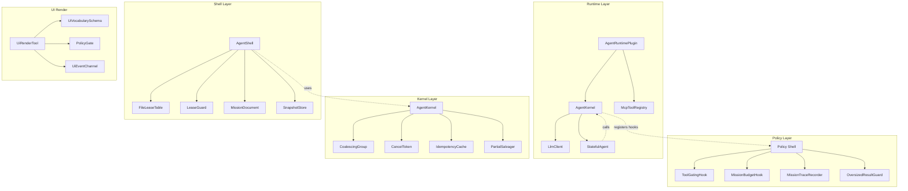
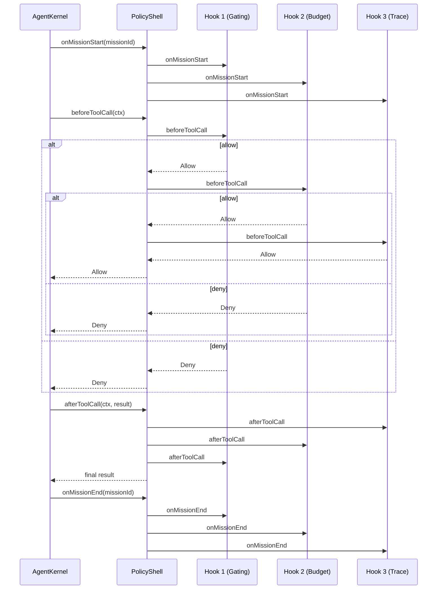
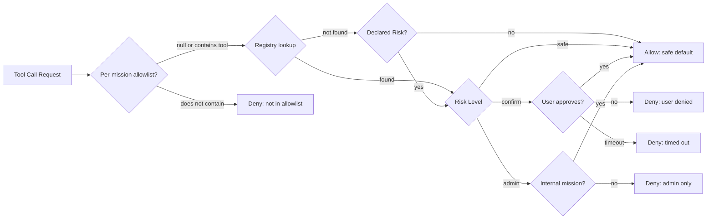
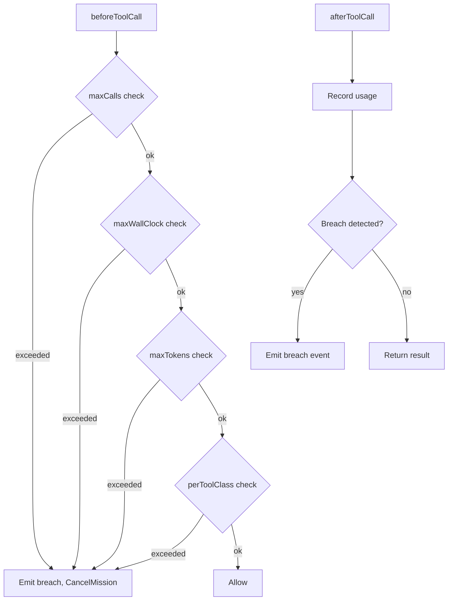
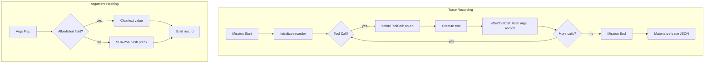
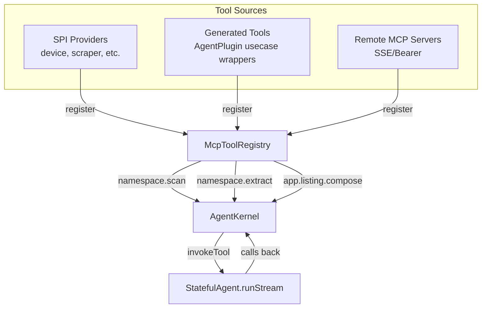
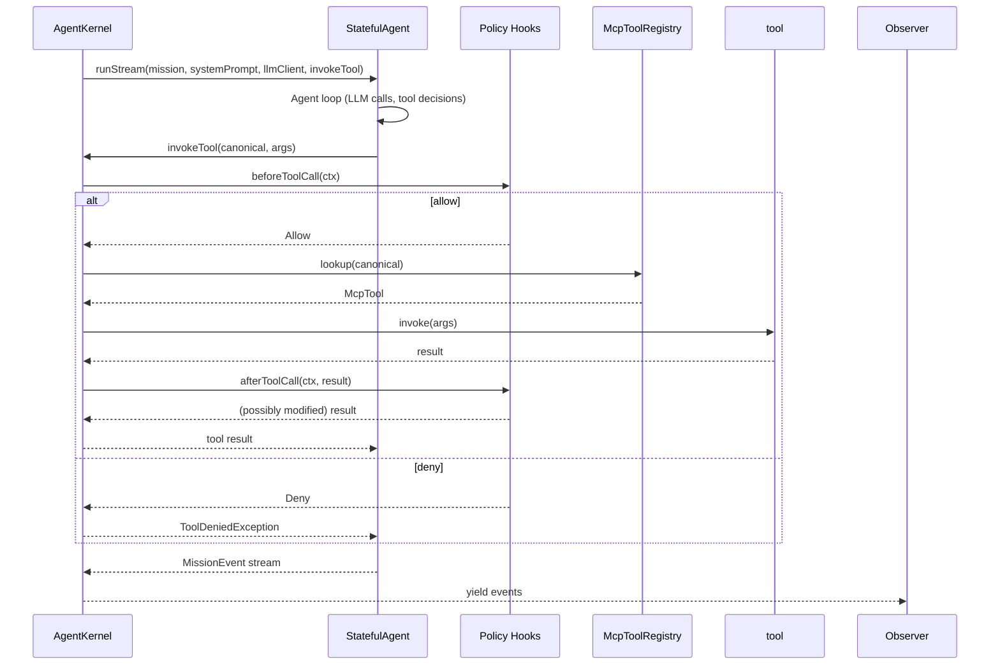
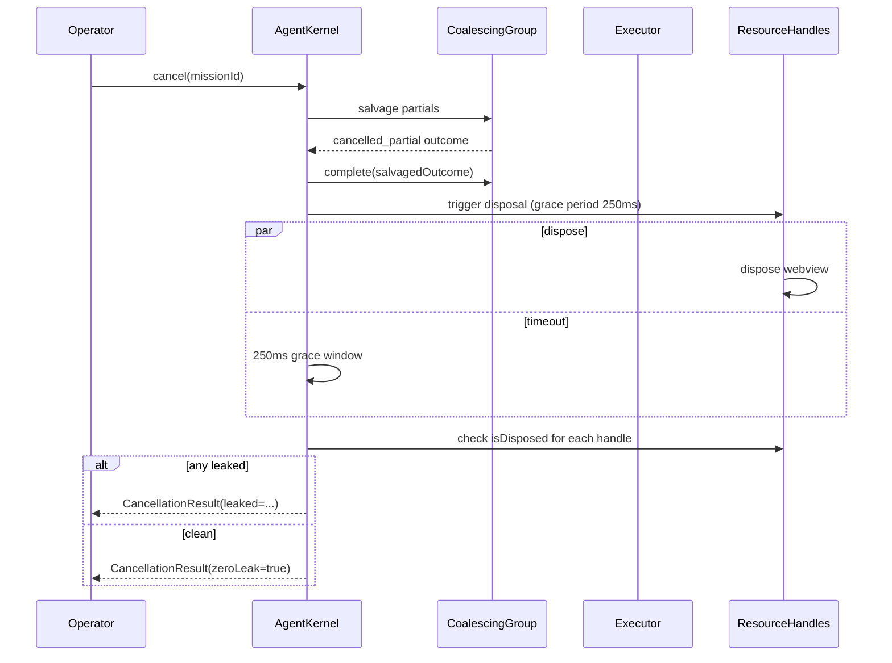
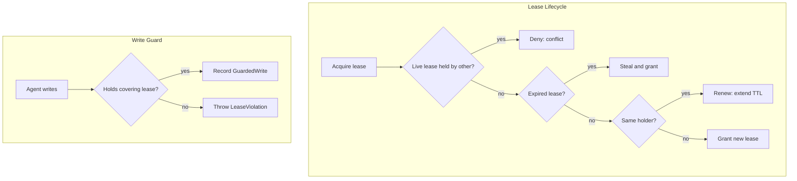
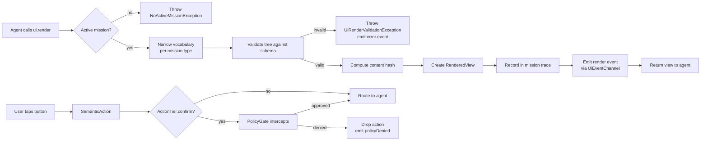

The Agent Policy & Runtime Contract defines the safety, governance, and execution boundaries for autonomous agent missions within the Zuraffa framework. It spans four architectural layers: the **Policy Shell** (composable hooks for tool gating, budget enforcement, and trace recording), the **Runtime Plugin** (tool registry assembly and kernel orchestration), the **Agent Kernel** (mission coalescing, cancellation, and partial salvage), and the **Agent Shell** (NDJSON daemon with file leases and durable mission documents). Together they ensure agents operate within declared risk tiers, budget envelopes, and workspace leases while producing replayable audit traces.

## Architecture Overview

The agent runtime is organized as a layered system where each layer provides a distinct governance concern, with clear separation between policy definition (what is allowed), runtime enforcement (how it is enforced), and shell durability (what survives process death).



Sources: [lib/src/agent/policy/policy_shell.dart](lib/src/agent/policy/policy_shell.dart#L1-L25), [lib/src/agent/runtime/agent_runtime_plugin.dart](lib/src/agent/runtime/agent_runtime_plugin.dart#L1-L28), [lib/src/agent/kernel/agent_kernel.dart](lib/src/agent/kernel/agent_kernel.dart#L1-L36), [lib/src/agent/shell/agent_shell.dart](lib/src/agent/shell/agent_shell.dart#L1-L460), [lib/src/agent/ui_render/ui_render.dart](lib/src/agent/ui_render/ui_render.dart#L1-L24)

## Policy Shell: Composable Governance Hooks

The Policy Shell is the framework-default safety layer, shipping three composable, individually-disableable hooks that intercept the agent loop at defined lifecycle points. It is implemented as a middleware chain where `beforeToolCall` runs in registration order (first non-allow decision wins) and `afterToolCall` runs in reverse registration order (first-registered hook wraps the others).

### Hook Lifecycle



Sources: [lib/src/agent/policy/policy_shell_class.dart](lib/src/agent/policy/policy_shell_class.dart#L1-L87), [lib/src/agent/policy/policy_hook.dart](lib/src/agent/policy/policy_hook.dart#L1-L142)

### Tool Gating: Risk Tier Enforcement

The `ToolGatingHook` implements a three-tier risk model that governs every tool call before execution. The `PermissionRegistry` maps tool names to `RiskLevel` values, with the most-restrictive-wins semantics for conflicting entries.

| Risk Level | Behavior | User Intervention |
|-----------|----------|-------------------|
| `safe` | Auto-executes without user intervention | None |
| `confirm` | Blocks until user approves; denies on timeout (default 30s) | Explicit approval required |
| `admin` | Denied for non-internal missions; allowed for internal missions | None (internal only) |

The gating logic follows a precedence chain: per-mission allowlist takes highest priority (deny if tool not in allowlist), then the registry lookup, then the tool's self-declared risk metadata as fallback, defaulting to `safe` if neither is present.



Sources: [lib/src/agent/policy/tool_gating_hook.dart](lib/src/agent/policy/tool_gating_hook.dart#L1-L77), [lib/src/agent/policy/permission_registry.dart](lib/src/agent/policy/permission_registry.dart#L1-L39)

### Mission Budget: Four-Dimension Enforcement

The `MissionBudgetHook` enforces spending limits across four dimensions, cancelling the mission on the first breach detected. Each dimension is checked before the tool call executes, preventing the call that would exceed the budget.

| Dimension | Description | Default Limit |
|-----------|-------------|---------------|
| `calls` | Maximum number of tool calls | 100 |
| `wallClock` | Maximum wall-clock duration | 10 minutes |
| `tokens` | Maximum cumulative token usage | 100,000 |
| `perToolClass` | Maximum cumulative duration per tool class | webview: 5min, scraper: 5min |

The hook emits a typed `BudgetBreach` event for each breached dimension and supports a `BudgetDegradeCallback` integration point for model-client degradation (e.g., switching to a lower-cost model when approaching token limits).



Sources: [lib/src/agent/policy/mission_budget.dart](lib/src/agent/policy/mission_budget.dart#L1-L158), [lib/src/agent/policy/mission_budget_hook.dart](lib/src/agent/policy/mission_budget_hook.dart#L1-L134)

### Mission Trace: Audit-Ready Recording

The `MissionTraceRecorder` produces a complete, replayable JSON trace of every mission. It records tool-call entries with hashed arguments (SHA-256), configurable cleartext allowlist, timing, status, token usage, and provider. The recorder is single-mission by design—one instance per mission—ensuring append-only integrity under concurrent streaming events.

The trace schema includes:
- `schemaVersion` for forward compatibility
- `missionId` and `inputHash` for deduplication
- `planSteps` for declared intent
- `toolCalls` array with `name`, `argumentsHash`, `cleartextArgs`, `durationMs`, `status`, `tokenUsage`, `provider`
- `durationMs`, `status`, `tokens`, `outcome`



Sources: [lib/src/agent/policy/mission_trace_recorder.dart](lib/src/agent/policy/mission_trace_recorder.dart#L1-L111), [lib/src/agent/policy/mission_trace.dart](lib/src/agent/policy/mission_trace.dart#L1-L122)

### Oversized Result Guard

The `OversizedResultGuard` intercepts tool results exceeding a configurable threshold before they enter model context. It swaps large payloads with a compact `ArtifactReference` (URI, size, SHA-256) and stores the full result externally. If artifact storage is unavailable, it falls back to truncation with a marker—degraded but not broken.

Sources: [lib/src/agent/policy/oversized_result_guard.dart](lib/src/agent/policy/oversized_result_guard.dart#L1-L60), [lib/src/agent/policy/artifact_reference.dart](lib/src/agent/policy/artifact_reference.dart#L1-L55)

## Runtime Plugin: Tool Assembly & Kernel Orchestration

The `AgentRuntimePlugin` assembles a flat, collision-safe `McpToolRegistry` from three sources and hosts the agent kernel in-process over `dart_agent_core`. It is the bridge between tool providers, the kernel, and the agent loop.

### Tool Registry Assembly

The `McpToolRegistry` merges tools from three sources under namespace-prefixed canonical names (`"$namespace.$toolName"`):

1. **SPI Providers** — device packages implement `McpToolProvider` with a `namespace` and `buildTools(McpToolContext)` method, discovered via DI/engine registration
2. **Generated Usecase Tools** — the `AgentPlugin` emits one `McpTool` wrapper per usecase under `lib/src/agent/tools/{entity}_{verb}_tool.dart`
3. **Remote MCP Servers** — connected via `dart_agent_core`'s `McpManager` with SSE/Bearer transport

The registry enforces collision safety: the first source to register a canonical name wins; later attempts throw `NamespaceCollisionException`.



Sources: [lib/src/agent/runtime/mcp_tool_registry.dart](lib/src/agent/runtime/mcp_tool_registry.dart#L1-L82), [lib/src/agent/runtime/mcp_tool_provider.dart](lib/src/agent/runtime/mcp_tool_provider.dart#L1-L57)

### Kernel Delegation Contract

The `AgentKernel` is a thin orchestrator that delegates the agent loop entirely to `dart_agent_core`'s `StatefulAgent.runStream`. It does NOT implement the loop itself (FR-013 — no duplication). The kernel supplies three things to the agent loop:

- `systemPrompt` — composed by `SystemPromptComposer` from playbook text + tool manifests
- `llmClient` — wired by the plugin (defaults to `FallbackLLMClient`)
- `invokeTool` — hook-gated tool invocation callback



Sources: [lib/src/agent/runtime/agent_kernel.dart](lib/src/agent/runtime/agent_kernel.dart#L1-L152), [lib/src/agent/runtime/stateful_agent.dart](lib/src/agent/runtime/stateful_agent.dart#L1-L84)

## Agent Kernel: Mission Coalescing & Cancellation

The `AgentKernel` provides mission coalescing, cancellation with partial salvage, and idempotency. It operates within a single Dart isolate with cooperative concurrency.

### Mission Lifecycle

```mermaid
stateDiagram-v2
    [*] --> pending: submit()
    pending --> running: coalescing window expires<br/>or first execution
    running --> completed: normal finish
    running --> cancelled_partial: cancel() triggered
    running --> failed: exception or tool error
    completed --> [*]
    cancelled_partial --> [*]
    failed --> [*]
    
    note right of running<br/>Coalescing: identical keys<br/>share one execution
    end note
    
    note right of cancelled_partial<br/>Partials salvaged<br/>Resource handles disposed<br/>within grace period (250ms)
    end note
```

Sources: [lib/src/agent/kernel/kernel.dart](lib/src/agent/kernel/kernel.dart#L1-L197), [lib/src/agent/kernel/mission_coalescer.dart](lib/src/agent/kernel/mission_coalescer.dart#L1-L113)

### Coalescing & Idempotency

Identical missions (same `MissionKey`: spark type + normalized value + country + strategy variant) coalesce into a single execution within a configurable window (default 50ms). Subscribers to the same key receive the same event stream. After completion, the outcome is cached in an LRU-bounded idempotency cache (TTL default 5 minutes, max 256 entries) so re-submissions within the TTL return the cached outcome without re-execution.

### Cancellation Protocol

Cancellation triggers a grace-period disposal race (default 250ms). The kernel:
1. Salvages accumulated partials into a `cancelled_partial` outcome
2. Completes the coalescing group with the salvaged outcome
3. Triggers disposal of all registered `ResourceHandle`s
4. Asserts zero resource leaks (handles that failed to dispose within the grace window are reported)



Sources: [lib/src/agent/kernel/cancellation.dart](lib/src/agent/kernel/cancellation.dart#L1-L92), [lib/src/agent/kernel/partial_salvage.dart](lib/src/agent/kernel/partial_salvage.dart#L1-L22), [lib/src/agent/kernel/resource_handle.dart](lib/src/agent/kernel/resource_handle.dart#L1-L78)

## Agent Shell: NDJSON Daemon with Durable State

The `AgentShell` (`zfa agent shell`) is a long-lived daemon that agents connect to over an NDJSON message stream. It provides real-time file leases, durable mission documents, and budget meters—all surviving process restarts via snapshot storage.

### Shell Protocol

The wire protocol is NDJSON: one JSON object per line, in and out. The shell reads request envelopes from the agent's stdin and writes response + event envelopes to stdout. Event types include `budget.tick`, `budget.breach`, `lease.granted`, `lease.denied`, `mission.step.done`, `mission.completed`, `mission.failed`.

### File Lease Table

The `FileLeaseTable` provides real-time, crash-safe file ownership:
- **Real-time**: leases are granted/denied at write time, not plan time
- **Crash-safe**: leases carry a TTL; dead agents' leases expire and become stealable
- **Workspace-scoped**: a lease covers a scope prefix (feature directory), protecting every file under it



Sources: [lib/src/agent/shell/shell_protocol.dart](lib/src/agent/shell/shell_protocol.dart#L1-L39), [lib/src/agent/shell/file_lease_table.dart](lib/src/agent/shell/file_lease_table.dart#L1-L214), [lib/src/agent/shell/lease_guard.dart](lib/src/agent/shell/lease_guard.dart#L1-L97)

### Mission Document Durability

The `MissionDocument` captures role, goal, steps with durable status, cursor, held lease scopes, and budget spec—all serializable for resume. The `SnapshotStore` persists documents to disk, so a fresh agent (or fresh daemon process) resumes exactly where the last one died. The `kill -9` boundary is respected: a step in flight when the agent dies does NOT advance the durable cursor.

| Role | Allowed Tools | Mutation |
|------|--------------|----------|
| `planner` | plan.read, plan.write, code.read, test.run | Never mutates code |
| `builder` | plan.read, code.read, code.write, test.run | Only role that writes code |
| `reviewer` | plan.read, code.read, review.approve, review.reject | Never writes or deploys |
| `operator` | deploy.run, rollback.run, status.read | Never mutates codebase |

Sources: [lib/src/agent/shell/agent_shell.dart](lib/src/agent/shell/agent_shell.dart#L1-L460), [lib/src/agent/shell/mission_document.dart](lib/src/agent/shell/mission_document.dart#L1-L388)

## UI Render: Agent-Authored Interfaces

The `ui.render` tool allows agents to author component trees that are validated against a vocabulary schema, rendered by the host UI, and interacted with via semantic actions. This layer is pure-Dart with no `package:flutter` dependencies.

### Rendering Pipeline



Sources: [lib/src/agent/ui_render/ui_render_tool.dart](lib/src/agent/ui_render/ui_render_tool.dart#L1-L261), [lib/src/agent/ui_render/policy_gate.dart](lib/src/agent/ui_render/policy_gate.dart#L1-L112), [lib/src/agent/ui_render/semantic_action.dart](lib/src/agent/ui_render/semantic_action.dart#L1-L69)

### Vocabulary Schema & Narrowing

The `UiVocabularySchema` defines the canonical set of allowed component nodes, style tokens, and node-count caps. The `VocabularyNarrowing` mechanism restricts the schema per mission type (e.g., a `listing` mission may only use card, button, text, image; a `chat` mission may use message, input, send-button). This prevents agents from rendering unauthorized UI components.

Sources: [lib/src/agent/ui_render/ui_vocabulary_schema.dart](lib/src/agent/ui_render/ui_vocabulary_schema.dart#L1-L272), [lib/src/agent/ui_render/vocabulary_narrowing.dart](lib/src/agent/ui_render/vocabulary_narrowing.dart#L1-L55)

## Agent Plugin: Code Generation for Tool Wrappers

The `AgentPlugin` generates `McpTool` wrappers for every generated UseCase when invoked via `zfa make Foo --agent`. It activates when the `--agent` flag is parsed or when project config enables `agent` by default.

### Generation Pipeline

```mermaid
graph TD
    A[zfa make Foo --agent] --> B[AgentPlugin.generate]
    B --> C[Introspect usecase directory]
    C --> D[Detect canonical-name collisions<br/>before writing any files]
    D --> E[Emit tool wrapper per usecase<br/>lib/src/agent/tools/{entity}_{verb}_tool.dart]
    E --> F[Emit manifest.dart barrel<br/>with name/entity/risk tier]
    F --> G[Preserve manual edits<br/>via GeneratedMarkerMerger]
    G --> H[Sweep orphans<br/>delete unreferenced tool files]
    
    I[UseCase annotated<br/>@AgentInternal] --> J[Risk tier: admin]
    I --> K[Risk tier: safe]
```

Sources: [lib/src/agent/plugin/agent_plugin.dart](lib/src/agent/plugin/agent_plugin.dart#L1-L297), [lib/src/agent/plugin/tool_namespace.dart](lib/src/agent/plugin/tool_namespace.dart#L1-L77), [lib/src/agent/plugin/manifest_entry.dart](lib/src/agent/plugin/manifest_entry.dart#L1-L47), [lib/src/agent/plugin/manifest_emitter.dart](lib/src/agent/plugin/manifest_emitter.dart#L1-L55)

## Configuration & Defaults

The framework ships with sensible defaults that can be overridden per-mission or per-project:

| Component | Default | Override Point |
|-----------|---------|----------------|
| Coalescing window | 50ms | `KernelConfig.coalescingWindow` |
| Idempotency TTL | 5 minutes | `KernelConfig.idempotencyTtl` |
| Cancellation grace period | 250ms | `KernelConfig.cancellationGracePeriod` |
| Mission budget (calls) | 100 | `MissionBudget.maxCalls` |
| Mission budget (wall-clock) | 10 minutes | `MissionBudget.maxWallClock` |
| Mission budget (tokens) | 100,000 | `MissionBudget.maxTokens` |
| Confirm timeout | 30 seconds | `ToolGatingHook.confirmTimeout` |
| Oversized result threshold | configurable | `OversizedResultGuard.threshold` |
| Default lease TTL | 5 minutes | `AgentShell.defaultLeaseTtl` |
| Tool namespace | `app` | `AgentPlugin.namespaceOverride` |

Sources: [lib/src/agent/kernel/kernel_config.dart](lib/src/agent/kernel/kernel_config.dart#L1-L24), [lib/src/agent/policy/mission_budget.dart](lib/src/agent/policy/mission_budget.dart#L1-L158), [lib/src/agent/policy/tool_gating_hook.dart](lib/src/agent/policy/tool_gating_hook.dart#L1-L77)

## Cross-Layer Concerns

### Single-Isolate Assumption

The entire agent runtime operates within a single Dart isolate. Concurrency is cooperative (async/await on the event loop), not parallel. For multi-isolate pool support, override `MissionExecutor` and `ResourceRegistry` with implementations that proxy work over `SendPort`/`ReceivePort`—the kernel's coordination logic is unchanged.

### No-JIT Execution Policy

The agent runtime is pure-Dart with no `package:flutter` imports in the policy, kernel, or runtime layers. This ensures the governance code runs identically in headless CLI contexts, test environments, and production apps.

### Error Propagation

Tool call denials surface as `ToolDeniedException` (runtime layer) with the denying hook's ID and reason. Budget breaches emit typed `BudgetBreach` events and cancel the mission. Lease violations throw `LeaseViolation` at write time. All errors are propagated through the NDJSON stream as `error` envelopes in the shell layer.

## Testing & Verification

The agent runtime is covered by a comprehensive test suite organized by layer:

| Test Directory | Coverage |
|---------------|----------|
| `test/agent/policy/` | Permission registry, tool gating, budget enforcement, trace recording |
| `test/agent/runtime/` | MCP tool registry, tool provider SPI, kernel delegation |
| `test/agent/kernel/` | Mission coalescing, cancellation, idempotency, partial salvage |
| `test/agent/shell/` | File lease table, lease guard, mission document, shell protocol |
| `test/agent/ui_render/` | UI render tool, vocabulary schema, policy gate, semantic actions |
| `test/agent/plugin/` | Agent plugin generation, collision detection, manifest emission |

Sources: [test/agent/policy/tool_gating_and_budget_test.dart](test/agent/policy/tool_gating_and_budget_test.dart#L1-L476), [test/agent/runtime/agent_runtime_plugin_test.dart](test/agent/runtime/agent_runtime_plugin_test.dart#L1-L479)

## Next Steps

For developers consuming the agent runtime, the logical progression is:

1. **[Plugin System Architecture](7-plugin-system-architecture)** — understand how the AgentRuntimePlugin and AgentPlugin integrate with the wider plugin ecosystem
2. **[CLI Commands & Subcommands](6-cli-commands-and-subcommands)** — learn the `zfa agent shell`, `zfa make --agent`, and related commands
3. **[Proof Receipts & Verification Gates](15-proof-receipts-and-verification-gates)** — explore how mission traces feed into the verification and certification pipeline
4. **[TDD Cycle & Spec-Driven Development](13-tdd-cycle-and-spec-driven-development)** — see how agent missions integrate with the spec-driven development workflow