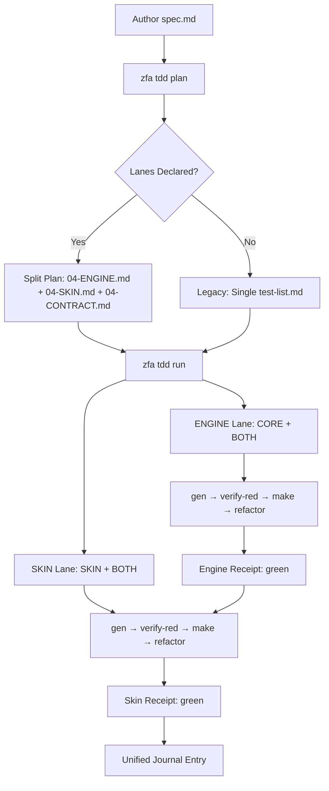

The zuraffa TDD cycle transforms feature specifications into verified, production-ready code through a disciplined red-green-refactor loop. Unlike traditional test-driven development where tests are hand-written, zuraffa's approach is **spec-driven**: you author a structured specification, and the system derives, generates, and verifies every behavior through a fully automated pipeline. The result is a tamper-evident evidence chain where every green test carries cryptographic proof of its red origin.

## Architecture Overview

The TDD system operates as a **two-cycle driver** that separates concerns between pure-Dart engine behaviors and Flutter skin behaviors. This separation is not merely organizational—it enforces architectural purity through machine-checked gates.



The **ENGINE lane** runs first and gates the SKIN lane. This dependency exists because the skin binds to mocks and contracts that the engine must certify first. A missing or red engine receipt causes the skin lane to exit with a refusal naming `zfa tdd run-engine` as the remedy.

## Core Components

### The Specification Contract

Every behavior originates from a structured `spec.md` file that carries load-bearing structural elements. The template enforces these through parser-level validation rather than convention.

| Section | Purpose | Enforcement |
| ------- | ------- | ----------- |
| `## User Scenarios & Testing` | Acceptance criteria with Given/When/Then | Mandatory; derives A-type behaviors |
| `## Requirements` | Functional requirements with `traces:` | Mandatory; derives U-type behaviors |
| `## Layer Contracts` | Declared interfaces and signatures | Routes FRs to contract rows |
| `## Key Entities` | Data entities as pipe table | Routes entity-tracing FRs |
| `## Lanes` | CORE/SKIN/BOTH classification | Required on current builds |
| `## Skin Contract` | Adaptive slots, states, routes | Required when `adaptive_slots` declared |

The `## Lanes` section is the critical architectural declaration. A spec without it is rejected with exit 2. Each lane declares which behavior IDs it owns:

```yaml
Lanes:
  - lane: CORE
    behaviors: [A1-A3, U1-U4]
    flutter_allowed: false
  - lane: SKIN
    behaviors: [W1-W3]
    flutter_allowed: true
    adaptive_slots: [macos]
  - lane: BOTH
    behaviors: []
    flutter_allowed: conditionally
```

### Behavior Classification

The planner derives behaviors from the spec and classifies them into kinds that determine generation strategy:

| Kind | Source | Subject Shape | Test Template |
| ---- | ------ | ------------ | ------------- |
| `acceptance` | Given/When/Then scenarios | Parameterless `void target()` | Composition lane test |
| `unit` | Functional requirements | Contract-shaped function | Unit test with outcome assertion |
| `widget` | UI-observable scenarios | View-builder stub | `testWidgets` with finders |
| `theme` | `## Theme harness` section | Theme contract subject | Theme harness widget test |
| `ffi` | Native-boundary declaration | FFI binding contract | Golden fixture assertion |
| `platform` | `## Platform harness` section | Platform channel stub | Channel test with certified fake |
| `contract` | Layer Contracts methods | Contract seam subject | Contract test (BLOCKED state) |

### The Plan Emission

`zfa tdd plan <feature>` reads `spec.md` and emits the behavior test list. For lane-declaring specs, it produces a split plan:

| File | Contents | Purity Gate |
| ---- | -------- | ----------- |
| `tdd/04-ENGINE.md` | CORE + BOTH behaviors | Zero `package:flutter` references enforced |
| `tdd/04-SKIN.md` | SKIN + BOTH behaviors | Lists `adaptive_slots` |
| `tdd/04-CONTRACT.md` | Engine/skin seam | Boundary statement + shared behaviors |
| `tdd/test-list.md` | Lane meta-index | Points to the three files above |

The plan enforces coverage: every FR and acceptance scenario must map to a behavior row. A requirement that produces no behavior row causes exit 2 with the offending spec line and a fix instruction—no artifacts are written.

## The TDD Loop Steps

Each behavior advances through four steps driven by the run driver. The loop is resumable; state persists in `tdd/run-state.json`.

### Step 1: Generate

`zfa tdd gen <behavior-id>` materializes exactly one test and one compilable subject. The artifacts are namespaced by feature-slug to prevent collisions:

- Test: `test/tdd/<feature-slug>/<snake-id>_test.dart`
- Subject: `lib/tdd/<feature-slug>/<snake-id>_subject.dart`

The generator delegates to `BehaviorTestWriter` for the test and `SubjectWriter` for the stub. The subject throws `UnimplementedError`, and the test asserts the behavior's description—so the first run is honestly red.

**Idempotency**: Re-running `gen` for the same behavior returns `Ownership.reused` for both artifacts. The only exception is when a stale stub was written by an older binary and is still an `UnimplementedError`—the pair is regenerated with a "binary updated, stub regenerated" note.

**Ownership conflict**: If a file exists on disk but the registry has no record for it, gen exits non-zero without modifying the file, naming `--adopt` as the resolving command.

### Step 2: Verify Red

`zfa tdd verify-red` certifies that the test fails for the right reason. It runs the target test through the profile's `single` command and classifies the outcome into exactly one of seven classes:

| Classification | Meaning | Action |
| -------------- | ------- | ------ |
| `assertion` | Honest red—assertion failure | Appends red evidence, proceeds |
| `compile-error` | CFE diagnostics present | Refuses, no evidence written |
| `load-error` | File/import unreadable | Refuses, no evidence written |
| `unexpected-green` | Test passed when it shouldn't | Refuses, no evidence written |
| `channel-timeout` | Platform channel never resolved | Refuses, no evidence written |
| `skipped` | Exit 0 with skip markers only | Refuses, no evidence written |
| `runner-error` | Anything else | Refuses, no evidence written |

Only `assertion` certification appends a red-evidence entry to `tdd/cycle-log.md`. The log is append-only and carries a tamper-evident hash chain: each entry includes `prev-hash` and `hash` fields computed as sha256 over the entry's certified facts plus the previous link.

### Step 3: Make (Green)

`zfa tdd make <behavior-id>` generates the minimal implementation through the zuraffa pipeline—never hand-writing source. The command:

1. Requires certified-red evidence before generating anything
2. Re-runs the target test to confirm it still fails
3. Plans generation through `entity create` / `make` / `build`
4. Executes via `PipelineRunner`, capturing every invocation
5. Runs the target test and requires a PASS
6. Runs the full suite and checks for regressions relative to a baseline
7. Appends a green-evidence entry on success

**Skip transition**: If the test is already green, make takes the skip transition—generation is skipped entirely, no suite run happens, and a green evidence entry with an empty generation block is appended. This allows the run loop to proceed past completed behaviors.

**Guard against vacuous green**: The `make` step refuses a green earned by guard-only assertions. For entity-returning contracts, the generated stub throws `UnimplementedError`, and the test carries a `zfa:tdd: vacuous-guard` marker. The detector keys on this literal string, so the marker must not survive even inside a replacement comment.

### Step 4: Refactor

`zfa tdd refactor` runs only on a green suite. It:

1. Runs the full suite as absolute preflight—refusing on any red
2. Captures a before snapshot of `test/` and `lib/`
3. Runs the fixed pass registry (zfa build, `dart format lib/`, `dart fix --apply lib/`)
4. Asserts `test/` is byte-identical and every changed `lib/` path is attributable
5. Re-runs the suite; on regression exits non-zero naming the regressed tests
6. Appends a refactor-evidence entry on green

The refactor step never modifies test files. This immutability is enforced by byte-level comparison against the before snapshot.

## Two-Cycle Architecture

The engine/skin split is the defining architectural decision of zuraffa's TDD system. It enforces a **pure-Dart core** with a **Flutter skin** bound by a declared contract.

### Lane Resolution

Lane truth comes from the split receipt first, then plan files, then row tags, then the legacy CORE default:

1. **Split receipt** (`tdd/split-receipt.json`): authoritative classification map
2. **Plan files** (`04-ENGINE.md` / `04-SKIN.md`): ids parsed from markdown table rows
3. **Row tags**: ` [core]` / ` [skin]` / ` [both]` in test-list behavior cells
4. **Legacy default**: every behavior is engine-lane when no artifacts exist

### Engine Lane Purity Gate

The engine plan enforces CORE lane purity at plan time: any CORE behavior whose row mentions `package:flutter` or whose kind is Flutter-only refuses the plan with exit 2 and a `--> fix:` line. This gate is structural, not stylistic—it prevents Flutter dependencies from leaking into the pure-Dart engine.

### Skin Lane Dependency Gate

The first SKIN gen refuses until `zuraffa_ui` is a direct dependency. The widget test boots a `ZuraffaApp` shell, and without the package the test cannot compile. This gate exists because the skin lane's tests are fundamentally different from the engine's—they pump widgets, not functions.

### The Shared Seam: BOTH Lane

BOTH behaviors appear in both lane plans and are certified by the engine lane first. The skin lane skips BOTH behaviors the engine already certified DONE—evidence beats state. This design means the engine's certified mocks are available when the skin lane runs, satisfying the skin's dependency on engine-certified test doubles.

## Evidence Chain

Every completed step writes machine-readable evidence that forms a cryptographic chain.

### Verdict Envelopes

Each TDD command emits a versioned `verdict.v1` JSON envelope as its final stdout line. The envelope carries:

- `verdict`: `green` | `red` | `error`
- `behavior_id`: the behavior being driven
- `step`: which step produced the verdict
- `counts`: pending/red/green/done tallies
- `stopped_at`: `behavior:step` when stopped
- `receipts`: paths to receipt files

The `--json` flag is available on every TDD subcommand. Script against the exit code and envelope, not stdout prose.

### Unified Journal

The journal is the one machine-parseable record of the entire cycle. Three parts:

- **JournalSchema** — JSON Schema document (`tdd/journal.schema.json`) generated from the model, so writer and shipped schema cannot drift
- **JournalWriter** — appends one structured `JournalEntry` to `specs/<feature>/tdd/journal.json` on every cycle
- **JournalReader** — the canonical read API that theater, status, and prove use

Each entry carries nine required fields plus additive extras:

| Field | Description |
| ----- | ----------- |
| `feature` | Feature name |
| `cycle` | `engine` \| `skin` \| `meta` |
| `phase` | `gate` \| `drive` \| `aggregate` \| `prove` \| `reset` |
| `started_at` | ISO 8601 timestamp |
| `finished_at` | ISO 8601 timestamp |
| `gate_state` | `green` \| `red` \| `preflight_red` \| `not_assessed` |
| `receipts` | Array of receipt paths |
| `violations` | Array of violation strings |
| `refs` | Cross-references to engine receipt, skin receipt, contract schema |

### Tamper-Evident Cycle Log

`tdd/cycle-log.md` is append-only with per-behavior hash chains. Each entry carries:

- The versioned evidence schema (`- schema: 1`)
- `prev-hash`: the previous entry's hash for this behavior
- `hash`: sha256 over the entry's certified facts plus the previous link

Legacy entries without hash lines stay valid and parseable. The doctor recomputes hashes from parsed entries and reports mismatches as drift.

## Hand Steps: Designed Stops

A full cycle on a real Flutter app stops a few times by design. These are not misfires—they are the system handing control to the developer for work it cannot automate.

### Unit Hand Step: Vacuous Guard

When a contract returns an entity type (`todos() -> List<Todo>`), the func scaffold auto-greens only primitive contracts. The entity-returning contract scaffolds to an honest `UnimplementedError` throw, and `make` refuses a green earned by the guard-only assertion set.

The run stops with:
```
hand step: U4:hand — write an assertion on the observable outcome in
test/tdd/<feature>/u4_test.dart (replace the vacuous-guard guard, remove
the marker), then re-run `zfa tdd run <feature>`.
```

The developer must: keep the `UnimplementedError` capture block, add `expect(result, isA<List>());`, delete the marker comment, hand-implement the subject, then re-run.

### Widget Hand Step: Scaffolded Skin Test

A hand-declared widget row whose description has no scenario prose generates a **scaffolded** widget test with a placeholder finder and the `zfa:tdd: scaffolded` marker. The placeholder passes against the inert `SizedBox.shrink()` subject, so the run stops with `not-certified-red`.

The author flow:
1. Author concrete finders via `zfa tdd make W1 --feature <f> --author --finders-file finders/w1.txt`
2. Generation fails (expected—the lane-only description carries no scenario tokens)
3. Hand-write the real view in the skin seam
4. Record green through the pipeline

Finder rules are hard gates: lead with `expect` presence assertions, interaction statements allowed only after leading expects, and the finders file must contain ≥1 `expect(`/`expectLater(` and must not contain the scaffold marker string.

## Machine Contracts

Every TDD command operates under strict machine contracts:

### Exit Codes

| Code | Meaning |
| ---- | ------- |
| 0 | Complete—all behaviors DONE with complete evidence |
| 1 | Stopped—an honest stop (hand step, timeout, refused step) |
| 2 | Runner-error—a spawned step crashed or misfired |
| 3 | Corrupt-state—the run state or journal is unreadable |
| 4 | Concurrent-run—another `zfa tdd run` is active |

### Run Summary Line

Every invocation ends with:
```
run: feature=<f> result=<r> pending=<n> red=<n> green=<n> done=<n>
```
plus ` stopped_at=<behavior>:<step>` when stopped. The counts cover every behavior of the test list.

### Progress Lines

Every completed step prints `[run] <behavior> <step> -> <outcome>`. Additive liveness lines (issue #1590) include pre-spawn step-start banners, forwarded make child stdout, and elapsed-time heartbeats.

## Verification Gates

### Status

`zfa tdd status <feature>` reads both receipts and prints one line: `engine ✅ d/t | skin ✅ d/t`. Exit 0 iff both green. Trailing counts like `| 40 violations |` are UI-ledger audit surfaces, not gates.

### Prove

`zfa tdd prove <feature>` computes the re-prove delta from the unified journal. Zero ungated behaviors → exit 0. This is the incremental verification that confirms nothing has regressed since the last full run.

### Verify

`zfa tdd verify` audits coverage and mutation strength. It runs `flutter test --coverage`, captures the coverage number, and—when a mutation tool is present—runs mutation testing on changed files. Without a mutation tool, it falls back to a deliberate-mutant spot check. The output includes an acceptance-criteria coverage matrix mapping each criterion to its verification status.

## Known Sharp Edges

The following are documented misfires with workarounds. Check the binary build commit before suspecting your spec.

| Symptom | Issue | Status |
| ------- | ----- | ------ |
| Spec rejected for missing `## Lanes` | #1318 family | fixed |
| Multi-line FR bodies mis-parse | #1319 | fixed |
| Contract-row traces over multi-method rows accepted silently | #1320 | fixed—now exit 2 with remedy |
| `zfa tdd init` on Flutter project generates `lib/app.dart` without deps | #1349 | **open** |
| `zfa tdd run` stops at scaffolded widget with cryptic `not-certified-red` | #1373 | **open**—use §5a step-2 author flow |
| FR body containing `|` breaks pipe-table parser | #1401 | **open**—write alternatives comma-separated |
| `--plain-name` lookup silently exits 79 when test name doesn't embed behavior description | #1402 | **open**—embed exact description as outer test name |

## Authoring Gotchas

These parser grammar rules are stricter than the template suggests:

1. **Layer Contracts labels** must be exactly `Domain`, `Data`, `Presentation`, or `Function`. A label like `**Domain (engine, pure Dart)**:` parses for contract-behavior derivation but is dropped from the routing table.
2. **Contract bullets** are ` - `Name`: `sig`` —a parenthetical between the name and the colon silently drops the row.
3. **Lane `behaviors:` annotations** cannot contain commas. `W1 (mount view, sync state)` splits into two bogus hand rows.
4. **`Key Entities` rows** route; `Key Entities` prose bullets do not—entities must live in the pipe table.
5. **External dependencies** must be declared in an `## External Dependencies & Contracts` table with a `service` type, or the trace dangles even though the symbol exists in a pub dependency.

## Reference Implementation

The canonical example of a complete TDD cycle is the `004-login-ui` feature. Its spec declares six acceptance scenarios and six functional requirements, all routed through a single `LoginValidation` contract. The generated test list carries routing provenance for every behavior, mapping each to its source criterion and declared contract row.

The `xray-cli` spec (29 behaviors: 22 CORE + 7 SKIN) provides evidence of a full cycle on a real Flutter macOS app, with every hand step exercised and both receipts green. The built `.app` was live-tested on macOS through an X-Ray bridge driven by an external CLI.

## Next Steps

- **[Testing Infrastructure & Test Organization](14-testing-infrastructure-and-test-organization)** — understand how generated tests integrate with the project's test runner
- **[Proof Receipts & Verification Gates](15-proof-receipts-and-verification-gates)** — dive into the evidence chain and cryptographic verification
- **[CLI Commands & Subcommands](6-cli-commands-and-subcommands)** — explore the full `zfa tdd` command surface
- **[Code Generation Engine & Proof Receipts](9-code-generation-engine-and-proof-receipts)** — understand the generation pipeline that powers `make`

Sources:
- [TDD Guide](docs/zfa-tdd-guide.md#L1-L548)
- [Spec Template](.specify/templates/spec-template.md#L1-L253)
- [Run Command](lib/src/plugins/tdd/commands/run_command.dart#L1-L150)
- [Run Driver Core](lib/src/plugins/tdd/commands/run_driver_core.dart#L1-L150)
- [Step Runner](lib/src/plugins/tdd/services/step_runner.dart#L1-L100)
- [Gen Command](lib/src/plugins/tdd/commands/gen_command.dart#L1-L150)
- [Verify Red Command](lib/src/plugins/tdd/commands/verify_red_command.dart#L1-L100)
- [Make Command](lib/src/plugins/tdd/commands/make_command.dart#L1-L100)
- [Refactor Command](lib/src/plugins/tdd/commands/refactor_command.dart#L1-L100)
- [Plan Command](lib/src/plugins/tdd/commands/plan_command.dart#L1-L100)
- [Run Engine Command](lib/src/plugins/tdd/commands/run_engine_command.dart#L1-L100)
- [Behavior Test Writer](lib/src/plugins/tdd/services/behavior_test_writer.dart#L1-L100)
- [Lane Plans](lib/src/plugins/tdd/services/lane_plans.dart#L1-L100)
- [Lane Split](lib/src/plugins/tdd/services/lane_split.dart#L1-L100)
- [Red Classifier](lib/src/plugins/tdd/services/red_classifier.dart#L1-L100)
- [Cycle Log](lib/src/plugins/tdd/services/cycle_log.dart#L1-L100)
- [Journal](lib/src/plugins/tdd/services/journal.dart#L1-L150)
- [Behavior Model](lib/src/plugins/tdd/models/behavior.dart#L1-L100)
- [Spec Parser](lib/src/plugins/tdd/services/spec_parser.dart#L1-L100)
- [TDD Profile](.specify/memory/tdd-profile.md#L1-L82)
- [Login UI Spec](specs/004-login-ui/spec.md#L1-L95)
- [Login UI Test List](specs/004-login-ui/tdd/test-list.md#L1-L76)
- [TDD Setup Plugin Spec](specs/041-tdd-setup-plugin/spec.md#L1-L200)