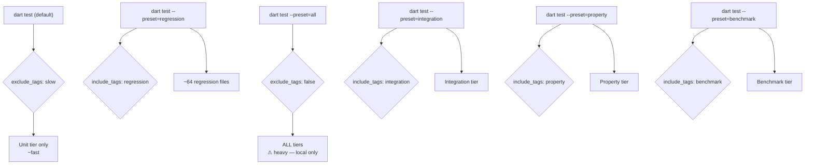
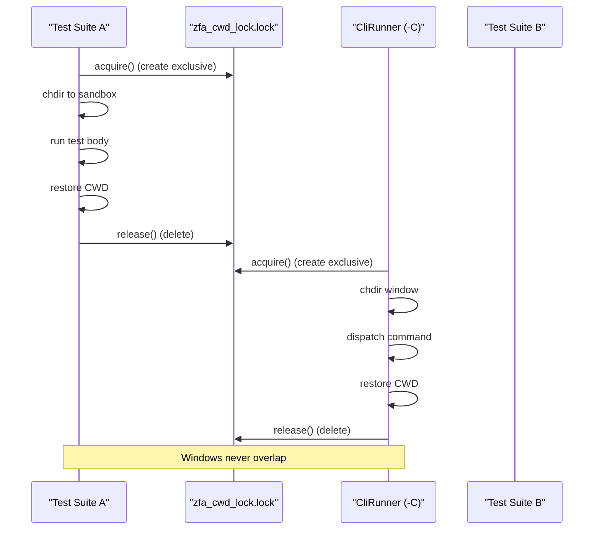

The zuraffa test suite is a multi-tier, hermetic-by-design system spanning ~1,200 test files organized by architectural concern, not by folder proximity. The infrastructure enforces **tier isolation**, **cross-process hermeticity**, and **honest test classification** — a test that lies about its own cost or its own verdict fails the suite by construction.

Sources: [test/README.md](test/README.md#L1-L156), [dart_test.yaml](dart_test.yaml#L1-L111)

## Tier Architecture

Tests are partitioned into five tiers, each with a distinct cost profile and selection mechanism. The default `dart test` invocation runs only the fast unit tier; every slow tier carries a `slow` tag that `dart_test.yaml` excludes globally.

| Tier | Tag | Primary Folders | Speed | Selection |
|------|-----|-----------------|-------|-----------|
| unit (default) | — | `core`, `plugins`, `commands`, `state`, `graphql`, `config`, `domain`, `dda`, `cli`, `utils` | fast | `dart test` |
| regression | `regression` | `test/regression` | slow (E2E codegen) | `--preset=regression` |
| integration | `integration` | `test/integration` | slow (spawns CLI) | `--preset=integration` |
| property | `property` | `test/property` | slow | `--preset=property` |
| benchmark | `benchmark` | `test/benchmark` | slow | `--preset=preset=benchmark` |

The `e2e` weight tag marks heavyweight end-to-end suites that drive the real CLI against throwaway temp projects WITHOUT carrying the `slow` tag — these are honest under direct `dart test <file>` invocation but excluded from CI's fast lane via `--exclude-tags "flutter || e2e"`.

Sources: [test/README.md](test/README.md#L9-L30), [dart_test.yaml](dart_test.yaml#L9-L25)

### Tag Hierarchy & Selection Logic



Sources: [dart_test.yaml](dart_test.yaml#L64-L90)

## Test Organization Patterns

The test tree uses **semantic foldering** — tests are grouped by architectural layer, not by implementation detail. Within each layer, tests follow consistent patterns:

### 1. Direct Plugin Dispatch Tests

Plugins are tested by invoking `Plugin.generate()` directly with a `GeneratorConfig`, then asserting on emitted files. This pattern avoids CLI process spawn overhead for the fast tier.

```dart
// Pattern: test/plugins/datasource/datasource_plugin_test.dart
test('generates datasource interface and remote implementation', () async {
  final plugin = DataSourcePlugin(outputDir: outputDir, ...);
  await plugin.generate(GeneratorConfig(name: 'Product', methods: ['get', 'create'], ...));
  expect(File('.../product_datasource.dart').existsSync(), isTrue);
  expect(File('.../product_remote_datasource.dart').existsSync(), isTrue);
});
```

Sources: [test/plugins/datasource/datasource_plugin_test.dart](test/plugins/datasource/datasource_plugin_test.dart#L1-L60)

### 2. In-Process CLI Runner Tests

For command-level testing without subprocess overhead, tests use `CliRunner.runCapturing()` — the in-process command runner that captures stdout/stderr through a print-zone.

```dart
// Pattern: test/commands/make_command_test.dart
test('supports --format=json with --plan', () async {
  final runner = CliRunner(exitOnCompletion: false);
  final output = await runner.runCapturing(['-C', workspace.path, 'make', 'Product', ...]);
  final decoded = jsonDecode(output);
  expect(decoded['success'], isTrue);
});
```

Sources: [test/commands/make_command_test.dart](test/commands/make_command_test.dart#L80-L160)

### 3. Subprocess CLI Tests (Slow Tier)

End-to-end tests that must drive the real compiled binary use `runZfaSource()` from `test/helpers/run_zfa_source.dart`. This helper:

- Resolves the zuraffa project root via `findProjectRoot()` (CWD-independent)
- Compiles `bin/zfa.dart` to AOT once per test file in `setUpAll`
- Spawns the compiled binary with a supervised timeout guard
- Supports `ZFA_TEST_TIMEOUT_SCALE` for slow hardware

```dart
// Pattern: test/integration/day_zero_smoke_gate_test.dart
@Tags(['slow', 'integration'])
void main() {
  setUpAll(() async {
    await initZfaSourceBin(); // AOT compile + project root resolution
  });

  test('fresh zfa setup emits the app-name container and flutter test exits 0', () async {
    final sandbox = await Directory.systemTemp.createTemp('zfa_dayzero_gate_');
    final setup = await runZfaSource(
      ['setup', app, '--platforms=linux', '--no-git'],
      workingDirectory: sandbox.path,
    );
    expect(setup.exitCode, 0);
  });
}
```

Sources: [test/integration/day_zero_smoke_gate_test.dart](test/integration/day_zero_smoke_gate_test.dart#L1-L80), [test/helpers/run_zfa_source.dart](test/helpers/run_zfa_source.dart#L1-L334)

### 4. TDD-Generated Test Pattern

The TDD cycle generates paired test/subject files. Tests carry machine-readable frontmatter (behavior_id, source_criterion, kind, description) and assert that the subject is implemented. On first run they are "honest red" — the subject throws `UnimplementedError`.

```dart
// Pattern: test/tdd/004-login-ui/a1_test.dart
// behavior_id: A1
// source_criterion: AC-1
// kind: acceptance
// description: the verdict is invalid with a reason naming the email field first.

test('A1 — the verdict is invalid...', () {
  final verdict = subject.subject_a1();
  expect(verdict.ok, isFalse);
  expect(verdict.reasons.first, 'email');
});
```

Sources: [test/tdd/004-login-ui/a1_test.dart](test/tdd/004-login-ui/a1_test.dart#L1-L35), [test/tdd/072-dependency-mocks/a1_test.dart](test/tdd/072-dependency-mocks/a1_test.dart#L1-L37)

### 5. Self-Hosting Template Tests

Template self-hosting suites (`test/templates/self_hosting/`) drive every generator template against a shared fixture entity through the full TDD loop: structural → compile → behavioral → diff guard.

```dart
// Pattern: test/templates/self_hosting/usecase_template_self_hosting_test.dart
group('structural', () {
  test('emits one usecase per method at the canonical paths', () async {
    final files = await generateInto(bare);
    expect(files, hasLength(2));
    expect(paths, containsAll([
      contains('domain/usecases/product/get_product_usecase.dart'),
      contains('domain/usecases/product/get_product_list_usecase.dart'),
    ]));
  });
});
```

Sources: [test/templates/self_hosting/usecase_template_self_hosting_test.dart](test/templates/self_hosting/usecase_template_self_hosting_test.dart#L1-L80), [test/helpers/template_self_hosting.dart](test/helpers/template_self_hosting.dart#L1-L463)

## Test Helpers Library

The `test/helpers/` directory contains shared infrastructure used across the test tree. These helpers are themselves unit-tested.

| Helper | Purpose | Key Feature |
|--------|---------|-------------|
| `run_zfa_source.dart` | Subprocess CLI invocation | AOT compile, timeout scaling, supervised kill |
| `project_root.dart` | CWD-independent root resolution | 7-strategy fallback chain |
| `cwd_mutex.dart` | Cross-isolate CWD lock | Mirrors `CliRunner._cwdLockFile` |
| `exit_span_mutex.dart` | Cross-isolate exitCode lock | Mirrors `CliRunner._exitSpanLockFile` |
| `engine_tier_fixture.dart` | Throwaway pure-Dart package fixture | Path dependency on this repo |
| `template_self_hosting.dart` | Self-hosting fixture + driver | Shared Product entity, diff guard |
| `test_matchers.dart` | Custom `Matcher` implementations | Result success/failure matchers |

Sources: [test/helpers/run_zfa_source.dart](test/helpers/run_zfa_source.dart#L1-L334), [test/helpers/project_root.dart](test/helpers/project_root.dart#L1-L332), [test/helpers/cwd_mutex.dart](test/helpers/cwd_mutex.dart#L1-L81), [test/helpers/exit_span_mutex.dart](test/helpers/exit_span_mutex.dart#L1-L81), [test/helpers/engine_tier_fixture.dart](test/helpers/engine_tier_fixture.dart#L1-L254), [test/helpers/test_matchers.dart](test/helpers/test_matchers.dart#L1-L160)

### Project Root Resolution Strategy

`findProjectRoot()` uses a 7-strategy fallback chain that is CWD-independent — critical because `dart test` runs suites as concurrent isolates where `Directory.current` may point inside a sibling's temp fixture:

1. `Isolate.resolvePackageUri('package:zuraffa/zuraffa.dart')` — CWD-independent
2. Pure string URI parsing from `Platform.script`
3. `Platform.script.toFilePath()` + walk up
4. Walk up from `Directory.current` (skips temp paths)
5. `git rev-parse --show-toplevel`
6. `.dart_tool/package_config.json` walk

Sources: [test/helpers/project_root.dart](test/helpers/project_root.dart#L36-L100)

## Concurrency & Isolation Infrastructure

`dart_test.yaml` sets `concurrency: 1` to prevent parallel test isolates from exhausting RAM during heavyweight compiles. Two file-based mutexes provide cross-isolate coordination for process-global state:

### CwdMutex

Prevents test suites that assign `Directory.current` directly from overlapping with `CliRunner`'s `-C` chdir windows. Both use the same lock file (`zfa_cwd_lock_$pid.lock`) so raw test chdir windows are mutually exclusive with the runner's own windows.

### ExitSpanMutex

Prevents test suites that dispatch through a bare `CommandRunner` from reading a clobbered `exitCode`. Both use `zfa_exit_lock_$pid.lock`.



Sources: [test/helpers/cwd_mutex.dart](test/helpers/cwd_mutex.dart#L1-L81), [test/helpers/exit_span_mutex.dart](test/helpers/exit_span_mutex.dart#L1-L81)

## Timeout Scaling Mechanism

The `ZFA_TEST_TIMEOUT_SCALE` environment variable stretches every subprocess timeout budget proportionally for slow hardware. The mechanism is pure and unit-testable:

| Budget | Base | Scaled |
|--------|------|--------|
| Child guard (`runZfaSource`) | 75s | 75s × scale |
| Cold source spawn (JIT) | 240s | 240s × scale |
| AOT compile budget | 100s | 100s × scale |
| Suite `Timeout` via `scaleDuration()` | varies | base × scale |

Rules:
- Missing/blank/unparsable/NaN/infinite → 1.0
- Values < 1.0 clamp up to 1.0 (never tighten)
- Explicit `timeout:` arguments are NOT auto-scaled

Sources: [test/helpers/run_zfa_source.dart](test/helpers/run_zfa_source.dart#L24-L55), [test/helpers/zfa_test_timeout_scale_test.dart](test/helpers/zfa_test_timeout_scale_test.dart#L1-L164)

## Fixtures & Test Data

The `test/fixtures/` directory contains reusable test artifacts:

| Fixture | Purpose |
|---------|---------|
| `slice_test_project/` | Minimal Flutter package for slice plugin tests |
| `vm_tap_driver/seam_app.dart` | Live seam app for VmTapDriver proof |
| `agent_collision_consumer_fixture.dart` | Simulates ecosystem collision surface |
| `sealed_category_config.dart` | Sealed class hierarchy for category tests |
| `baseline_outputs/` | Golden output baselines |
| `introspection_response.json` | GraphQL introspection fixture |
| `graphql/` | GraphQL schema fixtures (vendure shop) |

Sources: [test/fixtures/vm_tap_driver/seam_app.dart](test/fixtures/vm_tap_driver/seam_app.dart#L1-L63), [test/fixtures/agent_collision_consumer_fixture.dart](test/fixtures/agent_collision_consumer_fixture.dart#L1-L66), [test/fixtures/sealed_category_config.dart](test/fixtures/sealed_category_config.dart#L1-L15)

## Tier Integrity & Honest Classification

`test/tier_integrity_test.dart` is a fast-tier pin that closes false-green holes permanently:

- **B1**: Every regression-tier file carries the `regression` tag
- **B2**: `dart_test.yaml` defines the regression preset
- **B3**: Every `e2e`-tagged file is selected by `--preset=all`
- **B4**: The dart_core fast lane excludes every `e2e`-tagged file
- **B5**: No untagged heavyweight suite rides the dart_core lane
- **B6**: Every `regression`-tagged file also carries `slow`

This prevents the class of bug where `dart test test/regression/` exits 0 while most files never execute.

Sources: [test/tier_integrity_test.dart](test/tier_integrity_test.dart#L1-L377)

## Running Tests

### Fast tier (default — CI and cloud agents)

```bash
dart test
```

### Single slow tier

```bash
dart test --preset=regression
dart test --preset=integration
dart test --preset=property
dart test --preset=benchmark
```

### Semantic folder

```bash
dart test test/core
dart test test/plugins/route
dart test test/commands
```

### Single file

```bash
dart test test/core/result_test.dart
```

### Slow hardware

```bash
ZFA_TEST_TIMEOUT_SCALE=2 dart test test/feature_flags --preset=all
```

Sources: [test/README.md](test/README.md#L38-L65)

## Key Architectural Principles

1. **Hermeticity**: Subprocess tests use the compiled AOT binary, never `dart bin/zfa.dart` (except under explicit `ZFA_ALLOW_JIT=1`)
2. **CWD independence**: All path resolution goes through `findProjectRoot()`, never `Directory.current`
3. **Cross-isolate safety**: File-based mutexes serialize process-global state access
4. **Honest tagging**: Tier integrity tests enforce that tags match actual test cost
5. **Timeout scaling**: Slow hardware gets proportional budget relief without test semantics changes
6. **No silent downgrade**: A compile failure fails the whole file loudly — no JIT fallback

Sources: [test/helpers/run_zfa_source.dart](test/helpers/run_zfa_source.dart#L92-L115), [dart_test.yaml](dart_test.yaml#L18-L25)

## Next Steps

For deeper understanding of the testing ecosystem, explore:
- [TDD Cycle & Spec-Driven Development](13-tdd-cycle-and-spec-driven-development) — how generated tests fit into the broader TDD workflow
- [Proof Receipts & Verification Gates](15-proof-receipts-and-verification-gates) — the receipt system that tests assert against
- [CLI Commands & Subcommands](6-cli-commands-and-subcommands) — the command surface that tests exercise
- [Simulation Worlds & Certified Test Environments](17-simulation-worlds-and-certified-test-environments) — heavyweight test environments