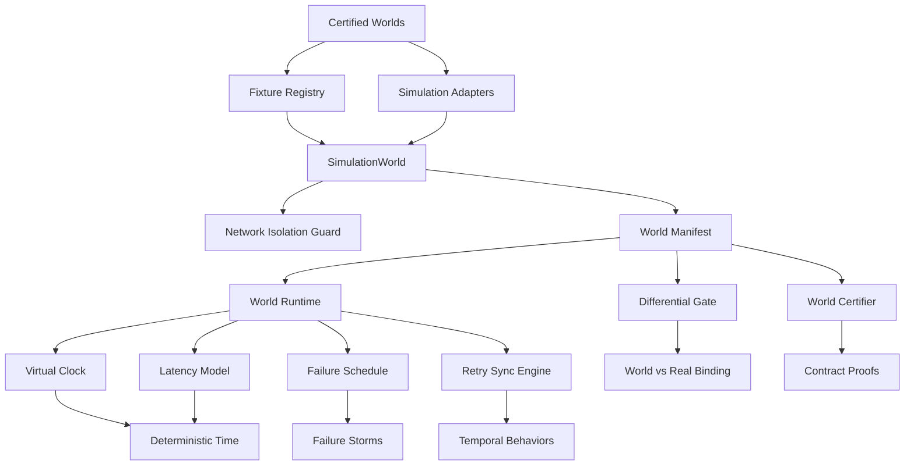

The Simulation Worlds system (spec 968, VISION §9) provides a deterministic, certified environment for developing temporal features entirely offline. It composes certified mocks into coherent simulated realities with virtual time, latency models, and failure storms — enabling TDD loops to express time-dependent and failure-resilient behaviors without any real network access.

## Architecture Overview

The simulation world stack operates in distinct layers, from certified fixture worlds at the base to scenario manifests at the application level:



## Core Components

### 1. Certified Simulation Worlds

The foundation consists of five certified adapter families, each implementing the same production interface a live binding would use:

| Family | Adapter | Production Interface | Purpose |
|--------|---------|---------------------|---------|
| Firebase Auth | `FirebaseAuthAdapter` | `AuthContract` | Scriptable auth states |
| Vendure | `VendureAdapter` | `VendureContract` | GraphQL golden fixtures |
| REST | `RestAdapter` | `RestContract` | JSON transport replay |
| AdMob | `AdMobAdapter` | `AdContract` | Ad lifecycle callbacks |
| OTel | `OtelAdapter` | `SpanExporter` | Capture-and-assert spans |

Sources: [lib/src/simulation/certified_worlds.dart](lib/src/simulation/certified_worlds.dart#L1-L142), [lib/src/simulation/simulation_adapters.dart](lib/src/simulation/simulation_adapters.dart#L1-L699)

### 2. World Manifest

A world manifest is a versioned, committed JSON document at `specs/<feature>/tdd/worlds/<scenario>.world.json`. It declares:

- **Touchpoints** — which certified mocks participate, scaffolded from the spec's declared External Dependencies & Contracts table
- **Time model** — virtual clock seed (deterministic)
- **Latency model** — banded distributions per touchpoint (fast/slow/timeout)
- **Failure schedule** — failure storms: auth expiry, network flaps, partial writes
- **Corpus** — golden fixture table served per declared contract method
- **Behaviors** — executable scenario program

The world hash is SHA-256 of the canonical JSON encoding, binding every green run receipt to a specific world version.

Sources: [lib/src/simulation/worlds/world_manifest.dart](lib/src/simulation/worlds/world_manifest.dart#L1-L674)

### 3. World Runtime

The runtime executes the manifest's behavior program through deterministic machinery:

- **Virtual Clock** — latency draws and backoff waits advance simulated time; wall time is never read or slept
- **Latency Model** — every invocation samples the touchpoint's declared bands from a seeded PRNG
- **Failure Schedule** — storms fire exactly where the manifest declares, throwing typed simulated failures
- **Golden Corpus** — fixture table served per declared contract method
- **Play Ledger** — every invocation recorded; the ordered ledger's digest is the run digest

Sources: [lib/src/simulation/worlds/world_runtime.dart](lib/src/simulation/worlds/world_runtime.dart#L1-L538)

### 4. Network Isolation Guard

The guard proves simulated worlds never open real sockets by intercepting exactly two hooks:

1. `IOOverrides.global.socketConnect` / `socketStartConnect` — every `Socket.connect` / `Socket.startConnect`
2. `HttpOverrides.global.createHttpClient` — every `HttpClient()` created while the guard is active

Whitelisted lanes (from `.zfa.json` → `simulation.whitelist`) are permitted and logged as approved exceptions. The empty whitelist is the safest default.

Sources: [lib/src/simulation/network_isolation_guard.dart](lib/src/simulation/network_isolation_guard.dart#L1-L260), [lib/src/simulation/simulation_whitelist.dart](lib/src/simulation/simulation_whitelist.dart#L1-L113)

## Command Surface

The `zfa simulate` command supports both legacy flag mode and spec-968 subcommands:

```text
zfa simulate --scaffold <feature-dir> [--family <f>]... [--force]
zfa simulate --feature <feature-dir> [--scenario golden|<family>]
zfa simulate --fixtures <dir> [--scenario ...]
zfa simulate --verify-guard

# Spec 968 subcommands
zfa simulate init <scenario> --feature <feature> [--seed N] [--force]
zfa simulate run <scenario> --feature <feature> [--seed N] [--replay]
zfa simulate certify <scenario> --feature <feature>
zfa simulate verify-world <scenario> --feature <feature>
```

Sources: [lib/src/commands/simulate_command.dart](lib/src/commands/simulate_command.dart#L1-L1470)

## World Certification

The framework proves the world's mocks satisfy declared contracts — never self-graded. `WorldCertifier` invokes every declared contract method through a fresh world runtime (certification mode: failure schedule held back) and checks:

- A declared `void` method must complete and return nothing
- A declared type-returning method must serve a non-null response
- `firebase-auth` touchpoints dispatch through the certified `FirebaseAuthAdapter`

The proof is executed by the framework (`zfa simulate init` / `certify` / `run`), never asserted by the agent. The receipt records per-method `satisfied` + evidence + the world hash, and a red certification refuses to run the scenario.

Sources: [lib/src/simulation/worlds/world_certification.dart](lib/src/simulation/worlds/world_certification.dart#L1-L262)

## Differential Gate

The differential gate executes the scenario's behavior program twice:

- **World binding** — full simulated reality: virtual clock, latency bands, failure storms
- **Real binding** — direct real-adapter harness: same touchpoint contracts and corpus served with NO world semantics

Per behavior the gate classifies the pair of outcomes:

| World Lane | Real Lane | Classification |
|------------|-----------|----------------|
| green as expected, payloads equal | green | **parity** |
| green as expected, payloads differ | green | **drift** (world corrupted outcome) |
| red (unexpected) | any | **drift** |
| red as declared (`expect: red`) | green | **storm-proof** |
| red as declared | red | **drift** |
| green but `expect: red` | green | **drift** (blindly retried) |

A declared-but-never-fired storm is reported as unrehearsed. The report is written to `<featureDir>/tdd/world-differential-report.json`.

Sources: [lib/src/simulation/worlds/world_differential_gate.dart](lib/src/simulation/worlds/world_differential_gate.dart#L1-L297)

## Temporal Behaviors

The shipped `RetrySyncEngine` is the reference temporal feature: it syncs a batch through a touchpoint operation with retry-with-exponential-backoff driven by the virtual clock. Backoff waits advance virtual time; wall time stays ~0.

Failure classes:
- **HTTP failures** and **timeouts** are retried within the budget
- **Partial writes** are detected and repaired (one re-push)
- **Auth failures** are never blindly retried — an expired session surfaces honestly
- A storm that outlasts the retry budget is an honest RED outcome with the complete failure ledger

Sources: [lib/src/simulation/worlds/retry_sync_engine.dart](lib/src/simulation/worlds/retry_sync_engine.dart#L1-L254)

## File Layout

```
specs/<feature>/tdd/
├── fixtures/
│   ├── manifest.json          # SHA-256 manifest of committed fixtures
│   ├── auth-world.json        # Firebase Auth certified world
│   ├── vendure-golden.json    # Vendure GraphQL golden fixtures
│   ├── rest-world.json        # REST transport fixtures
│   ├── admob-world.json       # AdMob certified world
│   └── otel-world.json        # OpenTelemetry certified world
├── worlds/
│   ├── <scenario>.world.json      # Committed, diffable world manifest
│   ├── <scenario>.cert.json       # Framework certification receipt
│   └── world-differential-report.json  # Differential gate report
└── cycle-log.md              # Hash-chained evidence entries
```

Sources: [lib/src/simulation/worlds/world_store.dart](lib/src/simulation/worlds/world_store.dart#L1-L341), [specs/968-simulation-worlds/tdd/fixtures/manifest.json](specs/968-simulation-worlds/tdd/fixtures/manifest.json#L1-L34)

## Deterministic Replay

Every green run is attributable to a world version through a proof-carrying receipt:

- The run digest is SHA-256 over the canonical JSON of the play ledger (plus world hash and seed)
- Same seed + same manifest → identical digest
- `--replay` re-executes with the recorded seed and proves the digest matches the recorded receipt
- A mutated world invalidates the previous green before anything executes

Sources: [lib/src/simulation/worlds/world_run_receipt.dart](lib/src/simulation/worlds/world_run_receipt.dart#L1-L169)

## Simulation Boot

`SimulationBoot.runApp` is the runtime half of the mock-first demo dividend:

1. Installs the network-isolation guard FIRST
2. Validates the committed per-entity fixtures
3. Verifies the #832 manifest when one is present
4. Binds the certified simulation adapters to the container
5. Warns when the app has zero `complete(mocked)` features to demo

Outside the simulation flavor (`--dart-define=SIMULATION=true`), the boot is a harmless no-op.

Sources: [lib/src/simulation/simulation_boot.dart](lib/src/simulation/simulation_boot.dart#L1-L137), [lib/src/simulation/simulation_flavor.dart](lib/src/simulation/simulation_flavor.dart#L1-L86)

## Next Steps

For advanced developers working with simulation worlds, the following catalog pages provide deeper context:

- **[TDD Cycle & Spec-Driven Development](13-tdd-cycle-and-spec-driven-development)** — how worlds integrate into the broader TDD loop
- **[Proof Receipts & Verification Gates](15-proof-receipts-and-verification-gates)** — the receipt discipline that makes every green attributable
- **[Code Generation Engine & Proof Receipts](9-code-generation-engine-and-proof-receipts)** — the machinery that produces the world manifests
- **[ZAP Protocol & Engine](16-zap-protocol-and-engine)** — the engine that drives scenario execution