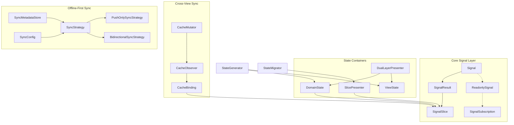
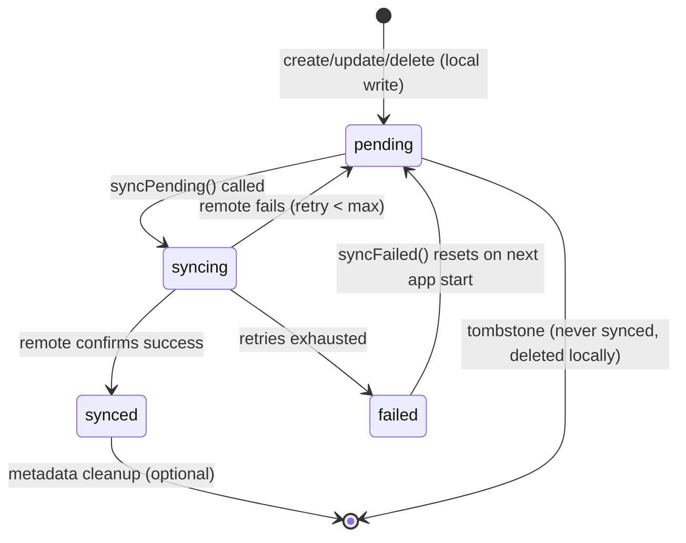

The Zuraffa v6 state management system replaces monolithic state objects with **fine-grained reactive slices**, enabling O(1) widget rebuilds and isolated data flow. The framework provides two complementary systems: an in-memory reactive state layer (Signal-based) and a persistent offline-first sync layer (Hive-backed with conflict resolution).

## Architecture Overview



The reactive state layer operates entirely in memory with zero-cost signal reads. The sync layer persists metadata separately from domain entities, keeping business logic pure.

Sources: [signal.dart](lib/src/core/signals/signal.dart#L1-L155), [signal_result.dart](lib/src/core/signals/signal_result.dart#L1-L207), [signal_slice.dart](lib/src/state/slices/signal_slice.dart#L1-L172)

## Reactive Signal Primitives

The foundation is `Signal<T>` — a zero-cost reactive primitive that provides O(1) reads and fine-grained subscriptions. Unlike `ValueNotifier`, it only notifies when the value actually changes (by `==` or custom `equals` function).

```dart
final counter = Signal<int>(0);

// O(1) read — no subscription overhead
print(counter.value);

// Functional update — notifies only when result differs
counter.update((v) => v + 1);

// Subscribe to changes (eager delivery of current value)
final sub = counter.listen((v) => print(v));
sub.cancel(); // Lightweight subscription handle
```

`SignalResult<T>` wraps `Result<T, AppFailure>` in a signal, providing the async-to-sync bridge for UseCase outputs. It exposes `data`, `error`, `isLoading`, `isSuccess`, `isFailure` properties and supports `emit()`, `emitSuccess()`, `emitFailure()`, and `emitLoading()` for state transitions.

Sources: [signal.dart](lib/src/core/signals/signal.dart#L1-L155), [signal_result.dart](lib/src/core/signals/signal_result.dart#L1-L207)

## SignalSlice: Fine-Grained Reactive Units

Each UseCase gets its own `SignalSlice<T>` — the v6 replacement for monolithic state objects. Slices are lazily executed on first access and provide isolated subscriptions.

```dart
final productSlice = SignalSlice<Product>(
  useCase: getProductUseCase,
  params: GetProductParams(id: '123'),
);

// Subscribe to ONLY this slice — other slices unaffected
productSlice.listen((product, error) {
  setState(() => _product = product);
});

// Or subscribe selectively
productSlice.onSuccess((product) => print(product));
productSlice.onFailure((error) => print(error));

// Re-execute with new params
productSlice.refresh(NewParams(id: '456'));
```

Slices manage their own lifecycle: `_listeners` track active subscriptions, `_cacheSubscriptions` track cache bindings, and `dispose()` cancels everything. The `refresh()` method disposes the old result, creates a new one, and reattaches all listeners.

Sources: [signal_slice.dart](lib/src/state/slices/signal_slice.dart#L1-L172)

## Dual-Layer State Architecture

Zuraffa strictly separates **DomainState** (auto-generated, immutable) from **ViewState** (developer-editable, preserved). This separation ensures domain data stays pure while UI state remains flexible.

### DomainState

Auto-generated on every `zfa build`, `DomainState` is a read-only container of `SignalSlice`s. Each slice is bound to a UseCase with its parameters. The generator appends `..bindCache()` for cacheable entities.

```dart
// GENERATED — do not edit
class ProductDetailDomainState extends DomainState {
  ProductDetailDomainState({required super.presenter});

  late final product = bind<Product>('product', getProductUseCase, params);
  late final reviews = bind<List<Review>>('reviews', getReviewsUseCase, params);
}
```

### ViewState

Scaffolded once and preserved across builds. Holds transient UI state — dropdown visibility, active tabs, scroll offsets, form field values.

```dart
// SCAFFOLDED — safe to edit, never regenerated
class ProductDetailViewState extends ViewState {
  ProductDetailViewState() : super();

  final isDescriptionExpanded = Signal<bool>(false);
  final activeTabIndex = Signal<int>(0);
  final scrollOffset = Signal<double>(0.0);
}
```

### DualLayerPresenter

Combines both layers and provides a backward-compatible `combinedState` map. Domain slices are accessed via `presenter.domain`, view signals via `presenter.view`.

Sources: [domain_state.dart](lib/src/state/domain_state.dart#L1-L46), [view_state.dart](lib/src/state/view_state.dart#L1-L48), [dual_layer_presenter.dart](lib/src/state/presenter/dual_layer_presenter.dart#L1-L67)

## SlicePresenter: Multi-Slice Management

`SlicePresenter` manages multiple independent `SignalSlice`s — one per UseCase. It replaces the monolithic v5 state object. Each slice is independent, so widgets rebuild only when their subscribed slice changes.

```dart
class ProductPresenter extends SlicePresenter {
  late final productSlice = bind(
    'product',
    getProductUseCase,
    GetProductParams(id: '123'),
  );

  late final reviewsSlice = bind(
    'reviews',
    getReviewsUseCase,
    GetReviewsParams(productId: '123'),
  );
}
```

The presenter provides:
- **`bind()`**: Creates a new named slice (throws if key exists)
- **`slice()`**: Retrieves a slice by key (returns `null` if not bound)
- **`sliceKeys`**: All bound slice keys
- **`combinedState`**: Backward-compatible map of all slice data (O(N) read)
- **`refreshAll()`**: Refreshes all slices with current params

Sources: [slice_presenter.dart](lib/src/state/presenter/slice_presenter.dart#L1-L154)

## Cross-View Cache Synchronization

The `CacheObserver` is a singleton event bus that bridges mutation UseCases and listening SignalSlices. When a mutation updates the cache, all observers for that entity type are notified.

### CacheBinding Extension

Generated for `@Cacheable` entities, `bindCache()` subscribes a slice to cache updates. When the cache emits a new entity, the slice's result is updated automatically — no network re-fetch.

```dart
final product = bind<Product>('product', getProductUseCase, params)
  ..bindCache(); // auto-generated for @Cacheable entities
```

### CacheMutator Mixin

UseCases that perform mutations use the `CacheMutator<T>` mixin to notify the cache:

```dart
class UpdateProductUseCase extends ZuraffaUseCase<...>
    with CacheMutator<Product> {
  @override
  SignalResult<Product> call(params) {
    final updated = await api.update(params);
    notifyCache(updated); // View B receives update automatically
    return SignalResult.success(updated);
  }
}
```

Sources: [cache_binding.dart](lib/src/state/cache/cache_binding.dart#L1-L68), [cache_observer.dart](lib/src/state/cache/cache_observer.dart#L1-L100)

## State Generation & Migration

### StateGenerator

Generates dual-layer state files:
- **DomainState**: Always regenerated, read-only, signal slices
- **ViewState**: Scaffolded once, preserved across builds (never overwritten if file exists)

```dart
final gen = StateGenerator(outputDir: 'lib/presentation');
gen.generateDomainState('ProductDetail', useCases: [...]);
gen.generateViewState('ProductDetail', fields: [...]); // only if missing
```

### StateMigrator

Migrates v5 `.state.dart` files to v6 Signal Slice pattern. Detects UseCase bindings and generates corresponding slices with semantic keys derived from field names.

```bash
zfa migrate state --input=lib/presentation --output=lib/presentation
```

Sources: [state_generator.dart](lib/src/state/generator/state_generator.dart#L1-L253), [state_migrator.dart](lib/src/state/migration/state_migrator.dart#L1-L148)

## Offline-First Sync Framework

The sync plugin adds **local-first (offline-first) persistence** to generated Clean Architecture repositories. It is the architectural inverse of the cache plugin: where `--cache` treats remote as the source of truth and local as a temporary cache, `--sync` treats **local as the source of truth** and remote as the sync target.

### Core Domain Types

```mermaid
classDiagram
    class SyncStatus {
        <<enum>>
        pending
        syncing
        synced
        failed
    }
    class SyncOperation {
        <<enum>>
        create
        update
        delete
    }
    class SyncDirection {
        <<enum>>
        push
        bidirectional
    }
    class SyncMetadata {
        +SyncStatus status
        +int retryCount
        +DateTime? lastAttemptAt
        +String? lastError
        +DateTime? deletedAt
        +SyncOperation operation
        +bool isTombstone
    }
    class SyncConfig {
        +int batchSize
        +int maxRetries
        +int backoffBaseMs
        +int backoffMaxMs
        +bool autoSync
        +SyncDirection direction
        +int backoffDelayFor(int retryCount)
    }
    class SyncStrategy~T~ {
        <<abstract>>
        +syncPending({CancelToken?})
        +syncFailed({CancelToken?})
        +pullRemote({CancelToken?})
        +getPendingCount()
        +getSyncStatus(String key)
        +markPending(String key, {SyncOperation})
        +markDeleted(String key)
    }
    class PushOnlySyncStrategy~T~ {
        +_fetchLocal
        +_createRemote
        +_updateRemote
        +_deleteRemote
        +_keyResolver
        +_metadataStore
        +_config
    }
    class BidirectionalSyncStrategy~T~ {
        +pullRemote()
    }
    class SyncMetadataStore {
        +Box~SyncMetadata~ _box
        +get(String key)
        +put(String key, SyncMetadata)
        +remove(String key)
        +getKeysByStatus(SyncStatus)
        +countByStatus(SyncStatus)
    }

    SyncStrategy~T~ <|-- PushOnlySyncStrategy~T~
    PushOnlySyncStrategy~T~ <|-- BidirectionalSyncStrategy~T~
    SyncStrategy~T~ --> SyncMetadata : uses >
    SyncStrategy~T~ --> SyncConfig : configures >
    SyncMetadata --> SyncStatus
    SyncMetadata --> SyncOperation
    SyncConfig --> SyncDirection
    PushOnlySyncStrategy~T~ --> SyncMetadataStore : manages >
```

### SyncStatus State Machine



Sources: [sync_status.dart](lib/src/core/sync_status.dart#L1-L27), [sync_metadata.dart](lib/src/core/sync_metadata.dart#L1-L81), [sync_config.dart](lib/src/core/sync_config.dart#L1-L58), [sync_strategy.dart](lib/src/core/sync_strategy.dart#L1-L84), [sync_operation.dart](lib/src/core/sync_operation.dart#L1-L15), [sync_direction.dart](lib/src/core/sync_direction.dart#L1-L12)

### Sync-Enabled Repository Data Flow

When `--sync` is passed to `zfa make`, the repository generator creates a repository with **local-first** data flow:

```mermaid
flowchart LR
    subgraph "Write Path (create/update/delete)"
        A[Repository Method] --> B[Write to Local DataSource]
        B --> C[markPending/markDeleted in MetadataStore]
        C --> D[Return instantly to caller]
        C --> E{autoSync?}
        E -->|Yes| F[Fire syncPending (unawaited)]
        E -->|No| G[Done]
    end

    subgraph "Read Path (get/getList)"
        H[Repository Method] --> I[Read from Local DataSource]
        I --> J[Return instantly]
    end

    subgraph "Sync Path (background)"
        F --> K[Process pending records in batches]
        K --> L[Push to remote with retry/backoff]
        L --> M[Mark as synced on success]
        L --> N[Handle failures]
        N --> O[Retry with backoff or mark failed]
    end
```

### SyncStrategy Implementations

**PushOnlySyncStrategy** (default): Pushes local changes to remote only. Processes records in batches with retry and exponential backoff. Tombstones (deletions) are processed first, before live record synchronization.

```dart
final strategy = PushOnlySyncStrategy<Product>(
  fetchLocal: (keys) => localDataSource.getByIds(keys),
  createRemote: (product) => remoteDataSource.create(product),
  updateRemote: (product) => remoteDataSource.update(product),
  deleteRemote: (id) => remoteDataSource.delete(id),
  keyResolver: (product) => product.id,
  metadataStore: syncMetadataStore,
);
```

**BidirectionalSyncStrategy**: Extends push-only with pull capability. Conflicts between local pending changes and incoming remote data are resolved via a configurable conflict resolver (default: remote wins).

```dart
final strategy = BidirectionalSyncStrategy<Product>(
  fetchLocal: (keys) => localDataSource.getByIds(keys),
  fetchRemoteList: () => remoteDataSource.getAll(),
  createRemote: (product) => remoteDataSource.create(product),
  updateRemote: (product) => remoteDataSource.update(product),
  deleteRemote: (id) => remoteDataSource.delete(id),
  saveLocal: (product) => localDataSource.put(product),
  keyResolver: (product) => product.id,
  metadataStore: syncMetadataStore,
  conflictResolver: (local, remote) {
    if (local == null) return remote;
    return local.updatedAt.isAfter(remote.updatedAt) ? local : remote;
  },
);
```

Sources: [push_only_sync_strategy.dart](lib/src/plugins/sync/builders/push_only_sync_strategy.dart#L1-L353), [bidirectional_sync_strategy.dart](lib/src/plugins/sync/builders/bidirectional_sync_strategy.dart#L1-L135)

### SyncMetadataStore

Hive-backed persistence layer for `SyncMetadata` records. Each sync-enabled entity type gets its own store backed by a `Box<SyncMetadata>`. Keys are entity identifiers (typically `entity.id`). The store keeps the domain entity pure — no sync infrastructure fields pollute it.

```dart
final box = await Hive.openBox<SyncMetadata>('product_sync_meta');
final store = SyncMetadataStore(box);

// Mark a record as pending after local create
await store.put('42', SyncMetadata(
  status: SyncStatus.pending,
  operation: SyncOperation.create,
));

// Query pending records
final pendingKeys = await store.getKeysByStatus(SyncStatus.pending);
```

Sources: [sync_metadata_store.dart](lib/src/plugins/sync/builders/sync_metadata_store.dart#L1-L82)

### SyncPlugin Architecture

The sync plugin follows the exact same structure as `CachePlugin`:

```
lib/src/plugins/sync/
├── sync_plugin.dart                    # Plugin class (mirrors cache_plugin.dart)
├── builders/
│   ├── sync_builder.dart              # File generator (mirrors cache_builder.dart)
│   ├── sync_metadata_store.dart       # Hive-backed metadata persistence
│   ├── push_only_sync_strategy.dart   # Default push-only strategy
│   └── bidirectional_sync_strategy.dart # Extended strategy with pull support
├── capabilities/
│   └── create_sync_capability.dart    # Capability for enabling sync
└── generators/
    └── sync_repository_generator.dart # Sync-aware repository method bodies
```

Sources: [sync_plugin.dart](lib/src/plugins/sync/sync_plugin.dart#L1-L104), [sync_builder.dart](lib/src/plugins/sync/builders/sync_builder.dart#L1-L476)

## Configuration & CLI

### Sync Configuration

`SyncConfig` controls batching, retry, and backoff parameters with sensible defaults:

```dart
const config = SyncConfig(
  batchSize: 50,        // Records per batch
  maxRetries: 5,        // Max retry attempts
  backoffBaseMs: 1000,  // Base delay for exponential backoff
  backoffMaxMs: 60000,  // Maximum delay
  direction: SyncDirection.push, // or bidirectional
  autoSync: false,      // Auto-trigger after local write
);
```

Backoff formula: `min(backoffBaseMs * 2^retryCount, backoffMaxMs)`

### CLI Commands

```bash
# Enable sync during entity creation
zfa make Product --sync

# Enable bidirectional sync
zfa make Product --sync --bidirectional

# Manual sync trigger
zfa sync Product

# Configure sync parameters
zfa sync Product --batch-size 100 --max-retries 3
```

Sources: [sync_config.dart](lib/src/core/sync_config.dart#L1-L58), [sync_plugin.dart](lib/src/plugins/sync/sync_plugin.dart#L1-L104)

## Migration Path

The v5 → v6 migration preserves backward compatibility:

1. **v5 monolithic state** → **v6 Signal Slices** via `zfa migrate state`
2. **Combined state map** still available via `SlicePresenter.combinedState` for views that haven't migrated
3. **DualLayerPresenter** provides a clean separation path: DomainState (auto-generated) + ViewState (developer-editable)

Sources: [state_migrator.dart](lib/src/state/migration/state_migrator.dart#L1-L148), [slice_presenter.dart](lib/src/state/presenter/slice_presenter.dart#L1-L154)

## Next Steps

For advanced usage, explore:
- **[Skin Contract & UI Layer Generation](19-skin-contract-and-ui-layer-generation)** — How state integrates with UI generation
- **[Proof Receipts & Verification Gates](15-proof-receipts-and-verification-gates)** — How state changes are verified
- **[Testing Infrastructure & Test Organization](14-testing-infrastructure-and-test-organization)** — Testing strategies for stateful components
- **[Simulation Worlds & Certified Test Environments](17-simulation-worlds-and-certified-test-environments)** — Testing sync behavior in controlled environments