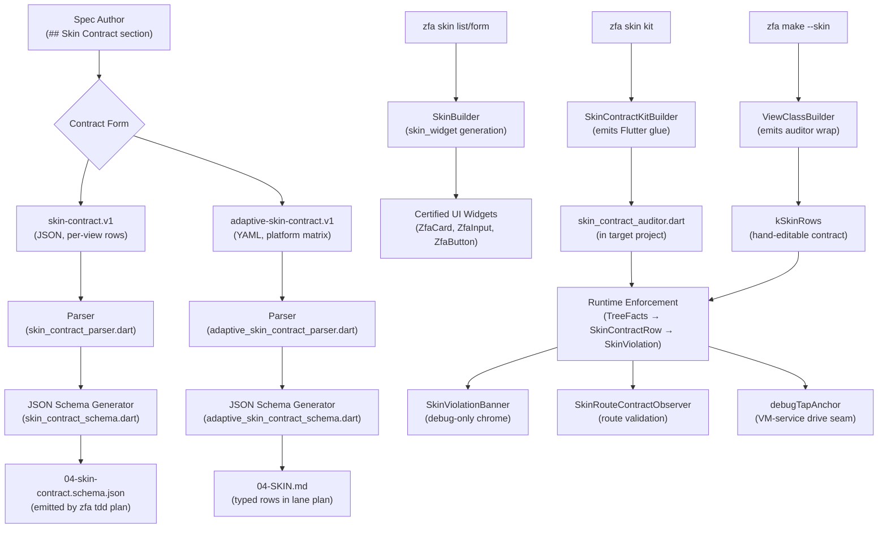
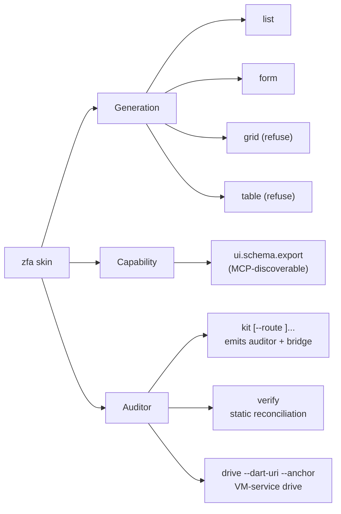

The skin contract system is the **typed declaration + runtime enforcement** pair that governs how generated Flutter UI widgets render and behave. It spans two complementary contract forms, a pure-Dart runtime auditor core, and a code-generation lane that emits both certified UI widgets and the runtime enforcement glue. The architecture is built on the principle that **declaration and enforcement are one vocabulary, two roles** — the same field tables drive the JSON Schema generator, the YAML/JSON parser, and the runtime audit rows, so model, parser, and schema cannot drift apart.

## Architecture Overview

The skin contract system operates across three layers: declaration (spec-authored contracts), generation (widget + auditor emission), and runtime enforcement (live tree auditing).

Sources: [lib/src/skin/contract/skin_contract.dart](lib/src/skin/contract/skin_contract.dart#L1-L242), [lib/src/skin/contract/adaptive_skin_contract.dart](lib/src/skin/contract/adaptive_skin_contract.dart#L1-L222), [lib/src/skin/skin_contract_kit.dart](lib/src/skin/skin_contract_kit.dart#L1-L25)

## Two Contract Forms, One Vocabulary Family

The skin contract vocabulary exists in two declaration forms, both sharing the same `SkinTargetPlatform` enum and `SkinContractRow` runtime type.

### skin-contract.v1 — Per-View Typed JSON Contract

Declared in a spec's `## Skin Contract: <name>` section as a fenced JSON block. This is the **per-view** contract form (issue #1164, stage 1/4 of #1111). It declares four sections:

| Section | Purpose | Key Fields |
|---------|---------|------------|
| `routes[]` | Declared route → view mappings | `path` (regex `^/`), `view` (PascalCase) |
| `states[]` | Per-view state handling | `view`, `loading` (bool), `error` (enum: none\|toaster\|inline), `empty` (bool) |
| `platformRows[]` | Per-view adaptive slot matrix | `view`, `mobile`, `ios`, `android`, `macos` (all bool) |
| `stateRows[]` | Runtime audit row declarations | `view`, `row`, `kind` (enum: observer\|listener\|builder) |

Every field carries a declarative `SkinContractFieldSpec` table. The parser and JSON Schema generator both walk these same tables — model, parser, and schema cannot drift apart. The schema is emitted as `04-skin-contract.schema.json` beside the lane plan by `zfa tdd plan`.

Sources: [lib/src/skin/contract/skin_contract.dart](lib/src/skin/contract/skin_contract.dart#L1-L242), [lib/src/skin/contract/skin_contract_schema.dart](lib/src/skin/contract/skin_contract_schema.dart#L1-L60), [lib/src/skin/contract/skin_contract_parser.dart](lib/src/skin/contract/skin_contract_parser.dart#L1-L260)

### adaptive-skin-contract.v1 — Platform Matrix YAML Declaration

The **adaptive-layout** contract form (issue #1004). Authored as a YAML block in the spec's `## Skin Contract` section. It declares:

- `adaptive_slots` — the platform vocabulary (e.g., `mobile`, `ios`, `android`, `macos`)
- `platform_overrides` — nested map refining declared slots per platform
- `states` — the state machine chain (happy path + alternate states)
- `routes` — declared route names, from which `AdaptiveRouteContract` derives target, screen class, and path

This form renders into `tdd/04-SKIN.md` as typed rows (platform matrix, state machine, route table) plus a machine-parseable JSON block. It is the companion to skin-contract.v1: one vocabulary family, two declaration forms.

Sources: [lib/src/skin/contract/adaptive_skin_contract.dart](lib/src/skin/contract/adaptive_skin_contract.dart#L1-L222), [lib/src/skin/contract/adaptive_skin_contract_parser.dart](lib/src/skin/contract/adaptive_skin_contract_parser.dart#L1-L330), [lib/src/skin/contract/adaptive_skin_contract_schema.dart](lib/src/skin/contract/adaptive_skin_contract_schema.dart#L1-L95)

## Runtime Enforcement Core

The runtime auditor lives in `lib/src/skin/` and is **pure Dart** (Constitution VII: `lib/` never imports Flutter). The Flutter glue is emitted into target projects by `SkinContractKitBuilder`.

### TreeFacts — The Immutable Snapshot

`TreeFacts` is the immutable snapshot of the live widget tree the auditor audits against. Collected on every audited frame:

- `texts` — rendered text strings (in walk order)
- `anchors` — `zfa:` anchor keys present in the tree
- `hasProgressIndicator` — whether any progress indicator is on screen
- `platform` — the platform the `Theme` reports (override-aware)

Value equality matters: the emitted auditor compares consecutive snapshots to skip no-op audits. A chaos edit (`'Continue with Google'` → `'Continue with Goggle'`) must produce a NEW snapshot so the violation surfaces on the first audited frame.

Sources: [lib/src/skin/tree_facts.dart](lib/src/skin/tree_facts.dart#L1-L143)

### SkinContractRow — The Audit Row

A row is `id` + `requirement` + a pure check over `TreeFacts`. Three named helpers encode the row families the pilot proved:

| Helper | Purpose | Pilot Lesson |
|--------|---------|-------------|
| `textRenders` | A specific string must render | The chaos-edit catcher |
| `anchorExists` | A typed `zfa:` anchor must be on screen | Identified component protocol |
| `progressIndicator` | A loading scrim must exist | Caught the real macOS bug |

Every helper takes optional platform gating. A row gated to a platform consumes only facts that report that platform; facts with no platform SKIP (conform) — never a phantom violation.

Sources: [lib/src/skin/skin_contract_row.dart](lib/src/skin/skin_contract_row.dart#L1-L110)

### SkinViolation — The Contract Breach

What a broken runtime skin contract surfaces on the impossible-to-miss banner. Two kinds:

- `widget` — a widget-tree row failed its check on an audited frame
- `route` — a route push did not conform to the route contract table

The banner line shape is `[<rowId>] <requirement>` — the pilot's chaos-edit receipt format. Identity is the contract breach, not the clock: two violations for the same row+requirement+message+route are the SAME live finding.

Sources: [lib/src/skin/skin_violation.dart](lib/src/skin/skin_violation.dart#L1-L95)

### SkinAuditController — The Pure Bus Core

The pure Dart bus core the debug chrome renders. Two load-bearing behaviors:

- **Change detection** — `publish` returns whether the live violation set actually changed. The chrome rebuilds only on a real change: no banner churn while the same chaos edit stays on screen.
- **Bounded history** — a capped ring (default 50) retains published sets for diagnostics; the banner shows the LIVE set.

Sources: [lib/src/skin/skin_audit_controller.dart](lib/src/skin/skin_audit_controller.dart#L1-L106)

### SkinAuditScheduler — Subscribe-Don't-Poll

The pilot's auditor rescheduled a post-frame callback on EVERY post frame — `pumpAndSettle` could never settle. The productized scheduler inverts control:

- Real signals (dependency changes, route events, view updates) call `markDirty` — nothing schedules itself
- The emitted auditor asks `consumeDirty` once per frame: `true` means "audit NOW", `false` means "the tree is quiet, do nothing"
- Dirty marks COALESCE — ten signals between two frames still cost exactly one audit

The scheduler has no timers, no callbacks, no self-rescheduling: a quiet tree runs zero audits, and `pumpAndSettle` settles.

Sources: [lib/src/skin/skin_audit_scheduler.dart](lib/src/skin/skin_audit_scheduler.dart#L1-L64)

### RouteContractTable — The Route Half

Validates every push against the contract route table. The navigator root `/` conforms BY CONSTRUCTION (pilot lesson 3: `WidgetsApp` pushes it on every cold start). Null and empty route names (shell bookkeeping pushes unnamed helper routes) conform for the same reason: they are framework traffic, not contract drift.

Sources: [lib/src/skin/route_contract_table.dart](lib/src/skin/route_contract_table.dart#L1-L77)

### Typed Anchor Protocol

The `zfa:` anchor vocabulary maps a component's contract id to the `ValueKey` it carries in the live tree. The `ZfaAnchorRegistry` registers real `onPressed` handlers under contract ids while mounted; the VM-service driver invokes them through `tap()`.

Lesson 7 is load-bearing: synthetic clicks (cliclick, CGEvent, AX press) never reach the Flutter macOS view, but `vm_service.evaluate` finding the `zfa:` anchor and invoking its REAL `onPressed` works — the genuine engine flow on every platform.

Sources: [lib/src/skin/anchors.dart](lib/src/skin/anchors.dart#L1-L85), [lib/src/skin/tap_result.dart](lib/src/skin/tap_result.dart#L1-L120), [lib/src/skin/driver/vm_tap_driver.dart](lib/src/skin/driver/vm_tap_driver.dart#L1-L284)

### SkinContractRuntimeBinding — The Engine Half

Turns a parsed `SkinContract` into the runtime kit's inputs in one call: the route table the route observer validates pushes against, per-view state bindings (toaster/inline/none + empty), and audit-row descriptors. The Flutter shell mounts this binding across the package boundary — zero hand-written contract wiring at call sites.

Sources: [lib/src/skin/skin_contract_binding.dart](lib/src/skin/skin_contract_binding.dart#L1-L92)

## Code Generation: UI Widgets + Auditor Emission

### Skin UI Widget Generation

The `SkinPlugin` (id `skin`, version 1.0.0) is a `FileGeneratorPlugin` + `CliAwarePlugin`. It generates certified UI widgets importing `package:zuraffa_ui/zuraffa_ui.dart`:

| Layout | Output | Components Used |
|--------|--------|----------------|
| `list` | `{Entity}ListWidget` | `ZfaCard` (title/description), optional `ZfaInput` (filter), `ZfaButton` (sort) |
| `form` | `{Entity}FormWidget` | `ZfaInput` per field (placeholder, onChanged), `ZfaButton` (submit) |

The `grid` and `table` layouts are **refuse subcommands** — they were advertised but never implemented (issue #1149). Invoking them refuses loudly with exit 2 instead of emitting a mislabeled widget.

Sources: [lib/src/plugins/skin/skin_plugin.dart](lib/src/plugins/skin/skin_plugin.dart#L1-L120), [lib/src/plugins/skin/builders/skin_builder.dart](lib/src/plugins/skin/builders/skin_builder.dart#L1-L270), [docs/skin_plugin.md](docs/skin_plugin.md#L1-L88)

### SkinContractKitBuilder — Emitting the Flutter Glue

The framework itself is pure Dart, so the Flutter half of the kit — the element walker, the auditor widget, the route observer, the banner chrome, the typed anchor button, the VM-service driver seam — is emitted into the target project as one self-contained file at `<outputDir>/skin/skin_contract_auditor.dart`. The emitted file imports the pure core through `package:zuraffa/skin.dart`.

Emission is deterministic (same routes → same bytes) and wrapped in GENERATED markers. Generation sites write it skip-if-exists so hand edits survive — the #1005 hand-written-seam precedent.

The builder also emits the widget-test bridge (`test/skin/zfa_anchor_test_bridge.dart`, issue #1112) — the `zfaAnchorTapped(tester, zfaKey)` surface that drives the same anchor-by-key lookup the VM service does, then `pumpAndSettle`s.

Sources: [lib/src/skin/builders/skin_contract_kit_builder.dart](lib/src/skin/builders/skin_contract_kit_builder.dart#L1-L784)

### View Integration

When `zfa make --skin` is invoked, the `ViewClassBuilder` emits:

1. The `SkinContractAuditor` widget wrap around the view's `Widget get view` seam
2. The `k<ViewName>SkinRows` starter contract — one row per generation concern (the view's own heading text renders via `SkinContractRow.textRenders`)
3. Per declared anchor: a `SkinContractRow.anchorExists` row AND a generated `debugTap<PascalAnchor>()` VM-service driver function

The starter contract list is the hand-edit seam: users extend it, and regeneration never touches an existing file without `--force`.

Sources: [lib/src/plugins/view/builders/view_class_builder.dart](lib/src/plugins/view/builders/view_class_builder.dart#L1-L724), [lib/src/plugins/view/view_plugin.dart](lib/src/plugins/view/view_plugin.dart#L1-L1045)

### App Shell Integration

The `zfa app shell --skin-audit` command mounts the runtime skin-contract auditor:

- The `GoRouter` carries the `SkinRouteContractObserver` (route contract from `getAllRoutes()`, navigator root conforms by construction)
- The shell widget wraps the router in the `SkinViolationBanner` via `MaterialApp.builder` (debug-only)
- Emits the `<outputDir>/skin/skin_contract_auditor.dart` kit when missing (hand edits preserved)

The `--zuraffa-app` flag mounts the certified `ZuraffaApp` shell — the skin lane's certified shell that audits the tree through the violation chrome.

Sources: [lib/src/commands/app_shell_command.dart](lib/src/commands/app_shell_command.dart#L1-L735)

## CLI Surface

The `zfa skin` command group (spec 1276) owns three grammars:

### `zfa skin verify` — Static Reconciliation

Reconciles the kit's route contract table against the routing barrel. Honest verdicts (the route-verify contract):

| Verdict | Exit Code | Meaning |
|---------|-----------|---------|
| `match` | 0 | Kit table agrees with routing barrel |
| `drift` | 1 | Kit table and barrel disagree (per-route findings + `--> fix:` lines) |
| `insufficient-input` | 2 | Kit or barrel is missing (never a fake pass) |

`--json` emits the machine envelope as the final stdout line.

### `zfa skin drive` — VM-Service Drive

Drives the live app (or widget-test runner) through the VM service: evaluates the emitted kit's `debugTapAnchorJson` seam and prints the `TapResult` JSON as the final stdout line. Exit codes: `found` 0 / `disabled` 1 / `notFound` 2 / `error` 3.

The drive is a BOUNDED POLL, not a single shot: the driver resumes a paused-at-start runner and keeps evaluating until the anchor answers `TapFound`/`TapDisabled` or `driveTimeout` elapses — a booting runner pumps its tree late, and an instant `notFound` there would be a false negative.

Sources: [lib/src/commands/skin_command.dart](lib/src/commands/skin_command.dart#L1-L610), [lib/src/plugins/skin/commands/skin_command.dart](lib/src/plugins/skin/commands/skin_command.dart#L1-L364)

## TDD Skin Lane Integration

The TDD cycle integrates skin contracts at multiple points:

- **`zfa tdd plan`** — renders the adaptive skin contract into `tdd/04-SKIN.md` as typed rows (platform matrix, state machine, route table) plus a machine-parseable JSON block. Also emits `04-skin-contract.schema.json` from the typed model when the spec declares a skin-contract.v1 JSON contract.
- **`zfa tdd run --skin`** — verifies the generated skin against the contract in the TDD cycle.
- **Issue #938 preflight** (`WidgetSkinPreflight`) — widget gen REFUSES with `--> fix: flutter pub add zuraffa_ui` when the target project's pubspec does not declare `zuraffa_ui`. The `materialapp` opt-out emits no zuraffa import and skips the preflight.
- **`--skip-widget`** (issue #992) — records per-behavior skips instead of stopping the run.

Sources: [lib/src/plugins/tdd/services/skin_contract_emit.dart](lib/src/plugins/tdd/services/skin_contract_emit.dart#L1-L60), [lib/src/plugins/tdd/commands/plan_command.dart](lib/src/plugins/tdd/commands/plan_command.dart), [lib/src/plugins/tdd/commands/run_skin_command.dart](lib/src/plugins/tdd/commands/run_skin_command.dart)

## Key Design Principles

1. **Model-driven schema generation** — The JSON Schema is generated FROM the model's field tables, never hand-maintained. The parser and schema generator walk the same tables, so they cannot drift apart (#1111 FR-005).

2. **Pure Dart core, emitted Flutter glue** — `lib/src/skin/` never imports Flutter (Constitution VII). The Flutter half is emitted into target projects as a self-contained file.

3. **Subscribe-don't-poll** — The auditor never self-reschedules. Real signals mark dirty; the auditor asks once per frame whether to audit. A quiet tree runs zero audits.

4. **Honest refusal** — Unknown layouts, missing pubspec dependencies, and undeclared routes all refuse loudly with named exit codes. Never a silent no-op or fake pass.

5. **Hand-edit seams preserved** — Generated files carry GENERATED markers and are written skip-if-exists. User edits survive regeneration.

6. **Platform-aware gating** — Rows read `Theme.of(context).platform` (the same override-aware source the layout gates on), so the auditor and the skin can never disagree about platform. A row gated to a platform the facts do not report SKIPS (conforms) — never a phantom violation.

## Next Steps

- **[CLI Commands & Subcommands](6-cli-commands-and-subcommands)** — Explore the full `zfa skin` command surface and other CLI commands
- **[TDD Cycle & Spec-Driven Development](13-tdd-cycle-and-spec-driven-development)** — Understand how skin contracts integrate into the TDD cycle
- **[Code Generation Engine & Proof Receipts](9-code-generation-engine-and-proof-receipts)** — Learn about the broader code generation architecture
- **[Plugin Development Guide](8-plugin-development-guide)** — Build custom plugins that integrate with the skin contract system