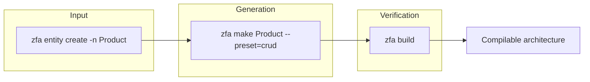
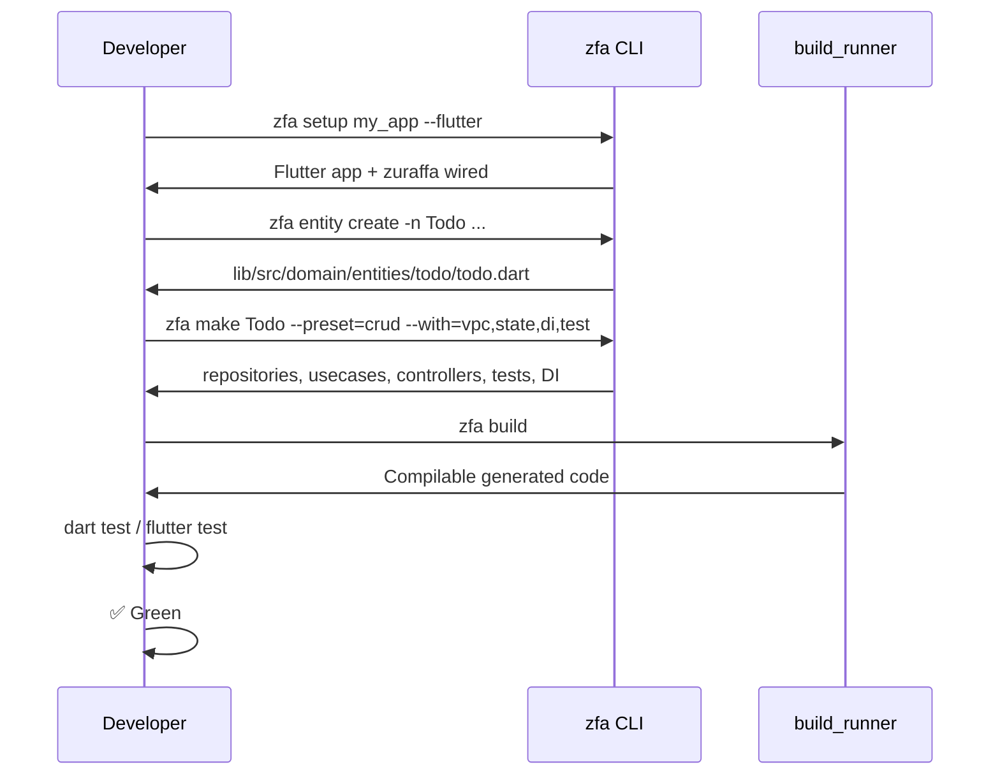

Welcome to Zuraffa — the AI-first Clean Architecture framework for Flutter and Dart. This guide takes you from zero to a working generated architecture in minutes using the canonical v5 workflow.

**What you'll do**: install the CLI, scaffold a project, create an entity, generate architecture, and build it. Every command is a single terminal invocation — no manual boilerplate required.

> **Prerequisite**: Dart SDK `^3.11.0` and (for Flutter apps) Flutter installed. Verify with `dart --version` and `flutter --version`.

---

## The Canonical v5 Workflow

Zuraffa v5 standardizes all code generation around one three-step workflow:

```text
zfa entity create  →  zfa make  →  zfa build
```

| Step | Command | Purpose |
|---|---|---|
| **1. Entity** | `zfa entity create` | Define a Zorphy entity (immutable, typed domain object) |
| **2. Make** | `zfa make` | Generate the full architecture around the entity (repositories, usecases, DI, tests, etc.) |
| **3. Build** | `zfa build` | Run the codegen/build step (replaces calling `build_runner` directly) |

`zfa feature scaffold` still exists but is only a wrapper over `zfa make --preset=feature`. Always prefer `zfa make` as the primary generator [SKILL.md#L25-L42](SKILL.md#L25-L42).



---

## Step 0 — Install

### Add Zuraffa to your project

```yaml
# pubspec.yaml
dependencies:
  zuraffa: ^5.0.0

dev_dependencies:
  zuraffa: ^5.0.0
  zorphy_annotation: ^1.7.0
  build_runner: ^2.4.0
```

### Install the CLI globally

```bash
dart pub global activate zuraffa
zfa --version
```

Alternatively, run the CLI from the repo source:

```bash
cd ~/Developer/zuraffa
dart bin/zfa.dart --help
```

> **No-JIT policy**: The CLI must always run as a **compiled binary**, never through the Dart VM interpreter. `dart bin/zfa.dart` is reserved for `dart test` itself. The canonical entry point is `scripts/zfa` (or `~/.local/bin/zfa`), which compiles once into `.dart_tool/zfa_cli_bin/zfa_exe` and reuses that cache [AGENTS.md#L24-L42](AGENTS.md#L24-L42).

Sources: [pubspec.yaml](pubspec.yaml#L1-L104), [bin/zfa.dart](bin/zfa.dart#L1-L13)

---

## Step 1 — Bootstrap a New Project

Use `zfa setup` to create a new Flutter or Dart project with the Zuraffa dependency set already wired in:

```bash
zfa setup my_app --flutter --org=com.example
```

| Flag | Purpose |
|---|---|
| `--flutter` | Create a Flutter app (default) |
| `--dart` | Create a pure Dart package |
| `--org=com.example` | Organization identifier for Flutter creation |
| `--platforms=ios,android` | Target platforms |
| `--deep-link-scheme=gozuzu` | Pre-seed URL scheme for deep links |
| `--specs=dir` | Import a spec corpus for TDD from day zero |
| `--dry-run` | Preview without writing files |
| `--no-git` | Skip git initialization |

The `setup` command performs 9 sequential steps [lib/src/commands/setup_command.dart](lib/src/commands/setup_command.dart#L155-L236):

1. Creates the app (`flutter create` / `dart create`)
2. Wires zuraffa dependencies into `pubspec.yaml`
3. Creates `build.yaml` + domain directory structure
4. Creates default `.zfa.json`
5. Pre-seeds deep-link scheme (Flutter only)
6. Emits TDD day-zero baseline (Flutter only)
7. Imports spec corpus (if `--specs` provided)
8. Generates app shell (Flutter only)
9. Prints summary + next steps

After setup, navigate into the project and fetch dependencies:

```bash
cd my_app
dart pub get --no-example
```

Sources: [lib/src/commands/setup_command.dart](lib/src/commands/setup_command.dart#L52-L88), [README.md](README.md#L76-L93)

---

## Step 2 — Understand the Project Layout

Zuraffa v5 assumes a **fixed architecture root**. All generated code lives under `lib/src/`:

```text
lib/src/
├── domain/
│   ├── entities/          # Zorphy entities
│   ├── repositories/      # Repository interfaces/implementations
│   └── usecases/          # Business logic (UseCase pattern)
├── data/                  # Data sources, API clients, local storage
├── di/                    # Dependency injection registrations
└── presentation/          # UI layer (views, presenters, controllers, state)
```

Entity files must live at:

```text
lib/src/domain/entities/{entity_snake}/{entity_snake}.dart
```

Example: `lib/src/domain/entities/product/product.dart`

Configuration is split across two surfaces [README.md](README.md#L95-L117), [SKILL.md](SKILL.md#L60-L72):

| File | Purpose | Mental Model |
|---|---|---|
| `.zfa.json` | Active project defaults (plugin defaults, entity-first rules) | "What this project prefers by default" |
| `.zfa/` | Project memory (plans, runs, decisions, blueprints, manifests) | "What has been planned, generated, and decided over time" |

Canonical `.zfa/` layout:

```text
.zfa/
├── plans/
├── runs/
├── blueprints/
├── decisions/
├── manifests/
├── receipts/
└── context.json
```

Sources: [README.md](README.md#L123-L155), [AGENTS.md](AGENTS.md#L74-L98)

---

## Step 3 — Create an Entity

Entities are always created first — they are the foundation of every architecture:

```bash
zfa entity create -n Product \
  --field id:String \
  --field name:String \
  --field price:double \
  --field description:String?
```

| Flag | Description |
|---|---|
| `-n, --name` | Entity name (PascalCase) |
| `--field <name>:<type>` | Field with Dart type (`?` suffix for nullable) |
| `--kind=value_object` | Create a value object (no identity required) |
| `--auto-id` | Auto-generate `String id` with `Uuid().v4()` |
| `--allow-forward-refs` | Allow fields referencing not-yet-created entities |

> **Id-less entities fail loudly**: Every entity needs an `id` / `*Id` field. Use `--auto-id` for auto-generated IDs, or `--kind=value_object` for identity-less composition types [CLI_GUIDE.md](CLI_GUIDE.md#L153-L193).

### Create an enum

```bash
zfa entity enum -n OrderStatus --value pending,paid,shipped
```

### Add a field to an existing entity

```bash
zfa entity add-field -n Product --field stock:int
```

Sources: [CLI_GUIDE.md](CLI_GUIDE.md#L83-L152), [README.md](README.md#L159-L176)

---

## Step 4 — Generate Architecture with `make`

`zfa make` is the canonical architecture generator. It produces the domain, data, presentation, and test layers around your entity:

```bash
zfa make Product \
  --preset=crud \
  --methods=get,getList,create,update,delete \
  --with=vpc \
  --state \
  --di \
  --test
```

| Flag | Purpose |
|---|---|
| `--preset=crud` | Architecture pattern (crud, feature, etc.) |
| `--methods=...` | Comma-separated list: `get,getList,create,update,delete` |
| `--with=vpc` | Generate View/Presenter/Controller layer |
| `--state` | Generate state management |
| `--di` | Generate dependency injection registrations |
| `--test` | Generate unit tests |
| `--cache` | Add local cache/persistence (Hive) |
| `--mock` | Generate mock datasource |
| `--use-mock` | Wire mock datasource into repository |
| `--with=vpc` | Generate presentation layer (views, presenters, controllers) |

### Preview before writing

```bash
zfa make Product --preset=crud --with=vpc --plan --format=json
```

### Custom use case

```bash
zfa make SearchProducts usecase --domain=search --params=SearchQuery --returns=List<Product>
```

| Command | Role in v5 |
|---|---|
| `zfa entity create` | Create or evolve Zorphy entities |
| `zfa make` | Canonical architecture/code generation |
| `zfa build` | Run the codegen/build step |
| `zfa config` | Manage `.zfa.json` defaults |
| `zfa manifest` | Inspect available capabilities |
| `zfa doctor` | Inspect tooling and project health |
| `zfa feature scaffold` | Wrapper over `zfa make --preset=feature` |

Sources: [README.md](README.md#L193-L210), [CLI_GUIDE.md](CLI_GUIDE.md#L64-L82), [SKILL.md](SKILL.md#L25-L42)

---

## Step 5 — Build the Generated Code

```bash
zfa build
```

This replaces calling `build_runner` directly in all docs, agent workflows, and CI pipelines. It:

- Runs `zuraffa_build` (code generation from annotations)
- Runs `dart analyze` after build (fails on errors by default)
- Optionally runs the DDA `@Route` stage for compile-time routing validation

Use `--clean` to delete the build cache before building, or `--force` to regenerate all files from scratch [docs/openwiki/cli.md](docs/openwiki/cli.md#L103-L125).

```bash
# Clean build when you suspect stale cache
zfa build --clean

# Force full regeneration
zfa build --force
```

Sources: [README.md](README.md#L179-L191), [docs/openwiki/cli.md](docs/openwiki/cli.md#L103-L125)

---

## Step 6 — TDD Cycle (Spec-Driven Development)

For features requiring test-driven development, Zuraffa provides a spec-driven TDD engine [docs/zfa-tdd-guide](docs/zfa-tdd-guide.md#L1-L30).

### Initialize TDD baseline

```bash
zfa tdd init
```

This sets up `test/`, `dart_test.yaml` (slow-tier tags + integration preset), and `.specify/memory/tdd-profile.md`. Verify the profile picked the right runner for your project type (Flutter → `flutter_test`, Dart → `dart test`).

### Author a spec

Create `specs/<feature>/spec.md` with acceptance scenarios and functional requirements:

```markdown
# Feature Specification: todo-app

**Template Version**: `zuraffa-1.0`

## Lanes
Lanes:
  - lane: CORE
    behaviors: [A1, A2]
    flutter_allowed: false
  - lane: SKIN
    behaviors: [W1]
    flutter_allowed: true
```

### Run the TDD cycle

```bash
zfa tdd plan <feature>      # Derive behaviors from spec criteria
zfa tdd run <feature>       # Drive each behavior: gen → red → make → refactor
zfa tdd status <feature>    # Check if all behaviors are green
zfa tdd verify <feature>    # Audit test discipline + strength
```

> **STOP-ON-ROADBLOCK RULE**: The first time a `zfa` command errors or produces unexpected output, stop immediately. Report it as a Zuraffa gap — file an issue with command / expected / actual / root cause — then apply the minimum workaround needed [AGENTS.md](AGENTS.md#L44-L58).

Sources: [docs/zfa-tdd-guide](docs/zfa-tdd-guide.md#L82-L120), [AGENTS.md](AGENTS.md#L60-L72)

---

## Step 7 — Run and Verify

### Run tests

```bash
# All tests
dart test

# Flutter tests
flutter test

# TDD-driven tests for a specific feature
zfa tdd run <feature>
```

### Check project health

```bash
zfa doctor        # Inspect tooling and project health
zfa manifest      # Inspect available plugins and capabilities
zfa config        # View/edit `.zfa.json` defaults
```

---

## Complete Example: From Zero to Working App

Here is the entire flow from an empty project to a working CRUD architecture:



The resulting file structure:

```text
my_app/
├── .zfa.json
├── pubspec.yaml
├── lib/
│   └── src/
│       ├── domain/
│       │   └── entities/
│       │       └── todo/
│       │           └── todo.dart
│       ├── data/
│       │   ├── datasources/
│       │   └── repositories/
│       ├── di/
│       └── presentation/
│           ├── controllers/
│           ├── pages/
│           └── state/
├── test/
└── specs/
```

---

## Next Steps

Now that you have the workflow down, deepen your knowledge in this recommended order:

1. **[Overview](1-overview)** — Understand Zuraffa's philosophy and scope
2. **[Canonical v5 Workflow](5-canonical-v5-workflow-entity-make-build)** — Deep dive into entity → make → build
3. **[CLI Commands & Subcommands](6-cli-commands-and-subcommands)** — Complete reference of all `zfa` commands
4. **[Configuration & Project Memory](4-configuration-and-project-memory-zfa-json-zfa)** — Master `.zfa.json` and `.zfa/`
5. **[Project Architecture & Layout](3-project-architecture-and-layout)** — Understand layer responsibilities
6. **[ZFA TDD Guide](docs/zfa-tdd-guide.md)** — Full spec-driven TDD workflow
7. **[Plugin System Architecture](7-plugin-system-architecture)** — Extend the generator with custom plugins

For migrating an existing package, see [Writing Zuraffa Packages](docs/writing_zuraffa_packages.md) or the [Package Migration Guide](docs/package_migration_guide.md).

---

## Troubleshooting

| Problem | Solution |
|---|---|
| `zfa: command not found` | Run `dart pub global activate zuraffa` or use `scripts/zfa` from the repo |
| `No .zfa.json found` | Run `zfa config init` or `zfa setup <name>` in the project root |
| `Zuraffa package not found` | Add `zuraffa` to `dependencies` and run `dart pub get` |
| Generated code won't compile | Run `zfa build --clean` to force regeneration |
| TDD profile picked wrong runner | Edit `Keys.runner` in `.specify/memory/tdd-profile.md` |
| Stale binary warning | Run `scripts/rebuild.sh` to reinstall the system binary [docs/zfa-tdd-guide](docs/zfa-tdd-guide.md#L5-L15) |