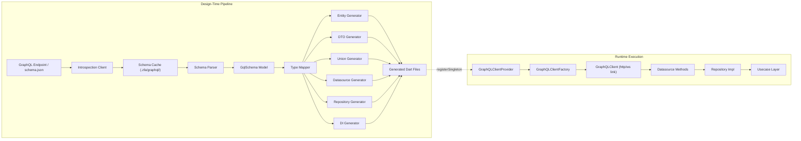

The GraphQL Integration Layer provides a complete pipeline for consuming GraphQL APIs: from introspection through schema parsing, type translation, code generation, and runtime client access. It transforms remote GraphQL schemas into Dart entities, DTOs, repositories, datasources, and DI registrations — all wired into the Zuraffa container for immediate use.

## Architecture Overview

The layer operates in two distinct phases: **design-time** (schema ingestion → code generation) and **runtime** (client construction → request execution). These phases share a common schema model but diverge in execution.



**Key separation**: Design-time runs once per schema change via `zfa graphql generate`. Runtime initializes lazily on first `GraphQLClient` access, with the generated datasources injecting the client through the DI container.

## Schema Ingestion & Caching

Schema ingestion begins with introspection — a standard GraphQL query that requests the complete type system. The layer maintains two parallel implementations:

- `GraphQLIntrospectionService` — legacy service used by `zfa graphql pull` and direct API calls
- `IntrospectionClient` — spec-037 compliant client with injectable transport, used by the schema cache

Both return the same `GqlSchema` model, but the cache layer persists **two artifacts** per named schema:

| Artifact | Path | Purpose |
|----------|------|---------|
| Introspection JSON | `.zfa/graphql/<name>/<name>.schema.json` | Raw server response envelope |
| SDL Document | `.zfa/graphql/<name>/<name>.schema.graphql` | Human-readable schema definition |
| Previous JSON | `.zfa/graphql/<name>/<name>.schema.prev.json` | Rotated prior version for diffing |

The cache rotation strategy ensures `zfa graphql diff` can always compare the two most recent versions without manual intervention. Flat compatibility copies (`.zfa/graphql/<name>.schema.json`) support legacy callers.

Sources: [lib/src/graphql/graphql_introspection_service.dart](lib/src/graphql/graphql_introspection_service.dart#L1-L126), [lib/src/graphql/introspection/introspection_client.dart](lib/src/graphql/introspection/introspection_client.dart#L1-L335), [lib/src/graphql/cache/schema_cache.dart](lib/src/graphql/cache/schema_cache.dart#L1-L339)

## Core Schema Model

The `GqlSchema` class (in `graphql_schema.dart`) is the central data structure, parsed from introspection JSON into a typed representation:

```dart
class GqlSchema {
  final String? queryTypeName;
  final String? mutationTypeName;
  final String? subscriptionTypeName;
  final Map<String, GqlTypeDef> types;
}
```

`GqlTypeDef` captures every GraphQL type kind with appropriate field collections:

| Type Kind | Dart Representation | Key Fields |
|-----------|-------------------|------------|
| SCALAR | `GqlTypeRef` with name | Built-in: String, Int, Float, Boolean, ID |
| OBJECT | `GqlTypeDef` with `fields` | `interfaces` list for implemented interfaces |
| INPUT_OBJECT | `GqlTypeDef` with `inputFields` | Used for mutation variables |
| ENUM | `GqlTypeDef` with `enumValues` | Value names and deprecation flags |
| UNION | `GqlTypeDef` with `possibleTypes` | Member type names |
| INTERFACE | `GqlTypeDef` with `fields` + `possibleTypes` | Abstract type contract |

The `GqlTypeRef` class handles nested type references (NON_NULL and LIST wrappers) with helper methods like `namedType`, `isNonNull`, and `isList` that simplify downstream consumers.

Sources: [lib/src/graphql/graphql_schema.dart](lib/src/graphql/graphql_schema.dart#L1-L282)

## Type Translation Layer

`GraphQLSchemaTranslator` converts the introspection model into Dart-friendly specifications. It applies a **two-pass strategy**: first extract raw type information, then infer identifiers and apply scalar mappings.

### Scalar Mapping

Default mappings cover built-in GraphQL scalars:

| GraphQL Scalar | Dart Type |
|---------------|-----------|
| `String` / `ID` | `String` |
| `Int` | `int` |
| `Float` | `double` |
| `Boolean` | `bool` |
| `DateTime` | `DateTime` |
| `JSON` | `Map<String, dynamic>` |

Custom scalars can be overridden via `.zfa.json` → `graphql.scalarMap`. Malformed entries throw `FormatException` rather than silently falling back.

### Entity Specification

`EntitySpec` captures the essential information for code generation:

```dart
class EntitySpec {
  final String name;
  final List<FieldSpec> fields;
  final String idField;        // Inferred identifier
  final String idDartType;     // Type of the identifier
}
```

The ID field inference logic scans for fields named `id`, `identifier`, or `uuid` (case-insensitive), falling back to the first field when none match.

Sources: [lib/src/graphql/graphql_schema_translator.dart](lib/src/graphql/graphql_schema_translator.dart#L1-L381)

## Code Generation Pipeline

The `SliceOrchestrator` coordinates all generators in dependency order:

1. **Entities** — OBJECT types → zorphy-annotated Dart classes
2. **DTOs** — INPUT_OBJECT types → classes with `toJson()` for mutation variables
3. **Unions** — UNION types → sealed class hierarchies with `fromJson` factory
4. **Datasources** — Per-entity GraphQL operation wrappers
5. **DI Registrations** — Automatic `registerSingleton`/`registerTransient` calls

### Entity Generation

`EntityGenerator` produces classes with:
- `const` constructors with named parameters
- `fromJson` factory for JSON deserialization
- `toJson` for serialization
- `copyWith` for state updates

Generated classes use the `$` prefix convention (e.g., `$Product`) to namespace zorphy-generated code. The generator handles list types, nullability, and nested entity references with proper casting logic.

### DTO Generation

`DtoGenerator` creates input object classes that differ from entities by:
- Only emitting `toJson()` (no `fromJson`)
- Mapping enum values to their string names in JSON output
- Handling nested input objects via recursive `toJson()` calls

### Union Generation

`UnionGenerator` creates sealed class hierarchies:

```dart
sealed class $$AddItemToOrderResult {
  const $$AddItemToOrderResult();
  factory $$AddItemToOrderResult.fromJson(Map<String, dynamic> json) {
    final typename = json['__typename'] as String?;
    switch (typename) {
      case 'OrderLine': return $OrderLine.fromJson(json);
      case 'OrderError': return $OrderError.fromJson(json);
      default: throw ArgumentError('Unknown __typename: $typename');
    }
  }
}
```

Subclasses reuse existing entity classes when the union member is an OBJECT type, avoiding code duplication.

### Datasource Generation

`DatasourceGenerator` is the most complex generator, producing fully-implemented remote data sources:

```dart
class $ProductDatasource {
  final GraphQLClient _client;
  
  Future<SignalResult<Product>> getProduct(String id) async {
    final result = await _client.query(QueryOptions(
      document: gql(GetProductDocument),
      variables: {'id': id},
    ));
    // ... error handling and parsing
  }
}
```

Key features:
- **Union result handling** via `UnionResultHandler` when `errorConfig` is provided
- **Subscription support** when `enableSubscriptions: true`
- **Watch methods** that return `SignalResult<T>` streams, or stubs when subscriptions are disabled
- **Error mapping** from GraphQL error variants to `AppFailure` taxonomy

Sources: [lib/src/graphql/codegen/slice_orchestrator.dart](lib/src/graphql/codegen/slice_orchestrator.dart#L1-L137), [lib/src/graphql/codegen/entity_generator.dart](lib/src/graphql/codegen/entity_generator.dart#L1-L301), [lib/src/graphql/codegen/dto_generator.dart](lib/src/graphql/codegen/dto_generator.dart#L1-L195), [lib/src/graphql/codegen/union_generator.dart](lib/src/graphql/codegen/union_generator.dart#L1-L152), [lib/src/graphql/codegen/datasource_generator.dart](lib/src/graphql/codegen/datasource_generator.dart#L1-L626)

## Repository & DI Generation

`RepositoryGenerator` creates the abstract/clean architecture boundary:

```dart
abstract class ProductRepository {
  Future<SignalResult<Product>> getProduct(String id);
}

class ProductRepositoryImpl implements ProductRepository {
  final $ProductDatasource _datasource;
  
  ProductRepositoryImpl(this._datasource);
  
  @override
  Future<SignalResult<Product>> getProduct(String id) =>
      _datasource.getProduct(id);
}
```

`DiGenerator` emits a `configureGraphqlDi()` function that registers:
- `GraphQLClient` singleton (via `GraphQLClientProvider`)
- Each datasource as singleton or transient
- Each repository interface bound to its implementation

Sources: [lib/src/graphql/codegen/repository_generator.dart](lib/src/graphql/codegen/repository_generator.dart#L1-L156), [lib/src/graphql/codegen/di_generator.dart](lib/src/graphql/codegen/di_generator.dart#L1-L152)

## Runtime Client Construction

`GraphQLClientFactory` assembles the runtime client from configuration:

```dart
GraphQLClientBuildResult build(GraphQLClientConfig config) {
  final httpLink = HttpLink(config.endpoint, defaultHeaders: config.headers);
  
  final Link link;
  if (config.subscriptions && config.wsEndpoint != null) {
    final wsLink = WebSocketLink(config.wsEndpoint!);
    link = Link.split(
      (request) => request.operation.getOperationType() == OperationType.subscription,
      wsLink,
      httpLink,
    );
  } else {
    link = httpLink;
  }
  
  return GraphQLClient(link: link, cache: GraphQLCache());
}
```

The factory applies `FetchPolicy.noCache` for queries and mutations by default, ensuring fresh data. The `GraphQLClientProvider` singleton manages lazy initialization and disposal.

Sources: [lib/src/graphql/client/graphql_client_factory.dart](lib/src/graphql/client/graphql_client_factory.dart#L1-L105), [lib/src/graphql/client/graphql_client_provider.dart](lib/src/graphql/client/graphql_client_provider.dart#L1-L63)

## Subscription Support

`SubscriptionStream<T>` wraps GraphQL subscription streams with automatic error recovery:

```dart
final stream = SubscriptionStream<Product>(
  client: client,
  document: subscriptionDocument,
  parser: (data) => $Product.fromJson(data['productUpdated']),
).toSignalResult();
```

The stream retries on transient errors with a 100ms delay, preserving long-lived watch operations. The `GraphQLClientSubscription` extension provides a convenient `subscribeTo<T>()` method.

Sources: [lib/src/graphql/client/subscription_stream.dart](lib/src/graphql/client/subscription_stream.dart#L1-L133)

## Document Builders

Two document builders exist for different use cases:

| Builder | Approach | Use Case |
|---------|----------|----------|
| `DocumentBuilder` | String templates | Quick document construction |
| `GraphQLDocumentBuilder` | `package:gql` AST nodes | Type-safe, validated documents |

The AST-based builder produces `.graphql` files that are serialized via `gql/language.dart` `printNode()`, ensuring valid GraphQL syntax. It supports queries, mutations, subscriptions, and fragments.

Sources: [lib/src/graphql/document/document_builder.dart](lib/src/graphql/document/document_builder.dart#L1-L97), [lib/src/graphql/gql/graphql_document_builder.dart](lib/src/graphql/gql/graphql_document_builder.dart#L1-L393)

## Validation

`GraphQLValidator` checks documents against the cached schema before execution:

- Operation fields exist on the root type
- Selected fields exist on the target type
- Variable types match argument types
- Fragment spreads reference valid fragments
- Unused variables generate warnings

Sources: [lib/src/graphql/validators/graphql_validator.dart](lib/src/graphql/validators/graphql_validator.dart#L1-L324)

## Schema Diff & SDL Printing

The layer includes a schema diff engine that classifies changes:

| Change | Severity | Example |
|--------|----------|---------|
| Type removed | Breaking | `Product` deleted |
| Field removed | Breaking | `Product.price` deleted |
| Nullability changed | Breaking | `String` → `String!` |
| Required field added | Breaking | New non-null field |
| Enum value removed | Breaking | `CurrencyCode.USD` deleted |
| Optional field added | Non-breaking | New nullable field |
| Enum value added | Non-breaking | `CurrencyCode.EUR` added |
| Type added | Non-breaking | New `Review` type |

The `SdlPrinter` renders the schema back to GraphQL SDL format, used for persistence and human inspection.

Sources: [lib/src/graphql/diff/schema_diff.dart](lib/src/graphql/diff/schema_diff.dart#L1-L304), [lib/src/graphql/sdl/sdl_printer.dart](lib/src/graphql/sdl/sdl_printer.dart#L1-L151)

## Error Mapping Configuration

`ErrorMappingConfig` maps GraphQL union error variants to `AppFailure` categories:

```json
{
  "graphql": {
    "errorMapping": {
      "global": {
        "InsufficientStockError": "business",
        "*Error": "unknown"
      },
      "perOperation": {
        "addItemToOrder": {
          "NegativeQuantityError": "validation"
        }
      }
    }
  }
}
```

Resolution order: per-operation override → global mapping → wildcard `*Error` → default (`success` or `unknown`). Categories map to `ValidationFailure`, `UnauthorizedFailure`, `NetworkFailure`, or `UnknownFailure`.

Sources: [lib/src/graphql/codegen/error_mapping_config.dart](lib/src/graphql/codegen/error_mapping_config.dart#L1-L128), [lib/src/graphql/codegen/union_result_handler.dart](lib/src/graphql/codegen/union_result_handler.dart#L1-L173)

## CLI Entry Point

The `zfa graphql` command group hosts the `generate` subcommand:

```bash
zfa graphql generate --schema=schema.json --output=lib/graphql
zfa graphql generate --endpoint=https://api.example.com/graphql --force
```

Options:
- `--schema` / `-s`: Path to introspection JSON file
- `--output` / `-o`: Output directory (default: `lib/graphql`)
- `--endpoint` / `-e`: GraphQL endpoint URL for live introspection
- `--force` / `-f`: Force refresh schema from endpoint
- `--verbose`: Print full error stack traces

Sources: [lib/src/graphql/codegen/graphql_generate_command.dart](lib/src/graphql/codegen/graphql_generate_command.dart#L1-L126)

## Next Steps

With the GraphQL Integration Layer understood, explore:
- **[Code Generation Engine & Proof Receipts](9-code-generation-engine-and-proof-receipts)** — How generated code is verified
- **[State Management & Sync Framework](18-state-management-and-sync-framework)** — How `SignalResult` integrates with state
- **[Plugin System Architecture](7-plugin-system-architecture)** — How GraphQL generators extend the plugin ecosystem