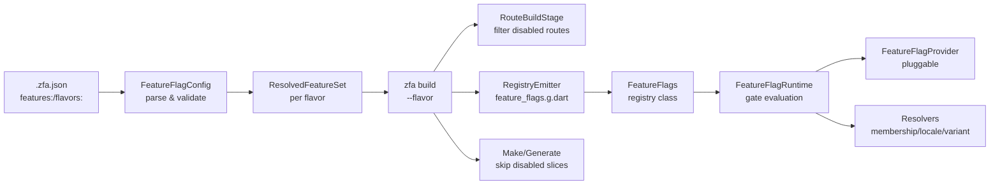

The Feature Flags System enables modular app building by allowing zuraffa developers to enable or disable features per build. This system integrates deeply with code generation, runtime resolution, and flavor-based builds, ensuring that disabled features leave no trace in the generated output.

## Architecture Overview

The system operates across three layers: **configuration** (`.zfa.json` parsing and validation), **build-time filtering** (code generation respects enabled features), and **runtime resolution** (pluggable providers evaluate gates at runtime).



## Configuration Model

The source of truth is the `features:` section in `.zfa.json`. Two shapes are supported: a canonical list of objects and a map with names as keys.

### Feature Declaration

```json
{
  "features": [
    { "name": "pro-analytics", "enabled": true },
    { "name": "beta-scheduler", "enabled": false, "gates": ["locale:en-US,en-GB"] }
  ],
  "flavors": {
    "free": { "pro-analytics": false },
    "pro": {}
  }
}
```

Sources: [feature_flag_config.dart](lib/src/feature_flags/feature_flag_config.dart#L1-L267), [feature_flag.dart](lib/src/feature_flags/feature_flag.dart#L1-L148)

### Gate Syntax

Gates use a colon-delimited convention and are evaluated at runtime against injectable providers:

| Gate Type | Syntax | Example | Purpose |
|-----------|--------|---------|---------|
| membership | `membership:<tier>` | `membership:pro` | Subscription tier check |
| locale | `locale:<l1>,<l2>` | `locale:en-US,en-GB` | Locale allow-list |
| variant | `variant:<a\|b\|c>` | `variant:a\|b` | A/B testing |
| custom | `custom:<handler>` | `custom:power-user` | Custom gate logic |

Sources: [feature_flag.dart](lib/src/feature_flags/feature_flag.dart#L13-L113)

### Validation Rules

All validation failures throw `FeatureConfigException` with messages that name the offending item. Invalid feature names (must match `^[a-zA-Z0-9]+(-[a-zA-Z0-9]+)*$`), duplicate names, unknown flavors, and malformed gate syntax all fail fast at config load time.

Sources: [feature_flag_config_test.dart](test/feature_flags/feature_flag_config_test.dart#L1-L275)

## CLI Commands

The `zfa feature` command group provides list, enable, and disable subcommands that modify `.zfa.json` in place.

### Command Reference

| Command | Behavior | Exit Code |
|---------|----------|-----------|
| `zfa feature list` | Lists all declared features with status | 0 on success |
| `zfa feature list --format=json` | JSON array output | 0 on success |
| `zfa feature enable <name>` | Declares and enables a feature | 0 on success, 1 on invalid name |
| `zfa feature disable <name>` | Disables a declared feature | 0 on success, 1 if undeclared |

Sources: [feature_flag_cli.dart](lib/src/feature_flags/feature_flag_cli.dart#L1-L175)

### Key Behaviors

- `enable` performs an **upsert** — it declares a feature if absent, then sets `enabled: true`
- `disable` **refuses** to operate on undeclared features (must `enable` first)
- The CLI normalizes map-shaped `features:` to the canonical list shape on write
- Validation runs **before** any file write — an invalid resulting config is never persisted

Sources: [feature_flag_cli_test.dart](test/feature_flags/feature_flag_cli_test.dart#L1-L257)

## Build-Time Filtering

The `zfa build` command resolves the feature set **before any stage runs**, ensuring a broken config fails fast.

### Flavor-Based Builds

The `--flavor <name>` flag resolves `features:` against `flavors:` overrides. Unknown flavors exit non-zero with a message naming the offender.

```mermaid
flowchart TD
    A[zfa build --flavor free] --> B[_resolveFeatureSet]
    B --> C[FeatureFlagConfig.load]
    C --> D[config.resolve(flavor: free)]
    D --> E[apply overrides<br>pro-analytics: false]
    E --> F[ResolvedFeatureSet<br>enabled: {notes}<br>disabled: {pro-analytics}]
    F --> G[RouteBuildStage<br>filter disabled routes]
    F --> H[RegistryEmitter<br>feature_flags.g.dart]
    F --> I[Make/Generate<br>skip pro-analytics slice]
```

Sources: [build_command.dart](lib/src/commands/build_command.dart#L403-L469)

### Registry Emission

The `emitRegistry` function generates `lib/src/core/feature_flags.g.dart` containing only enabled features. Disabled features leave no trace — not even in the `_enabled` list literal.

Sources: [registry_emitter.dart](lib/src/feature_flags/registry_emitter.dart#L1-L76), [registry_emitter_test.dart](test/feature_flags/registry_emitter_test.dart#L1-L123)

### Route Filtering

The `RouteBuildStage` drops `@Route`/`@ZfaRoute` annotations owned by disabled features using normalized name matching on class names and file paths:

- **Class name prefix match**: `ProAnalyticsView` matches `pro-analytics`
- **Path segment match**: `pro_analytics_view.dart` or `pro-analytics/` segments

Sources: [route_build_stage.dart](lib/src/dda/plugins/route/route_build_stage.dart#L57-L83), [route_filter_test.dart](test/feature_flags/route_filter_test.dart#L1-L140)

### Make Skip

The `zfa make` command skips generation for slices owned by disabled features, printing a skip reason and writing zero files.

Sources: [make_skip_test.dart](test/feature_flags/make_skip_test.dart#L1-L155)

## Runtime Resolution

The generated `FeatureFlags` registry delegates to `FeatureFlagRuntime`, which resolves features against injectable providers with fail-safe fallbacks.

### Resolution Order

1. **Pluggable provider** (`FeatureFlagProvider`) — its answer wins; throwing or null falls back
2. **Build-time static default** — a feature disabled at build time is disabled; unknown names return `false`
3. **Gate evaluation** — ALL gates must pass; any failing/unavailable gate fails closed

Sources: [feature_flag_provider.dart](lib/src/feature_flags/runtime/feature_flag_provider.dart#L64-L107)

### Pluggable Providers

| Provider Type | Interface | Purpose |
|---------------|-----------|---------|
| Whole-feature | `FeatureFlagProvider` | Override build-time defaults (remote config, entitlements) |
| Membership | `MembershipResolver` | Return current tier (`free`, `pro`) or null |
| Locale | `LocaleResolver` | Return app locale or null |
| Variant | `VariantResolver` | Pick active variant from declared list |
| Custom gate | `CustomGateHandler` | Evaluate a named custom gate |

Sources: [feature_flag_provider.dart](lib/src/feature_flags/runtime/feature_flag_provider.dart#L24-L47)

### Fail-Safe Design

- A throwing provider or resolver **never propagates** — the system falls back to build-time defaults
- Membership/locale gates **fail closed** (a restricted feature must not fail open)
- An unregistered custom gate **fails closed**
- A variant resolver returning an undeclared variant **fails the gate**

Sources: [runtime_provider_test.dart](test/feature_flags/runtime_provider_test.dart#L1-L296)

## Performance Characteristics

- **O(1) static lookup**: The generated registry uses a `const` set for default resolution (SC-003)
- **CLI under 2s**: `zfa feature list/enable/disable` completes in under 2 seconds for configs with up to 50 features (SC-002)
- **Flavor diff**: Switching flavors produces distinct builds verified by automated diff (SC-004)

## Edge Cases

| Scenario | Behavior |
|----------|----------|
| Feature enabled in config but code doesn't exist | Build proceeds; no generation occurs for the missing entity |
| Unknown gate type (e.g., `tenant:xyz`) | Config validation throws `FeatureConfigException` naming the gate |
| Conflicting flavor overrides | Flavor overrides take precedence; base `enabled` state is the fallback |
| Feature toggled after generation | `zfa build` detects staleness via the build cache |
| Invalid JSON or schema violations | `FeatureConfigException` with message naming the offending item |
| Membership provider unavailable | Gate fails closed (feature disabled) |
| Locale unavailable | Locale gate fails closed |
| Unknown feature queried at runtime | `isEnabled` returns `false` |

Sources: [feature_flag_provider.dart](lib/src/feature_flags/runtime/feature_flag_provider.dart#L88-L107), [feature_flag_config.dart](lib/src/feature_flags/feature_flag_config.dart#L207-L237)

## Integration Points

The feature set flows through the build pipeline as a `ResolvedFeatureSet?` parameter:

- **Build command**: Resolves once, passes to all stages
- **Route stage**: Filters `@Route` annotations by disabled feature ownership
- **Make/Generate commands**: Skip slices whose entity name maps to a disabled feature
- **Registry emitter**: Generates the runtime `FeatureFlags` class

Sources: [build_command.dart](lib/src/commands/build_command.dart#L93-L133), [route_build_stage.dart](lib/src/dda/plugins/route/route_build_stage.dart#L87-L103)

## Next Steps

- [TDD Cycle & Spec-Driven Development](13-tdd-cycle-and-spec-driven-development) — how feature flags interact with the TDD loop
- [Code Generation Engine & Proof Receipts](9-code-generation-engine-and-proof-receipts) — the generation pipeline that respects feature flags
- [Error Handling & Exit Code Protocol](22-error-handling-and-exit-code-protocol) — exit codes for feature flag validation failures
- [Configuration & Project Memory (.zfa.json, .zfa/)](4-configuration-and-project-memory-zfa-json-zfa) — the config file format