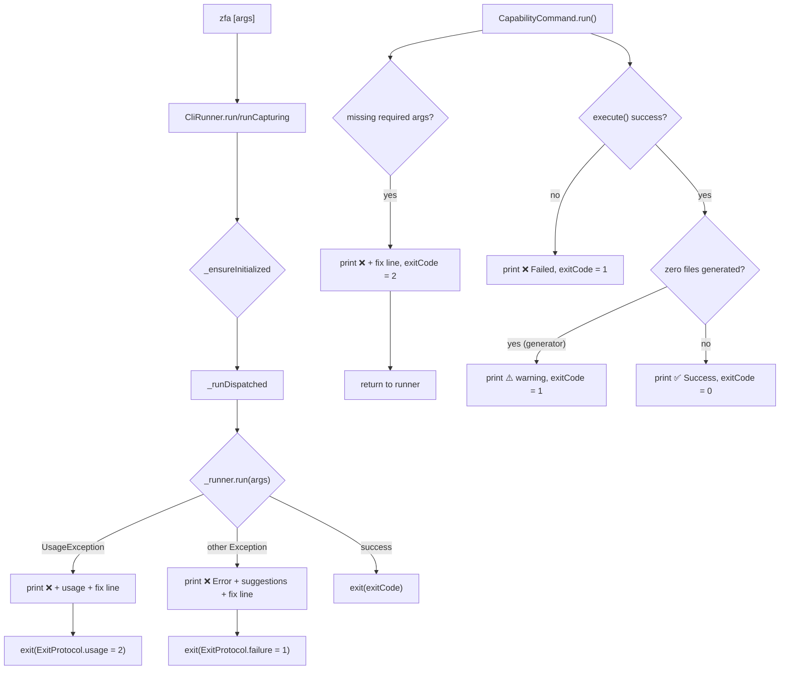
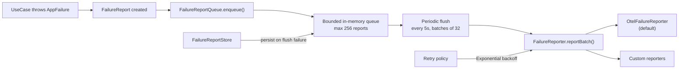

The error handling and exit code protocol is the **machine-contract boundary** between zuraffa and its automation consumers — scripts, CI pipelines, MCP harnesses, and agent loops. It is governed by **SPEC 917** (VISION §3+§4 made mechanical): every invocation exits with a canonical code, and every non-zero exit ends with a machine-actionable `--> fix:` line. Errors are an API, not an apology.

## The Exit Code Protocol

The protocol defines five canonical codes plus one legacy mapping. The golden table is asserted by `test/commands/exit_protocol_golden_test.dart` against live CLI behavior, and printed by `zfa --help` and `zfa schema`.

| Code | Name | Meaning |
|------|------|---------|
| 0 | success | GREEN / complete — the operation ran and everything passed |
| 1 | failure | RED (honest, expected in-loop) / stopped / audit failure / runtime failure — the operation ran and gave an honest negative verdict; the JSON verdict's `exit_class` distinguishes the sub-flavor |
| 2 | usage | The operation could NOT run as invoked — grammar/usage error, unknown flag or subcommand, missing required arguments, invalid invocation target, or runner-infrastructure error (legacy 64 maps here) |
| 3 | drift | Contract/spec drift — manifest ↔ CLI flag drift, template-version drift, traceability drift, corrupt state evidence |
| 4 | conflict | State conflict — concurrent run ownership, evidence lock inconsistency |

**Legacy codes**: `64` (EX_USAGE) is the pre-protocol usage error, mapped onto canonical `2` by `ExitProtocol.canonicalize`. Codes `255`, `-9`, `137` are external termination signals (OOM killer, shell limits) — never emitted by zfa itself, not part of the protocol.

Sources: [exit_protocol.dart](lib/src/cli/exit_protocol.dart#L1-L88), [exit_protocol_golden_test.dart](test/commands/exit_protocol_golden_test.dart#L1-L191), [conformance.yml](.github/workflows/conformance.yml#L1-L78)

### The Protocol Contract

The protocol is enforced at three layers:

1. **Protocol definition** (`ExitProtocol`) — constants, legacy mapping, and the `fixLine()` formatter
2. **Process boundary enforcement** (`CliRunner._runDispatched`) — wraps every command dispatch, catches `UsageException`, and publishes the exit code to `dart:io`
3. **Machine-verifiable output** (`VerdictEnvelope`) — the canonical JSON verdict envelope carrying `exit_class` for `--json` consumers

The `--> fix:` line is the signature of the protocol. Every non-zero exit path — usage errors, capability failures, manifest drift — appends this machine-actionable remediation as the final stdout line. Agents parse this line, not prose.

Sources: [cli_runner.dart](lib/src/cli/cli_runner.dart#L395-L415), [verdict_envelope.dart](lib/src/core/verdict_envelope.dart#L1-L598)

## Domain-Layer Error Model

Below the CLI boundary, errors flow through a typed, sealed hierarchy.

### AppFailure Hierarchy

`AppFailure` is a sealed class hierarchy representing failure types in Clean Architecture. It enables exhaustive pattern matching in switch expressions:

```dart
sealed class AppFailure implements Exception {
  final String message;
  final String? code;       // machine-readable (e.g. GraphQL error type)
  final StackTrace? stackTrace;
  final Object? cause;
}
```

Concrete subtypes cover the full failure taxonomy:

| Failure Type | Trigger Conditions |
|-------------|-------------------|
| `ServerFailure` | HTTP 5xx, server-side errors |
| `NetworkFailure` | DNS failures, connection refused, offline |
| `ValidationFailure` | Invalid input, field-level errors |
| `NotFoundFailure` | Missing resources |
| `UnauthorizedFailure` | Missing/invalid credentials |
| `ForbiddenFailure` | Insufficient permissions |
| `CacheFailure` | Local storage read/write failures |
| `TimeoutFailure` | Operation timeouts |
| `CancellationFailure` | Explicit cancellation |
| `ConflictFailure` | State conflicts, version collisions |
| `UnknownFailure` | Catch-all for unclassified errors |

The `AppFailure.from()` factory intelligently classifies any thrown object by trying each subtype's factory in order of specificity.

Sources: [failure.dart](lib/src/core/failure.dart#L1-L685)

### Exception-to-Failure Mapping

`FailureHandler` is a mixin on `Loggable` that converts raw Dart exceptions into typed `AppFailure` instances. It uses a switch expression over exception types:

```dart
AppFailure handleError(Object error, [StackTrace? stackTrace]) {
  return switch (error) {
    IndexError() => validationFailure('Index out of bounds', ...),
    RangeError e => validationFailure('Value out of range: ${e.message}', ...),
    ArgumentError e => validationFailure(e.message.toString(), ...),
    FormatException e => validationFailure(e.message, ...),
    TimeoutException e => timeoutFailure(e.message ?? 'Operation timed out', ...),
    CancelledException e => cancellationFailure(e.message),
    ZuraffaPlatformException e => platformFailure(...),
    StateError e => stateFailure(e.message, ...),
    ConcurrentModificationError() => stateFailure('Concurrent modification detected', ...),
    StackOverflowError() => stateFailure('Stack overflow', ...),
    OutOfMemoryError() => stateFailure('Out of memory', ...),
    TypeError() => typeFailure('Type error: $error', ...),
    NoSuchMethodError() => typeFailure('No such method: $error', ...),
    UnimplementedError e => unimplementedFailure(e.message ?? 'Feature not implemented', ...),
    UnsupportedError e => unsupportedFailure(e.message ?? 'Operation not supported', ...),
    _ => AppFailure.from(error, stackTrace ?? StackTrace.current),
  };
}
```

This mapping is used by data sources and repositories to ensure every failure escaping the domain layer carries a typed `AppFailure`.

Sources: [failure_handler.dart](lib/src/core/failure_handler.dart#L1-L361)

### The Result Type

`Result<S, F>` is the functional Either-like type used throughout the domain layer. Use cases return `Result<Value, AppFailure>` rather than throwing:

```dart
final class Success<S, F> extends Result<S, F> {
  final S value;
}

final class Failure<S, F> extends Result<S, F> {
  final F error;
}
```

The type supports `fold`, `map`, `flatMap`, `getOrElse`, and async variants. A `LoadingResult` represents in-progress async state without nullable workarounds.

Sources: [result.dart](lib/src/core/result.dart#L1-L356)

## CLI Error Flow

The CLI error flow operates at the process boundary. Here is the complete path from invocation to exit code:



Sources: [cli_runner.dart](lib/src/cli/cli_runner.dart#L365-L415), [capability_command.dart](lib/src/commands/capability_command.dart#L250-L398)

### Usage Errors (Exit 2)

Usage errors cover the "could not run as invoked" family:

- Unknown flags (`zfa manifest --definitely-not-a-flag`)
- Unknown subcommands (`zfa definitely-not-a-command`)
- Missing required arguments (`zfa feature` with no entity name)
- Removed commands (`zfa generate` — removed in v5, use `zfa make`)
- Runner infrastructure errors

The `CliRunner._usageFixFor()` method generates the machine-actionable remediation:

```dart
String _usageFixFor(String message) {
  if (message.contains('Could not find an option') ||
      message.contains('Could not find a subcommand')) {
    return "re-run with --help to list the valid flags and subcommands, "
        "then re-invoke";
  }
  return "re-run with --help to check the invocation grammar, then re-invoke";
}
```

Sources: [cli_runner.dart](lib/src/cli/cli_runner.dart#L402-L412)

### Runtime Failures (Exit 1)

Runtime failures are honest negative verdicts from a command that *could* run but produced a failure outcome:

- Capability `execute()` returns `success: false`
- Generator produces zero files (the #769 zero-files guard)
- File system errors, permission issues, invalid project state
- Generic uncaught exceptions

The `CapabilityCommand` sets `exitCode = 1` on failure:

```dart
} else {
  print('❌ Failed: ${result.message}');
  exitCode = 1;
}
```

Sources: [capability_command.dart](lib/src/commands/capability_command.dart#L369-L373)

### Contract Drift (Exit 3)

Contract drift is the manifest gate's domain. `zfa manifest --verify` certifies that every CLI-aware plugin's `inputSchemas ↔ CLI flags ↔ help text` are in conformance. When drift is detected:

```dart
final exit = realFindings.isEmpty
    ? ExitProtocol.success
    : ExitProtocol.drift;
```

The JSON machine-verifiable form (`manifest-verify.v1`) carries `"exit_code": 3`:

```json
{
  "schema": "manifest-verify.v1",
  "ok": false,
  "exit_code": 3,
  "findings": [...]
}
```

Sources: [manifest_command.dart](lib/src/commands/manifest_command.dart#L370-L376), [conformance.yml](.github/workflows/conformance.yml#L44-L46)

### State Conflict (Exit 4)

State conflict covers concurrent run ownership and evidence lock inconsistency. This code is pinned in the protocol and exercised end-to-end by the TDD run-driver concurrent-run fixtures. The cross-isolate lock system (`_exitSpanLockFile`, `_cwdLockFile`) in `CliRunner` ensures that concurrent invocations in the same Dart process do not corrupt each other's exit codes or working directories.

Sources: [cli_runner.dart](lib/src/cli/cli_runner.dart#L510-L600), [exit_protocol_golden_test.dart](test/commands/exit_protocol_golden_test.dart#L138-L142)

## The Verdict Envelope

For `--json` consumers, zuraffa emits a single canonical `VerdictEnvelope` as the last stdout line. The schema is `zuraffa.verdict.v1`:

```json
{
  "schema": "zuraffa.verdict.v1",
  "command": "zfa route create Product",
  "verdict": "pass|fail|skip|error|stopped",
  "exit_class": 0|1|2|3|4|64,
  "subject": {"kind": "route|state|usecase|...", "id": "Product"},
  "artifacts": {"created": [...], "modified": [...], "deleted": [...]},
  "receipts": [".zfa/receipts/..."],
  "findings": [{"kind": "...", "fix": "zfa ...", "file": "..."}],
  "drifts": [...],
  "details": { ... },
  "timestamp": "2026-09-05T12:00:00.000Z"
}
```

The `exit_class` field carries the ExitProtocol code. `VerdictEnvelope.fromJson()` throws `VerdictSchemaException` if the schema identifier is anything other than `zuraffa.verdict.v1` — old envelope shapes break loudly, never silently.

The `exit_class` duality is handled in the parser: the canonical integer form parses into `exitClass`; the grandfathered tdd label form (`"ok"`, `"complete"`, `"stopped"`) parses into `exitClassLabel` and re-encodes as the same label (round-trip honesty).

Sources: [verdict_envelope.dart](lib/src/core/verdict_envelope.dart#L1-L598)

## Failure Reporting Pipeline

Failures in the domain layer flow through an async reporting pipeline:



Key properties:
- **Fire-and-forget**: `enqueue()` never blocks the caller
- **Bounded**: Drops oldest reports when the queue is full (prevents memory leaks)
- **Never crashes**: Reporter errors are caught and logged
- **Persistent**: Optional disk-backed store survives app restarts

Sources: [failure_report_queue.dart](lib/src/core/failure_report_queue.dart#L1-L268), [failure_reporter.dart](lib/src/core/failure_reporter.dart#L1-L88)

## The Fix Line Convention

Every non-zero exit path ends with a machine-actionable line:

```
--> fix: re-run with --help to check the invocation grammar, then re-invoke
```

The `ExitProtocol.fixLine()` formatter produces this:

```dart
static String fixLine(String fix) => '--> fix: $fix';
```

The convention is asserted by `exit_protocol_golden_test.dart` — the golden test greps for `fix:` in the output of every non-zero exit path. The `SuggestionEngine` provides additional context-aware suggestions for certain error patterns.

Sources: [exit_protocol.dart](lib/src/cli/exit_protocol.dart#L74-L76), [suggestion_engine.dart](lib/src/core/error/suggestion_engine.dart#L1-L48)

## Concurrency & Isolate Safety

The exit code protocol has special handling for the Dart test environment, where test suites run as concurrent isolates of one process. The `dart:io exitCode` is **process-global**, so a sibling suite's command finishing between this run's teardown and the caller's `expect(exitCode, ...)` read can clobber the value.

The solution is a two-lock system:

1. **`_exitSpanLockFile`** — Held across the entire `runCapturing` dispatch (reset, command body, snapshot, re-apply). Ensures exactly one writer to the global `exitCode` at a time.
2. **`_cwdLockFile`** — Guards the scoped chdir window for `-C`/`--directory` invocations.

Both locks use exclusive-create (`File.createSync(exclusive: true)`) which works across isolates AND processes. A 30-second timeout with stale-lock breaking prevents deadlocks.

The hermetic snapshot `CliRunner.lastDispatchedExitCode` is a per-isolate static that callers can read instead of the global, immune to the sibling clobber.

Sources: [cli_runner.dart](lib/src/cli/cli_runner.dart#L510-L600), [exit_protocol_golden_test.dart](test/commands/exit_protocol_golden_test.dart#L88-L93)

## Testing the Protocol

The protocol is tested at multiple tiers:

| Test File | Tier | What It Asserts |
|-----------|------|----------------|
| `exit_protocol_golden_test.dart` | Fast | Constants, legacy mapping, live CLI behavior for each code, `fix:` line presence |
| `capability_command_exit_code_test.dart` | Fast | Capability runner: missing args → 2, failure → 1, success → 0 |
| `slice_merge_exit_code_test.dart` | Fast | Slice command failure paths exit 1 at process boundary |
| `exit_code_sweep_1139_test.dart` | E2E | Every plugin command body exits non-zero on failure |
| `manifest_verify_gate_test.dart` | Fast | Manifest drift exits 3 |

Sources: [exit_protocol_golden_test.dart](test/commands/exit_protocol_golden_test.dart#L1-L191), [capability_command_exit_code_test.dart](test/commands/capability_command_exit_code_test.dart#L1-L100), [exit_code_sweep_1139_test.dart](test/commands/exit_code_sweep_1139_test.dart#L1-L527)

## Next Steps

- **[No-JIT Execution Policy](23-no-jit-execution-policy)** — How zuraffa ensures deterministic execution across environments
- **[Proof Receipts & Verification Gates](15-proof-receipts-and-verification-gates)** — The receipt system that certifies generation outcomes
- **[CLI Commands & Subcommands](6-cli-commands-and-subcommands)** — The full command surface and how commands interact with the exit protocol
- **[Testing Infrastructure & Test Organization](14-testing-infrastructure-and-test-organization)** — How the test suite is structured around the protocol contract