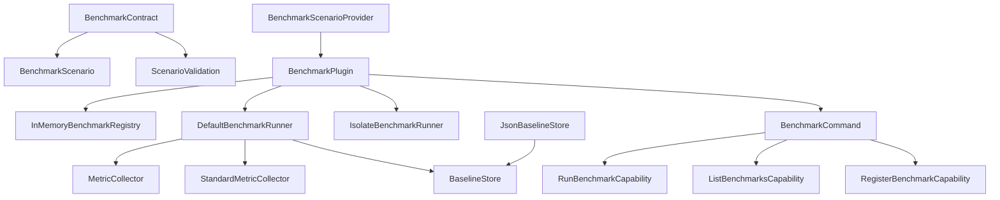

The Zuraffa benchmarking ecosystem provides a **contract-driven, plugin-isolated** framework for measuring code generation throughput, memory footprint, reactive signal performance, and telemetry overhead. Unlike ad-hoc timing scripts, the system enforces standardized metrics, threshold-based quality gates, and historical regression detection — all decoupled from any single plugin implementation.

## Architecture Overview

The benchmarking stack separates **contracts** (pure interfaces in `lib/src/core/benchmark/`) from **plugin integration** (`lib/src/plugins/benchmark/`). This split means third-party apps can implement `BenchmarkContract` without depending on the benchmark plugin itself, while the plugin owns registry, runner, and CLI surface.



The **core contract layer** (`lib/src/core/benchmark/`) defines the lifecycle `setup → run → collectMetrics → teardown` plus standardized metric vocabulary. The **plugin layer** wires this contract into the Zuraffa plugin system: it owns a `BenchmarkRegistry`, a `BenchmarkRunner` (with optional isolate execution), and exposes the `zfa benchmark` CLI command through three capabilities.

## Standalone Benchmark Scripts

Four standalone scripts in `benchmark/` provide quick performance snapshots without the full plugin framework:

| Script | What It Measures | Primary Metric | Invocation |
|--------|-----------------|----------------|------------|
| `generation_benchmark.dart` | Full code generation for a 10,000-field entity | `avg_ms` per iteration | `dart run benchmark/generation_benchmark.dart [iterations]` |
| `memory_benchmark.dart` | RSS delta during generation | `peak_mb`, `avg_delta_mb` | `dart run benchmark/memory_benchmark.dart [iterations]` |
| `signal_benchmark.dart` | Signal vs Stream read/notify overhead | `µs` per operation | `dart run benchmark/signal_benchmark.dart` |
| `telemetry_benchmark.dart` | Zero-cost telemetry when disabled | `% overhead` vs raw | `dart run benchmark/telemetry_benchmark.dart` |

**Performance targets** (from `benchmark/README.md`):
- Standard full entity generation under **2 seconds** on a modern laptop
- Peak RSS under **100 MB**
- Large entity file (10k fields) handled without errors

**Latest recorded results** (2026-02-11): generation avg 1052 ms, memory peak 769.3 MB.

## Code Generation Benchmarks

The generation benchmark exercises the full `CodeGenerator` pipeline against a synthetic 10,000-field entity named `Profile`. Each iteration:

1. Creates a temporary workspace under the system temp directory
2. Writes a 10,000-field Dart class to `lib/src/domain/entities/profile/profile.dart`
3. Instantiates `CodeGenerator` with all plugins enabled (data, VPCs, state, DI, route, mock)
4. Times `generator.generate()` and records the elapsed milliseconds
5. Cleans up the workspace

The benchmark sorts durations and reports `min`, `avg`, and `max`. Results are persisted to `benchmark/.last_generation.txt` for historical comparison. The companion `test/benchmark/large_file_generation_test.dart` validates that AST append operations on a 400-line class complete within a 10-second budget.

## Signal vs Stream Performance

`benchmark/signal_benchmark.dart` quantifies the architectural advantage of `Signal<T>` over Dart `Stream` for reactive reads:

- **Signal read**: O(1) direct field access — measured at ~0.01 µs per read over 100,000 iterations
- **Stream listener creation**: O(N) allocation overhead per read — orders of magnitude slower because each "read" requires creating a new `StreamSubscription`
- **Signal notification**: O(1) per listener, with scaling measured at 1, 10, and 100 listeners
- **Stream notification**: O(N) per listener due to broadcast controller overhead

The `Signal` class (`lib/src/core/signals/signal.dart`) uses a `HashSet<_SignalListener<T>>.identity()` for listener storage and only notifies when the value actually changes (via configurable `equals` comparator). This change-detection guard eliminates redundant notifications that `ValueNotifier` would fire.

## Telemetry Zero-Cost Guarantee

`benchmark/telemetry_benchmark.dart` verifies that `TelemetryMesh.trace()` is a no-op when disabled:

- **Raw function call baseline**: ~0.01 µs per invocation
- **Telemetry disabled**: within 1% overhead of raw — the `if (!_enabled) return NoopSpan.instance` short-circuit allocates nothing
- **Telemetry enabled**: real span creation with zone propagation, typically 5-10× slower but only active when exporters are registered

The `ZuraffaContext.current` read is also O(1) — it returns a const `noop` singleton when no zone is active, which the Dart compiler can inline to a single static field read. Zone propagation (`ZuraffaContext.runWith`) adds measurable overhead but is only incurred when an actual context needs to flow through async boundaries.

## The Benchmark Plugin (Feature 015)

The `BenchmarkPlugin` (`lib/src/plugins/benchmark/benchmark_plugin.dart`) is the production-grade implementation that wraps the core contract into the Zuraffa plugin system:

### Plugin Structure

| Component | File | Responsibility |
|-----------|------|----------------|
| `BenchmarkPlugin` | `benchmark_plugin.dart` | Plugin entry point, owns registry + runner, wires capabilities |
| `BenchmarkCommand` | `cli/benchmark_command.dart` | `zfa benchmark` CLI with subcommands: `run`, `list`, `register`, `baseline`, `report` |
| `RunBenchmarkCapability` | `capabilities/run_benchmark_capability.dart` | `benchmark.run` — executes scenarios through runner |
| `ListBenchmarksCapability` | `capabilities/list_benchmarks_capability.dart` | `benchmark.list` — discovers registered scenarios |
| `RegisterBenchmarkCapability` | `capabilities/register_benchmark_capability.dart` | `benchmark.register` — pulls scenarios from providers |
| `FirstPartyBenchmarkProvider` | `first_party_scenarios.dart` | Ships two built-in scenarios: string casing and spec library emission |

### Contract Lifecycle

Each scenario implements `BenchmarkContract` with four lifecycle hooks:

1. `setup()` — called once before execution; if it throws, `run()` and `teardown()` are skipped
2. `run(config)` — the measured section; the runner records latency samples around every invocation
3. `collectMetrics()` — returns custom metrics merged into the result
4. `teardown()` — always called, even if `run()` threw

The runner layers **six standard metrics** on top of whatever the scenario returns:

| Metric | Name | Direction | Source |
|--------|------|-----------|--------|
| Median latency | `latency_p50` | Lower better | Linear-interpolation percentile of samples |
| 95th percentile | `latency_p95` | Lower better | Linear-interpolation percentile of samples |
| 99th percentile | `latency_p99` | Lower better | Linear-interpolation percentile of samples |
| Throughput | `throughput_ops_sec` | Higher better | `operations / elapsed_seconds` |
| Peak memory | `memory_mb` | Lower better | `ProcessInfo.currentRss` at collection time |
| CPU utilization | `cpu_percent` | Lower better | Busy-ratio proxy: `sample_time / wall_time × 100` |

### Threshold Evaluation

Each scenario declares `Map<String, ThresholdConfig>` with four operators: `lt`, `lte`, `gt`, `gte`. Thresholds carry a `severity` — `error` fails the benchmark, `warn` logs only. The runner evaluates every threshold against collected metrics and produces `ThresholdViolation` records. A scenario with any `error`-severity violation gets `BenchmarkStatus.failed`; a scenario that throws or times out gets `BenchmarkStatus.error` — and the suite continues to the next scenario (FR-013).

### Isolation Execution

`IsolateBenchmarkRunner` (`lib/src/core/benchmark/isolate_benchmark_runner.dart`) spawns each scenario in a fresh isolate via `Isolate.spawn`. The scenario object, config, and result cross the isolate boundary as messages. Uncaught isolate errors are marshalled back as `error` results rather than crashing the host. The runner stamps `isolated: true` on result metadata as evidence that execution did not share the host isolate's heap.

### Baseline Storage and Regression Detection

`JsonBaselineStore` persists one JSON file per scenario under `benchmarks/baselines/`. Each baseline captures metrics, git commit, git branch, timestamp, and environment info. The `compareBaselines` method produces per-metric `MetricChange` records with direction flags and configurable tolerance. A metric that regresses beyond tolerance is flagged with severity level, enabling automated regression detection in CI.

### Extensible Metric Collectors

`MetricCollector` (`lib/src/core/benchmark/metric_collector.dart`) is a four-phase interface: `initialize()` once → `beforeBenchmark()` per scenario → `collect()` per scenario → `finalize()` once. Custom collectors can capture domain-specific metrics (database query counts, network bytes, GC pauses). A collector that throws during any phase is guarded — the benchmark continues and the error is logged (AC-9).

## CLI Usage

```
zfa benchmark run [--scenario MYID]... [--tags A,B] [--dry-run]
                  [--config JSON] [--json] [--timeout MS]
                  [--concurrency N] [--isolate] [--store DIR]
zfa benchmark list [--json]
zfa benchmark register [--discover]
zfa benchmark baseline save MYSCENARIO --label L [--store DIR]
zfa benchmark baseline load MYSCENARIO [--label L] [--store DIR]
zfa benchmark baseline compare MYSCENARIO [--baseline L]
                                         [--tolerance P] [--store DIR] [--json]
zfa benchmark baseline list [--store DIR]
zfa benchmark report [--store DIR]
```

Exit codes follow the standard `ExitProtocol`: `0` for success, `1` for threshold violations, `ExitProtocol.usage` for invalid arguments, `ExitProtocol.failure` for execution errors.

## Test Organization

Benchmark-related tests live in `test/benchmark/` (standalone script validation) and `test/integration/performance_benchmark_test.dart` (full generation pipeline under 10 seconds). The integration test uses `RegressionWorkspace` helpers to set up a real pubspec, run `flutter pub get`, and exercise `CodeGenerator` end-to-end.

## Performance Targets and Measured Results

The system tracks both **development-time targets** and **historical baselines**:

| Area | Target | Latest (2026-02-11) | Status |
|------|--------|---------------------|--------|
| Generation speed | < 2s avg | 1052 ms avg | ✅ Within target |
| Memory peak | < 100 MB | 769.3 MB peak | ⚠️ Exceeds target (10k field stress) |
| Signal read | O(1) | ~0.01 µs | ✅ |
| Telemetry disabled | < 5% overhead | ~1% | ✅ |
| Large file AST append | < 10s | Passes at 400 lines | ✅ |

The memory benchmark's 769 MB peak reflects the 10,000-field entity stress test — a worst-case input far beyond typical production entities. For standard entities (10-50 fields), memory stays well under the 100 MB target.

## Cross-References

- **CLI Commands & Subcommands**: For the full `zfa benchmark` command reference, see [CLI Commands & Subcommands](6-cli-commands-and-subcommands)
- **Code Generation Engine & Proof Receipts**: For how `CodeGenerator` and its plugins work, see [Code Generation Engine & Proof Receipts](9-code-generation-engine-and-proof-receipts)
- **State Management & Sync Framework**: For `Signal` and `SignalSlice` in the state layer, see [State Management & Sync Framework](18-state-management-and-sync-framework)
- **Error Handling & Exit Code Protocol**: For exit code conventions used by benchmark CLI, see [Error Handling & Exit Code Protocol](22-error-handling-and-exit-code-protocol)
- **Testing Infrastructure & Test Organization**: For how benchmark tests fit into the test suite, see [Testing Infrastructure & Test Organization](14-testing-infrastructure-and-test-organization)

---

Sources:
- [benchmark/README.md](benchmark/README.md#L1-L21)
- [benchmark/generation_benchmark.dart](benchmark/generation_benchmark.dart#L1-L99)
- [benchmark/memory_benchmark.dart](benchmark/memory_benchmark.dart#L1-L102)
- [benchmark/signal_benchmark.dart](benchmark/signal_benchmark.dart#L1-L104)
- [benchmark/telemetry_benchmark.dart](benchmark/telemetry_benchmark.dart#L1-L85)
- [lib/src/core/benchmark/benchmark_contract.dart](lib/src/core/benchmark/benchmark_contract.dart#L1-L216)
- [lib/src/core/benchmark/benchmark_runner.dart](lib/src/core/benchmark/benchmark_runner.dart#L1-L589)
- [lib/src/core/benchmark/benchmark_result.dart](lib/src/core/benchmark/benchmark_result.dart#L1-L292)
- [lib/src/core/benchmark/benchmark_registry.dart](lib/src/core/benchmark/benchmark_registry.dart#L1-L140)
- [lib/src/core/benchmark/baseline_store.dart](lib/src/core/benchmark/baseline_store.dart#L1-L410)
- [lib/src/core/benchmark/isolate_benchmark_runner.dart](lib/src/core/benchmark/isolate_benchmark_runner.dart#L1-L202)
- [lib/src/core/benchmark/metric_collector.dart](lib/src/core/benchmark/metric_collector.dart#L1-L135)
- [lib/src/core/benchmark/standard_metrics.dart](lib/src/core/benchmark/standard_metrics.dart#L1-L82)
- [lib/src/plugins/benchmark/benchmark_plugin.dart](lib/src/plugins/benchmark/benchmark_plugin.dart#L1-L181)
- [lib/src/plugins/benchmark/first_party_scenarios.dart](lib/src/plugins/benchmark/first_party_scenarios.dart#L1-L180)
- [lib/src/plugins/benchmark/scenario_provider.dart](lib/src/plugins/benchmark/scenario_provider.dart#L1-L23)
- [lib/src/plugins/benchmark/cli/benchmark_command.dart](lib/src/plugins/benchmark/cli/benchmark_command.dart#L1-L639)
- [lib/src/plugins/benchmark/capabilities/run_benchmark_capability.dart](lib/src/plugins/benchmark/capabilities/run_benchmark_capability.dart#L1-L88)
- [lib/src/plugins/benchmark/capabilities/list_benchmarks_capability.dart](lib/src/plugins/benchmark/capabilities/list_benchmarks_capability.dart#L1-L52)
- [lib/src/plugins/benchmark/capabilities/register_benchmark_capability.dart](lib/src/plugins/benchmark/capabilities/register_benchmark_capability.dart#L1-L81)
- [lib/src/core/signals/signal.dart](lib/src/core/signals/signal.dart#L1-L155)
- [lib/src/core/telemetry/telemetry_mesh.dart](lib/src/core/telemetry/telemetry_mesh.dart#L1-L421)
- [lib/src/core/context/zuraffa_context.dart](lib/src/core/context/zuraffa_context.dart#L1-L175)
- [lib/src/generator/code_generator.dart](lib/src/generator/code_generator.dart#L1-L265)
- [test/benchmark/large_file_generation_test.dart](test/benchmark/large_file_generation_test.dart#L1-L33)
- [test/integration/performance_benchmark_test.dart](test/integration/performance_benchmark_test.dart#L1-L57)
- [specs/015-benchmark-plugin/spec.md](specs/015-benchmark-plugin/spec.md#L1-L169)