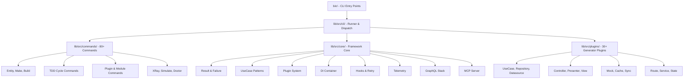
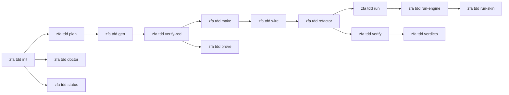
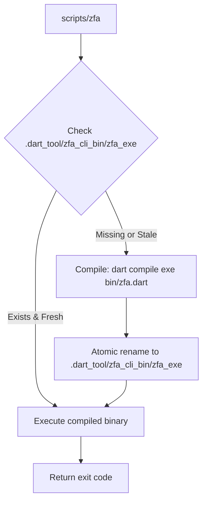

Zuraffa is an AI-first Clean Architecture framework and CLI toolchain for building type-safe, scalable Dart and Flutter applications. This page maps the repository's physical layout, logical layering, and the relationships between its core systems — designed to help new developers navigate from the top-level structure down to individual subsystems.

## Repository Top-Level Layout

The repository root contains a clearly separated set of concerns: source code under `lib/`, test suites under `test/`, CLI entry points under `bin/`, documentation under both `doc/` and `docs/`, and example applications under `example/` and `examples/`.

| Directory | Purpose |
|---|---|
| `bin/` | CLI executables (`zfa.dart`, `zuraffa.dart`, `zuraffa_mcp_server.dart`) |
| `lib/` | All framework source code (the core package) |
| `test/` | Unit, integration, regression, and plugin test suites |
| `example/` | A Flutter app demonstrating the TDD cycle |
| `examples/` | Standalone example packages (gym templates, MCP demo, etc.) |
| `doc/` | Architecture docs, ADRs, guides, and the project website |
| `docs/` | Auto-generated documentation (TDD guide, migration guides, etc.) |
| `specs/` | Feature specifications driving the TDD cycle (1000+ feature dirs) |
| `corpus/` | Spec corpus for TDD automation (128 feature directories + regression) |
| `.specify/` | Spec Kit state, memory, and workflow configuration |
| `.zfa/` | Runtime receipts and state for the TDD engine |
| `.gym/` | Gym training exercises and fixtures |
| `scripts/` | Shell scripts for build, test, and deployment automation |
| `tools/` | Dart scripts for corpus generation and probing |
| `.github/` | CI workflows, issue templates, and PR templates |

Sources: [pubspec.yaml](pubspec.yaml#L1-L104)

## Three Entry Points

Zuraffa exposes three compiled CLI binaries, each with a distinct audience:

| Binary | Source | Primary Audience |
|---|---|---|
| `zfa` | `bin/zfa.dart` → `lib/src/zfa_cli.dart` | Developers and AI agents driving the TDD cycle |
| `zuraffa` | `bin/zuraffa.dart` → `lib/src/zfa_cli.dart` | Legacy alias for the same runner |
| `zuraffa_mcp_server` | `bin/zuraffa_mcp_server.dart` | MCP clients (e.g., Claude) interacting via the Model Context Protocol |

All three ultimately delegate to `cli.run()` in `lib/src/zfa_cli.dart`, which constructs a `CliRunner` and dispatches to the appropriate command. The `zfa` binary is the canonical entry point.

Sources: [bin/zfa.dart](bin/zfa.dart#L1-L13), [bin/zuraffa.dart](bin/zuraffa.dart#L1-L12), [lib/src/zfa_cli.dart](lib/src/zfa_cli.dart#L1-L15)

## Core Library Barrel Structure

The main `zuraffa` package uses **dedicated barrel files** to control its public surface. Rather than a single monolithic export, each barrel isolates a distinct capability domain. This split prevents naming collisions across ecosystem packages (e.g., `lib/agent.dart` was separated from the default barrel due to conflicts with `zuraffa_agent` — see issue #1344).

| Barrel File | Scope | Import Path |
|---|---|---|
| `lib/zuraffa.dart` | Default barrel — core framework, DI, state, sync, params, plugins | `package:zuraffa/zuraffa.dart` |
| `lib/agent.dart` | Agent runtime (kernel, policy, ui_render, runtime plugin) | `package:zuraffa/agent.dart` |
| `lib/mock.dart` | Native mocking framework | `package:zuraffa/mock.dart` |
| `lib/simulation.dart` | Simulation flavor and world machinery | `package:zuraffa/simulation.dart` |
| `lib/skin.dart` | Skin contract auditor and UI layer generation | `package:zuraffa/skin.dart` |
| `lib/zap.dart` | ZAP agent protocol (messages, host, client, conformance) | `package:zuraffa/zap.dart` |
| `lib/zap.dart` | Same as above (no separate barrel) | `package:zuraffa/zap.dart` |

The default barrel (`lib/zuraffa.dart`) is 1,361 lines and re-exports the entire framework surface — Result types, failure hierarchy, UseCase patterns, params, hooks, sync strategies, cache policies, plugin system, API bridge, endpoint metadata, cancellation tokens, and more. The dedicated barrels narrow this surface to prevent import collisions.

Sources: [lib/zuraffa.dart](lib/zuraffa.dart#L1-L200), [lib/agent.dart](lib/agent.dart#L1-L24), [lib/mock.dart](lib/mock.dart#L1-L6), [lib/simulation.dart](lib/simulation.dart#L1-L30), [lib/skin.dart](lib/skin.dart#L1-L19), [lib/zap.dart](lib/zap.dart#L1-L57)

## Logical Architecture Layers

The `lib/src/` tree is organized into functional layers. While packages are not split by layer (Zuraffa is a single package), the directory structure enforces logical separation:



Sources: [lib/src/cli/cli_runner.dart](lib/src/cli/cli_runner.dart#L1-L80), [lib/src/commands](lib/src/commands), [lib/src/core](lib/src/core), [lib/src/plugins](lib/src/plugins)

## The Core Framework Layer (`lib/src/core/`)

The core layer is the foundation everything else builds upon. It contains the fundamental abstractions and infrastructure:

### Result & Failure System
- **`result.dart`** — Sealed `Result<S, F>` type with `Success` and `Failure` variants, supporting `fold`, `map`, `flatMap`, `getOrElse`, and async variants
- **`failure.dart`** — Sealed `AppFailure` hierarchy with 15+ subtypes: `ServerFailure`, `NetworkFailure`, `CacheFailure`, `ValidationFailure`, `NotFoundFailure`, `UnauthorizedFailure`, `ForbiddenFailure`, `ConflictFailure`, `TimeoutFailure`, `CancellationFailure`, and more
- **`failure_handler.dart`**, **`failure_hooks.dart`**, **`failure_reporter.dart`** — Failure handling pipeline with hooks, reporting, and registry-based dispatch

### UseCase Patterns
- **`domain/usecase.dart`** — Base `UseCase<T, Params>`: single-shot operations returning `Result<T, AppFailure>` with cancellation, hooks, and automatic error wrapping
- **`domain/stream_usecase.dart`** — `StreamUseCase<T, Params>`: reactive operations emitting `Stream<Result<T, AppFailure>>`
- **`domain/background_usecase.dart`**, **`domain/sync_usecase.dart`**, **`domain/completable_usecase.dart`** — Specialized variants for background, sync, and fire-and-forget operations

### Plugin System
- **`core/plugin_system/plugin_interface.dart`** — `ZuraffaPlugin` base interface and `FileGeneratorPlugin` abstract class with lifecycle hooks (`beforeGenerate`, `afterGenerate`, `onError`) and dependency ordering (`dependsOn`, `runAfter`)
- **`core/plugin_system/plugin_registry.dart`** — Registry coordinating plugin discovery, ordering, and execution
- **`core/plugin_system/cli_aware_plugin.dart`** — Plugins that contribute CLI flags and subcommands
- **`core/plugin_system/capability.dart`** — `ZuraffaCapability` representing named, invokable capabilities with parameter schemas

### Dependency Injection
- **`core/dependencies/`** — DI container, dependency wiring, and pubspec auto-add for generated imports

### Other Core Systems
- **`core/hook.dart`**, **`core/hook_registry.dart`** — Pre/success/failure hook dispatch for cross-cutting concerns
- **`core/otel_tracer.dart`**, **`core/telemetry/`** — OpenTelemetry tracing and telemetry hooks
- **`core/retry_policy.dart`**, **`core/retry_policies.dart`** — Pluggable retry strategies
- **`core/cancel_token.dart`** — Cooperative cancellation across async operations
- **`core/sync_strategy.dart`**, **`core/sync_status.dart`** — Offline-first sync abstractions

Sources: [lib/src/core/result.dart](lib/src/core/result.dart#L1-L200), [lib/src/core/failure.dart](lib/src/core/failure.dart#L1-L200), [lib/src/domain/usecase.dart](lib/src/domain/usecase.dart#L1-L200), [lib/src/domain/stream_usecase.dart](lib/src/domain/stream_usecase.dart#L1-L200), [lib/src/core/plugin_system/plugin_interface.dart](lib/src/core/plugin_system/plugin_interface.dart#L1-L84)

## The Plugin System Architecture

The plugin system is the backbone of code generation. Per [ADR-001](doc/ADR/001-plugin-architecture.md), the decision to adopt a plugin architecture was driven by the need to extend, test, and evolve each layer (domain, data, presentation, DI, routing) independently.

### Plugin Types

There are two plugin tiers:

1. **Generator Plugins** (`ZuraffaPlugin` / `FileGeneratorPlugin` in `lib/src/core/plugin_system/`) — Produce `GeneratedFile` results. These are the building blocks of `zfa make`.
2. **Runtime Plugins** (`lib/src/plugins/`) — Each directory under `lib/src/plugins/` is a full feature plugin with builders, capabilities, CLI integration, and verification logic.

### Plugin Directory Map

The `lib/src/plugins/` directory contains **36+ feature plugins**, each following the same internal structure:

| Plugin | Responsibility |
|---|---|
| `usecase/` | UseCase generation, conformance, verdicts |
| `repository/` | Repository layer generation |
| `datasource/` | Data source generation and certification |
| `controller/` | Controller (VPC) generation |
| `presenter/` | Presenter generation |
| `view/` | View/UI layer generation |
| `di/` | Dependency injection setup |
| `route/` | Route table generation and drift detection |
| `service/` | Service layer generation |
| `module/` | Micro-frontend feature module scaffolding |
| `mock/` | Mock generation and certification |
| `cache/` | Cache adapter generation |
| `sync/` | Offline-first sync code generation |
| `state/` | State management generation |
| `skin/` | Skin contract and UI vocabulary |
| `slice/` | Engine-slice generation (pure-Dart UseCase layer) |
| `sqlite/` | SQLite integration |
| `graphql/` | GraphQL schema and code generation |
| `xray/` | Visual overlay and control deck for widget testing |
| `tdd/` | TDD cycle plugin (plan, gen, make, verify, refactor) |
| `test/` | Test generation and certification |
| `mcp/` | MCP server capabilities |
| `app_shell/` | Application shell generation |
| `skeleton/` | Project skeleton scaffolding |
| `strategy/` | Fetch strategy generation |
| `api/` | API plugin capabilities |
| `benchmark/` | Benchmark plugin |
| `cli/` | CLI plugin |
| `feature/` | Feature flag plugin |
| `gym/` | Gym training exercises |
| `method_append/` | Method append plugin |
| `provider/` | Provider generation |
| `tui/` | Pure-Dart terminal UI engine |
| `skill/` | Skill/plugin interfaces |
| `session/` | Session management |
| `sync/` | Sync strategies |

Each plugin exposes:
- **`<name>_plugin.dart`** — Plugin class implementing `ZuraffaPlugin`
- **`builders/`** — Code generators using `code_builder`
- **`capabilities/`** — Named capabilities with parameter schemas
- **`cli/`** (where applicable) — CLI subcommand integration

Sources: [doc/ADR/001-plugin-architecture.md](doc/ADR/001-plugin-architecture.md#L1-L35), [lib/src/core/plugin_system/plugin_interface.dart](lib/src/core/plugin_system/plugin_interface.dart#L1-L84), [lib/src/plugins](lib/src/plugins)

## The CLI Command Layer (`lib/src/commands/`)

The command layer is the largest single directory with **80+ command classes**, each extending `Command<void>` from `package:args`. The `CliRunner` in `lib/src/cli/cli_runner.dart` orchestrates registration, plugin loading, and dispatch.

### Command Categories

| Category | Example Commands |
|---|---|
| **Core Generation** | `entity`, `make`, `build`, `entity create`, `make` |
| **TDD Cycle** | `tdd` (with 30+ subcommands: plan, gen, verify-red, make, refactor, run, etc.) |
| **Plugin & Module** | `plugin`, `module`, `plugin add`, `plugin command` |
| **Verification** | `engine check`, `mock verify`, `route verify`, `service verify`, `proof` |
| **XRay** | `xray`, `xray mock`, `xray deck`, `xray check` |
| **Simulation** | `simulate`, `simulate skin` |
| **Project** | `setup`, `init`, `configure`, `doctor`, `migrate` |
| **Infrastructure** | `build`, `manifest`, `corpus`, `spec`, `cache`, `sync` |
| **Utility** | `apply`, `update`, `diff`, `graphql`, `config` |

### The `zfa tdd` Command Subgraph

The TDD command alone exposes 30+ subcommands, forming a complete red-green-refactor pipeline:



Sources: [lib/src/cli/cli_runner.dart](lib/src/cli/cli_runner.dart#L1-L80), [lib/src/commands/tdd_command.dart](lib/src/commands/tdd_command.dart#L1-L162)

## The Engine Verification Layer (`lib/src/engine/`)

The engine layer enforces the quality contract of generated code. It implements spec 1002 (engine check) and provides:

- **`engine_checker.dart`** — Resolves all `getIt<T>()` calls against generated classes, enforces engine purity (zero `package:flutter` imports in slice files), and runs per-method mock certification
- **`engine_models.dart`** — Data models for check results, findings, and receipts
- **`engine_gate_receipt.dart`** — Receipt structures for verification gates
- **`engine_receipt_writer.dart`** — Receipt persistence
- **`mock_certifier.dart`** — Per-method mock certification logic

A key enforcement: the engine purity exit criterion ensures engine slices remain pure Dart, which is a constitutional constraint (Constitution VII).

Sources: [lib/src/engine/engine_checker.dart](lib/src/engine/engine_checker.dart#L1-L100)

## The MCP Server Layer (`lib/src/mcp/`)

The Model Context Protocol server enables AI agents to interact with Zuraffa projects through a standardized interface:

- **`mcp.dart`** — Barrel re-exporting auth, session store, file watcher, and capabilities
- **`capabilities/`** — Arch, code, test, and XRay capabilities
- **`sse_server.dart`** — Server-Sent Events transport
- **`session_store.dart`** — Session persistence
- **`auth.dart`** — Authentication layer

Sources: [lib/src/mcp/mcp.dart](lib/src/mcp/mcp.dart#L1-L10)

## The ZAP Protocol Layer (`lib/src/zap/`)

ZAP (Zuraffa Agent Protocol) is the wire protocol between agents and the framework. It implements spec 071 and provides:

- **`zap_protocol.dart`** — NDJSON codec and wire constants
- **`zap_message.dart`** — Typed message layer (`MissionEnvelope`, `MissionStep`, `EvidencePacket`, `ZapReceipt`)
- **`zap_executor.dart`** — Step executors (subprocess, scripted)
- **`zap_host.dart`** — Host implementation with session and checkpoint store
- **`zap_client.dart`** — Reference client
- **`zap_conformance.dart`** — Conformance test suite
- **`zap_schema.dart`** — Draft-07 schema maps
- **`zap_validator.dart`** — Structural validation
- **`zap_chain.dart`** — Evidence chain
- **`zap_golden.dart`** — Golden examples and canonical JSON

Sources: [lib/zap.dart](lib/zap.dart#L1-L57)

## The Simulation Worlds Layer (`lib/src/simulation/worlds/`)

Per spec 968, the simulation worlds provide CI-verifiable temporal testing environments:

- **`world_manifest.dart`** — Scenario manifests
- **`virtual_clock.dart`** — Deterministic clock control
- **`latency_model.dart`** — Network latency simulation
- **`failure_schedule.dart`** — Failure storm scheduling
- **`world_runtime.dart`** — World execution engine
- **`retry_sync_engine.dart`** — Retry-with-backoff demo engine
- **`world_certification.dart`** — Certification logic
- **`world_differential_gate.dart`** — Differential testing between mock and real
- **`world_store.dart`** — World persistence
- **`world_run_receipt.dart`** — Run receipts

Sources: [lib/simulation.dart](lib/simulation.dart#L1-L30)

## The TDD Cycle (`lib/tdd/` and `lib/src/tdd/`)

The TDD cycle is split between framework-level code (`lib/src/`) and project-level code (`lib/tdd/`):

- **`lib/src/tdd/services/`** — Framework-level TDD service implementations
- **`lib/tdd/`** — Project-level TDD specs and examples (mirrors the structure of `specs/` and `test/tdd/`)

The TDD plugin (`lib/src/plugins/tdd/`) drives the entire cycle through the `zfa tdd` command, with subcommands for every phase of red-green-refactor.

Sources: [lib/tdd](lib/tdd), [lib/src/plugins/tdd](lib/src/plugins/tdd)

## Example Project Architecture (`example/`)

The `example/` directory contains a demonstration Flutter app showing the TDD cycle in practice:

```
example/
├── lib/
│   ├── main.dart          # App entry point
│   ├── setup.dart         # Dependency wiring (setup function)
│   ├── i18n/              # Internationalization
│   ├── src/
│   │   ├── domain/        # Entities and repositories
│   │   ├── presentation/  # Controllers and pages
│   │   └── tdd/           # TDD test subjects
│   └── tdd/               # TDD integration
├── specs/004-login-ui/    # Feature specification
└── test/                  # Test suites (domain, presentation, scaffold contract)
```

The app demonstrates a clean separation: `main.dart` calls `setup()` which wires dependencies via `GetIt`, then launches `TodoApp` with a generated `TodoController`.

Sources: [example/lib/main.dart](example/lib/main.dart#L1-L31)

## No-JIT Execution Policy

A critical architectural constraint: **all `zfa` CLI invocations must use compiled binaries, never JIT mode**. A `dart bin/zfa.dart …` child pays the Dart VM front-end plus a full-package JIT compile (~20s cold per spawn), and silently runs whatever the source tree happens to be at that moment.

The sanctioned dev-loop entry point is `scripts/zfa`:



Key rules:
- `scripts/zfa …` or `~/.local/bin/zfa` — dev loop entrypoints
- `dart bin/zfa.dart` — reserved for `dart test` only
- `scripts/rebuild.sh` — installs the system binary (not part of the loop)
- In code, resolve the entrypoint through `ZfaExecutable.ensureCompiled`

Sources: [scripts/zfa](scripts/zfa#L1-L100), [AGENTS.md](AGENTS.md#L1-L80)

## Exit Code Protocol

Zuraffa uses a 5-code protocol (spec 917, VISION §3 + §4):

| Code | Name | Meaning |
|---|---|---|
| `0` | success | GREEN / complete — the operation ran and passed |
| `1` | failure | RED (honest, expected in-loop) / stopped / audit failure |
| `2` | usage | Invalid grammar, unknown flag, missing arguments |
| `3` | drift | Contract/spec drift, manifest mismatch, corrupt state |
| `4` | conflict | Concurrent run ownership, evidence lock inconsistency |

Every non-zero exit ends with a machine-actionable fix line: `--> fix: <specific command>`. The agent never parses prose — it parses verdicts.

Sources: [lib/src/cli/exit_protocol.dart](lib/src/cli/exit_protocol.dart#L1-L88)

## Test Organization

The `test/` directory mirrors the `lib/` structure with dedicated test directories:

| Test Directory | Coverage |
|---|---|
| `test/core/` | Core framework: Result, Failure, hooks, plugins, DI, proof, receipt |
| `test/commands/` | CLI command behavior (80+ test files) |
| `test/plugins/` | Plugin behavior (30+ plugin test directories) |
| `test/engine/` | Engine verification and mock certification |
| `test/tdd/` | TDD cycle integration tests |
| `test/simulation/` | Simulation worlds and differential gates |
| `test/skin/` | Skin contract auditing and row tests |
| `test/state/` | State management, cache, domain state |
| `test/graphql/` | GraphQL schema, diff, codegen, types |
| `test/mcp/` | MCP server and XRay bridge |
| `test/zap/` | ZAP protocol, host, client, conformance |
| `test/integration/` | End-to-end integration tests |
| `test/regression/` | Regression tests for specific issues |
| `test/fixtures/` | Shared test fixtures |
| `test/helpers/` | Test utilities (CWD mutex, project root, run helpers) |
| `test/package_sdk/` | Package SDK compatibility tests |
| `test/property/` | Property-based and fuzz tests |

Sources: [test](test)

## Documentation Sites

Zuraffa maintains two documentation surfaces:

1. **`doc/`** — Project-internal docs: ADRs (architecture decisions), guides (entity, hook system, caching, memory, MCP), and the project website (`doc/index.html`)
2. **`docs/`** — Auto-generated documentation: TDD guide, package guides, migration guides, and integration docs

ADR documents under `doc/ADR/` record key architectural decisions:
- **ADR-001**: Plugin Architecture
- **ADR-002**: Code Builder
- **ADR-003**: AST Integration
- **ADR-004**: Transaction System
- **ADR-005**: Zorphy Choice
- **ADR-006**: UseCase Hook System
- **ADR-007**: Micro-Frontend Plugin System

Sources: [doc/ADR/001-plugin-architecture.md](doc/ADR/001-plugin-architecture.md#L1-L35), [doc/index.html](doc/index.html#L1-L100), [docs/README.md](docs/README.md#L1-L23)

## Vision and Architectural Principles

The [VISION.md](VISION.md) articulates the driving principles behind the architecture:

1. **Intent is the source code** — Agents write specs; `zfa` compiles intent into architecture
2. **The framework is the referee** — It generates failing tests first and refuses implementation until RED is verified
3. **The manifest is a treaty** — Machine-readable contracts between CLI and agents, verified in CI
4. **Errors are an API** — Exit codes form a protocol; every error ends with a fix line
5. **Token economics as a constraint** — `--json` everywhere, diff-summaries, NDJSON streams
6. **The repo is long-term memory** — Baselines, golden files, spec history, decision records committed
7. **Multi-agent arena** — Specs interface between agents; CLI referees rounds
8. **The self-healing codebase** — `zfa doctor` diagnoses rot, applies migrations, re-syncs artifacts
9. **Simulation worlds** — Golden contract worlds for testing before touching production truth

Sources: [VISION.md](VISION.md#L1-L61), [AGENTS.md](AGENTS.md#L1-L80)

## Suggested Reading Progression

For developers new to the project, follow this sequence:

1. **[Project Architecture & Layout](3-project-architecture-and-layout)** — You are here — understand the layout
2. **[Configuration & Project Memory](4-configuration-and-project-memory-zfa-json-zfa)** — Learn about `.zfa.json` and `.zfa/` memory
3. **[Quick Start](2-quick-start)** — Get your first project running
4. **[CLI Commands & Subcommands](6-cli-commands-and-subcommands)** — Master the CLI
5. **[TDD Cycle & Spec-Driven Development](13-tdd-cycle-and-spec-driven-development)** — Understand the development cycle
6. **[Plugin System Architecture](7-plugin-system-architecture)** — Learn how generation works
7. **[Code Generation Engine & Proof Receipts](9-code-generation-engine-and-proof-receipts)** — Understand verification
8. **[Testing Infrastructure & Test Organization](14-testing-infrastructure-and-test-organization)** — Contribute tests
9. **[Agent & Skill Ecosystem](10-agent-and-skill-ecosystem-speckit-and-kimi-skills)** — Integrate AI agents
10. **[Migration & Version Strategy](26-migration-and-version-strategy-v4-v5-v6)** — Navigate version changes