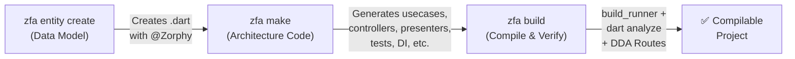
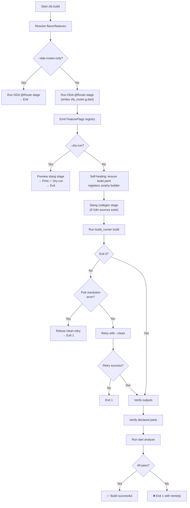

The v5 pipeline is Zuraffa's unified, AI-first generation contract: every feature is built through three sequential commands — **Entity → Make → Build**. This document is the beginner's complete guide to understanding and executing each step, why each exists, and how they connect into a reliable code-generation loop.

---

## Workflow Overview

The three commands form a linear pipeline where each stage consumes the output of the previous one:



**Entity** defines *what* your data looks like. **Make** defines *how* your app is organized around that data. **Build** proves the whole thing compiles.

This contract was established in v5 (see the [V5 Action Plan](v5-action-plan) — M2: "Canonical AI Pipeline Everywhere") to replace the legacy `zfa generate` one-shot command with a three-step flow that gives each stage a clear, single responsibility and a verifiable output.

Sources: [doc/V5_ACTION_PLAN.md](doc/V5_ACTION_PLAN.md#L84-L92), [lib/src/commands/entity_command.dart](lib/src/commands/entity_command.dart#L1-L40), [lib/src/commands/make_command.dart](lib/src/commands/make_command.dart#L37-L42), [lib/src/commands/build_command.dart](lib/src/commands/build_command.dart#L1-L30)

---

## Step 1: Entity — Define Your Data Model

The entity step creates a Zorphy-annotated data class at `lib/src/domain/entities/<name>/<name>.dart`. This is the foundation of the entire pipeline — nothing downstream can generate without it.

### Basic Command

```bash
# Interactive creation (you'll be prompted for fields)
zfa entity create -n User

# Create with inline fields
zfa entity create -n User \
  --field name:String \
  --field email:String? \
  --field age:int

# Build generated code immediately after
zfa build
```

Sources: [doc/ENTITY_GUIDE.md](doc/ENTITY_GUIDE.md#L13-L35), [lib/src/commands/entity_command.dart](lib/src/commands/entity_command.dart#L256-L280)

### What Happens Under the Hood

When you run `zfa entity create`, the command executes this sequence:

1. **Dependency preflight** — Verifies `zorphy_annotation` and `build_runner` are in `pubspec.yaml`. If missing, auto-adds them before writing any files (issue #1322).
2. **Validation gates** — Checks for:
   - Framework export collisions (entity name conflicts with zuraffa core exports like `Credentials`, issue #942)
   - Flutter SDK type collisions (warnings, not refusals — the duplicate may be intentional)
   - Bare Dart keyword field names (e.g. `in:String` is refused; remap with `:json=` syntax, issue #303)
   - Unresolved field types (validates every type is primitive, existing entity, or existing enum, issue #296)
   - Sealed + `--generate-subs` incompatibility (illegal in current zorphy, issue #416)
3. **Convergence check** — If the entity file already exists, the run is a no-op (convergent generation, issue #807/spec 0806).
4. **Zorphy generation** — `EntityCreator` writes the entity file with `@Zorphy` annotation, `part` directives, and JSON serialization support.
5. **Receipt emission** — A proof receipt is written to `.zfa/receipts/` recording the exact bytes generated (issue #807).

Sources: [lib/src/commands/entity_command.dart](lib/src/commands/entity_command.dart#L130-L520), [lib/src/commands/entity_command.dart](lib/src/commands/entity_command.dart#L795-L860)

### Entity Types

| Flag | Purpose | Example |
|------|---------|---------|
| `--sealed` | Create a sealed class for polymorphism | `zfa entity create -n PaymentMethod --sealed` |
| `--non-sealed` | Non-sealed abstract class | `zfa entity create -n BaseEntity --non-sealed` |
| `--kind value_object` | Value object (immutable composition type) | `zfa entity create -n Money --kind value_object` |
| `--json=false` | Disable JSON serialization | `zfa entity create -n CacheEntry --json=false` |
| `--extends Interface` | Implement an interface | `zfa entity create -n Order --extends BaseOrder` |
| `--auto-id` | Auto-generate UUID identity | `zfa entity create -n Session --auto-id` |

Sources: [doc/ENTITY_GUIDE.md](doc/ENTITY_GUIDE.md#L62-L90), [lib/src/commands/entity_command.dart](lib/src/commands/entity_command.dart#L366-L430)

### Generated File Structure

```
lib/src/domain/entities/
└── user/
    ├── user.dart              # @Zorphy annotated source
    ├── user.zorphy.dart       # Generated implementation (copyWith, compareTo, etc.)
    └── user.g.dart            # JSON serialization (if --json enabled)
```

The `.dart` file carries `@Zorphy` annotation — this is the signal `zfa build` uses to know which files need code generation. Sources: [doc/ENTITY_GUIDE.md](doc/ENTITY_GUIDE.md#L37-L50), [lib/src/commands/entity_command.dart](lib/src/commands/entity_command.dart#L430-L470)

---

## Step 2: Make — Generate Architecture Code

The make step generates the full architecture around an entity: usecases, repositories, presenters, controllers, tests, DI registration, and more. It uses a **plugin-based pipeline** where each plugin is a focused code generator.

### Basic Command

```bash
# Standard CRUD slice (preset = usecase, repository, controller, presenter, etc.)
zfa make User --preset=crud

# Individual plugins
zfa make User usecase repository di test

# Full VPC (View-Presenter-Controller) with state and route
zfa make User --vpc --state --route --test
```

Sources: [lib/src/commands/make_command.dart](lib/src/commands/make_command.dart#L37-L50), [doc/v4_vs_v5_comparison.md](doc/v4_vs_v5_comparison.md#L17-L25)

### The Engine Preset (One-Shot)

For pure-Dart data layers (no Flutter UI), the `engine` mode is a one-shot command that chains entity creation through plugin execution:

```bash
zfa make engine Login \
  --methods=get,getList,create,update,delete
```

This auto-creates the entity if missing, generates all data-layer plugins, certifies mocks, runs engine verification, and writes an `engine.receipt.json`. The engine slice is pure Dart — no Flutter-importing plugins are allowed (spec 1002).

Sources: [lib/src/commands/make_command.dart](lib/src/commands/make_command.dart#L610-L700), [lib/src/commands/make_command.dart](lib/src/commands/make_command.dart#L1850-L1950)

### How Make Resolves What to Generate

`zfa make` does **not** run every plugin blindly. It resolves a normalized execution plan:

1. **Plugin selection** — Plugins come from: explicit CLI arguments (`--with=usecase`), preset expansion (`--preset=crud`), or `.zfa.json` config defaults.
2. **Plan resolution** — The `PluginManager.resolvePlan()` normalizes all sources into a definitive list of plugins to activate, with warnings for conflicts.
3. **Pre-flight guard** — Verifies the entity source file exists (unless `--no-entity` or engine mode). Fails fast with a clear error before any code is written.
4. **ID field resolution** — Auto-detects the entity's identity field from the source (instead of hardcoding `id`), enabling correct signatures for entities with custom key fields (issues #294, #307, #508).
5. **Value object detection** — If the entity is a value object, root plugins (repository, usecase, controller, etc.) are dropped with a notice — they don't apply to immutable composition types.
6. **Plugin execution** — `manager.run(context, activePlugins)` executes each plugin in dependency order within a transactional file writer.
7. **Post-passes** — After generation:
   - **Usecase expectation verification** (spec 972): verifies same-plan interface expectations
   - **Provider conformance gate** (spec 979): verifies stub-escape and conformance
   - **Pubspec sync**: auto-adds undeclared dependencies (issue #1265) and ensures `zuraffa:` is declared (issue #1530)
   - **Mock certification** (issue #1194): in mocked tier, certifies emitted mocks by default

Sources: [lib/src/commands/make_command.dart](lib/src/commands/make_command.dart#L650-L1100), [lib/src/commands/make_command.dart](lib/src/commands/make_command.dart#L1010-L1060)

### Plugin Reference

| Plugin | Output | Always Default | Notes |
|--------|--------|:--------------:|-------|
| `usecase` | Usecase classes | ✅ | Core business logic |
| `repository` | Repository interface + impl | ✅ | Data access layer |
| `datasource` | Data source classes | ✅ | Remote/local sources |
| `provider` | Provider classes | ✅ | Dependency injection wiring |
| `di` | DI registrations | ✅ | getIt setup |
| `presenter` | Presenter classes | ❌ | Requires `--vpc` or explicit flag |
| `controller` | Controller classes | ❌ | Requires `--vpc` or explicit flag |
| `view` | Widget views | ❌ | Requires `--vpc` or explicit flag |
| `route` | Route definitions | ✅ | Navigation |
| `state` | State classes | ❌ | Requires `--state` flag |
| `test` | Unit tests | ✅ | Generated test suites |
| `mock` | Mock data sources | ✅ | Mock/mock data emission |
| `cache` | Cache layer | ✅ | Caching strategy |
| `sqlite` | SQLite data source | ❌ | Requires `--sqlite` flag |
| `sync` | Offline sync | ❌ | Requires `--sync` flag |

Sources: [lib/src/config/zfa_config.dart](lib/src/config/zfa_config.dart#L46-L75), [lib/src/commands/make_command.dart](lib/src/commands/make_command.dart#L55-L110)

### Make Tier System

`zfa make` operates in two tiers that control whether certified mocks are generated:

| Tier | Default | Description | Trigger |
|------|:-------:|-------------|---------|
| **MOCKED** | Yes (default) | Generates certified mock datasource; boots on certified mocks with `--dart-define=SIMULATION=true` | Normal `zfa make` with data plugins |
| **COMPILE-ONLY** | No | No mocked tier; slice is compile-green but not demo-green | `--compile-only` flag |

Sources: [lib/src/commands/make_command.dart](lib/src/commands/make_command.dart#L950-L1010), [lib/src/commands/make_command.dart](lib/src/commands/make_command.dart#L1100-L1200)

---

## Step 3: Build — Compile and Verify

The build step runs code generation (`build_runner`), static analysis (`dart analyze`), and DDA route compilation. It is the **verification gate** that proves the pipeline's output is compilable.

### Basic Command

```bash
# Standard build (generates code + analyzes)
zfa build

# Clean build (delete cache first — fixes stale cache errors)
zfa build --clean

# Preview without writing
zfa build --dry-run

# Run only DDA @Route stage
zfa build --dda-routes-only

# Build with a specific feature flavor
zfa build --flavor=premium
```

Sources: [lib/src/commands/build_command.dart](lib/src/commands/build_command.dart#L1-L50), [lib/src/commands/build_command.dart](lib/src/commands/build_command.dart#L330-L400)

### Build Pipeline Stages



Sources: [lib/src/commands/build_command.dart](lib/src/commands/build_command.dart#L55-L200), [lib/src/commands/build_command.dart](lib/src/commands/build_command.dart#L200-L350)

### Build Verification Gates

The build command includes multiple post-build safety nets:

| Gate | Purpose | Issue |
|------|---------|-------|
| **`verifyOutputsOrFail`** | Detects build_runner writing 0 outputs despite `@Zorphy` sources — catches misconfigured `generate_for` globs and missing builder dependencies | #276, #1322 |
| **`verifyDeclaredPartsOrFail`** | Verifies every `part 'x.zorphy.dart'` declaration has a matching file — catches per-file generator failures (e.g., json_serializable failing on one entity) | #379, #1540 |
| **`dart analyze` gate** | Runs analyzer after build; fails on errors by default (use `--no-analyze` to skip) | #395, #1035 |
| **`recoverTrackedGeneratedOutputs`** | Restores git-tracked generated-name files deleted by build_runner — prevents silent orphaning of hand-authored placeholders | #1540 |

Sources: [lib/src/commands/build_command.dart](lib/src/commands/build_command.dart#L660-L1131), [lib/src/commands/build_command.dart](lib/src/commands/build_command.dart#L700-L800)

### Build Flags

| Flag | Description |
|------|-------------|
| `--clean` / `-c` | Delete build cache before building (fixes stale cache errors) |
| `--dry-run` | Preview changes without writing files |
| `--force` / `-f` | Bypass AST merge; regenerate all files from scratch |
| `--analyze` / `-a` | Run `dart analyze` after build (default: on) |
| `--no-analyze` | Skip the analyze gate |
| `--flavor` | Build with a specific feature flavor from `.zfa.json` |
| `--dda-routes` | Run DDA @Route stage (default: on) |
| `--dda-routes-only` | Run ONLY the @Route stage |

Sources: [lib/src/commands/build_command.dart](lib/src/commands/build_command.dart#L16-L50)

---

## The Complete Pipeline in Practice

Here is the canonical flow from zero to a working feature slice:

```bash
# 1. Create the entity (data model)
zfa entity create -n Product \
  --field name:String \
  --field price:double \
  --field inStock:bool

# 2. Generate architecture code around the entity
zfa make Product --preset=crud

# 3. Compile and verify everything
zfa build
```

Each step produces verifiable output:

| Step | Output | Verification |
|------|--------|-------------|
| Entity create | `lib/src/domain/entities/product/` directory | `.zfa/receipts/entity-create-*.json` receipt |
| Make | Usecases, repositories, controllers, tests, DI | `.zfa/receipts/make-*.json` receipt; provider conformance gate |
| Build | `.zorphy.dart`, `.g.dart` files; compiled code | `dart analyze` gate; output verification; declared parts check |

Sources: [lib/src/commands/entity_command.dart](lib/src/commands/entity_command.dart#L500-L560), [lib/src/commands/make_command.dart](lib/src/commands/make_command.dart#L1040-L1100), [lib/src/commands/build_command.dart](lib/src/commands/build_command.dart#L75-L120)

### What Makes v5 Different from v4

If you are migrating from v4's `zfa generate` command, the key differences are:

| Aspect | v4 (`zfa generate`) | v5 (`entity create → make → build`) |
|--------|---------------------|-------------------------------------|
| **Command count** | One monolithic command | Three focused commands |
| **Responsibility** | Everything in one step | Clear separation: model → architecture → verify |
| **Entity creation** | Implicit (part of generate) | Explicit (`zfa entity create`) |
| **Plugin selection** | `--with=view,state,di` flags | `--preset=crud`, `--vpc`, `--state` etc. |
| **Verification** | Manual `dart analyze` | Built-in analyze gate + output verification |
| **Receipts** | Limited | Full proof receipts at every step |
| **Flavors** | Not supported | `--flavor` flag on build |

Sources: [doc/v4_vs_v5_comparison.md](doc/v4_vs_v5_comparison.md#L9-L30), [doc/V5_COMPLETION_SUMMARY.md](doc/V5_COMPLETION_SUMMARY.md#L1-L60)

---

## Common Patterns & Troubleshooting

### Starting a New Feature (Flutter App)

```bash
# 1. Define the data model
zfa entity create -n Order \
  --field id:String \
  --field total:double \
  --field items:List<OrderItem> \
  --field status:OrderStatus

# 2. Generate the full VPC (View-Presenter-Controller) with tests
zfa make Order --vpc --state --route --test

# 3. Verify compilation
zfa build

# If build fails, check:
# - build.yaml includes zorphy builder (zfa build self-heals this)
# - All generated .g.dart / .zorphy.dart files exist
# - dart analyze reports no errors in generated code
```

### Starting a New Feature (Pure Dart)

```bash
# Use engine preset for a one-shot data layer
zfa make engine Product \
  --methods=get,getList,create,update,delete,delete

# This auto-creates the entity, generates all data-layer plugins,
# certifies mocks, and writes engine.receipt.json
```

### Handling Build Failures

| Symptom | Cause | Fix |
|---------|-------|-----|
| `build_runner wrote 0 outputs` | `build.yaml` misconfigured or builder not registered | `zfa build` auto-heals; or run `zfa setup` |
| `dart analyze reported errors` | Generated code has compile errors | Check that entity types exist; run `zfa build --clean` |
| `Part file missing` | Generator failed on one source | Check analyzer output for the specific error |
| `No active plugins to run` | No plugins selected and no defaults enabled | Pass `--preset=crud` or `--with=<plugin>` |
| `Cannot create entity: name collides` | Entity name matches zuraffa core export | Rename entity (e.g. `UserProfile` instead of `User`) |

Sources: [lib/src/commands/build_command.dart](lib/src/commands/build_command.dart#L560-L700), [lib/src/commands/entity_command.dart](lib/src/commands/entity_command.dart#L265-L300), [lib/src/commands/make_command.dart](lib/src/commands/make_command.dart#L730-L770)

### The `--build` Flag on Entity Create

The entity command supports `--build` to automatically trigger `zfa build` after creation:

```bash
zfa entity create -n User --field name:String --build
```

This is controlled by `ZfaConfig.buildByDefault` (default: `false`). When enabled, the full build pipeline runs after every entity creation, including `--dart-format` if `formatByDefault` is also enabled.

Sources: [lib/src/commands/entity_command.dart](lib/src/commands/entity_command.dart#L120-L160), [lib/src/config/zfa_config.dart](lib/src/config/zfa_config.dart#L105-L110)

---

## Reading Progression

For beginners, follow this order to build understanding:

1. **[Overview](1-overview)** — What Zuraffa is and the v5 contract
2. **[Quick Start](2-quick-start)** — Hands-on with the pipeline
3. **[Project Architecture & Layout](3-project-architecture-and-layout)** — Where files live
4. **[Configuration & Project Memory](4-configuration-and-project-memory-zfa-json-zfa)** — `.zfa.json` and `.zfa/`
5. **[This Page](5-canonical-v5-workflow-entity-make-build)** — The canonical pipeline
6. **[CLI Commands & Subcommands](6-cli-commands-and-subcommands)** — Full command reference
7. **[Plugin System Architecture](7-plugin-system-architecture)** — How make plugins work
8. **[Code Generation Engine & Proof Receipts](9-code-generation-engine-and-proof-receipts)** — Verification deep-dive
9. **[TDD Cycle & Spec-Driven Development](13-tdd-cycle-and-spec-driven-development)** — The test-driven variant