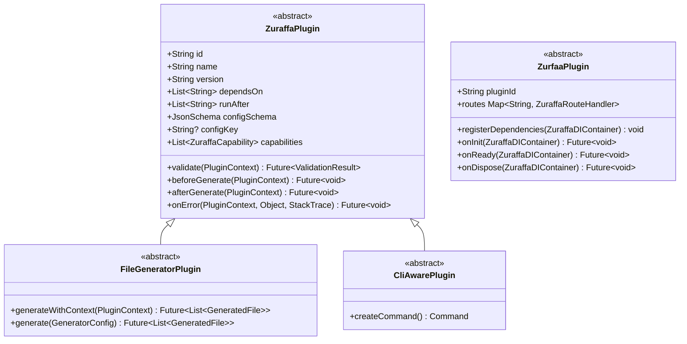
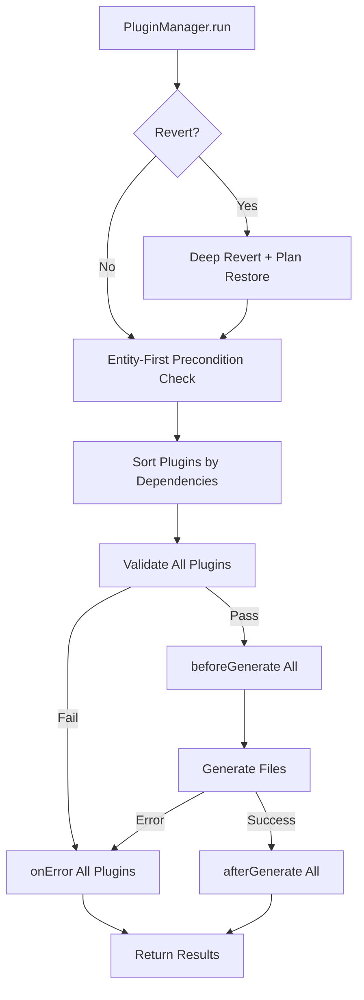
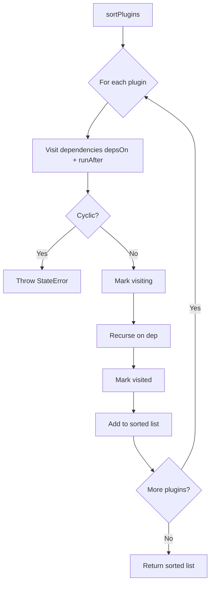
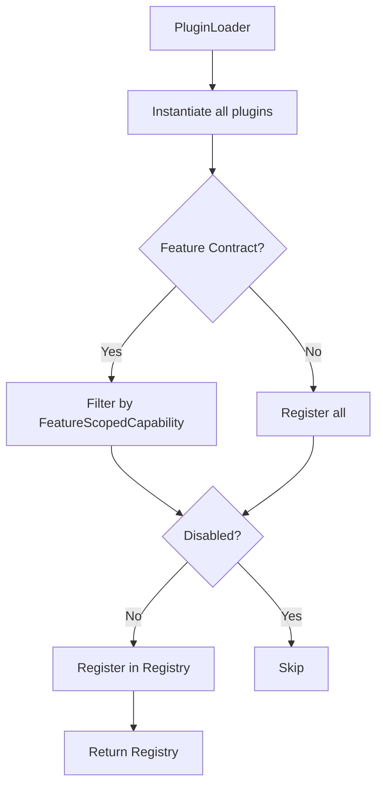

The Zuraffa plugin system is the extensibility backbone that decomposes code generation into isolated, composable units. Each plugin owns a single layer of the architecture — domain, data, presentation, DI, routing, testing — and coordinates through a shared context, a dependency-aware registry, and a deterministic lifecycle. The system serves two distinct audiences: **code-generation plugins** that drive `zfa make` and friends, and **runtime plugins** that compose micro-frontend feature packages into a host application.

## Core Plugin Interfaces

The system is built on a small set of abstract contracts in `lib/src/core/plugin_system/plugin_interface.dart`. Every generation plugin ultimately derives from `ZuraffaPlugin`, which declares identity (`id`, `name`, `version`), dependency directives (`dependsOn`, `runAfter`), a JSON Schema for configuration (`configSchema`), and lifecycle hooks (`validate`, `beforeGenerate`, `afterGenerate`, `onError`). The `configKey` property maps each plugin to its enable-toggle in `.zfa.json` via `ZfaConfig.configKeyForPlugin(id)` [lib/src/core/plugin_system/plugin_interface.dart#L1-L84](lib/src/core/plugin_system/plugin_interface.dart#L1-L84).

For file-producing plugins, `FileGeneratorPlugin` extends `ZuraffaPlugin` with a `generate(GeneratorConfig)` method and a default `generateWithContext(PluginContext)` bridge that translates context data into the legacy generator config, forwarding core flags like `dryRun`, `force`, and `verbose` [lib/src/core/plugin_system/plugin_interface.dart#L42-L71](lib/src/core/plugin_system/plugin_interface.dart#L42-L71). Plugins that also expose CLI commands implement `CliAwarePlugin`, which returns a `Command` instance for automatic registration with the main CLI runner [lib/src/core/plugin_system/cli_aware_plugin.dart#L1-L14](lib/src/core/plugin_system/cli_aware_plugin.dart#L1-L14).

The `ZurfaaPlugin` in `lib/src/core/module/zuraffa_plugin.dart` is a **separate** interface serving a different purpose — it is the runtime contract for micro-frontend feature packages, declaring `pluginId`, `registerDependencies`, `routes`, `onInit`, `onReady`, and `onDispose`. This interface is consumed by `ZuraffaEngine` during app bootstrap, not by the code-generation pipeline [lib/src/core/module/zuraffa_plugin.dart#L1-L109](lib/src/core/module/zuraffa_plugin.dart#L1-L109).

## Plugin Lifecycle

Lifecycle management is handled by `PluginLifecycleStage` (an enum: `validate`, `beforeGenerate`, `afterGenerate`, `error`) and `ValidationResult` (a value type with `isValid`, `message`, and `reasons` fields) in `lib/src/core/plugin_system/plugin_lifecycle.dart` [lib/src/core/plugin_system/plugin_lifecycle.dart#L1-L27](lib/src/core/plugin_system/plugin_lifecycle.dart#L1-L27). `ValidationResult` supports merging via `merge()`, which concatenates reasons and preserves failure status — enabling accumulation across multiple plugins without short-circuiting [lib/src/core/plugin_system/plugin_lifecycle.dart#L18-L26](lib/src/core/plugin_system/plugin_lifecycle.dart#L18-L26).

The lifecycle executes in a strict sequence within `PluginManager.run()` [lib/src/core/plugin_system/plugin_manager.dart#L516-L555](lib/src/core/plugin_system/plugin_manager.dart#L516-L555):

1. **Revert handling** — if `context.core.revert` is true, `_handleRevert()` performs deep entity-level deletion and plan-based restoration
2. **Entity-first preconditions** — validates that an entity exists when generation requires one
3. **Validate** — each sorted plugin's `validate()` is called; the first failure throws `StateError`
4. **Before Generate** — each plugin's `beforeGenerate()` hook fires
5. **Generate** — `FileGeneratorPlugin` instances produce `GeneratedFile` results
6. **On Error** — if generation throws, every plugin's `onError()` receives the error and stack trace
7. **After Generate** — `afterGenerate()` runs for all plugins on success

## Plugin Registry and Dependency Resolution

`PluginRegistry` is a singleton that manages registration, discovery, sorting, and lifecycle orchestration for all plugins [lib/src/core/plugin_system/plugin_registry.dart#L1-L116](lib/src/core/plugin_system/plugin_registry.dart#L1-L116). Its core guarantee is **topological sorting** via `sortPlugins()`, which resolves `dependsOn` and `runAfter` directives using depth-first traversal with cycle detection. If a circular dependency is detected, a `StateError` is thrown immediately [lib/src/core/plugin_system/plugin_registry.dart#L24-L51](lib/src/core/plugin_system/plugin_registry.dart#L24-L51).

Registration supports three modes: `register()` for single plugins (rejects duplicates by id), `registerAll()` for batch registration, and `discover()` which accepts factory functions of type `ZuraffaPluginFactory` [lib/src/core/plugin_system/plugin_registry.dart#L53-L82](lib/src/core/plugin_system/plugin_registry.dart#L53-L82). Query methods include `getById()`, `ofType<T>()` for filtering by subtype, and the `plugins` getter for an unmodifiable view of all registered plugins [lib/src/core/plugin_system/plugin_registry.dart#L84-L113](lib/src/core/plugin_system/plugin_registry.dart#L84-L113).

## Plugin Context and Configuration

`PluginContext` is the shared data carrier passed to every plugin at every lifecycle stage [lib/src/core/plugin_system/plugin_context.dart#L91-L160](lib/src/core/plugin_system/plugin_context.dart#L91-L160). It bundles five concerns:

| Property | Type | Purpose |
|----------|------|---------|
| `core` | `CoreConfig` | Generation metadata (name, project root, output dir, flags) |
| `data` | `Map<String, dynamic>` | Plugin-specific key-value store, schema-validated |
| `sharedData` | `Map<String, dynamic>` | Cross-plugin communication channel |
| `discovery` | `DiscoveryEngine` | File-finding engine with transaction awareness |
| `fileSystem` | `FileSystem` | Abstraction over physical file system |

The `CoreConfig` class carries the typed feature contract (`FeatureContract? feature`) for spec 1098 support and bridges from the legacy `GeneratorConfig` via `CoreConfig.fromOld()` [lib/src/core/plugin_system/plugin_context.dart#L17-L88](lib/src/core/plugin_system/plugin_context.dart#L17-L88).

A critical design decision is the **defensive `get<T>()` method** on `PluginContext`: when a plugin id collides with a schema property name of a different type (notably `service` where `ServicePlugin.id == 'service'` conflicts with `configSchema.properties.service = {type:'string'}`), writing `data['service'] = true` for activation would crash downstream consumers reading `data['service'] as String?`. The fix records activation under a dedicated `__active_<id>` key and makes `get<T>()` return `null` instead of throwing on type mismatch, while `isActive(pluginId)` checks both keys transparently [lib/src/core/plugin_system/plugin_context.dart#L107-L140](lib/src/core/plugin_system/plugin_context.dart#L107-L140).

Two extension properties on `PluginContext` handle feature scoping: `activeFeatureContract` (returns the typed contract from `core.feature`) and `featureId` (derives a `FeatureId?` from the contract), both consumed by slice, xray, and Feature plugins downstream [lib/src/core/plugin_system/plugin_context.dart#L142-L159](lib/src/core/plugin_system/plugin_context.dart#L142-L159).

## Plugin Manager and Plan Resolution

`PluginManager` orchestrates the full generation pipeline [lib/src/core/plugin_system/plugin_manager.dart#L1-L1009](lib/src/core/plugin_system/plugin_manager.dart#L1-L1009). Its main responsibilities are:

- **Plan resolution** via `resolvePlan()` which delegates to `PlanResolver` and applies package-mode filtering
- **Active plugin resolution** via `resolveActivePlugins()` which extracts the plugin set from a plan
- **Context construction** via `buildContext()` which assembles `CoreConfig`, merges schema defaults from `ArgResults` with CLI flags, syncs activation signals, and initializes the transactional file system
- **Execution** via `run()` which runs the full lifecycle on sorted active plugins

### Plan Resolution Flow

`PlanResolver.resolve()` is the single entry point for determining which plugins participate in a generation [lib/src/core/planning/plan_resolver.dart#L1-L292](lib/src/core/planning/plan_resolver.dart#L1-L292). The resolution follows this order:

1. **Preset expansion** — if a `preset` option is given and recognized (checked against `PresetRegistry`), its plugin ids are added to the request set
2. **Explicit ids** — `explicitPluginIds` and `with` options are appended
3. **Flag inference** — generator-style flags (`--usecase`, `--repository`, `--view`, etc.) trigger corresponding plugin additions via `_selectionFromOptions()`
4. **Config defaults** — plugins enabled by default in `ZfaConfig` (via `configKey`) are auto-included
5. **Alias expansion** — `PluginAliasResolver.expandAll()` resolves shorthand names like `data` → `[repository, datasource]` and `vpc` → `[view, presenter, controller]`
6. **Exclusion processing** — `without` options, `--no-<flag>` toggles, and `--compile-only` (issue #1194) are applied as exclusions
7. **Disabled plugin filtering** — `PluginConfig.disabled` set removes permanently disabled plugins
8. **Resolution** — `registry.sortPlugins()` produces the final topologically sorted list
9. **Package-mode filter** — `PluginManager._applyPackageModeFilter()` drops app-only plugins (`route`, `view`, `presenter`, `controller`, `app_shell`) when `PackageMode.isEnabled()` detects a package-shaped project [lib/src/core/plugin_system/plugin_manager.dart#L56-L92](lib/src/core/plugin_system/plugin_manager.dart#L56-L92)

### Plugin Aliases

`PluginAliasResolver` (in `lib/src/core/planning/plugin_alias_resolver.dart`) provides a static map of common shorthand aliases [lib/src/core/planning/plugin_alias_resolver.dart#L1-L60](lib/src/core/planning/plugin_alias_resolver.dart#L1-L60):

| Alias | Expands To |
|-------|-----------|
| `data` | `repository`, `datasource` |
| `vpc` | `view`, `presenter`, `controller` |
| `full-ui` | `view`, `presenter`, `controller`, `state`, `route` |
| `quality` | `test`, `mock`, `di` |
| `gql` | `graphql` (deprecation alias per issue #1149 kill list) |

### Preset Registry

`PresetRegistry` defines named bundles of plugins for common generation patterns [lib/src/core/planning/preset_registry.dart#L1-L125](lib/src/core/planning/preset_registry.dart#L1-L125):

| Preset | Plugins |
|--------|---------|
| `feature` | usecase, repository, datasource, view, presenter, controller, state, di, test |
| `engine` (spec 1002) | usecase, service, provider, repository, datasource, mock, di, test (no Flutter-importing plugins) |
| `crud` | usecase, repository, datasource, mock, di (bundled `di` per issue #348, bundled `mock` per issue #1194) |
| `read-only` | usecase, repository, datasource, mock, di |
| `service-feature` | service, provider, usecase, view, presenter, controller, state, di, test |
| `adaptive-feature` / `platform-feature` | full-stack including routes |

The `GenerationPlan` returned by `resolve()` is an immutable value object carrying `name`, `preset`, `requestedPluginIds`, `pluginIds`, `activePlugins`, `warnings`, and `normalizedOptions` [lib/src/core/planning/generation_plan.dart#L1-L36](lib/src/core/planning/generation_plan.dart#L1-L36). Its `executionOrder` getter maps `activePlugins` to their ids.

## Capability System

Capabilities extend the plugin contract into AI-operable units. `ZuraffaCapability` (defined in `lib/src/core/plugin_system/capability.dart`) declares a `name`, `description`, `inputSchema`, `outputSchema`, and the dual `plan()` / `execute()` methods that allow the kernel to "interview" plugins before committing changes [lib/src/core/plugin_system/capability.dart#L84-L154](lib/src/core/plugin_system/capability.dart#L84-L154).

Key capability types in the system:

| Class | Purpose |
|-------|---------|
| `Effect` | Describes a single file change (path, action, diff, previous content) |
| `EffectReport` | Result of planning a capability execution (planId, changes, validity) |
| `ExecutionResult` | Result of executing a capability (success, files, warnings per spec 0974) |
| `FeatureScopedCapability` | Opt-in protocol for capabilities that serve specific feature contracts |

Each plugin declares its capabilities via the `capabilities` getter. For example, `UseCasePlugin` exposes `CreateUseCaseCapability` and `VerifyUsecaseCapability` [lib/src/plugins/usecase/usecase_plugin.dart#L82-L87](lib/src/plugins/usecase/usecase_plugin.dart#L82-L87), while `RepositoryPlugin` exposes `CreateRepositoryCapability` and `MethodCapability` for method-append operations [lib/src/plugins/repository/repository_plugin.dart#L76-L83](lib/src/plugins/repository/repository_plugin.dart#L76-L83).

`CapabilityInvocationWrapper` (in `lib/src/core/plugin_system/capability_invocation_wrapper.dart`) is the Spec 0996 bridge: it wraps standalone capability invocations (e.g., `zfa di create`, `zfa repository create`) and auto-persists a `proof.v1` receipt into `.zfa/receipts/` after successful execution. Receipt persistence is best-effort — a receipt failure degrades to a warning rather than failing the run [lib/src/core/plugin_system/capability_invocation_wrapper.dart#L42-L50](lib/src/core/plugin_system/capability_invocation_wrapper.dart#L42-L50).

## Plugin Discovery and Loading

`PluginLoader` in `lib/src/cli/plugin_loader.dart` is the entry point that assembles the full registry of built-in plugins [lib/src/cli/plugin_loader.dart#L146-L246](lib/src/cli/plugin_loader.dart#L146-L246). Its `_plugins()` method instantiates every generation plugin with the project's output directory and generator options. The list includes 28+ plugins spanning all architectural layers.

`PluginLoader.buildRegistry()` optionally filters plugins by feature contract using `filterForFeature()` — a plugin is dropped only when at least one of its capabilities implements `FeatureScopedCapability` and refuses the feature [lib/src/cli/plugin_loader.dart#L70-L99](lib/src/cli/plugin_loader.dart#L70-L99). This implements Spec 1098's feature-scoped loading contract.

`DiscoveryEngine` (in `lib/src/core/plugin_system/discovery_engine.dart`) provides file-finding capabilities without hardcoded path assumptions [lib/src/core/plugin_system/discovery_engine.dart#L14-L73](lib/src/core/plugin_system/discovery_engine.dart#L14-L73). It supports both PascalCase and snake_case naming, checks the current transaction's pending operations first, and overlays transaction state on disk reads — enabling transactional file discovery where pending creates/updates/deletes are visible during generation.

## Configuration Layer

`ZfaConfig` (in `lib/src/config/zfa_config.dart`) carries plugin configuration state [lib/src/config/zfa_config.dart#L1-L400](lib/src/config/zfa_config.dart#L1-L400):

| Field | Type | Purpose |
|-------|------|---------|
| `pluginDefaults` | `Map<String, bool>` | Per-plugin enable toggles (keyed by plugin id) |
| `disabledPlugins` | `Set<String>` | Permanently disabled plugin ids |
| `customPresets` | `Map<String, List<String>>` | User-defined generation presets |
| `customAliases` | `Map<String, List<String>>` | User-defined plugin alias mappings |

The `configKeyForPlugin()` static method derives the default config key from a plugin id (e.g., `'di'` → `'diByDefault'`), ensuring consistency between `ZuraffaPlugin.configKey` and `ZfaConfig.isPluginEnabledByDefault()` [lib/src/config/zfa_config.dart#L263-L272](lib/src/config/zfa_config.dart#L263-L272).

`PluginConfig` (also in `lib/src/cli/plugin_loader.dart`) wraps `disabledPlugins` with its own mutable copy to avoid `Unsupported operation` crashes when `zfa plugin enable/disable` mutates the set in place (issue #1586) [lib/src/cli/plugin_loader.dart#L35-L67](lib/src/cli/plugin_loader.dart#L35-L67).

## Micro-Frontend Runtime Contract

ADR-007 (in `doc/adr/007-micro-frontend-plugin-system.md`) defines a second, runtime plugin contract for composing feature packages [doc/adr/007-micro-frontend-plugin-system.md](doc/adr/007-micro-frontend-plugin-system.md). The `ZuraffaEngine` orchestrator (in `lib/src/core/module/`) manages two phases:

1. **Registration phase** — `registerDependencies()` called for every plugin in insertion order; only registration methods are invoked
2. **Init phase** — `onInit()` called for every plugin after all dependencies from all plugins are available

Additional hooks (`onReady`, `onDispose`) were added per Spec 025 — package runtime modules — providing readiness notification after full bootstrap and cleanup on shutdown in reverse registration order [lib/src/core/module/zuraffa_plugin.dart#L71-L109](lib/src/core/module/zuraffa_plugin.dart#L71-L109).

The `McpServerPlugin` (in `lib/src/core/module/mcp_server_plugin.dart`) is a concrete runtime plugin that exposes MCP tools over stdio or SSE protocols, registering them into a `McpToolRegistry` singleton during bootstrap and serving requests post-init [lib/src/core/module/mcp_server_plugin.dart#L140-L228](lib/src/core/module/mcp_server_plugin.dart#L140-L228).

## CLI Flag Surface Contract

`CliFlagSurface` (in `lib/src/core/plugin_system/cli_flag_surface.dart`) is Spec 917's contract for hand-rolled commands whose `ArgParser` uses `allowAnything()` [lib/src/core/plugin_system/cli_flag_surface.dart#L1-L52](lib/src/core/plugin_system/cli_flag_surface.dart#L1-L52). These commands declare their accepted flags via `acceptedFlags`, and the treaty gate verifies that every manifest-advertised `inputSchema` property maps to a real flag — preventing the drift class where a flag is declared but rejected by the dispatch logic.

`resolveServingCommand()` is a helper that navigates a `Command` tree to find the subcommand serving a given capability name, trying the full name, dot-joined variant, leaf segment, and last dot-segment as candidates [lib/src/core/plugin_system/cli_flag_surface.dart#L27-L52](lib/src/core/plugin_system/cli_flag_surface.dart#L27-L52).

## Plan Store (Receipt Persistence)

`PlanStore` (in `lib/src/core/plugin_system/plan_store.dart`) is a singleton responsible for persisting and loading `EffectReport` objects — the machine-readable record of what a generation run would or did produce [lib/src/core/plugin_system/plan_store.dart#L20-L75](lib/src/core/plugin_system/plan_store.dart#L20-L75). It supports dual paths: current plans at `.zfa/plans/<planId>.json` and legacy plans, with automatic fallback. The store is used by `PluginManager._handleRevert()` to restore shared files (route registrations, DI aggregators) to their previous content during deep revert operations.

## Key Data Flow

The complete data flow from CLI invocation to file generation follows this path:

```mermaid
flowchart LR
    CLI["zfa make <Entity>"] --> PL["PluginLoader._plugins()"]
    PL --> BR["PluginLoader.buildRegistry()"]
    BR -->|filterForFeature| PR["PluginRegistry"]
    CLI --> PR
    PR --> RES["PlanResolver.resolve()"]
    RES -->|preset + aliases + defaults + exclusions| PLN["GenerationPlan"]
    PLN --> PM["PluginManager"]
    PM --> RESOL["resolveActivePlugins()"]
    PM --> BLD["buildContext()"]
    BLD --> PC["PluginContext"]
    RESOL --> SRT["registry.sortPlugins()"]
    SRT --> RUN["PluginManager.run()"]
    RUN --> VAL["validate()"]
    VAL --> BEG["beforeGenerate()"]
    BEG --> GEN["generateWithContext()"]
    GEN --> AFT["afterGenerate()"]
    GEN -->|error| ERR["onError()"]
```

## Testing Strategy

The plugin system is tested at multiple levels [test/core/plugin_system/plugin_interface_test.dart](test/core/plugin_system/plugin_interface_test.dart):

| Test File | Scope |
|-----------|-------|
| `test/core/plugin_system/plugin_interface_test.dart` | Interface contracts, default lifecycle behavior |
| `test/core/plugin_system/plugin_registry_test.dart` | Registration, discovery, validation, type filtering |
| `test/core/plugin_system/plugin_registry_lifecycle_test.dart` | Lifecycle hook forwarding (before/after/error) |
| `test/core/plugin_system/plugin_manager_test.dart` | Plan resolution, package-mode filtering, entity-first preconditions |
| `test/core/plugin_system/plugin_context_feature_contract_test.dart` | Typed feature contract propagation (Spec 1114) |
| `test/core/plugin_system/plugin_context_feature_id_test.dart` | Typed FeatureId derivation |
| `test/core/plugin_system/capability_invocation_wrapper_test.dart` | Receipt persistence on standalone invocation (Spec 0996) |
| `test/core/plugin_system/validation_result_test.dart` | Validation result merging |
| `test/core/planning/plan_resolver_test.dart` | Full plan resolution (presets, aliases, defaults, exclusions) |
| `test/core/planning/preset_registry_test.dart` | Preset definitions and engine preset spec 1002 |
| `test/cli/plugin_loader_test.dart` | Plugin loader integration |

Plugins in `lib/src/plugins/*` follow a consistent pattern: implement `FileGeneratorPlugin` + `CliAwarePlugin`, expose `capabilities`, provide a `configSchema`, and bridge `generateWithContext()` to domain-specific generators. Each plugin directory typically contains `capabilities/`, `generators/`, and tests subdirectories [lib/src/plugins/usecase/usecase_plugin.dart](lib/src/plugins/usecase/usecase_plugin.dart).

## Next Steps

- [Plugin Development Guide](8-plugin-development-guide) — Deep dive into building custom generation plugins, including code builder patterns and append strategies
- [Code Generation Engine & Proof Receipts](9-code-generation-engine-and-proof-receipts) — Understand the generation pipeline, receipt schemas, and verification gates
- [CLI Commands & Subcommands](6-cli-commands-and-subcommands) — Reference for all `zfa` commands and their plugin mappings
- [Testing Infrastructure & Test Organization](14-testing-infrastructure-and-test-organization) — Patterns for plugin integration tests