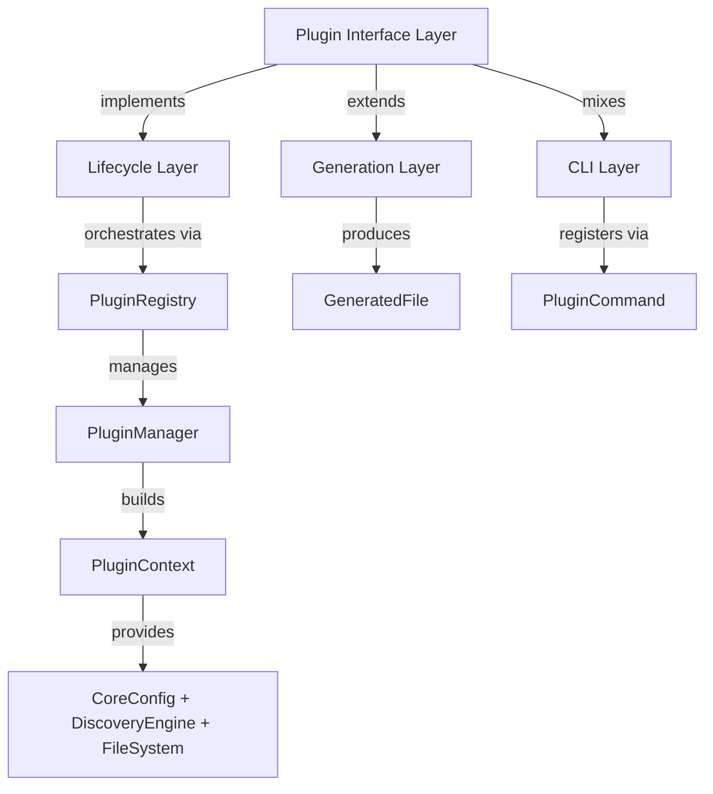
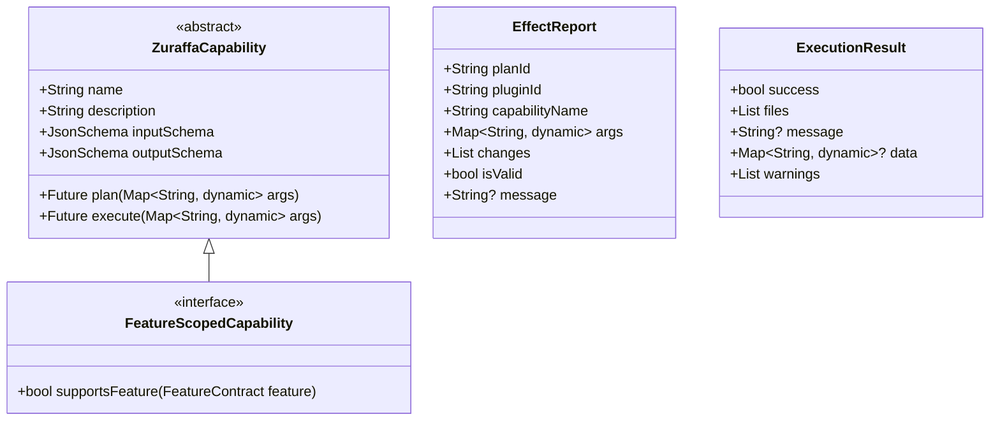
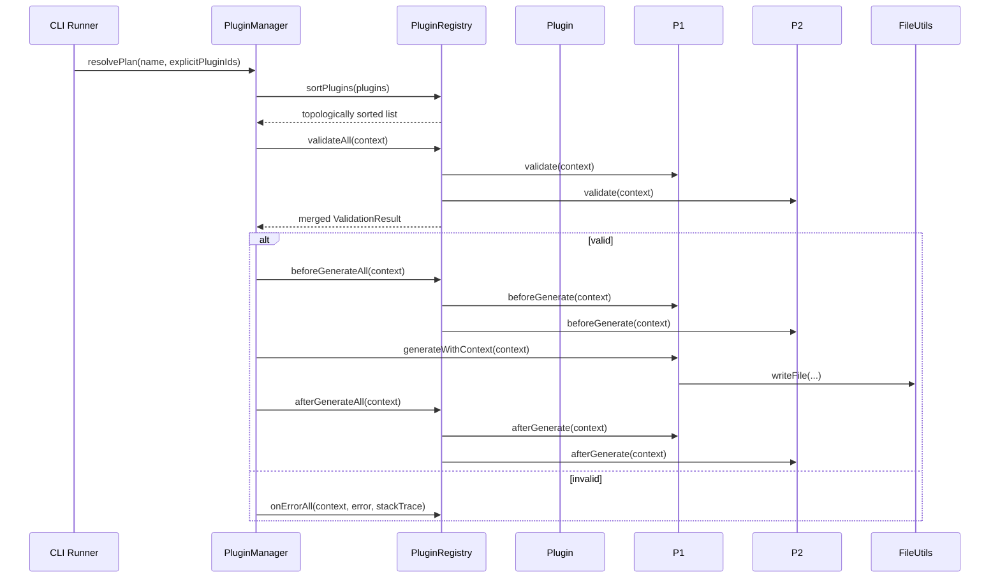
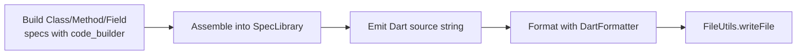
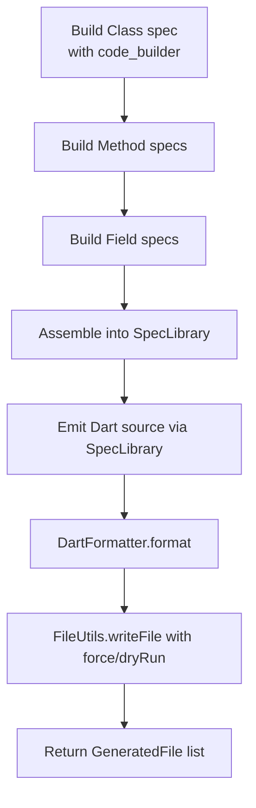

Build third-generation generation plugins for Zuraffa. This guide covers the plugin architecture, lifecycle, code generation patterns, CLI integration, capability system, and testing strategies — grounded in the repository's actual implementation.

## Architecture Overview

Zuraffa plugins are Dart classes that implement interfaces in the core plugin system (`lib/src/core/plugin_system/`) and produce `GeneratedFile` outputs via `FileUtils.writeFile` [lib/src/utils/file_utils.dart](lib/src/utils/file_utils.dart#L1-L194). Plugins are orchestrated through `PluginRegistry` and `PluginManager`, which handle registration, dependency resolution, and lifecycle execution.

The system operates on three abstraction layers:



**Three core interfaces** define every plugin:

| Interface | Location | Purpose |
|---|---|---|
| `ZuraffaPlugin` | `lib/src/core/plugin_system/plugin_interface.dart` | Base: id, name, version, lifecycle hooks |
| `FileGeneratorPlugin` | `lib/src/core/plugin_system/plugin_interface.dart` | Extension: `generate` method producing files |
| `CliAwarePlugin` | `lib/src/core/plugin_system/cli_aware_plugin.dart` | Mixin: exposes a CLI `Command` |

A plugin typically extends `FileGeneratorPlugin` and mixes in `CliAwarePlugin` to be both a code generator and a CLI command — exactly as `UseCasePlugin` [lib/src/plugins/usecase/usecase_plugin.dart](lib/src/plugins/usecase/usecase_plugin.dart#L35-L44) and `DiPlugin` [lib/src/plugins/di/di_plugin.dart](lib/src/plugins/di/di_plugin.dart#L51-L60) demonstrate.

## Plugin Interfaces

### ZuraffaPlugin

The base interface every plugin implements [lib/src/core/plugin_system/plugin_interface.dart](lib/src/core/plugin_system/plugin_interface.dart#L1-L84):

| Member | Type | Required | Purpose |
|---|---|---|---|
| `id` | `String` | Yes | Unique identifier (e.g., `'usecase'`, `'di'`) |
| `name` | `String` | Yes | Human-readable name |
| `version` | `String` | Yes | Semantic version |
| `dependsOn` | `List<String>` | No | Plugin IDs that must run BEFORE this one |
| `runAfter` | `List<String>` | No | Plugin IDs this should run AFTER (soft constraint) |
| `configSchema` | `JsonSchema` | No | JSON Schema for CLI arg generation/validation |
| `configKey` | `String?` | No | Key in `.zfa.json` for default enablement |
| `capabilities` | `List<ZuraffaCapability>` | No | Capabilities exposed for AI/agent use |

Lifecycle methods are all optional with no-op defaults:

- `validate(PluginContext)` — configuration checks, returns `ValidationResult`
- `beforeGenerate(PluginContext)` — pre-generation setup
- `afterGenerate(PluginContext)` — post-generation work
- `onError(PluginContext, Object, StackTrace)` — error handling

### FileGeneratorPlugin

Extends `ZuraffaPlugin` and adds the generation method [lib/src/core/plugin_system/plugin_interface.dart#L58-L73](lib/src/core/plugin_system/plugin_interface.dart#L58-L73):

- **`generate(GeneratorConfig config)`** — legacy method; produces `List<GeneratedFile>`
- **`generateWithContext(PluginContext context)`** — modern method; bridges to `generate` by mapping context to `GeneratorConfig`, respecting `dryRun`, `force`, `verbose`, `revert`, and `outputDir` flags from the context

### CliAwarePlugin

A minimal mixin for CLI integration [lib/src/core/plugin_system/cli_aware_plugin.dart](lib/src/core/plugin_system/cli_aware_plugin.dart#L1-L14):

```dart
abstract class CliAwarePlugin {
  Command createCommand();
}
```

Implement this to have your plugin's command automatically registered with the main Zuraffa CLI runner. The returned command should typically extend `PluginCommand` (see `UseCaseCommand` [lib/src/commands/usecase_command.dart](lib/src/commands/usecase_command.dart#L1-L52) for the pattern).

## Capability System

Plugins expose capabilities for AI agents and standalone CLI invocations via `ZuraffaCapability` [lib/src/core/plugin_system/capability.dart](lib/src/core/plugin_system/capability.dart#L1-L154):



**`FeatureScopedCapability`** (spec 1098) allows plugins to declare which feature contracts they serve. The plugin loader validates scope when loading feature-scoped registries — a plugin with any protocol-declaring capability that refuses a feature is not loaded for that feature [lib/src/core/plugin_system/capability.dart](lib/src/core/plugin_system/capability.dart#L130-L154).

Every plugin declares its capabilities via the `capabilities` getter. For example, `DiPlugin` exposes `CreateDiCapability`, `RegisterCapability`, and `DiVerifyCapability` [lib/src/plugins/di/di_plugin.dart](lib/src/plugins/di/di_plugin.dart#L65-L70).

## Plugin Lifecycle

All plugins implement the `ZuraffaPlugin` lifecycle [lib/src/core/plugin_system/plugin_lifecycle.dart](lib/src/core/plugin_system/plugin_lifecycle.dart#L1-L27):



The lifecycle methods:

| Method | Trigger | Purpose |
|---|---|---|
| `validate` | Before any generation | Configuration checks; returns `ValidationResult.success()` or `.failure(reasons)` |
| `beforeGenerate` | After validation passes | Pre-generation setup (e.g., seeding caches) |
| `generate` | Core generation step | Produce `GeneratedFile` objects (FileGeneratorPlugin only) |
| `afterGenerate` | After all plugins generate | Post-generation work (e.g., receipt persistence) |
| `onError` | On any failure | Error handling and cleanup |

`ValidationResult` supports merging — `validateAll` in `PluginRegistry` accumulates results across all plugins, so partial failures are reported together [lib/src/core/plugin_system/plugin_lifecycle.dart](lib/src/core/plugin_system/plugin_lifecycle.dart#L12-L27).

## Plugin Registry & Sorting

`PluginRegistry` manages registration, dependency resolution, and lifecycle execution [lib/src/core/plugin_system/plugin_registry.dart](lib/src/core/plugin_system/plugin_registry.dart#L1-L116):

**Registration** — three entry points:

```dart
registry.register(plugin);          // single plugin
registry.registerAll(plugins);      // iterable
registry.discover(factories);       // factory functions → instances
```

**Dependency sorting** — topological sort with cycle detection:

```dart
List<ZuraffaPlugin> sortPlugins(Iterable<ZuraffaPlugin> targets)
```

Resolves `dependsOn` (hard dependency — forces ordering) and `runAfter` (soft preference — only orders if both plugins are in target set). Throws `StateError` on circular dependency [lib/src/core/plugin_system/plugin_registry.dart#L30-L57](lib/src/core/plugin_system/plugin_registry.dart#L30-L57).

**Lifecycle execution** — sequential, non-short-circuiting (each plugin runs even if a prior one fails):

```dart
Future<ValidationResult> validateAll(PluginContext context)
Future<void> beforeGenerateAll(PluginContext context)
Future<void> afterGenerateAll(PluginContext context)
Future<void> onErrorAll(PluginContext context, Object error, StackTrace stackTrace)
```

**Important**: `runAfter` is critical for correct ordering. `DiPlugin` declares `runAfter: ['usecase', 'repository', 'service', 'datasource', 'provider', 'view', 'presenter', 'controller', 'mock']` [lib/src/plugins/di/di_plugin.dart](lib/src/plugins/di/di_plugin.dart#L82-L96) — specifically `mock` runs BEFORE `di` to prevent a dual-write conflict on `di/index.dart` within a single transaction (spec 1002).

## Plugin Context

`PluginContext` carries all shared state during generation [lib/src/core/plugin_system/plugin_context.dart](lib/src/core/plugin_system/plugin_context.dart#L100-L161):

| Field | Type | Purpose |
|---|---|---|
| `core` | `CoreConfig` | Name, projectRoot, outputDir, dryRun, force, verbose, revert, feature |
| `data` | `Map<String, dynamic>` | Plugin-specific data (validated against schemas) |
| `sharedData` | `Map<String, dynamic>` | Cross-plugin data (e.g., generated file paths) |
| `discovery` | `DiscoveryEngine` | File discovery without hardcoded paths |
| `fileSystem` | `FileSystem` | Filesystem abstraction (testable) |

**Accessing data safely** — `PluginContext.get<T>()` uses defensive typing [lib/src/core/plugin_system/plugin_context.dart#L137-L144](lib/src/core/plugin_system/plugin_context.dart#L137-L144):

```dart
// Safe: returns null instead of throwing on type mismatch
String? domain = context.get<String>('domain');
bool? noEntity = context.get<bool>('no-entity');
```

**Activation checking** — `isActive(pluginId)` checks both `data[pluginId] == true` and `data['__active_<pluginId>'] == true` to handle the type-collision problem (issue #412) where plugin IDs like `'service'` conflict with string-typed schema properties [lib/src/core/plugin_system/plugin_context.dart#L150-L161](lib/src/core/plugin_system/plugin_context.dart#L150-L161).

## Code Generation Patterns

### File Generation with FileUtils

All file writes go through `FileUtils.writeFile` [lib/src/utils/file_utils.dart](lib/src/utils/file_utils.dart#L15-L95):

```dart
final GeneratedFile result = await FileUtils.writeFile(
  'lib/src/di/services/my_service_di.dart',
  formattedContent,
  'di',
  force: config.force,
  dryRun: config.dryRun,
  verbose: config.verbose,
);
```

| Parameter | Purpose |
|---|---|
| `filePath` | Full relative path to write |
| `content` | Raw content (auto-formatted if `.dart`) |
| `type` | Plugin category (e.g., `'di'`, `'usecase'`, `'mock'`) |
| `force` | Overwrite existing files |
| `dryRun` | No disk writes; return `action: 'skipped'` for existing files |
| `verbose` | Print creation/overwrite messages |
| `revert` | Delete the file instead of writing |

**Return semantics**:

| `action` | Meaning |
|---|---|
| `created` | New file written |
| `overwritten` | Existing file replaced |
| `skipped` | Existed and `force=false`, or revert target missing |
| `deleted` | File removed in revert mode |

### Dart Code Generation with code_builder

For structured Dart code, use `code_builder` with `SpecLibrary` to ensure consistent formatting [lib/src/core/plugin_system/plugin_interface.dart](doc/PLUGIN_DEVELOPMENT.md#L33-L40):



The `AppendExecutor` pattern handles modifying existing classes without overwriting user code [lib/src/core/ast/append_executor.dart](lib/src/core/ast/append_executor.dart#L1-L52):

```dart
final executor = AppendExecutor();
final result = executor.execute(AppendRequest.method(
  source: 'lib/src/di/index.dart',
  className: 'MyRegistration',
  memberSource: '  final MyService _service;',
));
```

| Append Strategy | Use Case |
|---|---|
| `MethodAppendStrategy` | Add methods to existing classes |
| `FieldAppendStrategy` | Add fields |
| `ConstructorAppendStrategy` | Add constructors |
| `ExtensionMethodAppendStrategy` | Add extension methods |
| `FunctionStatementAppendStrategy` | Add top-level functions |
| `ExportAppendStrategy` | Add exports |
| `ImportAppendStrategy` | Add imports |

## CLI Integration

Plugins that expose CLI commands implement `CliAwarePlugin` and extend `PluginCommand` [lib/src/commands/usecase_command.dart](lib/src/commands/usecase_command.dart#L1-L52):

```dart
class MyPluginCommand extends PluginCommand {
  @override
  final MyPlugin plugin;

  MyPluginCommand(this.plugin) : super(plugin) {
    addSubcommand(MyCreateCommand(plugin));
    addSubcommand(MyVerifyCommand(plugin));
  }

  @override
  Set<String> get manualSubcommandNames => const {'create', 'verify'};

  @override
  String get name => 'myplugin';

  @override
  String get description => 'Generate MyPlugin artifacts';
}
```

**Spec 917 compliance** — commands that dispatch with `ArgParser.allowAnything()` (e.g., `zfa slice`, `zfa benchmark`) must implement `CliFlagSurface` to declare their accepted flags for the treaty gate [lib/src/core/plugin_system/cli_flag_surface.dart](lib/src/core/plugin_system/cli_flag_surface.dart#L1-L52):

```dart
abstract class CliFlagSurface {
  Set<String> get acceptedFlags;
}
```

**Subcommand registration rule** (issue #761) — add `manualSubcommandNames` to prevent duplicate registration when first-party commands overlap with capability-derived ones. The `PluginCommand` base class uses this set to skip auto-registration for listed subcommands [lib/src/commands/usecase_command.dart](lib/src/commands/usecase_command.dart#L30-L40).

## Configuration Schema

Each plugin declares a `configSchema` (JSON Schema) that drives CLI argument generation and validation [lib/src/core/plugin_system/plugin_interface.dart](lib/src/core/plugin_system/plugin_interface.dart#L18-L20):

```dart
@override
JsonSchema get configSchema => {
  'type': 'object',
  'properties': {
    'methods': {
      'type': 'array',
      'items': {'type': 'string'},
      'description': 'Methods to generate',
    },
    'type': {
      'type': 'string',
      'enum': ['usecase', 'stream'],
      'default': 'usecase',
    },
  },
};
```

## Testing Strategy

The established pattern from existing plugin tests [test/plugins/usecase/usecase_plugin_test.dart](test/plugins/usecase/usecase_plugin_test.dart#L1-L200) and [test/plugins/di/di_plugin_test.dart](test/plugins/di/di_plugin_test.dart#L1-L120):

```mermaid
flowchart TD
    A[SetUp: create temp dir] --> B[Instantiate plugin with outputDir]
    B --> C[Build GeneratorConfig]
    C --> D[Call plugin.generate(config)]
    D --> E[Assert file existence]
    E --> F[Assert content contains expected strings]
    F --> G[TearDown: delete temp dir]
```

**Standard test pattern**:

| Step | Pattern | Example |
|---|---|---|
| Setup | `Directory.systemTemp.createTemp('zuraffa_<plugin>_')` | Isolated temp directory |
| Plugin instantiation | `Plugin(outputDir: outputDir, options: GeneratorOptions(...))` | With explicit flags |
| Config building | `GeneratorConfig(name: 'Entity', methods: [...], outputDir: outputDir)` | Targeted parameters |
| Assertions | `files.length`, `content.contains('ClassName')`, `file.existsSync()` | Verify generated output |
| Teardown | `tempDir.delete(recursive: true)` | Cleanup |

**Key assertions** for generated files:
- Class name presence: `content.contains('ClassnameUseCase')`
- Type signatures: `content.contains('UseCase<Todo, QueryParams<Todo>>')`
- Dependency injection: `content.contains('final UserService _userService;')`
- File paths: `files.any((f) => f.path.endsWith('user_usecase.dart'))`

**Integration tests** in `test/plugins/*` cover compile verification, structural checks, and end-to-end workflows. See `test/plugins/*_compile_test.dart` for compile-gate patterns.

## Minimal Plugin Walkthrough

The minimal pattern — a plugin that writes a single file [doc/PLUGIN_DEVELOPMENT.md](doc/PLUGIN_DEVELOPMENT.md#L17-L24):

```dart
class MyMinimalPlugin extends FileGeneratorPlugin {
  @override
  String get id => 'myplugin';
  @override
  String get name => 'My Plugin';
  @override
  String get version => '1.0.0';

  @override
  Future<List<GeneratedFile>> generate(GeneratorConfig config) async {
    return [
      await FileUtils.writeFile(
        'lib/src/myplugin_output.dart',
        "const greeting = 'hello from myplugin';",
        'myplugin',
        force: config.force,
        dryRun: config.dryRun,
      ),
    ];
  }
}
```

## Advanced Plugin Walkthrough

For structured code generation using `code_builder` [doc/PLUGIN_DEVELOPMENT.md](doc/PLUGIN_DEVELOPMENT.md#L26-L33):



The `DiPlugin` [lib/src/plugins/di/di_plugin.dart](lib/src/plugins/di/di_plugin.dart#L116-L200) demonstrates the complete advanced pattern: reading context data, resolving feature flags, producing multiple files per entity, and handling `runAfter` dependencies.

## Registration & Integration

To integrate your plugin into Zuraffa's generation pipeline:

```dart
final registry = PluginRegistry.instance;

// Register your plugin
registry.register(MyPlugin(outputDir: 'lib/src'));

// Validate all
final validation = await registry.validateAll(context);
if (!validation.isValid) {
  // Handle validation failures
}

// Run lifecycle
await registry.beforeGenerateAll(context);
// ... generation happens ...
await registry.afterGenerateAll(context);
```

## Checklist for Third-Party Plugins

| # | Requirement | Verification |
|---|---|---|
| 1 | Implement `id`, `name`, `version` | Unique, semver, descriptive |
| 2 | Declare `configSchema` | Valid JSON Schema, drives CLI args |
| 3 | Override `generate` (FileGeneratorPlugin) | Returns `List<GeneratedFile>` |
| 4 | Use `FileUtils.writeFile` for all writes | Respects `force`, `dryRun`, `verbose` |
| 5 | Handle type collisions in context reads | Use `context.get<T>()` not casts |
| 6 | Check `isActive` for plugin flags | Not raw `data[key] == true` (issue #412) |
| 7 | Declare `dependsOn` / `runAfter` correctly | Avoid transaction conflicts |
| 8 | Provide tests for generation | Temp dir + content assertions |
| 9 | Provide append mode tests if modifying existing files | `AppendExecutor` with `AppendRequest` |
| 10 | Implement `CliAwarePlugin` if CLI command needed | Register subcommands properly |
| 11 | Follow `PluginCommand` pattern for CLI | Use `manualSubcommandNames` |
| 12 | Verify compile after generation | Run `dart analyze` on outputs |