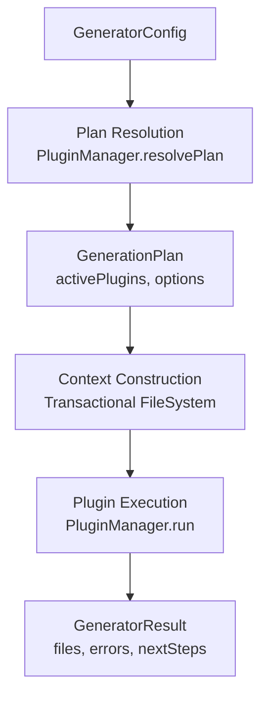
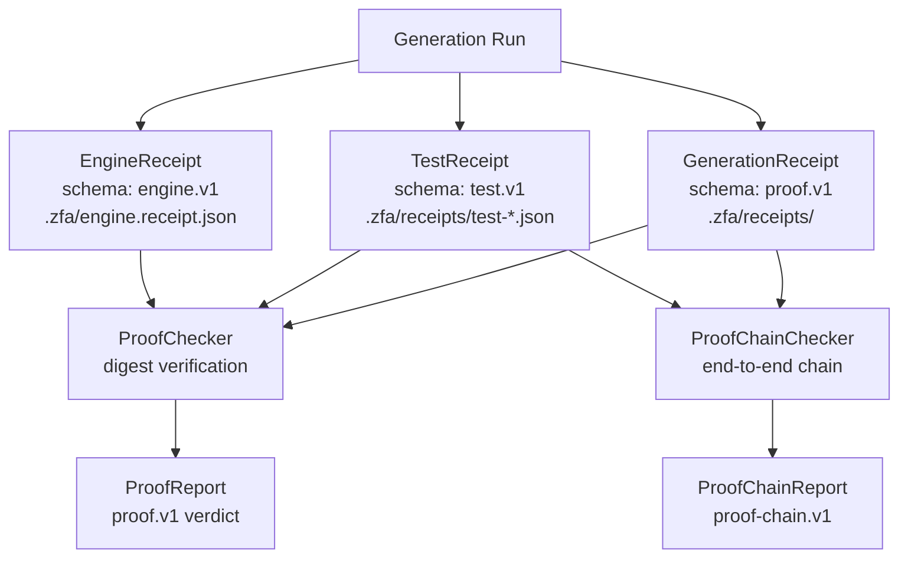
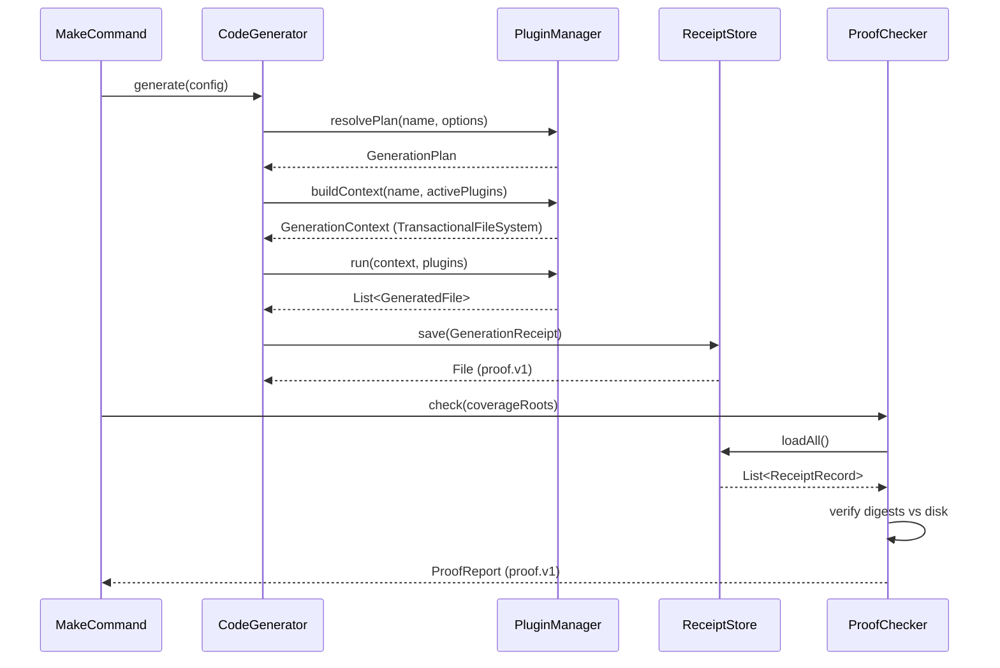

The Code Generation Engine and Proof Receipts system is the backbone of zuraffa's automated code production and its verifiable integrity guarantee. The engine orchestrates plugin-driven code generation from entity specifications, while the proof receipt system provides cryptographic verification that every generated artifact can be traced back to its source — a "proof-carrying generation" model where no file can exist without evidence of its origin.

## Generation Pipeline Architecture

The code generation pipeline follows a plugin-coordinated orchestration pattern centered on the `CodeGenerator` class, which manages the full lifecycle from plan resolution through plugin execution to result aggregation.

### Core Orchestration

`CodeGenerator` (`lib/src/generator/code_generator.dart`) serves as the central coordinator. Its `generate()` method executes a three-phase pipeline:

1. **Plan Resolution** — Normalizes configuration into a `GenerationPlan` via `PluginManager.resolvePlan()`, producing the canonical option contract (kebab-case keys) that all plugins share.
2. **Context Construction** — Builds a `GenerationContext` through `PluginManager.buildContext()`, which establishes the `TransactionalFileSystem` — the transaction-safe file system abstraction that enables atomic generation rollbacks.
3. **Plugin Execution** — Runs the resolved plugins through `PluginManager.run()`, collecting `GeneratedFile` records and producing a `GeneratorResult`.



Sources: [code_generator.dart](lib/src/generator/code_generator.dart#L73-L165)

### Generation Context

`GenerationContext` (`lib/src/core/generation/generation_context.dart`) encapsulates all state and dependencies shared across plugins during a single generation session. It holds:

- **GeneratorConfig** — the canonical configuration (name, output directory, domain, etc.)
- **FileSystem** — an abstracted file system (`FileSystem.create(root:)`) enabling hermetic testing via `FakeFileSystem`
- **ContextStore** — a key-value state store shared across the generation session
- **ProgressReporter** — progress reporting (or `NullProgressReporter` in non-verbose mode)

The factory method `GenerationContext.create()` initializes the file system with a project root and selects an appropriate progress reporter based on verbosity settings.

Sources: [generation_context.dart](lib/src/core/generation/generation_context.dart#L12-L55)

### Generation Plan

`GenerationPlan` (`lib/src/core/planning/generation_plan.dart`) is the normalized execution contract resolved before generation runs. It carries:

| Field | Purpose |
|-------|---------|
| `name` | Entity or target name |
| `preset` | Preset identifier (e.g., `--fail` for engine slice testing) |
| `requestedPluginIds` | Plugins explicitly requested by the caller |
| `pluginIds` | All applicable plugin identifiers |
| `activePlugins` | Resolved `ZuraffaPlugin` instances in execution order |
| `normalizedOptions` | Canonical kebab-case option map shared by all plugins |

Sources: [generation_plan.dart](lib/src/core/planning/generation_plan.dart#L1-L36)

### Code Builder Factory (Core Layer)

The builder layer uses a factory pattern with two tiers. The core builder factory (`lib/src/core/builder/code_builder_factory.dart`) produces AST-level `Library` objects using the `code_builder` package, organized into factories and patterns:

**Factories** produce complete library specifications:

| Factory | Output |
|---------|--------|
| `RepositoryFactory` | Abstract repository interface classes |
| `UseCaseFactory` | Use case classes with execute methods |
| `VpcFactory` | VPC controllers, presenters, and state classes |
| `RouteFactory` | Route handler classes |
| `UsecaseContractFactory` | Usecase contract interfaces |

**Patterns** define reusable AST compositions:

- `RepositoryPatterns` — abstract repository interfaces with typed methods
- `UseCasePatterns` — use case classes with dependency-injected execute methods
- `VpcPatterns` — VPC component patterns
- `CommonPatterns` — shared utilities including entity import resolution and barrel `hide` name generation (issue #942)

Sources: [code_builder_factory.dart](lib/src/core/builder/code_builder_factory.dart#L1-79), [repository_factory.dart](lib/src/core/builder/factories/repository_factory.dart#L1-57), [usecase_factory.dart](lib/src/core/builder/factories/usecase_factory.dart#L1-63)

### Spec Library & Emission

`SpecLibrary` (`lib/src/core/builder/shared/spec_library.dart`) is the emission layer that bridges the AST builder model to actual Dart source code. It wraps `code_builder`'s `Library` emission with three critical capabilities:

1. **Directive ordering** — `orderDirectives: true` ensures consistent import layout
2. **Formatting** — `DartFormatter` with latest language version produces canonical output
3. **Generated markers** — `// GENERATED - DO NOT EDIT` / `// END GENERATED` wraps enable the AST merge engine to identify replaceable regions while preserving hand edits

Sources: [spec_library.dart](lib/src/core/builder/shared/spec_library.dart#L1-80)

### Generator Result Model

`GeneratorResult` (`lib/src/models/generator_result.dart`) and `GeneratedFile` (`lib/src/models/generated_file.dart`) are the output models:

```dart
// GeneratedFile captures what was produced and how
// Spec 1334: skipReason distinguishes 'missing-dependency' (gate failure)
// from 'overwrite-conflict' (benign skip without --force)
class GeneratedFile {
  final String path;     // project-relative POSIX path
  final String type;     // e.g. 'route', 'repository', 'test'
  final String action;   // 'created', 'modified', 'deleted', 'skipped'
  final String? content; // generated source when inline
  final String? skipReason; // Spec 1334 honesty signal
}
```

Sources: [generator_result.dart](lib/src/models/generator_result.dart#L1-26), [generated_file.dart](lib/src/models/generated_file.dart#L1-34)

## Proof Receipt System

The proof receipt system implements proof-carrying generation (issue #807): every generated artifact ships a verifiable receipt, and `zfa proof check` re-derives the proof. The system operates across three receipt layers, each with its own schema and purpose.

### Receipt Architecture Overview



Sources: [proof_checker.dart](lib/src/core/proof/proof_checker.dart#L1-50)

### Generation Receipts (proof.v1)

`GenerationReceipt` (`lib/src/core/project/receipt_store.dart`) is the primary proof record — a timestamped JSON document per generation run stored under `.zfa/receipts/`. Each receipt binds:

- **Content digests** — SHA-256 of every artifact's final on-disk bytes via `GenerationReceiptFile`
- **Spec binding** — SHA-256 of the spec file the artifacts were generated from (`GenerationReceiptSpec`), enabling stale-spec detection
- **Reproducibility** — a one-line `repro` command a human or agent can paste to regenerate
- **Optional extras** — plugin ID, capability name, entity, methodset, run hash, core version (issues #996, #1197)

The `ReceiptStore` manages persistence with three naming schemes:

| Method | Naming Pattern | Use Case |
|--------|---------------|----------|
| `save()` | `$stamp-$cmd-$target.json` | Timestamped run-scoped (default) |
| `saveAs()` | `$name.json` | Stable per-entity (e.g. `state-<entity>.json`) |
| `saveCapability()` | `$plugin-$capability-$entity-$stamp.json` | Standalone capability receipts (#996) |
| `saveNamed()` | `$fileName` with extra fields | Ledger-embedded receipts with plugin-specific data |

Key design principle: **latest-wins semantics** — `ProofChecker.loadAll()` picks the most recent receipt per artifact path; regeneration supersedes the older proof. Corrupted receipts are silently skipped, never fatal — one broken document must not erase the provenance of every healthy artifact.

Sources: [receipt_store.dart](lib/src/core/project/receipt_store.dart#L241-L411)

### Test Receipts (test.v1)

`TestReceipt` (`lib/src/core/project/test_receipt.dart`) implements Spec 980's per-method test receipts. Stored as `test-<entity>.json`, these records map every generated test to:

- The usecase method it exercises (`get`, `create`, `execute`, etc.)
- The acceptance path covered (`success` or `failure`)
- SHA-256 digests of both the test file AND the usecase source it was generated against

This dual-digest binding enables **usecase/test drift detection**: when `ProofChecker` finds that a usecase source's current SHA-256 differs from the digest recorded when the tests were generated, it flags `kindStaleUsecase` with the exact reproduction command.

Sources: [test_receipt.dart](lib/src/core/project/test_receipt.dart#L1-192)

### Engine Receipts (engine.v1 / engine.receipt.v2)

`EngineReceiptWriter` (`lib/src/engine/engine_receipt_writer.dart`) maintains two receipt schemas:

**engine.v1** — `.zfa/engine.receipt.json`: The primary engine slice receipt recording entity digest, generated methods with per-method mock certification status (`mock_certified: bool`), DI wiring (files and getIt types), engine check outcomes, and generated file paths.

**engine.receipt.v2** — `specs/<feature>/tdd/engine.receipt.json`: The cross-pipeline contract (issue #1109, #1014 CERT-GATE) with a minimal schema `{schema, entity, methods: [{name, mock_certified, mock_class}], source_files}`. Key properties:

- `mock_certified: false` is the CERT-GATE signal — a method that was generated but not certified
- Written atomically (temp file → rename) to prevent half-written receipts on crash
- `source_files` sorted for deterministic comparison
- Resolution priority: explicit feature directory → entity scan (newest mtime, alphabetical tie-break)

Sources: [engine_receipt_writer.dart](lib/src/engine/engine_receipt_writer.dart#L1-316)

### Mock Certification

`MockCertifier` (`lib/src/engine/mock_certifier.dart`) implements Spec 1002's per-method certification. A method is certified when three conditions are met simultaneously:

1. The mock datasource file exists at `lib/src/data/datasources/<snake>/<snake>_mock_datasource.dart`
2. The method is declared on it (any `@override` member matching the method name)
3. The seeded mock data fixture exists at `lib/src/data/mock/<snake>_mock_data.dart`

The certifier also extracts the mock class name (e.g., `UserMockDataSource`) from the generated source for the receipt's `mock_class` field.

Sources: [mock_certifier.dart](lib/src/engine/mock_certifier.dart#L1-128)

### Cert-Gate Refusal Receipt

`EngineGateReceipt` (`lib/src/engine/engine_gate_receipt.dart`) implements Spec 1110's philosophy: "Cert refusal reason is a receipt, not an exception." When the engine check gates on a CORE entity that is uncertified/unsatisfied/corrupt/stale, it writes `engine.gate.<Entity>.refused.json` carrying:

- `entity` — the blocked entity
- `reason` — human-readable explanation
- `fix` — the exact recovery command (`zfa mock create <Entity> --certify`)
- `refs` — spec document references
- `command` — the producing command

Two homes: `.zfa/` (engine-check path) and `specs/<feature>/tdd/` (run-engine path). Corrupt refusal receipts are treated as informational — the gate recomputes the verdict live.

Sources: [engine_gate_receipt.dart](lib/src/engine/engine_gate_receipt.dart#L1-153)

## Proof Verification Engine

### ProofChecker (zfa proof check)

`ProofChecker` (`lib/src/core/proof/proof_checker.dart`) is the verification core that re-derives every digest recorded in `.zfa/receipts/` against the current tree. It detects five finding categories:

| Finding Kind | Condition | Actionable |
|---|---|---|
| `modified` | Receipted artifact's digest no longer matches disk | Reproduce via receipt's `repro` command |
| `deleted` | Receipted artifact is missing (unless tombstoned `action: 'delete'`) | Reproduce via receipt's `repro` command |
| `stale_spec` | Spec the artifact was generated from has drifted | Re-run the recorded command |
| `stale_usecase` | Usecase source changed after test generation | Regenerate tests with the recorded command |
| `unprovenanced` | File under audit root has no covering receipt | No receipt exists for this file |
| `manifest_drift` | Repository contract manifest's method table changed | Re-align manifest with interface |
| `manifest_corrupt` | Manifest cannot be parsed | Fix or regenerate the manifest |

The check honors **sanctioned appends** (issue #1327): append-only logs like `cycle-log.md` whose receipts carry a snapshot pass if disk bytes exactly prefix-match the snapshot bytes — a digest mismatch against an append-only log with a snapshot is not drift if the receipted region is intact.

With `coverageRoots`, the checker enters **audit mode**: every file under those roots must be covered by a receipt, or `unprovenanced` findings fire — this is the CI gate for generated-code paths.

Sources: [proof_checker.dart](lib/src/core/proof/proof_checker.dart#L1-520)

### ProofChainChecker (zfa proof chain)

`ProofChainChecker` (`lib/src/core/proof/proof_chain_checker.dart`) validates the entire proof chain end-to-end (issue #1148, VISION-4, EPIC 5), walking `.zfa/receipts/` and `specs/` stores to validate every link: spec → plan → behaviors → gen → verify-red → make → receipt → realize → world.

**Severity semantics** (the issue's hard constraint):

| Severity | Meaning | Exit Impact |
|---|---|---|
| `drift` | Something EXISTS contradicts its proof | Exit 1 |
| `gap` | A chain link does not exist yet | Reported, never exit-failing |
| `info` | Advisory context | No exit impact |

**Seven chain checks** (each with a machine category and count key):

1. `receiptDigest` — receipted artifact digests match disk
2. `behaviorCoverage` — spec behaviors have green cycle-log evidence
3. `testIntegrity` — generated test files exist and their imports resolve
4. `testRuntime` — tests pass when `--run-tests` executes them
5. `routeVerify` — declared routes' verify verdicts pass
6. `usecaseVerify` — usecase entities pass conformance gate
7. `xrayCoverage` — xray coverage kinds are traced

**Exit codes** (SPEC 917): 0 = intact (no drift), 1 = drift, 2 = infrastructure error. Gaps never fail — they are open links reported honestly.

Sources: [proof_chain_checker.dart](lib/src/core/proof/proof_chain_checker.dart#L1-200)

### Verdict Envelope (SPEC 1105)

`VerdictEnvelope` (`lib/src/core/verdict_envelope.dart`) is the canonical `--json` verdict (SPEC 1105, issue #1105). It unifies the drifted envelope shapes (`schema: 1` integers vs `"verdict.v1"` strings vs `cache.verify.v1` ad-hoc) into one versioned schema:

```jsonc
{
  "schema": "zuraffa.verdict.v1",
  "command": "zfa <verb> [args]",
  "verdict": "pass|fail|skip|error|stopped",
  "exit_class": 0|1|2|3|4|64,
  "subject": {"kind": "route|state|usecase|...", "id": "<Entity>"},
  "artifacts": {"created": [...], "modified": [...], "deleted": [...]},
  "receipts": [".zfa/receipts/..."],
  "findings": [{"kind": "...", "fix": "zfa ...", "file": "...", "member": "..."}],
  "drifts": ["..."],
  "details": { /* plugin-specific extras — the ONLY free-form surface */ },
  "timestamp": "2026-09-05T12:00:00.000Z"
}
```

The envelope is the **last stdout line** of a `--json` run; text output above it remains human-readable. `VerdictEnvelope.fromJson` throws `VerdictSchemaException` on any schema value other than `zuraffa.verdict.v1` — old envelopes break loudly, never silently re-interpreted.

Sources: [verdict_envelope.dart](lib/src/core/verdict_envelope.dart#L1-200)

### Proof Command Structure

`ProofCommand` (`lib/src/commands/proof_command.dart`) exposes three subcommands:

| Subcommand | Purpose | Exit Codes |
|---|---|---|
| `proof check` | Verify receipts against current tree | 0 valid, 1 drift |
| `proof chain` | End-to-end chain validation | 0 intact, 1 drift, 2 infra |
| `proof prune` | Delete receipts where ALL artifacts are missing | 0 success, 1 delete failure |

`proof prune` (issue #1378) distinguishes dead receipts (every artifact missing) from partial receipts (some artifacts missing). Partial receipts are **kept** — they may be hand-repairable, and blanket-deleting would hide real drift.

Sources: [proof_command.dart](lib/src/commands/proof_command.dart#L1-388)

## Engine Checker

`EngineChecker` (`lib/src/engine/engine_checker.dart`) implements Spec 1002 deliverable 2: the `zfa engine check` verification core. It performs six verification legs:

1. **Entity existence** — the entity source file must exist
2. **getIt resolution** — every `getIt<T>()` in the entity's DI wiring resolves to a generated class or DI registration file; dangling references produce `danglingGetIt` failures with fix hints
3. **Engine purity** — zero `package:flutter` imports in the slice's lib files and test tree (the exit criterion)
4. **Per-method mock certification** — when methods are supplied, certification status is verified
5. **Receipt verification** (issue #1109, opt-in) — the v2 engine receipt must exist and record no `mock_certified: false`
6. **Static analysis** (issue #1109, opt-in) — `dart analyze` scoped to the entity's slice files

Finding codes include `missingEntity`, `danglingGetIt`, `flutterImport`, `uncertifiedMock`, `uncertifiedCoreEntity`, `staticAnalysis`, `missingReceipt`, and `receiptUncertified` — each carrying an actionable `--> fix:` hint.

Sources: [engine_checker.dart](lib/src/engine/engine_checker.dart#L1-415)

## Engine Receipt Writer

`EngineReceiptWriter` (`lib/src/engine/engine_receipt_writer.dart`) is the auto-receipt system (Spec 1002, deliverable 3). Every `zfa make engine <Entity>` run writes `.zfa/engine.receipt.json` with:

- Entity digest (SHA-256 of the entity source file)
- Methods generated with per-method `mock_certified` status
- Mock artifacts paths (datasource, data, certified aggregate)
- DI wiring (files, getIt types, resolved count)
- Engine check outcome (pass/fail with failures)
- Generated file paths
- Feature attribution (Spec 1098): grouped receipts under `.zfa/receipts/<featureId>/`

Sources: [engine_receipt_writer.dart](lib/src/engine/engine_receipt_writer.dart#L1-316)

## Key Data Flow



Sources: [code_generator.dart](lib/src/generator/code_generator.dart#L166-L265), [proof_checker.dart](lib/src/core/proof/proof_checker.dart#L320-L520)

## Testing Infrastructure

The proof and engine systems are tested at three levels:

**Unit tests** — Exercise components in isolation with hand-written fixture trees:
- `test/engine/mock_certifier_test.dart` — Certification pass/fail conditions for method presence, file existence, and data fixtures
- `test/engine/engine_checker_test.dart` — getIt resolution, purity enforcement, and cert-gate integration
- `test/engine/engine_receipt_writer_test.dart` — Receipt schema validation, honest reporting of uncertified methods, overwrite semantics
- `test/engine/engine_gate_receipt_test.dart` — Refusal receipt write/load round-trip, engine check integration

**Proof verification tests** — Validate the verification system itself:
- `test/core/proof/proof_check_valid_test.dart` — `zfa proof check` on standalone capability receipts (exit 0/1, `valid: true/false` in JSON verdict)

**Integration tests** — Full end-to-end flows through `runZfaSource` subprocess invocation:
- `test/integration/` — Capability receipts, cache, code generation, mock certification, and full entity workflows

Sources: [proof_check_valid_test.dart](test/core/proof/proof_check_valid_test.dart#L1-170), [mock_certifier_test.dart](test/engine/mock_certifier_test.dart#L1-162)

## Cross-Reference: Related Documentation

- **Plugin System Architecture** — Plugin registration, lifecycle, and the `PluginManager` that drives code generation
- **TDD Cycle & Spec-Driven Development** — How specs drive generation and how `zfa tdd run` consumes engine receipts
- **Proof Receipts & Verification Gates** — The verification gate patterns that consume proof receipts
- **State Management & Sync Framework** — How generated state plugins integrate with the receipt system
- **Benchmarking & Performance** — How generation receipts interact with benchmark baselines
- **No-JIT Execution Policy** — How the receipt system behaves under the No-JIT constraint