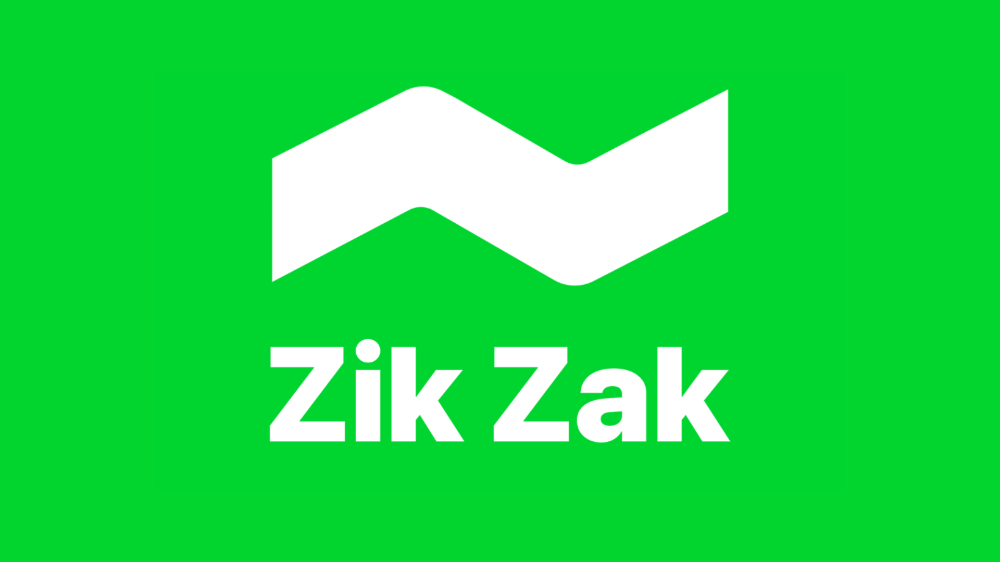

# 🦒 Zuraffa

[](https://pub.dev/packages/zuraffa)
[](https://opensource.org/licenses/MIT)
[](https://arrrrny.github.io/zuraffa/)

**The AI-first Clean Architecture framework for Flutter.**

Zuraffa v5 standardizes code generation around one canonical workflow:

1. `zfa entity create`
2. `zfa make`
3. `zfa build`

`zfa make` is the primary generation surface. `zfa feature` still exists, but only as a wrapper over the normalized feature preset.

---

## Sponsor

[](https://zuzu.dev) [](https://zuzu.dev)

Thanks to ZikZak AI for sponsoring this project!

ZikZak AI is an AI-Powered Price Comparison app that you scan barcodes, and discover amazing savings instantly. Your personal shopping assistant that never sleeps.

<a href="https://apps.apple.com/tr/app/zik-zak/id1563425450"></a>
<a href="https://play.google.com/store/apps/details?id=dev.zuzu.zingo"></a>

## Why Zuraffa?

- **AI-native**: predictable structure for humans and coding agents.
- **Clean Architecture by default**: domain, data, presentation, and DI stay consistent.
- **Zorphy-first entities**: immutable, typed entities generated under a fixed domain root.
- **Deterministic generation**: presets, aliases, `--with`, and `--without` resolve through the same plan system.
- **Result-based failures**: generated code uses `Result<T, AppFailure>` patterns throughout.
- **Hermetic-friendly workflows**: docs and tests are aligned around the current v5 surface.

---

## Installation

Add Zuraffa to your project:

```yaml
dependencies:
  zuraffa: ^5.0.0

dev_dependencies:
  zuraffa: ^5.0.0
  zorphy_annotation: ^1.7.0
  build_runner: ^2.4.0
```

Install the CLI globally if you want `zfa` on your PATH:

```bash
dart pub global activate zuraffa
```

---

## Quick Start: the canonical v5 flow

### 1. Create an entity

Entities are always generated under `lib/src/domain/entities` in v5.

```bash
zfa entity create -n Product \
  --field id:String \
  --field name:String \
  --field price:double \
  --field description:String?
```

### 2. Generate architecture with `make`

Use `zfa make` as the default way to build the architecture around that entity.

```bash
zfa make Product \
  --preset=crud \
  --methods=get,getList,create,update,delete \
  --with=vpc \
  --state \
  --di \
  --test
```

That expands to a normalized plan that generates the domain, data, presentation, and test layers for `Product`.

### 3. Run the build step

```bash
zfa build
```

Use `zfa build` instead of calling `build_runner` directly in docs and agent workflows.

---

## Core v5 commands

| Command                | Role in v5                                 |
| ---------------------- | ------------------------------------------ |
| `zfa entity create`    | Define or update Zorphy entities           |
| `zfa make`             | Canonical architecture generator           |
| `zfa build`            | Run the codegen/build step                 |
| `zfa feature scaffold` | Wrapper over the normalized feature preset |
| `zfa config`           | Manage `.zfa.json` project defaults        |
| `zfa manifest`         | Inspect available plugins and capabilities |
| `zfa doctor`           | Inspect local tooling and project health   |

---

## Fixed project layout

Zuraffa v5 assumes a fixed architecture root:

```text
lib/src/
├── data/
├── di/
├── domain/
│   ├── entities/
│   ├── repositories/
│   └── usecases/
└── presentation/
```

Entity files must live at:

```text
lib/src/domain/entities/{entity_snake}/{entity_snake}.dart
```

Example:

```text
lib/src/domain/entities/product/product.dart
```

---

## `.zfa.json` defaults and `.zfa/` project memory

Zuraffa v5 separates **project defaults** from **project memory**:

- **`.zfa.json`**: active project configuration such as plugin defaults and entity-first rules.
- **`.zfa/`**: the canonical v5 project-memory model for plans, runs, decisions, blueprints, manifests, and future agent context.

A useful mental model for humans and AI agents is:

```text
.zfa.json      -> what this project prefers by default
.zfa/          -> what has been planned, generated, and decided over time
```

### Canonical `.zfa/` layout

```text
.zfa/
├── plans/
├── runs/
├── blueprints/
├── decisions/
├── manifests/
└── context.json
```

During the v5 migration, some internal surfaces may still reference older storage paths. Treat the structure above as the public documentation contract going forward.

---

## `make` first, `feature` second

If you see both commands in the codebase, prefer this rule:

- Use **`zfa make`** when you want explicit control.
- Use **`zfa feature scaffold`** only when you intentionally want the feature preset wrapper.

Equivalent example:

```bash
zfa make Product --preset=feature --plan
```

```bash
zfa feature scaffold Product --plan
```

---

## AI-agent contract

For Zuraffa v5 projects:

- Generate **architecture code** with `zfa`, not by hand.
- Create entities with `zfa entity create`.
- Generate layers with `zfa make`.
- Run `zfa build` after generation.
- Handcraft only manual UI composition/layout zones and normal business implementation details that generation does not own.

### The pipeline rule

If an AI agent is asked to build a feature, it should always start by asking:

1. **Does a new entity need to exist?** → use `zfa entity create`
2. **Does the architecture skeleton need to exist or change?** → use `zfa make`
3. **Do generated annotations/build outputs need to be finalized?** → use `zfa build`

Zuraffa owns the architecture skeleton. Human or agent implementation work should narrow to the remaining business logic, datasource implementation, styling, and manual UI composition after that pipeline runs.

---

## Migration notes

If you are coming from pre-v5 guidance:

- the old one-shot generator command is gone,
- `zfa make` is now the canonical generator,
- `zfa feature` is a wrapper, not the primary public workflow,
- the domain root is fixed to `lib/src/domain`, and
- v5 public docs assume Zorphy-based entities.

See `doc/MIGRATION_GUIDE.md` for a focused migration walkthrough.

---

## Learn more

- `CLI_GUIDE.md`
- `AGENTS.md`
- `SKILL.md`
- `website/docs/intro.md`
- `doc/MIGRATION_GUIDE.md`

Made with 🦒 and ⚡ by the Zuraffa project.
