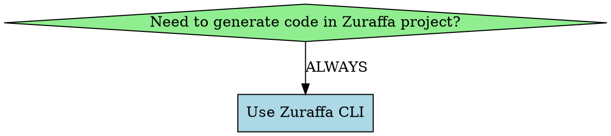

# Zuraffa CLI (zfa) Skill

## Overview

Zuraffa CLI (`zfa`) is the **ONLY** way to generate code in Zuraffa projects. Never manually create entities, never run `build_runner` directly, never write boilerplate by hand.

**Core principle:** Use individual plugin commands for granular control, or `zfa feature scaffold` for complete features. The CLI handles 95% of boilerplate.

## IMPORTANT: Plugin Commands vs generate

The CLI has been refactored to use **individual plugin commands**. Use these instead of `zfa generate`:

| Component | Plugin Command | Legacy (backwards compat) |
|-----------|---------------|--------------------------|
| Entity | `zfa entity create` | N/A |
| UseCase | `zfa usecase create` | `zfa generate` |
| Repository | `zfa repository create` | `zfa generate --data` |
| DataSource | `zfa datasource create` | `zfa generate --datasource` |
| Service | `zfa service create` | `zfa generate --service` |
| Controller | `zfa controller create` | `zfa generate --vpcs` |
| Presenter | `zfa presenter create` | `zfa generate --vpcs` |
| View | `zfa view create` | `zfa generate --vpcs` |
| State | `zfa state create` | `zfa generate --state` |
| DI | `zfa di create` | `zfa generate --di` |
| Mock | `zfa mock create` | `zfa generate --mock` |
| Test | `zfa test create` | `zfa generate --test` |
| Route | `zfa route create` | `zfa generate --route` |
| GraphQL | `zfa graphql create` | `zfa generate --gql` |
| Cache | `zfa cache create` | `zfa generate --cache` |

**Full feature:** Use `zfa feature scaffold` instead of `zfa generate` with multiple flags.

**Multiple plugins:** Use `zfa make` to run multiple plugins explicitly:
```bash
zfa make Product usecase repository datasource --methods=get,list,create
```

**List capabilities:** Use `zfa manifest` to see all available plugins.

## When to Use



**Use when:**
- Creating entities, enums, or data models → Use `zfa entity create`
- Generating CRUD UseCases for entities → Use `zfa usecase create`
- Creating custom UseCases with repositories or services → Use `zfa usecase create`
- Adding data layer (DataRepository, DataSource) → Use `zfa repository create` or `zfa datasource create`
- Setting up caching with dual datasources → Use `zfa cache create` or `zfa datasource create --cache`
- Generating dependency injection files → Use `zfa di create`
- Creating mock data for testing → Use `zfa mock create`
- Generating unit tests for UseCases → Use `zfa test create`
- Adding GraphQL queries/mutations → Use `zfa graphql create`
- Creating services (non-entity operations) → Use `zfa service create`
- Creating routes → Use `zfa route create`
- **Generating full features (all layers)** → Use `zfa feature scaffold`
- **Generating UI layers (Views, Presenters, Controllers, State)** → Use individual plugin commands

**NEVER:**
- Manually create entity files → Use `zfa entity create`
- Run `build_runner` directly → Use `zfa build`
- Manually write repository/usecase boilerplate → Use `zfa usecase create` or `zfa repository create`
- Hand-write View/Presenter/Controller → Use `zfa view create`, `zfa presenter create`, `zfa controller create`
- Use legacy generate for new projects → Use `zfa feature scaffold` or individual plugins

## Quick Reference

### Entity Generation

```bash
# Create entity with fields (NEVER create manually)
zfa entity create -n User --field name:String --field email:String?

# Create enum
zfa entity enum -n Status --value active,inactive,pending

# Create entity from JSON
zfa entity from-json user_data.json

# List entities
zfa entity list

# Build generated code (NEVER run build_runner directly)
zfa build
zfa build --watch
zfa build --clean
```

### Complete Feature Generation (Recommended)

```bash
# Scaffold full feature - domain, data, presentation, tests, DI
zfa feature scaffold -n Product \
  --usecases=get,getList,create,update,delete \
  --datasource \
  --vpcs \
  --di \
  --test

# With caching enabled
zfa feature scaffold -n Product \
  --usecases=get,getList \
  --datasource \
  --cache \
  --vpcs
```

### Individual Plugin Commands (Preferred over generate)

```bash
# Domain Layer
zfa usecase create -n GetProduct --repo=Product
zfa usecase create -n SearchProducts --domain=search --repo=Product --params=Query --returns=List<Product>
zfa usecase create -n ProcessPayment --domain=payment --service=Payment --params=Request --returns=Result

# Repository
zfa repository create -n Product --methods=get,getList,create,update,delete

# DataSource
zfa datasource create -n Product
zfa datasource create -n Product --local
zfa datasource create -n Product --cache

# Service
zfa service create -n Payment --params=PaymentRequest --returns=PaymentResult

# Presentation Layer
zfa presenter create -n Product --methods=get,getList,create
zfa controller create -n Product --methods=get,getList --state
zfa view create -n Product --methods=get,getList --di --state

# State
zfa state create -n Product --methods=get,getList

# DI
zfa di create -n Product --useMock

# Mock & Test
zfa mock create -n Product
zfa test create -n Product --methods=get,create

# Route
zfa route create -n Product --methods=get,getList,create,update,delete

# GraphQL
zfa graphql create -n Product --type=query --returns="id,name,price"

# Cache
zfa cache create -n Product --policy=daily
```

### Legacy: Using generate (Backwards Compatibility Only)

```bash
# generate is kept for backwards compatibility ONLY
# Prefer the plugin commands above or zfa make instead
zfa generate Product --methods=get,getList,create,update,delete --data --vpcs --di
```

### Using make (Multiple Plugins)

```bash
# Run multiple plugins in one command
zfa make Product usecase repository datasource

# With methods and domain
zfa make Product usecase repository --methods=get,list,create --domain=product

## Entity Location Convention

**CRITICAL:** Entities MUST be placed at:
```
lib/src/domain/entities/{entity_snake}/{entity_snake}.dart
```

Example for `Product`:
```
lib/src/domain/entities/product/product.dart
```

**NEVER create this file manually** - always use:
```bash
zfa entity create -n Product --field name:String --field price:double
```

## Available Methods (for entity-based generation)

These methods are used with `zfa usecase create`, `zfa repository create`, `zfa feature scaffold`:

| Method | UseCase Type | Description |
|--------|--------------|-------------|
| `get` | `UseCase` | Get single entity by ID |
| `getList` | `UseCase` | Get all entities |
| `create` | `UseCase` | Create new entity |
| `update` | `UseCase` | Update existing entity |
| `delete` | `CompletableUseCase` | Delete entity by ID |
| `watch` | `StreamUseCase` | Watch single entity changes |
| `watchList` | `StreamUseCase` | Watch all entities changes |

## Plugin Commands Reference

### All Available Plugin Commands

| Command | Description |
|---------|-------------|
| `zfa entity create` | Create Zorphy entities |
| `zfa usecase create` | Generate UseCases |
| `zfa repository create` | Generate Repositories + DataSources |
| `zfa datasource create` | Generate DataSources (remote/local) |
| `zfa service create` | Generate Service interfaces |
| `zfa controller create` | Generate Controller classes |
| `zfa presenter create` | Generate Presenter classes |
| `zfa view create` | Generate View classes |
| `zfa state create` | Generate State classes |
| `zfa di create` | Generate DI registrations |
| `zfa mock create` | Generate Mock data |
| `zfa test create` | Generate Unit tests |
| `zfa route create` | Generate Route definitions |
| `zfa graphql create` | Generate GraphQL operations |
| `zfa cache create` | Generate Cache logic |
| `zfa observer create` | Generate Observer classes |
| `zfa provider create` | Generate Provider classes |
| `zfa feature scaffold` | Scaffold full features (recommended) |
| `zfa manifest` | List all available capabilities |
| `zfa method_append append` | Append method to existing repo/service |

### Feature Scaffold Command

Full feature generation (recommended over legacy generate):

```bash
zfa feature scaffold -n Product \
  --usecases=get,getList,create,update,delete \
  --repository \
  --datasource \
  --vpcs \
  --di \
  --test
```

### Usecase Create Command

| Flag | Description |
|------|-------------|
| `--name`, `-n` | Name of the usecase |
| `--type` | Type: future, stream, completable, sync, background |
| `--repo` | Repository to inject |
| `--service` | Service to inject |
| `--domain` | Domain folder (required for non-entity usecases) |
| `--params` | Parameter type |
| `--returns` | Return type |
| `--methods` | Entity methods: get, list, create, update, delete |

### Repository Create Command

| Flag | Description |
|------|-------------|
| `--name`, `-n` | Name of the entity |
| `--methods` | Methods: get, list, create, update, delete |
| `--data` | Generate repository implementation (default: true) |
| `--datasource` | Generate datasources (default: true) |

### Datasource Create Command

| Flag | Description |
|------|-------------|
| `--name`, `-n` | Name of the datasource |
| `--local` | Generate local datasource instead of remote |
| `--cache` | Enable caching |

### View/Presenter/Controller Create Commands

| Flag | Description |
|------|-------------|
| `--name`, `-n` | Name of the entity |
| `--methods` | Methods: get, list, create, update, delete |
| `--di` | Generate with DI integration |
| `--state` | Generate with State integration |

## Use Case Types

Used with `zfa usecase create --type`:

| Type | Description | Use When |
|------|-------------|----------|
| `future` (default) | Async request-response operations | CRUD, API calls |
| `stream` | Real-time data streams | WebSocket, Firebase listeners |
| `background` | CPU-intensive work on isolates | Image processing, crypto |
| `completable` | No return value | Delete, logout, clear cache |
| `sync` | Synchronous operations | Validation, calculations, transformations |

## Repository vs Service

**Use Repository (--repo) for:**
- CRUD operations on entities
- Data persistence/retrieval
- Entity-centric operations
- Cache/database access

**Use Service (--service) for:**
- External API integrations
- Third-party service calls
- Business logic not involving entities
- Payment gateways, auth providers

## Layer Structure

```
lib/src/
├── domain/                    # Pure Dart business logic
│   ├── entities/              # Business objects (NEVER create manually)
│   ├── repositories/          # Repository interfaces (contracts)
│   ├── services/              # Service interfaces (alternative to repos)
│   └── usecases/              # Business operations
│       ├── {entity}/          # Entity-specific usecases
│       └── {domain}/          # Domain-specific usecases
├── data/                      # External dependencies
│   ├── datasources/          # Data source implementations
│   │   └── {entity}/
│   │       ├── graphql/       # GraphQL operations
│   │       ├── {entity}_datasource.dart
│   │       └── {entity}_remote_datasource.dart
│   ├── providers/             # Service provider implementations
│   └── repositories/          # Repository implementations
├── presentation/              # UI layer (use --vpcs)
│   └── pages/
│       └── {entity}/
│           ├── {entity}_view.dart
│           ├── {entity}_presenter.dart
│           ├── {entity}_controller.dart
│           └── {entity}_state.dart
└── di/                        # Dependency injection
    ├── datasources/
    ├── repositories/
    ├── usecases/
    └── index.dart
```

## Common Workflows

### Workflow 1: Complete Feature with Scaffold (Recommended)

```bash
# One command - generates EVERYTHING (recommended)
zfa feature scaffold -n Product \
  --usecases=get,getList,create,update,delete \
  --repository \
  --datasource \
  --vpcs \
  --di \
  --test

# Build the generated entities
zfa build

# That's it - feature complete
```

### Workflow 2: Domain First, Then UI (Individual Plugins)

```bash
# 1. Create entity
zfa entity create -n Product --field name:String --field price:double
zfa build

# 2. Generate repository + datasources
zfa repository create -n Product --methods=get,getList,create,update,delete

# 3. Generate usecases
zfa usecase create -n Product --methods=get,getList,create,update,delete

# 4. Generate UI layer
zfa view create -n Product --methods=get,getList,create --di --state
zfa presenter create -n Product --methods=get,getList,create
zfa controller create -n Product --methods=get,getList,create --state

# 5. Generate DI
zfa di create -n Product

# 6. Implement DataSource (manual - only this part)
```

### Workflow 3: Custom UseCase with Orchestrator

```bash
# 1. Create atomic UseCases
zfa usecase create -n ValidateCart --repo=Cart --domain=checkout --params=CartId --returns=bool
zfa usecase create -n CreateOrder --repo=Order --domain=checkout --params=OrderData --returns=Order
zfa usecase create -n ProcessPayment --service=Payment --domain=checkout --params=PaymentData --returns=Receipt

# 2. Orchestrate them
zfa usecase create -n ProcessCheckout \
  --usecases=ValidateCart,CreateOrder,ProcessPayment \
  --domain=checkout \
  --params=CheckoutRequest \
  --returns=Order

# 3. Generate UI for orchestrator
zfa presenter create -n ProcessCheckout --domain=checkout
zfa controller create -n ProcessCheckout --domain=checkout --state
```

### Workflow 4: Adding Method to Existing Entity

```bash
# Add watch method to existing repository
zfa repository create -n Product --methods=watch --append

# Add corresponding usecase
zfa usecase create -n WatchProduct --repo=Product --domain=product --params=String --returns=Stream<Product> --type=stream

# If UI exists, regenerate presenter/controller
zfa presenter create -n Product --methods=watch --force
zfa controller create -n Product --methods=watch --force
```

## Cache Policies

| Policy | Description | Use Case |
|--------|-------------|----------|
| `DailyCachePolicy` | Cache expires after 24 hours | Data that updates daily |
| `AppRestartCachePolicy` | Cache valid only during app session | Config data, user preferences |
| `TtlCachePolicy` | Custom expiration duration | Fine-grained cache control |

## File Naming Conventions

| Type | Pattern | Example |
|------|---------|---------|
| Entity | `{entity_snake}.dart` | `product.dart` |
| Repository | `{entity_snake}_repository.dart` | `product_repository.dart` |
| Service | `{service}_service.dart` | `payment_service.dart` |
| Provider | `{service}_provider.dart` | `payment_provider.dart` |
| UseCase | `{action}_{entity_snake}_usecase.dart` | `get_product_usecase.dart` |
| DataSource | `{entity_snake}_datasource.dart` | `product_datasource.dart` |
| RemoteDataSource | `{entity_snake}_remote_datasource.dart` | `product_remote_datasource.dart` |
| View | `{entity_snake}_view.dart` | `product_view.dart` |
| Presenter | `{entity_snake}_presenter.dart` | `product_presenter.dart` |
| Controller | `{entity_snake}_controller.dart` | `product_controller.dart` |
| State | `{entity_snake}_state.dart` | `product_state.dart` |

## JSON Configuration

### Entity-Based Configuration
```json
{
  "name": "Product",
  "methods": ["get", "getList", "create", "update", "delete", "watchList"],
  "data": true,
  "vpc": true,
  "state": true,
  "cache": true,
  "cachePolicy": "daily",
  "di": true,
  "test": true
}
```

### Custom UseCase Configuration
```json
{
  "name": "SearchProduct",
  "domain": "search",
  "repo": "Product",
  "params": "Query",
  "returns": "List<Product>",
  "type": "usecase"
}
```

## Common Mistakes

| Mistake | Fix |
|---------|-----|
| Creating entity files manually | Use `zfa entity create -n EntityName` |
| Running `dart run build_runner build` | Use `zfa build` |
| Hand-writing repository boilerplate | Use `zfa repository create` or `zfa usecase create` |
| Manually writing View/Controller | Use `zfa view create` and `zfa controller create` |
| Using legacy generate for new code | Use `zfa feature scaffold` or individual plugin commands |
| Entity not found errors | Ensure entity exists at `lib/src/domain/entities/{entity_snake}/{entity_snake}.dart` |
| Files not overwritten | Use `--force` flag to overwrite existing files |
| Missing repository methods | Use `zfa repository create` with `--methods` or `--append` |
| Cache not working | Call `initAllCaches()` before DI setup in `main()` |
| Tests failing | Run `zfa build` to generate entity code first |
| DI not working | Call `setupDependencies(getIt)` after cache initialization |

## Golden Rules

1. **NEVER create entity files manually** → Always use `zfa entity create`
2. **NEVER run build_runner directly** → Always use `zfa build`
3. **NEVER write boilerplate by hand** → Always use plugin commands or `zfa feature scaffold`
4. **NEVER manually create View/Presenter/Controller** → Use `zfa view create`, `zfa presenter create`, `zfa controller create`
5. **PREFER plugin commands over legacy generate** → Use `zfa usecase create`, `zfa repository create`, etc.
6. **ALWAYS use CLI for all code generation** → One command, complete layers

## Troubleshooting

### Entity Not Found
```
Error: Entity 'Product' not found at expected path
```
**Fix:** Create entity first:
```bash
zfa entity create -n Product --field name:String
zfa build
```

### Overwriting Files
Use `--force` flag:
```bash
zfa usecase create -n Product --methods=get,getList --force
```

### Preview Generation
```bash
# Use --dry-run with any command
zfa usecase create -n Product --methods=get --dry-run
```

### Check Available Capabilities
```bash
zfa manifest --format json
```

## Advanced Features

### Polymorphic Pattern
Generate abstract base + concrete variants + factory:
```bash
zfa usecase create -n SparkSearch \
  --type=stream \
  --variants=Barcode,Url,Text \
  --domain=search \
  --repo=Search \
  --params=Spark \
  --returns=Listing
```

### GraphQL with Custom Fields
```bash
zfa graphql create -n Order --type=query --returns="id,createdAt,customer{id,name},items{id,quantity,price}"
```

### Sync UseCase for Validation
```bash
zfa usecase create -n ValidateEmail --type=sync --params=String --returns=bool
```

Generates:
```dart
class ValidateEmailUseCase extends SyncUseCase<bool, String> {
  @override
  bool execute(String email) {
    return RegExp(r'^[\w-\.]+@([\w-]+\.)+[\w-]{2,4}$').hasMatch(email);
  }
}
```

### Append Method to Existing Repository
```bash
zfa method_append append -n WatchProduct --repo=Product --returns=Stream<Product> --params=String
```

### Using Manifest to Discover Capabilities
```bash
# List all available plugins and their capabilities
zfa manifest --format json

# For MCP integration
zfa manifest --format mcp
```

## CLI vs Manual Work

| Task | CLI Command | Manual? |
|------|-------------|---------|
| Create entity | `zfa entity create` | ❌ NEVER |
| Build code | `zfa build` | ❌ NEVER |
| Generate full feature | `zfa feature scaffold` | ❌ NEVER |
| Generate UseCases | `zfa usecase create` | ❌ NEVER |
| Generate Repository | `zfa repository create` | ❌ NEVER |
| Generate DataSource | `zfa datasource create` | ❌ NEVER |
| Generate Service | `zfa service create` | ❌ NEVER |
| Generate View | `zfa view create` | ❌ NEVER |
| Generate Presenter | `zfa presenter create` | ❌ NEVER |
| Generate Controller | `zfa controller create` | ❌ NEVER |
| Generate State | `zfa state create` | ❌ NEVER |
| Generate DI | `zfa di create` | ❌ NEVER |
| Generate tests | `zfa test create` | ❌ NEVER |
| Implement DataSource logic | N/A | ✅ Only manual part |
| Customize View UI | N/A | ✅ After generation |

**The CLI handles 95% of boilerplate. Only implement business logic and customize UI.**

## Manifest Command (List All Capabilities)

Use `zfa manifest` to see all available plugins and their input/output schemas:

```bash
# JSON format for parsing
zfa manifest --format json

# MCP format for AI integration
zfa manifest --format mcp
```

(End of file - total ~570 lines)
